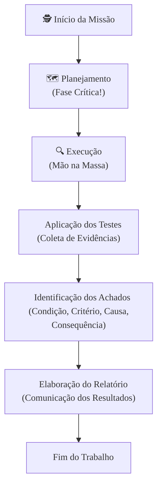

### Olá, futuro(a) aprovado(a)! Vamos desvendar a Auditoria para o Cebraspe!

Pense na auditoria como um "check-up" de confiança. Sabe quando você leva o carro para uma revisão completa antes de uma viagem longa? A auditoria faz exatamente isso, mas com os processos de uma empresa ou órgão público. O objetivo é verificar se tudo está funcionando como deveria. 🧐

---

### ### Auditoria vs. Controle Interno: O Carro e o Mecânico

Essa é a "pegadinha" clássica do Cebraspe! Para não cair mais nela, vamos usar uma analogia simples: imagine que a sua empresa é um carro de última geração.

* **Controle Interno:** São os **sistemas de segurança que já vêm de fábrica** no carro. 🚗
    * O cinto de segurança, os freios ABS, o airbag, os sensores de estacionamento... tudo aquilo que a própria fabricante (a gestão da empresa) instalou para evitar problemas (riscos) e garantir que o carro atinja seu objetivo (chegar ao destino em segurança).
    * O famoso **COSO** é basicamente o "manual de engenharia" desses sistemas de segurança, dividido em 5 partes:
        1.  **Ambiente de Controle:** A "atitude" do dono do carro. Ele se preocupa com segurança? A cultura da empresa valoriza a honestidade e as regras?
        2.  **Avaliação de Riscos:** Pensar nos perigos da estrada. Buracos, chuva, outros motoristas... A empresa precisa identificar o que pode dar errado.
        3.  **Atividades de Controle:** As ações práticas de segurança. Afivelar o cinto, pisar no freio, seguir o GPS. São as senhas, as aprovações, as conferências.
        4.  **Informação e Comunicação:** O painel do carro. As luzes de alerta, o velocímetro. É como a empresa comunica o que é importante para todos.
        5.  **Monitoramento:** As revisões periódicas que o próprio dono faz. Verificar o óleo, calibrar os pneus. A empresa também precisa checar se seus controles estão funcionando.

* **Auditoria Interna:** É o **mecânico especialista e independente** que você contrata para fazer um check-up completo. 🔧
    * O mecânico **não é parte do carro**. Ele não desenhou o freio ABS nem o airbag. Sua função é **avaliar** se esses sistemas (os controles internos) estão funcionando perfeitamente.
    * Para garantir um laudo honesto, ele precisa ser **independente**. Ele reporta os problemas diretamente a você, o dono do carro (o Conselho de Administração), e não ao motorista do dia a dia (a gerência).

#### Foco Cebraspe: Não caia nessas armadilhas!

| "Pegadinha" Clássica do Cebraspe | A Verdade (para você gabaritar) |
| :--- | :--- |
| 🕵️ "A auditoria interna é parte do controle interno." | **ERRADO!** A auditoria **AVALIA** o controle interno. Lembre-se: o mecânico não é uma peça do carro! |
| 🛡️ "Um bom controle interno garante segurança absoluta e elimina todos os riscos." | **ERRADO!** Ele garante segurança **RAZOÁVEL**. Nenhum sistema é 100% à prova de falhas. Pode haver erro humano, fraudes combinadas (conluio) ou até mesmo o "chefe" mandando ignorar uma regra. |

---

### ### Tipos de Auditoria: Qual o Foco do Check-up?

Existem diferentes "check-ups", cada um com um objetivo específico. O Cebraspe adora trocar os nomes e os focos. Memorize assim:

| Tipo de Auditoria | Foco Principal | Pergunta-Chave | Analogia do Carro 🚗 |
| :--- | :--- | :--- | :--- |
| **Financeira** 🧾 | **Fidedignidade Contábil** | O dinheiro e os bens estão registrados corretamente? | O check-up verifica se o valor do carro e os gastos com combustível estão corretos no seu controle financeiro. |
| **Conformidade** ⚖️ | **Legalidade e Normas** | As regras e leis estão sendo seguidas? | O check-up verifica se o carro está com a documentação em dia (IPVA, licenciamento) e se você respeitou as leis de trânsito. |
| **Operacional** 🚀 | **Desempenho (os "4 Es")** | Estamos usando bem nossos recursos e alcançando os resultados? | O check-up avalia o desempenho do carro: está gastando pouco combustível (**Economia/Eficiência**)? Chegou ao destino (**Eficácia**)? A viagem resolveu o seu problema (**Efetividade**)? |

#### Foco Cebraspe: Os "4 Es" da Auditoria Operacional

A banca vai dizer que verificar a "economicidade" é auditoria de conformidade. **Errado!** Se falou em um dos "Es", a auditoria é **OPERACIONAL**.

* **Economia:** Gastar o mínimo possível para obter os recursos. 💸
* **Eficiência:** Fazer mais com menos (ex: mais km por litro de gasolina). ⛽
* **Eficácia:** Atingir o objetivo que foi planejado. 🏁
* **Efetividade:** Gerar o impacto real e positivo esperado na sociedade. ✨

---

### ### O Processo de Auditoria: Planejando a Viagem

Toda auditoria segue um roteiro, como planejar uma viagem.

#### As 3 Fases da Auditoria

1.  **Planejamento 🗺️:** A fase **mais importante!** É aqui que você define o destino (objetivos), traça a rota (escopo) e estuda o mapa para prever problemas (riscos). Um mau planejamento leva a uma auditoria fracassada.
2.  **Execução 🚗:** A viagem em si. Você dirige pela rota definida, coleta provas (tira fotos, guarda recibos) e aplica os testes planejados.
3.  **Relatório 💌:** A "prestação de contas" da viagem. Você escreve um relatório (como um cartão-postal detalhado) contando o que viu, o que deu certo, o que deu errado e o que sugere para a próxima viagem.

#### Os Instrumentos do Auditor

* **Papéis de Trabalho 📝:** Seu "diário de bordo". Todas as anotações, documentos, planilhas e evidências que provam o trabalho que você fez.
* **Achado de Auditoria 🔎:** É quando você encontra algo diferente do que o "mapa" (a regra, o critério) dizia. Para ser um achado completo, ele precisa ter os **"4 Cs"**:
    * **C**ondição: O que você encontrou? ("A ponte está quebrada").
    * **C**ritério: Como deveria ser? ("O mapa dizia que a ponte estava aberta").
    * **C**ausa: Por que está assim? ("Houve um deslizamento de terra").
    * **C**onsequência: E daí? Qual o impacto? ("Vamos nos atrasar e perder a reunião").
* **Relatório de Auditoria:** O produto final, que comunica os "achados" e as conclusões. Ele só tem valor se for baseado em **evidências suficientes** (quantidade) e **apropriadas** (qualidade).

### ### Mapa Mental do Processo de Auditoria

Aqui está um resumo visual para fixar o fluxo principal do trabalho de auditoria.

### **Classe:** A
### **Conteúdo:** Auditoria: Auditoria e Controle Interno

---

### **1. Auditoria e Controle Interno**

> #### **TEORIA-ALVO**
> A **Auditoria** é um processo sistemático, independente e documentado para obter evidência objetiva e avaliá-la para determinar a extensão na qual os critérios de auditoria são atendidos. No contexto de TI, a Auditoria de Sistemas avalia a adequação e a eficácia dos controles que garantem a confidencialidade, a integridade e a disponibilidade dos sistemas de informação.
>
> * **Controle Interno:** Conforme o modelo **COSO (Committee of Sponsoring Organizations of the Treadway Commission)**, o controle interno é um processo conduzido pela estrutura de governança, administração e outros profissionais da entidade, e desenvolvido para proporcionar **segurança razoável** com respeito à realização dos objetivos relacionados a operações, divulgação (relatórios) e conformidade.
>     * **Componentes do COSO:** O framework COSO estabelece cinco componentes integrados do controle interno:
>         1.  Ambiente de Controle
>         2.  Avaliação de Riscos
>         3.  Atividades de Controle
>         4.  Informação e Comunicação
>         5.  Atividades de Monitoramento
> * **Relação entre Auditoria e Controle Interno:**
>     * A **Auditoria Interna** é uma atividade independente e objetiva de avaliação e de consultoria, desenhada para adicionar valor e melhorar as operações de uma organização. Ela avalia a eficácia dos processos de governança, gerenciamento de riscos e **controles internos**.
>     * A Auditoria Interna constitui a **Terceira Linha de Defesa** no modelo de governança, responsável por fornecer avaliação independente à alta administração sobre a eficácia da primeira (gestão operacional) e da segunda (supervisão de riscos e controles) linhas de defesa.

> #### **FOCO CEBRASPE (Pontos de Atenção e "Pegadinhas")**
> > * **Auditoria Interna vs. Controle Interno:** A banca frequentemente afirmará que a Auditoria Interna é parte do controle interno da organização. **ERRADO**. A Auditoria Interna **avalia** o sistema de controle interno, mas, para manter sua independência e objetividade, ela não é considerada parte dele. A Auditoria Interna é um componente da **estrutura de governança**.
> > * **Segurança Razoável vs. Absoluta:** O controle interno, por mais bem desenhado que seja, proporciona segurança **razoável (*reasonable assurance*)**, e não absoluta, quanto ao alcance dos objetivos. A banca pode afirmar que um sistema de controle interno eficaz elimina todos os riscos. **ERRADO**. Existem limitações inerentes, como erro humano, conluio entre agentes e decisões gerenciais que se sobrepõem aos controles.
> > * **Posicionamento da Auditoria Interna:** A independência é o atributo mais crítico da função de Auditoria Interna. Ela deve se reportar funcionalmente ao mais alto nível da organização (e.g., Conselho de Administração, Comitê de Auditoria) para garantir sua autonomia em relação às áreas que audita.

---

### **Classe:** A
### **Conteúdo:** Tipos de Auditoria

---

### **2. Tipos de Auditoria**

> #### **TEORIA-ALVO**
> As auditorias governamentais, conforme as Normas Internacionais de Entidades Fiscalizadoras Superiores (ISSAI) e as práticas do Tribunal de Contas da União (TCU), são classificadas em três tipos principais, de acordo com seus objetivos.
>
> * **Auditoria Financeira (ou de Demonstrações Contábeis):**
>     * **Objetivo:** Expressar uma opinião sobre se as demonstrações financeiras de uma entidade foram elaboradas, em todos os aspectos relevantes, em conformidade com um arcabouço de relatório financeiro aplicável. O foco é na **fidedignidade** e na correção dos registros contábeis e financeiros.
>     * **Exemplo em TI:** Auditoria para verificar se os ativos de software e hardware estão corretamente registrados e avaliados no balanço da entidade.
> * **Auditoria de Conformidade (ou de Regularidade):**
>     * **Objetivo:** Expressar uma opinião sobre se as atividades, transações financeiras e informações de uma entidade estão, em todos os aspectos relevantes, em conformidade com as leis, normas e regulamentos que a regem. O foco é na **legalidade, legitimidade e regularidade** dos atos de gestão.
>     * **Exemplo em TI:** Auditoria para verificar se o processo de contratação de um serviço de nuvem seguiu as regras da Lei nº 14.133/2021 e se o tratamento de dados pessoais no sistema está em conformidade com a LGPD.
> * **Auditoria Operacional (ou de Desempenho):**
>     * **Objetivo:** Examinar a **economicidade, eficiência, eficácia e efetividade** (os "4 Es") das operações, programas ou atividades de uma organização. O foco é na avaliação do **desempenho da gestão** e na identificação de oportunidades de melhoria.
>     * **Exemplo em TI:** Auditoria para avaliar se os recursos de um novo sistema de informação estão sendo utilizados de forma eficiente e se os resultados do sistema (e.g., redução do tempo de atendimento ao cidadão) estão sendo eficazes para atingir os objetivos propostos.

> #### **FOCO CEBRASPE (Pontos de Atenção e "Pegadinhas")**
> > * **Distinção do Foco de Cada Auditoria:** A banca vai confundir os objetivos. É mandatório associar:
> >     * **Financeira → Fidedignidade Contábil**
> >     * **Conformidade → Legalidade e Aderência a Normas**
> >     * **Operacional → Desempenho e os "4 Es"**
> >     * A banca afirmará, por exemplo, que "uma auditoria que visa verificar a economicidade de uma contratação de TI é uma auditoria de conformidade". **ERRADO**. A economicidade é um dos "Es" da auditoria **operacional**.
> > * **Os "4 Es" da Auditoria Operacional:** O candidato deve conhecer o significado de cada "E": **Economia** (minimizar o custo dos insumos), **Eficiência** (relação produto/insumo), **Eficácia** (grau de alcance dos objetivos) e **Efetividade** (impacto final gerado na sociedade).

---

### **Classe:** A
### **Conteúdo:** O Processo de Auditoria: Planejamento e Instrumentos

---

### **3. O Processo de Auditoria: Planejamento e Instrumentos**

> #### **TEORIA-ALVO**
> O processo de auditoria é dividido em fases, sendo o planejamento a etapa fundamental para o sucesso do trabalho. A execução do processo gera um conjunto de instrumentos e documentos que formalizam o trabalho do auditor.
>
> * **Fases da Auditoria:** As três fases principais de um trabalho de auditoria são:
>     1.  **Planejamento:** Fase em que se define o escopo, os objetivos, a materialidade, a abordagem e os recursos da auditoria. Envolve a obtenção de conhecimento sobre a entidade auditada, a realização de uma avaliação preliminar dos riscos e dos controles internos para determinar a natureza, a época e a extensão dos procedimentos de auditoria a serem aplicados.
>     2.  **Execução:** Fase de aplicação dos procedimentos de auditoria definidos no planejamento. Envolve a coleta de evidências por meio de testes de controle e procedimentos substantivos.
>     3.  **Relatório:** Fase de comunicação dos resultados, conclusões e recomendações da auditoria para as partes interessadas.
> * **Instrumentos da Auditoria:**
>     * **Papéis de Trabalho:** O conjunto de todos os documentos, registros e arquivos que constituem a evidência do trabalho realizado pelo auditor. Servem para suportar as conclusões do relatório e demonstrar que a auditoria foi planejada e executada de acordo com as normas.
>     * **Achado de Auditoria:** É o resultado da comparação entre a **situação encontrada** (a condição) e o **critério** de auditoria (o que deveria ser). Um achado de auditoria completo deve conter, no mínimo, quatro atributos essenciais (os "4 Cs"):
>         * **Condição:** A situação encontrada, o "o que é".
>         * **Critério:** A norma, o padrão ou o estado esperado, o "o que deveria ser".
>         * **Causa:** A razão da divergência entre a condição e o critério.
>         * **Consequência (ou Efeito):** O impacto ou o risco decorrente da divergência.
>     * **Matriz de Achados:** Instrumento utilizado no planejamento para consolidar os achados, suas causas, efeitos e as propostas de recomendação.
>     * **Relatório de Auditoria:** O produto final e o principal instrumento de comunicação da auditoria.

> #### **FOCO CEBRASPE (Pontos de Atenção e "Pegadinhas")**
> > * **Importância do Planejamento:** É incorreto afirmar que a execução é a fase mais importante. **ERRADO**. O **planejamento** é a fase mais crítica, pois um trabalho mal planejado levará a uma execução ineficaz e a conclusões potencialmente inválidas. O planejamento da auditoria deve ser baseado em uma avaliação de riscos.
> > * **Atributos do Achado de Auditoria:** A banca frequentemente testa o conhecimento sobre os "4 Cs". Uma questão pode apresentar um achado incompleto (e.g., que descreve a condição e o critério, mas não a causa e o efeito) e questionar sua validade ou completude.
> > * **Evidência de Auditoria:** Todas as conclusões e opiniões expressas no relatório de auditoria devem ser fundamentadas em **evidência suficiente e apropriada**. A suficiência refere-se à **quantidade** de evidência; a apropriação, à sua **qualidade** (relevância e fidedignidade).
