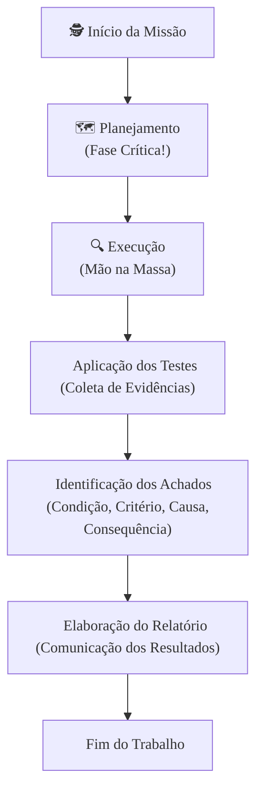

### Olá, futuro(a) aprovado(a)! Vamos desvendar a Auditoria para o Cebraspe!

Pense na auditoria como um "check-up" de confiança. Sabe quando você leva o carro para uma revisão completa antes de uma viagem longa? A auditoria faz exatamente isso, mas com os processos de uma empresa ou órgão público. O objetivo é verificar se tudo está funcionando como deveria. 🧐

---

### ### Auditoria vs. Controle Interno: O Carro e o Mecânico

Essa é a "pegadinha" clássica do Cebraspe! Para não cair mais nela, vamos usar uma analogia simples: imagine que a sua empresa é um carro de última geração.

* **Controle Interno:** São os **sistemas de segurança que já vêm de fábrica** no carro. 🚗
    * O cinto de segurança, os freios ABS, o airbag, os sensores de estacionamento... tudo aquilo que a própria fabricante (a gestão da empresa) instalou para evitar problemas (riscos) e garantir que o carro atinja seu objetivo (chegar ao destino em segurança).
    * O famoso **COSO** é basicamente o "manual de engenharia" desses sistemas de segurança, dividido em 5 partes:
        1.  **Ambiente de Controle:** A "atitude" do dono do carro. Ele se preocupa com segurança? A cultura da empresa valoriza a honestidade e as regras?
        2.  **Avaliação de Riscos:** Pensar nos perigos da estrada. Buracos, chuva, outros motoristas... A empresa precisa identificar o que pode dar errado.
        3.  **Atividades de Controle:** As ações práticas de segurança. Afivelar o cinto, pisar no freio, seguir o GPS. São as senhas, as aprovações, as conferências.
        4.  **Informação e Comunicação:** O painel do carro. As luzes de alerta, o velocímetro. É como a empresa comunica o que é importante para todos.
        5.  **Monitoramento:** As revisões periódicas que o próprio dono faz. Verificar o óleo, calibrar os pneus. A empresa também precisa checar se seus controles estão funcionando.

* **Auditoria Interna:** É o **mecânico especialista e independente** que você contrata para fazer um check-up completo. 🔧
    * O mecânico **não é parte do carro**. Ele não desenhou o freio ABS nem o airbag. Sua função é **avaliar** se esses sistemas (os controles internos) estão funcionando perfeitamente.
    * Para garantir um laudo honesto, ele precisa ser **independente**. Ele reporta os problemas diretamente a você, o dono do carro (o Conselho de Administração), e não ao motorista do dia a dia (a gerência).

#### Foco Cebraspe: Não caia nessas armadilhas!

| "Pegadinha" Clássica do Cebraspe | A Verdade (para você gabaritar) |
| :--- | :--- |
| 🕵️ "A auditoria interna é parte do controle interno." | **ERRADO!** A auditoria **AVALIA** o controle interno. Lembre-se: o mecânico não é uma peça do carro! |
| 🛡️ "Um bom controle interno garante segurança absoluta e elimina todos os riscos." | **ERRADO!** Ele garante segurança **RAZOÁVEL**. Nenhum sistema é 100% à prova de falhas. Pode haver erro humano, fraudes combinadas (conluio) ou até mesmo o "chefe" mandando ignorar uma regra. |

---

### ### Tipos de Auditoria: Qual o Foco do Check-up?

Existem diferentes "check-ups", cada um com um objetivo específico. O Cebraspe adora trocar os nomes e os focos. Memorize assim:

| Tipo de Auditoria | Foco Principal | Pergunta-Chave | Analogia do Carro 🚗 |
| :--- | :--- | :--- | :--- |
| **Financeira** 🧾 | **Fidedignidade Contábil** | O dinheiro e os bens estão registrados corretamente? | O check-up verifica se o valor do carro e os gastos com combustível estão corretos no seu controle financeiro. |
| **Conformidade** ⚖️ | **Legalidade e Normas** | As regras e leis estão sendo seguidas? | O check-up verifica se o carro está com a documentação em dia (IPVA, licenciamento) e se você respeitou as leis de trânsito. |
| **Operacional** 🚀 | **Desempenho (os "4 Es")** | Estamos usando bem nossos recursos e alcançando os resultados? | O check-up avalia o desempenho do carro: está gastando pouco combustível (**Economia/Eficiência**)? Chegou ao destino (**Eficácia**)? A viagem resolveu o seu problema (**Efetividade**)? |

#### Foco Cebraspe: Os "4 Es" da Auditoria Operacional

A banca vai dizer que verificar a "economicidade" é auditoria de conformidade. **Errado!** Se falou em um dos "Es", a auditoria é **OPERACIONAL**.

* **Economia:** Gastar o mínimo possível para obter os recursos. 💸
* **Eficiência:** Fazer mais com menos (ex: mais km por litro de gasolina). ⛽
* **Eficácia:** Atingir o objetivo que foi planejado. 🏁
* **Efetividade:** Gerar o impacto real e positivo esperado na sociedade. ✨

---

### ### O Processo de Auditoria: Planejando a Viagem

Toda auditoria segue um roteiro, como planejar uma viagem.

#### As 3 Fases da Auditoria

1.  **Planejamento 🗺️:** A fase **mais importante!** É aqui que você define o destino (objetivos), traça a rota (escopo) e estuda o mapa para prever problemas (riscos). Um mau planejamento leva a uma auditoria fracassada.
2.  **Execução 🚗:** A viagem em si. Você dirige pela rota definida, coleta provas (tira fotos, guarda recibos) e aplica os testes planejados.
3.  **Relatório 💌:** A "prestação de contas" da viagem. Você escreve um relatório (como um cartão-postal detalhado) contando o que viu, o que deu certo, o que deu errado e o que sugere para a próxima viagem.

#### Os Instrumentos do Auditor

* **Papéis de Trabalho 📝:** Seu "diário de bordo". Todas as anotações, documentos, planilhas e evidências que provam o trabalho que você fez.
* **Achado de Auditoria 🔎:** É quando você encontra algo diferente do que o "mapa" (a regra, o critério) dizia. Para ser um achado completo, ele precisa ter os **"4 Cs"**:
    * **C**ondição: O que você encontrou? ("A ponte está quebrada").
    * **C**ritério: Como deveria ser? ("O mapa dizia que a ponte estava aberta").
    * **C**ausa: Por que está assim? ("Houve um deslizamento de terra").
    * **C**onsequência: E daí? Qual o impacto? ("Vamos nos atrasar e perder a reunião").
* **Relatório de Auditoria:** O produto final, que comunica os "achados" e as conclusões. Ele só tem valor se for baseado em **evidências suficientes** (quantidade) e **apropriadas** (qualidade).

### ### Mapa Mental do Processo de Auditoria

Aqui está um resumo visual para fixar o fluxo principal do trabalho de auditoria.

### **Classe:** A
### **Conteúdo:** Compliance: Conceito e Princípios Fundamentais

---

### **1. Compliance: Conceito e Princípios Fundamentais**

> #### **TEORIA-ALVO**
> **Compliance**, derivado do verbo em inglês *to comply*, significa estar em conformidade com, e fazer cumprir, o conjunto de leis, regulamentos, normas e diretrizes, tanto externas quanto internas, aplicáveis às atividades de uma organização. No contexto da gestão pública, o *compliance* está intrinsecamente ligado aos conceitos de integridade, governança e gestão de riscos.
>
> * **Objetivo:** O objetivo primário de um programa de *compliance* é mitigar os riscos de sanções legais ou regulatórias, perdas financeiras e danos à reputação que uma organização pode sofrer como resultado do descumprimento de suas obrigações. Além disso, busca-se promover uma cultura organizacional de ética e integridade.
> * **Pilares do Compliance:** Um programa de *compliance* eficaz, conforme diretrizes internacionais (como as da norma ISO 37301, que sucedeu a ISO 19600), se apoia em pilares fundamentais:
>     1.  **Comprometimento da Alta Administração (*Tone at the Top*):** O apoio visível, inequívoco e contínuo da mais alta liderança da organização é o pilar essencial para a efetividade do programa.
>     2.  **Avaliação de Riscos de Compliance:** Identificação, análise e avaliação dos riscos de descumprimento das obrigações da organização.
>     3.  **Controles Internos e Procedimentos:** Implementação de políticas, procedimentos e controles para prevenir, detectar e responder aos riscos de *compliance*.
>     4.  **Treinamento e Comunicação:** Capacitação e comunicação contínua para todos os níveis da organização sobre as políticas e os procedimentos de *compliance*.
>     5.  **Monitoramento, Auditoria e Reporte:** Verificação contínua da eficácia do programa e existência de canais seguros para o reporte de suspeitas de violações (canal de denúncias).

> #### **FOCO CEBRASPE (Pontos de Atenção e "Pegadinhas")**
> > * **Compliance vs. Auditoria:** Esta é uma distinção conceitual crítica. **Compliance** é uma função de natureza primariamente **preventiva**, que busca garantir que a organização opere em conformidade (atua na primeira e segunda linhas de defesa). A **Auditoria Interna** é uma função de avaliação **independente e a posteriori**, que verifica a eficácia dos processos de governança, gestão de riscos e controles, incluindo o programa de *compliance* (atua na terceira linha de defesa). A banca frequentemente atribuirá ao *compliance* a função de auditoria, ou vice-versa.
> > * **Escopo do Compliance:** É incorreto afirmar que *compliance* se refere apenas ao cumprimento de leis externas. **ERRADO**. O escopo do *compliance* abrange também o cumprimento de **normas, políticas, códigos de conduta e procedimentos internos** definidos pela própria organização.
> > * **"Tone at the Top":** A banca testará o entendimento de que um programa de *compliance* é ineficaz se for apenas um esforço do "chão de fábrica". O sucesso do programa depende fundamentalmente do exemplo e do comprometimento inequívoco da alta administração.

---

### **Classe:** A
### **Conteúdo:** O Programa de Compliance (Integridade) na Gestão Pública

---

### **2. O Programa de Compliance (Integridade) na Gestão Pública**

> #### **TEORIA-ALVO**
> No âmbito da Administração Pública Federal brasileira, o programa de *compliance* é formalmente denominado **Programa de Integridade**. Sua implementação é uma diretriz da política de governança, estabelecida principalmente pelo **Decreto nº 9.203/2017**.
>
> * **Definição:** Um Programa de Integridade consiste em um conjunto estruturado de medidas institucionais voltadas para a prevenção, detecção, punição e remediação de práticas de corrupção, fraudes, irregularidades e outros desvios éticos e de conduta.
> * **Eixos do Programa de Integridade (conforme normativos de referência da CGU):**
>     1.  **Comprometimento e Apoio da Alta Administração:** Demonstração de liderança e apoio ao programa.
>     2.  **Existência de uma Unidade Responsável pela Integridade:** Designação formal de uma área para coordenar a estruturação, execução e monitoramento do programa.
>     3.  **Análise e Gestão de Riscos de Integridade:** Identificação, análise e tratamento dos riscos que podem comprometer a integridade da organização.
>     4.  **Monitoramento e Controles:** Estruturação e monitoramento contínuo dos controles internos para mitigar os riscos de integridade.
> * **Risco de Integridade:** Define-se como a vulnerabilidade institucional que pode favorecer ou facilitar a prática de atos de corrupção, fraudes ou desvios de conduta, e que pode ser causada por falhas nos controles internos.
> * **Instrumentos de Integridade:** Incluem o plano de integridade, o código de ética e conduta, as políticas de controle de acesso e segurança da informação, e os canais de denúncia.

> #### **FOCO CEBRASPE (Pontos de Atenção e "Pegadinhas")**
> > * **Decreto nº 9.203/2017:** Este é o principal ato normativo a ser conhecido. Ele estabelece a Política de Governança da Administração Pública Federal e torna mandatória a instituição de Programas de Integridade pelos órgãos e entidades.
> > * **Relação com a Lei Anticorrupção (Lei nº 12.846/2013):** A Lei Anticorrupção, embora focada na responsabilização de pessoas jurídicas por atos contra a administração pública, estabelece que a existência de um programa de integridade efetivo será considerada como um **fator atenuante** na aplicação das sanções. Isso cria um forte incentivo para que empresas que se relacionam com o governo também implementem seus programas.
> > * **Integridade vs. Governança:** A integridade é um dos **princípios** fundamentais da governança pública, e o Programa de Integridade é um dos **mecanismos** para fortalecer a governança.

---

### **Classe:** A
### **Conteúdo:** Normas de Referência para Compliance de TI

---

### **3. Normas de Referência para Compliance de TI**

> #### **TEORIA-ALVO**
> Para a área de Tecnologia da Informação, o *compliance* exige a aderência a um conjunto específico de normas e *frameworks* que tratam da segurança da informação, da governança de TI e da proteção de dados.
>
> * **Família ISO/IEC 27000:**
>     * **ISO/IEC 27001:** É a norma de especificação para um **Sistema de Gestão da Segurança da Informação (SGSI)**. Ela define os requisitos para estabelecer, implementar, manter e melhorar continuamente um SGSI. Uma organização pode ser **certificada** na ISO/IEC 27001.
>     * **ISO/IEC 27002:** É um código de prática que fornece um conjunto de **diretrizes e boas práticas** para a implementação dos controles de segurança da informação listados no Anexo A da ISO/IEC 27001. A ISO/IEC 27002 **não** é uma norma certificável.
>     * **ISO/IEC 27701:** Extensão da ISO 27001 para a gestão da privacidade da informação, fornecendo requisitos para um Sistema de Gestão da Privacidade da Informação (SGPI).
> * **COBIT (Control Objectives for Information and Related Technologies):**
>     * É o principal *framework* de **governança e gerenciamento de I&T** (Informação e Tecnologia) para toda a organização. Ajuda a alinhar a estratégia de TI com os objetivos de negócio e a garantir que os riscos de TI sejam gerenciados e que os requisitos de *compliance* sejam atendidos.
> * **Lei Geral de Proteção de Dados (LGPD - Lei nº 13.709/2018):**
>     * É a norma legal **mandatória** no Brasil para o tratamento de dados pessoais. O *compliance* com a LGPD é um requisito legal inafastável para qualquer organização, pública ou privada, que trate dados pessoais de indivíduos no Brasil.
> * **ISO 37301:**
>     * É a norma internacional para **Sistemas de Gestão de Compliance**. Substituiu a ISO 19600 e, diferentemente de sua antecessora, é uma norma do Tipo A, o que significa que é **certificável**.

> #### **FOCO CEBRASPE (Pontos de Atenção e "Pegadinhas")**
> > * **ISO 27001 vs. ISO 27002:** A distinção é um alvo clássico. A **ISO 27001** define **"o que"** deve ser feito (os requisitos do SGSI) e é **certificável**. A **ISO 27002** detalha **"como"** fazer (as diretrizes para os controles) e **não é certificável**. A banca vai inverter os papéis.
> > * **Relação entre os Frameworks:** COBIT, ITIL e ISO 27001 não são concorrentes, mas **complementares**. **COBIT** fornece o *framework* de governança, definindo os objetivos de controle. **ITIL** fornece as boas práticas para o gerenciamento de serviços de TI. **ISO 27001** fornece o sistema de gestão focado especificamente na segurança da informação.
> > * **Mandatoriedade da LGPD:** Diferentemente dos *frameworks* e normas ISO, cuja adoção é voluntária (a menos que exigida por contrato ou regulamentação setorial), a **LGPD** é uma **lei** de cumprimento obrigatório para todas as organizações que se enquadrem em seu âmbito de aplicação, com previsão de sanções severas em caso de descumprimento.
