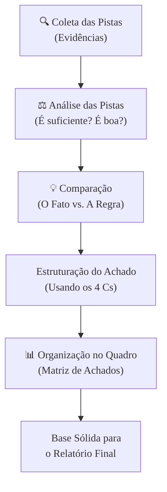

### Olá, futuro(a) servidor(a)! Vamos desvendar os segredos da evidência de auditoria para o Cebraspe.

Imagine que o auditor é um detetive 🕵️‍♂️ e a auditoria é a investigação de um caso complexo. Para resolver o mistério e apresentar uma conclusão sólida no "tribunal" (o relatório), o detetive precisa de provas. Essas provas são as **evidências**.

---

### ### Evidência de Auditoria: As Pistas do Detetive

A evidência é qualquer informação que o auditor (nosso detetive) usa para basear suas conclusões. Não é só um documento, pode ser uma entrevista, um registro de sistema, uma observação... tudo o que serve como pista!

Mas não adianta ter qualquer pista. Para ser útil, a evidência precisa ter dois atributos mágicos que o Cebraspe AMA cobrar:

| Atributo | O que é? | Pergunta do Detetive | Analogia |
| :--- | :--- | :--- | :--- |
| **Suficiência** | A **QUANTIDADE** de evidência. | "Eu tenho pistas **suficientes** para resolver o caso?" | 📦 Para um caso complexo (alto risco), o detetive precisa de uma caixa cheia de pistas. Para um caso simples (baixo risco), algumas poucas pistas fortes podem bastar. |
| **Apropriação** | A **QUALIDADE** da evidência. | "Essas pistas são **boas**? São relevantes e confiáveis?" | ⭐ Uma pista de qualidade é **relevante** (tem a ver com o caso) e **confiável** (é digna de confiança). |

#### A Hierarquia de Confiabilidade das Pistas

Nem toda pista tem o mesmo peso. O detetive sabe que algumas são muito mais fortes que outras:

* 🥇 **Nível Ouro:** A evidência que o próprio auditor gera (ex: ele mesmo vai e conta o estoque físico). É a prova mais forte.
* 🥈 **Nível Prata:** Informação vinda de uma fonte externa e independente (ex: o banco envia o extrato diretamente para o auditor).
* 🥉 **Nível Bronze:** Documento original fornecido pela empresa auditada (ex: um contrato em papel).
* 😬 **Nível Alerta:** Informação verbal (uma entrevista). É uma pista, mas precisa ser confirmada por outras evidências mais fortes.

#### Foco Cebraspe: Desarmando as "Pegadinhas"

> * **Suficiência vs. Apropriação:** A banca vai misturar tudo! Lembre-se: **Suficiência = 📦 Quantidade**. **Apropriação = ⭐ Qualidade**. Simples assim.
> * **Risco e Evidência:** Se o caso é de alto risco (ex: suspeita de grande fraude), o detetive precisa de **MAIS** pistas (suficiência) e/ou de pistas **MELHORES** (apropriação). A relação é direta!
> * **Evidência Convincente:** O auditor raramente consegue uma prova 100% conclusiva que elimina qualquer dúvida. Ele trabalha com pistas que, em conjunto, são **convincentes** ou **persuasivas**, permitindo que ele tenha uma **segurança razoável** (e não absoluta) sobre o caso.

---

### ### Achados de Auditoria: O Momento "A-há!" do Detetive

Um **achado** é o resultado da investigação de uma pista. É o momento em que o detetive compara o que ele encontrou (a situação) com o que a lei diz (o critério) e percebe uma diferença. É o famoso "te peguei!".

Para que um achado seja incontestável no "tribunal", ele precisa ter **4 atributos essenciais (os 4 Cs)**:

1.  **C**ondição (O que é): Descreve o fato. "A porta dos fundos foi encontrada arrombada".
2.  **C**ritério (O que deveria ser): A regra, a lei, o padrão. "A norma de segurança da empresa exige que todas as portas estejam trancadas".
3.  **C**ausa (Por quê?): A razão do problema. "O vigilante dormiu em serviço e não trancou a porta".
4.  **C**onsequência (E daí?): O impacto, o prejuízo. "Por causa disso, equipamentos no valor de R$ 50.000 foram furtados".

Com base nisso, o auditor elabora a **Recomendação**: "Recomenda-se instalar um alarme com sensor de presença e rever os turnos dos vigilantes".

#### Foco Cebraspe: Dominando os "4 Cs"

> * **Atributos na Prova:** O Cebraspe vai descrever uma situação e perguntar qual dos "4 Cs" ela representa. Ou vai afirmar que um achado sem a **causa** está completo. **ERRADO!** Um achado forte e completo precisa dos 4 atributos para se sustentar.
> * **Achado Positivo:** Um "achado" não é só coisa ruim! O detetive pode encontrar uma boa prática. Ex: "Condição: O novo sistema de câmeras da empresa X é tão avançado que permitiu a identificação do suspeito em 5 minutos. Critério: A média de mercado é de 24 horas. Isso é um achado positivo!".

---

### ### Matrizes de Auditoria: O Quadro de Investigação do Detetive

As matrizes são as ferramentas de organização do auditor. Pense no **quadro branco** que os detetives usam nos filmes para conectar as pistas com fotos e fios. 📊

| Tipo de Matriz | Para que serve? | Analogia do Detetive |
| :--- | :--- | :--- |
| **Matriz de Planejamento** | Usada **ANTES** da investigação, para organizar o plano de ataque. | É o quadro branco no início do caso, onde o detetive anota: "Qual o crime? Que leis se aplicam? Que pistas preciso? Onde encontrá-las?". **É o mapa do tesouro.** |
| **Matriz de Achados** | Usada **DURANTE e APÓS** a investigação, para organizar os achados. | É a tabela final que o detetive monta, com uma linha para cada problema encontrado e colunas para os "4 Cs" (Condição, Critério, Causa, Consequência) e a Recomendação. **É a lista de provas.** |
| **Matriz de Riscos e Controles** | Ferramenta para mapear riscos e os controles que os protegem. | É uma análise de segurança do local: "Quais os riscos (roubo, incêndio)? Quais as proteções (câmeras, extintores)?". |

#### Foco Cebraspe: A Utilidade das Matrizes

> * **Planejamento vs. Achados:** Não confunda! **Matriz de Planejamento** = Ferramenta para **planejar** o que fazer. **Matriz de Achados** = Ferramenta para **documentar** o que foi encontrado. Uma é do começo, a outra é do fim.
> * **Relação com os Papéis de Trabalho:** As matrizes são o resumo organizado (o quadro branco). Os papéis de trabalho são a pasta cheia de documentos, fotos e laudos que provam cada item que está no quadro.

### ### Mapa Mental: Da Pista ao Relatório

Veja como o processo flui de forma lógica, desde a coleta da pista até a sua organização para o relatório final.

### **Classe:** A
### **Conteúdo:** Evidências de Auditoria

---

### **1. Evidência de Auditoria**

> #### **TEORIA-ALVO**
> A **Evidência de Auditoria** compreende todas as informações utilizadas pelo auditor para fundamentar suas conclusões e suportar sua opinião. Não se limita a dados contábeis, incluindo também informações obtidas de outras fontes, como sistemas de informação, entrevistas e observações. A evidência é a base sobre a qual se constroem os achados e o relatório de auditoria.
>
> * **Atributos da Evidência:** Para ser válida, a evidência de auditoria deve possuir dois atributos fundamentais:
>     1.  **Suficiência:** Refere-se à **quantidade** da evidência. O auditor deve obter evidência em quantidade suficiente para, com base nela, formar uma conclusão com segurança razoável. A suficiência é influenciada pela avaliação dos riscos e pela qualidade da própria evidência.
>     2.  **Apropriação:** Refere-se à **qualidade** da evidência, que é composta por sua relevância e sua confiabilidade.
>         * **Relevância:** A evidência deve ter uma conexão lógica e pertinente com o objetivo do procedimento de auditoria e com a afirmação que está sendo testada.
>         * **Confiabilidade:** A fidedignidade da evidência. A confiabilidade é influenciada pela fonte e pela natureza da informação.
> * **Hierarquia de Confiabilidade da Evidência:**
>     * A evidência é mais confiável quando obtida de fontes externas independentes do que de fontes internas.
>     * A evidência gerada diretamente pelo auditor (e.g., por meio de recálculo ou inspeção física) é mais confiável do que a obtida indiretamente.
>     * A evidência obtida de um sistema de controle interno eficaz é mais confiável do que a obtida de um sistema com controles fracos.
>     * A evidência documental (em papel ou eletrônica) é mais confiável do que a evidência oral (obtida em indagações), que deve ser corroborada.
> * **Evidências em Auditoria de TI:** Exemplos incluem logs de acesso de sistemas, relatórios de configuração de *firewalls*, código-fonte de aplicações, contratos de serviços de TI, resultados de testes de penetração e entrevistas com a equipe de TI e com usuários.

> #### **FOCO CEBRASPE (Pontos de Atenção e "Pegadinhas")**
> > * **Suficiência vs. Apropriação:** A banca frequentemente confunde os conceitos. Uma questão pode afirmar que "a suficiência da evidência refere-se à sua relevância e fidedignidade". **ERRADO**. Suficiência diz respeito à **quantidade**. Apropriação diz respeito à **qualidade** (relevância e confiabilidade).
> > * **Relação entre Risco e Evidência:** Há uma relação direta entre o risco de distorção relevante e a quantidade de evidência necessária. Quanto **maior** o risco avaliado pelo auditor, **maior** será a quantidade de evidência (suficiência) e/ou a qualidade da evidência (apropriação) que ele precisará obter.
> > * **Confiabilidade da Evidência:** A banca pode apresentar um cenário com diferentes tipos de evidência e questionar qual é a mais confiável. Uma confirmação externa recebida diretamente de um banco é mais confiável do que um extrato bancário fornecido pela própria entidade auditada.
> > * **Evidência Convincente vs. Conclusiva:** A evidência de auditoria raramente é conclusiva. O auditor trabalha com evidências que sejam **persuasivas ou convincentes**, o que lhe permite obter **segurança razoável**, e não absoluta.

---

### **Classe:** A
### **Conteúdo:** Achados de Auditoria

---

### **2. Achados de Auditoria**

> #### **TEORIA-ALVO**
> O **Achado de Auditoria** é o resultado da comparação, realizada pelo auditor, entre a situação encontrada (a condição) e o critério de auditoria. Representa qualquer fato relevante e material que se constitua em uma divergência entre a prática e a norma, ou que evidencie uma fragilidade ou oportunidade de melhoria.
>
> * **Atributos Essenciais de um Achado de Auditoria (Os "4 Cs"):** Para que um achado seja completo, robusto e capaz de suportar uma recomendação, ele deve conter, no mínimo, quatro atributos fundamentais:
>     1.  **Condição:** A situação encontrada na entidade auditada. Descreve "o que é". É a evidência factual coletada pelo auditor.
>     2.  **Critério:** A norma, o padrão, a meta ou a boa prática que deveria estar sendo seguida. Descreve "o que deveria ser". O critério é o referencial contra o qual a condição é comparada.
>     3.  **Causa:** A razão ou o motivo da divergência entre a condição e o critério. Identificar a causa é fundamental para formular recomendações que ataquem a raiz do problema.
>     4.  **Consequência (ou Efeito):** O impacto, real ou potencial, da divergência. Descreve a relevância e a materialidade do achado, demonstrando por que ele é importante.
> * **Recomendação:** Com base nos quatro atributos, o auditor elabora uma **recomendação**, que é a proposta de ação corretiva ou de melhoria para que a entidade auditada possa sanar a causa do achado e evitar a reincidência do problema. A recomendação não é um atributo do achado em si, mas uma decorrência dele.

> #### **FOCO CEBRASPE (Pontos de Atenção e "Pegadinhas")**
> > * **Conhecimento dos Atributos:** A banca frequentemente testa o conhecimento sobre os quatro atributos do achado. Uma questão pode apresentar uma descrição e pedir para identificar qual atributo está sendo descrito, ou afirmar que um achado está completo mesmo sem a identificação da causa ou do efeito. **ERRADO**. Um achado fraco é aquele que não apresenta todos os seus atributos de forma clara.
> > * **Diferença Condição vs. Critério:** É crucial distinguir os dois. A **Condição** é o fato observado. O **Critério** é a regra ou o padrão de comparação. A banca pode afirmar que "o critério de auditoria é a situação encontrada pelo auditor". **ERRADO**.
> > * **Achado Positivo vs. Negativo:** Embora o termo "achado" seja comumente associado a problemas e deficiências (achados negativos), ele também pode se referir à identificação de boas práticas ou desempenhos exemplares na entidade auditada (achados positivos).
> > * **Achado vs. Opinião de Auditoria:** Um achado é uma constatação pontual sobre um aspecto específico da auditoria. A **opinião** é a conclusão geral do auditor sobre o objeto como um todo (e.g., sobre a fidedignidade das demonstrações financeiras), formada com base no conjunto de achados e em toda a evidência coletada.

---

### **Classe:** A
### **Conteúdo:** Matrizes de Auditoria

---

### **3. Matrizes de Auditoria**

> #### **TEORIA-ALVO**
> As **Matrizes** são instrumentos ou ferramentas de planejamento, execução e documentação utilizadas pelo auditor para organizar, estruturar e dar rastreabilidade ao trabalho de auditoria. Elas não são um fim em si mesmas, mas um meio para garantir a cobertura adequada dos objetivos e a consistência na documentação.
>
> * **Matriz de Planejamento:**
>     * **Definição:** Um instrumento utilizado na fase de planejamento para estruturar a lógica da auditoria. Ela decompõe o problema de auditoria em questões, que são então correlacionadas com os critérios, as informações necessárias, as fontes de evidência e os procedimentos de auditoria a serem aplicados.
>     * **Finalidade:** Garantir que todos os objetivos da auditoria sejam cobertos por procedimentos específicos e que haja uma linha de raciocínio clara desde a questão de auditoria até a evidência a ser coletada. Serve como um guia para a elaboração dos programas de auditoria.
> * **Matriz de Achados (ou Matriz de Responsabilização):**
>     * **Definição:** Um instrumento utilizado para consolidar e gerenciar os achados de auditoria identificados durante a fase de execução.
>     * **Estrutura:** Organiza, para cada achado, seus quatro atributos fundamentais: **Condição, Critério, Causa e Efeito**. Adicionalmente, a matriz frequentemente inclui as **recomendações** propostas pela equipe de auditoria e, em etapas posteriores, os **comentários dos gestores** auditados e o **plano de ação** para a implementação das recomendações.
> * **Matriz de Riscos e Controles:**
>     * **Definição:** Ferramenta utilizada para identificar os riscos relevantes para um processo ou sistema e mapear os controles internos existentes que visam mitigar esses riscos.
>     * **Finalidade:** Auxiliar o auditor na avaliação da eficácia do sistema de controle interno e no planejamento dos testes de controle.

> #### **FOCO CEBRASPE (Pontos de Atenção e "Pegadinhas")**
> > * **Finalidade das Matrizes:** A banca pode questionar o propósito das matrizes. A resposta correta envolve conceitos como **organização, estruturação, rastreabilidade e controle da qualidade** do trabalho de auditoria.
> > * **Matriz de Planejamento vs. Matriz de Achados:** É fundamental distinguir a finalidade e o momento de utilização de cada uma. A **Matriz de Planejamento** é uma ferramenta da fase de **planejamento**, usada para definir o que será feito. A **Matriz de Achados** é uma ferramenta das fases de **execução e relatório**, usada para documentar o que foi encontrado.
> > * **Relação com os Papéis de Trabalho:** As matrizes são componentes importantes dos **papéis de trabalho**. Elas fornecem uma visão estruturada e resumida do planejamento e dos resultados, enquanto outros papéis de trabalho contêm os detalhes e a evidência que suportam as informações contidas nas matrizes.
