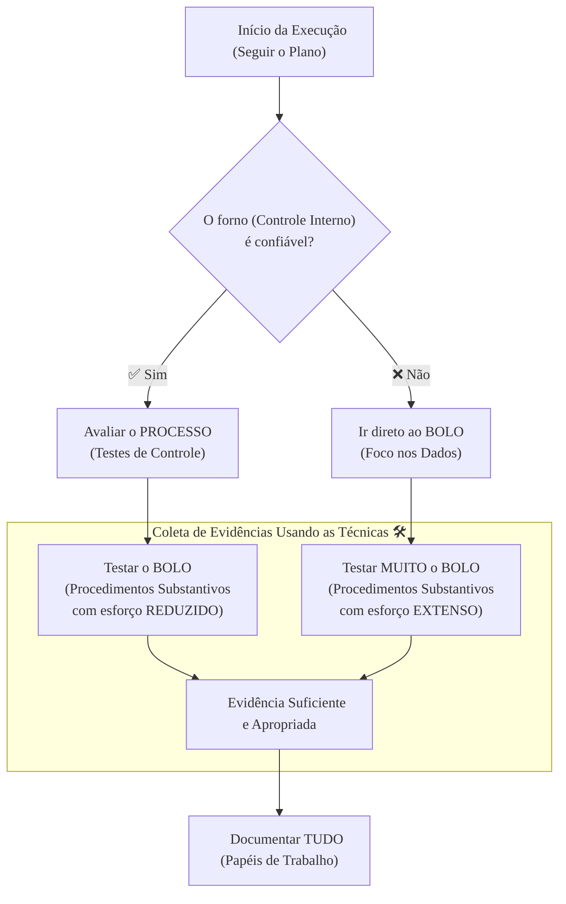

### Olá, futuro(a) aprovado(a)! Vamos cozinhar o conhecimento sobre a Execução da Auditoria para o Cebraspe.

Pense na auditoria como preparar um prato complexo para um concurso de culinária. O **Planejamento** foi a fase de escolher a receita e comprar os ingredientes. Agora, a **Execução** é a hora de botar a mão na massa, ligar o fogo e cozinhar! 👨‍🍳

---

### ### O Coração da Auditoria: Testar Controles vs. Testar os Dados

Na cozinha da auditoria, o auditor (nosso chef) precisa fazer duas coisas fundamentais. Essa distinção é a **pegadinha número 1 do Cebraspe** sobre o assunto, então vamos dominá-la!

Pense que o auditor está avaliando uma fábrica de bolos.

* **Testes de Controle (ou de Observância) 🤔:**
    * **Pergunta do Auditor:** "Os **processos** e **equipamentos** desta fábrica são confiáveis?"
    * **O que ele faz?** Ele vai verificar se os controles da fábrica estão funcionando. Por exemplo, ele testa se o termostato do forno (um controle) realmente mantém a temperatura em 180°C. Ele observa se o funcionário realmente lava as mãos (outro controle) antes de manusear a massa.
    * **Foco:** O **PROCESSO**. A prevenção de erros.

* **Procedimentos Substantivos 💰:**
    * **Pergunta do Auditor:** "O **produto final** (o bolo) está correto? Existem erros nele?"
    * **O que ele faz?** Ele vai pegar o bolo pronto e testá-lo diretamente. Ele pesa o bolo para ver se tem o peso certo, analisa uma fatia no microscópio para ver se os ingredientes estão corretos e se não há nada estranho no meio.
    * **Foco:** O **RESULTADO**, o dado, o valor final. A detecção de erros.

#### Foco Cebraspe: A Relação entre os Testes

| Situação | Analogia do Forno | Ação do Auditor | "Pegadinha" do Cebraspe |
| :--- | :--- | :--- | :--- |
| **Controles Fortes** | O forno é de última geração e super confiável (baixo risco). | O auditor confia no forno. Ele faz **mais testes de controle** (verifica o termostato) e pode **reduzir** a quantidade de vezes que ele prova o bolo (procedimentos substantivos). | A banca dirá que ele pode **eliminar** os testes substantivos. **ERRADO!** Ele reduz, mas **NUNCA** elimina. É obrigatório provar o bolo pelo menos uma vez! |
| **Controles Fracos** | O forno é velho e não funciona direito (alto risco). | O auditor não confia no forno. Ele faz poucos (ou nenhum) testes de controle e vai direto ao ponto: **aumenta muito** a quantidade de testes no bolo (procedimentos substantivos). | A banca vai trocar as bolas, dizendo que se o controle é fraco, o auditor faz mais testes de controle. **ERRADO!** Ele foca nos dados. |

---

### ### Técnicas de Auditoria: As Ferramentas do Chef

Para executar os testes, nosso chef auditor usa um kit de ferramentas e técnicas específicas.

| Técnica | O que é? | Exemplo do Chef 🍳 |
| :--- | :--- | :--- |
| **Inspeção** | Olhar de perto um documento, registro ou um bem físico. | O chef inspeciona a data de validade do leite ou verifica se os ovos não estão quebrados. |
| **Observação** | Assistir a um processo sendo executado por outra pessoa. | O chef observa seu assistente preparando o caramelo, para ver se ele segue a receita. |
| **Confirmação Externa** | Perguntar para alguém de fora da cozinha (independente). | O chef liga para o fornecedor de carne para confirmar que a picanha entregue era mesmo do tipo A. |
| **Recálculo** | Refazer as contas para ver se batem. | O chef soma o peso de todos os ingredientes para ver se a conta do fornecedor está certa. |
| **Reexecução** | Refazer um controle ou processo do zero. | O chef prepara ele mesmo uma pequena porção do molho para ver se o resultado bate com o do assistente. |
| **Indagação** | Simplesmente perguntar, buscar informações. | O chef pergunta ao confeiteiro qual o segredo para o merengue perfeito. |

#### As Ferramentas High-Tech: TAACs 🤖

As **Técnicas de Auditoria Assistidas por Computador (TAACs)** são os robôs e processadores de alimentos do nosso chef.

* **Software de Auditoria:** É um supercomputador que analisa um saco de 1 milhão de grãos de feijão em segundos para encontrar os que estão ruins. O auditor usa softwares para analisar 100% das transações da empresa.
* **Dados de Teste:** É quando o chef coloca um "ovo podre" de mentira na esteira da fábrica para ver se o sensor de qualidade (o controle do sistema) apita e o rejeita. O auditor insere dados falsos no sistema da empresa para ver se os controles internos funcionam.

**Foco Cebraspe:** As TAACs tornam a auditoria mais **rápida e eficaz**, mas **não substituem o julgamento do chef (auditor)**. É ele quem decide o que testar e interpreta os resultados do robô.

---

### ### Amostragem e Documentação: Provando a Sopa e Anotando a Receita

* **Amostragem 🥄:** A panela de sopa é gigante (a população de dados). O chef não pode beber tudo. Então, ele pega uma **amostra** com uma concha para provar. Existe o **risco de amostragem**: o risco de a concha pegar o único pedaço de sal da panela e o chef achar que a sopa inteira está salgada.

* **Papéis de Trabalho 📓:** É o **livro de receitas secreto do chef**. Ele anota TUDO: cada ingrediente, cada tempo de cozimento, cada teste que fez, cada resultado. Esse livro é a **prova** de que ele seguiu as normas e é a base para o seu relatório final. **E atenção:** esse livro é propriedade **do chef (auditor)**, não do dono do restaurante!

* **Matriz de Achados:** É a página de "erros e acertos" do livro. Nela, o chef anota cada problema usando os **4 Cs**:
    * **C**ondição: O que encontrei? ("A carne queimou").
    * **C**ritério: Como deveria ser? ("A receita dizia fogo baixo").
    * **C**ausa: Por que aconteceu? ("Me distraí com o celular").
    * **C**onsequência: E daí? ("O prato ficou com gosto amargo e o cliente reclamou").

### ### Mapa Mental: A Lógica da Execução da Auditoria

Veja o fluxo de decisão do nosso chef auditor na cozinha da execução.

### **Classe:** A
### **Conteúdo:** Execução da Auditoria: Procedimentos e Técnicas

---

### **1. O Processo de Execução e os Procedimentos de Auditoria**

> #### **TEORIA-ALVO**
> A **Execução** é a fase do processo de auditoria na qual o auditor implementa os procedimentos definidos no plano de auditoria com o propósito de obter evidência suficiente e apropriada para fundamentar suas conclusões e sua opinião. Os **Procedimentos de Auditoria** são as ações e os testes específicos realizados pelo auditor para coletar essa evidência.
>
> * **Procedimentos de Avaliação de Riscos:** Realizados durante a fase de planejamento para obter o entendimento da entidade e de seu ambiente, incluindo seu controle interno, para identificar e avaliar os riscos de distorção relevante.
> * **Procedimentos Adicionais de Auditoria:** Realizados em resposta aos riscos avaliados. Compreendem dois tipos principais:
>     1.  **Testes de Controle (ou Testes de Observância):**
>         * **Objetivo:** Avaliar a **eficácia operacional dos controles internos** em prevenir, ou detectar e corrigir, distorções relevantes no nível de afirmações.
>         * **Foco:** Respondem à pergunta: "Os controles internos nos quais pretendo confiar estão funcionando como projetado?".
>         * **Exemplo em TI:** Verificar, por meio de inspeção de logs e configurações, se as permissões de acesso ao sistema de planejamento de recursos empresariais (ERP) são concedidas estritamente com base em autorização formal, conforme a política de segurança da informação.
>     2.  **Procedimentos Substantivos:**
>         * **Objetivo:** Detectar **distorções materiais** no nível de afirmações.
>         * **Foco:** Respondem à pergunta: "Existem erros ou fraudes nos dados, transações ou saldos?". São compostos por:
>             * **Testes de Detalhes:** Exame de transações, saldos e divulgações individuais.
>             * **Procedimentos Analíticos Substantivos:** Análise de relações plausíveis entre dados financeiros e não financeiros.
>         * **Exemplo em TI:** Utilizar uma Técnica de Auditoria Assistida por Computador (TAAC) para extrair todos os pagamentos efetuados no período e compará-los com a lista de fornecedores cadastrados para identificar pagamentos a entidades não autorizadas.

> #### **FOCO CEBRASPE (Pontos de Atenção e "Pegadinhas")**
> > * **Distinção: Teste de Controle vs. Procedimento Substantivo:** Esta é a dicotomia mais importante da fase de execução. A banca apresentará um cenário e solicitará a classificação do procedimento. **Teste de Controle** avalia o **processo**; **Procedimento Substantivo** avalia o **resultado/dado**.
> > * **Relação com a Avaliação de Riscos:** A natureza, a época e a extensão dos procedimentos de auditoria dependem da avaliação de riscos feita no planejamento. Se o auditor avalia que os controles internos de uma entidade são **fortes e eficazes** (baixo risco de controle), ele pode decidir confiar neles, realizando mais testes de controle e, consequentemente, **reduzindo a extensão** dos procedimentos substantivos. O contrário também é verdadeiro.
> > * **Obrigatoriedade:** Independentemente da avaliação dos riscos, o auditor deve sempre planejar e executar procedimentos substantivos para cada classe de transação, saldo contábil e divulgação material. A confiança nos controles internos pode reduzir a extensão dos testes substantivos, mas nunca eliminá-los completamente.

---

### **Classe:** A
### **Conteúdo:** Técnicas para Coleta de Evidência de Auditoria

---

### **2. Técnicas para Coleta de Evidência de Auditoria**

> #### **TEORIA-ALVO**
> As **Técnicas de Auditoria** são os métodos específicos utilizados pelo auditor para aplicar os procedimentos de auditoria e coletar evidências. As normas de auditoria preveem um conjunto de técnicas padrão.
>
> * **Técnicas Principais:**
>     * **Inspeção:** Exame de registros, documentos (sejam eles internos ou externos, em papel, formato eletrônico ou outro meio) ou o exame físico de um ativo.
>         * **Exemplo em TI:** Inspecionar os contratos de licença de software para verificar a conformidade. Inspecionar fisicamente os servidores em um data center.
>     * **Observação:** Consiste no acompanhamento de processo ou procedimento quando de sua execução por outros.
>         * **Exemplo em TI:** Observar o processo de backup sendo realizado pela equipe de operações de TI.
>     * **Confirmação Externa (Circularização):** Obtenção de evidência de auditoria como resposta por escrito, em papel ou em meio eletrônico, diretamente de um terceiro independente.
>     * **Recálculo:** Verificação da exatidão matemática de documentos ou registros.
>     * **Reexecução:** Execução independente, pelo auditor, de procedimentos ou controles que foram originalmente realizados como parte do controle interno da entidade.
>     * **Procedimentos Analíticos:** Avaliação das informações feitas por meio de estudo das relações plausíveis entre dados financeiros e não financeiros.
>     * **Indagação (ou Investigação):** Consiste na busca de informações junto a pessoas com conhecimento, financeiro ou não financeiro, dentro ou fora da entidade.
> * **Técnicas de Auditoria Assistidas por Computador (TAACs ou CAATs):**
>     * **Definição:** Uso de software para automatizar a execução de procedimentos de auditoria. Permitem ao auditor analisar grandes volumes de dados (censo), selecionar amostras, identificar exceções, etc.
>     * **Categorias:**
>         * **Software de Auditoria:** Uso de programas específicos (e.g., ACL, IDEA) ou de uso geral (e.g., planilhas, bancos de dados, scripts em Python) para analisar os dados da entidade.
>         * **Dados de Teste:** Utilização de dados fictícios (transações) submetidos pelo auditor ao sistema do auditado para verificar o funcionamento dos controles da aplicação.

> #### **FOCO CEBRASPE (Pontos de Atenção e "Pegadinhas")**
> > * **Correspondência entre Técnica e Procedimento:** A banca pode descrever um objetivo e solicitar a técnica mais adequada. "Para verificar a existência de um ativo, a técnica é a **inspeção**". "Para testar a eficácia de um controle de autorização, a técnica pode ser a **reexecução**".
> > * **Reexecução vs. Recálculo:** A distinção é sutil, mas relevante. **Recálculo** se refere estritamente à verificação matemática. **Reexecução** é mais ampla e envolve refazer um controle inteiro para verificar se o resultado é o mesmo, como, por exemplo, reexecutar um processo de conciliação.
> > * **TAACs (CAATs):** A banca testará o entendimento de que as TAACs aumentam a **eficiência** e a **eficácia** da auditoria, possibilitando testes em 100% da população de dados e a identificação de padrões complexos. É incorreto afirmar que o uso de TAACs elimina a necessidade de julgamento profissional do auditor. **ERRADO**. O auditor ainda precisa planejar os testes, interpretar os resultados e avaliar as exceções.
> > * **Auditoria "Através" do Computador:** As TAACs permitem que o auditor audite "através" do computador (testando a lógica interna do processamento), em contraste com a auditoria "ao redor" do computador (que apenas compara entradas e saídas).

---

### **Classe:** A
### **Conteúdo:** Amostragem e Documentação da Auditoria

---

### **3. Amostragem, Papéis de Trabalho e Matrizes de Auditoria**

> #### **TEORIA-ALVO**
> A condução da auditoria exige o uso de amostragem para viabilizar testes em grandes populações e uma documentação robusta para suportar as conclusões.
>
> * **Amostragem em Auditoria:**
>     * **Definição:** A aplicação de procedimentos de auditoria a **menos de 100%** dos itens de uma população, com o objetivo de avaliar alguma característica da população inteira.
>     * **Risco de Amostragem:** O risco de que a conclusão do auditor baseada na amostra seja diferente da conclusão que seria alcançada se toda a população fosse testada. É uma limitação inerente ao uso de amostragem.
>     * **Tipos:**
>         * **Amostragem Estatística:** Usa a teoria da probabilidade para selecionar a amostra e avaliar os resultados, permitindo a quantificação do risco de amostragem.
>         * **Amostragem Não Estatística:** A seleção da amostra e a avaliação dos resultados dependem do julgamento profissional do auditor.
> * **Papéis de Trabalho:**
>     * **Definição:** O registro completo dos procedimentos de auditoria aplicados, da evidência pertinente obtida e das conclusões alcançadas pelo auditor. São o elo entre o trabalho de campo e o relatório de auditoria.
>     * **Finalidade:** Fornecer o principal suporte para o relatório de auditoria, demonstrar que a auditoria foi conduzida de acordo com as normas, e facilitar a supervisão e a revisão do trabalho.
> * **Matriz de Planejamento e Matriz de Achados:**
>     * **Matriz de Planejamento:** Instrumento que estrutura o planejamento, conectando os objetivos da auditoria às questões, critérios, evidências e procedimentos.
>     * **Matriz de Achados:** Instrumento que consolida os achados da auditoria. Um achado é composto por quatro atributos essenciais: **Condição** (a situação encontrada), **Critério** (o que deveria ser), **Causa** (a razão da discrepância) e **Efeito** (a consequência da discrepância).

> #### **FOCO CEBRASPE (Pontos de Atenção e "Pegadinhas")**
> > * **Quando usar Amostragem:** A amostragem é apropriada quando a população é grande e homogênea e quando um teste em 100% dos itens seria impraticável. Não é adequada para populações pequenas ou para itens de alto valor individual, que devem ser testados integralmente.
> > * **Propriedade dos Papéis de Trabalho:** Os papéis de trabalho são de **propriedade do auditor** (ou da instituição de auditoria). A guarda e a confidencialidade desses documentos são de responsabilidade do auditor.
> > * **Os 4 "C"s do Achado de Auditoria:** A banca frequentemente testa o conhecimento sobre os atributos do achado: **Condição, Critério, Causa e Consequência (Efeito)**. A ausência de um desses elementos, especialmente da Causa e do Efeito, enfraquece o achado e a recomendação decorrente.
> > * **Evidência Suficiente e Apropriada:** Os papéis de trabalho devem conter o registro da evidência obtida, que deve ser **suficiente** (em quantidade) e **apropriada** (em qualidade, ou seja, relevante e confiável) para suportar a opinião do auditor.
