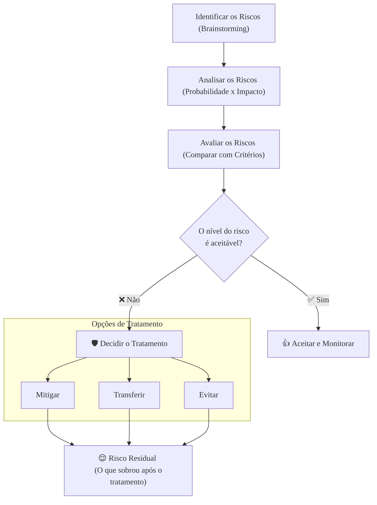

### Olá, futuro(a) aprovado(a)! Vamos descomplicar a Gestão de Riscos para o Cebraspe.

Pense na gestão pública como a organização de um gigantesco festival de música gratuito para a cidade. 🎪 A **Gestão de Riscos** é a arte de pensar em tudo que pode dar errado (ou inesperadamente certo!) para garantir que o show seja um sucesso.

---

### ### Fundamentos: O que é Risco e Quem Manda no Jogo?

* **O que é Risco?** Risco é o **efeito da incerteza nos seus objetivos**. O seu objetivo é um festival perfeito. A "incerteza" é: "Será que vai chover?". O "efeito" dessa incerteza é o risco: a chuva pode estragar o evento.

* **Risco vs. Problema (Pegadinha Clássica!):**
    * **Risco 🌧️:** É um evento **futuro e incerto**. É a *possibilidade* de chuva.
    * **Problema ⛈️:** É um evento que **já aconteceu**. É a chuva *caindo* no meio do show.

* **Risco não é só coisa ruim!** A definição fala em "efeito da incerteza". A incerteza pode ser:
    * **Negativa (Ameaça):** O risco de um equipamento de som quebrar.
    * **Positiva (Oportunidade) ✨:** O risco de um artista famoso, que está de passagem pela cidade, decidir fazer uma participação surpresa. É um "problema bom" que você precisa gerenciar!

A principal regra do jogo no Governo Federal é a **IN Conjunta MP/CGU nº 01/2016**. Pense nela como o "Manual Oficial de Planejamento de Grandes Eventos da Cidade".

---

### ### O Processo: O Passo a Passo do Organizador do Festival

Para gerenciar os riscos do festival, o organizador segue um roteiro lógico. O Cebraspe adora confundir a ordem e os conceitos de cada etapa.

#### 1. Identificação de Riscos 📝
É o "brainstorming do pessimismo" (e do otimismo!). O que pode acontecer?
* Chuva forte.
* Falta de energia.
* Brigas na multidão.
* Banheiros químicos insuficientes.
* O astro principal fica doente.
* *Oportunidade:* Um patrocinador de última hora quer injetar muito dinheiro.

Nesta fase, você apenas **lista** tudo, sem julgar.

#### 2. Análise de Riscos 🤔
Agora você pega a lista e começa a medir o tamanho do estrago. Para cada risco, você analisa duas coisas:
* **Probabilidade:** Qual a chance de acontecer?
* **Impacto:** Se acontecer, qual será o tamanho do prejuízo (ou do lucro)?

O **Nível do Risco** é basicamente `Probabilidade x Impacto`. Uma chuva leve (baixo impacto) com alta probabilidade pode ser menos preocupante que um furacão (alto impacto) com baixa probabilidade.

#### 3. Avaliação de Riscos 🚦
Aqui você **compara** o nível do risco que você calculou com os **critérios de risco** (o quanto de risco a "prefeitura" topa correr). É a hora da **decisão** e **priorização**.
* **Risco de chuva leve:** Nível Baixo. "Ok, tolerável."
* **Risco de falta de energia:** Nível Alto. "Alerta vermelho! Precisamos fazer algo a respeito."

**Atenção:** A banca vai dizer que **Análise** e **Avaliação** são a mesma coisa. **ERRADO!** Análise é **medir**. Avaliação é **comparar e decidir**.

#### 4. Tratamento de Riscos 🛡️
Com a lista de riscos priorizados, você decide o que fazer com cada um. Existem 4 estratégias:

| Estratégia de Tratamento | O que é? | Exemplo no Festival 🎪 |
| :--- | :--- | :--- |
| **Aceitar / Reter** | Não fazer nada e assumir as consequências. É uma decisão consciente. | Risco de algumas pessoas ficarem entediadas. Você aceita. |
| **Mitigar / Reduzir** | Tomar medidas para diminuir a probabilidade ou o impacto do risco. | Para o risco de chuva, você **mitiga** o impacto montando grandes tendas. |
| **Transferir / Compartilhar** | Passar o impacto (geralmente financeiro) para um terceiro. | Para o risco de acidentes, você **transfere** o prejuízo contratando um seguro. |
| **Evitar / Eliminar** | Desistir da atividade que gera o risco. | Se o risco de um desabamento no local é muito alto, você **evita** o risco cancelando o festival ou mudando para um lugar seguro. |

Depois de tratar o risco, o que sobra é o **Risco Residual**. Você montou as tendas (tratamento), mas ainda existe um pequeno risco de as pessoas se molharem. Esse "risquinho" que sobrou é o residual.

---

### ### As Três Linhas de Defesa: O Time de Segurança do Festival

Para que tudo funcione, as responsabilidades são divididas em um modelo de 3 linhas, como um time de futebol.

#### 🥇 **Primeira Linha: Jogadores em Campo**
* **Quem são:** Os gestores operacionais. O pessoal que "põe a mão na massa". O gerente do palco, o coordenador dos food trucks, os seguranças na entrada.
* **O que fazem:** Eles são os **donos dos riscos** das suas áreas. São responsáveis por identificar e gerenciar os riscos no dia a dia. O gerente do palco precisa verificar se os cabos estão seguros.

#### 🥈 **Segunda Linha: O Técnico e a Comissão Técnica**
* **Quem são:** As áreas especialistas em dar suporte. A equipe de Gestão de Riscos, de Controles Internos, de Segurança da Informação.
* **O que fazem:** Eles não jogam em campo, mas **criam as regras do jogo e a estratégia**. Eles definem a política de segurança do evento, dão treinamento e supervisionam se os jogadores (1ª linha) estão seguindo o plano.

#### 🥉 **Terceira Linha: O Árbitro de Vídeo (VAR) Independente**
* **Quem é:** A **Auditoria Interna**.
* **O que faz:** Ela é **totalmente independente** do time e do técnico. Sua função é avaliar, de forma objetiva, se o jogo está correndo bem. Ela verifica se os jogadores (1ª linha) fizeram o seu trabalho e se a comissão técnica (2ª linha) supervisionou direito. Ela se reporta diretamente ao "presidente do clube" (a alta administração), não ao técnico.

**Foco Cebraspe:** A banca vai misturar os papéis! Ela dirá que o Auditor Interno (3ª linha) é responsável por montar as grades de segurança (tarefa da 1ª linha). **ERRADO!** O auditor avalia, ele não executa o trabalho operacional.

### ### Mapa Mental do Processo de Gestão de Riscos

Para fixar as etapas, veja este fluxo simplificado.

### **Classe:** A
### **Conteúdo:** Gestão de Riscos: Estrutura e Processo no Setor Público

---

### **1. Fundamentos e Estrutura da Gestão de Riscos no Setor Público**

> #### **TEORIA-ALVO**
> A **Gestão de Riscos** no setor público é um processo sistemático e estruturado para identificar, analisar, avaliar, tratar e monitorar os riscos que possam afetar o alcance dos objetivos de uma organização pública. Um **risco** é definido como o "efeito da incerteza nos objetivos". O principal normativo que estabelece as diretrizes para a Gestão de Riscos na Administração Pública Federal direta, autárquica e fundacional é a **Instrução Normativa Conjunta MP/CGU nº 01/2016**.
>
> * **Objetivos da Gestão de Riscos (conforme IN 01/2016):**
>     * Assegurar que os responsáveis pela tomada de decisão tenham acesso tempestivo a informações suficientes sobre os riscos aos quais a organização está exposta.
>     * Aumentar a probabilidade de alcance dos objetivos institucionais.
>     * Agregar valor à organização por meio da melhoria dos processos de tomada de decisão e do tratamento adequado dos riscos.
> * **Componentes da Estrutura de Gestão de Riscos:**
>     * **Política de Gestão de Riscos:** Documento de mais alto nível, aprovado pela autoridade máxima do órgão, que estabelece os princípios, as diretrizes e as responsabilidades para a gestão de riscos.
>     * **Comitê de Governança, Riscos e Controles:** Instância de supervisão responsável por, entre outras coisas, aprovar a política e as metodologias, e supervisionar o processo.
>     * **Gerenciamento de Riscos no Nível Operacional:** A gestão de riscos deve ser integrada aos processos, projetos e atividades da organização.

> #### **FOCO CEBRASPE (Pontos de Atenção e "Pegadinhas")**
> > * **Risco vs. Problema:** A banca pode confundir os conceitos. Um **risco** é um evento **futuro e incerto**, com uma probabilidade e um impacto associados. Um **problema** ou um **incidente** é um evento que **já ocorreu**.
> > * **Natureza do Risco:** É incorreto associar risco apenas a eventos negativos (ameaças). **ERRADO**. O "efeito da incerteza", conforme a definição da ISO 31000, pode ser tanto negativo (prejuízo) quanto positivo (uma **oportunidade**).
> > * **Abrangência da IN 01/2016:** A banca pode questionar o escopo de aplicação da norma. Ela é de observância obrigatória para os órgãos e entidades do Poder Executivo Federal.
> > * **Gestão de Riscos como Processo Contínuo:** A gestão de riscos não é um projeto com início, meio e fim, mas um **processo cíclico e contínuo**, que deve ser integrado à governança e às atividades cotidianas da organização.

---

### **Classe:** A
### **Conteúdo:** O Processo de Gestão de Riscos

---

### **2. O Processo de Gestão de Riscos**

> #### **TEORIA-ALVO**
> O processo de gestão de riscos, alinhado à norma ISO 31000 e às práticas da IN 01/2016, consiste em um conjunto de etapas sequenciais e interativas.
>
> * **1. Identificação de Riscos:**
>     * **Descrição:** Consiste em encontrar, reconhecer e descrever os riscos. Envolve a identificação das fontes de risco, eventos, suas causas e suas potenciais consequências. O resultado é uma lista de riscos.
> * **2. Análise de Riscos:**
>     * **Descrição:** Consiste em desenvolver uma compreensão do risco. A análise envolve a determinação da **probabilidade** (ou likelihood) de ocorrência do evento de risco e da magnitude de seu **impacto** (ou consequência), caso ele ocorra. O nível do risco é frequentemente determinado pela fórmula: `Nível do Risco = Probabilidade x Impacto`.
> * **3. Avaliação de Riscos:**
>     * **Descrição:** Consiste em **comparar** os resultados da análise de riscos com os **critérios de risco** (definidos na política de gestão de riscos) para determinar se o risco e/ou sua magnitude é aceitável ou tolerável. O propósito da avaliação é subsidiar a decisão sobre o tratamento do risco. O resultado é uma lista de riscos priorizados.
> * **4. Tratamento de Riscos:**
>     * **Descrição:** Consiste em selecionar e implementar uma ou mais opções para modificar os riscos. As opções de tratamento incluem:
>         * **Aceitar (ou Reter/Tolerar):** Uma decisão informada de não tomar nenhuma medida para alterar a probabilidade ou o impacto do risco. Geralmente aplicado a riscos de baixo nível.
>         * **Mitigar (ou Reduzir):** Adoção de medidas e controles para reduzir a probabilidade e/ou o impacto do risco a um nível aceitável.
>         * **Transferir (ou Compartilhar):** Transferência do ônus financeiro do impacto do risco para um terceiro. Exemplo clássico: contratação de um seguro.
>         * **Evitar (ou Eliminar):** Decisão de não iniciar ou de descontinuar a atividade que dá origem ao risco.

> #### **FOCO CEBRASPE (Pontos de Atenção e "Pegadinhas")**
> > * **Análise vs. Avaliação de Riscos:** A banca frequentemente trata os termos como sinônimos. **ERRADO**. A **Análise** é a fase de mensuração da probabilidade e do impacto para determinar o nível do risco. A **Avaliação** é a fase de **decisão**, onde se compara o nível do risco com os critérios de aceitação para decidir se o tratamento é necessário.
> > * **Opções de Tratamento:** A banca vai apresentar um cenário e pedir a identificação da opção de tratamento correta. É mandatório conhecer as quatro opções. Exemplo: "Implementar um sistema de firewall para dificultar acessos não autorizados é uma forma de **mitigar** o risco de invasão". "Contratar um seguro contra incêndio para um data center é uma forma de **transferir** o risco".
> > * **Risco Residual:** É o risco que permanece **após** a implementação das medidas de tratamento. A banca pode questionar esse conceito. O objetivo do tratamento é reduzir o risco inerente a um nível de risco residual que seja aceitável para a organização.

---

### **Classe:** A
### **Conteúdo:** O Modelo das Três Linhas de Defesa

---

### **3. O Modelo das Três Linhas de Defesa**

> #### **TEORIA-ALVO**
> O Modelo das Três Linhas de Defesa é um modelo de governança amplamente adotado para esclarecer os papéis e as responsabilidades no gerenciamento de riscos e controles, garantindo a coordenação e a ausência de lacunas na supervisão.
>
> * **Primeira Linha de Defesa: Gestão Operacional**
>     * **Responsáveis:** Os gestores das áreas de negócio e operacionais. São os **proprietários dos riscos**.
>     * **Atribuições:** Identificar, avaliar, controlar e mitigar os riscos no dia a dia, implementando e mantendo os controles internos efetivos como parte de suas atividades rotineiras. São responsáveis por "fazer a coisa certa".
> * **Segunda Linha de Defesa: Funções de Supervisão de Risco e Conformidade**
>     * **Responsáveis:** Funções especializadas que dão suporte e supervisão à primeira linha. Exemplos: a área de Gestão de Riscos, a área de Controles Internos, a área de Segurança da Informação, a área de *Compliance*.
>     * **Atribuições:** Estabelecer as políticas, os *frameworks* e as metodologias de gestão de riscos; facilitar e especializar na identificação e análise de riscos; monitorar a adequação e a eficácia dos controles implementados pela primeira linha.
> * **Terceira Linha de Defesa: Auditoria Interna**
>     * **Responsáveis:** A função de Auditoria Interna.
>     * **Atribuições:** Fornecer à alta administração e ao corpo diretivo uma **avaliação independente e objetiva** (*assurance*) sobre a eficácia dos processos de governança, gestão de riscos e controles internos, incluindo a eficácia da primeira e da segunda linhas de defesa.
>     * **Característica Chave:** A **independência** organizacional e funcional em relação às atividades que audita.

> #### **FOCO CEBRASPE (Pontos de Atenção e "Pegadinhas")**
> > * **Distribuição de Papéis:** A principal fonte de questões é a confusão entre os papéis de cada linha. A banca afirmará, por exemplo, que "a Auditoria Interna (terceira linha) é responsável por implementar os controles de segurança da informação". **ERRADO**. A implementação de controles é responsabilidade da **primeira linha** (gestores operacionais). A definição da política de segurança é uma função de **segunda linha**. A auditoria **avalia** a eficácia desses controles.
> > * **Independência da Terceira Linha:** A eficácia da terceira linha depende de sua independência. É incorreto afirmar que a Auditoria Interna está subordinada às áreas que ela audita. **ERRADO**. A Auditoria Interna deve se reportar ao mais alto nível de governança da organização (e.g., Conselho de Administração ou Comitê de Auditoria).
> > * **Propriedade do Risco:** O "dono" do risco, ou seja, o principal responsável por gerenciá-lo, está sempre na **primeira linha de defesa**.
