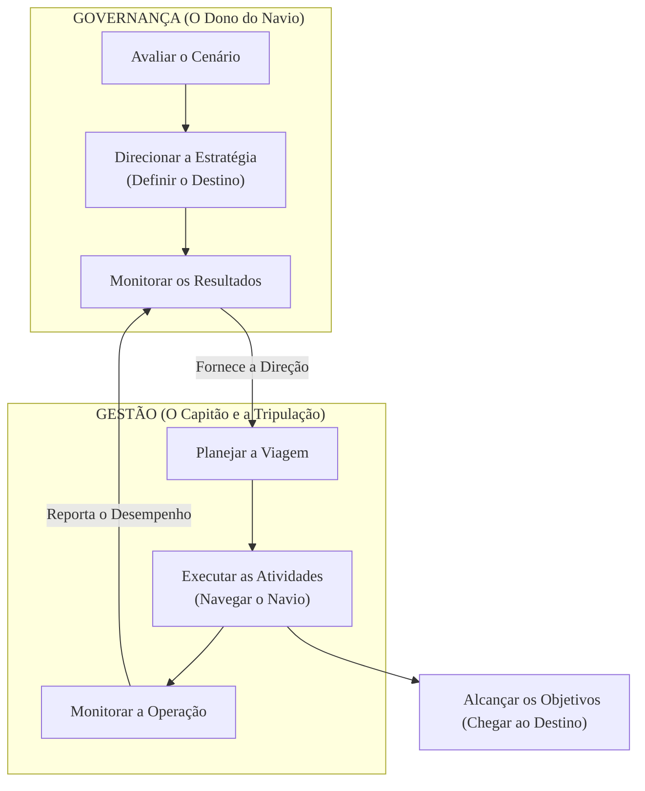

### Olá, futuro(a) aprovado(a)! Vamos desvendar a Governança para o Cebraspe de um jeito que você nunca mais vai esquecer.

Imagine que administrar um órgão público é como ser o dono de uma grande e complexa Companhia de Navegação 🚢. A **Governança** é o conjunto de regras e mecanismos que o dono da companhia usa para garantir que seus navios cheguem ao destino certo, com segurança e sem desperdiçar combustível.

---

### ### Governança, Governabilidade e Gestão: O Dono, o Mar e o Capitão

Essa é a trinca que o Cebraspe mais ama confundir. Vamos usar a nossa analogia do navio para deixar tudo claro.

| Conceito | Quem é no Navio? | O que faz? | Palavras-Chave |
| :--- | :--- | :--- | :--- |
| **Governança** | **O Dono e o Conselho da Companhia** 👑 | Eles ficam no escritório, definem para onde o navio deve ir (o destino estratégico), estabelecem as regras e o orçamento, e ficam de olho nos mapas para ver se o navio está no rumo certo. Eles **Avaliam, Direcionam e Monitoram (ADM)**. | O "COMO" se governa, processos, mecanismos, eficiência. |
| **Governabilidade** | **As Condições do Mar e o Apoio Político** 🌊 | É o **poder** para navegar. O mar está calmo ou tem uma tempestade (crise política)? A tripulação apoia o capitão (legitimidade)? A nação do porto de destino permite que o navio atraque (apoio social)? | A "CAPACIDADE" de governar, poder político, legitimidade, apoio. |
| **Gestão** | **O Capitão e a Tripulação** 👨‍✈️ | Eles estão no navio, no dia a dia. O capitão pega o destino definido pelo Dono e traça a rota no mapa, comanda a tripulação, desvia de icebergs e garante que a operação funcione. Eles **Planejam, Constroem/Executam e Monitoram (PCM)** a viagem. | A "EXECUÇÃO" do dia a dia, operação, gerenciamento de projetos. |

**Foco Cebraspe:** A banca vai afirmar que "governabilidade são os mecanismos para tomar decisões". **ERRADO!** Isso é **governança**. Governabilidade é o **poder político** para fazer as coisas acontecerem.

---

### ### Princípios e Mecanismos: O Hardware e o Código de Conduta do Navio

Para a governança funcionar, ela usa "peças" (mecanismos) e segue um "código de ética" (princípios).

* #### **Os Mecanismos (O "Hardware" ⚙️):**
    * **Liderança:** Ter um bom Dono e bons Capitães que sabem para onde ir.
    * **Estratégia:** O mapa que mostra o destino final e a rota principal.
    * **Controle (*Accountability*):** Os instrumentos do navio (radar, sonar) e a obrigação de o capitão prestar contas ao dono sobre a viagem.

* #### **Os Princípios (O "Software" / Código de Conduta ✨):**
    * **Integridade:** Navegar com honestidade, sem fazer contrabando.
    * **Transparência:** Deixar o mapa da viagem e o diário de bordo visíveis para todos os interessados (a sociedade).
        * **Ativa:** O navio já deixa seu itinerário publicado no site da companhia para todos verem.
        * **Passiva:** Um cidadão pergunta "qual foi o consumo de combustível na última viagem?" e o navio é obrigado a responder (via LAI).
    * ***Accountability*:** Este é o princípio supremo e a "pegadinha" favorita do Cebraspe. Não é só ser responsável. É o **dever do capitão de prestar contas** da viagem, **justificar** por que escolheu uma rota em vez de outra, e **assumir as consequências** (boas ou ruins) de suas decisões. É uma responsabilidade com prestação de contas.

---

### ### Governança de TI: Os Sistemas Eletrônicos do Navio

A **Governança de TI** é aplicar a mesma lógica, mas focando apenas nos sistemas de tecnologia do navio (GPS, radar, rádio, etc.).

* **Governança de TI (O Dono):** Decide que "precisamos do melhor sistema de GPS do mercado para otimizar nossas rotas e economizar combustível". Ele **avalia**, **direciona** a compra e **monitora** o desempenho.
* **Gestão de TI (O Técnico de TI):** Pega a ordem do Dono e **planeja** o projeto de instalação do novo GPS, **executa** a instalação e **monitora** se ele está funcionando sem bugs.

#### Os Manuais de Instrução (Frameworks)

* **COBIT:** É o manual completo de **governança e gestão** de TODOS os sistemas do navio. Ele mostra claramente o que é tarefa do Dono (governança) e o que é tarefa da Tripulação (gestão).
* **ISO 38500:** É um "guia rápido" de uma página para o Dono, com os 6 princípios mais importantes para ele supervisionar a TI.
* **Relação com o ITIL:** COBIT e ITIL não são rivais, são parceiros! O COBIT é o manual geral do navio. O ITIL é o manual de instruções específico e detalhado de como consertar o rádio (gestão de serviços).

**Foco Cebraspe:** O objetivo número 1 da Governança de TI é o **alinhamento estratégico**. O GPS não é comprado porque é bonito, mas porque ele ajuda a companhia a atingir seu objetivo de economizar combustível e chegar mais rápido ao destino. A TI serve ao negócio!

### ### Mapa Mental: Governança vs. Gestão

Para nunca mais errar a principal diferença que o Cebraspe cobra, memorize este fluxo.

### **Classe:** A
### **Conteúdo:** Governança no Setor Público: Conceito, Papel e Distinções

---

### **1. Governança no Setor Público: Conceito, Papel e Distinções**

> #### **TEORIA-ALVO**
> A **Governança no Setor Público** é o conjunto de mecanismos de liderança, estratégia e controle postos em prática para avaliar, direcionar e monitorar a atuação da gestão, com vistas à condução de políticas públicas e à prestação de serviços de interesse da sociedade. Seu papel é assegurar que a organização pública atue de forma eficiente, proba e transparente, em prol do interesse público.
>
> * **Importância e Papel:** A governança pública é fundamental para alinhar as ações da organização com as necessidades da sociedade, garantir a aplicação adequada dos recursos públicos, mitigar riscos (incluindo os de fraude e corrupção) e fortalecer a confiança dos cidadãos nas instituições. Ela estabelece a direção a ser seguida pela gestão.
> * **Distinção: Governança vs. Governabilidade:**
>     * **Governabilidade:** Refere-se à **capacidade política** do governo para governar. Envolve a legitimidade, o apoio político e social, e a ausência de impedimentos institucionais para que um governo possa implementar sua agenda. É uma condição prévia para o exercício do poder.
>     * **Governança (*Governance*):** Refere-se ao **sistema, aos processos e aos mecanismos** através dos quais se governa. É o "como" se governa, focando na eficiência, na transparência e na prestação de contas. Uma boa governança pode ser implementada mesmo em cenários de baixa governabilidade.
> * **Distinção: Governança vs. Gestão:**
>     * **Governança:** Define a direção estratégica e monitora os resultados. As atividades-chave, conforme referenciais como COBIT e ISO 38500, são **Avaliar, Dirigir e Monitorar (ADM)**. É de responsabilidade do corpo diretivo (alta administração, conselhos).
>     * **Gestão:** Executa as atividades do dia a dia para alcançar a direção definida pela governança. As atividades-chave são **Planejar, Construir/Executar e Monitorar (PCM)** a operação. É de responsabilidade do corpo executivo (gerentes).

> #### **FOCO CEBRASPE (Pontos de Atenção e "Pegadinhas")**
> > * **Governança vs. Governabilidade:** Esta é uma distinção clássica e frequentemente cobrada. A banca afirmará que "governabilidade diz respeito aos arranjos e processos para a tomada de decisão". **ERRADO**. Isso é **governança**. **Governabilidade** está relacionada à legitimidade e ao poder político para implementar decisões.
> > * **Governança vs. Gestão:** A banca atribuirá atividades de gestão à governança. Exemplo: "Compete às instâncias de governança a execução detalhada dos projetos de TI". **ERRADO**. A governança **dirige** e **monitora**; a **gestão executa**. A governança aprova o portfólio de projetos; a gestão gerencia o projeto individualmente.
> > * **Referencial do TCU:** As definições de governança, seus mecanismos e princípios são frequentemente baseadas no Referencial Básico de Governança do Tribunal de Contas da União (TCU), sendo este um documento de referência fundamental para concursos no Brasil.

---

### **Classe:** A
### **Conteúdo:** Princípios e Mecanismos da Governança Pública

---

### **2. Princípios e Mecanismos da Governança Pública**

> #### **TEORIA-ALVO**
> A governança pública se materializa por meio de mecanismos e é guiada por princípios que visam garantir a primazia do interesse público. O Decreto nº 9.203/2017, que dispõe sobre a política de governança da administração pública federal, é um referencial normativo central.
>
> * **Mecanismos de Governança (segundo o TCU):**
>     * **Liderança:** Conjunto de práticas que asseguram a existência de um corpo diretivo competente e que estabelece o direcionamento estratégico.
>     * **Estratégia:** Definição clara dos objetivos, alinhados às necessidades das partes interessadas, e dos caminhos para alcançá-los.
>     * **Controle (Accountability):** Conjunto de estruturas e processos para garantir o cumprimento das políticas, a prestação de contas e a transparência.
> * **Princípios Fundamentais:**
>     * **Integridade:** Pautar a conduta por padrões éticos e morais, prevenindo e combatendo a corrupção e a fraude.
>     * **Transparência:** Divulgação de informações relevantes e compreensíveis à sociedade, sendo a publicidade a regra e o sigilo a exceção. A transparência pode ser:
>         * **Ativa:** Quando o órgão divulga informações proativamente, independentemente de solicitação (e.g., Portais da Transparência).
>         * **Passiva:** Quando o órgão responde a uma solicitação de informação feita por um cidadão (regulada pela Lei de Acesso à Informação - LAI).
>     * **Accountability (Responsabilização com Prestação de Contas):** Conceito amplo que engloba o dever dos agentes públicos de assumir a responsabilidade por suas decisões, de prestar contas de seu desempenho e de justificar suas ações, estando sujeitos a sanções.

> #### **FOCO CEBRASPE (Pontos de Atenção e "Pegadinhas")**
> > * **Accountability vs. Responsabilidade:** A banca frequentemente trata os termos como sinônimos perfeitos. **INCORRETO**. *Responsabilidade* (liability) é um dos componentes do conceito de *accountability*. **Accountability** é mais amplo, envolvendo não apenas a possibilidade de ser punido por um erro, mas o dever proativo de prestar contas, de se justificar perante a sociedade e de responder pelas consequências de suas ações.
> > * **Transparência Ativa vs. Passiva:** É crucial diferenciar as duas. A **ativa** é um dever de ofício da Administração de publicar informações de interesse geral. A **passiva** é o dever de responder a uma demanda específica de um cidadão. A banca pode afirmar que a LAI trata apenas da transparência passiva. **ERRADO**. A LAI estabelece obrigações para ambas.
> > * **Princípios e Mecanismos:** A banca pode confundir os conceitos. Liderança, Estratégia e Controle são os **mecanismos** ou componentes da governança. Integridade, Transparência e Accountability são **princípios** que devem guiar a aplicação desses mecanismos.

---

### **Classe:** A
### **Conteúdo:** Governança de TI no Setor Público

---

### **3. Governança de Tecnologia da Informação (TI) no Setor Público**

> #### **TEORIA-ALVO**
> A **Governança de TI** é um subconjunto da governança corporativa/pública, focada especificamente em garantir que o uso da Informação e Tecnologia (I&T) gere valor para a organização, alinhado à sua estratégia, com riscos gerenciados e recursos otimizados.
>
> * **Papel e Importância:** No setor público, a Governança de TI visa assegurar que os investimentos em tecnologia resultem em melhores serviços para o cidadão, maior eficiência administrativa e maior transparência. Ela estabelece as estruturas de decisão e os mecanismos de responsabilização sobre o uso da TI.
> * **Frameworks de Referência:**
>     * **COBIT (Control Objectives for Information and Related Technologies):** O principal *framework* de mercado para a governança e o gerenciamento de I&T. Fornece um modelo de referência de processos (objetivos), componentes e princípios para implementar a governança. A distinção entre **governança (domínio EDM)** e **gerenciamento (domínios APO, BAI, DSS, MEA)** é central no COBIT e totalmente aplicável ao setor público.
>     * **ISO/IEC 38500:** Norma internacional de alto nível para a Governança Corporativa de TI. É direcionada ao corpo diretivo e estabelece seis princípios (Responsabilidade, Estratégia, Aquisição, Desempenho, Conformidade, Comportamento Humano) e um modelo de governança baseado em **Avaliar, Dirigir e Monitorar**.
> * **Normativos no Brasil:**
>     * **Política de Governança Digital (Decreto nº 10.332/2020):** Estabelece a Estratégia de Governo Digital para o período de 2020 a 2022 (e suas sucessoras), orientando a transformação digital no governo federal.
>     * **SISP (Sistema de Administração dos Recursos de Tecnologia da Informação):** Sistema que organiza o planejamento, a coordenação, a operação e o controle dos recursos de TI na Administração Pública Federal direta, autárquica e fundacional. Normativos do SISP, como a IN SGD/ME nº 94/2022 (sobre contratações de TI), são instrumentos de governança.

> #### **FOCO CEBRASPE (Pontos de Atenção e "Pegadinhas")**
> > * **Governança de TI vs. Gestão de TI:** A mesma distinção fundamental se aplica aqui. A **Governança de TI** define a direção estratégica (e.g., aprovação do Plano Estratégico de TI - PETI). A **Gestão de TI** executa essa direção (e.g., elaboração do Plano Diretor de TI - PDTI, gerenciamento da central de serviços).
> > * **Relação entre os Frameworks:** É incorreto afirmar que COBIT e ITIL são concorrentes. **ERRADO**. São **complementares**. **COBIT** fornece o *framework* de governança e gestão de ponta a ponta. **ITIL** fornece as boas práticas detalhadas para o **gerenciamento de serviços de TI** (que corresponde principalmente ao domínio DSS do COBIT). A **ISO 38500** fornece os princípios de alto nível que podem ser implementados usando o COBIT.
> > * **Alinhamento Estratégico:** O objetivo central da Governança de TI é garantir o **alinhamento estratégico** entre a TI e o negócio (ou a missão da entidade pública). A TI não é um fim em si mesma, mas um habilitador para o alcance dos objetivos organizacionais.
