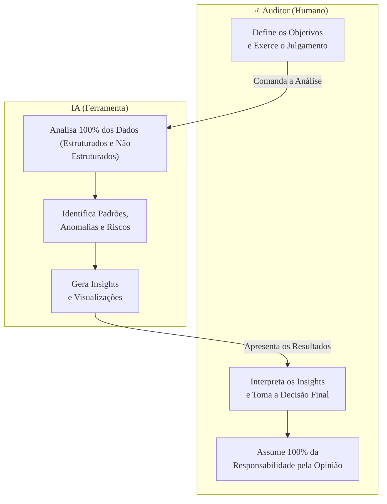

### Olá, futuro(a) aprovado(a)! Vamos turbinar seu conhecimento sobre Inteligência Artificial na Auditoria para o Cebraspe.

Pense no auditor como um detetive experiente e mestre em sua área 🕵️‍♂️. Por anos, ele usou ferramentas tradicionais. Agora, ele ganhou um parceiro novo: um super-robô analista com inteligência artificial 🤖. Vamos ver como essa dupla funciona.

---

### ### IA na Auditoria: O Detetive e seu Parceiro Robô

A **Inteligência Artificial (IA)** na auditoria não é um robô que vai roubar o emprego do detetive. Pelo contrário, é uma ferramenta superpoderosa que vai potencializar o trabalho dele.

* #### **IA vs. Ferramentas Antigas (TAACs)**
    * **TAACs Tradicionais (O Computador Antigo 💻):** É o computador antigo do detetive. Ele é bom e confiável para tarefas simples e baseadas em regras. O detetive diz: "Procure a palavra 'secreto' em todos os documentos". O computador obedece e encontra. Ele só faz o que foi explicitamente programado para fazer.
    * **Inteligência Artificial (O Parceiro Robô 🤖):** O parceiro robô é diferente. Ele **aprende**. O detetive não precisa dizer o que procurar. Ele diz: "Leia todos os casos de fraude dos últimos 10 anos e me diga o que eles têm em comum". O robô analisa tudo, encontra padrões ocultos e diz: "Detetive, percebi que fraudes geralmente acontecem em filiais com alta rotatividade de gerentes e pagamentos feitos às 2 da manhã. A filial X tem exatamente esse comportamento agora."

* #### **O Papel da IA como Ferramenta de Apoio**
    * **Visão de Raio-X:** Antes, o detetive só conseguia investigar alguns casos por vez (amostragem). O parceiro robô consegue analisar **TODOS** os casos da cidade de uma só vez (censo), diminuindo a chance de um crime passar despercebido.
    * **Foco no que Importa:** Enquanto o robô faz o trabalho pesado de ler pilhas de documentos e analisar planilhas (tarefas repetitivas), o detetive 🕵️‍♂️ pode usar seu tempo para o que só um humano faz bem: interrogar testemunhas difíceis, usar seu faro (ceticismo profissional) e montar o quebra-cabeça final (julgamento profissional).

**Foco Cebraspe (A "Pegadinha" de Ouro!):**
> A banca vai afirmar: "Com a IA, o julgamento profissional do auditor se torna desnecessário". **ERRADO! ERRADO! ERRADO!** A IA é uma ferramenta, um assistente. A **responsabilidade final** pela investigação e pela conclusão ("fulano é o culpado") é **sempre do detetive (auditor)**. O robô ajuda, mas o chefe é o humano.

---

### ### Aplicações Práticas: O que o Robô Faz na Prática?

O parceiro robô pode ajudar em várias missões durante a investigação.

* **No Planejamento (Prever o Crime):**
    * O robô analisa dados da cidade e diz: "Com base em padrões históricos, a maior chance de problema nas próximas semanas é em contratos de obras públicas". Isso ajuda o detetive a focar sua investigação.

* **Na Execução (Encontrar as Pistas):**
    * **Detecção de Anomalias:** O robô analisa todas as despesas da prefeitura e aponta: "É estranho. O mesmo CPF recebeu 50 pagamentos pequenos em um único dia, todos de secretarias diferentes". Isso cheira a fraude.
    * **Processamento de Linguagem Natural (PLN):** Este é o superpoder do robô! Ele consegue **ler e entender textos**. O detetive entrega 5.000 páginas de contratos e e-mails, e o robô:
        * Identifica cláusulas perigosas nos contratos. 📜
        * Encontra e-mails com conversas suspeitas sobre "combinar preços". 📧
        * Lê todas as atas de reunião e resume os pontos mais importantes.

* **No Relatório (Apresentar o Caso):**
    * O robô cria gráficos e mapas interativos incríveis que mostram visualmente como a fraude aconteceu, tornando o relatório do detetive muito mais claro e impactante para o "juiz" (a alta gestão).

**Foco Cebraspe:** Uma das maiores vantagens da IA é analisar dados **não estruturados** (textos, e-mails, imagens). As ferramentas antigas só conseguiam analisar planilhas (dados estruturados).

---

### ### Desafios e Riscos: O Lado Sombrio do Robô

Nosso parceiro robô é genial, mas também tem seus perigos e limitações.

* **Viés (Preconceito) nos Algoritmos 🤨:**
    * Se o robô foi treinado apenas com casos de fraude que aconteceram no "Bairro A", ele pode desenvolver um **viés** e começar a achar que qualquer pessoa do "Bairro A" é suspeita, mesmo que não seja. O detetive precisa estar ciente desse "preconceito" do robô para não cometer injustiças. A máxima vale aqui: "lixo entra, lixo sai" (*garbage in, garbage out*).

* **O Problema da "Caixa-Preta" (*Black Box*) ⬛:**
    * Às vezes, o detetive pergunta: "Robô, por que você acha que essa transação é suspeita?". E o robô responde: "Não sei explicar. Meus circuitos complexos apenas me dizem que é". Isso é uma "caixa-preta". O detetive não pode basear sua acusação nisso. Ele precisa usar essa "dica" do robô para buscar **evidências reais e explicáveis**.

* **Qualidade dos Dados:** Se os arquivos do caso que o detetive entrega ao robô estiverem bagunçados, incompletos ou errados, a análise do robô não valerá nada.

**Foco Cebraspe:** A "caixa-preta" não elimina a responsabilidade do auditor. Mesmo que ele não entenda 100% como o robô chegou à conclusão, ele precisa validar o resultado com outros procedimentos e continua sendo o único responsável pela opinião final.

### ### Mapa Mental: A Parceria Auditor-IA

Veja como funciona a dinâmica entre o detetive (auditor) e seu parceiro robô (IA).

### **Classe:** A
### **Conteúdo:** IA na Auditoria: Fundamentos e Papel como Ferramenta de Apoio

---

### **1. Inteligência Artificial na Auditoria: Fundamentos e Papel**

> #### **TEORIA-ALVO**
> A **Inteligência Artificial (IA)**, no contexto da auditoria, refere-se à utilização de sistemas computacionais capazes de executar tarefas que normalmente exigiriam inteligência humana, como aprendizado, raciocínio, resolução de problemas e compreensão de linguagem. A IA atua como uma ferramenta de apoio para aumentar as capacidades do auditor, e não para substituí-lo.
>
> * **Distinção entre IA e Técnicas de Auditoria Assistidas por Computador (TAACs) Tradicionais:**
>     * **TAACs Tradicionais:** Baseiam-se em regras explícitas e scripts predefinidos para analisar dados estruturados (e.g., executar uma consulta SQL para identificar faturas duplicadas). São determinísticas.
>     * **IA na Auditoria:** Vai além das regras explícitas. Utiliza algoritmos de aprendizado de máquina (*machine learning*) para identificar padrões, correlações e anomalias em grandes volumes de dados (estruturados e não estruturados) de forma autônoma, aprendendo e se adaptando com o tempo.
> * **Papel da IA como Ferramenta de Apoio:**
>     * **Aumento da Abrangência e Profundidade:** A IA permite a análise de populações inteiras de dados (censo) em vez de amostras, reduzindo o risco de detecção e permitindo a identificação de exceções que seriam perdidas na amostragem.
>     * **Elevação do Foco do Auditor:** Ao automatizar tarefas repetitivas e de baixo nível de julgamento, a IA libera o auditor para se concentrar em atividades de maior valor agregado, como a investigação de anomalias complexas, a avaliação de riscos estratégicos e o exercício do julgamento profissional.
>     * **Melhora no Planejamento da Auditoria:** Permite uma avaliação de riscos mais dinâmica e precisa, identificando áreas de maior vulnerabilidade para direcionar os esforços de auditoria.

> #### **FOCO CEBRASPE (Pontos de Atenção e "Pegadinhas")**
> > * **IA não Substitui o Julgamento Profissional:** Este é o ponto mais crítico. A banca frequentemente afirmará que a utilização de IA na auditoria elimina a necessidade do julgamento profissional do auditor. **ERRADO**. A IA é uma ferramenta que **aumenta** a capacidade do auditor, mas o julgamento profissional, o ceticismo e a responsabilidade final pela opinião de auditoria permanecem integralmente com o auditor.
> > * **Censo vs. Amostragem:** A capacidade da IA de analisar 100% da população de dados (e.g., todas as transações de um ano) é uma mudança de paradigma em relação à auditoria tradicional, baseada em testes por amostragem. Isso permite ao auditor reduzir o **risco de detecção** e o **risco de amostragem**.
> > * **IA vs. Automação Simples:** É incorreto tratar qualquer automação como IA. **ERRADO**. Uma macro em uma planilha ou um script para extrair dados são exemplos de automação baseada em regras. A IA se distingue pela capacidade de **aprender** com os dados e fazer **inferências** ou **previsões** sobre dados novos, sem ter sido explicitamente programada para cada cenário.

---

### **Classe:** A
### **Conteúdo:** Aplicações Práticas da IA na Auditoria

---

### **2. Aplicações Práticas da IA como Ferramenta de Apoio à Auditoria**

> #### **TEORIA-ALVO**
> As ferramentas de IA são aplicadas em diversas fases e atividades do processo de auditoria, desde o planejamento até a execução dos testes e a comunicação dos resultados.
>
> * **No Planejamento da Auditoria:**
>     * **Análise Preditiva para Avaliação de Riscos:** Utilização de modelos de *machine learning* para analisar dados históricos e variáveis de risco, a fim de prever quais processos, áreas ou transações têm maior probabilidade de conter erros, fraudes ou não conformidades. Isso permite um planejamento de auditoria mais focado e baseado em risco.
> * **Na Execução dos Testes:**
>     * **Detecção de Anomalias e Fraudes:** Algoritmos de IA podem analisar grandes volumes de dados transacionais (e.g., despesas de viagem, pagamentos a fornecedores, logs de acesso a sistemas de TI) para identificar padrões anômalos e outliers que fogem do comportamento esperado, sinalizando possíveis fraudes ou erros.
>     * **Processamento de Linguagem Natural (PLN):** Aplicação de IA para ler, compreender e classificar grandes volumes de documentos **não estruturados**.
>         * **Exemplos:** Análise de contratos para identificar cláusulas de risco; revisão de e-mails e comunicações para detectar indícios de conluio ou desvios de conduta; análise de atas de reunião e relatórios de gestão.
>     * **Análise de Controles Internos:** Automação de testes de controle, especialmente em ambientes de TI. Robôs de software (RPA combinados com IA) podem testar continuamente a configuração de segurança de sistemas, verificar a segregação de funções em sistemas ERP ou analisar logs de acesso para identificar violações de política.
> * **No Relatório de Auditoria:**
>     * **Visualização de Dados e Geração de Insights:** Ferramentas de IA podem ajudar a visualizar os padrões e as anomalias encontradas, gerando *insights* mais claros e impactantes para serem comunicados no relatório de auditoria.

> #### **FOCO CEBRASPE (Pontos de Atenção e "Pegadinhas")**
> > * **Análise de Dados Não Estruturados:** Uma das maiores vantagens da IA sobre as TAACs tradicionais é sua capacidade de analisar dados **não estruturados**, como textos e imagens. A banca pode questionar sobre a aplicabilidade do PLN para a análise de contratos e e-mails, o que é um caso de uso clássico.
> > * **Contexto de Auditoria de TI:** Em uma prova de TI, os exemplos serão direcionados. A banca pode perguntar como a IA pode ser usada para auditar a segurança de uma rede. A resposta envolveria a **análise de logs de *firewalls* e IDS/IPS para detectar padrões de ataque anômalos ou tráfego suspeito** que não correspondem a assinaturas conhecidas.
> > * **Risco e Controle:** A aplicação de IA permite ao auditor uma visão mais abrangente e contínua do ambiente de riscos e da eficácia dos controles, podendo evoluir de uma auditoria pontual para um modelo de **auditoria contínua**.

---

### **Classe:** A
### **Conteúdo:** Desafios e Riscos do Uso de IA na Auditoria

---

### **3. Desafios, Riscos e Limitações da IA na Auditoria**

> #### **TEORIA-ALVO**
> A adoção da Inteligência Artificial na auditoria, apesar de seus benefícios, introduz novos desafios e riscos que devem ser gerenciados pelo auditor e pela organização.
>
> * **Viés (Bias) nos Algoritmos e nos Dados:**
>     * **Descrição:** Os modelos de IA aprendem a partir dos dados com os quais são treinados. Se os dados históricos contiverem vieses (e.g., se auditorias passadas focaram desproporcionalmente em certas áreas), o modelo de IA irá aprender, perpetuar e potencialmente amplificar esses vieses, o que pode levar a conclusões de auditoria distorcidas ou discriminatórias.
> * **Explicabilidade e o Problema da "Caixa-Preta" (*Black Box*):**
>     * **Descrição:** Muitos algoritmos de IA, especialmente os de aprendizado profundo (*deep learning*), são complexos a ponto de ser extremamente difícil ou impossível para um humano entender e explicar o raciocínio exato que levou o modelo a uma determinada conclusão.
>     * **Impacto na Auditoria:** Isso representa um desafio significativo, pois o auditor precisa obter **evidência suficiente e apropriada** para suportar suas conclusões. Se a ferramenta principal é uma "caixa-preta", o auditor precisa de procedimentos adicionais para validar a lógica e a confiabilidade do modelo.
> * **Qualidade e Governança dos Dados:**
>     * **Descrição:** O desempenho de um sistema de IA é diretamente dependente da qualidade, da completude e da integridade dos dados utilizados em seu treinamento e operação. Dados de baixa qualidade levarão a resultados e insights não confiáveis (*garbage in, garbage out*).
> * **Competências e Custo:**
>     * **Descrição:** A implementação eficaz de IA em auditoria exige novas competências por parte da equipe, como ciência de dados, estatística e programação, além de um investimento significativo em tecnologia e infraestrutura.

> #### **FOCO CEBRASPE (Pontos de Atenção e "Pegadinhas")**
> > * **A Questão da "Caixa-Preta" e a Responsabilidade do Auditor:** A banca vai explorar este ponto. É incorreto afirmar que o auditor pode delegar sua responsabilidade de julgamento ao algoritmo de IA. **ERRADO**. Mesmo utilizando um modelo "caixa-preta", o auditor **permanece responsável** pela opinião de auditoria. Ele deve entender as premissas, as limitações e realizar procedimentos para validar a confiabilidade dos resultados gerados pela ferramenta.
> > * **Viés Algorítmico:** A banca pode apresentar um cenário em que um modelo de IA para detecção de fraudes sinaliza um número desproporcional de transações de uma determinada filial. O candidato deve ser capaz de identificar que isso pode ser um sintoma de **viés** no modelo, e não necessariamente uma prova de maior incidência de fraude naquela filial.
> > * **Conformidade com a LGPD:** O uso de IA para analisar dados na auditoria, especialmente dados pessoais, deve estar em estrita conformidade com a Lei Geral de Proteção de Dados, respeitando os princípios da finalidade, necessidade e os direitos dos titulares.
