### Olá, futuro(a) aprovado(a)! Vamos decifrar as ISSAIs, as regras de ouro da auditoria governamental.

Pense no auditor do setor público como um **médico especialista em saúde de organizações públicas** 👨‍⚕️. As ISSAIs são o conjunto de manuais e o código de ética que esse médico precisa seguir para fazer um diagnóstico preciso e confiável.

---

### ### ISSAI 30 e 100: O Juramento e o Manual Básico do Médico-Auditor

Antes de se especializar, todo médico precisa de uma base sólida. Na auditoria, essa base são as ISSAI 30 e 100.

* #### **ISSAI 30 - O Código de Ética (O "Juramento de Hipócrates" do Auditor)**
    É o conjunto de valores que o auditor jura seguir. Ele promete:
    1.  **Integridade:** Ser honesto e justo, sem "puxar a sardinha" para ninguém.
    2.  **Independência e Objetividade:** Não deixar que amizades ou interesses pessoais interfiram no diagnóstico. O médico não pode deixar de dar uma má notícia só porque o paciente é seu amigo. **Atenção:** A independência precisa ser **de fato** (na mente do auditor) e **de aparência** (o que as outras pessoas veem).
    3.  **Competência:** Estudar sempre e ter o conhecimento necessário para fazer o diagnóstico certo.
    4.  **Comportamento Profissional:** Agir de forma que honre a "profissão médica", seguindo as regras.
    5.  **Confidencialidade e Transparência:** Guardar o segredo do paciente (confidencialidade), mas também ser transparente quando a lei ou o bem maior exigem (ex: reportar uma doença contagiosa).

* #### **ISSAI 100 - Princípios Fundamentais (O "Manual Básico de Diagnóstico")**
    É a norma **"guarda-chuva"** ☂️. Ela estabelece os princípios básicos que valem para **TODOS** os tipos de "exames" (auditorias). Ela diz que todo diagnóstico precisa ter:
    * **Ética e independência** (reforçando a ISSAI 30).
    * **Julgamento profissional, ceticismo e zelo:** O médico precisa usar sua experiência, duvidar de tudo (**ceticismo**) e ser cuidadoso.
    * **Planejamento baseado em risco:** O médico foca os exames onde há maior risco de doença.
    * **Documentação:** Anotar tudo no prontuário do paciente.

**Foco Cebraspe:**
> O **ceticismo profissional** é crucial! A banca vai mostrar um cenário onde o auditor acredita em tudo que o gestor diz. **ERRADO!** O bom médico-auditor ouve o paciente, mas sempre pede exames para confirmar, com uma mente questionadora.

---

### ### Os Tipos de Auditoria: As Especialidades Médicas

Com a base em mãos, nosso médico-auditor pode se especializar. Existem três grandes especialidades, e o Cebraspe adora misturar os objetivos delas.

| Especialidade Médica (Tipo de Auditoria) | Foco Principal | Pergunta-Chave | ISSAI de Referência |
| :--- | :--- | :--- | :--- |
| **Auditoria Financeira** 💰 | **Cardiologista** | "O coração financeiro da organização está batendo certo? As demonstrações contábeis (o 'eletrocardiograma') são confiáveis?" | **ISSAI 200** |
| **Auditoria de Desempenho (Operacional)** 🚀 | **Nutricionista / Fisioterapeuta** | "A organização está em boa forma? Ela está usando seus recursos (nutrientes) da melhor maneira para atingir seus objetivos de saúde (os '3 Es')?" | **ISSAI 300** |
| **Auditoria de Conformidade** ⚖️ | **Clínico Geral / Médico Legista** | "A organização está seguindo todas as 'prescrições médicas' (as leis e regulamentos) corretamente?" | **ISSAI 400** |

#### Foco Cebraspe: Os "3 Es" e a Segurança Razoável

* **Os "3 Es" da Auditoria de Desempenho:**
    * **E**conomicidade: Comprar os "remédios" pelo menor preço, sem perder a qualidade.
    * **E**ficiência: Usar a menor quantidade de "remédio" para obter o máximo de resultado.
    * **E**ficácia: O "tratamento" alcançou o objetivo de curar o paciente?

* **Segurança Razoável (Auditoria Financeira):** O "eletrocardiograma" (parecer do auditor) atesta com **segurança razoável** que o coração está bem. Não é uma segurança **absoluta**. Sempre existe uma pequena chance de uma anomalia não ter sido detectada, devido às limitações do exame (como o uso de amostragem). A banca vai dizer que a auditoria garante 100% de certeza. **ERRADO!**

### ### Mapa Mental: A Estrutura das ISSAIs

Veja como as principais normas se conectam, formando a base da auditoria governamental.

```mermaid
%%{init: {"theme": "tokyo-midnight", "themeVariables": { "fontFamily": "lexend"}}}%%
graph TD;
    subgraph "🏛️ FUNDAMENTOS DA AUDITORIA GOVERNAMENTAL"
    A["📜 ISSAI 100 <br> (Princípios Fundamentais - A Base)"];
    B["❤️ ISSAI 30 <br> (Código de Ética - Envolve Tudo)"];
    end

    subgraph "🕵️‍♀️ ESPECIALIDADES (Tipos de Auditoria)"
        C["💰 Financeira <br> (ISSAI 200)"];
        D["🚀 Desempenho <br> (ISSAI 300)"];
        E["⚖️ Conformidade <br> (ISSAI 400)"];
    end

    A --> C;
    A --> D;
    A --> E;

    style B fill:#333,stroke:#ff9e64,stroke-width:2px,stroke-dasharray: 5, 5
```

### **Classe:** A
### **Conteúdo:** ISSAIs: Princípios Fundamentais e Código de Ética

---

### **1. ISSAI 30 e ISSAI 100: Fundamentos da Auditoria do Setor Público**

> #### **TEORIA-ALVO**
> As Normas Internacionais de Entidades Fiscalizadoras Superiores (ISSAI - *International Standards of Supreme Audit Institutions*) estabelecem o arcabouço de princípios e diretrizes para a auditoria governamental. A ISSAI 30 e a ISSAI 100 formam a base conceitual e ética para todo o trabalho de auditoria no setor público.
>
> * **ISSAI 30 - Código de Ética:**
>     * **Propósito:** Estabelecer os princípios éticos fundamentais e os valores que os auditores do setor público devem observar.
>     * **Princípios Éticos Fundamentais:**
>         1.  **Integridade:** Ser probo, honesto, imparcial e justo nas relações profissionais.
>         2.  **Independência e Objetividade:** Ser livre, de fato e de aparência, de condições e relacionamentos que possam comprometer o julgamento profissional. A objetividade é uma atitude mental imparcial.
>         3.  **Competência:** Possuir e manter o conhecimento, as habilidades e a proficiência profissional necessários para desempenhar as responsabilidades de auditoria.
>         4.  **Comportamento Profissional:** Cumprir as leis e os regulamentos aplicáveis e evitar qualquer conduta que possa desacreditar a Entidade de Fiscalização Superior (EFS).
>         5.  **Confidencialidade e Transparência:** Resguardar as informações obtidas durante a auditoria, não as divulgando sem autorização, a menos que haja um dever ou direito legal de fazê-lo.
> * **ISSAI 100 - Princípios Fundamentais de Auditoria do Setor Público:**
>     * **Propósito:** Define e descreve os princípios fundamentais que se aplicam a **todos** os tipos de auditoria do setor público (financeira, de desempenho e de conformidade).
>     * **Estrutura:** A norma está organizada em dois grupos de princípios:
>         * **Princípios Gerais:** Requisitos essenciais para o auditor e a instituição de auditoria, como **Ética e independência**, e **Julgamento profissional, ceticismo e zelo**.
>         * **Princípios Relacionados ao Processo de Auditoria:** Requisitos relacionados à condução do trabalho, como **Planejamento baseado em risco**, **Materialidade**, **Documentação** e **Comunicação**.
>     * **Ceticismo Profissional:** Atitude que inclui uma mente questionadora, estar alerta a condições que possam indicar possível distorção e uma avaliação crítica das evidências de auditoria.

> #### **FOCO CEBRASPE (Pontos de Atenção e "Pegadinhas")**
> > * **Independência de Fato e de Aparência:** A banca frequentemente testa o entendimento de que a independência não é apenas uma questão de estado mental (**de fato**), mas também de como a situação é percebida por terceiros (**de aparência**). Um auditor deve evitar situações que possam levar um terceiro razoável a concluir que sua independência está comprometida.
> > * **Confidencialidade vs. Transparência:** A ISSAI 30 estabelece um equilíbrio. A confidencialidade não é absoluta e pode ser suplantada por exigências legais ou pela necessidade de transparência, conforme as leis e regulamentos.
> > * **ISSAI 100 como Norma "Guarda-Chuva":** É fundamental entender que os princípios da ISSAI 100 são a base para os demais tipos de auditoria. As normas específicas (ISSAI 200, 300, 400) detalham como esses princípios fundamentais se aplicam a cada contexto.
> > * **Ceticismo Profissional:** A banca pode apresentar um cenário onde o auditor confia cegamente nas informações fornecidas pelo gestor auditado. Tal postura viola o princípio do ceticismo profissional, que exige uma avaliação crítica e questionadora das evidências.

---

### **Classe:** A
### **Conteúdo:** Tipos de Auditoria: Financeira, de Desempenho e de Conformidade

---

### **2. Auditoria Financeira (ISSAI 200), de Desempenho (ISSAI 300) e de Conformidade (ISSAI 400)**

> #### **TEORIA-ALVO**
> Com base nos princípios da ISSAI 100, as normas subsequentes detalham as especificidades de cada um dos três principais tipos de auditoria governamental.
>
> * **ISSAI 200 - Princípios Fundamentais de Auditoria Financeira:**
>     * **Objetivo:** Aumentar o grau de confiança dos usuários nas demonstrações financeiras. Isso é alcançado através da expressão de uma **opinião** do auditor sobre se as demonstrações foram elaboradas, em todos os aspectos relevantes, em conformidade com um arcabouço de relatório financeiro aplicável.
>     * **Foco:** **Fidedignidade** das informações financeiras e contábeis.
>     * **Segurança:** A auditoria é conduzida para obter **segurança razoável**, não absoluta, de que as demonstrações estão livres de distorção relevante.
> * **ISSAI 300 - Princípios Fundamentais de Auditoria de Desempenho (Operacional):**
>     * **Objetivo:** Examinar se as atividades, programas ou organizações do governo estão operando de acordo com os princípios da **economicidade, eficiência e eficácia** (os "3 Es"). A auditoria de desempenho visa promover melhorias na gestão pública.
>     * **Foco:** **Desempenho** da gestão e uso dos recursos públicos.
>     * **ISSAI 3000:** Fornece diretrizes de implementação para a ISSAI 300.
> * **ISSAI 400 - Princípios Fundamentais de Auditoria de Conformidade:**
>     * **Objetivo:** Avaliar se as atividades, transações financeiras e informações da entidade auditada estão, em todos os seus aspectos relevantes, em conformidade com as **autoridades** que a governam (leis, regulamentos, contratos, etc.).
>     * **Foco:** **Legalidade e regularidade** dos atos.
>     * **ISSAI 4100:** Fornece diretrizes para auditorias de conformidade realizadas como um trabalho separado.

> #### **FOCO CEBRASPE (Pontos de Atenção e "Pegadinhas")**
> > * **Distinção entre os Objetivos dos Tipos de Auditoria:** Esta é a principal fonte de questões. A banca vai descrever um trabalho de auditoria e perguntar a qual tipo ele pertence. É mandatório associar:
> >     * **Financeira → Opinião sobre demonstrações contábeis.**
> >     * **Desempenho/Operacional → Avaliação dos "3 Es" (Economicidade, Eficiência, Eficácia).**
> >     * **Conformidade/Regularidade → Aderência a leis e normas.**
> >     * Exemplo de erro: "Uma auditoria que verifica se uma contratação de TI seguiu as regras da Lei nº 14.133/2021 é uma auditoria de desempenho". **ERRADO**. É uma auditoria de **conformidade**.
> > * **Segurança Razoável (Auditoria Financeira):** A banca pode afirmar que uma opinião de auditoria não modificada (limpa) garante que as demonstrações financeiras estão absolutamente livres de erros ou fraudes. **ERRADO**. A auditoria fornece **segurança razoável**, que é um nível alto, mas não absoluto, de segurança, devido às limitações inerentes ao processo de auditoria (e.g., uso de amostragem).
> > * **Os "3 Es" da Auditoria de Desempenho:** É fundamental conhecer a definição de cada termo: **Economicidade** (minimizar o custo dos recursos, mantendo a qualidade), **Eficiência** (relação entre os produtos gerados e os recursos utilizados) e **Eficácia** (grau em que os objetivos estabelecidos são alcançados).
