### Olá, futuro(a) aprovado(a)! Vamos desvendar o Planejamento da Auditoria para o Cebraspe.

Pense no planejamento de uma auditoria como **planejar uma viagem de carro super importante por todo o país** 🚗💨. Você é o piloto e planejador-chefe. Um bom plano é a diferença entre uma viagem tranquila e um desastre na estrada.

---

### ### O Plano de Viagem: Rota, Limites e o "Tamanho do Problema"

Antes de ligar o carro, você precisa de um plano mestre.

* **Plano de Auditoria:** É o seu **roteiro de viagem completo**. Ele diz exatamente o que você vai verificar no carro, quando e como, para garantir que a viagem (a auditoria) seja um sucesso.

* **Escopo e Objetivos:**
    * **Objetivo:** É o destino final. "Quero verificar se o carro é seguro para a viagem".
    * **Escopo:** É a rota e os limites da sua viagem. "Vou verificar apenas o motor e os freios, no período de segunda a quarta-feira".

* **Materialidade (O "Tamanho do Problema" que Importa):**
    * Imagine que, durante a viagem, você precisa decidir quando parar por causa de um problema no carro.
    * Um **arranhão na pintura** não é importante para o objetivo da viagem. Ele **não é material**.
    * Um **pneu furado** ou o **freio falhando** é um problema grave que te impede de continuar. Ele **é material**.
    * **Materialidade** é o seu critério para definir o que é um "problemão" que precisa de atenção imediata. É um **julgamento profissional** seu, como piloto. Não existe uma regra fixa.

**Foco Cebraspe:**
> * **Plano flexível:** A banca dirá que o roteiro da viagem é fixo. **ERRADO!** Se você descobre uma tempestade à frente (uma nova informação), você **pode e deve** alterar a rota. O planejamento é **iterativo**.
> * **Relação Inversa (Materialidade e Risco):** Se você for um piloto **muito rigoroso** (define um nível de **materialidade baixo** - até um pneu um pouco murcho já é um "problemão"), significa que você percebe um **risco maior** na viagem e, por isso, vai precisar parar para **fazer mais checagens** (mais trabalho de auditoria).

---

### ### Avaliação de Riscos: O Carro, a Estrada e Você

Um bom piloto avalia todos os riscos antes e durante a viagem.

* **Controle Interno:** São os **sistemas de segurança do próprio carro** (o cinto de segurança, os freios ABS, a luz de alerta do motor). Se eles são bons, a viagem é mais segura.

* **O Modelo de Risco da Viagem (RA = RI x RC x RD):**
    * **Risco Inerente (RI):** É o **risco da estrada**. Uma estrada montanhosa e cheia de curvas no inverno é perigosa, não importa o quão bom seja o seu carro. Esse risco existe independentemente de você.
    * **Risco de Controle (RC):** É o **risco dos sistemas de segurança do carro falharem**. O freio ABS não funcionar na chuva, por exemplo. Esse risco é do carro (da entidade auditada).
    * **Risco de Detecção (RD):** É o **risco de VOCÊ, o piloto, não perceber um problema**. Não ouvir um barulho estranho no motor ou não ver um buraco na pista. **Este é o único risco que você pode controlar diretamente**, sendo mais ou menos atento.

**Foco Cebraspe (A "Pegadinha" Clássica!):**
> * **Riscos do Cliente vs. Riscos do Auditor:** Lembre-se, Risco Inerente e Risco de Controle são problemas **da estrada e do carro**. O Risco de Detecção é um problema **do piloto (auditor)**.
> * **Relação Inversa:** Se a estrada é perigosa (RI alto) e os freios do carro não são confiáveis (RC alto), o que você, piloto, faz? Você **redobra a atenção** e dirige devagar (aceita um RD baixo), fazendo muito mais checagens (mais procedimentos de auditoria).

---

### ### Programas e Testes: A "Checklist" da Viagem

Com o plano e os riscos avaliados, você cria sua "checklist" de ações.

* **Programa de Auditoria:** É a sua **lista de tarefas detalhada** para cada dia. "Dia 1: Checar pressão dos pneus. Verificar nível do óleo. Dirigir 300 km. etc.".

* **Testes de Auditoria:**
    * **Teste de Controle:** Serve para ver se os **sistemas de segurança do carro estão funcionando**. "Vou pisar fundo no freio em um local seguro para ver se o ABS ativa". Você está testando o **processo**.
    * **Procedimento Substantivo:** Serve para ver se o **resultado final está correto**. "Vou pegar o medidor e verificar se a pressão do pneu é realmente 32 PSI". Você está verificando o **dado/valor**.

* **Amostragem 🥄:** Você não precisa verificar todos os 200 parafusos do carro. Você pega uma **amostra** dos mais importantes e, com base nela, conclui sobre a situação de todos os outros parafusos.

---

### ### Instrumentos: O Diário de Bordo e os Mapas

Toda a sua viagem precisa ser registrada.

* **Papéis de Trabalho 📓:** É o seu **diário de bordo**. Nele você anota TUDO: cada checagem que fez, cada recibo de gasolina, cada foto, cada problema encontrado. **E atenção:** este diário é de sua **propriedade exclusiva**, como piloto/auditor.

* **Matrizes:** São seus mapas e logs organizados.
    * **Matriz de Planejamento:** O grande mapa na parede da sua casa, com a rota, os postos de gasolina e os hotéis planejados antes de sair.
    * **Matriz de Achados (O Log de Problemas - Os 4 "C"s):**
        * **C**ondição: "O carro está puxando para a direita". (O que é)
        * **C**ritério: "O carro deveria andar em linha reta". (O que deveria ser)
        * **C**ausa: "O pneu direito está murcho". (Por quê?)
        * **C**onsequência (Efeito): "Isso pode causar um acidente e desgastar o pneu". (E daí?)

### ### Mapa Mental: O Fluxo do Planejamento da Auditoria

Veja como as fases do planejamento se conectam de forma lógica.

```mermaid
%%{init: {"theme": "tokyo-midnight", "themeVariables": { "fontFamily": "lexend"}}}%%
graph TD;
    A["🗺️ Definir Objetivo e Escopo <br> (Destino e Rota)"] --> B["⚖️ Definir Materialidade <br> (Tamanho do Problema)"];
    B --> C["🚨 Avaliar Riscos <br> (Estrada, Carro e Piloto)"];
    C --> D["📝 Desenvolver o Plano <br> (Estratégia Geral)"];
    D --> E["✅ Elaborar o Programa <br> (Checklist Detalhada)"];
    E --> F["🚗 Iniciar a Execução <br> (A Viagem Começa)"];
```

### **Classe:** A
### **Conteúdo:** Plano de Auditoria: Escopo, Materialidade e Risco

---

### **1. Planejamento da Auditoria: Escopo, Objetivos, Materialidade e Relevância**

> #### **TEORIA-ALVO**
> O **Planejamento da Auditoria** é a fase inicial e crucial do processo de auditoria, na qual o auditor estabelece a estratégia global e desenvolve um plano detalhado para a condução do trabalho. Um planejamento adequado é fundamental para a eficácia e a eficiência da auditoria.
>
> * **Plano de Auditoria:** Documento que detalha a natureza, a época e a extensão dos procedimentos de auditoria a serem realizados pela equipe, visando reduzir o risco de auditoria a um nível aceitavelmente baixo.
> * **Escopo e Objetivos:**
>     * **Objetivos:** Definem o propósito da auditoria (e.g., opinar sobre a conformidade, avaliar a eficiência de um processo).
>     * **Escopo:** Define os limites da auditoria, incluindo as unidades organizacionais, os sistemas de informação, os processos de negócio e o período a ser examinado.
> * **Materialidade e Relevância:**
>     * **Materialidade:** Conceito que se refere à magnitude ou à natureza de uma distorção (incluindo omissão) em uma informação que, à luz das circunstâncias, torna provável que o julgamento de uma pessoa razoável, baseando-se na informação, teria sido alterado ou influenciado. A materialidade é um julgamento profissional e é definida na fase de planejamento para guiar os testes e para avaliar o efeito das distorções identificadas.
>     * **Relevância:** Conceito qualitativo associado à importância de um tema para os objetivos da auditoria e para as necessidades dos usuários do relatório. Um assunto pode ser material em termos quantitativos, qualitativos, ou ambos.

> #### **FOCO CEBRASPE (Pontos de Atenção e "Pegadinhas")**
> > * **Planejamento como Processo Iterativo:** A banca pode afirmar que o plano de auditoria, uma vez definido, é imutável. **ERRADO**. O planejamento não é uma fase estanque, mas um processo contínuo e iterativo ao longo da auditoria. O plano pode e deve ser revisado e alterado conforme necessário em resposta a informações obtidas durante a execução.
> > * **Materialidade como Julgamento Profissional:** Não existe um valor monetário fixo ou uma fórmula universal para determinar a materialidade. **ERRADO** seria afirmar que "qualquer distorção acima de R$ 10.000,00 é sempre material". A determinação da materialidade depende do contexto e do julgamento profissional do auditor.
> > * **Relação Inversa entre Materialidade e Risco:** Há uma relação **inversa** entre o nível de materialidade e o risco de auditoria. Quanto **menor** o nível de materialidade definido pelo auditor (ou seja, mais rigoroso), **maior** é o risco de auditoria percebido e, consequentemente, **maior** será a extensão dos procedimentos de auditoria necessários para reduzir esse risco.

---

### **Classe:** A
### **Conteúdo:** Avaliação de Riscos e Controles Internos no Planejamento

---

### **2. Avaliação de Riscos de Auditoria e Controles Internos**

> #### **TEORIA-ALVO**
> Uma etapa fundamental do planejamento da auditoria é a compreensão da entidade e de seu ambiente, incluindo seu sistema de **controle interno**, para identificar e avaliar os riscos de distorção relevante.
>
> * **Controle Interno:** O auditor deve obter um entendimento do sistema de controle interno relevante para a auditoria. A força ou a fraqueza dos controles internos da entidade auditada influencia diretamente a abordagem de auditoria. Controles internos eficazes reduzem o risco de distorções relevantes.
> * **Modelo de Risco de Auditoria:** O risco de auditoria é o risco de que o auditor expresse uma opinião de auditoria inadequada quando as informações auditadas contiverem uma distorção relevante. Ele é composto por três componentes:
>     * **Risco Inerente:** A suscetibilidade de uma afirmação a uma distorção que possa ser material, individualmente ou em conjunto com outras distorções, **pressupondo a ausência de controles** internos relacionados.
>     * **Risco de Controle:** O risco de que uma distorção que possa ocorrer em uma afirmação e que possa ser material não seja prevenida, detectada e corrigida tempestivamente pelo **sistema de controle interno da entidade**.
>     * **Risco de Detecção:** O risco de que os **procedimentos executados pelo auditor** não detectem uma distorção existente que possa ser material. Este é o único componente do risco que o auditor pode controlar diretamente.
> * **Fórmula do Risco:** Risco de Auditoria (RA) = Risco Inerente (RI) × Risco de Controle (RC) × Risco de Detecção (RD).

> #### **FOCO CEBRASPE (Pontos de Atenção e "Pegadinhas")**
> > * **Componentes do Risco:** A banca frequentemente confunde os componentes. É crucial saber que **Risco Inerente e Risco de Controle** existem na entidade auditada, **independentemente da auditoria**. Eles são riscos do "cliente". O **Risco de Detecção** é o risco do **trabalho do auditor**.
> > * **Relação Inversa entre Riscos:** Há uma relação **inversa** entre o nível combinado do risco inerente e de controle e o nível aceitável de risco de detecção. Se o auditor avalia que os riscos inerente e de controle são **altos**, ele deve aceitar um risco de detecção **baixo**, o que exige a aplicação de **mais e melhores procedimentos de auditoria**. Inversamente, se os controles internos são fortes (baixo risco de controle), o auditor pode aceitar um risco de detecção maior e reduzir a extensão dos testes.
> > * **Auditoria baseada em Risco:** O planejamento de uma auditoria moderna é **baseado em risco**. Isso significa que os esforços de auditoria devem ser direcionados para as áreas de maior risco de distorção relevante.

---

### **Classe:** A
### **Conteúdo:** Programas, Testes e Amostragem em Auditoria

---

### **3. Programas, Testes e Amostragem em Auditoria**

> #### **TEORIA-ALVO**
> Com base no planejamento, o auditor desenvolve programas de auditoria que detalham os testes a serem aplicados, os quais podem ser realizados sobre todos os itens de uma população ou sobre uma amostra representativa.
>
> * **Programa de Auditoria:** Documento que detalha a natureza, a época e a extensão dos **procedimentos de auditoria** (as atividades) planejados, que são necessários para implementar o plano de auditoria geral. Serve como um conjunto de instruções para a equipe e como meio de controle da execução do trabalho.
> * **Testes de Auditoria:**
>     * **Testes de Controle (ou Testes de Observância):** Procedimentos de auditoria planejados para avaliar a **eficácia operacional dos controles internos** em prevenir ou detectar e corrigir distorções relevantes. Respondem à pergunta: "Os controles funcionam como planejado?".
>     * **Procedimentos Substantivos:** Procedimentos planejados para detectar **distorções relevantes no nível de afirmação**. Respondem à pergunta: "Existem erros ou fraudes nos dados/saldos?". Dividem-se em:
>         * **Testes de Detalhes:** Exame de transações, saldos contábeis e divulgações individuais.
>         * **Procedimentos Analíticos Substantivos:** Avaliação de informações por meio do estudo de relações plausíveis entre dados financeiros e não financeiros.
> * **Amostragem em Auditoria:**
>     * **Definição:** A aplicação de procedimentos de auditoria a **menos de 100%** dos itens de uma população relevante para a auditoria, de forma que todas as unidades de amostragem tenham a mesma chance de serem selecionadas.
>     * **Objetivo:** Permitir que o auditor obtenha e avalie evidências sobre alguma característica dos itens selecionados para formar uma conclusão sobre a **população inteira**.
>     * **Risco de Amostragem:** O risco de que a conclusão do auditor baseada em uma amostra seja diferente da conclusão que seria alcançada se toda a população fosse submetida ao mesmo procedimento.

> #### **FOCO CEBRASPE (Pontos de Atenção e "Pegadinhas")**
> > * **Teste de Controle vs. Procedimento Substantivo:** A banca vai confundir os objetivos dos testes. **Testes de Controle** avaliam a eficácia dos **processos**. **Procedimentos Substantivos** buscam distorções nos **dados e valores**. Exemplo: "Verificar se as aprovações de acesso a um sistema de TI seguem a política de segurança" é um **teste de controle**. "Recalcular os valores de uma folha de pagamento para verificar sua exatidão" é um **procedimento substantivo (teste de detalhes)**.
> > * **Amostragem Estatística vs. Não Estatística:** A **amostragem estatística** utiliza a teoria das probabilidades para selecionar a amostra e avaliar os resultados, permitindo a **quantificação do risco de amostragem**. A **amostragem não estatística** baseia-se no **julgamento profissional** do auditor para selecionar a amostra.
> > * **Objetivo da Amostragem:** A amostragem é utilizada para inferir características de uma população. É incorreto afirmar que o objetivo da amostragem é reduzir o risco de auditoria a zero. **ERRADO**. A amostragem, por sua natureza, **introduz o risco de amostragem**.

---

### **Classe:** A
### **Conteúdo:** Instrumentos da Auditoria: Matrizes e Papéis de Trabalho

---

### **4. Matrizes e Papéis de Trabalho**

> #### **TEORIA-ALVO**
> A execução da auditoria é documentada por meio de instrumentos padronizados que garantem a organização, a rastreabilidade e a sustentação das conclusões do auditor.
>
> * **Papéis de Trabalho:**
>     * **Definição:** O registro dos procedimentos de auditoria executados, da evidência pertinente obtida e das conclusões alcançadas pelo auditor. Podem incluir programas de auditoria, análises, memorandos, resumos de questões importantes, cartas de confirmação, entre outros.
>     * **Finalidade:** Auxiliar no planejamento e na execução da auditoria; auxiliar na supervisão e revisão do trabalho; registrar a evidência de auditoria que serve de base para o relatório do auditor; e demonstrar que o trabalho foi executado em conformidade com as normas aplicáveis.
> * **Matriz de Planejamento:**
>     * **Definição:** Um instrumento de planejamento que correlaciona as questões de auditoria com os critérios, as evidências necessárias, os procedimentos a serem aplicados e os recursos envolvidos. Ajuda a estruturar a lógica da auditoria antes do início da fase de execução.
> * **Matriz de Achados (ou Matriz de Responsabilização):**
>     * **Definição:** Um instrumento utilizado para registrar e consolidar os achados de auditoria de forma estruturada.
>     * **Estrutura:** Normalmente, detalha para cada achado os seus quatro atributos fundamentais:
>         1.  **Condição:** A situação encontrada ("o que é").
>         2.  **Critério:** A norma, o padrão ou a meta que deveria ser seguida ("o que deveria ser").
>         3.  **Causa:** A razão da divergência entre a condição e o critério.
>         4.  **Efeito (ou Consequência):** O impacto real ou potencial da divergência.
>     * Adicionalmente, a matriz pode conter as recomendações da equipe de auditoria e os comentários do gestor auditado.

> #### **FOCO CEBRASPE (Pontos de Atenção e "Pegadinhas")**
> > * **Propriedade dos Papéis de Trabalho:** Os papéis de trabalho são de **propriedade exclusiva do auditor**. Embora a entidade auditada possa ter acesso a partes deles, a critério do auditor, eles não pertencem à entidade.
> > * **Atributos do Achado:** A banca frequentemente testa o conhecimento sobre os quatro atributos de um achado de auditoria (Condição, Critério, Causa, Efeito). Uma questão pode descrever um achado e omitir um dos atributos, ou descrever um atributo de forma incorreta.
> > * **Relação entre Instrumentos:** O **Programa de Auditoria** (definido no planejamento) guia a execução. As evidências coletadas na execução são registradas nos **Papéis de Trabalho**. As discrepâncias encontradas são formalizadas como **Achados** na Matriz de Achados. As conclusões baseadas nos achados são comunicadas no **Relatório de Auditoria**. É fundamental entender esse fluxo.
