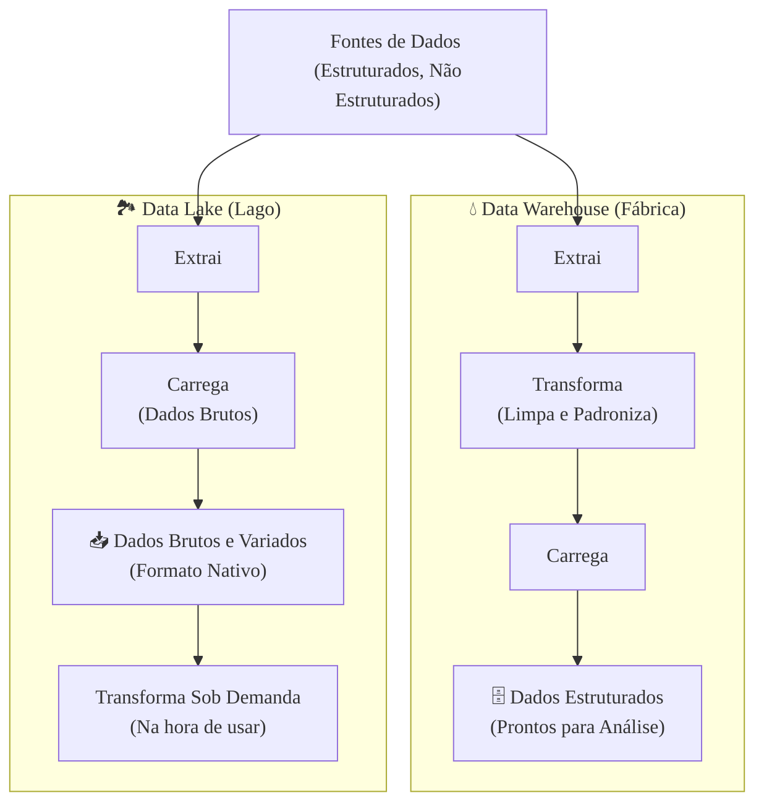

### Olá, futuro(a) aprovado(a)! Vamos mergulhar no universo de Big Data e Data Lakes sem medo de se afogar em termos técnicos.

Pense em **Big Data** como tentar beber água de um hidrante de bombeiro 🚒. É muita água, vindo muito rápido e de todos os tipos (às vezes com areia, às vezes limpa). As ferramentas antigas, como um copo de vidro (bancos de dados tradicionais), simplesmente não dão conta.

---

### ### Big Data: Os Famosos "Vs"

Big Data não é só sobre o tamanho da água. São 5 características, os "5 Vs", que o definem. O Cebraspe adora cobrar isso!

| O "V" | O que é? | Analogia do Hidrante 🚒 |
| :--- | :--- | :--- |
| **Volume** 📚 | A **quantidade** de dados. É muita, muita coisa. | A quantidade absurda de água jorrando do hidrante, medida em milhões de litros. |
| **Velocidade** 💨 | A **rapidez** com que os dados são gerados e chegam. | A velocidade alucinante com que a água sai do hidrante. É um fluxo contínuo. |
| **Variedade** 🎭 | Os **diferentes tipos** de dados. | A água pode vir misturada com areia (dado não estruturado), folhas (semiestruturado) ou ser purinha (estruturado). |
| **Veracidade** 🤔 | A **confiabilidade** e a qualidade dos dados. | A água que sai do hidrante é limpa e potável ou está suja e contaminada? Você pode confiar nela? |
| **Valor** 💰 | A capacidade de **extrair algo útil** desses dados. | Conseguir usar toda essa água para gerar energia para a cidade. É o objetivo final! |

**Foco Cebraspe:**
> * A banca vai dizer que Big Data é só sobre **Volume**. **ERRADO!** Os 5 "Vs" são um conjunto. A capacidade de lidar com a **Variedade** (vídeos, textos, áudios) e a **Velocidade** (dados em tempo real) é o que realmente define o Big Data.
> * A tecnologia fundamental por trás disso é o ecossistema **Hadoop**, que permite guardar os dados em vários computadores (HDFS) e processá-los em paralelo (MapReduce).

---

### ### Data Lake vs. Data Warehouse: O Lago e a Fábrica de Água Engarrafada

Para lidar com toda essa "água" de dados, temos duas abordagens principais. O Cebraspe AMA essa comparação.

* #### **Data Warehouse (A Fábrica de Água Engarrafada 💧)**
    * É o modelo antigo e organizado. Pense numa fábrica da Nestlé.
    * A fábrica coleta água (dados) de várias fontes.
    * Ela **filtra, trata e purifica** a água primeiro (**Transforma**).
    * Depois, ela coloca a água limpa em garrafinhas padronizadas e rotuladas (**Load**).
    * O processo é **ETL (Extract, Transform, Load)**.
    * O formato da garrafa é definido antes de encher (`Schema-on-Write`).
    * **Usuários:** Analistas de negócio que querem uma água limpa e pronta para beber.

* #### **Data Lake (O Grande Lago Natural 🏞️)**
    * É o modelo novo, flexível e um pouco "selvagem".
    * Pense num lago gigante. Você simplesmente deixa a água de rios, chuva e córregos (**dados brutos e não tratados**) entrar e se acumular.
    * Você **não filtra nada antes**. A água fica lá, no seu estado natural.
    * O processo é **ELT (Extract, Load, Transform)**.
    * Quando alguém precisa da água (um cientista, um pescador), ele vai até o lago, pega a água que quer e a trata **naquele momento**, para o seu uso específico (`Schema-on-Read`).
    * **Usuários:** Cientistas de dados que amam ter acesso à água bruta para fazer todo tipo de experimento.

**Tabela Comparativa (Decore isso!)**

| Característica | Data Lake (Lago) | Data Warehouse (Fábrica) |
| :--- | :--- | :--- |
| **Dados** | Brutos, formato nativo, "água suja" | Processados, limpos, "água engarrafada" |
| **Esquema** | `Schema-on-Read` (filtra na hora de usar) | `Schema-on-Write` (filtra antes de guardar) |
| **Processo** | **ELT** (Extrai, Carrega, Transforma) | **ETL** (Extrai, Transforma, Carrega) |
| **Agilidade** | Alta (é só jogar a água no lago) | Baixa (precisa criar a garrafa antes) |

#### Foco Cebraspe (A "Pegadinha" do Pântano)

> * A banca vai inverter tudo! Dirá que "Data Lake armazena dados processados" (**ERRADO!**) ou que "Data Warehouse usa Schema-on-Read" (**ERRADO!**).
> * **O Risco do "Pântano de Dados" (*Data Swamp*)**: Se você só jogar água (dados) no seu lago sem nenhum controle, sem mapa, sem saber de onde veio, ele vira um pântano inútil e fedorento. Um Data Lake sem governança de dados vira um **pântano de dados**, onde ninguém encontra mais nada de valor.

### ### Mapa Mental: O Fluxo dos Dados

Veja visualmente a diferença crucial entre os dois mundos.

### **Classe:** C
### **Conteúdo:** Big Data: Noções Fundamentais

---

### **1. Noções de Big Data**

> #### **TEORIA-ALVO**
> **Big Data** refere-se a conjuntos de dados cujo volume, velocidade de geração e variedade excedem a capacidade das tecnologias de banco de dados e ferramentas de software tradicionais para capturar, gerenciar e processar em um tempo razoável. Não é definido apenas pelo tamanho, mas por um conjunto de características conhecidas como os "Vs" do Big Data.
>
> * **Os "Vs" do Big Data:**
>     * **Volume:** Refere-se à magnitude ou à quantidade de dados gerados e armazenados. A escala é tipicamente medida em terabytes, petabytes e além.
>     * **Velocidade:** Refere-se à taxa com que os dados são gerados, transmitidos e precisam ser processados. Abrange desde o processamento em lotes (*batch*) até o processamento em tempo real (*streaming*).
>     * **Variedade:** Refere-se à heterogeneidade dos tipos e fontes de dados. Classifica-se em:
>         * **Estruturados:** Dados com um modelo de dados rígido e bem definido (e.g., tabelas em bancos de dados relacionais).
>         * **Semiestruturados:** Dados que não se conformam a um modelo de dados formal, mas contêm tags ou marcadores para separar elementos semânticos (e.g., JSON, XML).
>         * **Não Estruturados:** Dados que não possuem um modelo de dados predefinido ou organização (e.g., texto livre, imagens, vídeos, áudio, dados de sensores).
>     * **Veracidade:** Refere-se à qualidade, confiabilidade e precisão dos dados. Em ambientes de Big Data, lidar com a incerteza e a inconsistência dos dados é um desafio central.
>     * **Valor:** Refere-se à capacidade de extrair informações úteis e valor de negócio a partir dos grandes volumes de dados. É o objetivo final de qualquer iniciativa de Big Data.

> #### **FOCO CEBRASPE (Pontos de Atenção e "Pegadinhas")**
> > * **Definição de Big Data:** A banca pode afirmar que o termo Big Data se refere unicamente ao grande volume de dados. **ERRADO**. A definição de Big Data é multidimensional, sendo a **Variedade** e a **Velocidade** características igualmente importantes. A capacidade de processar dados não estruturados em tempo real é um diferencial chave.
> > * **Interpretação dos "Vs":** A banca pode confundir as definições. "A característica 'Velocidade' se refere à rapidez com que as consultas são executadas no banco de dados." **ERRADO**. A velocidade em Big Data se refere à taxa de **geração e ingestão** dos dados. A velocidade das consultas é uma consequência das tecnologias utilizadas para processar esses dados.
> > * **Tecnologias Associadas:** O ecossistema **Apache Hadoop** (com seus componentes HDFS para armazenamento distribuído e MapReduce para processamento paralelo) é a tecnologia pioneira e fundamental associada ao surgimento do Big Data. Mais recentemente, ferramentas como o **Apache Spark** tornaram-se o padrão para processamento em larga escala.

---

### **Classe:** C
### **Conteúdo:** Data Lake

---

### **2. Data Lake**

> #### **TEORIA-ALVO**
> Um **Data Lake** (Lago de Dados) é um repositório de armazenamento centralizado, projetado para armazenar, processar e proteger grandes volumes de dados **estruturados, semiestruturados e não estruturados em seu formato nativo e bruto (*raw*)**. Diferentemente de um Data Warehouse, ele não exige que os dados sejam transformados e estruturados antes de serem armazenados.
>
> * **Arquitetura e Princípios:**
>     * **Armazenamento de Dados Brutos:** A principal característica é a ingestão de dados em seu estado original, sem transformação prévia. Isso permite que os dados sejam preservados na sua forma mais pura para futuras análises que podem ainda não ter sido previstas.
>     * **Schema-on-Read:** A estrutura (esquema) dos dados não é definida no momento da escrita/ingestão (*Schema-on-Write*), como em um Data Warehouse. Em vez disso, o esquema é aplicado no momento da leitura/análise, quando a consulta é executada. Isso confere grande flexibilidade para lidar com novos tipos de dados.
>     * **ETL vs. ELT:** O padrão de processamento associado a um Data Lake é o **ELT (Extract, Load, Transform)**. Os dados são extraídos das fontes e carregados (Load) diretamente no Data Lake. A transformação (Transform) ocorre posteriormente, sob demanda, quando os dados são preparados para uma análise específica.
>
> * **Data Lake vs. Data Warehouse:**
>     | Característica | Data Lake | Data Warehouse |
>     | :--- | :--- | :--- |
>     | **Dados** | Brutos, em formato nativo | Processados, transformados |
>     | **Esquema** | Schema-on-Read | Schema-on-Write |
>     | **Processo** | ELT (Extract, Load, Transform) | ETL (Extract, Transform, Load) |
>     | **Usuários** | Cientistas de Dados, Engenheiros de Dados | Analistas de Negócio, Gestores |
>     | **Agilidade** | Alta (fácil ingestão de novos dados) | Baixa (requer modelagem prévia) |

> #### **FOCO CEBRASPE (Pontos de Atenção e "Pegadinhas")**
> > * **Data Lake vs. Data Warehouse:** Esta é a principal distinção a ser testada. A banca frequentemente afirmará que "um Data Lake armazena apenas dados estruturados e processados". **ERRADO**. Essa é a característica de um Data Warehouse. A essência do Data Lake é armazenar dados **brutos** de **múltiplas variedades**.
> > * **Schema-on-Read vs. Schema-on-Write:** Este é o conceito técnico central que diferencia as duas abordagens. A banca vai inverter os conceitos, associando Schema-on-Read ao Data Warehouse. **ERRADO**. **DW = Schema-on-Write**. **Data Lake = Schema-on-Read**.
> > * **Risco do "Pântano de Dados" (*Data Swamp*):** A flexibilidade de um Data Lake é sua maior força e também seu maior risco. Sem uma governança de dados robusta, um catálogo de metadados e controle de qualidade, um Data Lake pode se tornar um **"pântano de dados"**, onde os dados são armazenados, mas se tornam inacessíveis, inutilizáveis e não confiáveis, perdendo todo o seu valor potencial. A banca pode questionar sobre esse risco.
