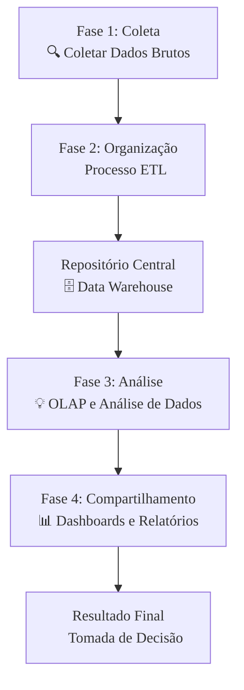

### Olá, futuro(a) aprovado(a)! Vamos desvendar o Business Intelligence (BI) de um jeito que gruda na mente para o dia da prova.

Pense em **Business Intelligence (BI)** como o trabalho de um **detetive de dados** 🕵️‍♂️. A missão dele não é apenas coletar pistas, mas transformar essas pistas em uma solução para um caso complexo, ajudando o "chefe de polícia" (o gerente) a tomar a decisão certa.

---

### ### BI: Da Pista Solta à Solução do Caso

O processo de BI segue uma escada de valor, a hierarquia do conhecimento.

* **Dado 👣:** Uma pista bruta, sem contexto. Ex: o número `100`. (O que isso significa? Ninguém sabe).
* **Informação 📝:** A pista com contexto. Ex: `100 caixas do produto X foram vendidas ontem`. (Agora faz sentido!).
* **Conhecimento 💡:** A informação conectada a outras, gerando um insight para ação. Ex: "As vendas do produto X (`100 caixas`) aumentaram 20% depois da nova campanha de marketing na TV, provando que a campanha foi um sucesso e devemos investir mais nela".

O trabalho do detetive (o processo de BI) tem 4 fases:
1.  **Coleta:** Sair a campo e coletar todas as pistas (dados) de várias fontes (sistemas da empresa, redes sociais, etc.).
2.  **Organização:** Levar as pistas para o laboratório, limpar, etiquetar e organizar tudo em um grande quadro de evidências.
3.  **Análise:** Olhar para o quadro e começar a conectar os pontos para encontrar padrões.
4.  **Compartilhamento:** Apresentar o caso resolvido para o chefe, mostrando as conclusões de forma clara.

**Foco Cebraspe:**
> * A banca vai dizer que BI é uma ferramenta (um software). **ERRADO!** BI é a **disciplina**, o processo investigativo. As ferramentas são apenas a lupa e o kit de impressões digitais do detetive.
> * A banca vai dizer que o objetivo do BI é coletar **dados**. **INCOMPLETO!** O objetivo final é gerar **conhecimento** e ação.

---

### ### A Fundação: Coletando e Organizando as Pistas

Nenhum caso é resolvido com pistas de má qualidade.

* **Coleta:** É a extração dos dados de diversas fontes (sistemas, planilhas, sites...).
* **Organização:** É aqui que a mágica acontece, com duas peças centrais:
    * **Data Warehouse (DW):** Pense nele como o **quadro de evidências oficial e centralizado** na delegacia. Todas as pistas, depois de limpas e validadas, são fixadas nele. O DW se torna a **"fonte única da verdade"** para a investigação.
    * **Processo ETL (Extract, Transform, Load):** É o procedimento para colocar as pistas no quadro.
        1.  **Extract (Extração):** Coletar a pista (um depoimento, uma digital).
        2.  **Transform (Transformação):** **A etapa mais importante!** É aqui que o detetive "limpa" a pista: remove as duplicatas, padroniza as informações (ex: transforma 'RJ' e 'Rio de Janeiro' em apenas 'RJ') e integra dados de várias fontes.
        3.  **Load (Carga):** Fixar a pista, já limpa e validada, no quadro de evidências (DW).

**Foco Cebraspe:**
> * A etapa de **Transformação** é a alma do ETL. A qualidade de toda a sua decisão depende dela. Lembre-se da máxima: "*Garbage In, Garbage Out*" (Lixo Entra, Lixo Sai).
> * A banca pode confundir **ETL** com **ELT**. A ordem importa! **ELT** é para Big Data (comum em Data Lakes), onde você carrega o dado bruto primeiro e só transforma depois.

---

### ### A Investigação: Analisando as Informações

Com o quadro de evidências montado, o detetive começa a conectar os pontos.

* **Níveis de Análise:**
    * **Descritiva (O que aconteceu?):** "As vendas caíram 10% no mês passado". É a foto do passado.
    * **Diagnóstica (Por que aconteceu?):** "As vendas caíram porque nosso principal concorrente lançou uma promoção agressiva". É a busca pela causa.
    * **Preditiva (O que vai acontecer?):** "Com base nos dados, prevemos que as vendas cairão mais 15% no próximo mês se não fizermos nada". É a bola de cristal baseada em dados.
    * **Prescritiva (O que devemos fazer?):** "Recomendamos lançar uma contra-promoção com 5% de desconto para mitigar a queda nas vendas". É a recomendação de ação.

* **Tecnologia de Suporte: OLAP (Online Analytical Processing)**
    * Pense no **OLAP** como uma **tela de computador touchscreen interativa** para o seu quadro de evidências. Ele permite que o detetive analise os dados de múltiplas dimensões. Com alguns toques, ele pode ver as vendas (o fato) por `região`, `produto` e `período de tempo`, tudo ao mesmo tempo. Ele pode dar zoom em um detalhe (`drill-down`) ou afastar para ver o quadro geral (`roll-up`).

**Foco Cebraspe:**
> * BI tradicional foca no passado e presente (**análise descritiva e diagnóstica**).
> * Não confunda **OLTP** com **OLAP**. **OLTP** (Online Transaction Processing) é o sistema que registra a venda na loja (a operação do dia a dia). **OLAP** é o sistema que analisa todas as vendas do ano para a tomada de decisão.

---

### ### A Apresentação do Caso: Compartilhando os Insights

De nada adianta resolver o caso se o detetive não consegue comunicar a solução de forma eficaz para o chefe.

* **Dashboards (Painéis de Controle) 📊:**
    * É a principal ferramenta de visualização do BI. Pense nele como um **resumo executivo visual do caso em uma única tela**.
    * Ele não mostra todas as pistas, mas sim os **KPIs (Indicadores-Chave de Desempenho)**.
    * **KPI não é qualquer número!** "Número de e-mails trocados" é uma métrica. "Taxa de abertura de e-mails de marketing que resultaram em venda" é um **KPI**, pois está ligado a um objetivo estratégico.
    * Um bom dashboard é **visual, interativo e focado** no que realmente importa.

**Foco Cebraspe:**
> * **Dashboard vs. Relatório:** Um **relatório** pode ser uma lista gigante de dados em texto. Um **dashboard** é um painel **visual e resumido** para monitoramento rápido.
> * A escolha do gráfico certo é fundamental. Gráfico de pizza não serve para mostrar evolução no tempo; para isso, usa-se um gráfico de linhas.

### ### Mapa Mental: O Fluxo do Processo de BI

Veja o caminho completo do detetive de dados, da pista bruta à decisão informada.

### **Classe:** C
### **Conteúdo:** Business Intelligence: Conceitos e Processo

---

### **1. Business Intelligence (BI): Conceitos e Processo**

> #### **TEORIA-ALVO**
> **Business Intelligence (BI)** refere-se ao conjunto de processos, tecnologias, aplicações e práticas que visam a coleta, integração, análise e apresentação de informações de negócio. O objetivo primordial do BI é dar suporte à tomada de decisão gerencial, transformando dados brutos em conhecimento acionável.
>
> * **Hierarquia do Conhecimento:** O processo de BI opera sobre a seguinte cadeia de valor:
>     * **Dados:** Fatos brutos, isolados e sem contexto (e.g., o número `100`).
>     * **Informação:** Dados com contexto, significado e relevância (e.g., `100 unidades do produto X vendidas`).
>     * **Conhecimento:** Informação compreendida, avaliada e aplicada para a tomada de decisão (e.g., "As vendas do produto X aumentaram 20% após a campanha de marketing, indicando o sucesso da estratégia").
> * **Processo de BI:** É um ciclo contínuo que pode ser dividido em quatro fases principais:
>     1.  **Coleta de Informações:** Aquisição de dados de sistemas de origem, tanto internos (sistemas transacionais, ERPs, CRMs) quanto externos (dados de mercado, redes sociais).
>     2.  **Organização:** Processamento dos dados coletados para garantir qualidade e consistência. Esta fase tipicamente envolve o uso de um **Data Warehouse (DW)** e processos de **ETL (Extração, Transformação e Carga)**.
>     3.  **Análise:** Exploração dos dados organizados para identificar padrões, tendências e insights, utilizando ferramentas analíticas como o **OLAP**.
>     4.  **Compartilhamento e Monitoramento:** Disseminação dos insights para os tomadores de decisão através de relatórios, alertas e **dashboards**, e monitoramento contínuo dos indicadores de desempenho (KPIs).

> #### **FOCO CEBRASPE (Pontos de Atenção e "Pegadinhas")**
> > * **BI como Ferramenta vs. Disciplina:** A banca pode afirmar que BI é sinônimo de uma ferramenta de software específica. **ERRADO**. BI é uma **disciplina gerencial** e estratégica que *utiliza* ferramentas e tecnologias como suporte. O foco é no processo e na geração de valor para o negócio, não na tecnologia em si.
> > * **Dado vs. Informação:** A distinção é fundamental. A banca pode afirmar que o objetivo do BI é coletar dados. **INCOMPLETO/ERRADO**. O objetivo é transformar dados em **informação** e, subsequentemente, em **conhecimento** para a ação.
> > * **BI vs. Business Analytics (BA):** Embora os termos sejam frequentemente usados de forma intercambiável, BI tradicionalmente foca mais na análise **descritiva** (o que aconteceu?). Business Analytics tende a ter um escopo mais amplo, incluindo análises **preditivas** (o que vai acontecer?) e **prescritivas** (o que devemos fazer?).

---

### **Classe:** C
### **Conteúdo:** Coleta e Organização de Informações

---

### **2. Coleta e Organização de Informações**

> #### **TEORIA-ALVO**
> Esta etapa constitui a fundação de qualquer iniciativa de BI, sendo responsável por garantir a disponibilidade e a qualidade dos dados para análise.
>
> * **Coleta de Informações:** Corresponde à fase de identificação e extração de dados das fontes de origem.
>     * **Fontes de Dados:** Podem ser extremamente variadas e heterogêneas, incluindo bancos de dados de sistemas transacionais (OLTP), sistemas legados, planilhas eletrônicas, arquivos de log, dados de sensores (IoT), APIs de redes sociais e dados de mercado de terceiros.
> * **Organização de Informações:** Corresponde à fase de armazenamento e preparação dos dados. O principal componente tecnológico é o **Data Warehouse (DW)**, um repositório central otimizado para análise.
>     * **Processo ETL (Extração, Transformação e Carga):** É o processo central para popular o Data Warehouse.
>         1.  **Extração (Extract):** Coleta dos dados das fontes identificadas.
>         2.  **Transformação (Transform):** Etapa mais crítica, onde os dados são limpos (tratamento de valores nulos, remoção de duplicatas), padronizados (unificação de formatos, e.g., 'SP' e 'São Paulo' para 'SP'), integrados (consolidação de dados de clientes de diferentes sistemas) e enriquecidos.
>         3.  **Carga (Load):** Inserção dos dados já transformados e consistentes no Data Warehouse.

> #### **FOCO CEBRASPE (Pontos de Atenção e "Pegadinhas")**
> > * **Importância da Fase de Transformação:** A banca pode subestimar a etapa de transformação do ETL. **ERRADO**. A qualidade e a confiabilidade de toda a análise de BI dependem diretamente da eficácia com que os dados são limpos e integrados nesta fase. A máxima "*Garbage In, Garbage Out*" (Lixo Entra, Lixo Sai) é diretamente aplicável aqui.
> > * **Data Warehouse como "Fonte Única da Verdade":** O propósito de criar um Data Warehouse centralizado é estabelecer uma "fonte única da verdade" (*single source of truth*) para a organização. Isso garante que diferentes áreas de negócio baseiem suas análises e relatórios nos mesmos dados, que foram previamente validados, integrados e padronizados.
> > * **ETL vs. ELT:** A banca pode tratar os termos como sinônimos. **ERRADO**. A ordem das etapas é a diferença fundamental. No **ELT (Extract, Load, Transform)**, a transformação ocorre *após* a carga dos dados no ambiente de destino (e.g., um Data Lake), uma abordagem comum em arquiteturas de Big Data.

---

### **Classe:** C
### **Conteúdo:** Análise de Informações

---

### **3. Análise de Informações**

> #### **TEORIA-ALVO**
> A fase de análise é onde o valor é extraído dos dados organizados, transformando informação em insights que respondem a perguntas de negócio.
>
> * **Níveis de Análise:** A análise de dados pode ser classificada em uma escala de complexidade e valor de negócio:
>     1.  **Análise Descritiva:** Responde "O que aconteceu?". É o nível mais comum de BI, envolvendo a sumarização de dados históricos através de relatórios e dashboards para entender o desempenho passado.
>     2.  **Análise Diagnóstica:** Responde "Por que aconteceu?". Envolve a investigação para entender as causas de um determinado resultado, utilizando técnicas como *drill-down* e análise de causa raiz.
>     3.  **Análise Preditiva:** Responde "O que vai acontecer?". Utiliza modelos estatísticos e de *machine learning* sobre dados históricos para prever resultados futuros.
>     4.  **Análise Prescritiva:** Responde "O que devemos fazer a respeito?". Vai além da previsão e recomenda ações específicas para otimizar um resultado futuro.
> * **Tecnologia de Suporte: OLAP (Online Analytical Processing):**
>     * **Definição:** OLAP é uma categoria de tecnologia que permite a análise rápida e interativa de dados de múltiplas perspectivas (multidimensional). É o motor por trás da maioria das ferramentas de BI.
>     * **Cubo OLAP:** Estrutura de dados lógica que representa as métricas de negócio (fatos) organizadas por diferentes eixos de análise (dimensões).
>     * **Operações:** Permite aos usuários "navegar" pelos dados com operações como `drill-down`, `roll-up`, `slice`, `dice` e `pivot`.

> #### **FOCO CEBRASPE (Pontos de Atenção e "Pegadinhas")**
> > * **Escopo do BI Tradicional:** A banca pode afirmar que BI se refere exclusivamente a análises preditivas. **ERRADO**. O BI tradicional está fortemente focado nas análises **descritiva** e **diagnóstica**. Análises preditiva e prescritiva, embora parte do espectro de *Business Analytics*, representam uma capacidade mais avançada.
> > * **OLTP vs. OLAP:** A confusão entre sistemas transacionais e analíticos é clássica. **OLTP (Online Transaction Processing)** suporta as operações do dia a dia. **OLAP (Online Analytical Processing)** suporta a análise de dados para tomada de decisão. A banca vai atribuir características de um ao outro.
> > * **Análise Multidimensional:** A principal característica do OLAP é sua capacidade de realizar análises multidimensionais, ou seja, analisar uma métrica (e.g., vendas) sob a ótica de várias dimensões de negócio (e.g., por tempo, por produto, por região) simultaneamente.

---

### **Classe:** C
### **Conteúdo:** Compartilhamento de Informações e Dashboards

---

### **4. Compartilhamento e Dashboards**

> #### **TEORIA-ALVO**
> A fase de compartilhamento é a etapa final do processo de BI, focada em entregar os insights gerados para os tomadores de decisão de forma eficaz e compreensível.
>
> * **Mecanismos de Compartilhamento:**
>     * **Relatórios Estáticos:** Relatórios padronizados e com formato fixo, distribuídos periodicamente (e.g., relatório de vendas semanal em PDF).
>     * **Relatórios Interativos:** Permitem que o usuário final filtre, ordene e explore os dados dentro de limites predefinidos.
>     * **Alertas:** Notificações automáticas enviadas quando uma métrica de negócio atinge um limiar predefinido (e.g., alerta de estoque baixo).
> * **Dashboards (Painéis de Controle):**
>     * **Definição:** É a ferramenta de visualização de dados mais proeminente em BI. Consiste em uma única tela que exibe uma visão consolidada e gráfica das informações e dos **Indicadores-Chave de Desempenho (KPIs - Key Performance Indicators)** mais importantes para um determinado objetivo ou área de negócio.
>     * **Características de um Bom Dashboard:**
>         * **Foco em KPIs:** Apresenta as métricas mais críticas para o monitoramento dos objetivos de negócio.
>         * **Visualmente Eficaz:** Utiliza gráficos e outros elementos visuais apropriados para apresentar a informação de forma clara, concisa e rápida.
>         * **Interativo:** Permite que os usuários explorem os dados, aplicando filtros e realizando operações de *drill-down* para investigar detalhes.
>         * **Personalizável:** Pode ser customizado para atender às necessidades específicas de diferentes usuários ou papéis.

> #### **FOCO CEBRASPE (Pontos de Atenção e "Pegadinhas")**
> > * **Dashboard vs. Relatório:** A banca pode tratar os termos como sinônimos. **INCORRETO**. Um **relatório** pode ser uma lista detalhada e extensa de dados. Um **dashboard** é, por definição, uma ferramenta de **monitoramento visual e resumida**, focada em KPIs e na rápida absorção da informação mais crítica.
> > * **KPIs (Indicadores-Chave de Desempenho):** A eficácia de um dashboard depende da seleção de KPIs relevantes. Um KPI não é qualquer métrica; é uma métrica diretamente atrelada a um **objetivo estratégico** do negócio. A banca pode apresentar uma métrica puramente operacional e chamá-la de KPI. Exemplo: "Número de logins no sistema" é uma métrica operacional; "Taxa de conversão de vendas" é um KPI.
> > * **Visualização de Dados:** A escolha do gráfico correto é fundamental. A banca pode sugerir o uso de um gráfico de pizza para mostrar a evolução de uma métrica ao longo do tempo. **INADEQUADO**. Para séries temporais, um gráfico de linhas é a escolha correta.
