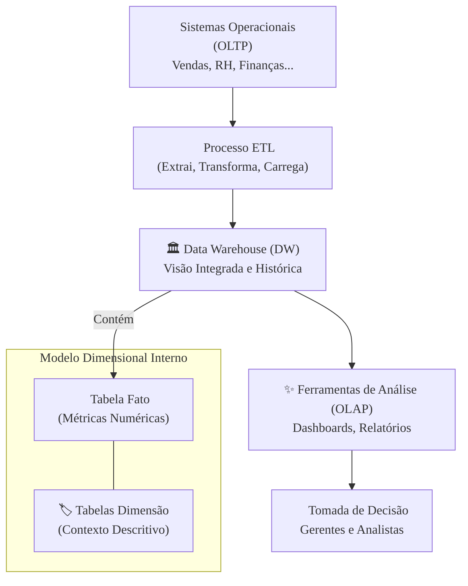

### Olá, futuro(a) aprovado(a)! Vamos construir o conhecimento sobre Data Warehouse (DW) tijolo por tijolo para você gabaritar no Cebraspe.

Pense em um **Data Warehouse** como o **Arquivo Histórico Central de uma grande biblioteca** 🏛️. Não é a estante de lançamentos onde as pessoas pegam e devolvem livros todo dia (isso seria um sistema transacional, ou OLTP). O DW é a sala especial, climatizada, onde você vai para fazer uma pesquisa profunda sobre um assunto, analisando documentos dos últimos 50 anos.

---

### ### O que é um Data Warehouse? O DNA do Arquivo Histórico

Um DW tem 4 características essenciais, definidas pelo "pai" do conceito, W. H. Inmon. O Cebraspe adora testá-las!

* **Orientado por Assunto:** Os dados são organizados pelos temas principais do negócio. No nosso arquivo, as salas são divididas por "Clientes", "Produtos", "Vendas", e não pelo nome da editora que publicou o livro.
* **Integrado:** Os dados de fontes diferentes são limpos e padronizados para falar a mesma língua. Um livro que chama o cliente de "Sr. José" e outro que o chama de "José S." são catalogados sob um único nome: "José da Silva".
* **Variável no Tempo (Histórico):** Armazena um longo histórico de dados. O arquivo tem jornais e registros dos últimos 50 anos, permitindo que você veja a evolução e as tendências ao longo do tempo.
* **Não Volátil:** Uma vez que um dado entra no DW, ele não é alterado ou apagado. Uma vez que um jornal de 1970 é colocado no arquivo, ninguém vai lá para editar as notícias. Ele é um registro histórico imutável.

#### Como construir o Arquivo? (Inmon vs. Kimball)

Existem duas "filosofias" para construir o DW:

* **Inmon (Top-down):** Primeiro, você constrói o gigantesco Arquivo Central (o DW corporativo), todo organizado e perfeito. Depois, a partir dele, você cria "mesas de pesquisa" menores e especializadas para cada departamento (os **Data Marts**).
* **Kimball (Bottom-up):** Primeiro, você cria várias "mesas de pesquisa" independentes para cada departamento (**Data Marts**). Depois, você garante que todas usem o mesmo sistema de catalogação para que, juntas, elas formem o grande Arquivo da empresa.

> #### Foco Cebraspe (Pontos de Atenção e "Pegadinhas")
> > * **DW vs. Banco de Dados Operacional (OLTP):** Esta é a distinção mais crítica. A banca atribuirá características de um ao outro. **OLTP**: otimizado para transações rápidas (cadastrar venda), dados atuais, como a área de empréstimos da biblioteca. **DW (OLAP)**: otimizado para consultas complexas (analisar tendências), dados históricos, como o arquivo histórico.
> > * **Interpretação das Características:** A banca pode interpretar erroneamente as características. "Não Volátil significa que os dados não podem ser acessados". **ERRADO**. Significa que os dados não são atualizados ou deletados. "Orientado por Assunto significa que o DW contém apenas um assunto". **ERRADO**. Significa que os dados são organizados *em torno* dos múltiplos assuntos da empresa.
> > * **Inmon vs. Kimball:** A banca pode confundir as abordagens. **Inmon** = Top-down, centralizado primeiro. **Kimball** = Bottom-up, Data Marts primeiro.

---

### ### Modelagem Dimensional: As Prateleiras e os Livros do Arquivo

Dentro do arquivo, os dados são organizados de uma forma especial, chamada **Modelagem Dimensional**.

* **Tabela Fato 🧾:** É o **livro de registros numéricos**. Ele só contém os números que você quer analisar, as métricas. Ex: `quantidade_vendida`, `valor_da_venda`.
* **Tabela Dimensão 🏷️:** São as **etiquetas que dão contexto** aos números. Elas descrevem o "quem, onde, quando, como". Ex: Dimensão `Produto` (com nome, categoria), Dimensão `Cliente` (com nome, cidade).

#### Os Arranjos das Prateleiras (Star vs. Snowflake)

* **Star Schema (Esquema Estrela) ⭐:** É o mais comum e rápido. Você tem o livro de registros (Tabela Fato) no centro, e ao redor dele estão as etiquetas (Tabelas Dimensão). É simples e direto. As dimensões são **desnormalizadas** (têm informações repetidas para facilitar a consulta).
* **Snowflake Schema (Floco de Neve) ❄️:** É mais "organizado". A etiqueta `Cliente` pode não ter o nome da cidade, mas um código que aponta para outra etiqueta de `Cidades`. As dimensões são **normalizadas**. Isso economiza espaço, mas deixa a pesquisa mais lenta.

> #### Foco Cebraspe (Pontos de Atenção e "Pegadinhas")
> > * **Fato vs. Dimensão:** A banca vai dizer que "Nome do Cliente" é um fato. **ERRADO!** É um atributo da dimensão Cliente. **Fato = Número**. **Dimensão = Contexto**.
> > * **Star vs. Snowflake:** A principal diferença é a **normalização** das tabelas de dimensão. A banca afirmará que o esquema estrela possui dimensões normalizadas. **ERRADO**. O esquema estrela ⭐ utiliza dimensões **desnormalizadas** para ter melhor desempenho.
> > * **Granularidade:** Refere-se ao nível de detalhe dos dados na tabela fato. Uma alta granularidade (e.g., cada item de uma venda) permite análises mais detalhadas.

---

### ### ETL e OLAP: O Bibliotecário e a Ferramenta de Pesquisa Mágica

* **ETL (Extract, Transform, Load):** É o trabalho do **bibliotecário-chefe** para colocar novos documentos no arquivo.
    1.  **Extract (Extração):** Coletar os documentos das editoras.
    2.  **Transform (Transformação):** A parte mais difícil! Limpar, restaurar, traduzir e padronizar os documentos.
    3.  **Load (Carga):** Colocar os documentos, já tratados, na prateleira correta do arquivo.

* **OLAP (Online Analytical Processing):** É a **ferramenta de pesquisa mágica** do arquivo. Ela permite fazer análises complexas e multidimensionais instantaneamente. Com ela, você pode "navegar" pelos dados:
    * **Drill-down:** Ver as vendas por ano ➡️ depois por mês ➡️ depois por dia (zoom in).
    * **Roll-up:** Ver as vendas por cidade ➡️ depois por estado ➡️ depois por país (zoom out).
    * **Slice:** Ver as vendas, mas só da categoria "Eletrônicos" (fatiar).
    * **Dice:** Ver as vendas de "Eletrônicos" na "Região Sul" no "Primeiro Trimestre" (pegar um cubinho).

> #### Foco Cebraspe (Pontos de Atenção e "Pegadinhas")
> > * **ETL vs. ELT:** A banca pode mencionar a abordagem moderna **ELT (Extract, Load, Transform)**. A diferença fundamental é a **ordem** das operações. No ELT, os dados brutos são carregados primeiro no ambiente de destino (geralmente um *data lake*) e a transformação é realizada depois.
> > * **OLTP vs. OLAP:** A confusão entre os acrônônimos é clássica. **OLTP** (Transacional) = otimizado para escrita, operações do dia a dia. **OLAP** (Analítico) = otimizado para leitura e consultas complexas sobre dados históricos.
> > * **Operações OLAP:** A banca vai descrever uma necessidade de análise e perguntar qual operação OLAP é a mais adequada. É essencial conhecer a função de cada uma.

---

### ### Aplicações e Otimização: Usando o Arquivo e Deixando-o Mais Rápido

* **Aplicações:** O arquivo (DW) é a base para gerar relatórios, painéis (**dashboards**) e para fazer **Data Mining** (usar robôs para ler tudo e descobrir padrões ocultos).
* **Otimização:** Para a sua pesquisa no arquivo ser super-rápida, o bibliotecário usa truques:
    * **Indexação:** Criar um índice super detalhado para encontrar qualquer livro em segundos.
    * **Particionamento:** Em vez de uma prateleira gigante para "Século XX", criar uma prateleira para cada década. Se você quer algo de 1980, ele ignora as outras 9 prateleiras.
    * **Agregação:** Se todo mundo pergunta "quantos livros de ficção existem?", o bibliotecário já deixa esse número anotado num post-it para dar a resposta na hora.

> #### Foco Cebraspe (Pontos de Atenção e "Pegadinhas")
> > * **Data Warehouse vs. Data Mining:** A banca pode tratar os termos como sinônimos. **ERRADO**. O **Data Warehouse** é a infraestrutura, o arquivo. O **Data Mining** é o **processo** de análise que se aplica sobre os dados do DW para descobrir conhecimento.
> > * **Índices em DW:** Em colunas de baixa cardinalidade (poucos valores distintos, como 'sexo'), **índices bitmap** são frequentemente mais eficientes que os tradicionais.
> > * **Particionamento:** O principal benefício do particionamento é o *partition pruning* (eliminação de partição), a capacidade do sistema de escanear apenas as partições relevantes para uma consulta.

### ### Mapa Mental: O Ecossistema do Data Warehouse

Veja o fluxo completo, desde as operações do dia a dia até a análise gerencial.

### **Classe:** C
### **Conteúdo:** Data Warehouse: Conceitos e Arquitetura

---

### **1. Data Warehouse: Conceitos e Arquitetura**

> #### **TEORIA-ALVO**
> Um **Data Warehouse (DW)** é um repositório central de dados integrados, provenientes de uma ou mais fontes distintas, projetado para suportar atividades de análise gerencial e auxílio à decisão. Diferentemente dos sistemas operacionais, um DW não é projetado para processamento de transações do dia a dia, mas para consultas complexas e análise histórica.
>
> * **Características Fundamentais (W. H. Inmon):**
>     1.  **Orientado por Assunto:** Os dados são organizados em torno dos principais assuntos de negócio da organização (e.g., Cliente, Produto, Vendas), e não em torno das aplicações operacionais.
>     2.  **Integrado:** Os dados são coletados de fontes heterogêneas e transformados para um formato consistente e unificado dentro do DW. Inconsistências de nomenclatura, codificação e formato são resolvidas.
>     3.  **Variável no Tempo (Histórico):** Os dados em um DW representam um longo horizonte de tempo (e.g., 5, 10 anos), permitindo a análise de tendências e padrões históricos. Cada registro possui algum elemento de tempo.
>     4.  **Não Volátil:** Os dados, uma vez carregados no DW, não são alterados ou excluídos. Eles são um registro estático e somente leitura dos eventos de negócio, sendo apenas acrescidos de novos dados periodicamente.
> * **Arquiteturas Principais:**
>     * **Top-down (Inmon):** Abordagem que defende a criação de um Data Warehouse corporativo centralizado, normalizado (tipicamente em 3FN) e integrado como a primeira etapa. A partir deste repositório central, são criados **Data Marts** (subconjuntos de dados específicos para uma área de negócio) dependentes e customizados.
>     * **Bottom-up (Kimball):** Abordagem que defende a construção iterativa de **Data Marts** utilizando modelagem dimensional (esquema estrela) como primeira etapa. A integração desses Data Marts, através do uso de dimensões conformadas, forma o Data Warehouse corporativo.

> #### **FOCO CEBRASPE (Pontos de Atenção e "Pegadinhas")**
> > * **DW vs. Banco de Dados Operacional (OLTP):** Esta é a distinção mais crítica. A banca atribuirá características de um ao outro. **OLTP (Online Transaction Processing)**: otimizado para transações curtas e rápidas de escrita, dados atuais, alta normalização. **DW (OLAP - Online Analytical Processing)**: otimizado para consultas complexas de leitura, dados históricos, baixa normalização (desnormalização).
> > * **Interpretação das Características:** A banca pode interpretar erroneamente as características de Inmon. "Não Volátil significa que os dados não podem ser acessados". **ERRADO**. Significa que os dados não são atualizados ou deletados; são registros históricos imutáveis. "Orientado por Assunto significa que o DW contém apenas um assunto de negócio". **ERRADO**. Significa que os dados são organizados *em torno* dos múltiplos assuntos da empresa.
> > * **Inmon vs. Kimball:** A banca pode confundir as abordagens. **Inmon** = Top-down, centralizado, normalizado. **Kimball** = Bottom-up, iterativo, dimensional (desnormalizado).

---

### **Classe:** C
### **Conteúdo:** Modelagem Dimensional

---

### **2. Modelagem Dimensional**

> #### **TEORIA-ALVO**
> A Modelagem Dimensional é a técnica de design de bancos de dados predominante para Data Warehouses. Seu objetivo é apresentar os dados de uma forma que seja intuitiva para os usuários de negócio e que ofereça alta performance para consultas analíticas. A estrutura básica é composta por tabelas fato e tabelas dimensão.
>
> * **Tabela Fato (*Fact Table*):**
>     * É a tabela central do modelo. Armazena as **medidas de negócio** (ou métricas), que são os dados quantitativos e numéricos sobre os quais a análise será realizada (e.g., `valor_da_venda`, `quantidade_de_itens`, `custo_unitario`).
>     * Contém as chaves estrangeiras que a conectam às tabelas de dimensão.
> * **Tabela Dimensão (*Dimension Table*):**
>     * Descreve o **contexto** de um evento de negócio. Contém atributos descritivos e textuais que são usados para filtrar, agrupar e rotular os dados da tabela fato.
>     * As dimensões respondem às perguntas "quem?", "o quê?", "onde?", "quando?", "como?" e "por quê?". Exemplos: Dimensão Cliente, Dimensão Produto, Dimensão Tempo, Dimensão Loja.
> * **Esquemas Dimensionais:**
>     * **Star Schema (Esquema Estrela):** O mais comum e simples. Consiste em uma tabela fato central cercada por um conjunto de tabelas de dimensão **desnormalizadas**. Cada dimensão é representada por uma única tabela. A estrutura se assemelha a uma estrela.
>     * **Snowflake Schema (Esquema Floco de Neve):** Uma variação do esquema estrela onde as tabelas de dimensão são **normalizadas** em múltiplas tabelas relacionadas. Isso reduz a redundância de dados, mas aumenta a complexidade das consultas, que exigirão mais operações de *join*.

> #### **FOCO CEBRASPE (Pontos de Atenção e "Pegadinhas")**
> > * **Fato vs. Dimensão:** A banca vai confundir os conceitos. **Fatos** são as métricas numéricas a serem analisadas. **Dimensões** são os atributos textuais que descrevem o contexto e são usados para fatiar e filtrar os fatos. Um item pode afirmar que "o nome do cliente é uma métrica da tabela fato". **ERRADO**. É um atributo da dimensão Cliente.
> > * **Star vs. Snowflake:** A principal diferença é a **normalização** das tabelas de dimensão. A banca afirmará que o esquema estrela possui dimensões normalizadas. **ERRADO**. O esquema estrela utiliza dimensões **desnormalizadas**. A principal vantagem do esquema estrela é a **simplicidade e o desempenho superior das consultas**, devido ao menor número de *joins* necessários.
> > * **Granularidade:** Refere-se ao nível de detalhe dos dados na tabela fato. Uma alta granularidade (e.g., cada item de uma venda) permite análises mais detalhadas. A banca pode questionar esse conceito.

---

### **Classe:** C
### **Conteúdo:** ETL (Extração, Transformação e Carga) e OLAP

---

### **3. ETL (Extração, Transformação e Carga) e OLAP**

> #### **TEORIA-ALVO**
> **ETL** é o processo de software responsável por popular um Data Warehouse, enquanto **OLAP** é a tecnologia que permite a análise interativa dos dados armazenados.
>
> * **ETL (Extract, Transform, Load):**
>     * **E - Extração (*Extract*):** Coleta de dados de diversas fontes operacionais (sistemas OLTP, ERPs, CRMs, planilhas, etc.).
>     * **T - Transformação (*Transform*):** Etapa mais crítica e complexa. Envolve a limpeza dos dados (tratamento de valores nulos, correção de inconsistências), a padronização (conversão de formatos e unidades), a integração (combinação de dados de múltiplas fontes) e a derivação de novos atributos para adequar os dados ao modelo dimensional do DW.
>     * **L - Carga (*Load*):** Inserção física dos dados transformados no Data Warehouse. A carga pode ser **total**, substituindo todos os dados, ou **incremental**, adicionando apenas os dados novos ou alterados desde a última carga.
> * **OLAP (Online Analytical Processing):**
>     * **Definição:** Uma categoria de ferramentas de software que fornece uma visão multidimensional dos dados, permitindo análises rápidas, complexas e interativas.
>     * **Cubo OLAP:** A estrutura de dados lógica central do OLAP. Representa os dados em múltiplas dimensões, com as métricas da tabela fato no centro e os atributos das tabelas de dimensão formando os eixos do cubo.
>     * **Operações OLAP:**
>         * **Drill-down:** Aumenta o nível de detalhe (e.g., de Vendas por Ano para Vendas por Mês).
>         * **Roll-up (ou Drill-up):** Diminui o nível de detalhe, agregando os dados (e.g., de Vendas por Cidade para Vendas por Estado).
>         * **Slice:** Seleciona uma "fatia" do cubo, fixando o valor de uma dimensão (e.g., Vendas apenas para o Ano de 2024).
>         * **Dice:** Seleciona um subcubo, definindo uma faixa de valores para múltiplas dimensões (e.g., Vendas de Eletrônicos na Região Sul no primeiro trimestre).
>         * **Pivot:** Rotaciona os eixos do cubo para uma nova perspectiva de visualização.

> #### **FOCO CEBRASPE (Pontos de Atenção e "Pegadinhas")**
> > * **ETL vs. ELT:** A banca pode mencionar a abordagem moderna **ELT (Extract, Load, Transform)**. A diferença fundamental é a **ordem** das operações. No ELT, os dados brutos são carregados primeiro no ambiente de destino (geralmente um *data lake* ou DW em nuvem) e a transformação é realizada depois, utilizando o poder de processamento da plataforma de destino. São abordagens distintas.
> > * **OLTP vs. OLAP:** A confusão entre os acrônimos é clássica. **OLTP** (Transacional) = otimizado para escrita, operações do dia a dia. **OLAP** (Analítico) = otimizado para leitura e consultas complexas sobre dados históricos.
> > * **Operações OLAP:** A banca vai descrever uma necessidade de análise e perguntar qual operação OLAP é a mais adequada. É essencial conhecer a função de cada operação (Drill-down, Roll-up, Slice, Dice, Pivot). Por exemplo, passar de uma visão geral para uma detalhada é um `Drill-down`.

---

### **Classe:** C
### **Conteúdo:** Aplicações e Otimização de Data Warehouse

---

### **4. Aplicações e Otimização**

> #### **TEORIA-ALVO**
> Os Data Warehouses são a base para diversas aplicações de *Business Intelligence* (BI) e a otimização de seu desempenho é crucial para garantir a agilidade na tomada de decisão.
>
> * **Aplicações Típicas de DW/BI:**
>     * **Relatórios Gerenciais:** Geração de relatórios estáticos e padronizados sobre o desempenho do negócio.
>     * **Análises Ad Hoc:** Consultas exploratórias e não predefinidas, realizadas por analistas de negócio para responder a perguntas específicas.
>     * **Dashboards e Painéis de Controle:** Visualização de indicadores-chave de desempenho (KPIs) de forma gráfica e interativa para monitoramento do negócio.
>     * **Data Mining (Mineração de Dados):** Utilização de técnicas estatísticas e de inteligência artificial sobre o grande volume de dados do DW para descobrir padrões, correlações e anomalias ocultas.
> * **Técnicas de Otimização de DW:** O desempenho em um DW é medido pela velocidade de resposta das consultas.
>     * **Indexação:** Criação de índices (especialmente índices *bitmap*, em colunas de baixa cardinalidade) nas tabelas de fato e dimensão para acelerar a execução de *joins* e a filtragem de dados.
>     * **Particionamento:** Divisão física de tabelas muito grandes (especialmente a tabela fato) em pedaços menores e mais gerenciáveis, com base em um critério como o tempo (e.g., uma partição por mês). Isso permite que o otimizador de consultas ignore partições irrelevantes para uma determinada consulta (*partition pruning*).
>     * **Agregação e Visões Materializadas:** Criação de tabelas de resumo pré-calculadas (agregados) ou visões materializadas que armazenam os resultados de consultas frequentes e custosas. Quando uma nova consulta pode ser respondida por esses agregados, o desempenho é drasticamente melhorado.
>     * **Desnormalização:** O uso intencional de desnormalização no modelo dimensional (especialmente no esquema estrela) já é uma técnica de otimização, pois minimiza a necessidade de operações de *join* custosas.

> #### **FOCO CEBRASPE (Pontos de Atenção e "Pegadinhas")**
> > * **Data Warehouse vs. Data Mining:** A banca pode tratar os termos como sinônimos. **ERRADO**. O **Data Warehouse** é a infraestrutura, o repositório de dados. A **Mineração de Dados** é o **processo** de análise que se aplica sobre os dados do DW para descobrir conhecimento.
> > * **Índices em DW:** O tipo de índice é importante. Em tabelas de dimensão com baixa cardinalidade (e.g., 'sexo', 'estado civil'), **índices bitmap** são frequentemente mais eficientes em espaço e desempenho que os tradicionais B-Tree.
> > * **Agregação:** A criação de agregados é um trade-off clássico: aumenta a necessidade de armazenamento e o tempo de carga (ETL), mas **acelera drasticamente** o tempo de consulta. A banca pode questionar esse trade-off.
> > * **Particionamento:** O principal benefício do particionamento é o *partition pruning* (ou eliminação de partição), a capacidade do SGBD de escanear apenas as partições relevantes para uma consulta, em vez da tabela inteira.
> 
