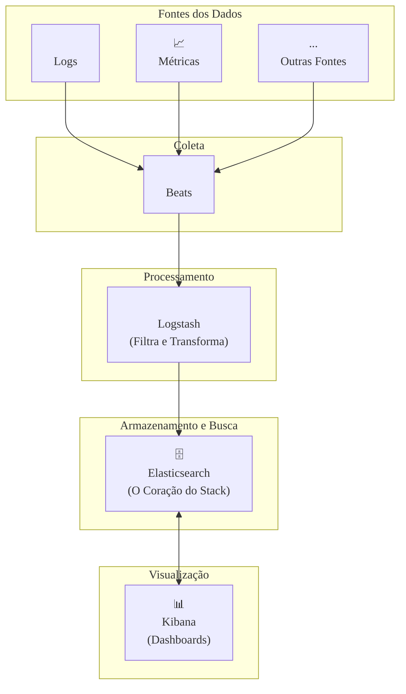

### Olá, futuro(a) aprovado(a)! Vamos desvendar o Elastic Stack (ELK) de um jeito que você nunca mais vai esquecer.

Pense no **Elastic Stack** como um **sistema super moderno de um restaurante de luxo** 🍽️, desde a chegada dos ingredientes até a montagem do prato final. Cada componente tem um papel claro e o Cebraspe adora testar se você conhece o fluxo.

---

### ### Elastic Stack: A Visão Geral do Restaurante

O fluxo de trabalho do restaurante (e do Elastic Stack) é a primeira coisa a se memorizar.

* **Beats (Os Entregadores 🛵):** São os entregadores especializados e super leves. Cada um tem uma única função: o `Filebeat` entrega apenas os vegetais (logs), o `Metricbeat` entrega apenas as carnes (métricas). Eles simplesmente **coletam** o ingrediente na fonte e o entregam na cozinha.

* **Logstash (O Sous-Chef na Preparação 👨‍🍳):** É o chef responsável pela estação de preparação. Ele recebe os ingredientes brutos dos entregadores, lava, corta, tempera e padroniza tudo. Ele **transforma** os dados brutos em algo pronto para ser armazenado.

* **Elasticsearch (A Despensa Mágica 🗄️):** É o coração da cozinha. Uma despensa gigante, distribuída e super inteligente. Ela **armazena** todos os ingredientes já preparados em potes etiquetados (documentos JSON), **indexa** tudo e permite uma **busca** incrivelmente rápida. Precisa de "cenoura picada"? A despensa te diz a localização exata em um piscar de olhos.

* **Kibana (O Chef de Finalização 📊):** É o chef que monta o prato para o cliente. Ele **não armazena comida**. Ele olha para dentro da despensa mágica (faz consultas no Elasticsearch), pega os ingredientes que precisa e os arruma de forma bonita e visual em um prato (um **dashboard**).

> #### Foco Cebraspe (Pontos de Atenção e "Pegadinhas")
> > * **O Fluxo é Sagrado:** A banca vai inverter tudo! Lembre-se: **Coleta (Beats) -> Transformação (Logstash) -> Armazenamento (Elasticsearch) -> Visualização (Kibana)**. Kibana **lê** do Elasticsearch, ele não **escreve** nele.
> > * **ELK Stack:** O nome antigo se refere aos 3 pilares: **E**lasticsearch, **L**ogstash, **K**ibana. Hoje, com os **B**eats, o nome oficial é **Elastic Stack**.
> > * **Não é um Banco de Dados Relacional:** O forte do Elastic Stack é busca em texto e análise de dados de séries temporais (logs), não transações complexas que exigem ACID.

---

### ### Elasticsearch: A Despensa Mágica por Dentro

O Elasticsearch é o componente principal. Ele é um banco de dados NoSQL do tipo **orientado a documentos**.

* **Terminologia e Arquitetura:**
    * **Cluster:** A cozinha inteira, com todos os seus equipamentos e funcionários.
    * **Índice (*Index*):** Uma seção da despensa, como a prateleira de "Legumes".
    * **Documento (*Document*):** Um único ingrediente na despensa, em um pote etiquetado em formato JSON. Ex: `{ "nome": "Cenoura", "cor": "Laranja" }`.
    * **Shard (Gaveta):** A prateleira de "Legumes" é tão grande que foi dividida em várias gavetas (`shards`) para ser mais fácil de organizar e procurar. Isso garante a **escalabilidade horizontal** (capacidade de crescer).
    * **Réplica (*Replica*):** Uma cópia exata de uma gaveta, guardada em outra parte da cozinha. Se uma gaveta quebrar, a cópia (`réplica`) assume. Isso garante a **alta disponibilidade** (à prova de falhas).

* **O Segredo da Velocidade: Índice Invertido**
    O que torna a busca tão rápida? Em vez de procurar em todos os potes um por um, a despensa tem um **índice invertido**. É como um índice de livro:
    * `Cenoura`: Encontrada nos potes 1, 15, 87.
    * `Laranja`: Encontrada nos potes 1, 23, 99.
    Com uma busca por "Cenoura Laranja", ele instantaneamente cruza as duas listas e te entrega o pote 1.

> #### Foco Cebraspe (Pontos de Atenção e "Pegadinhas")
> > * **Escalabilidade vs. Alta Disponibilidade:** A banca vai trocar os conceitos. Lembre-se: **Shards = Escalabilidade**. **Réplicas = Alta Disponibilidade**.
> > * **Índice Invertido:** É o que torna o Elasticsearch um motor de **busca** e não apenas um banco de dados. É a razão pela qual buscas em texto são absurdamente mais rápidas nele do que um `LIKE '%termo%'` em um banco SQL.

---

### ### Logstash: A Estação de Preparação

O Logstash é o canivete suíço para processamento de dados. Seu pipeline tem 3 estágios:

1.  **Inputs (Entradas):** A doca de recebimento. De onde os ingredientes estão vindo? (`file`, `beats`, `jdbc`...).
2.  **Filters (Filtros):** A bancada de preparação, o coração do Logstash. Aqui o sous-chef usa suas ferramentas (`grok` para identificar um ingrediente sem etiqueta, `mutate` para cortar e renomear, `date` para carimbar a hora do preparo).
3.  **Outputs (Saídas):** A esteira que leva o ingrediente pronto para a despensa mágica (`elasticsearch`).

> #### Foco Cebraspe (Pontos de Atenção e "Pegadinhas")
> > * **Logstash vs. Beats:** Não são a mesma coisa! **Beats** = entregador leve e rápido. **Logstash** = estação de preparação completa e mais "pesada". Muitas vezes, o Beat entrega para o Logstash.
> > * **Filtros são a Chave:** Sem a fase de filtro, seria como jogar um frango inteiro com penas e tudo na despensa. A fase de filtro limpa, depena, corta e estrutura o dado para que ele seja útil para análise.

---

### ### Kibana: A Arte de Montar o Prato

O Kibana é a sua janela para os dados no Elasticsearch. Ele **não armazena nada**.

* **Discover:** Espiar dentro de uma gaveta da despensa para ver os ingredientes crus.
* **Visualize:** Pegar um tipo de ingrediente (ex: todas as frutas vermelhas) e criar um arranjo artístico com eles (um gráfico de pizza).
* **Dashboard:** O prato final! É um painel que combina vários arranjos (visualizações) para contar uma história completa sobre o estado da cozinha.
* **Lens:** Uma ferramenta de "arrastar e soltar" que ajuda até mesmo os chefs novatos a criar belos arranjos de forma intuitiva.

> #### Foco Cebraspe (Pontos de Atenção e "Pegadinhas")
> > * **Kibana não armazena dados:** A banca vai dizer que o Kibana tem um banco de dados próprio. **ERRADO!** Ele é apenas uma interface web que conversa com a API do Elasticsearch em tempo real.
> > * **Dashboard vs. Visualização:** Uma **visualização** é um gráfico. Um **dashboard** é uma coleção de vários gráficos em uma única tela.

### ### Mapa Mental: O Fluxo de Dados do Restaurante ELK

Veja o caminho completo do ingrediente (dado) até se tornar um prato (insight).

### **Classe:** C
### **Conteúdo:** Ferramentas de Busca: Elastic Stack (ELK)

---

### **1. Elastic Stack: Visão Geral**

> #### **TEORIA-ALVO**
> O **Elastic Stack**, anteriormente conhecido como **ELK Stack**, é um conjunto de produtos de código aberto projetado para a ingestão, armazenamento, busca, análise e visualização de grandes volumes de dados, textuais ou numéricos, em tempo próximo ao real. É amplamente utilizado em casos de uso como busca em sites, monitoramento de logs, análise de métricas de infraestrutura e inteligência de segurança (SIEM).
>
> * **Componentes Principais e Fluxo de Dados:** O fluxo de dados padrão na pilha segue uma ordem lógica:
>     1.  **Beats e Logstash (Ingestão e Processamento):**
>         * **Beats:** Agentes leves e de propósito único, instalados em servidores de origem para coletar dados (e.g., `Filebeat` para logs, `Metricbeat` para métricas).
>         * **Logstash:** Um pipeline de processamento de dados do lado do servidor que ingere dados de múltiplas fontes (incluindo os Beats), os transforma (parse, enriquece, normaliza) e os envia para um destino.
>     2.  **Elasticsearch (Armazenamento, Busca e Análise):**
>         * O coração do stack. Um motor de busca e análise distribuído que armazena os dados processados como documentos JSON, os indexa e fornece uma API RESTful para busca, agregação e análise.
>     3.  **Kibana (Visualização e Exploração):**
>         * A interface web do stack. Conecta-se ao Elasticsearch para permitir que os usuários explorem os dados, criem visualizações, gráficos e montem dashboards interativos.

> #### **FOCO CEBRASPE (Pontos de Atenção e "Pegadinhas")**
> > * **Fluxo de Dados Lógico:** A banca frequentemente testa o entendimento do fluxo de trabalho. É mandatório saber que a direção é: **Coleta (Beats/Logstash) -> Armazenamento/Indexação (Elasticsearch) -> Visualização (Kibana)**. Uma afirmação de que o Kibana envia dados para o Elasticsearch está **ERRADA**. O Kibana executa consultas *contra* o Elasticsearch para ler e visualizar os dados.
> > * **Nomenclatura (ELK Stack):** O acrônimo original **ELK** refere-se aos três componentes principais: **E**lasticsearch, **L**ogstash e **K**ibana. A introdução dos **Beats** expandiu o ecossistema, que hoje é formalmente chamado de Elastic Stack. A banca pode usar a nomenclatura legada.
> > * **Propósito do Stack:** O Elastic Stack não é um SGBD relacional e não é otimizado para transações ACID. Seu forte é a **busca de texto completo**, a **análise de dados de séries temporais** (como logs e métricas) e a capacidade de lidar com dados semiestruturados e não estruturados em escala.

---

### **Classe:** C
### **Conteúdo:** Elasticsearch

---

### **2. Elasticsearch**

> #### **TEORIA-ALVO**
> O **Elasticsearch** é um motor de busca e análise distribuído, open-source, construído sobre a biblioteca de busca de texto completo **Apache Lucene**. Ele armazena dados em formato de documentos JSON e expõe suas funcionalidades através de uma API RESTful sobre HTTP.
>
> * **Arquitetura e Terminologia:**
>     * **Cluster:** Um conjunto de um ou mais **nós** (servidores) que trabalham juntos.
>     * **Índice (*Index*):** Uma coleção de documentos que possuem características similares. É análogo a um "banco de dados" em um SGBD relacional.
>     * **Documento (*Document*):** A unidade básica de informação, representada em formato **JSON**. É análogo a uma "linha" ou "registro" em uma tabela.
>     * **Shard:** Um índice pode ser dividido horizontalmente em múltiplas partes chamadas *shards*. Cada *shard* é, em si, um índice Lucene totalmente funcional e independente. Os *shards* permitem a **escalabilidade horizontal** e a distribuição de dados e carga de trabalho pelo cluster.
>     * **Réplica (*Replica*):** Uma cópia de um *shard*. As réplicas fornecem **alta disponibilidade** (redundância em caso de falha de um nó) e aumentam a capacidade de leitura do cluster.
> * **Índice Invertido:** É a estrutura de dados central, herdada do Lucene, que torna a busca de texto completo extremamente rápida. Em vez de uma busca sequencial, o índice invertido mapeia cada termo (palavra) aos documentos que o contêm, permitindo a recuperação quase instantânea da lista de documentos relevantes para uma consulta.

> #### **FOCO CEBRASPE (Pontos de Atenção e "Pegadinhas")**
> > * **Elasticsearch como Banco de Dados NoSQL:** O Elasticsearch é classificado como um banco de dados NoSQL do tipo **orientado a documentos** e como um **motor de busca**. A banca pode questionar seu modelo de dados, que é baseado em documentos JSON com esquema flexível.
> > * **Escalabilidade e Alta Disponibilidade:** A banca vai questionar como o Elasticsearch alcança essas características. A **escalabilidade** é obtida através dos **shards**. A **alta disponibilidade** é obtida através das **réplicas**. É incorreto afirmar que os shards servem para redundância; essa é a função das réplicas.
> > * **Índice Invertido:** O candidato deve entender que esta estrutura é o que diferencia fundamentalmente um motor de busca de um banco de dados relacional tradicional para consultas de texto. Uma consulta com `LIKE '%termo%'` em um SGBD relacional é ineficiente, enquanto a mesma busca em Elasticsearch é extremamente performática devido ao índice invertido.

---

### **Classe:** C
### **Conteúdo:** Logstash

---

### **3. Logstash**

> #### **TEORIA-ALVO**
> O **Logstash** é um componente do Elastic Stack que funciona como um pipeline de ingestão e processamento de dados do lado do servidor. Ele é capaz de coletar dados de uma grande variedade de fontes, transformá-los em tempo real e enviá-los para um destino (ou *stash*), como o Elasticsearch.
>
> * **Estrutura do Pipeline:** Um pipeline do Logstash é composto por três estágios obrigatórios:
>     1.  **Inputs (Entradas):** Define a fonte dos dados. Um pipeline pode ter múltiplas entradas. Exemplos de plugins de entrada: `file` (para ler de arquivos de log), `beats` (para receber dados de agentes Beats), `jdbc` (para coletar dados de um banco de dados relacional), `tcp` (para receber dados via socket).
>     2.  **Filters (Filtros):** É onde os dados são processados e transformados. Múltiplos filtros podem ser aplicados em sequência. Exemplos de plugins de filtro:
>         * **`grok`:** Parseia dados textuais não estruturados em campos estruturados, utilizando padrões de expressão regular.
>         * **`mutate`:** Realiza transformações gerais, como renomear, remover ou modificar campos.
>         * **`date`:** Parseia uma data de um campo de texto e a utiliza como o timestamp do evento.
>     3.  **Outputs (Saídas):** Define o destino para onde os dados processados serão enviados. O destino mais comum é o `elasticsearch`, mas outros são possíveis, como `file`, `stdout` (para depuração) ou `s3`.

> #### **FOCO CEBRASPE (Pontos de Atenção e "Pegadinhas")**
> > * **Logstash vs. Beats:** A banca pode tratar os dois como sinônimos ou inverter seus papéis. **Beats** são agentes **leves** de coleta de dados, projetados para ter um baixo consumo de recursos e serem instalados nas máquinas de origem. **Logstash** é um pipeline de processamento **pesado**, geralmente centralizado, que realiza transformações complexas nos dados recebidos dos Beats ou de outras fontes.
> > * **Propósito da Fase de Filtro:** A fase de filtro é a mais importante do Logstash. Seu objetivo é **dar estrutura e enriquecer** os dados brutos. Sem essa fase, dados de log não estruturados seriam inseridos no Elasticsearch como uma única string de texto, dificultando a análise e a criação de visualizações.
> > * **Obrigatoriedade dos Estágios:** Um pipeline do Logstash deve conter pelo menos uma entrada e uma saída. A seção de filtros é opcional, mas na prática é quase sempre utilizada para processar os dados.

---

### **Classe:** C
### **Conteúdo:** Kibana e Dashboards

---

### **4. Kibana**

> #### **TEORIA-ALVO**
> O **Kibana** é a ferramenta de visualização e exploração de dados do Elastic Stack. É uma aplicação web que fornece uma interface gráfica para interagir com os dados armazenados no Elasticsearch.
>
> * **Principais Funcionalidades:**
>     * **Discover:** Uma interface para explorar interativamente os dados brutos. Permite realizar buscas de texto completo, filtrar por campos e inspecionar os documentos JSON individuais.
>     * **Visualize:** Uma biblioteca que permite criar uma vasta gama de visualizações a partir dos dados, como gráficos de barras, linhas, pizza, mapas de calor, nuvens de tags, mapas geográficos, entre outros. As visualizações são criadas a partir de agregações e consultas executadas no Elasticsearch.
>     * **Dashboard:** A funcionalidade central para o monitoramento e compartilhamento de informações. Um dashboard do Kibana é um painel que pode conter múltiplas visualizações salvas, dispostas em um layout customizável. Dashboards são interativos, permitindo que filtros aplicados em uma visualização afetem as outras.
>     * **Lens:** Uma ferramenta de arrastar e soltar, mais recente, que simplifica a criação de visualizações, permitindo que os usuários explorem os dados e escolham a melhor representação gráfica de forma intuitiva.

> #### **FOCO CEBRASPE (Pontos de Atenção e "Pegadinhas")**
> > * **Relação com Elasticsearch:** É fundamental entender que o Kibana **não armazena dados**. Ele atua como um cliente da API do Elasticsearch. Toda busca, agregação e visualização mostrada no Kibana é o resultado de uma consulta executada em tempo real no cluster do Elasticsearch. A banca pode afirmar que o Kibana possui um banco de dados próprio para armazenar os dados dos dashboards. **ERRADO**.
> > * **Dashboard vs. Visualização:** Uma **visualização** é um único gráfico ou representação de dados (e.g., um gráfico de pizza). Um **dashboard** é uma coleção de múltiplas visualizações, organizadas em uma única tela para fornecer uma visão geral.
> > * **Finalidade:** O objetivo do Kibana é democratizar o acesso aos dados armazenados no Elasticsearch, permitindo que usuários, mesmo sem conhecimento profundo da API do Elasticsearch, possam explorar os dados, descobrir insights e monitorar sistemas através de interfaces visuais e interativas.
