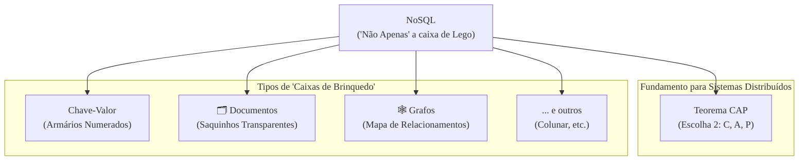

### Olá, futuro(a) aprovado(a)\! Vamos desmontar o NoSQL e seus "bichos-papões" para você brilhar na prova do Cebraspe.

Pense nos bancos de dados como caixas de brinquedo. O banco de dados relacional (SQL) é aquela caixa de Lego com divisórias perfeitas, onde cada pecinha tem seu lugar exato. Já os bancos **NoSQL** são outros tipos de caixas de brinquedo, criados porque às vezes você tem brinquedos diferentes que não se encaixam bem no Lego.

-----

### \#\#\# Conceitos de NoSQL: Novas Caixas para Novos Brinquedos

NoSQL significa *Not Only SQL* (Não Apenas SQL). É uma nova filosofia para guardar dados.

  * **Por que o NoSQL surgiu?**

      * **Escalabilidade Horizontal:** Se você ganha mais brinquedos, em vez de comprar uma única caixa gigante e caríssima (**scale-up**), você simplesmente compra várias caixas de brinquedo baratas e as coloca lado a lado (**scale-out**). É mais fácil e barato crescer.
      * **Flexibilidade de Esquema:** Na caixa de Lego, você não pode guardar uma boneca grande. Na caixa de brinquedos NoSQL, você pode jogar qualquer coisa lá dentro, sem ter um compartimento predefinido.

  * **O Teorema CAP (O Dilema da Brincadeira em Grupo)**
    Imagine três crianças (nós de um sistema) brincando em salas diferentes, conectadas por walkie-talkies. O Teorema CAP diz que, se a comunicação falhar, elas não podem ter tudo. É impossível garantir mais que 2 de 3 coisas ao mesmo tempo:

    1.  **Consistência (C):** Todas as crianças veem os brinquedos na mesma posição, ao mesmo tempo. Se uma criança move um boneco, as outras esperam a atualização para poder brincar.
    2.  **Disponibilidade (A):** A caixa de brinquedos nunca está "trancada". Todas as crianças podem brincar o tempo todo, mesmo que por alguns segundos a sala de uma esteja um pouco diferente da outra.
    3.  **Tolerância a Particionamento (P):** O sistema continua funcionando mesmo que os walkie-talkies falhem e uma criança fique isolada.

    Em sistemas distribuídos, a falha de comunicação (P) é uma certeza. Então, a escolha real é: você prefere parar a brincadeira para garantir que todos estejam sincronizados (**CP**) ou deixa a brincadeira rolar mesmo que haja uma pequena dessincronização (**AP**)? A maioria dos bancos NoSQL escolhe ser **AP**.

  * **Propriedades BASE (A Filosofia da Turma do "Deixa Rolar")**
    É a alternativa ao rígido ACID dos bancos SQL. É a filosofia da turma AP.

      * **Basically Available (Basicamente Disponível):** A caixa está sempre aberta para brincar.
      * **Soft State (Estado Flexível):** O estado da sala pode mudar sozinho, conforme as atualizações chegam.
      * **Eventually Consistent (Eventualmente Consistente):** Se todos pararem de mexer nos brinquedos, depois de um tempo, todas as salas ficarão idênticas.

> #### Foco Cebraspe (Pontos de Atenção e "Pegadinhas")
>
> >   * **NoSQL veio para substituir o SQL?** **ERRADO\!** O nome diz: "Não Apenas SQL". É uma **alternativa** para problemas diferentes, não um substituto universal. Para cada tipo de brinquedo, uma caixa diferente.
> >   * **Teorema CAP:** A pegadinha é que, na prática, a escolha é sempre entre **Consistência (C) e Disponibilidade (A)**, porque a Tolerância a Particionamento (P) é uma obrigação, não uma opção.
> >   * **ACID vs. BASE:** A banca vai dizer que bancos NoSQL são ACID. **ERRADO\!** A maioria relaxa a consistência e adota o modelo **BASE** para ganhar escalabilidade e disponibilidade.

-----

### \#\#\# Bancos de Dados Chave-Valor: A Caixa de Brinquedos com Armários

  * **A Analogia:** Uma parede de armários numerados 🔢.
  * **O Modelo:** Cada armário tem uma **chave** (o número único na porta). Dentro, você guarda um **valor** (qualquer brinquedo). O detalhe é que a porta do armário é opaca. Você não sabe o que tem dentro sem abrir.
  * **O Ponto Fraco:** Você só pode pedir "me traga o que tem no armário nº 157". Você **não pode** pedir "me traga todos os armários que contêm um carrinho vermelho", pois o sistema não sabe o que tem dentro de cada armário.
  * **Exemplos:** Redis, DynamoDB.

> #### Foco Cebraspe (Pontos de Atenção e "Pegadinhas")
>
> >   * A principal limitação, e alvo de questões, é que a consulta é feita **exclusivamente pela chave**. Qualquer questão que exija busca pelo conteúdo do valor torna um banco Chave-Valor inadequado.

-----

### \#\#\# Bancos Orientados a Documentos: A Caixa com Saquinhos Transparentes

  * **A Analogia:** Uma caixa de brinquedos cheia de saquinhos Ziploc transparentes e etiquetados 🗂️.
  * **O Modelo:** Cada saquinho é um **documento** (um objeto JSON). O saquinho é transparente, então o sistema **consegue ver o que tem dentro**. Ex: um saquinho com a etiqueta `{ "brinquedo": "carrinho", "cor": "vermelho", "rodas": 4 }`.
  * **A Grande Vantagem:** Agora você **pode** pedir "me traga todos os saquinhos onde a `cor` é `vermelho`". O sistema entende a estrutura interna.
  * **Flexibilidade:** Em um mesmo monte de saquinhos (uma coleção), você pode ter um carrinho com 4 rodas e outro com 6. O esquema é flexível.
  * **Exemplos:** MongoDB, Couchbase.

> #### Foco Cebraspe (Pontos de Atenção e "Pegadinhas")
>
> >   * **Chave-Valor vs. Documentos:** A diferença fundamental é a capacidade de **consultar e indexar campos DENTRO do valor (documento)**.
> >   * **JOINs:** Bancos de documentos não são bons em relacionar saquinhos diferentes (fazer JOINs). A ideia é colocar tudo que você precisa sobre um "assunto" dentro de um único saquinho (desnormalização).

-----

### \#\#\# Bancos Orientados a Grafos: A Caixa com o Mapa de Relacionamentos

  * **A Analogia:** Uma caixa com bonecos de ação e um tapete com pontos que você pode ligar com canetinhas para mostrar como eles se relacionam 🤝.
  * **O Modelo:** Os bonecos são os **Nós** ("Pessoa: João"). As linhas que você desenha são as **Arestas** ("João" --`É AMIGO DE`--\> "Maria"). Tanto os bonecos quanto as linhas podem ter etiquetas com mais detalhes.
  * **A Razão de Existir:** O foco total está nos **relacionamentos**. É a melhor caixa de brinquedos quando a sua brincadeira é sobre "quem é amigo de quem", "qual o caminho mais curto entre A e B" ou "como esses eventos se conectam".
  * **Exemplos:** Neo4j, Amazon Neptune.

> #### Foco Cebraspe (Pontos de Atenção e "Pegadinhas")
>
> >   * O caso de uso é a chave\! Se a questão fala de redes sociais, detecção de fraude (seguindo o dinheiro), sistemas de recomendação ou logística, a resposta é **Grafo**.
> >   * A vantagem sobre o modelo relacional é a performance em consultas de relacionamentos profundos. Fazer "amigos de amigos de amigos" em SQL exige vários JOINs e fica muito lento. Em um grafo, é super rápido.

### \#\#\# Mapa Mental: Os Tipos de Caixas de Brinquedo NoSQL

### **Classe:** C
### **Conteúdo:** NoSQL: Conceitos, Teorema CAP e Propriedades BASE

---

### **1. Conceitos de NoSQL**

> #### **TEORIA-ALVO**
> NoSQL (acrônimo para *Not Only SQL*) designa uma ampla classe de sistemas de gerenciamento de banco de dados que diferem do modelo relacional clássico. Surgiram para atender a requisitos de aplicações web em larga escala, como escalabilidade horizontal, alta disponibilidade e flexibilidade de esquema.
>
> * **Motivações:**
>     * **Escalabilidade Horizontal (*Scale-out*):** Capacidade de aumentar o desempenho distribuindo a carga de trabalho por múltiplos servidores (nós), em contraste com a escalabilidade vertical (*scale-up*), que consiste em aumentar os recursos de um único servidor.
>     * **Flexibilidade de Esquema (*Schema-less*):** Capacidade de armazenar dados sem um esquema predefinido e rígido, permitindo a evolução mais fácil da aplicação.
>     * **Big Data e Alta Disponibilidade:** Necessidade de lidar com grandes volumes de dados e garantir que o sistema permaneça operacional mesmo com falhas de nós individuais.
> * **Teorema CAP (Teorema de Brewer):**
>     * Postula que, em um sistema de computação distribuída, é impossível garantir simultaneamente mais do que duas das três seguintes propriedades:
>         1.  **Consistência (C - *Consistency*):** Todos os nós enxergam a mesma versão dos dados ao mesmo tempo. Uma leitura sempre retorna a escrita mais recente.
>         2.  **Disponibilidade (A - *Availability*):** Toda requisição recebe uma resposta (não-erro), sem garantia de que contenha a escrita mais recente. O sistema está sempre operacional.
>         3.  **Tolerância a Particionamento (P - *Partition Tolerance*):** O sistema continua a operar mesmo que ocorram falhas na comunicação (partições de rede) entre os nós.
>     * Em um sistema distribuído, a tolerância a particionamento (P) é uma necessidade, não uma escolha. Portanto, o *trade-off* real é entre Consistência (C) e Disponibilidade (A). Sistemas **CP** (e.g., alguns bancos relacionais distribuídos) escolhem consistência sobre disponibilidade. Sistemas **AP** (a maioria dos bancos NoSQL) escolhem disponibilidade sobre consistência.
> * **Propriedades BASE:** É um modelo alternativo ao ACID, comum em sistemas NoSQL que priorizam a disponibilidade.
>     * **Basically Available (Basicamenente Disponível):** O sistema garante disponibilidade (conforme o teorema CAP).
>     * **Soft State (Estado Flexível):** O estado do sistema pode mudar ao longo do tempo, mesmo sem novas entradas, devido à consistência eventual.
>     * **Eventually Consistent (Eventualmente Consistente):** O sistema atingirá um estado consistente em algum momento futuro, após a propagação de todas as escritas, mas não garante consistência imediata.

> #### **FOCO CEBRASPE (Pontos de Atenção e "Pegadinhas")**
> > * **NoSQL como Substituto do SQL:** A banca pode afirmar que NoSQL é uma tecnologia que veio para substituir os bancos de dados relacionais. **ERRADO**. NoSQL significa *Not Only SQL* (Não Apenas SQL), indicando que é uma **alternativa** para casos de uso específicos onde o modelo relacional pode não ser o mais adequado, mas não um substituto universal.
> > * **Teorema CAP:** A principal pegadinha é a interpretação do *trade-off*. Dado que a tolerância a particionamento (P) é uma premissa em sistemas distribuídos, a escolha se resume a **Consistência (C) vs. Disponibilidade (A)**. A banca pode afirmar que um sistema pode escolher ser CA. **ERRADO** em um contexto distribuído propenso a falhas de rede.
> > * **ACID vs. BASE:** É incorreto afirmar que bancos NoSQL seguem as propriedades ACID. **ERRADO**. A maioria dos sistemas NoSQL relaxa a consistência forte do ACID em favor do modelo **BASE** (especialmente a consistência eventual) para alcançar maior disponibilidade e escalabilidade.

---

### **Classe:** C
### **Conteúdo:** Bancos de Dados Chave-Valor

---

### **2. Bancos de Dados Chave-Valor (Key-Value)**

> #### **TEORIA-ALVO**
> O modelo Chave-Valor é o mais simples dos paradigmas NoSQL. Os dados são armazenados e recuperados por meio de uma **chave** única, que serve como um identificador para um **valor** associado.
>
> * **Modelo de Dados:**
>     * **Chave:** Uma string única que identifica o dado.
>     * **Valor:** Pode ser qualquer tipo de dado, desde uma string simples ou um número até um objeto serializado complexo (como um JSON ou uma imagem). Para o banco de dados, o valor é um **bloco de dados opaco**; ele não conhece nem interpreta a estrutura interna do valor.
> * **Operações:** O conjunto de operações é minimalista e de alto desempenho:
>     * `put(chave, valor)`: Armazena ou atualiza um valor associado a uma chave.
>     * `get(chave)`: Recupera o valor associado a uma chave.
>     * `delete(chave)`: Remove o par chave-valor.
> * **Características:**
>     * **Desempenho:** Extremamente rápido para operações de leitura e escrita por chave, devido à simplicidade da estrutura de dados subjacente (geralmente uma tabela hash).
>     * **Escalabilidade:** Altamente escalável horizontalmente.
> * **Exemplos:** Redis, Amazon DynamoDB, Riak.

> #### **FOCO CEBRASPE (Pontos de Atenção e "Pegadinhas")**
> > * **Consultas:** A principal limitação, e alvo de questões, é a forma de consulta. Em um banco de dados chave-valor puro, **não é possível realizar consultas com base no conteúdo do valor**. A busca é feita exclusivamente pela **chave**. A banca pode afirmar que é possível executar uma consulta como "SELECIONE todos os usuários ONDE cidade = 'Brasília'". **ERRADO**.
> > * **Valor Opaco:** É fundamental entender que o banco de dados trata o valor como um *blob* (Binary Large Object), sem conhecimento de sua estrutura interna. Isso o diferencia fundamentalmente do modelo de Documentos.
> > * **Casos de Uso:** O modelo é ideal para aplicações que requerem acesso extremamente rápido a dados por meio de um identificador único, como caches de sessão de usuário, carrinhos de compra em e-commerce e armazenamento de perfis de usuário.

---

### **Classe:** C
### **Conteúdo:** Bancos de Dados Orientados a Documentos

---

### **3. Bancos de Dados Orientados a Documentos**

> #### **TEORIA-ALVO**
> O modelo de Documentos é uma evolução do modelo Chave-Valor, onde o valor não é mais um bloco opaco, mas sim um **documento** semiestruturado.
>
> * **Modelo de Dados:**
>     * **Documento:** Uma estrutura de dados autodescritiva, composta por campos e valores, análoga a um objeto JSON. Formatos comuns são **JSON (JavaScript Object Notation)** e **BSON (Binary JSON)**.
>     * **Coleção (*Collection*):** Um agrupamento de documentos. É análogo a uma tabela em um banco de dados relacional.
> * **Características:**
>     * **Flexibilidade de Esquema (*Schema-less*):** Documentos dentro de uma mesma coleção não precisam ter a mesma estrutura. Novos campos podem ser adicionados a novos documentos sem a necessidade de alterar os documentos existentes.
>     * **Consultas Ricas:** Diferentemente do modelo Chave-Valor, o banco de dados **entende a estrutura interna do documento**. Isso permite a criação de **índices** e a execução de **consultas complexas** baseadas nos campos dos documentos.
> * **Exemplos:** MongoDB, Couchbase, Amazon DocumentDB.

> #### **FOCO CEBRASPE (Pontos de Atenção e "Pegadinhas")**
> > * **Chave-Valor vs. Documentos:** Esta é a principal distinção a ser testada. A capacidade de **consultar e indexar campos dentro do valor (documento)** é o que diferencia o modelo de Documentos do Chave-Valor. A banca pode apresentar uma necessidade de consulta por atributos internos e sugerir um banco Chave-Valor como solução. **INADEQUADO**.
> > * **Flexibilidade de Esquema:** A banca pode interpretar "schema-less" como uma ausência total de estrutura ou organização. **ERRADO**. Os documentos individuais possuem uma estrutura clara (e.g., pares chave-valor em JSON). A flexibilidade reside no fato de que o banco de dados não **impõe** que todos os documentos de uma coleção sigam a mesma estrutura rígida.
> > * **Relações (Joins):** Bancos de documentos geralmente não suportam `JOINs` da mesma forma que os bancos relacionais. A modelagem de dados tende a favorecer a **desnormalização**, ou seja, a incorporação de dados relacionados dentro de um único documento para evitar a necessidade de múltiplas buscas. A banca pode afirmar que `JOINs` são uma operação nativa e eficiente em bancos de documentos. **ERRADO**.

---

### **Classe:** C
### **Conteúdo:** Bancos de Dados Orientados a Grafos

---

### **4. Bancos de Dados Orientados a Grafos**

> #### **TEORIA-ALVO**
> O modelo de Grafos é projetado especificamente para armazenar dados cujos **relacionamentos** são tão importantes quanto os próprios dados. Ele trata os relacionamentos como cidadãos de primeira classe.
>
> * **Modelo de Dados:** Baseado na teoria dos grafos, é composto por três elementos principais:
>     * **Nós (*Nodes* ou Vértices):** Representam as entidades do domínio (e.g., uma Pessoa, uma Empresa, um Produto). Podem ter propriedades (pares chave-valor).
>     * **Arestas (*Edges* ou Relacionamentos):** Conectam os nós, representam a relação entre eles e possuem uma direção. Também podem ter propriedades.
>     * **Propriedades (*Properties*):** Pares chave-valor que podem ser associados tanto aos nós quanto às arestas para armazenar informações.
> * **Características:**
>     * **Foco no Relacionamento:** O modelo é otimizado para a execução de consultas que atravessam relacionamentos complexos (travessia de grafo).
>     * **Desempenho em Consultas Conectadas:** A performance para consultas de relacionamentos (e.g., "amigos de amigos") permanece alta mesmo com o aumento da profundidade da busca, ao contrário dos bancos relacionais, onde múltiplos `JOINs` degradam o desempenho.
> * **Casos de Uso:** Redes sociais, sistemas de recomendação, detecção de fraudes, gerenciamento de redes e logística.
> * **Exemplos:** Neo4j, Amazon Neptune, JanusGraph.

> #### **FOCO CEBRASPE (Pontos de Atenção e "Pegadinhas")**
> > * **Caso de Uso Principal:** A banca vai testar o entendimento sobre para qual tipo de problema um banco de grafos é a melhor solução. A chave é a **importância e a complexidade dos relacionamentos** entre os dados. Se a questão descreve a necessidade de analisar conexões, redes ou caminhos, a resposta provavelmente envolve um banco de grafos.
> > * **Comparação com Modelo Relacional:** A principal vantagem de um banco de grafos sobre um relacional é a eficiência na execução de consultas com múltiplos níveis de relacionamento. Em um banco relacional, isso exigiria uma série de operações `JOIN` custosas. No banco de grafos, a travessia de uma aresta é uma operação de tempo constante, independente do tamanho total do grafo.
> > * **Modelo de Dados Único:** É incorreto tentar enquadrar o modelo de grafos em outra categoria NoSQL. Seu modelo (Nós, Arestas, Propriedades) é fundamentalmente diferente dos modelos Chave-Valor, Documento ou Colunar.
