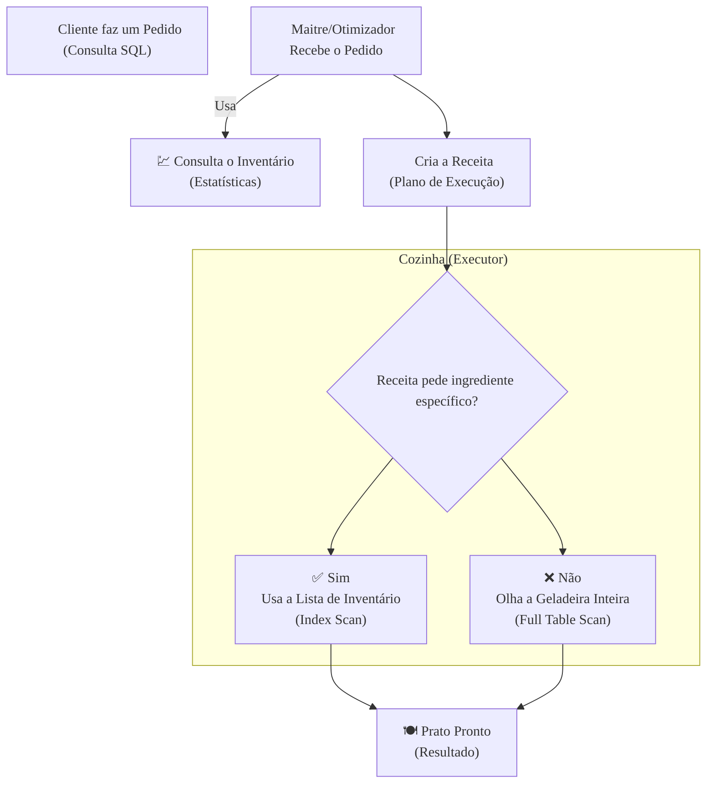

### Olá, futuro(a) aprovado(a)\! Vamos desvendar os segredos da Otimização de Bancos de Dados para o Cebraspe.

Pense na otimização de um banco de dados como a **gestão de uma cozinha de um restaurante super movimentado** 👨‍🍳. O seu objetivo é entregar os pratos (os resultados das consultas) para os clientes o mais rápido possível, sem erros.

-----

### \#\#\# Detecção de Problemas: O Diagnóstico da Cozinha

Antes de consertar, você precisa saber o que está lento.

  * **Otimizador de Consultas (O *Maitre* Inteligente):**
    Quando um pedido (uma consulta SQL) chega na cozinha, o *Maitre* (o Otimizador) é o cérebro da operação. Ele decide qual a forma mais rápida e barata de preparar aquele prato.

      * **Otimizador Baseado em Custo (CBO):** É o *Maitre* moderno. Ele olha para o estado atual da cozinha (as **estatísticas**), vê quantos ingredientes tem no estoque, quais cozinheiros estão livres, e calcula a melhor "receita" (o plano de execução) para aquele momento.

  * **Plano de Execução (A Receita Detalhada):**
    É a comanda que o *Maitre* escreve e entrega aos cozinheiros. Ela detalha passo a passo como o prato deve ser feito. Ex: "1. Vá à geladeira X. 2. Pegue 200g de filé. 3. Leve para a chapa Y...". Analisar essa "receita" é a principal forma de descobrir por que um prato está demorando.

  * **Operações Comuns na Receita:**

      * **Full Table Scan (Olhar a Geladeira Inteira):** O cozinheiro precisa abrir e olhar cada prateleira e cada pote da geladeira para achar um ingrediente. Péssimo se você só queria uma azeitona.
      * **Index Scan (Usar a Lista de Inventário):** A geladeira tem uma lista na porta (um **índice**) que diz exatamente em qual gaveta está cada ingrediente. É o método ideal\!

  * **Estatísticas (O Inventário da Cozinha):**
    São as anotações sobre quantos ingredientes existem, quais os mais usados, etc. O *Maitre* (CBO) **depende criticamente** dessas informações para tomar boas decisões. Se o inventário diz que há 100 filés, mas só há 1, a receita que ele criar será um desastre.

> #### Foco Cebraspe (Pontos de Atenção e "Pegadinhas")
>
> >   * **Otimizador e Estatísticas:** A banca vai dizer que o otimizador sempre escolhe a melhor receita possível. **ERRADO\!** A inteligência do *Maitre* (CBO) depende da precisão do seu **inventário (estatísticas)**. Se o inventário estiver desatualizado, ele vai tomar decisões ruins.
> >   * **Plano de Execução:** O plano não otimiza nada, ele apenas **descreve os passos**. É a **sua análise** do plano que revela os problemas. Ver um "Full Table Scan" na receita de um prato que só pedia uma azeitona é um sinal claro de que algo está muito errado.

-----

### \#\#\# Otimização de Consultas SQL: Escrevendo Pedidos Inteligentes

A forma como o cliente escreve o pedido pode ajudar ou atrapalhar (e muito\!) a cozinha.

  * **Uso Eficiente de Índices (A Lista de Inventário da Geladeira):**

      * Os **índices** são as listas na porta da geladeira que aceleram a busca por ingredientes.
      * **Seletividade:** Uma lista para "Ingredientes por Ordem Alfabética" é super útil (alta seletividade). Uma lista para "Ingredientes que São Comestíveis" (sim/não) é inútil (baixa seletividade).

  * **Condições "SARGable" (Pedidos que Ajudam o Cozinheiro):**
    Um pedido é "SARGable" se ele permite que o cozinheiro use a lista de inventário (o índice).

      * **Anti-padrão:** Fazer uma transformação no pedido impede o uso da lista\!
      * **Pedido Ruim (não-SARGable):** "Me traga o ingrediente cujo nome, quando invertido, começa com a letra 'A'". O cozinheiro terá que pegar TODOS os ingredientes, inverter o nome e só então verificar.
      * **Pedido Bom (SARGable):** "Me traga o ingrediente cujo nome começa com a letra 'T'". O cozinheiro vai direto na seção 'T' da lista.
      * **Exemplo Clássico:**
          * `WHERE YEAR(data_pedido) = 2024` (RUIM - aplica função na coluna)
          * `WHERE data_pedido >= '2024-01-01' AND data_pedido < '2025-01-01'` (BOM - permite uso do índice)

  * **Outras Dicas de Otimização:**

      * **Evitar `SELECT *`:** Em vez de pedir "me traga o frango inteiro com miúdos e tudo", peça apenas "me traga o peito do frango". É menos trabalho para a cozinha e menos coisa para você carregar.
      * **Curinga `%` no `LIKE`:** Pedir `LIKE '%SILVA'` é o mesmo que pedir para o cozinheiro olhar todos os potes para achar um que termine com "SILVA". Ele não pode usar a lista de inventário.

> #### Foco Cebraspe (Pontos de Atenção e "Pegadinhas")
>
> >   * **Índices são a solução para tudo?** **ERRADO\!** A pegadinha mais comum. Índices são como um inventário extra que precisa ser atualizado. Eles aceleram a busca (`SELECT`), mas deixam o ato de guardar novos ingredientes (`INSERT`, `UPDATE`) mais lento. Criar índices em todas as colunas é uma péssima ideia.
> >   * **Funções na Cláusula `WHERE`:** A banca vai jurar que uma consulta com `WHERE UPPER(nome) = 'JOAO'` vai usar o índice da coluna `nome`. **ERRADO\!** Aplicar a função `UPPER()` na coluna força o cozinheiro a pegar todos os nomes, convertê-los para maiúsculas e só depois comparar, ignorando o índice.

### \#\#\# Mapa Mental: O Fluxo de uma Consulta na Cozinha do SGBD

Veja o caminho de um pedido, desde o cliente até o prato chegar à mesa.


```

### **Classe:** C
### **Conteúdo:** Otimização SGBD: Detecção de Problemas

---

### **1. Detecção de Problemas e Conceitos de Otimização**

> #### **TEORIA-ALVO**
> A otimização de banco de dados, ou *tuning*, é o processo iterativo de identificar e resolver gargalos de desempenho em um Sistema Gerenciador de Banco de Dados (SGBD). A detecção de problemas é o primeiro passo e se baseia na análise de como o SGBD executa as consultas.
>
> * **Otimizador de Consultas (*Query Optimizer*):** Componente interno do SGBD responsável por analisar uma instrução SQL e escolher a estratégia de execução mais eficiente. Existem dois tipos principais:
>     * **Otimizador Baseado em Regras (RBO):** Abordagem legada que utiliza um conjunto fixo de regras heurísticas para escolher um plano.
>     * **Otimizador Baseado em Custo (CBO):** Abordagem moderna e padrão. O CBO gera múltiplos planos de execução possíveis e estima o "custo" de cada um (em termos de I/O, CPU, etc.), escolhendo o plano de menor custo estimado.
> * **Plano de Execução (*Execution Plan*):** É a saída do otimizador de consultas. Trata-se de uma "receita" detalhada que descreve a sequência de passos que o SGBD seguirá para executar uma consulta. A análise do plano de execução é a principal ferramenta para diagnosticar consultas lentas.
>     * **Operações Comuns em Planos de Execução:**
>         * **Full Table Scan (Varredura Completa da Tabela):** Leitura de todos os blocos de dados de uma tabela. É eficiente para tabelas pequenas ou consultas que retornam uma grande porcentagem das linhas, mas pode ser um grande gargalo para consultas seletivas em tabelas grandes.
>         * **Index Scan (Varredura de Índice):** Utilização de um índice para localizar rapidamente as linhas que satisfazem uma condição. É o método desejado para consultas altamente seletivas.
>         * **Join Operations (Operações de Junção):** Métodos para combinar dados de duas ou mais tabelas, como `Nested Loops`, `Hash Join` e `Sort Merge Join`.
> * **Estatísticas do Banco de Dados:** São metadados que descrevem os dados armazenados nas tabelas, como o número de linhas, a cardinalidade (número de valores distintos) de cada coluna e histogramas de distribuição de dados. O Otimizador Baseado em Custo (CBO) depende **criticamente** de estatísticas precisas e atualizadas para estimar os custos e escolher um bom plano de execução.

> #### **FOCO CEBRASPE (Pontos de Atenção e "Pegadinhas")**
> > * **Otimizador e Estatísticas:** A banca pode afirmar que o otimizador sempre escolhe o melhor plano de execução possível. **ERRADO**. O otimizador baseado em custo depende das **estatísticas** disponíveis. Se as estatísticas estiverem desatualizadas ou ausentes, o otimizador pode fazer estimativas de custo incorretas e escolher um plano de execução subótimo.
> > * **Plano de Execução como Ferramenta de Diagnóstico:** O plano de execução não otimiza a consulta; ele **descreve como** a consulta será executada. É a **análise** desse plano que permite ao DBA ou desenvolvedor identificar problemas. A presença de um `Full Table Scan` em uma consulta que deveria usar um índice é um forte indicativo de problema.
> > * **CBO vs. RBO:** O CBO é mais inteligente e flexível que o RBO, mas sua eficácia está diretamente ligada à qualidade das estatísticas. A banca pode apresentar o RBO como uma abordagem mais moderna. **ERRADO**. É uma abordagem legada.

---

### **Classe:** C
### **Conteúdo:** Otimização de Consultas SQL

---

### **2. Otimização de Consultas SQL**

> #### **TEORIA-ALVO**
> A otimização de consultas SQL envolve a reescrita ou estruturação de instruções SQL para garantir que o otimizador de consultas do SGBD possa gerar um plano de execução eficiente. As técnicas focam em auxiliar o SGBD a utilizar seus recursos, especialmente os índices, da melhor forma.
>
> * **Uso Eficiente de Índices:**
>     * **Índices:** Estruturas de dados auxiliares que permitem a localização rápida de linhas em uma tabela com base nos valores de uma ou mais colunas, evitando a necessidade de uma varredura completa da tabela.
>     * **Seletividade:** Um índice é mais útil quando a coluna indexada tem alta seletividade (alta cardinalidade, ou seja, muitos valores distintos). Indexar uma coluna com poucos valores distintos (e.g., uma coluna "sexo" com 'M'/'F') geralmente não é eficiente.
> * **Condições "SARGable" (*Search Argument Able*):**
>     * **Definição:** Uma condição em uma cláusula `WHERE` é considerada "SARGable" se ela pode ser resolvida através de uma busca por índice.
>     * **Anti-padrão:** Aplicar uma função diretamente na **coluna** da tabela geralmente impede o uso do índice, tornando a condição não-SARGable.
>         * **Exemplo Ruim (não-SARGable):** `WHERE SUBSTRING(nome, 1, 3) = 'JOS'`
>         * **Exemplo Bom (SARGable):** `WHERE nome LIKE 'JOS%'`
>         * **Exemplo Ruim (não-SARGable):** `WHERE YEAR(data_pedido) = 2024`
>         * **Exemplo Bom (SARGable):** `WHERE data_pedido >= '2024-01-01' AND data_pedido < '2025-01-01'`
> * **Outras Técnicas de Otimização:**
>     * **Evitar `SELECT *`:** Especifique apenas as colunas necessárias na lista de `SELECT`. Isso reduz o tráfego de rede e a quantidade de dados a serem processados pelo SGBD e pela aplicação.
>     * **Otimização de `JOIN`s:** A ordem em que as tabelas são unidas pode impactar o desempenho. Embora o otimizador tente encontrar a melhor ordem, é boa prática garantir que as condições de `JOIN` utilizem colunas indexadas.
>     * **Uso de `UNION ALL` em vez de `OR`:** Em alguns casos, uma condição `WHERE` com `OR` em colunas diferentes pode ser menos eficiente que a união de duas consultas separadas com `UNION ALL`. `UNION ALL` é preferível a `UNION` quando se sabe que não haverá duplicatas, pois `UNION` precisa realizar um trabalho extra para eliminar as duplicatas.

> #### **FOCO CEBRASPE (Pontos de Atenção e "Pegadinhas")**
> > * **Índices como Solução Universal:** A pegadinha mais comum é afirmar que a criação de índices em todas as colunas de uma tabela melhora o desempenho geral do banco de dados. **ERRADO**. Índices aceleram consultas (`SELECT`), mas impõem uma sobrecarga de desempenho em operações de escrita (`INSERT`, `UPDATE`, `DELETE`), pois cada índice relevante também precisa ser atualizado. O excesso de índices é prejudicial.
> > * **SARGability e Funções em `WHERE`:** Este é um conceito técnico frequentemente explorado. A banca apresentará uma consulta com uma função aplicada a uma coluna indexada na cláusula `WHERE` e afirmará que o índice será utilizado. **ERRADO**. A aplicação da função na coluna geralmente força o SGBD a fazer uma varredura completa da tabela, pois ele teria que calcular o resultado da função para cada linha antes de fazer a comparação.
> > * **`LIKE` e o Curinga `%`:** O uso do curinga `%` no **início** de uma string de busca na cláusula `LIKE` (e.g., `WHERE nome LIKE '%SILVA'`) também torna a condição não-SARGable e impede o uso de um índice padrão na coluna, forçando um *full table scan*.
