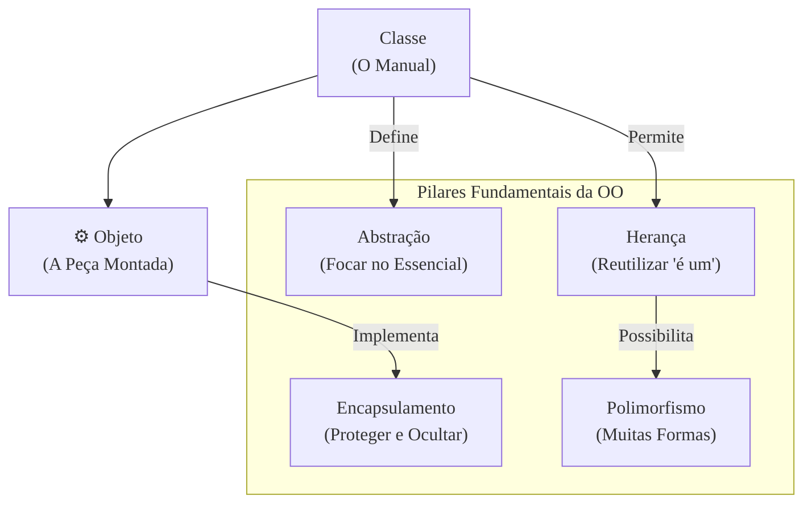

### Olá, futuro(a) aprovado(a)\! Vamos montar o quebra-cabeça da Orientação a Objetos (OO) para você gabaritar no Cebraspe.

Pense em Análise e Projeto Orientado a Objetos como **construir um carro com um kit da LEGO Technic** 🏎️. Não são peças simples; são engrenagens, motores e estruturas que interagem. Cada conceito que vamos ver é uma parte ou uma técnica dessa montagem.

-----

### \#\#\# Conceitos Fundamentais: As Peças Básicas do seu Kit LEGO

Tudo começa com as peças e as instruções.

  * **Classe (A Instrução / O Molde 📜):** É o **manual de instruções** que ensina a montar um "Motor V8". Ele define quais peças usar (atributos) e o que o motor faz (métodos). O manual em si não é um motor.
  * **Objeto (A Peça Montada ⚙️):** É o **motor V8 que você efetivamente montou** seguindo o manual. Ele é concreto, existe e ocupa espaço na sua mesa. Você pode ter vários objetos (motores) feitos a partir do mesmo manual (classe).
  * **Atributo (A Característica da Peça):** Uma propriedade da peça montada. No nosso motor, a `cor` ("cinza") e a `potencia` ("300cv") são atributos.
  * **Método (A Ação da Peça):** O que a peça montada pode fazer. O nosso motor pode `acelerar()` e `frear()`.

> #### Foco Cebraspe (Pontos de Atenção e "Pegadinhas")
>
> >   * **Classe vs. Objeto:** A pegadinha nº 1. A banca vai dizer que "o objeto é o molde para a classe". **ERRADO\!** A **Classe é o molde**; o **Objeto é a instância** (a peça concreta).
> >   * **Estado vs. Comportamento:** O **estado** de um objeto (como ele está agora) é definido por seus **atributos** (cor, velocidade atual). O **comportamento** (o que ele pode fazer) é definido por seus **métodos** (acelerar, frear).

-----

### \#\#\# Abstração: Desenhando o Manual de Instruções

  * **O Conceito:** Abstração é a arte de **focar no essencial** ao criar o manual de instruções. Ao desenhar o manual do "Motor V8", você se concentra nas peças importantes (pistões, cilindros) e ignora detalhes irrelevantes para o funcionamento, como "a cor do parafuso interno" ou "o nome do operário que fabricou a peça real".
  * **O Objetivo:** Simplificar a realidade, pegando apenas o que importa para o contexto do seu carro LEGO.

> #### Foco Cebraspe (Pontos de Atenção e "Pegadinhas")
>
> >   * **Abstração vs. Encapsulamento:** A banca adora confundir\! **Abstração** é o processo de **design** de simplificar e escolher o que é importante para o manual. **Encapsulamento** é o mecanismo de **implementação** de esconder as engrenagens internas do motor depois de montado.
> >   * **Abstração não é Detalhar Tudo:** Uma boa abstração não é a que captura mais detalhes. É a que **omite os detalhes inúteis** de forma inteligente.

-----

### \#\#\# Encapsulamento: A Caixa Protetora do Motor

  * **O Conceito:** É o princípio de **juntar as peças (atributos) e as ações (métodos) do motor dentro de uma "cápsula" protetora** e esconder como ele funciona por dentro (*information hiding*).
  * **A Prática:** Você não pode simplesmente enfiar o dedo e mexer num pistão do motor (`private`). Você só pode interagir com ele através de botões e alavancas externas (`public`), como o pedal do acelerador (o método `acelerar()`). Isso garante que ninguém vai quebrar o motor usando-o de forma errada.

> #### Foco Cebraspe (Pontos de Atenção e "Pegadinhas")
>
> >   * **Encapsulamento não é Dificultar:** O objetivo não é apenas proibir o acesso, mas sim **controlar** o acesso para garantir que o estado do objeto (o motor) permaneça consistente e funcional.
> >   * **Encapsulamento vs. Ocultação:** **Encapsulamento** é colocar tudo na cápsula. **Ocultação** é o princípio de esconder o funcionamento interno. O encapsulamento torna a ocultação possível.

-----

### \#\#\# Herança: Reutilizando Manuais de Instruções

  * **O Conceito:** É um mecanismo para **reaproveitar o trabalho**. Você tem um manual para um "Motor Básico". Para criar um "Motor Turbo", você não começa do zero. Você pega o manual do "Motor Básico" e só adiciona as instruções para a peça "Turbo".
  * **A Relação:** A herança representa uma relação **"é um"**. Um `MotorTurbo` *é um* `MotorBásico` (com algo a mais).

> #### Foco Cebraspe (Pontos de Atenção e "Pegadinhas")
>
> >   * **Herança ("é um") vs. Composição ("tem um"):** A pegadinha mais importante do tema\! A banca vai confundir tudo.
> >       * **Herança:** Um `Caminhão` *é um* `Veículo`.
> >       * **Composição:** Um `Carro` *tem um* `Motor`. (Você não diz que um carro *é um* motor).
> >   * Para resolver problemas de design, a máxima é: **"Prefira composição sobre herança"**, pois gera sistemas mais flexíveis e com menor acoplamento.
> >   * **Herança Múltipla:** Linguagens como Java não permitem que uma classe herde de múltiplos "manuais" de implementação, para evitar confusão (o "problema do diamante"). Elas resolvem isso com **Interfaces**.

-----

### \#\#\# Polimorfismo: O Mesmo Botão, Várias Ações

  * **O Conceito:** Polimorfismo significa "muitas formas". É a capacidade de um mesmo "botão" (chamada de método) se comportar de maneiras diferentes dependendo da peça que está conectada a ele.
  * **Sobrescrita (*Overriding*):** É o polimorfismo em tempo de execução. Imagine um botão `fazerSom()` no painel.
      * Se você instala um objeto `MotorV8`, o botão faz "VRUMM VRUMM\!".
      * Se você troca por um objeto `MotorEletrico`, o mesmo botão `fazerSom()` agora faz "..." (silêncio).
      * **Mesma assinatura, classes diferentes (em uma relação de herança).**
  * **Sobrecarga (*Overloading*):** É o polimorfismo em tempo de compilação.
      * Na sua classe `Calculadora`, você pode ter vários métodos com o nome `somar`: um `somar(int, int)`, outro `somar(double, double)`, e um terceiro `somar(int, int, int)`.
      * **Mesmo nome, assinaturas diferentes, na mesma classe.**

> #### Foco Cebraspe (Pontos de Atenção e "Pegadinhas")
>
> >   * A banca vai trocar **Sobrescrita** e **Sobrecarga**. É a questão mais batida sobre o tema. Grave a diferença\!
> >   * O polimorfismo de **sobrescrita** é o mais poderoso e depende da **ligação tardia (*late binding*)**, onde a decisão de qual método executar é tomada em tempo de execução, com base no tipo real do objeto.

-----

### \#\#\# Análise e Modelagem (UML): A Planta Completa do Carro

  * **O Conceito:** A **UML** é a linguagem universal de símbolos para desenhar as plantas do nosso carro LEGO.
  * **Diagramas Principais:**
      * **Diagrama de Classes:** A planta principal, mostrando todas as peças (classes) e como elas se conectam.
      * **Diagrama de Casos de Uso:** Mostra o que o carro faz da perspectiva do motorista (o ator). Ex: "Motorista" -\> "Acelerar Carro".
      * **Diagrama de Sequência:** Mostra a ordem exata das interações entre as peças quando o motorista gira a chave.
  * **Agregação vs. Composição:** Como as peças se conectam.
      * **Agregação (losango vazado 💎):** Relação "tem-um" fraca. O `Carro` tem um `SistemaDeSom`. Se você tirar o som, as duas peças continuam existindo separadamente.
      * **Composição (losango preenchido ♦️):** Relação "parte-de" forte. O `Carro` é composto de `Rodas`. Se você destrói o carro, as rodas vão junto. O todo é "dono" da parte.

> #### Foco Cebraspe (Pontos de Atenção e "Pegadinhas")
>
> >   * A banca vai trocar a finalidade dos diagramas. Ex: "Diagrama de Casos de Uso detalha a lógica interna". **ERRADO**. Ele mostra a funcionalidade da perspectiva do usuário.
> >   * A diferença entre **Agregação** e **Composição** é o **ciclo de vida** das partes. Composição implica dependência; Agregação, independência.

-----

### \#\#\# Padrões de Projeto: Técnicas de Montagem dos Mestres Construtores

  * **O Conceito:** São **soluções geniais e reutilizáveis** para problemas de montagem que sempre aparecem. Não é uma peça pronta, mas uma "técnica de mestre construtor".
  * **Categorias:**
      * **Criacionais (Como construir as peças):**
          * **Singleton:** Técnica para garantir que você construa **apenas um** objeto de um tipo. Ex: só pode existir um `Volante` no carro.
          * **Factory Method:** Uma "fábrica" que produz peças, mas deixa a decisão de qual peça específica produzir para as subclasses.
      * **Estruturais (Como encaixar as peças):**
          * **Adapter:** Uma peça **adaptadora** que permite conectar um motor com encaixe redondo a um chassi com encaixe quadrado.
          * **Facade:** Cria uma "fachada" simples, como um único controle remoto que controla o som, o ar-condicionado e os vidros, escondendo a complexidade de cada subsistema.
      * **Comportamentais (Como as peças conversam):**
          * **Strategy:** Permite que você troque o "comportamento" de uma peça. Ex: o motor pode operar na estratégia `Economica` ou `Esportiva`.
          * **Observer:** O "fofoqueiro". Quando o `TanqueDeCombustivel` (o observado) muda seu estado para "vazio", ele avisa automaticamente a `LuzDoPainel` (o observador) para acender.

> #### Foco Cebraspe (Pontos de Atenção e "Pegadinhas")
>
> >   * O foco é sempre na **intenção** do padrão. A banca descreve um problema e pergunta qual padrão o resolve.
> >   * Saber a **categoria** (Criacional, Estrutural, Comportamental) de cada padrão é fundamental.
> >   * **Decorator vs. Adapter:** **Decorator** adiciona funções a uma peça sem mudar seu encaixe. **Adapter** muda o encaixe da peça para ela funcionar com outra.

### \#\#\# Mapa Mental: Os Pilares da Orientação a Objetos

### **Classe:** B
### **Conteúdo:** Análise e Projeto OO: Conceitos fundamentais

---

### **1. Conceitos Fundamentais**

> #### **TEORIA-ALVO**
> O Paradigma de Orientação a Objetos (POO) é um modelo de análise, projeto e programação de software baseado na composição e interação entre diversas unidades de software denominadas objetos. Os conceitos basilares são:
>
> * **Classe:** Um modelo ou molde (*blueprint*) que define os atributos (dados) e métodos (comportamentos) comuns a um certo tipo de objeto. É uma entidade abstrata, que não ocupa espaço em memória por si só.
> * **Objeto:** Uma instância concreta de uma classe. Enquanto a classe `Carro` define que carros têm cor e podem acelerar, um objeto específico seria `meuCarro`, com a cor "vermelha" e capaz de executar a ação de acelerar. Objetos possuem estado, comportamento e identidade.
> * **Atributo:** Uma característica ou dado que define o estado de um objeto. Corresponde às variáveis de um objeto. No exemplo da classe `Carro`, `cor` e `velocidadeAtual` são atributos.
> * **Método:** Uma ação ou comportamento que um objeto pode executar. Corresponde às funções ou procedimentos de um objeto. Métodos geralmente operam sobre os atributos do próprio objeto. Na classe `Carro`, `acelerar()` e `frear()` são métodos.
> * **Instanciação:** O processo de criar um objeto a partir de uma classe.

> #### **FOCO CEBRASPE (Pontos de Atenção e "Pegadinhas")**
> > * **Classe vs. Objeto:** A distinção é o ponto mais explorado. A banca frequentemente inverte os conceitos. Itens podem afirmar que "um objeto serve como modelo para a criação de classes". **ERRADO**. A classe é o modelo; o objeto é a instância.
> > * **Estado vs. Comportamento:** A banca pode confundir as responsabilidades. "O estado de um objeto é determinado por seus métodos". **ERRADO**. O **estado** é determinado pelos valores de seus **atributos**. O **comportamento** é definido por seus **métodos**.
> > * **Abstração vs. Concretude:** É fundamental entender que a Classe é uma entidade do campo da abstração, enquanto o Objeto é uma entidade concreta, existente em memória durante a execução do programa.

---

### **Classe:** B
### **Conteúdo:** Abstração

---

### **2. Abstração**

> #### **TEORIA-ALVO**
> A abstração é o pilar da orientação a objetos que consiste em focar nos aspectos essenciais de uma entidade, ignorando detalhes irrelevantes ou acidentais para um determinado contexto. É o processo de simplificação da complexidade do mundo real ao modelar classes e objetos, concentrando-se no "o que" um objeto faz, em vez de "como" ele faz.
>
> * **Propósito:** Gerenciar a complexidade ao destacar as características relevantes de um objeto e suprimir as que não são importantes para o problema em questão.
> * **Exemplo:** Ao modelar uma classe `Pessoa` para um sistema de folha de pagamento, atributos como `nome`, `cpf` e `salario` são essenciais. Detalhes como `cor_dos_olhos` ou `time_de_futebol`, embora existam na pessoa real, são abstraídos por serem irrelevantes para o contexto do sistema.

> #### **FOCO CEBRASPE (Pontos de Atenção e "Pegadinhas")**
> > * **Abstração vs. Encapsulamento:** Estes conceitos são frequentemente confundidos. A **Abstração** é um processo mental e de design, focado em **simplificar e modelar** ao omitir detalhes. O **Encapsulamento** é um mecanismo de implementação, focado em **proteger e ocultar** os detalhes internos de um objeto já modelado. A abstração resolve um problema no domínio do design; o encapsulamento, no domínio da implementação.
> > * **Nível de Detalhe:** A banca pode afirmar que uma boa abstração é aquela que captura o máximo de detalhes de uma entidade do mundo real. **ERRADO**. A eficácia da abstração reside justamente na sua capacidade de **omitir seletivamente** os detalhes, mantendo apenas o que é pertinente ao escopo do problema.
> > * **Abstração como Conceito e não Implementação:** A abstração é um princípio. Em linguagens de programação, ela é materializada por meio de classes, classes abstratas e interfaces, que são ferramentas para implementar o conceito.

---

### **Classe:** B
### **Conteúdo:** Encapsulamento

---

### **3. Encapsulamento**

> #### **TEORIA-ALVO**
> O encapsulamento é o mecanismo de agrupar dados (atributos) e os métodos que os manipulam em uma única unidade, a classe. Adicionalmente, restringe o acesso direto ao estado do objeto, um princípio conhecido como **ocultação de informação** (*information hiding*). O acesso aos dados deve ser feito por meio de uma interface pública de métodos (e.g., `getters` e `setters`).
>
> * **Modificadores de Acesso:** São as ferramentas que implementam o encapsulamento.
>     * `public`: Acesso irrestrito.
>     * `private`: Acesso restrito à própria classe.
>     * `protected`: Acesso restrito à própria classe e a suas subclasses.
> * **Benefícios:**
>     * **Proteção de Dados:** Impede modificações inconsistentes no estado do objeto.
>     * **Redução da Complexidade:** Oculta detalhes de implementação, expondo apenas o necessário.
>     * **Facilidade de Manutenção:** A implementação interna de uma classe pode ser alterada sem impactar o código que a utiliza, desde que a interface pública permaneça a mesma.

> #### **FOCO CEBRASPE (Pontos de Atenção e "Pegadinhas")**
> > * **Encapsulamento vs. Ocultação de Informação:** Embora relacionados, não são sinônimos. **Encapsulamento** é o ato de "colocar em uma cápsula" (agrupar dados e métodos). **Ocultação de Informação** é o princípio de esconder os detalhes internos. O encapsulamento é o mecanismo que torna a ocultação de informação possível. A banca pode usar os termos de forma intercambiável, mas uma questão mais técnica pode explorar essa nuance.
> > * **Objetivo Final:** A banca pode sugerir que o objetivo do encapsulamento é dificultar o acesso aos dados. **INCORRETO**. O objetivo não é dificultar, mas sim **controlar** o acesso, garantindo a integridade do estado do objeto.
> > * **`Getters` e `Setters`:** A simples presença de métodos `get` e `set` públicos para todos os atributos não garante um bom encapsulamento, pois pode expor a implementação e violar o princípio da ocultação de informação. Um bom encapsulamento expõe comportamento, e não apenas dados.

---

### **Classe:** B
### **Conteúdo:** Herança

---

### **4. Herança**

> #### **TEORIA-ALVO**
> A herança é um mecanismo que permite que uma classe (denominada subclasse ou classe derivada) adquira os atributos e métodos de outra classe (superclasse ou classe base). A herança representa um relacionamento do tipo **"é um"** (*is a*).
>
> * **Propósito:** Promover o reuso de código e estabelecer uma hierarquia de classificação entre as classes.
> * **Tipos:**
>     * **Herança Simples:** Uma subclasse herda de apenas uma superclasse (padrão em linguagens como Java e C#).
>     * **Herança Múltipla:** Uma subclasse herda de múltiplas superclasses (suportada em C++, Python). Pode gerar o "problema do diamante" (ambiguidade na herança de métodos com mesma assinatura de superclasses distintas).
> * **Exemplo:** A classe `Cachorro` e a classe `Gato` podem herdar da classe `Animal`. Ambas reutilizam os atributos (`peso`, `idade`) e métodos (`comer()`) de `Animal`, além de poderem ter seus próprios comportamentos específicos, como `latir()` e `miar()`.

> #### **FOCO CEBRASPE (Pontos de Atenção e "Pegadinhas")**
> > * **Herança vs. Composição ("é um" vs. "tem um"):** Esta é a pegadinha mais crítica sobre o tema. **Herança** ("é um"): um `Gerente` *é um* `Funcionario`. **Composição** ("tem um"): um `Carro` *tem um* `Motor`. A banca apresentará um cenário de composição (relação "tem um") e afirmará que a herança é a modelagem correta. **ERRADO**. A máxima "prefira composição sobre herança" é um princípio de design fundamental, pois a composição leva a um acoplamento mais fraco e a sistemas mais flexíveis.
> > * **Herança Múltipla e Interfaces:** A banca pode questionar como linguagens como Java lidam com a ausência de herança múltipla de classes. A resposta é através de **Interfaces**. Uma classe Java pode `implementar` múltiplas interfaces, herdando assim múltiplos *tipos* e assinaturas de métodos, mas não a implementação.
> > * **Quebra de Encapsulamento:** A herança pode quebrar o encapsulamento, pois a subclasse pode ter acesso a membros `protected` da superclasse, criando um acoplamento forte entre elas. Uma alteração na superclasse pode forçar alterações em todas as subclasses.

---

### **Classe:** B
### **Conteúdo:** Polimorfismo

---

### **5. Polimorfismo**

> #### **TEORIA-ALVO**
> Polimorfismo (do grego, "muitas formas") é a capacidade de uma variável, função ou objeto de assumir múltiplas formas. Em POO, refere-se à capacidade de um objeto responder a uma mesma mensagem (chamada de método) de maneiras diferentes, dependendo de sua classe.
>
> * **Tipos de Polimorfismo:**
>     * **Sobrescrita (Overriding):** Ocorre quando uma subclasse fornece uma implementação específica para um método que já é definido em sua superclasse. A assinatura do método (nome e parâmetros) deve ser idêntica. Este é o **polimorfismo de tempo de execução** (ou *late binding*).
>         * Exemplo: A superclasse `Animal` tem um método `fazerSom()`. As subclasses `Cachorro` e `Gato` sobrescrevem este método para emitir "Au au" e "Miau", respectivamente. Uma variável do tipo `Animal` pode referenciar um objeto `Cachorro` ou `Gato` e, ao chamar `fazerSom()`, o som correto será emitido em tempo de execução.
>     * **Sobrecarga (Overloading):** Ocorre quando múltiplos métodos com o mesmo nome, mas com assinaturas diferentes (número, tipo ou ordem dos parâmetros), coexistem na mesma classe. Este é o **polimorfismo de tempo de compilação** (ou *early binding*).

> #### **FOCO CEBRASPE (Pontos de Atenção e "Pegadinhas")**
> > * **Sobrescrita (Overriding) vs. Sobrecarga (Overloading):** Esta é a questão mais frequente e clássica sobre polimorfismo. A banca vai trocar os conceitos. Lembre-se:
> >     * **Sobrescrita:** Mesma assinatura, classes diferentes (relação de herança).
> >     * **Sobrecarga:** Mesmo nome, assinaturas diferentes, mesma classe.
> > * **Ligação Tardia (Late Binding):** O polimorfismo de sobrescrita depende fundamentalmente do mecanismo de ligação tardia, pelo qual a decisão de qual implementação do método será executada é adiada para o tempo de execução, baseada no tipo real do objeto, e não no tipo da variável de referência.
> > * **Interfaces:** Interfaces são um mecanismo poderoso para alcançar polimorfismo. Uma função que recebe um parâmetro do tipo de uma interface pode operar sobre objetos de quaisquer classes que implementem essa interface, sem conhecer seus tipos concretos.

---

### **Classe:** B
### **Conteúdo:** Análise e Modelagem

---

### **6. Análise e Modelagem (UML)**

> #### **TEORIA-ALVO**
> **Análise Orientada a Objetos (AOO)** foca em compreender e modelar o domínio do problema, identificando classes, seus atributos e relacionamentos. Responde "o que" o sistema deve fazer. **Projeto Orientado a Objetos (POO)** foca em definir a solução, especificando a arquitetura de software e como as classes serão implementadas para atender aos requisitos. Responde "como" o sistema fará. A **UML (Unified Modeling Language)** é a linguagem de modelagem padrão para este processo.
>
> * **Principais Diagramas UML:**
>     * **Estruturais (Visão Estática):**
>         * **Diagrama de Classes:** O principal diagrama da UML. Descreve a estrutura do sistema em termos de classes, atributos, métodos e os relacionamentos entre elas.
>         * **Diagrama de Objetos:** Um "instantâneo" do sistema em um determinado momento, mostrando objetos e seus valores.
>     * **Comportamentais (Visão Dinâmica):**
>         * **Diagrama de Casos de Uso:** Descreve a funcionalidade do sistema a partir da perspectiva de um ator externo.
>         * **Diagrama de Sequência:** Mostra a interação entre objetos ordenada no tempo (ênfase na ordem das mensagens).
>         * **Diagrama de Atividades:** Modela o fluxo de trabalho (workflow) de processos, similar a um fluxograma.
> * **Relacionamentos em Diagramas de Classes:**
>     * **Associação:** Relação estrutural entre classes.
>     * **Agregação:** Uma forma de associação "tem-um", onde o ciclo de vida da parte é independente do todo (losango vazado). Ex: Uma `Universidade` tem `Departamentos`.
>     * **Composição:** Uma forma forte de agregação "parte-de", onde o ciclo de vida da parte depende do todo (losango preenchido). Ex: Uma `NotaFiscal` é composta por `ItensDeNota`.

> #### **FOCO CEBRASPE (Pontos de Atenção e "Pegadinhas")**
> > * **Propósito dos Diagramas:** A banca frequentemente troca a finalidade dos diagramas. Ex: "O Diagrama de Sequência descreve a estrutura estática do sistema". **ERRADO**. Ele descreve o comportamento dinâmico. "O Diagrama de Casos de Uso detalha a lógica interna de uma funcionalidade". **ERRADO**. Ele descreve a funcionalidade da perspectiva do usuário, sem detalhar a implementação.
> > * **Agregação vs. Composição:** A distinção sutil é alvo certo. **Agregação** (losango vazado) = independência de ciclo de vida. **Composição** (losango preenchido) = dependência de ciclo de vida (o todo é "dono" da parte). A banca apresentará um cenário e pedirá a classificação correta.
> > * **UML é Notação, não Metodologia:** A UML é uma linguagem para modelar, não um processo ou metodologia (como RUP ou Scrum). A banca pode afirmar que a UML prescreve um processo de desenvolvimento. **ERRADO**.

---

### **Classe:** B
### **Conteúdo:** Padrões de Projeto

---

### **7. Padrões de Projeto**

> #### **TEORIA-ALVO**
> Padrões de Projeto (*Design Patterns*) são soluções gerais e reutilizáveis para problemas que ocorrem com frequência no projeto de software orientado a objetos. Não são códigos prontos, mas sim templates que descrevem como resolver um problema. A catalogação mais famosa é a do "Gang of Four" (GoF).
>
> * **Categorias GoF:**
>     * **Criacionais:** Lidam com a criação de objetos, tornando o sistema independente de como seus objetos são criados.
>         * **Singleton:** Garante que uma classe tenha apenas uma instância e fornece um ponto de acesso global a ela.
>         * **Factory Method:** Define uma interface para criar um objeto, mas deixa as subclasses decidirem qual classe instanciar.
>         * **Abstract Factory:** Fornece uma interface para criar famílias de objetos relacionados ou dependentes sem especificar suas classes concretas.
>     * **Estruturais:** Lidam com a composição de classes e objetos para formar estruturas maiores e mais flexíveis.
>         * **Adapter:** Converte a interface de uma classe em outra interface que os clientes esperam, permitindo que classes com interfaces incompatíveis trabalhem juntas.
>         * **Decorator:** Anexa responsabilidades adicionais a um objeto dinamicamente.
>         * **Facade:** Fornece uma interface unificada e simplificada para um conjunto de interfaces em um subsistema.
>     * **Comportamentais:** Focam na comunicação e na distribuição de responsabilidades entre os objetos.
>         * **Strategy:** Define uma família de algoritmos, encapsula cada um deles e os torna intercambiáveis.
>         * **Observer:** Define uma dependência um-para-muitos, de modo que, quando um objeto muda de estado, todos os seus dependentes são notificados e atualizados automaticamente.
>         * **Template Method:** Define o esqueleto de um algoritmo em uma operação, adiando alguns passos para as subclasses.

> #### **FOCO CEBRASPE (Pontos de Atenção e "Pegadinhas")**
> > * **Intenção do Padrão:** O foco das questões é quase sempre na **intenção** (no problema que o padrão resolve), não na sua implementação. A banca descreverá um problema de design e pedirá para identificar o padrão GoF correspondente, ou dará o nome de um padrão e uma descrição incorreta de sua finalidade.
> > * **Categorização:** Saber a qual categoria (Criacional, Estrutural, Comportamental) um padrão pertence é fundamental e frequentemente cobrado. Ex: "O padrão Singleton é um padrão estrutural". **ERRADO**. É criacional.
> > * **Confusão entre Padrões Similares:** A banca explora a confusão entre padrões com propósitos parecidos.
> >     * **Factory Method vs. Abstract Factory:** Factory Method cria um objeto; Abstract Factory cria uma *família* de objetos relacionados.
> >     * **Decorator vs. Adapter:** Decorator *adiciona* comportamento a um objeto sem mudar sua interface. Adapter *muda* a interface de um objeto para que ele se encaixe em outro sistema.
