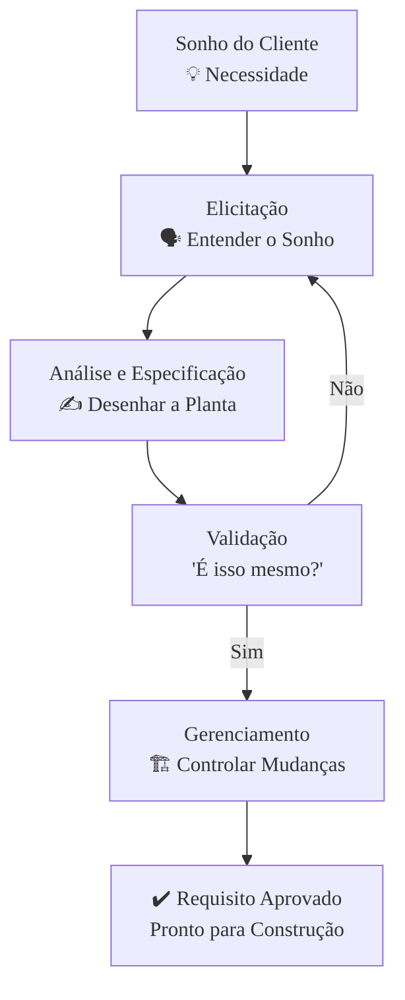

### Olá, futuro(a) aprovado(a)\! Vamos construir juntos o conhecimento sobre Engenharia de Requisitos para você erguer uma base sólida para a prova do Cebraspe.

Pense na Engenharia de Requisitos como o processo de **projetar e construir uma casa sob encomenda** 🏡. Você é o arquiteto/engenheiro, e seu trabalho é entender o sonho do cliente e transformá-lo em uma planta detalhada para que os construtores possam trabalhar sem erros.

-----

### \#\#\# Fundamentos: O Que é a Casa e Que Tipos de Coisas Ela Tem?

Primeiro, definimos os desejos do cliente.

  * **Requisitos Funcionais (RF):** É **O QUE** a casa deve ter ou fazer. São as funcionalidades.

      * Ex: "A casa deve ter 3 quartos."
      * Ex: "O portão da garagem deve abrir com controle remoto."

  * **Requisitos Não Funcionais (RNF):** É **COMO** a casa deve ser ou se comportar. São as qualidades e restrições.

      * Ex: "A casa deve ser capaz de suportar um vento de até 150 km/h." (Segurança)
      * Ex: "A temperatura interna nunca deve passar de 24°C." (Desempenho)

  * **Requisitos de Domínio:** São as regras do "condomínio" ou da prefeitura.

      * Ex: "A fachada da casa deve ser pintada na cor branca ou bege, conforme o regulamento."

  * **Requisitos de Negócio:** É o objetivo principal do cliente ao construir a casa.

      * Ex: "Precisamos de uma casa maior para acomodar a chegada de um novo filho."

> #### Foco Cebraspe (Pontos de Atenção e "Pegadinhas")
>
> >   * **RF vs. RNF:** A pegadinha clássica\! **Funcional = O QUÊ** (uma função). **Não Funcional = COMO** (uma qualidade ou restrição). A banca vai dizer que "o sistema deve ter login com senha" é um RNF. **ERRADO\!** É um RF, pois descreve uma função. "O sistema deve criptografar a senha" é um RNF, pois descreve *como* a função deve se comportar.
> >   * **RNF devem ser testáveis:** Dizer que a casa deve ser "confortável" é ruim. Dizer que "a temperatura deve ficar entre 20°C e 24°C" é bom, pois é mensurável e testável.

-----

### \#\#\# Elicitação: Conversando com o Cliente para Descobrir o Sonho

Elicitação é o processo de levantar os requisitos, ou seja, de extrair o sonho da cabeça do cliente.

  * **Entrevistas:** Sentar com o cliente e perguntar: "Como você imagina a cozinha dos seus sonhos?".
  * **Questionários:** Enviar uma lista de perguntas para toda a família: "Você prefere chuveiro a gás ou elétrico?".
  * **Observação (Etnografia):** A técnica mais poderosa\! É passar um dia na casa atual do cliente para ver como eles *realmente* vivem. Você percebe que eles nunca usam a sala de jantar e sempre comem na cozinha. Assim você descobre um requisito implícito: projetar uma cozinha ampla com uma boa mesa de refeições.
  * **Workshops:** Reunir o casal (que discorda sobre ter uma piscina) para que eles cheguem a um consenso.
  * **Prototipação:** Mostrar uma maquete 3D da casa para o cliente "brincar" e dar um feedback mais concreto.

> #### Foco Cebraspe (Pontos de Atenção e "Pegadinhas")
>
> >   * **Técnica certa para o problema certo:** **Entrevistas** geram informação profunda, mas com poucas pessoas. **Questionários** atingem muitas pessoas, mas com pouca profundidade. **Observação** é a melhor técnica para descobrir os **requisitos implícitos**, aquilo que o cliente faz mas não sabe verbalizar.
> >   * O observador pode alterar o comportamento dos observados (Efeito Hawthorne). O simples fato de você estar lá pode fazer a família usar a sala de jantar que eles nunca usam.

-----

### \#\#\# Especificação: Desenhando a Planta da Casa

Depois de entender o sonho, você precisa colocá-lo no papel.

  * **Linguagem Natural:** Um texto corrido: "Quero uma sala grande, clara...". Fácil de ler, mas muito ambíguo ("o que é 'grande' para você?").
  * **Notações Gráficas (UML):** A **planta baixa** da casa. É a linguagem universal dos arquitetos.
      * **Diagrama de Casos de Uso:** Desenhos que mostram as interações: "Morador" → "Abrir Garagem". Foca nos requisitos funcionais.
      * **Diagrama de Atividades:** Um fluxograma que mostra o passo a passo de uma tarefa, como "a rotina matinal para sair de casa".

> #### Foco Cebraspe (Pontos de Atenção e "Pegadinhas")
>
> >   * A **ambiguidade** da linguagem natural é seu maior defeito e o alvo preferido da banca.
> >   * Um **Caso de Uso** não é uma função, é uma interação completa que gera valor para o usuário. "Fazer café" é uma função. "Preparar o café da manhã" é um caso de uso que envolve várias funções.
> >   * A banca vai trocar a finalidade dos diagramas\! **Casos de Uso = O QUÊ** o sistema faz para o usuário. **Diagramas de Atividades = COMO** um processo funciona.

-----

### \#\#\# Histórias de Usuário: Os "Post-its" do Sonho no Mundo Ágil

No mundo ágil, em vez de uma planta detalhada, o cliente escreve seus desejos em "post-its".

  * **Estrutura:** "**Como um** `<tipo de pessoa>`, **eu quero** `<um desejo>` **para que** `<um benefício seja alcançado>`."
      * Ex: "**Como um** `chef de cozinha amador`, **eu quero** `uma bancada grande na cozinha` **para que** `eu tenha espaço para preparar minhas receitas complexas`."
  * **Critérios INVEST:** Um bom post-it (história) é: **I**ndependente, **N**egociável, **V**alioso, **E**stimável, **P**equeno (Sized Appropriately) e **T**estável.

> #### Foco Cebraspe (Pontos de Atenção e "Pegadinhas")
>
> >   * **História de Usuário vs. Caso de Uso:** Histórias são **pequenas, incompletas por design** e focam no **valor** ("para que..."). Casos de Uso são **detalhados** e focam na **interação**.
> >   * A terceira parte da história ("para que...") é **essencial**, pois explica o valor e ajuda a priorizar o que é mais importante construir primeiro.

-----

### \#\#\# Validação: "É essa a Casa dos Seus Sonhos?"

Antes de construir, você valida a planta com o cliente.

  * **O Conceito:** Garantir que estamos construindo a **casa certa**.
  * **Técnicas:** Revisar a planta em conjunto, apresentar a maquete 3D (protótipo).

> #### Foco Cebraspe (Pontos de Atenção e "Pegadinhas")
>
> >   * **Validação vs. Verificação:** A maior de todas as pegadinhas\!
> >       * **Validação:** "Estamos construindo a **casa certa**?" (A planta reflete o sonho do cliente?).
> >       * **Verificação:** "Estamos construindo a **casa de forma certa**?" (Os pedreiros estão seguindo exatamente o que está na planta?).
> >   * A validação busca erros de requisito **o mais cedo possível**, pois consertar uma parede no lugar errado na planta é infinitamente mais barato do que derrubá-la depois de construída.

-----

### \#\#\# Gerenciamento: Lidando com "Mudei de Ideia\!"

O cliente sempre muda de ideia no meio da obra.

  * **O Conceito:** É o processo para gerenciar as mudanças na planta de forma controlada.
  * **Controle de Mudanças:** O cliente quer mais um banheiro. Ele preenche uma "solicitação de mudança", o arquiteto analisa o impacto no custo e no prazo, e o "comitê" (o casal) aprova.
  * **Rastreabilidade:** É a capacidade de rastrear uma parede na planta até a reunião em que o cliente a pediu. Ajuda a entender o porquê de cada decisão e o impacto de cada mudança.

> #### Foco Cebraspe (Pontos de Atenção e "Pegadinhas")
>
> >   * **Mudança é Inevitável:** A banca pode sugerir que um bom arquiteto congela o projeto e não aceita mudanças. **ERRADO\!** Um bom arquiteto **aceita que mudanças ocorrerão** e cria um processo para gerenciá-las de forma inteligente.

-----

### \#\#\# MVP e Protótipos: A "Edícula" e a Maquete

  * **Protótipo (A Maquete 🖼️):** Uma maquete, um desenho, um modelo 3D. Serve para **discutir e validar o design**. "Você gosta da janela nesta posição?". Pode ser de baixa fidelidade (um desenho num guardanapo) ou alta fidelidade (um tour virtual). Pode ser descartável ou evolutivo.
  * **MVP (A Edícula Funcional ⛺):** O cliente não tem certeza se quer morar no campo. Em vez de construir a mansão, você constrói só uma **edícula funcional (o MVP)**. Ela é o **mínimo** necessário para ser **viável**. O cliente se muda para lá e o objetivo é **aprender com o uso real** para validar a hipótese de negócio ("Vale a pena construir a casa inteira aqui?").

> #### Foco Cebraspe (Pontos de Atenção e "Pegadinhas")
>
> >   * **MVP vs. Protótipo:** Um **protótipo** responde a perguntas de **design** ("Como construir?"). Um **MVP** responde a perguntas de **negócio** ("Deveríamos construir?"). Um MVP é um produto real, usado por clientes reais, focado no aprendizado.
> >   * **"Mínimo" não significa "de baixa qualidade"**. A edícula precisa ter água, luz e ser segura. O mínimo se refere ao escopo de funcionalidades, não à qualidade.

### \#\#\# Mapa Mental: O Ciclo de Vida do Requisito

### **Classe:** A
### **Conteúdo:** Engenharia de Requisitos: Conceitos básicos

---

### **1. Fundamentos e Classificação de Requisitos**

> #### **TEORIA-ALVO**
> A Engenharia de Requisitos é um processo sistemático de definição, documentação e manutenção de requisitos para um sistema de software. Requisito é uma condição ou capacidade que deve ser atendida por um sistema. São classificados principalmente em:
>
> * **Requisitos Funcionais (RF):** Descrevem o que o sistema **deve fazer**. Especificam as funcionalidades, serviços ou comportamentos do sistema. Ex.: "O sistema deve permitir que o usuário emita um relatório de vendas". São verificáveis e, em geral, explícitos.
> * **Requisitos Não Funcionais (RNF):** Definem **como** o sistema deve realizar suas funções. São restrições sobre os serviços ou funções oferecidos pelo sistema. Incluem aspectos como desempenho, usabilidade, segurança, confiabilidade e portabilidade. Ex.: "O sistema deve responder a qualquer consulta em menos de 2 segundos".
> * **Requisitos de Domínio:** Derivam do domínio da aplicação e refletem características e restrições desse domínio. Podem ser funcionais ou não funcionais. Ex.: "O sistema deve utilizar a fórmula de cálculo de juros compostos definida pela norma X do Banco Central".
> * **Requisitos de Negócio:** Objetivos de alto nível da organização ou do cliente que o sistema deve atender. Ex.: "Reduzir o tempo de processamento de pedidos em 20% em 6 meses".

> #### **FOCO CEBRASPE (Pontos de Atenção e "Pegadinhas")**
> > * **Confusão entre RF e RNF:** A principal "pegadinha". A banca frequentemente apresenta um requisito com características de RNF (e.g., performance, segurança) e o classifica como funcional. **ERRADO**. **Funcional = O QUÊ**. **Não Funcional = COMO**. Um requisito como "O sistema deve exigir autenticação com dois fatores" é um **requisito funcional** de segurança (descreve uma função de autenticação), enquanto "O sistema deve criptografar todos os dados em trânsito com AES-256" é um **requisito não funcional** de segurança (uma restrição, um "como").
> > * **Verificabilidade:** A banca pode afirmar que RNF são subjetivos e não verificáveis. **ERRADO**. Embora mais difíceis de medir, RNF devem ser definidos de forma quantitativa e testável sempre que possível (e.g., "O sistema deve suportar 1000 usuários concorrentes" em vez de "O sistema deve ter bom desempenho").
> > * **Requisitos Implícitos vs. Explícitos:** RF são geralmente explícitos. RNF são muitas vezes implícitos e, se não forem levantados ativamente, podem levar ao fracasso do projeto. A banca explora essa omissão.

---

### **Classe:** A
### **Conteúdo:** Engenharia de Requisitos: Elicitação de requisitos

---

### **2. Técnicas de Elicitação (Levantamento)**

> #### **TEORIA-ALVO**
> A elicitação (ou levantamento) de requisitos é o processo de descoberta, coleta e identificação de requisitos a partir de diversas fontes, como stakeholders, documentos e sistemas existentes. As principais técnicas incluem:
>
> * **Entrevistas:** Conversas diretas com stakeholders para coletar informações. Podem ser estruturadas (roteiro fixo) ou não estruturadas (abertas). É eficaz para obter informações detalhadas e contextuais.
> * **Questionários:** Conjunto de perguntas distribuídas a um grande número de pessoas. Útil para obter dados quantitativos e opiniões de um público amplo.
> * **Observação (Etnografia):** O analista observa os usuários em seu ambiente de trabalho natural para entender os processos e desafios reais, muitas vezes descobrindo requisitos implícitos que os próprios usuários não verbalizariam.
> * **Workshops e Brainstorming:** Reuniões colaborativas com stakeholders-chave para gerar ideias e definir requisitos de forma rápida e consensual.
> * **Análise de Documentação:** Estudo de manuais, formulários, políticas e relatórios existentes para entender o domínio e os processos atuais.
> * **Prototipação:** Criação de modelos ou versões parciais do sistema para que os usuários possam interagir e fornecer feedback, ajudando a refinar e descobrir novos requisitos.

> #### **FOCO CEBRASPE (Pontos de Atenção e "Pegadinhas")**
> > * **Adequação da Técnica:** A banca costuma apresentar cenários e pedir a técnica mais adequada. **Ponto-chave:** **Entrevistas** são boas para profundidade, mas não para escala. **Questionários** são bons para escala, mas não para profundidade. **Observação** é excelente para descobrir requisitos implícitos e contextuais que os usuários não conseguem articular. **Workshops** são ideais para resolver conflitos e obter consenso rapidamente.
> > * **Requisitos Implícitos:** A banca valoriza técnicas que são eficazes na descoberta de requisitos implícitos (o "conhecimento tácito"). **Etnografia/Observação** é a técnica mais poderosa para isso. Afirmações de que entrevistas sempre revelam todos os requisitos são **FALSAS**.
> > * **Problemas Comuns:** O examinador pode focar nos problemas de cada técnica. Entrevistas podem ser enviesadas pela opinião do entrevistador/entrevistado. Questionários podem ter baixa taxa de resposta ou perguntas mal formuladas. A presença do observador pode alterar o comportamento dos observados (Efeito Hawthorne).

---

### **Classe:** A
### **Conteúdo:** Engenharia de Requisitos: Especificação de requisitos

---

### **3. Documentação e Modelagem de Requisitos**

> #### **TEORIA-ALVO**
> A especificação é o processo de documentar os requisitos de forma clara, precisa e inequívoca. O principal artefato é o **Documento de Especificação de Requisitos (DER)**, que serve como um contrato entre clientes e desenvolvedores. A especificação pode usar:
>
> * **Linguagem Natural:** Escrita em prosa (e.g., português, inglês). É expressiva e universalmente compreendida, mas propensa a ambiguidades, contradições e omissões.
> * **Linguagem Natural Estruturada:** Uso de templates ou formulários padronizados para reduzir a ambiguidade da linguagem natural. Cada requisito é descrito usando um formato predefinido (e.g., ID, fonte, descrição, critério de aceitação).
> * **Notações Gráficas:** Modelos visuais para representar os requisitos. A **UML (Unified Modeling Language)** é a notação padrão.
>     * **Diagramas de Casos de Uso:** Descrevem as interações entre atores (usuários ou sistemas externos) e o sistema, representando os requisitos funcionais.
>     * **Diagramas de Classes:** Modelam a estrutura estática do sistema.
>     * **Diagramas de Atividades:** Modelam os fluxos de trabalho (workflows) e processos.
> * **Especificações Formais:** Usam linguagem matemática (lógica, teoria de conjuntos) para eliminar completamente a ambiguidade. São precisas, mas difíceis de produzir e de comunicar a stakeholders não técnicos.

> #### **FOCO CEBRASPE (Pontos de Atenção e "Pegadinhas")**
> > * **Ambiguidade da Linguagem Natural:** A principal desvantagem explorada pela banca. Itens frequentemente afirmam que a linguagem natural é a melhor forma de especificação por ser fácil de entender. **INCOMPLETO/ERRADO**. É fácil de entender, mas sua ambiguidade é um risco crítico que justifica o uso de outras formas de especificação.
> > * **Casos de Uso vs. Funções:** Um **Caso de Uso** não é uma função isolada, mas uma interação completa que gera um resultado de valor para um ator. A banca pode tentar igualar "caso de uso" a "função do sistema". **ERRADO**. O caso de uso "Realizar Compra Online" engloba múltiplas funções: buscar produto, adicionar ao carrinho, informar pagamento, confirmar pedido.
> > * **Finalidade dos Diagramas UML:** O examinador testará o conhecimento sobre qual diagrama serve para quê. **Casos de Uso = Requisitos Funcionais**. **Diagramas de Atividades = Fluxos de Processo**. **Diagramas de Sequência = Interação entre objetos no tempo**. Saber a finalidade de cada um é crucial.

---

### **Classe:** A
### **Conteúdo:** Engenharia de Requisitos: Histórias de usuário

---

### **4. Histórias de Usuário (User Stories)**

> #### **TEORIA-ALVO**
> Uma História de Usuário é uma descrição curta, simples e em linguagem natural de uma funcionalidade, contada da perspectiva do usuário ou cliente. É a principal forma de especificação em metodologias ágeis (e.g., Scrum, XP). A estrutura padrão é:
>
> **Como um** `<tipo de usuário>`, **eu quero** `<realizar alguma ação>` **para que** `<eu obtenha algum benefício/valor>`.
>
> Histórias são definidas pelos **3 Cs**:
> * **Cartão (Card):** A história é escrita em um cartão físico ou digital, um lembrete para a conversa.
> * **Conversação (Conversation):** A parte mais importante. Os detalhes da história são elucidados através de conversas contínuas entre a equipe de desenvolvimento e o Product Owner/cliente.
> * **Confirmação (Confirmation):** Os **critérios de aceitação** definem como saber que a história foi implementada corretamente. São as condições que o software deve satisfazer para que a história seja considerada "pronta".

> #### **FOCO CEBRASPE (Pontos de Atenção e "Pegadinhas")**
> > * **História de Usuário vs. Caso de Uso:** A banca adora comparar os dois. **Diferenças-chave:** Histórias são intencionalmente **incompletas** e convidam à conversação; Casos de Uso buscam ser **detalhados** e completos. Histórias focam no **valor** para o usuário ("para que..."); Casos de Uso focam na **interação** ator-sistema.
> > * **Critérios INVEST:** Uma boa história de usuário deve seguir o acrônimo INVEST. A banca cobra o significado de cada letra.
> >     * **I**ndependente (Independent): Evitar dependências com outras histórias.
> >     * **N**egociável (Negotiable): Não é um contrato, detalhes podem ser negociados.
> >     * **V**aliosa (Valuable): Entrega valor claro ao cliente.
> >     * **E**stimável (Estimable): A equipe consegue estimar o esforço.
> >     * **P**equena (Small/Sized Appropriately): Pequena o suficiente para ser concluída em uma iteração (sprint).
> >     * **T**estável (Testable): Possui critérios de aceitação claros.
> > * **Omissão do "Para Que":** Itens podem apresentar histórias de usuário sem a terceira parte (o valor). **ERRADO**. A justificativa de valor ("para que...") é um componente essencial que guia a priorização e o desenvolvimento.

---

### **Classe:** A
### **Conteúdo:** Engenharia de Requisitos: Validação de requisitos

---

### **5. Técnicas de Validação**

> #### **TEORIA-ALVO**
> A validação de requisitos é a atividade que garante que os requisitos especificados são os **requisitos certos**, ou seja, que eles atendem às necessidades reais do cliente e permitem que ele atinja seus objetivos. O objetivo é checar a correção, completude, consistência e viabilidade dos requisitos. As técnicas incluem:
>
> * **Revisões e Inspeções:** Uma equipe (analistas, desenvolvedores, clientes) lê sistematicamente o documento de requisitos para encontrar erros, ambiguidades e omissões. É a técnica mais comum.
> * **Prototipação:** Desenvolver uma versão executável (um protótipo) do sistema para que os usuários possam experimentar as funcionalidades e validar se elas correspondem às suas expectativas.
> * **Geração de Casos de Teste:** A criação de casos de teste a partir da especificação pode revelar problemas, pois requisitos ambíguos ou incompletos são difíceis de testar.
> * **Análise de Rastreabilidade:** Verificar as ligações entre os requisitos e suas fontes (stakeholders, objetivos de negócio) para garantir que todos os requisitos são justificados e que todos os objetivos foram atendidos.

> #### **FOCO CEBRASPE (Pontos de Atenção e "Pegadinhas")**
> > * **Validação vs. Verificação:** Este é o ponto mais explorado pela banca.
> >     * **Validação:** "Estamos construindo o **produto certo**?" (Atende à necessidade do cliente?).
> >     * **Verificação:** "Estamos construindo o **produto de forma certa**?" (Atende à especificação?).
> >     * A banca frequentemente troca os conceitos. Ex.: "A validação checa se o software está em conformidade com sua especificação." **ERRADO**. Isso é verificação. A validação checa se a especificação atende à necessidade do negócio.
> > * **Momento da Execução:** A validação não é uma fase única no final. É um processo contínuo. A banca pode afirmar que a validação só ocorre após a especificação estar completa. **ERRADO**. Acontece iterativamente.
> > * **Foco da Atividade:** O objetivo final da validação é encontrar erros **antes** do desenvolvimento começar, pois o custo de correção de um erro de requisito aumenta exponencialmente nas fases posteriores do ciclo de vida.

---

### **Classe:** A
### **Conteúdo:** Engenharia de Requisitos: Gerenciamento de requisitos

---

### **6. Gerenciamento de Mudanças e Rastreabilidade**

> #### **TEORIA-ALVO**
> O gerenciamento de requisitos é o processo de gerenciar as mudanças nos requisitos ao longo do ciclo de vida do projeto. Requisitos são voláteis e mudam por diversas razões (mudanças no negócio, melhor entendimento do problema, etc.). As atividades centrais são:
>
> * **Controle de Mudanças:** Processo formal para submeter, analisar o impacto, aprovar ou rejeitar e implementar mudanças nos requisitos. Geralmente envolve um Comitê de Controle de Mudanças (CCM).
> * **Análise de Impacto:** Avaliar como uma mudança proposta em um requisito afetará outros requisitos, o design do sistema, o código, os testes e o cronograma do projeto.
> * **Gerenciamento de Versões:** Manter o histórico de mudanças nos requisitos e controlar as versões do documento de especificação.
> * **Rastreabilidade de Requisitos:** Gerenciar e documentar as dependências entre requisitos e outros artefatos do sistema. Permite responder a perguntas como: "Por que este requisito existe?" (rastreabilidade para a fonte) e "Quais componentes de software implementam este requisito?" (rastreabilidade para o design/código).

> #### **FOCO CEBRASPE (Pontos de Atenção e "Pegadinhas")**
> > * **Rastreabilidade:** É um conceito-chave. A banca explora seus dois tipos principais:
> >     * **Rastreabilidade Pré-RS (Pré-Especificação):** Conecta os requisitos às suas fontes (objetivos de negócio, stakeholders). Ajuda a entender a **motivação** do requisito.
> >     * **Rastreabilidade Pós-RS (Pós-Especificação):** Conecta os requisitos aos artefatos de desenvolvimento (design, código, casos de teste). Ajuda na **análise de impacto**.
> >     * Uma afirmação de que rastreabilidade serve apenas para saber quem pediu o requisito é **INCOMPLETA**. Sua função principal é a análise de impacto de mudanças.
> > * **Inevitabilidade da Mudança:** O examinador pode sugerir que um bom processo de elicitação impede a mudança de requisitos. **ERRADO**. O princípio fundamental do gerenciamento de requisitos é **aceitar a mudança como inevitável** e estabelecer um processo robusto para gerenciá-la, em vez de tentar congelar os requisitos prematuramente.

---

### **Classe:** B
### **Conteúdo:** Engenharia de Requisitos: Produto mínimo viável

---

### **7. Produto Mínimo Viável (MVP)**

> #### **TEORIA-ALVO**
> O Produto Mínimo Viável (MVP - *Minimum Viable Product*) é uma versão de um novo produto que permite à equipe coletar a quantidade máxima de aprendizado validado sobre os clientes com o mínimo de esforço. O foco principal do MVP **não é o produto**, mas o **aprendizado**. Trata-se de construir a menor coisa possível para testar uma hipótese de negócio fundamental.
>
> * **Objetivo:** Testar hipóteses (e.g., "Os clientes pagarão por esta funcionalidade?") de forma rápida e barata.
> * **Característica:** Contém apenas as funcionalidades essenciais (o "mínimo") para ser "viável" e entregue a um grupo de usuários iniciais (early adopters) para obter feedback real.

> #### **FOCO CEBRASPE (Pontos de Atenção e "Pegadinhas")**
> > * **MVP vs. Protótipo:** A distinção é crucial. **Protótipo** serve para responder questões de **design e usabilidade** ("Como construir isso?"). **MVP** serve para responder questões de **negócio e mercado** ("Deveríamos construir isso?"). A banca pode afirmar que MVP é um protótipo de alta fidelidade. **ERRADO**. Um MVP é um produto funcional, ainda que simples, entregue a usuários reais para medir comportamento, enquanto um protótipo pode ser um mock-up não funcional usado para discussões internas.
> > * **"Mínimo" não é "Ruim":** O examinador pode sugerir que o MVP é um produto de baixa qualidade. **ERRADO**. O MVP deve ser "viável", o que implica um nível de qualidade, design e confiabilidade suficiente para que os usuários possam utilizá-lo e fornecer feedback válido. O "mínimo" refere-se ao **escopo** de funcionalidades, não à qualidade.

---

### **Classe:** C
### **Conteúdo:** Engenharia de Requisitos: Prototipação

---

### **8. Tipos e Aplicações de Protótipos**

> #### **TEORIA-ALVO**
> Prototipação é a construção de modelos ou versões iniciais do sistema. É uma técnica usada na elicitação, para ajudar os usuários a identificar requisitos, e na validação, para demonstrar a aparência e o comportamento do sistema.
>
> * **Tipos de Protótipos:**
>     * **Baixa Fidelidade (Low-fi):** Simples, muitas vezes em papel (esboços, storyboards). Rápidos e baratos de criar e descartar. Excelentes para explorar conceitos iniciais.
>     * **Alta Fidelidade (High-fi):** Parecem e se comportam de forma muito semelhante ao sistema final. Criados com ferramentas de software (e.g., Figma, Axure), podem incluir interações.
> * **Abordagens de Prototipação:**
>     * **Evolucionária (ou Evolutiva):** O protótipo é construído com boa qualidade e gradualmente evolui para se tornar o sistema final.
>     * **Descartável (ou Exploratória):** O protótipo é construído rapidamente para responder a perguntas específicas e depois é descartado. O sistema real é desenvolvido do zero.

> #### **FOCO CEBRASPE (Pontos de Atenção e "Pegadinhas")**
> > * **Objetivo da Prototipação:** O objetivo principal é **reduzir o risco e a incerteza** nos requisitos, especialmente na interface com o usuário (UI) e na experiência do usuário (UX). A banca pode limitar o uso da prototipação apenas à fase de design. **ERRADO**. É uma ferramenta poderosa de **elicitação e validação** de requisitos.
> > * **Evolucionário vs. Descartável:** A banca pode confundir as abordagens. **Descartável** é para **aprendizado** rápido e focado. **Evolucionário** já parte do princípio de que o protótipo se tornará a base do sistema final, exigindo mais cuidado na engenharia desde o início. Afirmar que todo protótipo é descartável é **ERRADO**.
