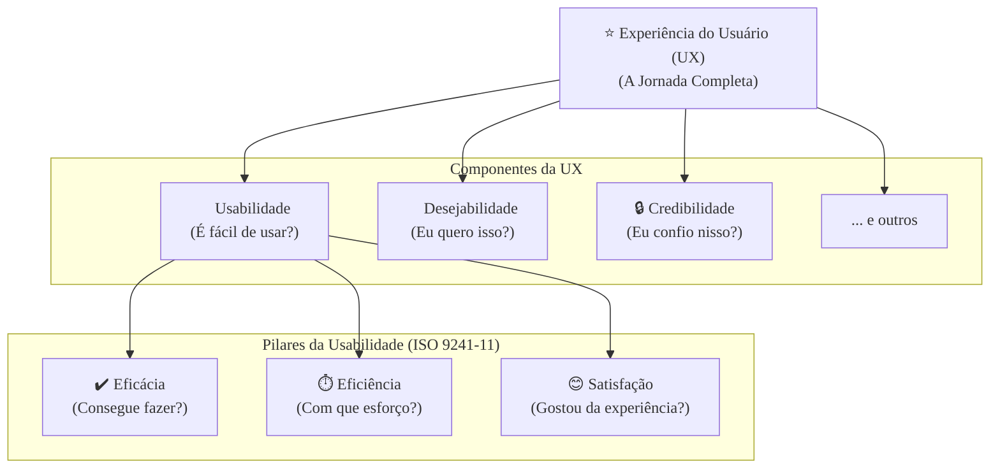

### Olá, futuro(a) aprovado(a)\! Vamos descomplicar a Engenharia de Usabilidade para você garantir aqueles pontos preciosos na prova do Cebraspe.

Pense em Usabilidade e Experiência do Usuário como o processo de **projetar, criar e avaliar uma ferramenta de cozinha perfeita**, como um descascador de batatas inovador. 🥔

-----

### \#\#\# Conceitos Básicos de Usabilidade: O Descascador Funciona Bem?

A usabilidade responde à pergunta: "O quão bom é este descascador para descascar batatas?". Segundo a norma ISO 9241-11, ela tem 3 pilares:

  * **Eficácia:** O descascador consegue tirar a casca da batata? Sim ou não? É sobre **concluir a tarefa**.
  * **Eficiência:** Com que esforço ele faz isso? Você descasca uma batata em 10 segundos ou em 2 minutos? É sobre **recursos gastos** (tempo, esforço).
  * **Satisfação:** Você gostou de usar o descascador? Ele foi confortável na sua mão ou te deu calos? É sobre a **percepção subjetiva**.

Lembre-se que tudo isso depende do **Contexto de Uso**. Um descascador perfeito para um chef profissional destro (usuário) pode ser horrível para um cozinheiro amador canhoto (outro usuário). A usabilidade não é absoluta\!

> #### Foco Cebraspe (Pontos de Atenção e "Pegadinhas")
>
> >   * **Eficácia vs. Eficiência:** A banca vai trocar os dois\! **Eficácia** = Conseguiu? (Sim/Não). **Eficiência** = Gastou quanto tempo/esforço? (Medida de recursos).
> >   * **Usabilidade é Relativa:** A banca pode dizer que um sistema é "inerentemente usável". **ERRADO\!** A usabilidade sempre depende de quem usa, para fazer o quê e em qual situação (o contexto de uso).

-----

### \#\#\# Experiência do Usuário (UX): A Jornada Completa com o Descascador

A Experiência do Usuário (UX) é um conceito muito mais amplo. Não é só sobre o ato de descascar a batata.

  * **O que é UX?** É a **jornada completa** e os **sentimentos** do usuário com o descascador. Começa **antes** de usar (ver a embalagem bonita na loja), continua **durante** o uso (o prazer de ver a casca saindo fininha) e vai até **depois** do uso (a facilidade de lavar e guardar a ferramenta).
  * **Usabilidade vs. UX:** A usabilidade é uma parte da UX. Um descascador pode ser usável (descasca a batata), mas ter uma UX ruim (é feio, difícil de limpar e quebra fácil).
  * **UI vs. UX:** A **UI (Interface do Usuário)** é a parte física do descascador: a cor e o formato do cabo, o material da lâmina. A **UX** é a experiência e a emoção que essa UI proporciona.

> #### Foco Cebraspe (Pontos de Atenção e "Pegadinhas")
>
> >   * **UX e Usabilidade NÃO são sinônimos:** A banca vai dizer que UX é apenas a facilidade de uso. **ERRADO\!** Isso é usabilidade. UX é a **experiência emocional e holística**.
> >   * **UI e UX NÃO são sinônimos:** A banca vai dizer que um bom UX é fazer uma interface bonita. **INCOMPLETO\!** Uma UI bonita é só um pedaço da UX. De que adianta um descascador de ouro (UI bonita) se ele não descasca nada (péssima usabilidade e, consequentemente, péssima UX)?

-----

### \#\#\# Heurísticas de Nielsen: Os 10 Mandamentos do Bom Design

As heurísticas de Jakob Nielsen são como os **10 mandamentos para criar boas ferramentas**. São guias práticos para evitar problemas comuns.

1.  **Visibilidade do estado do sistema:** O descascador tem um indicador que mostra quando a lâmina está ficando cega.
2.  **Correspondência com o mundo real:** O movimento para usar o descascador é intuitivo, como o de uma faquinha.
3.  **Controle e liberdade do usuário:** Se você começa a descascar do lado errado, é fácil parar e corrigir.
4.  **Consistência e padrões:** Todos os descascadores da mesma marca funcionam de forma parecida.
5.  **Prevenção de erros:** O design tem um protetor que impede seu dedo de escorregar para a lâmina.
6.  **Reconhecimento em vez de memorização:** Você olha para ele e já sabe como usar, sem precisar ler um manual.
7.  **Flexibilidade e eficiência:** É fácil de usar para novatos e chefs experientes podem usá-lo muito rápido.
8.  **Estética e design minimalista:** Sem partes desnecessárias que só servem para acumular sujeira.
9.  **Ajuda na recuperação de erros:** Se a batata trava na lâmina, é fácil de destravar.
10. **Ajuda e documentação:** A embalagem tem um pequeno diagrama mostrando o melhor ângulo para usar.

> #### Foco Cebraspe (Pontos de Atenção e "Pegadinhas")
>
> >   * A banca vai mostrar um **cenário de erro** (ex: um site com um link que não parece um link) e perguntar **qual heurística foi violada** (neste caso, "Reconhecimento em vez de memorização" e talvez "Consistência e padrões").
> >   * **Prevenção vs. Recuperação de Erros:** Prevenir é criar um design que **evita** o erro. Recuperar é dar uma **boa mensagem de erro** depois que ele já aconteceu. A prevenção é sempre melhor.

-----

### \#\#\# Análise de Requisitos de Usabilidade: Entendendo os Cozinheiros

Antes de projetar o descascador, você precisa entender quem vai usá-lo.

  * **Personas:** Você cria perfis de usuários fictícios, mas baseados na realidade.
      * **"Dona Maria, 65 anos, tem artrite nas mãos"**: Precisa de um cabo ergonômico e macio.
      * **"Chef Carlos, 28 anos, descasca 10kg de batatas por dia"**: Precisa de uma ferramenta super rápida e durável.
  * **Análise de Tarefas:** Você detalha passo a passo como uma pessoa descasca uma batata para identificar onde estão as dificuldades.

> #### Foco Cebraspe (Pontos de Atenção e "Pegadinhas")
>
> >   * **Persona não é um usuário real:** É um **arquétipo**, uma representação de um grupo de usuários.
> >   * Requisitos de usabilidade (ex: "O Chef Carlos deve conseguir descascar 1kg de batatas em menos de 3 minutos") são **requisitos não funcionais**.

-----

### \#\#\# Avaliação de Usabilidade: Testando o Descascador

Com um protótipo do descascador em mãos, é hora de avaliar se ele é bom.

  * **Métodos de Inspeção (sem usuários):**
      * **Avaliação Heurística:** Um **especialista** em design pega o descascador e o avalia contra as 10 Heurísticas de Nielsen, apontando as falhas teóricas.
  * **Métodos de Teste (com usuários):**
      * **Teste de Usabilidade:** Você chama a **Dona Maria e o Chef Carlos** (usuários reais), dá o descascador e um saco de batatas para eles e **observa** como eles usam, medindo tempo, erros e frustrações.
      * **Protocolo Think-Aloud (Pensar Alto):** Você pede para eles irem falando em voz alta tudo o que pensam enquanto usam a ferramenta.

> #### Foco Cebraspe (Pontos de Atenção e "Pegadinhas")
>
> >   * A diferença mais importante: **Inspeção = Especialista avalia**. **Teste = Usuário final usa**. A banca vai dizer que avaliação heurística é um teste. **ERRADO\!** É uma inspeção.
> >   * O objetivo do teste não é perguntar ao usuário se ele "gostou", mas **observar seu comportamento** para descobrir os problemas.

-----

### \#\#\# Design de Interface (UI): Desenhando o Descascador

A UI é a aparência e a forma da ferramenta.

  * **Affordance:** A qualidade de um objeto que sugere seu uso. O cabo do descascador tem um formato que "pede" para ser segurado de uma certa maneira.
  * **Feedback:** A resposta da ferramenta à sua ação. O som e a sensação da lâmina cortando a casca confirmam que você está fazendo o movimento certo.
  * **Wireframe, Mockup e Protótipo:**
      * **Wireframe:** Um esboço do descascador em um guardanapo (só a estrutura).
      * **Mockup:** Um modelo 3D estático no computador, com cores e texturas.
      * **Protótipo Interativo:** Um modelo físico impresso em 3D que você pode segurar na mão.

> #### Foco Cebraspe (Pontos de Atenção e "Pegadinhas")
>
> >   * Decore a hierarquia dos protótipos: **Wireframe (esqueleto) → Mockup (visual estático) → Protótipo (visual + interativo)**.
> >   * **Affordance** é um conceito chave de design. Um link em um site que não tem nenhuma indicação visual de que é clicável (sem sublinhado, sem cor diferente) tem um *affordance* ruim.

### \#\#\# Mapa Mental: A Relação entre UX e Usabilidade

### **Classe:** C
### **Conteúdo:** Engenharia de Usabilidade: Conceitos básicos

---

### **1. Conceitos Básicos**

> #### **TEORIA-ALVO**
> A Engenharia de Usabilidade é uma abordagem sistemática e estruturada para o desenvolvimento de software que visa garantir a usabilidade do produto final. Seu pilar é a definição de usabilidade provida pela norma ISO 9241-11.
>
> * **Definição (ISO 9241-11):** Usabilidade é o grau em que um sistema, produto ou serviço pode ser utilizado por usuários específicos para atingir objetivos específicos com **eficácia**, **eficiência** e **satisfação**, em um determinado **contexto de uso**.
> * **Componentes da Usabilidade:**
>     * **Eficácia:** A acurácia e a completude com que os usuários atingem os objetivos especificados. Responde à pergunta: "O usuário consegue completar a tarefa?".
>     * **Eficiência:** A quantidade de recursos despendidos (tempo, esforço humano, custos) em relação à acurácia e completude com que os usuários atingem os objetivos. Responde à pergunta: "Com que esforço o usuário completa a tarefa?".
>     * **Satisfação:** O grau de conforto e a atitude positiva do usuário em relação ao uso do produto. É uma medida subjetiva da percepção do usuário.
> * **Contexto de Uso:** A usabilidade não é uma qualidade absoluta, mas relativa. Ela depende da interação entre o **usuário** (com suas habilidades e experiências), a **tarefa** (com seus objetivos), o **equipamento** (hardware e software) e o **ambiente** (físico e social).

> #### **FOCO CEBRASPE (Pontos de Atenção e "Pegadinhas")**
> > * **Troca entre os Componentes:** A banca frequentemente explora a confusão entre eficácia e eficiência. Um item pode afirmar que "eficácia é a medida do tempo gasto para completar uma tarefa". **ERRADO**. Isso se refere à **eficiência**. A **eficácia** refere-se apenas à capacidade de completar a tarefa com sucesso, independentemente dos recursos gastos.
> > * **Usabilidade como Qualidade Absoluta:** É incorreto afirmar que um sistema possui uma usabilidade inerente e universal. **INCORRETO**. A usabilidade é sempre relativa ao **contexto de uso**. Um sistema altamente usável para um especialista pode não ser usável para um usuário novato.
> > * **Satisfação como Fator Secundário:** A banca pode apresentar a satisfação como um componente de menor importância. **ERRADO**. De acordo com a ISO 9241-11, a satisfação é um dos três pilares da usabilidade, sendo crucial para a aceitação e o sucesso de um sistema.

---

### **Classe:** C
### **Conteúdo:** Experiência do Usuário (UX)

---

### **2. Experiência do Usuário (UX)**

> #### **TEORIA-ALVO**
> A Experiência do Usuário (UX - *User Experience*) é um conceito mais amplo e holístico que a usabilidade. Refere-se às percepções, emoções e respostas de uma pessoa que resultam do uso ou da antecipação do uso de um produto, sistema ou serviço.
>
> * **Definição (ISO 9241-210):** UX inclui todas as emoções, crenças, preferências, percepções, respostas físicas e psicológicas, comportamentos e realizações do usuário que ocorrem antes, durante e após o uso.
> * **Diferenças Chave:**
>     * **Usabilidade vs. UX:** A usabilidade é um atributo da qualidade de uso, focado na performance (eficácia, eficiência) para atingir um objetivo. A UX engloba a usabilidade, mas também aspectos subjetivos e emocionais, como prazer, diversão, confiança e valor percebido.
>     * **UI vs. UX:** A Interface do Usuário (UI - *User Interface*) é a parte concreta e visual do sistema com a qual o usuário interage. A UX é a experiência e o sentimento geral decorrentes dessa interação. A UI é o meio; a UX é o resultado da jornada.
> * **Elementos da UX:** Incluem utilidade, usabilidade, desejabilidade, encontrabilidade, acessibilidade, credibilidade e valor.

> #### **FOCO CEBRASPE (Pontos de Atenção e "Pegadinhas")**
> > * **UX e Usabilidade como Sinônimos:** A pegadinha mais comum é tratar os termos como intercambiáveis. "A experiência do usuário se restringe à facilidade com que um usuário atinge seus objetivos." **ERRADO**. Esta é a definição de **usabilidade**. A **UX** é mais ampla, envolvendo a percepção e os sentimentos do usuário sobre toda a interação. Um sistema pode ser usável, mas proporcionar uma UX ruim.
> > * **UI e UX como Sinônimos:** É comum a banca afirmar que "um bom design de UX consiste em criar uma interface visualmente atraente". **INCORRETO**. Uma interface atraente (UI) é apenas um dos fatores que contribuem para uma boa experiência (UX). Um sistema pode ser bonito, mas inútil ou difícil de usar, resultando em uma péssima UX.
> > * **Escopo Temporal:** A usabilidade é avaliada *durante* o uso. A UX considera a jornada completa, incluindo o que acontece *antes* (expectativas, marketing) e *depois* (suporte, lembrança da marca) do uso.

---

### **Classe:** C
### **Conteúdo:** Critérios e Guias

---

### **3. Critérios e Guias (Heurísticas de Usabilidade)**

> #### **TEORIA-ALVO**
> Heurísticas de Usabilidade são princípios gerais e regras práticas que servem como guias para o design de interfaces e como base para a identificação de problemas de usabilidade. As mais difundidas são as **10 Heurísticas de Jakob Nielsen**.
>
> 1.  **Visibilidade do estado do sistema:** O sistema deve sempre manter os usuários informados sobre o que está acontecendo, através de feedback apropriado e em tempo hábil.
> 2.  **Correspondência entre o sistema e o mundo real:** O sistema deve falar a linguagem do usuário, com palavras e conceitos familiares, seguindo convenções do mundo real.
> 3.  **Controle e liberdade do usuário:** Usuários devem ter a liberdade de desfazer ações (e.g., "undo") e sair de estados indesejados facilmente. Deve haver "saídas de emergência".
> 4.  **Consistência e padrões:** Elementos, terminologias e ações devem ter o mesmo significado em todas as partes do sistema.
> 5.  **Prevenção de erros:** Um design cuidadoso que previne a ocorrência de erros é melhor do que boas mensagens de erro.
> 6.  **Reconhecimento em vez de memorização:** Minimizar a carga de memória do usuário, tornando objetos, ações e opções visíveis. O usuário não deve ter que lembrar informações de uma parte do diálogo para outra.
> 7.  **Flexibilidade e eficiência de uso:** O sistema deve ser eficiente tanto para usuários novatos quanto para experientes (e.g., permitir o uso de atalhos).
> 8.  **Estética e design minimalista:** As interfaces não devem conter informações irrelevantes ou raramente necessárias.
> 9.  **Ajuda aos usuários a reconhecer, diagnosticar e recuperar de erros:** Mensagens de erro devem ser expressas em linguagem clara, indicar o problema precisamente e sugerir uma solução.
> 10. **Ajuda e documentação:** Se necessário, a ajuda deve ser fácil de buscar, focada na tarefa do usuário e listar passos concretos a serem seguidos.

> #### **FOCO CEBRASPE (Pontos de Atenção e "Pegadinhas")**
> > * **Identificação da Heurística Violada:** A forma mais comum de cobrança é a apresentação de um cenário com um problema de design e a solicitação para que se identifique a heurística de Nielsen que foi violada.
> > * **Confusão entre Heurísticas:** A banca pode explorar a sobreposição conceitual entre algumas heurísticas. Exemplo: confundir "Prevenção de erros" (e.g., desabilitar um botão que não pode ser usado) com "Ajuda na recuperação de erros" (e.g., uma boa mensagem de erro após um clique inválido).
> > * **Heurísticas como Regras Rígidas:** Heurísticas são guias gerais, não regras absolutas. A banca pode tratá-las como especificações formais. **INCORRETO**.

---

### **Classe:** C
### **Conteúdo:** Análise de Requisitos de Usabilidade

---

### **4. Análise de Requisitos de Usabilidade**

> #### **TEORIA-ALVO**
> A análise de requisitos de usabilidade é o processo de identificação, especificação e validação das necessidades dos usuários relacionadas à facilidade de uso do sistema. Esses requisitos são classificados como **requisitos não funcionais**.
>
> * **Objetivo:** Integrar as preocupações com a usabilidade desde as fases iniciais do ciclo de vida de desenvolvimento, em vez de tratá-la como uma correção tardia.
> * **Técnicas Comuns:**
>     * **Personas:** Criação de personagens arquetípicos e fictícios, baseados em pesquisa com usuários reais, para representar os principais grupos de usuários do sistema. Cada persona possui nome, foto, objetivos, habilidades e contexto. Elas servem para guiar as decisões de design.
>     * **Análise de Tarefas:** Decomposição das atividades que os usuários precisam realizar para atingir seus objetivos. Ajuda a entender o fluxo de trabalho e a identificar pontos de complexidade.
>     * **Histórias de Usuário (*User Stories*):** Embora seja uma técnica ágil para requisitos funcionais, seu formato ("Como um [ator], eu quero [ação] para [benefício]") ajuda a manter o foco no usuário e no valor, sendo um insumo para a definição dos requisitos de usabilidade.

> #### **FOCO CEBRASPE (Pontos de Atenção e "Pegadinhas")**
> > * **Persona como Usuário Real:** É incorreto definir persona como o perfil de um usuário real específico. **ERRADO**. A persona é um **arquétipo**, uma síntese de características observadas em um grupo de usuários, criada para representar esse grupo.
> > * **Requisitos de Usabilidade como Funcionais:** A banca pode classificar um requisito como "O sistema deve permitir que um usuário novato complete o cadastro em menos de 2 minutos" como um requisito funcional. **ERRADO**. Trata-se de um **requisito não funcional** de desempenho (eficiência) da usabilidade.
> > * **Análise de Tarefas vs. Casos de Uso:** A análise de tarefas foca no **como** o usuário trabalha para atingir um objetivo, detalhando os passos cognitivos e físicos. O caso de uso foca no **o que**, descrevendo a interação funcional entre o ator e o sistema.

---

### **Classe:** C
### **Conteúdo:** Avaliação de Usabilidade

---

### **5. Avaliação de Usabilidade**

> #### **TEORIA-ALVO**
> A avaliação de usabilidade é o processo de mensurar empiricamente as características de usabilidade de uma interface. Os métodos se dividem em duas grandes categorias: métodos de inspeção (sem usuários) e métodos de teste (com usuários).
>
> * **Métodos de Inspeção (Avaliação por Especialistas):**
>     * **Avaliação Heurística:** Um ou mais especialistas em usabilidade inspecionam a interface e julgam sua conformidade com um conjunto de princípios de usabilidade reconhecidos (as heurísticas).
>     * **Percurso Cognitivo (*Cognitive Walkthrough*):** Especialistas simulam passo a passo a interação de um usuário novato com a interface para realizar uma tarefa específica, tentando identificar problemas de aprendizado e compreensão.
> * **Métodos de Teste (Avaliação com Usuários):**
>     * **Teste de Usabilidade:** Usuários representativos do público-alvo são recrutados para realizar um conjunto de tarefas realistas em um protótipo ou no sistema. Observadores coletam dados quantitativos (tempo na tarefa, taxa de sucesso) e qualitativos (comentários, frustrações).
>     * **Protocolo Think-Aloud (Pensar Alto):** Uma técnica usada durante o teste de usabilidade, na qual o participante é instruído a verbalizar continuamente seus pensamentos, sentimentos e opiniões enquanto interage com o sistema.

> #### **FOCO CEBRASPE (Pontos de Atenção e "Pegadinhas")**
> > * **Diferença entre Inspeção e Teste:** Esta é a distinção mais importante. A banca afirmará que "a avaliação heurística é um método de teste de usabilidade". **ERRADO**. É um método de **inspeção**. Testes envolvem, obrigatoriamente, a participação de **usuários finais** realizando tarefas. Inspeções são realizadas por **especialistas**.
> > * **Objetivos dos Métodos:** A banca pode confundir o foco de cada método. O **teste de usabilidade** é abrangente e avalia o desempenho real. O **percurso cognitivo** tem um foco mais específico na **facilidade de aprendizado** para usuários de primeira viagem.
> > * **Papel do Especialista vs. Usuário:** Na avaliação heurística, o especialista identifica os problemas. No teste de usabilidade, o usuário **revela** os problemas através de seu comportamento e feedback, e o observador os **interpreta**. A banca pode afirmar que no teste de usabilidade, o usuário é quem aponta as violações de heurísticas. **INCORRETO**.

---

### **Classe:** C
### **Conteúdo:** Design de Interface (UI)

---

### **6. Design de Interface (UI)**

> #### **TEORIA-ALVO**
> O Design de Interface do Usuário (UI) é a disciplina focada na criação da aparência, interatividade e apresentação de um produto digital. É a parte do sistema com a qual o usuário interage diretamente. Um bom design de UI é um componente crítico para uma boa usabilidade.
>
> * **Conceitos Fundamentais de Design de Interação:**
>     * **Affordance (Percepção de Utilidade):** As qualidades de um objeto ou elemento de interface que sugerem como ele deve ser utilizado. Um botão com efeito de sombra e relevo "dá a entender" (*affords*) que pode ser clicado.
>     * **Feedback:** A resposta do sistema a uma ação do usuário. Deve ser imediato e informativo, confirmando que a ação foi recebida e indicando o resultado.
>     * **Consistência:** A manutenção de padrões de design (cores, fontes, ícones, layout) e de comportamento (ações) em todo o sistema, o que facilita o aprendizado e o uso.
>     * **Mapeamento:** A relação entre os controles e seus efeitos. Um bom mapeamento é natural e intuitivo (e.g., deslizar um controle de volume para a direita aumenta o som).
> * **Protótipos:** São modelos ou simulações da interface usados para testar e refinar o design antes da implementação.
>     * **Wireframe:** Protótipo de baixa fidelidade, um esqueleto que foca na estrutura, layout e conteúdo, sem detalhes visuais.
>     * **Mockup:** Protótipo estático de alta fidelidade, que inclui o design visual completo (cores, tipografia, imagens), mas sem interatividade.
>     * **Protótipo Interativo:** Mockup com interatividade, permitindo a simulação do uso real do sistema.

> #### **FOCO CEBRASPE (Pontos de Atenção e "Pegadinhas")**
> > * **Wireframe vs. Mockup vs. Protótipo:** A banca frequentemente confunde os níveis de fidelidade e os propósitos dos protótipos. É fundamental saber que **Wireframe** = estrutura (baixa fidelidade); **Mockup** = visual (alta fidelidade, estático); **Protótipo Interativo** = visual + comportamento (alta fidelidade, interativo).
> > * **Conceito de Affordance:** Por ser um conceito mais abstrato, a banca pode testar seu entendimento através de exemplos. A ausência de um affordance claro (e.g., um texto que é um link, mas não tem nenhuma indicação visual disso) é um problema de usabilidade.
> > * **Design de Interface como Solução Final:** É incorreto assumir que o design de interface é a última etapa. No processo de Design Centrado no Usuário, o design é uma atividade iterativa, que envolve ciclos contínuos de prototipação, teste com usuários e refinamento.
