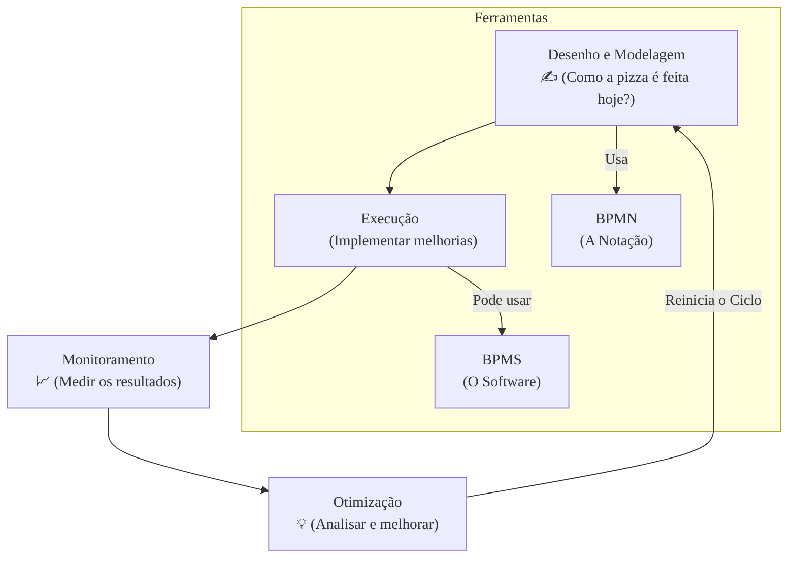

### Olá, futuro(a) aprovado(a)\! Vamos fatiar o Gerenciamento de Processos (BPM) para que você possa devorar as questões do Cebraspe.

Pense em BPM como a **arte de gerenciar uma pizzaria delivery de sucesso** 🍕. O objetivo não é apenas fazer uma boa pizza, mas garantir que todo o processo, desde o pedido por telefone até a entrega na casa do cliente, seja rápido, eficiente e deixe o cliente feliz.

-----

### \#\#\# Gerenciamento de Processos (BPM): A Filosofia da Pizzaria

  * **O que é BPM?** É a **disciplina de gestão** que enxerga a pizzaria não como departamentos separados (atendimento, cozinha, entrega), mas como um **fluxo contínuo (processo)** focado em entregar valor (a pizza quentinha) ao cliente. É uma visão horizontal, de ponta a ponta.

  * **O Ciclo de Vida de BPM:** É um ciclo de melhoria contínua na pizzaria, que nunca para.

    1.  **Desenho e Modelagem:** Desenhar em um quadro como a pizza é feita hoje.
    2.  **Execução:** Colocar as melhorias em prática (comprar um forno novo, usar um app de delivery).
    3.  **Monitoramento:** Medir o tempo de entrega, a temperatura da pizza na chegada, a satisfação do cliente.
    4.  **Otimização:** Analisar os dados e pensar em novas melhorias, reiniciando o ciclo.

> #### Foco Cebraspe (Pontos de Atenção e "Pegadinhas")
>
> >   * **A Salada de Letras (BPM vs. BPMS vs. BPMN):** A pegadinha mais clássica\!
> >       * **BPM:** É a **disciplina de gestão** (a filosofia da pizzaria).
> >       * **BPMS:** É o **software** (o sistema de pedidos e entregas).
> >       * **BPMN:** É a **notação** (os símbolos para desenhar o processo no quadro).
> >   * A banca vai dizer que "BPM é um software". **ERRADO\!**
> >   * **BPM não é um Projeto:** A banca vai dizer que BPM tem início, meio e fim. **ERRADO\!** BPM é uma **disciplina contínua**, um ciclo infinito de melhorias. Um "projeto para reduzir o tempo de entrega" acontece *dentro* da disciplina BPM.

-----

### \#\#\# As Fases do Ciclo: Da Pizza Atual à Pizza dos Sonhos

Vamos dar um zoom nas fases de otimização.

  * **Modelagem (AS-IS):** É o ato de desenhar o fluxo de **como a pizza é feita hoje**, com todos os seus problemas e gargalos. É a "realidade".
  * **Análise:** É olhar para o desenho do "AS-IS" e identificar os problemas: "O pizzaiolo tem que andar muito para pegar o queijo na geladeira (gargalo)", "A impressora de pedidos às vezes falha (ponto de falha)".
  * **Desenho (TO-BE):** É desenhar o fluxo da **pizzaria ideal do futuro**, com um layout otimizado que resolve os problemas encontrados.
  * **Melhoria vs. Reengenharia:**
      * **Melhoria Incremental:** Pequenos ajustes. "Vamos mudar o queijo de lugar para ficar mais perto do pizzaiolo".
      * **Reengenharia:** Uma mudança radical. "Vamos demolir a cozinha, comprar fornos automatizados e usar drones para a entrega\!".

> #### Foco Cebraspe (Pontos de Atenção e "Pegadinhas")
>
> >   * **AS-IS vs. TO-BE:** A banca vai trocar tudo. Lembre-se: **Modelagem = AS-IS** (o agora). **Desenho/Redesenho = TO-BE** (o futuro).
> >   * **Melhoria vs. Reengenharia:** Não são sinônimos. **Melhoria** é um ajuste fino, evolucionário. **Reengenharia** é uma revolução, joga tudo fora e começa do zero.

-----

### \#\#\# Integração de Processos: A Pizzaria em Harmonia

Para o fluxo funcionar, os processos precisam conversar entre si.

  * **Integração Horizontal:** É garantir que a passagem de bastão entre os departamentos seja perfeita. O processo de "Anotar Pedido" (atendimento) precisa se conectar sem falhas com o processo de "Fazer Pizza" (cozinha), que precisa se conectar com o de "Entregar Pizza" (delivery).
  * **Integração Vertical:** É garantir que os processos do dia a dia estejam alinhados com a estratégia da empresa. Se a estratégia é "Ser a pizzaria mais rápida da cidade", o processo de "Montar a Pizza" deve ser otimizado para a velocidade, não para o detalhe artístico.

> #### Foco Cebraspe (Pontos de Atenção e "Pegadinhas")
>
> >   * A banca vai dizer que "alinhar o processo com a estratégia é integração horizontal". **ERRADO\!** Alinhar com a estratégia (de cima para baixo) é integração **vertical**.

-----

### \#\#\# BPMN: A Linguagem Universal para Desenhar Processos

BPMN é o conjunto de símbolos padrão (como uma planta de arquiteto) que todos usam para desenhar os processos da pizzaria.

  * **Objetos de Fluxo (Os Símbolos Principais):**

      * **Evento (Círculo ⭕):** Algo que acontece. **Início** (borda fina): "Pedido Recebido". **Fim** (borda grossa): "Pizza Entregue".
      * **Atividade (Retângulo Arredondado ▭):** Um trabalho a ser feito. "Montar Pizza".
      * **Gateway (Losango ◇):** Uma decisão no fluxo. **Exclusivo (X):** "Pagamento em dinheiro OU cartão?". **Paralelo (+):** "Prepare a pizza E a bebida ao mesmo tempo".

  * **Conectores (As Setas):**

      * **Fluxo de Sequência (Linha Contínua →):** Mostra a ordem das tarefas **DENTRO** da pizzaria.
      * **Fluxo de Mensagem (Linha Tracejada ⤍):** Mostra a comunicação **ENTRE** a pizzaria e o cliente.

  * **Swimlanes (As Áreas do Restaurante):**

      * **Piscina (*Pool*):** Representa um participante inteiro. Ex: A "Pizzaria". O "Cliente".
      * **Raia (*Lane*):** As subdivisões **DENTRO** de uma piscina. Ex: Na piscina "Pizzaria", temos as raias "Atendimento", "Cozinha" e "Entrega".

> #### Foco Cebraspe (Pontos de Atenção e "Pegadinhas")
>
> >   * **Fluxo de Sequência vs. Fluxo de Mensagem:** A pegadinha mais batida\! **Fluxo de Sequência (contínuo) NUNCA cruza a borda de uma Piscina**. Ele só liga coisas dentro do mesmo participante. Para conversar com outro participante (ex: Cliente -\> Pizzaria), você **OBRIGATORIAMENTE** usa um **Fluxo de Mensagem (tracejado)**.
> >   * **Lógica dos Gateways:** Decore os símbolos\! **X = OU** (exclusivo). **+ = E** (paralelo). **O = OU...E** (inclusivo).
> >   * **Piscina vs. Raia:** Se são participantes diferentes (ex: Pizzaria e Fornecedor), são **Piscinas** diferentes. Se são apenas setores dentro do mesmo participante (ex: Cozinha e Entrega, ambos da Pizzaria), são **Raias** dentro da mesma Piscina.

### \#\#\# Mapa Mental: O Ciclo de Vida do BPM

### **Classe:** C
### **Conteúdo:** Gerenciamento de Processos: Conceitos e Ciclo de Vida

---

### **1. Gerenciamento de Processos (BPM)**

> #### **TEORIA-ALVO**
> Gerenciamento de Processos de Negócio (BPM - *Business Process Management*) é uma disciplina gerencial que trata os processos de negócio como ativos da organização, que devem ser sistematicamente modelados, analisados, desenhados, executados, monitorados e otimizados de forma contínua. O BPM adota uma visão de ponta a ponta (*end-to-end*), focada na entrega de valor ao cliente.
>
> * **Conceitos Fundamentais:**
>     * **Processo de Negócio:** Um conjunto de atividades estruturadas e inter-relacionadas, com início e fim definidos, que utiliza recursos para transformar entradas (*inputs*) em saídas (*outputs*) com o objetivo de entregar valor a um cliente.
>     * **Visão Horizontal vs. Vertical:** BPM promove uma visão horizontal (por processos), que atravessa os silos funcionais (visão vertical, por departamentos), para focar na cadeia de valor.
> * **Ciclo de Vida de BPM:** Embora haja variações, um ciclo de vida típico inclui as seguintes fases:
>     1.  **Desenho e Modelagem de Processos:** Identificação e documentação dos processos atuais (AS-IS) e desenho dos processos futuros (TO-BE).
>     2.  **Execução (Implantação):** Implementação do processo redesenhado, que pode envolver automação via um BPMS (*Business Process Management System*), mudanças organizacionais e treinamento.
>     3.  **Monitoramento:** Coleta e medição de dados de desempenho do processo em execução, por meio de indicadores-chave de desempenho (KPIs).
>     4.  **Otimização (Melhoria):** Análise dos dados monitorados para identificar novas oportunidades de melhoria, reiniciando o ciclo.

> #### **FOCO CEBRASPE (Pontos de Atenção e "Pegadinhas")**
> > * **BPM vs. BPMS vs. BPMN:** Esta é a confusão terminológica mais clássica. **BPM** é a disciplina de gestão. **BPMS** é a tecnologia (software) que suporta a automação e execução de processos. **BPMN** é a notação gráfica para modelar processos. A banca frequentemente afirmará que "BPM é uma ferramenta de software". **ERRADO**.
> > * **BPM como Projeto vs. Disciplina:** Itens podem descrever BPM como um projeto com início, meio e fim. **ERRADO**. BPM é uma **disciplina de gestão contínua** e cíclica. Um "projeto de melhoria de processo" é uma instância dentro da disciplina de BPM.
> > * **Foco Exclusivo em Automação:** É incorreto afirmar que o objetivo do BPM é unicamente a automação. **INCORRETO**. O objetivo central é a geração de valor, que pode ser alcançada por meio de otimização, melhoria da qualidade, aumento da eficiência ou alinhamento estratégico, sendo a automação apenas um dos possíveis meios para tal.

---

### **2. Modelagem, Análise, Desenho e Melhoria de Processos**

> #### **TEORIA-ALVO**
> As fases de modelagem, análise, desenho e melhoria constituem o núcleo do ciclo de otimização de processos dentro do BPM.
>
> * **Modelagem de Processos:**
>     * **Objetivo:** Entender e documentar o processo de negócio como ele é executado atualmente (processo **AS-IS**).
>     * **Artefato Principal:** Um diagrama do processo (e.g., em BPMN) que representa as atividades, os responsáveis, as regras e o fluxo de trabalho. Serve como base para a comunicação e análise.
> * **Análise de Processo:**
>     * **Objetivo:** Avaliar criticamente o modelo AS-IS para identificar problemas, tais como gargalos, atividades redundantes, custos excessivos, tempos de ciclo longos e pontos de falha.
>     * **Técnicas:** Podem ser qualitativas (e.g., análise de causa raiz, brainstorming) ou quantitativas (e.g., simulação de processos, análise de custos baseada em atividades).
> * **Desenho e Redesenho de Processo:**
>     * **Objetivo:** Criar uma nova versão do processo (processo **TO-BE**) que solucione os problemas identificados na análise e atinja as metas de desempenho desejadas.
>     * **Abordagens:**
>         * **Melhoria Incremental (*Process Improvement*):** Modificações pontuais e contínuas no processo existente (e.g., filosofia Kaizen).
>         * **Reengenharia (*Business Process Reengineering - BPR*):** Uma abordagem radical que questiona os fundamentos do processo e busca um redesenho drástico e completo, geralmente com alto impacto e risco.
> * **Melhoria Contínua:** É o princípio de que a otimização de processos é uma atividade permanente. O ciclo **PDCA** (Plan-Do-Check-Act) é um modelo clássico para implementar a melhoria contínua.

> #### **FOCO CEBRASPE (Pontos de Atenção e "Pegadinhas")**
> > * **Finalidade das Fases (AS-IS vs. TO-BE):** A banca pode trocar os objetivos das fases. "A modelagem de processos tem como finalidade a criação de um processo futuro otimizado (TO-BE)". **ERRADO**. A modelagem foca no **AS-IS** (atual). O **desenho/redesenho** foca no **TO-BE** (futuro).
> > * **Melhoria vs. Reengenharia:** É comum a banca tratar os termos como sinônimos. **INCORRETO**. A **melhoria** é incremental e evolucionária. A **reengenharia** é radical, disruptiva e revolucionária, frequentemente ignorando o processo atual para começar do zero.
> > * **Análise como Etapa Secundária:** Itens podem sugerir que a fase de análise é opcional. **ERRADO**. Sem uma análise criteriosa do processo AS-IS, o desenho do processo TO-BE corre o risco de não resolver os problemas reais ou, pior, de automatizar ineficiências.

---

### **3. Integração de Processos**

> #### **TEORIA-ALVO**
> Integração de processos é a coordenação e o alinhamento de processos de negócio distintos para que operem de forma coesa, visando a otimização da cadeia de valor e o alcance dos objetivos organizacionais. A integração pode ser analisada em dois eixos principais.
>
> * **Integração Horizontal:**
>     * **Foco:** Na cadeia de valor de ponta a ponta (*end-to-end*). Garante a transição fluida do trabalho através das fronteiras departamentais e entre processos distintos.
>     * **Exemplo:** A integração entre os processos de "Receber Pedido" (Vendas), "Produzir Item" (Produção) e "Entregar Pedido" (Logística) para garantir que o cliente receba o produto correto no prazo acordado.
> * **Integração Vertical:**
>     * **Foco:** No alinhamento dos processos com a estratégia da organização. Garante que os processos no nível operacional estejam alinhados e contribuam para as metas definidas nos níveis tático e estratégico.
>     * **Exemplo:** O processo de "Desenvolvimento de Novos Produtos" deve estar alinhado com a estratégia corporativa de "Ser o líder de inovação do mercado". Os KPIs do processo devem refletir essa estratégia.

> #### **FOCO CEBRASPE (Pontos de Atenção e "Pegadinhas")**
> > * **Troca entre os Eixos Horizontal e Vertical:** A banca pode descrever um cenário de integração e classificá-lo incorretamente. Exemplo: "O alinhamento dos processos operacionais com os objetivos estratégicos da empresa é um exemplo de integração horizontal". **ERRADO**. Trata-se de integração **vertical**.
> > * **Integração como Problema Puramente Tecnológico:** Itens podem afirmar que a integração de processos se resume à implementação de tecnologias como um BPMS ou um Barramento de Serviços Corporativo (ESB). **INCOMPLETO/ERRADO**. A tecnologia é um habilitador fundamental, mas a integração efetiva depende primariamente de governança, definição de papéis e responsabilidades, acordos de nível de serviço (SLAs) e uma cultura de colaboração.

---

### **4. BPMN (Business Process Model and Notation)**

> #### **TEORIA-ALVO**
> BPMN é a notação gráfica padrão para modelagem de processos de negócio, mantida pelo OMG (*Object Management Group*). Foi projetada para ser facilmente compreendida por todas as partes interessadas, desde analistas de negócio até desenvolvedores técnicos. Um diagrama BPMN é formado por um conjunto limitado de elementos gráficos.
>
> * **Objetos de Fluxo (*Flow Objects*):**
>     * **Evento:** Um círculo. Representa algo que acontece. Tipos principais pela borda: **Início** (borda simples), **Intermediário** (borda dupla), **Fim** (borda espessa). Podem ter gatilhos internos (ícones) como Mensagem, Temporizador, Erro.
>     * **Atividade:** Um retângulo de cantos arredondados. Representa um trabalho a ser feito. Pode ser uma **Tarefa** (atômica) ou um **Subprocesso** (que pode ser expandido).
>     * **Gateway (Desvio):** Um losango. Controla a divergência e convergência do fluxo. Tipos principais:
>         * **Exclusivo (XOR):** Marcado com um "X". Apenas um dos caminhos de saída é escolhido.
>         * **Paralelo (AND):** Marcado com um "+". Todos os caminhos de saída são ativados simultaneamente.
>         * **Inclusivo (OR):** Marcado com um "O". Um ou mais caminhos de saída podem ser ativados, com base em condições.
> * **Objetos de Conexão:**
>     * **Fluxo de Sequência:** Linha contínua com seta. Indica a ordem de execução dos elementos **dentro de uma mesma piscina**.
>     * **Fluxo de Mensagem:** Linha tracejada com círculo na origem e seta no destino. Mostra a comunicação **entre duas piscinas diferentes**.
>     * **Associação:** Linha pontilhada. Usada para ligar um artefato (e.g., anotação) a um objeto de fluxo.
> * **Swimlanes (Raias Organizacionais):**
>     * **Piscina (*Pool*):** Representa um participante do processo (e.g., uma empresa, um cliente). É um contêiner para um processo.
>     * **Raia (*Lane*):** É uma subdivisão **dentro de uma piscina** para organizar atividades por papel ou função (e.g., raia "Atendente", raia "Gerente").
> * **Artefatos:** Fornecem informações adicionais. Incluem **Objetos de Dados**, **Grupos** e **Anotações**.

> #### **FOCO CEBRASPE (Pontos de Atenção e "Pegadinhas")**
> > * **Fluxo de Sequência vs. Fluxo de Mensagem:** Esta é a pegadinha mais comum. Um **Fluxo de Sequência** (linha contínua) **NUNCA** pode cruzar a fronteira entre duas Piscinas. Ele é usado apenas para conectar elementos dentro da mesma Piscina. O **Fluxo de Mensagem** (linha tracejada) é o único conector que pode ligar duas Piscinas distintas, representando a troca de informações entre participantes diferentes.
> > * **Lógica dos Gateways:** A banca explorará a confusão entre os tipos de gateway. É fundamental saber a diferença: **Exclusivo (XOR)** = um ou outro; **Paralelo (AND)** = um e outro; **Inclusivo (OR)** = um, outro, ou ambos. A simbologia ("X", "+", "O") é crucial.
> > * **Piscina vs. Raia:** Uma **Piscina** representa um processo ou um participante. **Raias** são subdivisões de uma piscina. A banca pode afirmar que duas raias em um mesmo diagrama representam processos de empresas diferentes. **ERRADO**. Se são empresas diferentes, devem ser Piscinas diferentes.
> > * **Tipos de Evento:** A representação visual (borda fina para início, dupla para intermediário, espessa para fim) é um ponto de atenção. Um item pode descrever um evento de forma funcionalmente correta, mas associá-lo a um ícone ou tipo de borda errado.
