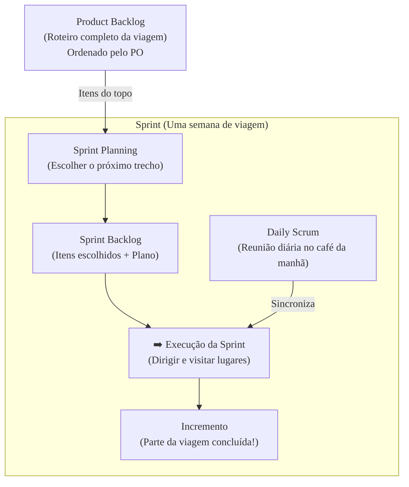

### Olá, futuro(a) aprovado(a)\! Vamos entrar no mundo Ágil e desvendar a Gestão de Backlog para você acelerar na prova do Cebraspe.

Pense no desenvolvimento de um produto ágil como **planejar e executar uma longa viagem de van com um grupo de amigos** 🚐. O **Backlog** é o roteiro da sua viagem.

-----

### \#\#\# Gestão de Backlog: O Roteiro da Viagem

  * **Product Backlog (O Roteiro Completo):** É a lista de desejos gigante e única para a viagem inteira, colada na parede da van. Contém tudo: "Visitar o Grand Canyon", "Abastecer a van", "Comprar um chapéu de cowboy". Quem manda nessa lista, decidindo o que é mais importante e o que vem primeiro, é o **Product Owner (PO)**, o "dono da viagem".

  * **Um Bom Roteiro é DEEP:**

      * **D**etailed appropriately (Detalhado na medida certa): Os próximos destinos da lista estão super detalhados (endereços, horários). Os destinos do final da viagem são só ideias vagas.
      * **E**stimated (Estimado): Cada item da lista tem uma estimativa de esforço. "Visitar o Grand Canyon" é grande. "Parar para um lanche" é pequeno.
      * **E**mergent (Emergente): O roteiro não é fixo\! Se vocês descobrem um festival de música no caminho, o PO pode adicionar isso à lista.
      * **P**rioritized (Priorizado): A lista está ordenada. O item mais importante e valioso está sempre no topo.

  * **Backlog Refinement (Refinando o Roteiro):** É a atividade contínua de juntar a galera para conversar sobre os próximos destinos da lista, adicionando detalhes e estimativas para que eles estejam prontos para a próxima etapa da viagem.

> #### Foco Cebraspe (Pontos de Atenção e "Pegadinhas")
>
> >   * **Quem manda no Roteiro?** A banca vai dizer que é o Scrum Master ou o time. **ERRADO\!** A palavra final sobre a ordem e o conteúdo do Product Backlog é **exclusivamente do Product Owner (PO)**.
> >   * **O Roteiro é Estático?** A banca vai dizer que o backlog é definido no início e não muda. **ERRADO\!** Sua natureza **emergente** (mutável) é a essência da agilidade.
> >   * **Refinamento é um Evento Formal?** A banca vai colocar o refinamento como um dos eventos oficiais do Scrum. **ERRADO\!** É uma **atividade contínua**, não um evento formal como a Sprint Planning ou a Daily Scrum.

-----

### \#\#\# Técnicas de Priorização: Decidindo o Próximo Destino

Como o PO decide o que é mais importante? Ele usa técnicas\!

  * **MoSCoW:** Separa os desejos em 4 baldes:

      * **M - Must-have (Tem que ter):** "Colocar gasolina na van". Se não fizermos, a viagem para.
      * **S - Should-have (Deveria ter):** "Parar para almoçar". Muito importante, mas na pior das hipóteses, comemos um salgadinho.
      * **C - Could-have (Poderia ter):** "Parar para tirar foto de uma estátua gigante". Seria legal, mas não é o fim do mundo se não der.
      * **W - Won't-have (Não vai ter... desta vez):** "Fazer um desvio de 500km para ver um museu". O grupo concorda em deixar para outra viagem.

  * **Modelo Kano (Para Satisfação dos Viajantes):**

      * **Atributos Básicos:** Os freios da van. Ninguém fica feliz com eles, mas todos ficam furiosos se falharem.
      * **Atributos de Performance:** O consumo de combustível. Quanto menos gastar, mais felizes todos ficam.
      * **Atributos de Encantamento:** Descobrir que a van tem Wi-Fi grátis. Ninguém esperava, e todos amam\!

> #### Foco Cebraspe (Pontos de Atenção e "Pegadinhas")
>
> >   * A banca vai dar um exemplo e pedir a classificação. "Um site de e-commerce processar pagamentos é um atributo de encantamento no modelo Kano". **ERRADO\!** É um atributo **básico**. Sem isso, o site é inútil.

-----

### \#\#\# Estimativas: Adivinhando o Esforço de Cada Trecho

  * **Story Points (Pontos de História):** É a forma como o time estima o "esforço" de cada trecho da viagem. **Não é tempo\!** É uma medida **relativa** que combina distância, dificuldade do terreno e cansaço.

      * "Dirigir 100km no asfalto liso" = **2 pontos**.
      * "Dirigir 50km numa estrada de terra esburacada e com neblina" = **8 pontos**.
        O segundo trecho é mais curto, mas o esforço (complexidade, risco, trabalho) é muito maior.

  * **Planning Poker:** A técnica para estimar. Todos na van mostram uma carta com um número de Story Points ao mesmo tempo. Se os valores forem muito diferentes, o grupo discute ("Você esqueceu que essa estrada tem muitas curvas\!") até chegar a um consenso.

> #### Foco Cebraspe (Pontos de Atenção e "Pegadinhas")
>
> >   * **Story Points NÃO SÃO HORAS\!** A pegadinha mais batida. A banca vai dizer que "1 ponto equivale a 8 horas". **ERRADO\!** É uma medida **abstrata e relativa**, única para cada time.
> >   * O objetivo da estimativa ágil não é ter uma data exata, mas sim entender a complexidade e permitir o cálculo da **Velocidade** da equipe (quantos pontos a equipe faz por semana), o que ajuda em previsões futuras.

-----

### \#\#\# Dívida Técnica: As "Gambiarras" na Van

  * **O Conceito:** É a "gambiarra" que você faz para não parar a viagem. Em vez de consertar o vazamento de óleo (a solução correta), você decide ir completando o óleo a cada parada (a solução rápida). Essa escolha gera uma **dívida**.
  * **Os "Juros":** A dívida cobra juros. Completar o óleo toda hora te atrasa e suja o motor, podendo causar um problema maior lá na frente.
  * **Refatoração (Pagar a Dívida):** É parar a viagem por meio dia e levar a van a um mecânico para consertar o vazamento de verdade.

> #### Foco Cebraspe (Pontos de Atenção e "Pegadinhas")
>
> >   * **Dívida Técnica vs. Bug:** Não são a mesma coisa. **Bug** é o motor quebrado. **Dívida técnica** é o motor funcionando com uma gambiarra, o que o torna mais difícil e arriscado de manter.
> >   * **Dívida pode ser Estratégica:** A banca pode dizer que toda dívida é incompetência. **ERRADO\!** Às vezes, fazer uma "gambiarra" consciente para não perder um show incrível é uma decisão **prudente e deliberada**.

-----

### \#\#\# Análise de Pontos de Função (APF): Medindo o Tamanho da Viagem

  * **O Conceito:** APF é um método formal para medir o **tamanho funcional** de um software, da perspectiva do usuário. É como medir a "grandeza" da sua viagem, não em km, mas em "funções" que ela entrega.
  * **Componentes:**
      * **Funções de Dados:** Onde você guarda informações.
          * **ALI (Arquivo Lógico Interno):** Seu diário de bordo, mantido **dentro** da van.
          * **AIE (Arquivo de Interface Externa):** O guia de viagens que você consulta, mas que é mantido **fora** da van.
      * **Funções de Transação:** O que você faz com as informações.
          * **EE (Entrada Externa):** Anotar um novo gasto no seu diário de bordo.
          * **SE (Saída Externa):** Gerar um relatório de gastos para os amigos.
          * **CE (Consulta Externa):** Usar um app no celular para ver a previsão do tempo.

> #### Foco Cebraspe (Pontos de Atenção e "Pegadinhas")
>
> >   * **APF mede TAMANHO, não ESFORÇO\!** A pegadinha mestre. A banca vai dizer que PF mede horas. **ERRADO\!** PF mede o tamanho da funcionalidade. Depois, você pode usar esse tamanho para estimar o esforço, mas são coisas diferentes.
> >   * **APF vs. Story Points:** **APF** é um método formal e padronizado. **Story Points** é uma medida informal, relativa e específica de cada time.

### \#\#\# Mapa Mental: O Fluxo do Backlog na Viagem Ágil

### **Classe:** B
### **Conteúdo:** Gestão de Projetos: Gestão de backlog

---

### **1. Gestão de Backlog**

> #### **TEORIA-ALVO**
> A gestão de backlog é uma atividade central em abordagens ágeis, especialmente no framework Scrum. Consiste na criação, manutenção e ordenação de uma lista de trabalho a ser realizada pela equipe de desenvolvimento.
>
> * **Product Backlog (Backlog do Produto):** É a fonte única de trabalho para o Time Scrum. Trata-se de uma lista ordenada, dinâmica e emergente de tudo o que pode ser necessário no produto. A responsabilidade exclusiva por seu gerenciamento, incluindo conteúdo, disponibilidade e ordenação, é do **Product Owner (PO)**.
> * **Características de um bom Backlog (acrônimo DEEP):**
>     * **Detailed appropriately (Detalhado apropriadamente):** Itens de maior prioridade são mais detalhados que os de menor prioridade.
>     * **Estimated (Estimado):** Todos os itens possuem uma estimativa de esforço, ainda que de alto nível.
>     * **Emergent (Emergente):** O backlog não é estático; ele evolui continuamente à medida que se aprende mais sobre o produto, os clientes e o mercado.
>     * **Prioritized (Priorizado):** Todos os itens são ordenados, com os mais valiosos e urgentes no topo.
> * **Backlog Refinement (Refinamento do Backlog):** Também conhecido como *grooming*, é a atividade contínua de adicionar detalhes, estimativas e ordem aos itens do Product Backlog. Não é um evento formal do Scrum, mas uma prática que consome, em geral, até 10% da capacidade do time de desenvolvimento. O objetivo é garantir que os itens no topo do backlog estejam prontos para serem trabalhados na próxima Sprint (atendendo à **Definition of Ready - DoR**, se utilizada pela equipe).

> #### **FOCO CEBRASPE (Pontos de Atenção e "Pegadinhas")**
> > * **Propriedade e Responsabilidade:** A banca frequentemente atribui a responsabilidade pelo gerenciamento do Product Backlog ao Scrum Master ou ao Time de Desenvolvimento. **ERRADO**. A palavra final sobre o conteúdo e a ordem do Product Backlog é sempre do **Product Owner**. A equipe colabora com estimativas e detalhes técnicos, mas a gestão é exclusiva do PO.
> > * **Natureza Estática vs. Emergente:** Uma pegadinha comum é tratar o backlog como um escopo fechado e imutável definido no início do projeto. **ERRADO**. A natureza **emergente** do backlog é um pilar da agilidade, permitindo a adaptação a novas informações e mudanças.
> > * **Refinamento como Evento Formal:** Cebraspe pode classificar o "refinamento do backlog" como um dos cinco eventos formais do Scrum. **ERRADO**. Os eventos formais são a Sprint, a Sprint Planning, a Daily Scrum, a Sprint Review e a Sprint Retrospective. O refinamento é uma **atividade contínua** e colaborativa.
> > * **Sprint Backlog vs. Product Backlog:** É crucial não confundir. O **Product Backlog** é o plano mestre para o produto inteiro. O **Sprint Backlog** é o plano para uma única Sprint, composto pelos itens selecionados do Product Backlog para aquela iteração, mais o plano para entregar o incremento.

---

### **Classe:** B
### **Conteúdo:** Técnicas de Priorização

---

### **2. Técnicas de Priorização**

> #### **TEORIA-ALVO**
> Priorização é a atividade de ordenar os itens do backlog para maximizar o valor entregue ao longo do tempo. Diversas técnicas podem ser utilizadas pelo Product Owner em colaboração com as partes interessadas.
>
> * **MoSCoW:** Um método que classifica os requisitos em quatro categorias de prioridade:
>     * **M - Must-have:** Requisitos obrigatórios, sem os quais a entrega não tem valor (MVP - Minimum Viable Product).
>     * **S - Should-have:** Requisitos importantes, mas não vitais. A ausência causa dor, mas existem contornos.
>     * **C - Could-have:** Requisitos desejáveis, de menor impacto se deixados de fora. "Nice to have".
>     * **W - Won't-have (this time):** Requisitos que foram explicitamente acordados para não serem incluídos na entrega atual.
> * **Modelo Kano:** Classifica as funcionalidades com base em seu impacto na satisfação do cliente.
>     * **Atributos Básicos (ou Obrigatórios):** Sua presença é esperada e não gera satisfação, mas sua ausência causa profunda insatisfação (e.g., freios em um carro).
>     * **Atributos de Performance:** A satisfação do cliente é proporcional à quantidade ou qualidade desses atributos (e.g., consumo de combustível de um carro).
>     * **Atributos de Encantamento (ou Atrativos):** Sua presença causa surpresa e alta satisfação, mas sua ausência não causa insatisfação (e.g., teto solar panorâmico em um modelo de entrada).
> * **Matriz de Valor vs. Esforço:** Uma técnica visual que classifica os itens em quatro quadrantes com base no valor de negócio percebido e no esforço de implementação estimado. A ordem de prioridade geralmente é: 1º Alto Valor/Baixo Esforço; 2º Alto Valor/Alto Esforço.
> * **WSJF (Weighted Shortest Job First):** Prioriza o trabalho com base na economia. A prioridade é calculada pela fórmula: $WSJF = \frac{Custo\ do\ Atraso}{Tamanho\ do\ Trabalho}$. Itens com maior WSJF são feitos primeiro. O Custo do Atraso (Cost of Delay) é a soma de valor para o negócio, criticidade temporal e redução de risco/oportunidade.

> #### **FOCO CEBRASPE (Pontos de Atenção e "Pegadinhas")**
> > * **Interpretação das Categorias:** A banca frequentemente fornece um exemplo de requisito e pede sua classificação correta segundo uma das técnicas. Exemplo: "A capacidade de um website de e-commerce processar pagamentos com cartão de crédito, segundo o modelo Kano, é um atributo de encantamento." **ERRADO**. É um atributo **Básico**.
> > * **Finalidade da Técnica:** Itens podem confundir técnicas de priorização com técnicas de estimativa. MoSCoW, Kano e WSJF são para **priorizar**, não para estimar esforço.
> > * **Simplicidade vs. Complexidade:** A banca pode descrever uma técnica de forma simplista ou incorreta. Por exemplo, afirmar que MoSCoW define o que será feito no projeto inteiro. **ERRADO**. A classificação é dinâmica e pode mudar entre entregas.

---

### **Classe:** B
### **Conteúdo:** Estimativas (Story Points)

---

### **3. Estimativas (Story Points)**

> #### **TEORIA-ALVO**
> Em contextos ágeis, estimativas são realizadas para auxiliar no planejamento e previsão, não para criar compromissos rígidos. A unidade de medida mais comum é o Story Point.
>
> * **User Story (História de Usuário):** Uma descrição informal e breve de uma funcionalidade, contada da perspectiva do usuário. Formato comum: "Como um [tipo de usuário], eu quero [realizar uma ação] para que [eu obtenha um benefício]".
> * **Story Points (Pontos de História):** Uma unidade de medida abstrata e **relativa** usada pelas equipes ágeis para estimar o esforço total necessário para implementar um item do backlog. O "esforço" em story points considera:
>     * **Volume de trabalho:** A quantidade de coisas a fazer.
>     * **Complexidade:** A dificuldade técnica do trabalho.
>     * **Incerteza e Risco:** O desconhecimento sobre a tarefa.
> * **Escala Relativa:** Story Points não são absolutos. Um item de 2 pontos representa, em teoria, o dobro do esforço de um item de 1 ponto. Utiliza-se uma escala não linear (frequentemente a sequência de Fibonacci: 1, 2, 3, 5, 8, 13...) para refletir a maior incerteza em estimativas de itens maiores.
> * **Planning Poker:** Técnica baseada em consenso para estimar em Story Points. Cada membro da equipe escolhe uma carta com um valor da escala, e todos revelam ao mesmo tempo. Divergências são discutidas até que a equipe convirja em uma estimativa.

> #### **FOCO CEBRASPE (Pontos de Atenção e "Pegadinhas")**
> > * **Story Points vs. Unidades de Tempo:** Esta é a pegadinha mais crítica. A banca afirmará que Story Points são uma conversão direta para horas ou dias (e.g., "1 story point equivale a 8 horas de trabalho"). **ERRADO**. Story Points são uma medida **relativa e abstrata**, desvinculada do tempo. O valor é específico para cada equipe.
> > * **Objetivo da Estimativa Ágil:** Itens podem afirmar que o objetivo é firmar um contrato de escopo e prazo. **ERRADO**. O objetivo é promover o entendimento compartilhado sobre a complexidade da tarefa e permitir o cálculo da **Velocidade** da equipe (a quantidade de story points que a equipe consegue concluir por Sprint), que por sua vez auxilia em previsões mais realistas.
> > * **Precisão vs. Exatidão:** A estimativa ágil busca a **precisão** (estimativas consistentemente relativas entre si) em vez da **exatidão** (acertar o valor exato de tempo). A banca pode cobrar um nível de exatidão que o método não se propõe a ter.

---

### **Classe:** B
### **Conteúdo:** Dívida Técnica

---

### **4. Dívida Técnica**

> #### **TEORIA-ALVO**
> Dívida técnica é uma metáfora que se refere ao custo implícito de retrabalho futuro causado pela escolha de uma solução fácil ou limitada no presente, em vez de usar uma abordagem melhor que levaria mais tempo. Assim como uma dívida financeira, a dívida técnica incorre em "juros", tornando as futuras mudanças no código mais lentas e custosas.
>
> * **Causas Comuns:** Pressão de prazos, falta de conhecimento técnico, design insuficiente, código mal escrito, falta de testes automatizados, adiamento de refatorações.
> * **Quadrante da Dívida Técnica (Martin Fowler):** Classifica a dívida em quatro tipos, com base na intenção e no conhecimento.
>     * **Deliberada e Prudente:** A equipe toma um atalho consciente para atender a uma necessidade de negócio urgente, planejando pagar a dívida depois.
>     * **Inadvertida e Prudente:** A equipe só descobre uma abordagem de design melhor após já ter implementado a solução.
>     * **Deliberada e Imprudente:** A equipe ignora as boas práticas por pressa ou negligência.
>     * **Inadvertida e Imprudente:** A equipe não tem o conhecimento necessário para criar um bom design.
> * **Gestão da Dívida:** A dívida técnica não é eliminada, mas gerenciada. A principal forma de "pagar" a dívida é através da **refatoração**, que é a prática de melhorar a estrutura interna do código sem alterar seu comportamento externo.

> #### **FOCO CEBRASPE (Pontos de Atenção e "Pegadinhas")**
> > * **Dívida Técnica vs. Bug:** Um erro comum é tratar os dois conceitos como sinônimos. **ERRADO**. Um **bug** é um defeito funcional (o código não faz o que deveria). A **dívida técnica** refere-se a um código que funciona, mas possui uma estrutura ou design deficiente, tornando-o difícil de manter e evoluir.
> > * **Dívida como Algo Sempre Ruim:** A banca pode afirmar que toda dívida técnica é resultado de incompetência. **ERRADO**. A dívida pode ser uma decisão **estratégica e deliberada** (prudente) para alcançar um objetivo de negócio.
> > * **Refatoração:** É crucial associar a refatoração como a principal ferramenta para mitigar a dívida técnica. A banca pode sugerir que a correção de bugs paga a dívida. **INCORRETO**. Corrigir bugs é simplesmente consertar erros; refatorar é melhorar a saúde e a qualidade do design do código.

---

### **Classe:** C
### **Conteúdo:** Análise de Pontos de Função

---

### **5. Análise de Pontos de Função (APF)**

> #### **TEORIA-ALVO**
> A Análise de Pontos de Função (APF) é um método padronizado pelo IFPUG (International Function Point Users Group) e pela ISO para medir o tamanho funcional de um sistema de software, sob a perspectiva do usuário. A medida resultante, em Pontos de Função (PF), é independente de linguagem de programação, tecnologia ou metodologia de desenvolvimento.
>
> * **Objetivo:** Fornecer uma medida objetiva e comparável do "tamanho" das funcionalidades entregues ao usuário, útil para estimativas de esforço, custo e produtividade.
> * **Tipos de Funções (Componentes da Contagem):**
>     * **Funções de Dados:** Representam a capacidade de armazenamento de dados do sistema.
>         * **Arquivo Lógico Interno (ALI):** Um grupo de dados logicamente relacionados, mantido **dentro** da fronteira da aplicação.
>         * **Arquivo de Interface Externa (AIE):** Um grupo de dados logicamente relacionados, referenciado pela aplicação, mas mantido **fora** da fronteira (em outra aplicação).
>     * **Funções de Transação:** Representam as funcionalidades que processam dados.
>         * **Entrada Externa (EE):** Processa dados ou informações de controle que vêm de fora para dentro da fronteira da aplicação. Seu propósito principal é manter um ou mais ALIs.
>         * **Saída Externa (SE):** Envia dados para fora da fronteira da aplicação. Seu propósito é apresentar informação ao usuário (e.g., relatórios, telas de consulta).
>         * **Consulta Externa (CE):** Processo de entrada e saída que resulta na recuperação de dados sem alterar ALIs.

> #### **FOCO CEBRASPE (Pontos de Atenção e "Pegadinhas")**
> > * **APF Mede Esforço?** A pegadinha mais comum. A banca afirmará que a APF é uma medida de esforço (horas-homem) ou custo. **ERRADO**. A APF mede **tamanho funcional**. O tamanho em PF pode ser usado, posteriormente, como uma variável em modelos de estimativa de esforço (e.g., COCOMO II), mas não é, por si só, uma medida de esforço.
> > * **APF vs. Estimativas Ágeis:** É incorreto tratar APF e Story Points como equivalentes. **APF** é um método formal, padronizado, focado estritamente na funcionalidade da perspectiva externa. **Story Points** são uma medida informal, relativa, de equipe, que engloba esforço (complexidade, volume, incerteza), não apenas o tamanho funcional.
> > * **Identificação dos Componentes:** Questões podem descrever uma funcionalidade e pedir sua classificação correta entre os cinco tipos (ALI, AIE, EE, SE, CE). É fundamental analisar a **fronteira da aplicação**, a **direção do fluxo de dados** e se a transação **altera** (EE) ou apenas **lê** (SE, CE) os dados.
