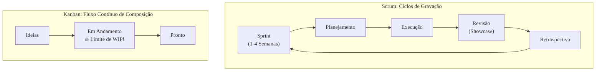

### Olá, futuro(a) aprovado(a)\! Vamos afinar os instrumentos e entender as Metodologias Ágeis para você dar um show na prova do Cebraspe.

Pense no desenvolvimento de software de duas formas: o método tradicional (Cascata) é como uma **orquestra sinfônica**, com uma partitura gigante escrita meses antes, onde ninguém pode mudar uma nota. Já as **Metodologias Ágeis** são como uma **banda de rock na garagem** 🎸: eles têm a ideia da música, mas a criam e a refinam juntos, em sessões de ensaio, adaptando-se à energia do momento.

-----

### \#\#\# Metodologias Ágeis: A Filosofia da Banda de Rock

A agilidade é guiada pelo **Manifesto Ágil**, que tem 4 valores fundamentais:

  * **Indivíduos e interações** mais que processos e ferramentas (A química entre os músicos é mais importante que a marca da guitarra).
  * **Software em funcionamento** mais que documentação abrangente (Uma música gravada e tocável é mais importante que a partitura perfeita).
  * **Colaboração com o cliente** mais que negociação de contratos (Conversar com os fãs e o produtor o tempo todo é melhor que ter um contrato rígido).
  * **Responder a mudanças** mais que seguir um plano (Se o guitarrista cria um riff genial no meio do ensaio, a banda se adapta e muda a música).

> #### Foco Cebraspe (Pontos de Atenção e "Pegadinhas")
>
> >   * **"Mais que" não significa "eliminar":** A banca vai dizer que o ágil abole a documentação e o planejamento. **ERRADO\!** A banda ainda precisa de alguma anotação da melodia e de um plano de ensaio, mas eles **valorizam mais** a música funcionando e a capacidade de improvisar.
> >   * **Agilidade não é Rapidez:** A banca vai dizer que "ágil" é sinônimo de "rápido". **INCORRETO\!** Ágil é sobre **capacidade de adaptação**. A entrega rápida de valor é uma consequência, não o objetivo principal.

-----

### \#\#\# Scrum: Organizando os Ensaios da Banda

O Scrum é o framework mais famoso para organizar os ensaios da banda de rock.

  * **Os Papéis (A Banda):**

      * **Product Owner (PO):** O **produtor musical**. Ele conhece o mercado, representa os fãs e decide qual música tem mais chance de virar hit, ou seja, ele gerencia e prioriza a lista de ideias de músicas (**Product Backlog**).
      * **Scrum Master (SM):** O **roadie / técnico de som experiente**. Ele não toca, não compõe, nem manda na banda. Ele garante que os amplificadores funcionem, remove distrações e ensina a banda a usar o Scrum para ensaiar melhor. É um líder-servidor.
      * **Developers:** Os **músicos**. Eles compõem, tocam e gravam as músicas.

  * **Os Eventos (A Rotina de Ensaios):**

      * **Sprint:** A "semana de gravação", um período fixo (time-box) de até um mês onde a mágica acontece.
      * **Sprint Planning:** A reunião na segunda-feira para decidir: "Quais músicas vamos gravar esta semana?".
      * **Daily Scrum:** A "passagem de som" de 15 minutos, todo dia, **só para os músicos**, para sincronizar o trabalho.
      * **Sprint Review:** O "showcase" de sexta-feira, onde a banda toca o que gravou na semana para o produtor e alguns fãs (stakeholders) para pegar feedback.
      * **Sprint Retrospective:** A conversa da banda depois do showcase, **só entre eles e o Scrum Master**, para discutir: "Como podemos ensaiar melhor na próxima semana?".

  * **Os Artefatos (As Músicas e as Listas):**

      * **Product Backlog:** A lista com todas as ideias de músicas para o álbum.
      * **Sprint Backlog:** As partituras e o plano para as músicas que a banda se comprometeu a gravar *nesta* semana.
      * **Incremento:** As músicas gravadas, mixadas e prontas ao final da semana, que já poderiam tocar no rádio.

> #### Foco Cebraspe (Pontos de Atenção e "Pegadinhas")
>
> >   * **Troca de Papéis:** A banca vai dizer que "o Scrum Master gerencia o Product Backlog" (**ERRADO**, é o PO) ou que "o PO participa da Daily Scrum" (**ERRADO**, a Daily é para os Developers).
> >   * **Cancelamento da Sprint:** Apenas o **Product Owner** (o produtor) tem o poder de cancelar uma semana de gravação se a ideia do álbum mudar drasticamente.
> >   * **Time-boxes:** Os tempos dos eventos são **máximos**. Uma Sprint Review pode durar menos que 4 horas, mas não mais.

-----

### \#\#\# Qualidade de Software: Garantindo que a Música Soe Bem

No ágil, a qualidade é responsabilidade de todos, o tempo todo.

  * **Refatoração:** Regravar um trecho da guitarra com a mesma melodia, mas de um jeito mais limpo e técnico, **sem mudar o que o ouvinte percebe**.
  * **Integração Contínua (CI):** Assim que o baixista grava sua parte, ela é imediatamente mixada com a bateria e a guitarra para garantir que tudo soe bem junto.
  * **Definição de Pronto (DoD):** A checklist da banda: "Uma música só está 'pronta' quando está gravada, mixada, masterizada e com a letra registrada".

> #### Foco Cebraspe (Pontos de Atenção e "Pegadinhas")
>
> >   * **Refatoração não é corrigir bug nem adicionar funcionalidade.** É uma **melhora na estrutura interna** do código (da música) que não altera o comportamento externo.
> >   * A banca vai citar a **ISO/IEC 25010** e confundir suas características. Lembre-se: `Confiabilidade` (funciona sem falhar) é diferente de `Segurança` (protege contra ataques).

-----

### \#\#\# Extreme Programming (XP): O Jeito "Radical" de Ensaiar

XP é uma metodologia ágil com foco extremo em práticas de engenharia.

  * **Práticas Chave:**
      * **Programação em Par:** Dois guitarristas em um só amplificador, um tocando a base (piloto) e o outro pensando no solo (navegador), trocando de lugar a todo momento.
      * **Cliente Presente:** O produtor musical senta no sofá do estúdio **o dia inteiro** com a banda para dar feedback instantâneo.
      * **Ritmo Sustentável:** A banda ensaia 8 horas por dia e vai para casa. Sem virar noites, para não perder a criatividade.
      * **Test-Driven Development (TDD):** Detalhado a seguir.

> #### Foco Cebraspe (Pontos de Atenção e "Pegadinhas")
>
> >   * **Scrum vs. XP:** **Scrum** é um framework de **gerenciamento**. **XP** é uma metodologia de **engenharia**. Scrum não te diz *como* tocar guitarra, apenas *como organizar* os ensaios. XP te dá técnicas específicas, como a programação em par. Eles podem ser usados juntos\!

-----

### \#\#\# Kanban: Gerenciando o Fluxo de Composição

Kanban é um método para visualizar e otimizar o fluxo de trabalho.

  * **Quadro Kanban:** Um quadro na parede do estúdio com colunas: `Ideias de Músicas` → `Escrevendo a Letra` → `Compondo a Melodia` → `Gravando Demo` → `Pronta`.
  * **Limitar o Trabalho em Progresso (WIP):** **O conceito mais importante\!** A banda coloca um limite no quadro: "Máximo de 2 músicas na coluna `Compondo a Melodia`". Isso os força a **terminar** uma música antes de começar outra, evitando ter 10 músicas pela metade e nenhuma pronta.
  * **Fluxo Contínuo:** Diferente do Scrum, não há "semanas de gravação". Assim que uma música fica pronta, a banda imediatamente puxa a próxima ideia da coluna `Ideias`.

> #### Foco Cebraspe (Pontos de Atenção e "Pegadinhas")
>
> >   * **Kanban vs. Scrum:** **Scrum** é iterativo (ciclos fixos, Sprints). **Kanban** é um fluxo contínuo. Scrum tem papéis definidos; Kanban não. Scrum limita o trabalho pela capacidade da Sprint; Kanban limita pelo **WIP**.
> >   * **O objetivo do Kanban é LIMITAR o WIP**, não maximizá-lo. Limitar o trabalho em andamento revela os gargalos e melhora a velocidade geral de entrega.

-----

### \#\#\# Lean e TDD: A Filosofia de Eliminar o Desperdício

  * **Lean (Desenvolvimento Enxuto):** É a filosofia de focar 100% no que gera valor para o ouvinte e **eliminar todo o desperdício**. Desperdício pode ser: um solo de flauta de 10 minutos numa música punk; um defeito na gravação que força todo mundo a regravar; 10 músicas pela metade e nenhuma pronta (excesso de WIP).

  * **TDD (Desenvolvimento Guiado por Testes):** Uma prática de XP e qualidade. É o ciclo "Vermelho-Verde-Refatora".

    1.  **Vermelho:** O compositor escreve um teste que falha. Ex: "Testar se a música tem um refrão cativante". (O teste falha, pois o refrão não existe ainda).
    2.  **Verde:** Ele escreve o refrão **mais simples possível** só para fazer o teste passar.
    3.  **Refatora:** Agora que funciona, ele melhora o refrão, deixa mais poético, mais técnico, garantindo que o teste continue passando.

> #### Foco Cebraspe (Pontos de Atenção e "Pegadinhas")
>
> >   * A banca vai dizer que no TDD você escreve o código e depois o teste. **ERRADO\!** O mantra é: **o teste vem primeiro**.
> >   * TDD não é só uma técnica de teste, é uma técnica de **design**. Ela força o músico a pensar no que a música precisa fazer antes de compô-la, resultando em músicas (código) mais simples e bem estruturadas.

### \#\#\# Mapa Mental: Scrum (Iterativo) vs. Kanban (Fluxo)

### **Classe:** A
### **Conteúdo:** Metodologias Ágeis

---

### **1. Metodologias Ágeis**

> #### **TEORIA-ALVO**
> Metodologias Ágeis constituem uma abordagem iterativa e incremental para o gerenciamento de projetos e desenvolvimento de software. Fundamentam-se no Manifesto para o Desenvolvimento Ágil de Software, que preconiza quatro valores e doze princípios. A abordagem contrapõe-se a modelos tradicionais sequenciais, como o modelo Cascata (Waterfall).
>
> * **Valores do Manifesto Ágil:**
>     * **Indivíduos e interações** mais que processos e ferramentas.
>     * **Software em funcionamento** mais que documentação abrangente.
>     * **Colaboração com o cliente** mais que negociação de contratos.
>     * **Responder a mudanças** mais que seguir um plano.
> * **Características Centrais:**
>     * **Iterativo e Incremental:** O desenvolvimento ocorre em ciclos curtos (iterações), e a cada ciclo, um incremento funcional de software é entregue.
>     * **Adaptativo:** O planejamento é contínuo e flexível, permitindo a incorporação de mudanças de requisitos a qualquer momento.
>     * **Colaborativo:** Há intensa comunicação e colaboração entre a equipe de desenvolvimento e as partes interessadas (stakeholders), especialmente o cliente.
>     * **Equipes Auto-organizáveis e Multifuncionais:** As equipes possuem autonomia para decidir como realizar o trabalho e detêm todas as competências necessárias para entregar o produto.

> #### **FOCO CEBRASPE (Pontos de Atenção e "Pegadinhas")**
> > * **Valor vs. Eliminação:** A banca frequentemente formula itens que interpretam a expressão "mais que" como uma eliminação completa do item à direita. **ERRADO**. O Manifesto Ágil preconiza a *valorização* do item à esquerda, sem, contudo, eliminar a importância do item à direita. Exemplo: agilidade não significa ausência de documentação ou de planejamento.
> > * **Manifesto vs. Frameworks:** É comum a banca atribuir uma prática específica de um framework (e.g., "realizar a Reunião Diária do Scrum") como se fosse um dos quatro valores do Manifesto Ágil. **ERRADO**. As práticas (como as do Scrum ou XP) implementam os valores e princípios, mas não se confundem com eles.
> > * **Distinção Iterativo e Incremental:** Cebraspe pode usar os termos de forma imprecisa. **Iterativo** refere-se à repetição de um processo para refinar um produto. **Incremental** refere-se à construção do produto por partes, adicionando novas funcionalidades a cada ciclo. O desenvolvimento ágil é, por definição, ambos.
> > * **Agilidade como Sinônimo de Rapidez:** A banca pode sugerir que "ágil" significa unicamente "rápido". **INCORRETO**. A agilidade refere-se à capacidade de adaptação e resposta a mudanças, o que pode, como consequência, levar a entregas mais rápidas de valor, mas a velocidade não é o valor primário.

---

### **2. Scrum**

> #### **TEORIA-ALVO**
> O Scrum é um framework leve que ajuda pessoas, equipes e organizações a gerar valor por meio de soluções adaptativas para problemas complexos. É fundamentado no empirismo e no pensamento enxuto (lean thinking). Seus componentes são:
>
> * **Pilares Empíricos:** Transparência, Inspeção e Adaptação.
> * **Time Scrum (Papéis):**
>     * **Product Owner (PO):** Responsável por maximizar o valor do produto resultante do trabalho do Time Scrum. É o único gestor do Product Backlog.
>     * **Scrum Master (SM):** Líder-servidor responsável por garantir que o Scrum seja entendido e aplicado. Remove impedimentos e facilita os eventos.
>     * **Developers:** Profissionais que realizam o trabalho de criar qualquer aspecto de um Incremento utilizável a cada Sprint.
> * **Eventos (Cerimônias):**
>     * **Sprint:** Um contêiner para todos os outros eventos, com duração fixa de um mês ou menos.
>     * **Sprint Planning:** Planejamento do trabalho a ser realizado na Sprint. Time-box de 8 horas para uma Sprint de um mês.
>     * **Daily Scrum:** Reunião diária de 15 minutos para os Developers inspecionarem o progresso em direção à Meta da Sprint.
>     * **Sprint Review:** Inspeção do Incremento e adaptação do Product Backlog. Time-box de 4 horas para uma Sprint de um mês.
>     * **Sprint Retrospective:** Inspeção do processo e planejamento de melhorias. Time-box de 3 horas para uma Sprint de um mês.
> * **Artefatos:**
>     * **Product Backlog:** Lista ordenada e emergente do que é necessário para melhorar o produto. Seu compromisso é a **Meta do Produto**.
>     * **Sprint Backlog:** O plano dos Developers, composto pela Meta da Sprint, os itens do Product Backlog selecionados para a Sprint e o plano para entregar o Incremento. Seu compromisso é a **Meta da Sprint**.
>     * **Incremento:** A soma de todos os itens do Product Backlog concluídos durante a Sprint e o valor dos incrementos de todas as Sprints anteriores. Seu compromisso é a **Definição de Pronto (Definition of Done - DoD)**.

> #### **FOCO CEBRASPE (Pontos de Atenção e "Pegadinhas")**
> > * **Confusão de Papéis e Responsabilidades:** A banca explora exaustivamente a troca de responsabilidades. Exemplo: "O Scrum Master é responsável por gerenciar o Product Backlog" (**ERRADO**, é o PO). "O Product Owner gerencia o trabalho dos Developers na Daily Scrum" (**ERRADO**, a Daily é para os Developers). "O Scrum Master é o gerente de projetos da equipe" (**ERRADO**, é um líder-servidor, não um gerente com poder hierárquico).
> > * **Cancelamento da Sprint:** Um ponto clássico. Apenas o **Product Owner** tem a autoridade para cancelar uma Sprint.
> > * **Time-Boxes:** Os limites de tempo (time-boxes) para os eventos são frequentemente cobrados. A banca pode afirmar que são durações fixas ou sugerir valores incorretos. São durações **máximas**.
> > * **Artefatos vs. Compromissos:** Cebraspe pode desassociar um artefato de seu compromisso correspondente. É crucial memorizar a tríade: Product Backlog -> Meta do Produto; Sprint Backlog -> Meta da Sprint; Incremento -> Definição de Pronto.
> > * **Scrum "Híbrido":** Itens podem descrever um cenário que mistura papéis ou práticas de outras abordagens (e.g., um "Gerente de Projetos" comandando o time Scrum) e perguntar se a prática adere ao Scrum Guide. **ERRADO**. O Scrum é imutável; sua implementação parcial não é Scrum.

---

### **3. Qualidade de Software (em Contexto Ágil)**

> #### **TEORIA-ALVO**
> Em metodologias ágeis, a qualidade de software não é uma fase final, mas uma responsabilidade contínua e integrada ao processo de desenvolvimento (quality built-in). O foco é na prevenção de defeitos em vez de sua detecção tardia. Isso é alcançado por meio de práticas técnicas e da cultura do time.
>
> * **Norma de Qualidade (Referência):** A ISO/IEC 25010 define um modelo de qualidade de produto com oito características principais:
>     1.  **Adequação Funcional:** O grau em que o produto provê funcionalidades que atendem às necessidades declaradas e implícitas.
>     2.  **Eficiência de Desempenho:** Desempenho relativo à quantidade de recursos usados sob condições estabelecidas.
>     3.  **Compatibilidade:** Grau em que um produto pode trocar informações com outros produtos e/ou executar suas funções enquanto compartilha o mesmo ambiente.
>     4.  **Usabilidade:** Facilidade com que usuários especificados podem usar o produto para alcançar metas com eficácia, eficiência e satisfação.
>     5.  **Confiabilidade:** Grau em que o sistema opera conforme especificado sob condições estabelecidas por períodos de tempo especificados.
>     6.  **Segurança:** Grau em que um produto protege informações e dados.
>     7.  **Manutenibilidade:** Eficácia e eficiência com que um produto pode ser modificado por mantenedores.
>     8.  **Portabilidade:** Facilidade com que um produto pode ser transferido de um ambiente para outro.
> * **Práticas Ágeis que Promovem a Qualidade:**
>     * **Refatoração (Refactoring):** Melhorar a estrutura interna do código sem alterar seu comportamento externo.
>     * **Integração Contínua (Continuous Integration - CI):** Integrar o trabalho dos desenvolvedores no repositório principal frequentemente.
>     * **Test-Driven Development (TDD):** Desenvolvimento guiado por testes (detalhado em subtópico próprio).
>     * **Definição de Pronto (DoD):** Um checklist compartilhado e formal do que significa um trabalho estar completo, garantindo um padrão de qualidade consistente.

> #### **FOCO CEBRASPE (Pontos de Atenção e "Pegadinhas")**
> > * **Refatoração vs. Correção/Funcionalidade:** Ponto crítico. A banca afirmará que refatorar é o ato de corrigir bugs ou adicionar novas funcionalidades. **ERRADO**. Refatoração é estritamente a reestruturação do código para melhorar atributos não-funcionais (legibilidade, design, manutenibilidade), mantendo o comportamento funcional idêntico.
> > * **Qualidade como Fase:** Uma pegadinha comum é apresentar a qualidade no contexto ágil como uma fase separada que ocorre após o desenvolvimento, similar ao modelo Cascata. **ERRADO**. A abordagem é "whole-team approach", com a qualidade sendo responsabilidade de todos e construída continuamente.
> > * **ISO/IEC 25010:** A banca pode listar características de qualidade e perguntar se pertencem ao modelo, ou confundir as definições. Exemplo: confundir `Confiabilidade` (disponibilidade, tolerância a falhas) com `Segurança` (confidencialidade, integridade).
> > * **Débito Técnico:** Cebraspe pode abordar o conceito de débito técnico. Trata-se do custo implícito de retrabalho causado pela escolha de uma solução fácil (limitada) agora, em vez de usar uma abordagem melhor que levaria mais tempo. Práticas como refatoração ajudam a "pagar" esse débito.

---

### **Classe:** B
### **Conteúdo:** Extreme Programming (XP)

---

### **4. Extreme Programming (XP)**

> #### **TEORIA-ALVO**
> Extreme Programming (XP) é uma metodologia ágil de desenvolvimento de software cujo objetivo é produzir software de alta qualidade e com maior capacidade de resposta a mudanças nos requisitos. XP enfatiza práticas técnicas de engenharia de software e trabalho em equipe.
>
> * **Valores Fundamentais:** Simplicidade, Comunicação, Feedback, Coragem e Respeito.
> * **Práticas Principais (Agrupadas):**
>     * **Feedback em Escala Fina:**
>         * **Programação em Par (Pair Programming):** Dois desenvolvedores trabalham juntos em uma única estação de trabalho.
>         * **Test-Driven Development (TDD):** Escrita de testes antes do código funcional.
>         * **Cliente Presente (On-site Customer):** Um cliente real ou seu representante está disponível em tempo integral para a equipe.
>     * **Processo Contínuo:**
>         * **Integração Contínua (CI):** Integração e build do sistema várias vezes ao dia.
>         * **Refatoração (Refactoring):** Melhoria contínua do design do código.
>         * **Pequenos Lançamentos (Small Releases):** Lançamento de versões funcionais em ciclos muito curtos.
>     * **Entendimento Compartilhado:**
>         * **Metáfora do Sistema:** Uma história simples que explica o funcionamento geral do sistema.
>         * **Propriedade Coletiva do Código:** Qualquer desenvolvedor pode alterar qualquer parte do código a qualquer momento.
>         * **Padrões de Codificação:** Acordo sobre um conjunto de regras para a escrita do código.
>     * **Bem-estar do Programador:**
>         * **Ritmo Sustentável (Sustainable Pace):** A equipe não trabalha horas extras por longos períodos (e.g., semana de 40 horas).

> #### **FOCO CEBRASPE (Pontos de Atenção e "Pegadinhas")**
> > * **Comparação XP vs. Scrum:** É a principal fonte de questões. **Scrum** é um framework de gerenciamento de processos, enquanto **XP** é uma metodologia de engenharia com práticas técnicas prescritivas. Scrum não exige programação em par ou TDD; XP sim. Scrum tem os papéis de PO e SM; XP foca em papéis como Programador, Cliente, Rastreador (Tracker).
> > * **Programação em Par:** A banca pode descrever a prática de forma incorreta, como "dois desenvolvedores dividindo tarefas" ou "um desenvolvedor sênior ensinando um júnior". **INCORRETO**. A definição estrita é de dois desenvolvedores, um "piloto" (que escreve o código) e um "navegador" (que revisa e pensa estrategicamente), compartilhando uma estação de trabalho e alternando papéis.
> > * **O "Extremo":** O nome "Extreme" deriva da ideia de levar práticas reconhecidamente boas ao extremo. Se testes são bons, testa-se o tempo todo (TDD). Se a revisão de código é boa, ela é feita continuamente (programação em par). Se a integração é boa, integra-se várias vezes ao dia (CI).
> > * **Cliente Presente:** Cebraspe pode flexibilizar o conceito, sugerindo que "relatórios semanais" ou "e-mails" substituem o Cliente Presente. **ERRADO**. A prática exige a presença física ou, no mínimo, disponibilidade síncrona e constante do cliente com a equipe para tirar dúvidas e dar feedback imediato.

---

### **Classe:** B
### **Conteúdo:** Kanban

---

### **5. Kanban**

> #### **TEORIA-ALVO**
> Kanban é um método para gerenciar o fluxo de trabalho, com ênfase na entrega contínua sem sobrecarregar a equipe de desenvolvimento. Originado no Sistema Toyota de Produção, seu objetivo é visualizar o trabalho, limitar o trabalho em andamento (Work in Progress - WIP) e maximizar a eficiência (ou fluxo). Não é uma metodologia de desenvolvimento de software, mas um método de gestão aplicável a um processo existente.
>
> * **Princípios Fundamentais:**
>     * **Comece com o que você faz agora:** Kanban não prescreve um processo; ele é aplicado sobre o fluxo de trabalho atual.
>     * **Concordar em buscar mudanças incrementais e evolucionárias:** Promove pequenas melhorias contínuas no processo existente.
>     * **Respeitar o processo atual, papéis e responsabilidades:** Evita mudanças radicais que possam gerar medo ou resistência.
> * **Práticas Gerais:**
>     1.  **Visualizar o Fluxo de Trabalho:** Utilização de um quadro (Quadro Kanban) com colunas que representam as etapas do processo.
>     2.  **Limitar o Trabalho em Progresso (WIP):** Definição de um limite máximo de itens que podem estar em cada etapa do fluxo de trabalho.
>     3.  **Gerenciar o Fluxo:** Monitorar, medir e reportar o fluxo de trabalho para otimizá-lo, identificando e resolvendo gargalos.
>     4.  **Tornar as Políticas do Processo Explícitas:** Todos devem entender as regras do processo (e.g., o que significa "pronto" para uma etapa).
>     5.  **Implementar Ciclos de Feedback (Cadências):** Reuniões regulares para revisão da estratégia, operações e entrega.
>     6.  **Melhorar Colaborativamente, Evoluir Experimentalmente:** Utilizar modelos e o método científico para promover melhorias.

> #### **FOCO CEBRASPE (Pontos de Atenção e "Pegadinhas")**
> > * **Kanban vs. Scrum:** A distinção é um tópico recorrente. **Kanban** é um sistema de fluxo contínuo baseado em eventos; **Scrum** é baseado em iterações de tempo fixo (Sprints). Kanban não prescreve papéis; Scrum sim (PO, SM, Devs). Kanban limita o trabalho através de limites de **WIP**; Scrum limita o trabalho pela capacidade da equipe em uma **Sprint**. Kanban é adaptativo a qualquer momento; Scrum favorece a estabilidade dentro de uma Sprint.
> > * **Limite de WIP:** Este é o conceito central. A banca pode afirmar que o objetivo do Kanban é maximizar o WIP para aumentar a produção. **ERRADO**. O objetivo é **limitar** o WIP para reduzir a troca de contexto, expor gargalos e melhorar o fluxo geral. Limitar o WIP força a equipe a finalizar tarefas antes de iniciar novas.
> > * **Métricas de Fluxo:** Cebraspe pode cobrar o conhecimento sobre as métricas chave do Kanban: **Lead Time** (tempo total desde a solicitação do cliente até a entrega) e **Cycle Time** (tempo de trabalho ativo em um item). A banca pode confundir os dois conceitos.
> > * **Kanban não é um Framework de Desenvolvimento:** É um erro comum afirmar que Kanban é uma metodologia completa como Scrum ou XP. **INCORRETO**. É um método de gestão do fluxo de trabalho que pode ser usado em conjunto com outras metodologias ou sobre um processo já existente.

---

### **Classe:** B
### **Conteúdo:** Lean Development e TDD

---

### **6. Lean Development e TDD**

> #### **TEORIA-ALVO (Lean Software Development)**
> Inspirado no Sistema Toyota de Produção, o Desenvolvimento de Software Lean (Enxuto) foca em maximizar o valor para o cliente, eliminando desperdícios.
>
> * **Sete Princípios (Mary e Tom Poppendieck):**
>     1.  **Eliminar Desperdício:** Remover qualquer coisa que não agregue valor ao cliente.
>     2.  **Amplificar o Aprendizado:** Usar ciclos curtos, feedback e experimentação.
>     3.  **Decidir o Mais Tarde Possível:** Tomar decisões irreversíveis no último momento responsável.
>     4.  **Entregar o Mais Rápido Possível:** Entregar valor ao cliente em pequenos lotes e rapidamente.
>     5.  **Empoderar a Equipe:** Dar à equipe a autoridade e o suporte para que ela possa se organizar e tomar decisões.
>     6.  **Construir Qualidade Integralmente:** A qualidade é embutida no processo desde o início.
>     7.  **Otimizar o Todo:** Focar em otimizar o fluxo de valor completo, não apenas partes individuais.
> * **Sete Desperdícios (*Muda*) em Software:** Código ou funcionalidades extras; Defeitos; Trabalho parcialmente concluído (WIP); Troca de contexto; Esperas; Movimentação (de informações, de pessoas); Processos desnecessários.
>
> #### **TEORIA-ALVO (Test-Driven Development - TDD)**
> TDD é uma prática de desenvolvimento de software que combina a escrita de testes, a escrita de código e a refatoração. O desenvolvimento é guiado por testes automatizados escritos *antes* do código funcional.
>
> * **Ciclo do TDD: "Red-Green-Refactor"**
>     1.  **Red (Vermelho):** Escrever um teste automatizado para uma nova funcionalidade. O teste deve falhar inicialmente, pois a funcionalidade ainda não existe.
>     2.  **Green (Verde):** Escrever o código de produção **mínimo** necessário para que o teste passe.
>     3.  **Refactor (Refatorar):** Melhorar a estrutura do código escrito (eliminar duplicação, melhorar a clareza) sem alterar sua funcionalidade, garantindo que todos os testes continuem a passar.

> #### **FOCO CEBRASPE (Pontos de Atenção e "Pegadinhas")**
> > * **Lean: Identificação de Desperdício:** A principal forma de cobrança sobre Lean é a identificação dos sete tipos de desperdício em cenários práticos ou a correta associação de seus nomes e significados.
> > * **TDD: Ordem do Ciclo:** A banca frequentemente tentará inverter a ordem do ciclo Red-Green-Refactor. A afirmação "No TDD, o desenvolvedor primeiro implementa a funcionalidade e, em seguida, cria um teste para validá-la" é **ERRADA**. O teste é criado *antes* do código de produção.
> > * **TDD como Técnica de Teste vs. Design:** Cebraspe pode classificar TDD unicamente como uma "técnica de teste". **INCOMPLETO/ERRADO**. Embora produza uma suíte de testes de regressão como subproduto, TDD é fundamentalmente uma **técnica de design de software**. Os testes guiam o design do código de forma incremental, resultando em um código mais simples, modular e desacoplado.
> > * **TDD vs. BDD (Behavior-Driven Development):** Pode haver confusão. TDD é uma prática mais técnica, focada nas unidades de código. BDD (Desenvolvimento Guiado por Comportamento) é uma evolução do TDD que foca no comportamento do sistema sob a perspectiva do negócio, utilizando uma linguagem semi-natural (e.g., Gherkin: `Dado-Quando-Então`). BDD descreve o comportamento; TDD implementa as unidades que geram esse comportamento.
