### Olá, futuro(a) aprovado(a)\! Vamos inspecionar os Conceitos de Testes para que você passe no controle de qualidade do Cebraspe.

Pense em teste de software como o **processo de controle de qualidade de um carro novo** 🚗, desde a planta do motor até o test-drive final com o cliente.

-----

### \#\#\# Conceitos Básicos: A Linguagem da Oficina

Para encontrar problemas, primeiro precisamos saber nomeá-los.

  * **A Cadeia do Desastre:**

    1.  **Erro:** Um engenheiro, cansado, desenha o parafuso do motor com a medida errada. (Ação humana).
    2.  **Defeito (Bug):** O parafuso com a medida errada que foi instalado no motor. (O problema no produto).
    3.  **Falha:** Você liga o carro e o motor quebra. (A manifestação externa do defeito).

  * **Verificação vs. Validação:**

      * **Verificação:** "Estamos construindo o carro **corretamente**?" (A montagem seguiu a planta e as especificações?). É uma checagem de conformidade.
      * **Validação:** "Estamos construindo o carro **certo**?" (O carro atende às necessidades da família que vai comprá-lo?). É uma checagem de adequação ao uso.

  * **Os 7 Princípios do Teste (A Sabedoria do Inspetor-Chefe):**

    1.  **Teste mostra a presença de defeitos:** A inspeção pode provar que o carro tem defeitos, mas nunca pode garantir que ele é 100% perfeito.
    2.  **Teste exaustivo é impossível:** É impossível testar o carro em todas as estradas do mundo, com todos os climas e motoristas possíveis.
    3.  **Teste antecipado:** É muito mais barato corrigir um erro na planta do motor do que fazer um recall de 10.000 carros.
    4.  **Defeitos se agrupam:** Geralmente, a maioria dos problemas se concentra em algumas partes específicas do carro, como o sistema elétrico.
    5.  **Paradoxo do Pesticida:** Se você testar o carro sempre na mesma pista, com o tempo, esse teste não encontrará novos defeitos. É preciso variar os testes.
    6.  **Teste depende do contexto:** Testar um carro de Fórmula 1 é diferente de testar um carro popular.
    7.  **Falácia da ausência de erros:** Não adianta o carro não ter nenhum defeito mecânico se ele for horrível de dirigir ou não couber a família do cliente.

> #### Foco Cebraspe (Pontos de Atenção e "Pegadinhas")
>
> >   * **Causalidade:** A banca vai dizer que todo defeito gera uma falha. **ERRADO\!** Um parafuso errado (defeito) em uma parte pouco usada do carro pode nunca quebrar (gerar uma falha).
> >   * **Verificação vs. Validação:** A pegadinha clássica\! **Verificação = seguir a planta**. **Validação = agradar o cliente**. Revisar um documento é verificação. Fazer um test-drive é validação.
> >   * A banca vai usar os princípios para te enganar. "Com testes suficientes, podemos garantir um software livre de defeitos". **ERRADO\!** (Viola o Princípio 1).

-----

### \#\#\# Tipos de Testes: As Etapas e os Focos da Inspeção

A inspeção do carro acontece em vários estágios (níveis) e com vários objetivos (tipos).

  * **Níveis de Teste (Quando testamos):**

      * **Teste de Unidade:** Testar só o motor, na bancada, antes de instalá-lo no chassi.
      * **Teste de Integração:** Testar se o motor se encaixa e funciona bem com a caixa de câmbio.
      * **Teste de Sistema:** Testar o carro completo, já montado, na pista de testes da fábrica.
      * **Teste de Aceitação:** O cliente faz o test-drive final para decidir se leva o carro para casa.
          * **Teste Alfa:** O cliente faz o test-drive na pista da fábrica, com os engenheiros observando.
          * **Teste Beta:** A fábrica empresta o carro para o cliente usar no seu dia a dia por uma semana e dar seu feedback.

  * **Tipos de Teste (O que e como testamos):**

      * **Caixa-Branca:** O inspetor tem a planta completa do motor e verifica cada peça interna.
      * **Caixa-Preta:** O inspetor não entende de mecânica. Ele só entra no carro, gira a chave, acelera e freia para ver se o carro funciona, sem abrir o capô.
      * **Teste de Performance:** Colocar o carro no limite para ver se ele aguenta (teste de estresse).
      * **Teste de Regressão:** Depois de trocar os pneus (uma mudança), você liga o rádio, o ar-condicionado e os faróis novamente para garantir que a troca dos pneus não quebrou algo que já funcionava.

> #### Foco Cebraspe (Pontos de Atenção e "Pegadinhas")
>
> >   * **Alfa vs. Beta:** A diferença é o **ambiente** e o **controle**. **Alfa** = na fábrica, controlado. **Beta** = na rua, com o cliente, sem controle.
> >   * **Stubs e Drivers:** Para testar a integração do rádio (nível superior) sem ter os alto-falantes (nível inferior), usamos um fone de ouvido no lugar (**Stub**). Para testar só os alto-falantes sem o rádio, usamos um MP3 player para gerar o som (**Driver**). A banca vai trocar esses nomes.

-----

### \#\#\# Testes Automatizados: Robôs Inspetores

  * **O Conceito:** Usar robôs para fazer a inspeção. Um robô pode abrir e fechar a porta do carro um milhão de vezes para testar a durabilidade, algo que seria impossível para um humano.
  * **Pirâmide de Automação de Testes:** A estratégia de como usar os robôs.
      * **BASE (Larga): Testes de Unidade.** Muitos e muitos testes de robôs para cada parafuso e pecinha do motor. São rápidos e baratos.
      * **MEIO: Testes de Integração.** Menos testes, para checar se as peças grandes se conectam.
      * **TOPO (Estreito): Testes de UI.** Pouquíssimos testes com um robô-piloto que "dirige" o carro inteiro. São lentos, caros e quebram fácil.

> #### Foco Cebraspe (Pontos de Atenção e "Pegadinhas")
>
> >   * **Automação substitui tudo?** **ERRADO\!** Robôs são ótimos para tarefas repetitivas, mas péssimos para avaliar a "sensação de dirigir" ou se o design do painel é agradável. Testes de usabilidade e exploratórios ainda precisam de humanos.
> >   * A banca vai descrever uma estratégia que foca em testes de UI (o "cone de sorvete"). **ERRADO\!** É um anti-padrão. A boa prática é focar na base da pirâmide.

-----

### \#\#\# Testes Manuais: A Percepção do Inspetor Humano

  * **O Conceito:** Usar a inteligência, intuição e experiência de um inspetor humano.
  * **Técnicas Principais:**
      * **Teste Exploratório:** Um piloto de testes experiente pega o carro sem roteiro e vai para a pista "explorar" os limites do carro, descobrindo problemas que ninguém pensou em testar.
      * **Teste de Usabilidade:** Colocar uma pessoa comum para dirigir o carro e ver se ela consegue ligar o rádio sem precisar ler o manual.
      * **Teste Ad-hoc ("Teste do Macaco"):** O inspetor entra no carro e começa a apertar todos os botões ao mesmo tempo, de forma aleatória, só para ver se o sistema trava.

> #### Foco Cebraspe (Pontos de Atenção e "Pegadinhas")
>
> >   * **Exploratório vs. Ad-hoc:** Não são a mesma coisa. **Ad-hoc** é aleatório e sem anotações. **Exploratório** é sistemático; o piloto aprende sobre o carro enquanto testa e anota suas descobertas para guiar os próximos passos.

-----

### \#\#\# Análise Estática: Inspecionando a Planta Baixa

  * **O Conceito:** Usar um software especialista para analisar a **planta do motor (o código-fonte) antes mesmo de construir a primeira peça**. O motor **não é ligado** (o código não é executado).
  * **SonarQube (O Software Inspetor de Plantas):** Ele lê a planta e aponta problemas:
      * **Bugs:** "Este parafuso está com a medida errada na planta. Vai quebrar."
      * **Vulnerabilidades:** "A fiação do alarme está desenhada de forma exposta. Um ladrão pode cortá-la."
      * **Code Smells (Maus Cheiros):** "Esta parte da planta está tão confusa que nenhum mecânico vai conseguir fazer a manutenção depois. Não é um erro, mas é um 'mau cheiro' de problema futuro."

> #### Foco Cebraspe (Pontos de Atenção e "Pegadinhas")
>
> >   * **Análise Estática vs. Dinâmica:** A banca vai dizer que o SonarQube liga o motor para achar defeitos. **ERRADO\!** Análise **estática** = analisar a planta. Análise **dinâmica** = ligar o motor e ver o que acontece.
> >   * **Bug vs. Code Smell:** **Bug** = erro que fará o carro falhar. **Code Smell** = um design ruim na planta que vai dificultar a manutenção do carro no futuro.
> >   * **Cobertura de Código:** O SonarQube mostra qual percentual do motor foi ligado durante os testes de unidade, mas ele **não executa** esses testes. Ele apenas **importa e exibe** o relatório gerado por outra ferramenta.

### \#\#\# Mapa Mental: O Modelo V de Testes

```mermaid
%%{init: {"theme": "toko-midnight", "themeVariables": { "fontFamily": "lexend"}}}%%
graph TD
    subgraph "Processo de Desenvolvimento (Construindo o Carro)"
        A["Definição dos Requisitos<br>(O sonho do cliente)"] --> B["Design do Sistema<br>(Planta geral do carro)"];
        B --> C["Design dos Componentes<br>(Planta do motor)"];
        C --> D["Codificação<br>(Construir as peças)"];
    end

    subgraph "Processo de Testes (Inspecionando o Carro)"
        H["Teste de Aceitação<br>Valida ↔ A"] --> G["Teste de Sistema<br>Valida ↔ B"];
        G --> F["Teste de Integração<br>Valida ↔ C"];
        F --> E["Teste de Unidade<br>Valida ↔ D"];
    end

    A -- "Verificação (Análise Estática)" --> B
    B -- "Verificação" --> C
    C -- "Verificação" --> D
    
    style H fill:#313149,stroke:#bb9af7
    style G fill:#313149,stroke:#bb9af7
    style F fill:#313149,stroke:#bb9af7
    style E fill:#313149,stroke:#bb9af7

    D -- Ativa --> E
```

### **Classe:** A
### **Conteúdo:** Testes: Conceitos básicos

---

### **1. Conceitos Básicos de Testes**

> #### **TEORIA-ALVO**
> Teste de software é o processo de avaliação de um produto de software para determinar se ele atende aos requisitos especificados e para identificar defeitos. Trata-se de uma atividade de controle de qualidade fundamental, guiada por princípios estabelecidos.
>
> * **Conceitos Fundamentais:**
>     * **Erro:** Uma ação humana que produz um resultado incorreto.
>     * **Defeito (Bug, Falha):** Uma imperfeição ou deficiência em um produto de trabalho onde ele não atende aos seus requisitos ou especificações. É o resultado de um erro.
>     * **Falha (Failure):** A manifestação externa de um defeito, ou seja, um desvio do comportamento esperado do sistema quando este é executado.
> * **Verificação vs. Validação:**
>     * **Verificação:** Processo que busca garantir que o software atende à sua especificação. Foco na consistência, completude e correção dos artefatos. Responde à pergunta: "Estamos construindo o produto corretamente?". Geralmente envolve atividades estáticas (revisões, inspeções).
>     * **Validação:** Processo que busca garantir que o software atende às necessidades e expectativas do cliente/usuário. Responde à pergunta: "Estamos construindo o produto certo?". Envolve a execução do software (testes dinâmicos).
> * **Sete Princípios do Teste (Base ISTQB):**
>     1.  **Teste demonstra a presença de defeitos, não a sua ausência.**
>     2.  **Teste exaustivo é impossível.**
>     3.  **Teste antecipado (early testing) economiza tempo e dinheiro.**
>     4.  **Defeitos agrupam-se (defect clustering).** A maioria dos defeitos tende a se concentrar em um pequeno número de módulos.
>     5.  **O Paradoxo do Pesticida.** Se os mesmos testes são repetidos continuamente, eles se tornam ineficazes para encontrar novos defeitos.
>     6.  **Teste depende do contexto.** O tipo e o rigor do teste variam conforme o sistema (e.g., e-commerce vs. software de controle de voo).
>     7.  **A falácia da ausência de erros.** Encontrar e corrigir defeitos não adianta se o sistema construído for inutilizável ou não atender às necessidades do usuário.

> #### **FOCO CEBRASPE (Pontos de Atenção e "Pegadinhas")**
> > * **Cadeia Causal (Erro -> Defeito -> Falha):** A banca frequentemente explora a relação de causalidade. Um item pode afirmar que todo defeito resulta em uma falha. **ERRADO**. Um defeito pode permanecer latente no código e nunca ser executado, ou sua execução pode não levar a um comportamento incorreto observável.
> > * **Verificação vs. Validação:** A troca dos conceitos é uma pegadinha clássica. **Verificação** está ligada à especificação e à análise estática. **Validação** está ligada à necessidade do usuário e à análise dinâmica (execução). A banca pode afirmar que "a execução de casos de teste para checar os requisitos é uma atividade de verificação". **ERRADO**. É validação.
> > * **Princípios do Teste (Interpretações Incorretas):**
> >     * Afirmar que, com testes suficientes, é possível garantir que um software não tem defeitos. **ERRADO** (viola o Princípio 1).
> >     * Sugerir que testar todas as combinações de entradas e pré-condições é uma estratégia viável para sistemas complexos. **ERRADO** (viola o Princípio 2).
> >     * Ignorar o Paradoxo do Pesticida e propor que a repetição dos mesmos casos de teste de regressão é suficiente para garantir a qualidade continuamente. **ERRADO** (viola o Princípio 5).

---

### **Classe:** A
### **Conteúdo:** Tipos de Testes

---

### **2. Tipos de Testes**

> #### **TEORIA-ALVO**
> Os testes de software são classificados em diferentes níveis, que se referem a etapas do ciclo de desenvolvimento, e em diferentes tipos, que se referem a objetivos específicos do teste.
>
> * **Níveis de Teste (Quando testar):**
>     * **Teste de Unidade:** Foco na menor parte testável do software (e.g., um método, função ou classe), de forma isolada. Geralmente realizado por desenvolvedores, utilizando técnicas de caixa-branca.
>     * **Teste de Integração:** Verifica a interface e a interação entre componentes ou sistemas integrados. Abordagens comuns: Big Bang, Top-Down (usa *stubs*), Bottom-Up (usa *drivers*), e Incremental (Sanduíche).
>     * **Teste de Sistema:** Avalia o sistema como um todo, em um ambiente similar ao de produção, verificando sua conformidade com os requisitos funcionais e não-funcionais especificados. Executado sob a perspectiva do usuário (caixa-preta).
>     * **Teste de Aceitação:** Valida se o sistema está pronto para implantação e atende aos critérios de aceitação definidos pelo cliente ou usuário.
>         * **Teste Alfa:** Realizado no ambiente do desenvolvedor, por um grupo de usuários internos ou "amigos", sob o controle da equipe de desenvolvimento.
>         * **Teste Beta:** Realizado no ambiente do cliente/usuário final, sem o controle direto da equipe de desenvolvimento, para obter feedback do uso real.
>
> * **Tipos de Teste (O que testar):**
>     * **Testes Funcionais:** Verificam "o que" o sistema faz. Baseiam-se no comportamento especificado. Incluem:
>         * **Técnica de Caixa-Branca (Estrutural):** Baseada no conhecimento da estrutura interna do código. O objetivo é a cobertura de código (e.g., cobertura de comandos, desvios, condições).
>         * **Técnica de Caixa-Preta (Comportamental):** Baseada na especificação, sem conhecimento da implementação. Técnicas incluem Particionamento de Equivalência, Análise de Valor Limite e Tabelas de Decisão.
>     * **Testes Não-Funcionais:** Verificam "como" o sistema funciona. Avaliam características de qualidade, como:
>         * **Teste de Performance:** Avalia o desempenho sob carga (teste de carga), em condições extremas (teste de estresse), e com grandes volumes de dados (teste de volume).
>         * **Teste de Usabilidade:** Avalia a facilidade de uso do sistema sob a perspectiva do usuário.
>         * **Teste de Segurança:** Identifica vulnerabilidades e fraquezas do sistema a ataques.
>     * **Teste de Regressão:** Repetição de testes após uma modificação no software, para garantir que as alterações não introduziram novos defeitos em funcionalidades existentes.

> #### **FOCO CEBRASPE (Pontos de Atenção e "Pegadinhas")**
> > * **Confusão entre Níveis e Tipos:** A banca pode afirmar que "teste de unidade" é um tipo de teste funcional, ou que "teste de sistema" é um tipo de teste de caixa-preta. **IMPRECISO/ERRADO**. Níveis (unidade, integração, sistema) são fases onde diferentes tipos de teste (funcional, performance) podem ser aplicados, utilizando diversas técnicas (caixa-preta, caixa-branca).
> > * **Distinção Alfa vs. Beta:** A principal diferença, e alvo de questões, é o **ambiente** e o **nível de controle**. Alfa = ambiente do desenvolvedor, controlado. Beta = ambiente do cliente, não controlado.
> > * **Stubs e Drivers:** A banca explora a necessidade de componentes auxiliares no teste de integração. **Stubs** simulam módulos de nível inferior (usados no Top-Down). **Drivers** simulam módulos de nível superior (usados no Bottom-Up). A troca desses conceitos é uma pegadinha comum.
> > * **Técnicas de Caixa-Preta:** Questões frequentemente apresentam um requisito (e.g., "campo aceita valores de 1 a 100") e pedem a definição dos casos de teste segundo a Análise de Valor Limite. Os valores a serem testados são os limites (1, 100), os valores imediatamente adjacentes (0, 2, 99, 101) e um valor válido qualquer. A banca pode omitir os valores adjacentes ou incluir apenas valores válidos.

---

### **Classe:** A
### **Conteúdo:** Testes Automatizados

---

### **3. Testes Automatizados**

> #### **TEORIA-ALVO**
> A automação de testes consiste no uso de ferramentas e scripts para executar casos de teste, comparar os resultados obtidos com os esperados e gerar relatórios. O objetivo principal é aumentar a eficiência, a repetibilidade e a cobertura dos testes, especialmente os de regressão.
>
> * **Vantagens:**
>     * **Velocidade e Eficiência:** Scripts executam testes muito mais rápido que humanos.
>     * **Repetibilidade:** Garante que o teste seja executado exatamente da mesma maneira todas as vezes.
>     * **Confiabilidade:** Elimina o risco de erro humano na execução dos testes.
>     * **Execução Não Supervisionada:** Testes podem ser executados durante a noite ou como parte de um pipeline de Integração Contínua/Entrega Contínua (CI/CD).
>     * **Viabilização de Testes de Regressão Abrangentes:** Torna prático re-testar o sistema inteiro após cada mudança.
> * **Pirâmide de Automação de Testes (Mike Cohn):** Modelo estratégico que orienta o esforço de automação.
>     * **Base (Larga): Testes de Unidade.** Rápidos, baratos, estáveis e numerosos. Devem formar a maior parte da suíte de testes.
>     * **Meio: Testes de Serviço/Integração.** Testam a comunicação entre componentes (e.g., APIs), sem a necessidade da UI.
>     * **Topo (Estreito): Testes de Interface de Usuário (UI) / End-to-End.** Lentos, caros e frágeis (quebram facilmente com mudanças na UI). Devem ser em menor número.
> * **Principais Ferramentas (Exemplos):** Selenium (automação de navegadores web), Cypress (automação web), JUnit/TestNG (testes de unidade em Java), Postman/REST Assured (testes de API), JMeter (testes de performance).

> #### **FOCO CEBRASPE (Pontos de Atenção e "Pegadinhas")**
> > * **Automação como Substituta Total:** A banca pode sugerir que a automação de testes elimina a necessidade de testes manuais. **ERRADO**. Testes que requerem intuição, percepção visual e subjetividade, como testes exploratórios e de usabilidade, são mais adequados para execução manual. Automação e teste manual são complementares.
> > * **Inversão da Pirâmide de Testes:** Uma pegadinha clássica é descrever uma estratégia de automação focada primariamente em testes de UI (conhecida como "cone de sorvete" - um anti-padrão). **ERRADO**. A estratégia recomendada pela pirâmide é focar a maior parte do esforço na base (testes de unidade).
> > * **Custo da Automação:** É incorreto afirmar que a automação sempre reduz custos. Embora possa haver um ROI (Retorno sobre Investimento) positivo a longo prazo, existe um custo inicial significativo com ferramentas, treinamento e, principalmente, com a **manutenção** dos scripts de teste, que precisam ser atualizados à medida que o sistema evolui.
> > * **O que Automatizar:** Nem todo teste é um bom candidato à automação. Testes executados frequentemente, testes de regressão, testes que envolvem múltiplas configurações de dados e testes de performance são os principais candidatos. Testes que são executados poucas vezes ou cujos requisitos mudam constantemente podem ter um custo de automação maior que o benefício.

---

### **Classe:** B
### **Conteúdo:** Testes Manuais

---

### **4. Testes Manuais**

> #### **TEORIA-ALVO**
> Teste manual é o processo de teste de software em que um testador executa os casos de teste interagindo diretamente com a aplicação, sem o uso de ferramentas de automação. Este método depende da cognição, intuição e experiência do testador para descobrir defeitos.
>
> * **Aplicações Principais:**
>     * **Teste Exploratório:** Abordagem em que o aprendizado, o design dos casos de teste e a execução do teste são atividades simultâneas. O testador "explora" a aplicação para entender seu funcionamento e encontrar defeitos que não seriam capturados por testes roteirizados. Não é aleatório; pode ser guiado por "cartas de teste" (test charters).
>     * **Teste de Usabilidade:** Avalia a experiência do usuário (UX), incluindo a facilidade de aprendizado, eficiência de uso e satisfação geral, aspectos que requerem julgamento humano.
>     * **Teste Ad-hoc:** Teste informal e não estruturado, sem planejamento ou documentação, baseado na intuição e experiência do testador para tentar "quebrar" o sistema. Frequentemente chamado de "teste do macaco".
> * **Vantagens:**
>     * **Custo Inicial Baixo:** Não requer investimento em ferramentas ou programação de scripts.
>     * **Feedback Qualitativo:** Fornece insights sobre a experiência do usuário que são difíceis de quantificar.
>     * **Flexibilidade:** Ideal para sistemas com requisitos que mudam rapidamente, onde a manutenção de scripts automatizados seria custosa.
>     * **Detecção de Defeitos Inesperados:** A percepção humana pode identificar problemas de layout, fluxo e usabilidade que um script ignoraria.

> #### **FOCO CEBRASPE (Pontos de Atenção e "Pegadinhas")**
> > * **Teste Exploratório vs. Teste Ad-hoc:** Cebraspe pode tratar os termos como sinônimos. **INCORRETO**. Embora ambos sejam não-roteirizados, o **Teste Exploratório** é uma abordagem sistemática e estruturada, focada no aprendizado e que envolve documentação (e.g., anotações, cartas de teste). O **Teste Ad-hoc** é completamente informal, não-estruturado e seu único objetivo é encontrar defeitos rapidamente.
> > * **Obsolescência do Teste Manual:** Uma afirmação recorrente é que, em ambientes ágeis e de DevOps, o teste manual tornou-se obsoleto. **ERRADO**. O teste manual continua sendo essencial e complementar à automação, especialmente para as atividades que mais se beneficiam da criatividade e do raciocínio crítico humano.
> > * **Teste Manual vs. Roteiro:** É incorreto associar teste manual exclusivamente à ausência de um roteiro. Testes manuais podem ser rigorosamente roteirizados (seguindo um script de teste passo a passo) ou não-roteirizados (como no caso do teste exploratório).

---

### **Classe:** C
### **Conteúdo:** Análise Estática (SonarQube)

---

### **5. Análise Estática (SonarQube)**

> #### **TEORIA-ALVO**
> A análise estática de código é uma técnica de teste de caixa-branca que examina o código-fonte (ou código compilado) sem executar o programa. Seu objetivo é identificar potenciais defeitos, vulnerabilidades de segurança, violações de padrões de codificação e código complexo ou de difícil manutenção.
>
> * **Objetivos da Análise Estática:**
>     * **Encontrar Defeitos Precocemente:** Identifica problemas antes da fase de teste dinâmico.
>     * **Impor Padrões de Qualidade:** Garante que o código siga as convenções e boas práticas da equipe ou da linguagem.
>     * **Identificar Riscos de Segurança:** Detecta padrões de código que representam vulnerabilidades conhecidas (e.g., SQL Injection, Cross-Site Scripting).
>     * **Medir a Qualidade do Código:** Calcula métricas como complexidade ciclomática, duplicação de código e dívida técnica.
> * **SonarQube:**
>     * É uma plataforma de código aberto para inspeção contínua da qualidade do código-fonte. Integra-se a ambientes de CI/CD para analisar o código a cada nova alteração.
>     * **Principais Conceitos e Métricas no SonarQube:**
>         * **Bugs:** Erros de programação que provavelmente resultarão em falhas no comportamento do sistema.
>         * **Vulnerabilidades:** Pontos no código que podem ser explorados por invasores.
>         * **Code Smells (Maus Cheiros no Código):** Problemas de manutenibilidade. Não são bugs, mas indicam um design ruim que pode levar a problemas futuros.
>         * **Dívida Técnica (Technical Debt):** Medida do esforço (em tempo) necessário para corrigir todos os code smells.
>         * **Cobertura de Código (Code Coverage):** Percentual do código-fonte que é executado pelos testes de unidade. (Nota: esta métrica é importada de ferramentas de teste dinâmico, não calculada estaticamente pelo SonarQube).
>         * **Quality Gate (Portão de Qualidade):** Conjunto de condições que o código deve atender para ser considerado apto para produção (e.g., "cobertura de testes > 80%", "nenhum bug crítico novo").

> #### **FOCO CEBRASPE (Pontos de Atenção e "Pegadinhas")**
> > * **Análise Estática vs. Análise Dinâmica:** A pegadinha fundamental é confundir os dois conceitos. A banca pode afirmar que o SonarQube executa o software para encontrar defeitos. **ERRADO**. A análise estática ocorre **sem a execução do programa**. Testes funcionais, de unidade ou de performance são formas de análise dinâmica.
> > * **Bug vs. Code Smell:** É crucial entender a diferença. Um **bug** é um erro funcional. Um **code smell** é um problema estrutural que afeta a manutenção. A banca pode classificar um "método com 300 linhas" como um bug. **INCORRETO**. Trata-se de um clássico code smell ("Long Method").
> > * **Falsos Positivos e Falsos Negativos:** A banca pode apresentar a análise estática como uma técnica infalível. **ERRADO**. Ferramentas como o SonarQube são suscetíveis a **falsos positivos** (reportar um problema que não existe) e **falsos negativos** (não reportar um problema que existe). A avaliação de um desenvolvedor ainda é necessária.
> > * **Cobertura de Código:** Embora o SonarQube exiba a métrica de cobertura, ele não a gera. Ele **importa** os relatórios de ferramentas de teste (como JaCoCo, Cobertura) que rodam durante a análise dinâmica (execução dos testes). Afirmar que "o SonarQube calcula a cobertura de testes através da análise estática" é **ERRADO**.
