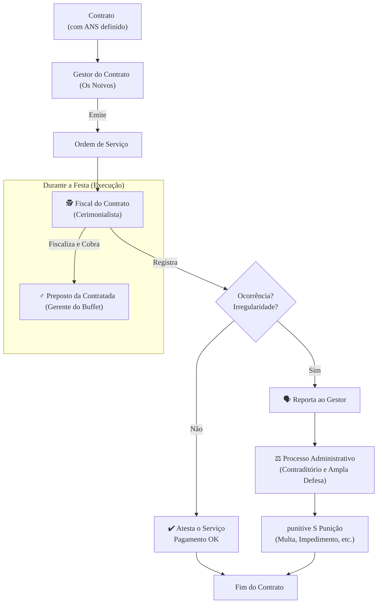

### Olá, futuro(a) aprovado(a)\! Vamos simplificar a complexidade dos Contratos de TI no setor público para você acertar em cheio na prova do Cebraspe.

Pense na elaboração de um contrato de TI como **organizar a festa de um casamento dos sonhos** 💍. O órgão público são os noivos (o contratante), e a empresa de TI é o buffet (a contratada). O contrato é o que garante que a festa sairá perfeita.

-----

### \#\#\# Nível de Serviço e Remuneração: O Cardápio e a Forma de Pagamento

Esta é a parte mais importante do contrato do buffet.

  * **Acordo de Nível de Serviço (ANS ou SLA):**

      * É o **cardápio detalhado e técnico** da festa. Ele descreve com precisão e em números o que se espera do buffet. É a principal ferramenta para o cerimonialista fiscalizar o serviço.
      * **Componentes Essenciais:**
          * **Indicadores:** As métricas. Ex: "Temperatura mínima dos salgados", "Número de garçons por convidado".
          * **Metas:** Os valores a serem alcançados. Ex: "Salgados servidos a 60°C", "1 garçom para cada 10 convidados".
          * **Faixas de Ajuste (Glosas):** As regras para desconto. Ex: "Se os salgados forem servidos entre 50°C e 59°C, o pagamento terá 10% de desconto".
          * **Metodologia de Aferição:** Como a temperatura dos salgados será medida (com qual termômetro, em que momento).

  * **Modelo de Remuneração Vinculado a Resultados:**

      * A regra de ouro é: os noivos pagam pela **festa entregue**, não pelos cozinheiros presentes.
      * **Modelo VEDADO (Pagamento por Posto de Trabalho):** Pagar um valor fixo por cada cozinheiro e garçom que o buffet aloca. Isso é proibido, pois o que importa é o resultado, não a quantidade de pessoal.
      * **Modelos CORRETOS:**
          * **Remuneração por Unidade de Serviço:** Pagar por "convidado servido" ou por "kg de bolo entregue".
          * **Remuneração Fixa por Resultado:** Pagar um valor fixo pela festa, mas o pagamento integral só acontece se todas as metas do cardápio (ANS) forem atingidas. Se a cerveja esquentou, aplica-se o desconto (glosa).

> #### Foco Cebraspe (Pontos de Atenção e "Pegadinhas")
>
> >   * **Pagamento por "Homem-Hora":** A banca vai afirmar que pagar por posto de trabalho é um modelo válido. **ERRADO\!** É vedado. O pagamento deve estar sempre atrelado a **resultados mensuráveis**.
> >   * **Subjetividade no ANS:** A banca pode colocar um indicador como "nível de alegria dos convidados". **INADEQUADO\!** Um ANS precisa de indicadores **objetivos, claros e mensuráveis**.
> >   * **Finalidade do ANS:** É o instrumento que permite uma **fiscalização técnica** e a aplicação de descontos de forma justa e objetiva, garantindo que o poder público pague pela qualidade que efetivamente recebeu.

-----

### \#\#\# Os Papéis do Fiscal e do Preposto: O Cerimonialista e o Gerente do Buffet

Durante a festa, duas figuras são centrais.

  * **Fiscal do Contrato (O Cerimonialista dos Noivos 🤵):**

      * É o **representante dos noivos (Administração)**, designado para andar pela festa com uma prancheta, garantindo que o buffet está cumprindo tudo o que foi prometido.
      * **Atribuições:** Acompanhar, anotar todas as ocorrências (a cerveja esquentou, faltou guardanapo), determinar a regularização dos problemas e informar aos noivos (gestor do contrato) sobre qualquer problema grave.

  * **Preposto da Contratada (O Gerente do Buffet 🙋‍♂️):**

      * É o **representante do buffet (empresa contratada)** que deve estar presente na festa.
      * **Atribuições:** Ser o ponto de contato oficial com o cerimonialista, receber todas as reclamações e ter autonomia para tomar decisões e resolver os problemas na hora.

> #### Foco Cebraspe (Pontos de Atenção e "Pegadinhas")
>
> >   * **Troca de Papéis:** A banca vai dizer que o Fiscal representa a empresa. **ERRADO\!** **Fiscal = Administração**. **Preposto = Contratada**.
> >   * **Poderes do Fiscal:** O cerimonialista (Fiscal) anota o problema e cobra uma solução. Mas ele **não pode aplicar a multa** (o desconto) por conta própria. Ele reporta o problema aos noivos (Gestor do Contrato), que são a autoridade competente para aplicar sanções.
> >   * **Dever de Relato:** Se o cerimonialista vê um problema, não anota e os noivos acabam tendo um prejuízo, ele pode ser responsabilizado por omissão.

-----

### \#\#\# Execução e Penalidades: A Festa, os Problemas e as Consequências

O ciclo da festa, desde o "pode começar" até as consequências se algo der muito errado.

  * **Início da Execução:** O buffet só pode começar a cozinhar de verdade depois que os noivos emitem a **Ordem de Serviço (OS)**, que é o "ok, podem começar a preparar a festa para sábado\!".

  * **Irregularidades (Inexecução):**

      * **Parcial:** O buffet entregou o bolo, mas com o sabor errado, ou serviu a cerveja quente.
      * **Total:** O buffet simplesmente não apareceu na festa.

  * **Penalidades (As Consequências):**
    Se o buffet pisar na bola, após um processo justo com direito de defesa, os noivos (Administração) podem aplicar sanções:

    1.  **Advertência:** Um puxão de orelha formal por um erro pequeno.
    2.  **Multa:** O desconto no pagamento, conforme previsto no contrato.
    3.  **Impedimento de Licitar e Contratar:** O buffet fica proibido de fazer festas para **aquele órgão público específico** por até 3 anos.
    4.  **Declaração de Inidoneidade:** A punição máxima. O buffet fica com o "nome sujo na praça" e é proibido de fazer festas para **TODA a Administração Pública** (qualquer órgão, de qualquer esfera) por um longo período (3 a 6 anos).

> #### Foco Cebraspe (Pontos de Atenção e "Pegadinhas")
>
> >   * **Sanção é um Dever:** A Administração tem o poder-dever de punir a empresa que não cumpriu o contrato.
> >   * **Processo Administrativo é Obrigatório:** Nenhuma multa ou sanção pode ser aplicada de forma automática. É preciso abrir um processo, ouvir a defesa do buffet e só então decidir.
> >   * **Diferença entre Impedimento e Inidoneidade:** **Impedimento** é uma suspensão "local" (no âmbito de quem contratou). **Inidoneidade** é a "lista negra" nacional, muito mais grave.

### \#\#\# Mapa Mental: A Dinâmica da Execução do Contrato

### **Classe:** A
### **Conteúdo:** Elaboração Contratos: Nível de Serviço e Remuneração em TI

---

### **1. Nível de Serviço e Modelo de Remuneração**

> #### **TEORIA-ALVO**
> A elaboração de contratos de TI no âmbito da Administração Pública é orientada pela busca de resultados. O Acordo de Nível de Serviço (ANS) e o modelo de remuneração a ele atrelado são os instrumentos centrais para garantir a qualidade e a efetividade da contratação.
>
> * **Acordo de Nível de Serviço (ANS) ou *Service Level Agreement* (SLA):**
>     * **Definição:** Documento, anexo ao contrato, que define, em bases objetivas e mensuráveis, os níveis de desempenho e qualidade esperados na prestação do serviço de TI. É o principal instrumento para a fiscalização técnica do contrato.
>     * **Componentes Essenciais:**
>         * **Indicadores:** Métricas quantificáveis que permitem aferir o desempenho do serviço (e.g., disponibilidade percentual de um sistema, tempo médio para atendimento de um chamado, taxa de defeitos por ponto de função).
>         * **Metas:** Os valores de referência que devem ser alcançados para cada indicador.
>         * **Faixas de Ajuste:** Definição de níveis de desempenho aceitáveis, porém inferiores à meta, que ensejarão em descontos (glosas) no pagamento.
>         * **Metodologia de Aferição:** Descrição clara de como os indicadores serão medidos e apurados.
> * **Modelo de Remuneração Vinculado a Resultados:**
>     * **Princípio:** O pagamento à contratada deve estar diretamente vinculado à qualidade e aos resultados efetivamente entregues, e não meramente à disponibilização de recursos (e.g., postos de trabalho).
>     * **Modelos Principais (conforme IN SGD/ME nº 94/2022):**
>         * **Remuneração por Unidade de Medida de Serviço (UMS):** O pagamento é baseado em uma unidade de serviço previamente definida e mensurável. Exemplos: valor por Ponto de Função (para desenvolvimento), por chamado atendido (para suporte), por máquina virtual gerenciada.
>         * **Remuneração Fixa por Resultado:** Um valor fixo mensal é pago, desde que as metas de nível de serviço sejam atingidas. Caso contrário, aplicam-se as glosas previstas no ANS.
>     * **Vedação:** A IN SGD/ME nº 94/2022 **veda** a remuneração baseada exclusivamente na quantidade de horas trabalhadas ou na alocação de postos de trabalho, desvinculada de resultados mensuráveis.

> #### **FOCO CEBRASPE (Pontos de Atenção e "Pegadinhas")**
> > * **Pagamento por Posto de Trabalho ("Homem-Hora"):** A banca frequentemente afirmará que a remuneração por postos de trabalho alocados é um modelo válido e padrão para contratação de serviços de TI. **ERRADO**. A legislação e a jurisprudência atuais vedam esse modelo como forma exclusiva de remuneração, por caracterizar-se como mera intermediação de mão de obra. O pagamento deve estar atrelado a resultados.
> > * **Objetividade do ANS:** Os indicadores e metas definidos no ANS devem ser objetivos, claros, mensuráveis e realistas. A banca pode apresentar um indicador subjetivo (e.g., "nível de satisfação do gestor") e questionar sua validade em um ANS. Tal indicador, sem uma metodologia de apuração objetiva, é inadequado.
> > * **Finalidade do ANS:** O ANS não é um mero apêndice contratual. É o instrumento que possibilita a **gestão efetiva do contrato**, a **fiscalização técnica baseada em evidências** e a **aplicação de sanções (glosas) de forma objetiva**, garantindo que a Administração pague pela qualidade do serviço que efetivamente recebeu.

---

### **Classe:** A
### **Conteúdo:** Os Papéis do Fiscal e do Preposto

---

### **2. Os Papéis do Fiscal e do Preposto**

> #### **TEORIA-ALVO**
> A execução contratual envolve a interação contínua entre os representantes da Administração (fiscais) e da empresa contratada (preposto), com papéis e responsabilidades distintos e bem definidos pela Lei nº 14.133/2021.
>
> * **Fiscal do Contrato:**
>     * **Definição:** Agente da Administração, especialmente designado para a missão de acompanhar e fiscalizar a execução do contrato. Conforme a complexidade, a fiscalização pode ser exercida por um único servidor ou por uma equipe, com a designação de fiscais técnico, administrativo, requisitante e setorial.
>     * **Atribuições Principais:**
>         * Acompanhar a conformidade da execução do serviço com os requisitos e os níveis de serviço estabelecidos.
>         * Anotar em registro próprio todas as ocorrências relacionadas à execução do contrato, determinando o que for necessário para a regularização das faltas ou dos defeitos observados.
>         * Informar ao gestor do contrato, em tempo hábil, as situações que exigirem decisão ou providência que ultrapassem sua competência.
>         * Emitir o termo de recebimento provisório do objeto.
> * **Preposto da Contratada:**
>     * **Definição (Art. 118, Lei nº 14.133/2021):** Representante da empresa contratada, que deverá ser aceito pela Administração, para representá-la na execução do contrato.
>     * **Atribuições e Deveres:**
>         * Atuar como o ponto de contato oficial da contratada perante a fiscalização.
>         * Receber e responder a todas as comunicações, solicitações e determinações da fiscalização.
>         * Ter os poderes necessários para tomar decisões e resolver as questões operacionais da execução contratual no local da prestação dos serviços.

> #### **FOCO CEBRASPE (Pontos de Atenção e "Pegadinhas")**
> > * **Fiscal vs. Preposto:** A banca pode confundir os papéis. O **Fiscal** é o representante da **Administração Pública**. O **Preposto** é o representante da **empresa Contratada**.
> > * **Poderes do Fiscal:** O fiscal do contrato tem o poder e o dever de **acompanhar e registrar** as ocorrências. Contudo, ele **não** tem competência para, por si só, alterar o contrato, autorizar pagamentos ou aplicar sanções formais. Essas são atribuições do **gestor do contrato** ou de autoridade superior. A banca pode afirmar que "compete ao fiscal aplicar a multa contratual". **ERRADO**.
> > * **Obrigatoriedade da Presença do Preposto:** A lei exige que a contratada mantenha um preposto no local da obra ou serviço. A ausência do preposto ou sua falta de poder para tomar decisões pode ser registrada pela fiscalização como uma irregularidade contratual.
> > * **Dever de Relato:** O fiscal tem o dever funcional de reportar ao gestor do contrato todas as non conformidades, sob pena de responsabilização por omissão, caso essa omissão resulte em prejuízo para a Administração.

---

### **Classe:** A
### **Conteúdo:** Execução, Irregularidades e Penalidades

---

### **3. Execução, Irregularidades e Penalidades**

> #### **TEORIA-ALVO**
> O ciclo de execução contratual é formalizado por atos da Administração, e o descumprimento das obrigações pela contratada deve ser tratado por meio de um processo administrativo que pode resultar na aplicação de penalidades.
>
> * **Início da Execução:** A execução do serviço deve ser iniciada somente após a emissão da **Ordem de Serviço (OS)** ou de Fornecimento pelo gestor do contrato. A OS é o ato que formaliza a demanda e autoriza a contratada a iniciar os trabalhos.
> * **Identificação de Irregularidades:** Durante a fiscalização, o fiscal pode identificar a **inexecução** do contrato, que pode ser:
>     * **Parcial:** Cumprimento imperfeito das obrigações (e.g., atraso na entrega, qualidade abaixo da meta do ANS).
>     * **Total:** Descumprimento completo da obrigação principal.
> * **Procedimento:** Ao constatar uma irregularidade, o fiscal deve registrá-la formalmente e comunicá-la ao gestor do contrato, que iniciará os procedimentos para apuração da responsabilidade da contratada.
> * **Penalidades (Art. 155, Lei nº 14.133/2021):** Após a garantia do contraditório e da ampla defesa, a Administração pode aplicar as seguintes sanções:
>     1.  **Advertência:** Sanção de caráter educativo para faltas leves.
>     2.  **Multa:** Sanção pecuniária, aplicada em casos de mora na execução ou de inexecução parcial ou total.
>     3.  **Impedimento de Licitar e Contratar:** Proibição de participar de licitações e contratar com a Administração Pública pelo prazo máximo de **3 (três) anos**.
>     4.  **Declaração de Inidoneidade para Licitar ou Contratar:** Sanção mais grave, que proíbe a participação em licitações e a contratação com a Administração Pública em todas as esferas. O prazo de reabilitação não será inferior a 3 anos nem superior a 6 anos.

> #### **FOCO CEBRASPE (Pontos de Atenção e "Pegadinhas")**
> > * **Inexecução e o Dever de Sancionar:** A Administração tem o poder-dever de apurar e, se for o caso, sancionar a empresa contratada pela inexecução do contrato. A omissão nesse dever pode gerar a responsabilização do agente público.
> > * **Necessidade de Processo Administrativo:** Nenhuma sanção pode ser aplicada sumariamente. É indispensável a instauração de um processo administrativo formal, no qual a contratada possa exercer seu direito ao contraditório e à ampla defesa. A banca pode sugerir que a aplicação de multa é um ato automático do fiscal. **ERRADO**.
> > * **Distinção entre as Sanções Restritivas:** É crucial diferenciar o **impedimento de licitar e contratar** da **declaração de inidoneidade**. O impedimento é aplicado no âmbito do ente federativo que promoveu a licitação. A declaração de inidoneidade, por ser mais grave, tem seus efeitos estendidos a toda a Administração Pública (União, Estados, DF e Municípios).
