### Olá, futuro(a) aprovado(a)\! Vamos construir uma base sólida sobre Gestão e Fiscalização de Contratos de TI para você passar por cima das questões do Cebraspe.

Pense na gestão de um contrato de TI como a **construção de uma ponte pública importantíssima** 🌉. O órgão público é o "dono da obra", e a empresa de TI contratada é a "construtora". A fiscalização garante que a ponte não vai cair\!

-----

### \#\#\# Papéis e Responsabilidades: O Time da Construção

Para a obra dar certo, cada um tem que saber o seu papel. A confusão entre eles é a pegadinha preferida do Cebraspe.

  * **Gestão vs. Fiscalização (O Engenheiro-Chefe vs. o Engenheiro de Campo):**

      * **Gestão do Contrato:** É a atividade do **Engenheiro-Chefe** da obra (pelo lado do governo). Ele tem a visão geral, comanda, toma as decisões gerenciais, autoriza pagamentos e propõe punições.
      * **Fiscalização do Contrato:** É a atividade do **Engenheiro de Campo**. Ele está no canteiro de obras todo dia, com o capacete na cabeça, verificando se o concreto está certo, se os materiais são de qualidade, e reportando tudo para o Engenheiro-Chefe. Ele **subsidia** a decisão, mas não toma a decisão final.

  * **Os Agentes Públicos e seus Papéis:**

      * **Gestor do Contrato:** O Engenheiro-Chefe. O "comandante".
      * **Fiscal Técnico:** O **Engenheiro Estrutural**. Ele verifica a parte técnica: "O software entregue atende às especificações? A performance está boa?".
      * **Fiscal Administrativo:** O **Contador** da obra. Ele verifica a papelada: "A construtora está pagando os impostos e os salários dos funcionários? O orçamento não estourou?".
      * **Fiscal Requisitante:** O **Representante da Comunidade**. Ele verifica se a ponte atende à necessidade original: "A ponte realmente liga os dois bairros que pedimos?".

> #### Foco Cebraspe (Pontos de Atenção e "Pegadinhas")
>
> >   * **Gestor vs. Fiscal:** A banca vai dizer que o Fiscal Técnico aplica a multa. **ERRADO\!** O Fiscal (Engenheiro de Campo) **constata** o problema e **sugere** a multa. Quem tem o poder de propor a aplicação da sanção é o **Gestor** (Engenheiro-Chefe), que encaminha para a autoridade superior.
> >   * **Segregação de Funções:** O mesmo servidor **não pode** ser o Engenheiro-Chefe e o Engenheiro de Campo ao mesmo tempo.
> >   * **Apoio de Terceiros:** O governo pode contratar um laboratório especializado para **ajudar** o Fiscal a testar a qualidade do concreto, mas a responsabilidade final pela fiscalização continua sendo do agente público.

-----

### \#\#\# O Processo de Fiscalização e o SLA: Medindo a Qualidade da Obra

A fiscalização segue um rito para garantir que a ponte seja construída com qualidade.

  * **Início da Execução:** A construtora só pode começar a cavar depois que o Engenheiro-Chefe emite a **Ordem de Serviço**, o "ok, podem começar\!".

  * **Acordo de Nível de Serviço (ANS/SLA):**

      * É o **manual técnico de qualidade** da ponte. Ele define, em números, o que é uma ponte "bem feita".
      * **Componentes:**
          * **Indicadores:** As métricas. Ex: "Resistência do concreto em PSI", "Tempo de resposta do sistema".
          * **Metas:** Os valores a serem alcançados. Ex: "Concreto com 5.000 PSI", "Sistema com 99,9% de disponibilidade".
          * **Glosas (Descontos):** As multas por baixa qualidade. Ex: "Se a resistência do concreto ficar em 4.500 PSI, haverá um desconto de 10% no pagamento daquela etapa".

  * **Recebimento do Objeto (A Entrega da Ponte):**

    1.  **Recebimento Provisório:** O Fiscal Técnico vai à ponte pronta e faz uma inspeção visual. "Aparentemente, está tudo aqui". Ele assina um termo provisório.
    2.  **Recebimento Definitivo:** Depois de um tempo e de testes mais rigorosos (como passar vários caminhões pesados em cima), um servidor ou comissão designada assina o termo definitivo. "Ok, a ponte é nossa, está oficialmente entregue".

> #### Foco Cebraspe (Pontos de Atenção e "Pegadinhas")
>
> >   * **Pagamento por Resultados:** A filosofia é pagar pela **ponte bem feita**, não pelo número de engenheiros que a construtora alocou na obra. O SLA é o que torna isso possível.
> >   * **Recebimento Provisório não encerra a responsabilidade:** A banca vai dizer que, após o recebimento provisório, a construtora está livre de obrigações. **ERRADO\!** A responsabilidade só termina com o **recebimento definitivo**.

-----

### \#\#\# Alterações e Sanções: Mudanças no Projeto e Punições

Contratos públicos têm regras especiais para mudanças e para quando a construtora não cumpre o combinado.

  * **Alterações Contratuais:**

      * **Alteração Unilateral:** No meio da obra, o governo decide que a ponte precisa de uma ciclovia. Ele pode **alterar o contrato unilateralmente** para incluir a nova demanda.
      * **Limite de 25%:** Mas essa ciclovia e outras adições não podem aumentar o custo da obra em mais de **25%** do valor original.

  * **Sanções por Inexecução:**
    Se a construtora falhar, após um processo com direito de defesa, ela pode ser punida:

    1.  **Advertência:** Um puxão de orelha por escrito por um erro leve.
    2.  **Multa:** Sanção em dinheiro pelo atraso na obra.
    3.  **Impedimento de Licitar e Contratar:** A construtora fica proibida de fazer obras para **aquele órgão específico** (a prefeitura da cidade, por exemplo) por até **3 anos**.
    4.  **Declaração de Inidoneidade:** A punição máxima. A construtora fica com o "nome sujo" e é proibida de fazer obras para **TODA a Administração Pública** (qualquer órgão do Brasil) por um prazo de **3 a 6 anos**.

> #### Foco Cebraspe (Pontos de Atenção e "Pegadinhas")
>
> >   * **O limite de 25%** para alterações quantitativas é um número mágico que sempre cai em prova.
> >   * **Diferença entre Impedimento e Inidoneidade:** Lembre-se, **Impedimento** é uma punição "local", com prazo máximo de 3 anos. **Inidoneidade** é a "lista negra" nacional, muito mais grave, com prazo de 3 a 6 anos.
> >   * **Processo Administrativo é Obrigatório:** Nenhuma sanção pode ser aplicada sem antes dar à empresa a chance de se defender.

### \#\#\# Mapa Mental: A Dinâmica da Gestão e Fiscalização

```mermaid
%%{init: {"theme": "tokyo-midnight", "themeVariables": { "fontFamily": "lexend"}}}%%
graph TD
    subgraph "🏢 Administração Pública (Dono da Obra)"
        A["Autoridade Competente<br>(Ex: Secretário)"]
        B["👨‍💼 Gestor do Contrato<br>(Engenheiro-Chefe)"]
        C["🕵️‍♂️ Fiscais do Contrato<br>(Técnico, Administrativo...)"]
    end

    subgraph "🏭 Empresa Contratada (Construtora)"
        D["🙋‍♂️ Preposto<br>(Gerente da Obra)"]
    end

    A -- Designa --> B
    B -- Designa --> C
    
    B -- Emite Ordens de Serviço<br>Autoriza Pagamentos<br>Propõe Sanções --> D
    
    C -- Acompanha a Execução<br>Verifica o SLA<br>Registra Ocorrências --> D
    
    D -- Reporta-se e Resolve<br>Questões com --> C

    C -- Subsidia com Informações --> B
    
    B -- Reporta-se a --> A

```

### **Classe:** A
### **Conteúdo:** Gestão e Fiscalização de Contratos de TI: Papéis e Responsabilidades

---

### **1. Papéis e Responsabilidades na Gestão e Fiscalização de Contratos de TI**

> #### **TEORIA-ALVO**
> A eficácia da execução de um contrato administrativo de TI depende da atuação diligente de agentes da Administração com papéis e responsabilidades claramente definidos, conforme a Lei nº 14.133/2021 e normativos infralegais, como a Instrução Normativa SGD/ME nº 94/2022. A gestão e a fiscalização são atividades distintas e complementares.
>
> * **Distinção entre Gestão e Fiscalização:**
>     * **Gestão do Contrato:** Atividade de natureza gerencial. Consiste em coordenar e comandar o processo de execução contratual, tomando decisões para o seu bom andamento.
>     * **Fiscalização do Contrato:** Atividade de suporte à gestão. Consiste em verificar a conformidade da execução, acompanhar o cumprimento das obrigações e subsidiar o gestor com as informações necessárias para a tomada de decisão.
> * **Agentes Públicos e seus Papéis:**
>     * **Gestor do Contrato:** Agente público designado para coordenar e comandar a execução contratual. É responsável pelas decisões de natureza gerencial, como emitir ordens de serviço, autorizar pagamentos, comunicar-se oficialmente com a contratada e propor a aplicação de sanções.
>     * **Fiscal Técnico do Contrato:** Agente responsável por acompanhar e avaliar a execução do objeto do contrato do ponto de vista da qualidade técnica. Verifica se os serviços estão sendo prestados conforme os requisitos, as especificações e os níveis de serviço definidos no Termo de Referência.
>     * **Fiscal Administrativo do Contrato:** Agente responsável por acompanhar os aspectos administrativos da execução contratual, como a verificação do cumprimento das obrigações previdenciárias, fiscais e trabalhistas pela contratada, bem como o controle do saldo contratual.
>     * **Fiscal Requisitante do Contrato:** Agente que representa a área demandante da solução. Acompanha a execução do contrato em relação à sua adequação às necessidades que motivaram a contratação.
>     * **Fiscal Setorial do Contrato:** Designado em contratos com objetos distribuídos em diferentes localidades, para auxiliar a fiscalização nos respectivos locais.

> #### **FOCO CEBRASPE (Pontos de Atenção e "Pegadinhas")**
> > * **Distinção Gestor vs. Fiscal:** Este é o ponto mais crítico. A banca frequentemente atribui ao **fiscal** responsabilidades que são do **gestor**. Exemplo: "Compete ao fiscal técnico do contrato aplicar a sanção de multa à contratada em caso de descumprimento de um nível de serviço". **ERRADO**. O fiscal **constata** o descumprimento e **propõe** a sanção ao gestor, que por sua vez encaminha à autoridade competente para a decisão e aplicação.
> > * **Segregação de Funções:** É vedada a designação do mesmo servidor para os papéis de gestor e fiscal do contrato simultaneamente, para garantir a segregação de funções e o controle adequado.
> > * **Responsabilidade dos Agentes:** O art. 117 da Lei nº 14.133/2021 estabelece que os agentes designados para a gestão e a fiscalização respondem por seus atos, devendo ser responsabilizados por omissões ou ações que causem prejuízo à Administração.
> > * **Apoio de Terceiros:** A Lei nº 14.133/2021 permite expressamente a contratação de terceiros para **assistir e subsidiar** os fiscais do contrato com informações técnicas pertinentes, mas a responsabilidade final pela fiscalização permanece com os agentes públicos designados.

---

### **Classe:** A
### **Conteúdo:** O Processo de Fiscalização e o Gerenciamento do Nível de Serviço (SLA)

---

### **2. O Processo de Fiscalização e o Gerenciamento do Nível de Serviço (SLA)**

> #### **TEORIA-ALVO**
> O processo de fiscalização de um contrato de TI é um ciclo contínuo que se inicia com a formalização da demanda e se baseia na medição objetiva do desempenho do serviço prestado, utilizando o Acordo de Nível de Serviço como principal instrumento.
>
> * **Início da Execução:** A execução do contrato deve ser precedida pela emissão da **Ordem de Serviço ou de Fornecimento** pelo gestor do contrato. Este ato formaliza a demanda e estabelece o marco inicial para a prestação dos serviços.
> * **Acompanhamento e Medição:**
>     * O fiscal técnico deve acompanhar a execução do objeto, verificando se a quantidade, a qualidade, o tempo e o modo da prestação dos serviços estão em conformidade com o que foi pactuado no Termo de Referência.
>     * **Instrumento de Medição de Resultado (IMR):** Conforme a IN SGD/ME nº 94/2022, este é o documento que descreve os indicadores, as metas e as metodologias de avaliação da qualidade e dos resultados do serviço. É a base para a fiscalização técnica.
> * **Acordo de Nível de Serviço (ANS) ou *Service Level Agreement* (SLA):**
>     * **Definição:** Anexo do contrato que define, em termos mensuráveis e objetivos, os níveis de desempenho e qualidade esperados para cada serviço contratado.
>     * **Componentes Essenciais de um ANS:**
>         * **Indicadores:** As métricas utilizadas para aferir o desempenho (e.g., disponibilidade percentual do serviço, tempo médio de atendimento de chamados, taxa de erros da aplicação).
>         * **Metas:** Os valores de referência para cada indicador que devem ser alcançados pela contratada (e.g., disponibilidade de 99,9%).
>         * **Faixas de Ajuste e Glosas:** Definição de níveis de desempenho aceitáveis, porém inferiores à meta, que acarretarão em descontos proporcionais (glosas) no valor do pagamento.
>         * **Mecanismo de Cálculo:** Fórmulas claras para o cálculo do desempenho alcançado e do valor do pagamento, considerando eventuais descontos.
> * **Recebimento do Objeto (Art. 140, Lei nº 14.133/2021):**
>     1.  **Recebimento Provisório:** Realizado pelo fiscal técnico, que atesta o cumprimento inicial das obrigações, mas não exime a contratada de responsabilidades.
>     2.  **Recebimento Definitivo:** Realizado por servidor ou comissão designada, após a verificação final e a constatação da adequação do objeto aos termos contratuais, consolidando o aceite.

> #### **FOCO CEBRASPE (Pontos de Atenção e "Pegadinhas")**
> > * **Pagamento por Resultados:** A filosofia da gestão de contratos de TI no setor público é o **pagamento por resultados**, e não meramente pela disponibilização de recursos (como alocação de postos de trabalho). O ANS/SLA é o instrumento que operacionaliza essa filosofia, vinculando o pagamento à qualidade efetivamente entregue.
> > * **Objetividade dos Indicadores:** A banca pode apresentar indicadores subjetivos e afirmar que são adequados para um ANS. **ERRADO**. Os indicadores devem ser objetivos, mensuráveis, verificáveis e diretamente relacionados à qualidade do serviço.
> > * **Recebimento Provisório vs. Definitivo:** É incorreto afirmar que o recebimento provisório finaliza as obrigações do contratado. **ERRADO**. O aceite formal e a transferência final de responsabilidade para a Administração ocorrem apenas com o **recebimento definitivo**, que em contratos de TI pode ocorrer após um período de observação ou testes de aceitação.

---

### **Classe:** A
### **Conteúdo:** Alterações e Sanções Contratuais

---

### **3. Alterações e Sanções Contratuais**

> #### **TEORIA-ALVO**
> Os contratos administrativos são regidos pelo princípio da supremacia do interesse público, o que confere à Administração prerrogativas para alterá-los unilateralmente, respeitados os direitos do contratado. O descumprimento das obrigações contratuais sujeita a contratada a sanções.
>
> * **Alterações Contratuais (Art. 124 a 136):**
>     * **Alteração Unilateral pela Administração:** Pode ocorrer para modificar o projeto ou as especificações (alteração qualitativa) ou para alterar o valor contratual em decorrência de acréscimo ou supressão de quantitativos (alteração quantitativa).
>     * **Limites para Acréscimos e Supressões:** Os acréscimos ou as supressões que se fizerem nas obras, serviços ou compras não poderão exceder o limite de **25% (vinte e cinco por cento)** do valor inicial atualizado do contrato.
>     * **Reequilíbrio Econômico-Financeiro:** A "Teoria da Imprevisão" permite a revisão do contrato para manter o equilíbrio da equação econômico-financeira inicial, caso ocorram fatos imprevisíveis, ou previsíveis de consequências incalculáveis, que retardem ou impeçam a execução do ajustado.
> * **Sanções por Inexecução Contratual (Art. 155 e 156):**
>     * Em caso de descumprimento total ou parcial das obrigações, a Administração poderá, garantida a prévia defesa, aplicar as seguintes sanções:
>         1.  **Advertência:** Para faltas leves.
>         2.  **Multa:** Mora na execução ou inexecução parcial/total.
>         3.  **Impedimento de Licitar e Contratar:** Pelo prazo máximo de **3 (três) anos**.
>         4.  **Declaração de Inidoneidade para Licitar ou Contratar:** Sanção mais grave, de competência exclusiva do Ministro de Estado, Secretários Estaduais ou Municipais. O prazo da sanção não será inferior a 3 anos nem superior a 6 anos.

> #### **FOCO CEBRASPE (Pontos de Atenção e "Pegadinhas")**
> > * **Percentual de Alteração Contratual:** O limite de **25%** para acréscimos e supressões quantitativas é um dos percentuais mais cobrados em provas sobre licitações e contratos.
> > * **Diferença entre Sanções:** É crucial conhecer a natureza e o prazo de cada sanção. O **impedimento de licitar e contratar** tem prazo máximo de 3 anos e é aplicado no âmbito do órgão ou entidade que aplicou a sanção. A **declaração de inidoneidade** é mais grave, tem prazo de 3 a 6 anos e seus efeitos se estendem a toda a Administração Pública.
> > * **Necessidade de Processo Administrativo:** A aplicação de qualquer sanção, inclusive a advertência, exige a instauração de um processo administrativo que assegure ao contratado o direito ao contraditório e à ampla defesa. A aplicação sumária de uma penalidade pelo gestor ou fiscal é **ilegal**.
