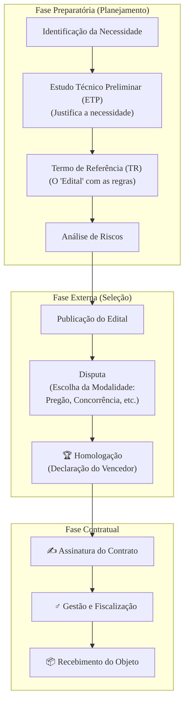

### Olá, futuro(a) aprovado(a)\! Vamos decifrar a Nova Lei de Licitações (14.133/2021) para você construir sua aprovação sem medo do Cebraspe.

Pense em uma licitação como o processo de **organizar um concurso público para contratar um novo servidor** 👨‍🏫. A lei nova trouxe mais regras para a fase de planejamento, para garantir que a contratação seja bem-feita desde o início.

-----

### \#\#\# Disposições Gerais e a Fase Preparatória: Planejando o Concurso

A Lei 14.133/2021 reforçou que um bom concurso começa com um bom planejamento.

  * **Fase Preparatória:** É a etapa mais importante, onde a "vaga" é planejada.
      * **Estudo Técnico Preliminar (ETP):** É o documento que **justifica a necessidade** da vaga. "Precisamos de um novo servidor porque o atendimento ao público está muito lento e temos um problema a ser resolvido". Ele analisa se a contratação é a melhor solução.
      * **Termo de Referência (TR):** É o **edital do concurso**. Ele descreve em detalhes o que o novo servidor vai fazer (o objeto), quais os requisitos da vaga, como será o trabalho e como ele será avaliado e pago.
      * **Gerenciamento de Riscos:** É pensar nos problemas antes que aconteçam. "E se poucos candidatos se inscreverem? E se o aprovado desistir da vaga?".

> #### Foco Cebraspe (Pontos de Atenção e "Pegadinhas")
>
> >   * **Planejamento é Rei:** A nova lei deu um peso enorme para o planejamento. Um ETP ou TR malfeito pode **anular todo o concurso** (a licitação).
> >   * **ETP vs. TR:** A banca vai inverter os papéis\! Lembre-se: **ETP = Justificativa** ("Por que precisamos?"). **TR = Edital** ("O que precisamos e quais as regras?").
> >   * **Vedação ao Direcionamento:** Em TI, é proibido criar um "edital" com requisitos tão específicos que só um "candidato" (marca ou fornecedor) possa vencer, a não ser que haja uma forte justificativa técnica.

-----

### \#\#\# Modalidades de Licitação e Contratação Direta: Tipos de Concurso

A lei definiu as formas de selecionar o "candidato" vencedor.

  * **Modalidades de Licitação (Os Tipos de Concurso):**

      * **Pregão:** Para "vagas" de bens e serviços comuns (ex: comprar café, contratar limpeza). Geralmente, ganha quem oferece o menor "salário" (preço).
      * **Concorrência:** Para "vagas" de serviços especiais ou obras de engenharia (ex: contratar a construção de uma ponte).
      * **Concurso:** Para escolher um trabalho técnico, científico ou artístico (ex: selecionar o melhor projeto arquitetônico para um novo museu).
      * **Leilão:** Para vender os bens do órgão (ex: leiloar os carros velhos).
      * **Diálogo Competitivo (A Grande Novidade\!):** É o "concurso" para uma vaga que ainda não existe\! O órgão tem um problema super complexo e inovador e não sabe a solução. Ele "conversa" com os melhores "candidatos" do mercado para que eles ajudem a desenvolver as soluções. No final, o órgão contrata quem apresentou a melhor solução criada nesse diálogo.

  * **Contratação Direta (Contratar sem Concurso):**

      * **Inexigibilidade:** Quando a competição é **impossível**.
          * Ex: Contratar um show da Ivete Sangalo. Só ela pode fazer o show dela (artista consagrado/fornecedor exclusivo).
      * **Dispensa:** Quando a competição até seria possível, mas a lei deixa você pular essa etapa.
          * Ex: Contratar um pequeno serviço de R$ 500,00 (baixo valor) ou contratar caminhões-pipa em uma situação de calamidade pública (emergência).

> #### Foco Cebraspe (Pontos de Atenção e "Pegadinhas")
>
> >   * **Diálogo Competitivo:** Por ser a novidade, a banca vai cobrar. Lembre-se: é para situações de **inovação ou alta complexidade técnica**.
> >   * **Inexigibilidade vs. Dispensa:** A diferença fundamental\! **Inexigibilidade = impossível competir**. **Dispensa = possível competir, mas a lei dispensa**.
> >   * **Critério em Serviços de TI:** Para contratar serviços de TI complexos (natureza intelectual), é **proibido** usar só o critério de menor preço. É preciso usar **técnica e preço** ou **melhor técnica**.

-----

### \#\#\# Contratos: A "Posse" do Novo Servidor e a Gestão do Trabalho

Depois de selecionada, a empresa assina o contrato.

  * **Duração dos Contratos:**

      * A regra para serviços de natureza contínua (como a limpeza ou a sustentação de um sistema de TI) é de **até 5 anos**.
      * **Atenção:** Esse prazo pode ser prorrogado por **mais 5 anos**, totalizando **10 anos**, se for demonstrado que isso é mais vantajoso para o governo. Essa regra do **"5 + 5"** é importantíssima\!

  * **Alocação de Riscos:**

      * Em contratos grandes, o edital já vem com uma **matriz de riscos**, um documento que diz quem arca com o prejuízo em caso de imprevistos. "Se houver um tsunami, o governo paga. Se a sua máquina quebrar, a empresa paga".

  * **Gestão e Fiscalização:**

      * O **Fiscal do Contrato** é o **chefe imediato** do serviço. Ele acompanha o dia a dia, verifica se o trabalho está sendo bem feito e reporta para o seu superior.
      * **Recebimento do Objeto:** A "posse" do serviço.
        1.  **Recebimento Provisório:** O chefe imediato (fiscal) diz: "Ok, o trabalho do mês parece estar concluído".
        2.  **Recebimento Definitivo:** Depois de um tempo, um servidor ou comissão designada faz uma verificação final e diz: "O trabalho está 100% aprovado. Está oficialmente entregue".

  * **Sanções (As Punições):**

      * Se a empresa não cumpre o contrato, ela pode ser punida com advertência, multa, **impedimento de licitar** (suspensão "local", de até 3 anos) ou **declaração de inidoneidade** (a "lista negra" nacional, de 3 a 6 anos).

> #### Foco Cebraspe (Pontos de Atenção e "Pegadinhas")
>
> >   * **Prazo de "5 + 5":** A prorrogação para 10 anos não é automática, precisa ser justificada com base na vantajosidade.
> >   * **Apoio à Fiscalização:** O fiscal (chefe) pode contratar um especialista para ajudá-lo a avaliar um serviço técnico complexo, mas a responsabilidade final da fiscalização continua sendo dele.
> >   * **Recebimento Provisório não encerra a responsabilidade:** A empresa só se livra das obrigações daquela entrega após o **recebimento definitivo**.

### \#\#\# Mapa Mental: O Fluxo da Licitação na Nova Lei

### **Classe:** A
### **Conteúdo:** Lei nº 14.133/2021: Fase Preparatória e Modalidades

---

### **1. Disposições Gerais e a Fase Preparatória (Planejamento)**

> #### **TEORIA-ALVO**
> A **Lei nº 14.133, de 1º de abril de 2021**, estabelece as normas gerais de licitação e contratação para as Administrações Públicas diretas, autárquicas e fundacionais da União, dos Estados, do Distrito Federal и dos Municípios. Um de seus pilares é o fortalecimento da **fase preparatória**, também denominada fase de planejamento.
>
> * **Objetivos da Licitação (Art. 11):** Assegurar a seleção da proposta apta a gerar o resultado de contratação mais vantajoso, tratamento isonômico entre os licitantes, justa competição e incentivo à inovação e ao desenvolvimento nacional sustentável.
> * **Fase Preparatória:** Caracterizada pelo planejamento, devendo ser compatível com o plano de contratações anual e com as leis orçamentárias. É a etapa inicial do processo licitatório.
>     * **Estudo Técnico Preliminar (ETP) (Art. 18):** Documento constitutivo da primeira etapa do planejamento, que evidencia o problema a ser resolvido e a sua melhor solução. Deve demonstrar a real necessidade da contratação, analisar a viabilidade técnica e econômica, e descrever os requisitos necessários.
>     * **Termo de Referência (TR):** Documento necessário para a contratação de bens e serviços (utilizado no pregão e na concorrência). Deve conter, entre outros, a definição do objeto, a fundamentação da contratação, a descrição da solução como um todo, os requisitos, o modelo de execução do objeto, o modelo de gestão do contrato e os critérios de medição e pagamento.
>     * **Gerenciamento de Riscos:** A fase preparatória deve contemplar a análise dos riscos que possam comprometer o sucesso da licitação e a boa execução contratual.

> #### **FOCO CEBRASPE (Pontos de Atenção e "Pegadinhas")**
> > * **Importância do Planejamento:** A Lei nº 14.133/2021 eleva a fase de planejamento a um patamar de importância superior ao da legislação anterior (Lei nº 8.666/93). A ausência ou a elaboração deficiente do ETP ou do Termo de Referência pode ensejar a nulidade do processo licitatório.
> > * **Vedações em TI:** É vedada a aquisição de bens ou a contratação de serviços com especificações que, por excessiva particularidade, direcionem a contratação para uma marca ou fornecedor específico, salvo nos casos em que for tecnicamente justificável. Essa regra é de alta relevância em contratações de TI.
> > * **ETP e TR:** O ETP é o documento que **justifica** a necessidade e aponta a melhor solução. O TR é o documento que **descreve** o objeto e as regras para sua contratação e execução. A banca pode inverter os papéis desses artefatos.

---

### **Classe:** A
### **Conteúdo:** Modalidades de Licitação e Contratação Direta

---

### **2. Modalidades de Licitação e Contratação Direta**

> #### **TEORIA-ALVO**
> A Lei nº 14.133/2021 extinguiu as modalidades de tomada de preços e convite e introduziu uma nova modalidade, o diálogo competitivo.
>
> * **Modalidades de Licitação (Art. 28):**
>     * **Pregão:** Modalidade obrigatória para a contratação de bens e serviços comuns, cujo critério de julgamento poderá ser o de menor preço ou o de maior desconto.
>     * **Concorrência:** Para contratação de bens e serviços especiais e de obras e serviços comuns e especiais de engenharia.
>     * **Concurso:** Para escolha de trabalho técnico, científico ou artístico.
>     * **Leilão:** Para a alienação de bens móveis ou imóveis.
>     * **Diálogo Competitivo:** Modalidade para contratações que envolvam **inovação tecnológica ou técnica**, ou quando a Administração não puder ter suas necessidades satisfeitas sem a adaptação de soluções disponíveis no mercado, ou ainda quando as especificações técnicas não puderem ser definidas com precisão suficiente. Envolve uma fase de diálogos com licitantes previamente selecionados para desenvolver soluções.
> * **Contratação Direta:** Hipóteses de contratação sem licitação.
>     * **Inexigibilidade (Art. 74):** Ocorre quando há **inviabilidade de competição**. Em TI, os casos mais comuns são a aquisição de equipamentos ou a contratação de serviços que só possam ser fornecidos por produtor, empresa ou representante comercial **exclusivo**, e a contratação de serviços técnicos especializados de natureza **singular**, com profissionais de **notória especialização**.
>     * **Dispensa (Art. 75):** A competição é viável, mas a lei autoriza que a licitação seja dispensada. Os casos mais comuns são em razão do baixo valor, em situações de emergência ou calamidade, e para a contratação de remanescente de obra ou serviço.

> #### **FOCO CEBRASPE (Pontos de Atenção e "Pegadinhas")**
> > * **Diálogo Competitivo:** Por ser a principal inovação em modalidades, seu conceito e aplicação são alvos certos de questões. A banca testará o entendimento de que esta modalidade é restrita a cenários de alta complexidade técnica ou de inovação.
> > * **Inexigibilidade vs. Dispensa:** A distinção é fundamental. Na **inexigibilidade**, a competição é **inviável** (e.g., fornecedor exclusivo). Na **dispensa**, a competição seria **viável**, mas a lei faculta à Administração não realizá-la por razões de eficiência ou urgência.
> > * **Critério de Julgamento para Serviços de TI:** Para a contratação de serviços técnicos especializados de natureza predominantemente intelectual, como muitos serviços de TI (desenvolvimento, consultoria), é **vedada** a utilização do critério de julgamento de menor preço ou maior desconto. Deve-se utilizar **melhor técnica** ou **técnica e preço**.

---

### **Classe:** A
### **Conteúdo:** Contratos Administrativos: Duração, Riscos e Fiscalização

---

### **3. Contratos Administrativos: Duração, Riscos e Fiscalização**

> #### **TEORIA-ALVO**
> A Lei nº 14.133/2021 modernizou as regras sobre a formalização, a duração e, principalmente, a gestão e a fiscalização dos contratos administrativos.
>
> * **Duração dos Contratos (Art. 105 a 114):**
>     * A regra geral é que a vigência do contrato seja adstrita à dos respectivos créditos orçamentários.
>     * Para serviços e fornecimentos de **natureza contínua**, a duração pode ser de **até 5 (cinco) anos**.
>     * Excepcionalmente, o prazo de 5 anos pode ser prorrogado por **mais 5 (cinco) anos**, totalizando 10 anos, desde que demonstrada a obtenção de preços e condições mais vantajosas para a Administração. Este é um ponto de alta relevância para contratos de TI de longa duração (e.g., sustentação de sistemas, data center).
> * **Alocação de Riscos (Art. 103):**
>     * A lei introduziu a obrigatoriedade da elaboração de uma **matriz de alocação de riscos** entre o contratante e o contratado em determinadas situações, como em contratações de grande vulto. A matriz define a responsabilidade de cada parte por eventos futuros e incertos que possam impactar o equilíbrio econômico-financeiro do contrato.
> * **Gestão e Fiscalização do Contrato (Art. 117):**
>     * A execução do contrato deverá ser acompanhada e fiscalizada por **1 (um) ou mais fiscais do contrato**, representantes da Administração especialmente designados.
>     * É permitida a **contratação de terceiros** (pessoas físicas ou jurídicas) para assistir e subsidiar o fiscal com informações pertinentes à sua atribuição, mas a responsabilidade final permanece com o agente público.
>     * **Recebimento do Objeto (Art. 140):** Ocorre em duas etapas:
>         1.  **Recebimento Provisório:** Realizado pelo fiscal, para verificação da conformidade do objeto com os termos contratuais.
>         2.  **Recebimento Definitivo:** Realizado por servidor ou comissão designada, após a verificação da qualidade, da quantidade e o consequente aceite formal.
> * **Sanções (Art. 155):** Advertência, multa, impedimento de licitar e contratar, e declaração de inidoneidade para licitar ou contratar com a Administração Pública.

> #### **FOCO CEBRASPE (Pontos de Atenção e "Pegadinhas")**
> > * **Prazo dos Contratos de Natureza Contínua:** A regra do **"5 + 5"** anos é um ponto de alta probabilidade de cobrança. A prorrogação para 10 anos não é automática e exige justificativa de vantagem econômica para a Administração.
> > * **Matriz de Riscos:** Por ser uma inovação da lei, a banca vai questionar seu propósito (dar maior segurança jurídica e previsibilidade ao contrato) e sua obrigatoriedade (especialmente em contratações de grande vulto).
> > * **Papel do Fiscal do Contrato:** O fiscal não executa, mas acompanha e fiscaliza. A lei é clara ao permitir a contratação de apoio técnico externo para subsidiar o fiscal, especialmente em contratos complexos como os de TI, mas a decisão e a responsabilidade final são do agente público designado.
> > * **Recebimento Provisório vs. Definitivo:** O recebimento provisório não exime o contratado de suas responsabilidades. O aceite final, que consolida o cumprimento da obrigação, só ocorre com o recebimento definitivo, que em contratos de TI pode depender de um período de testes ou de observação do serviço em produção.
