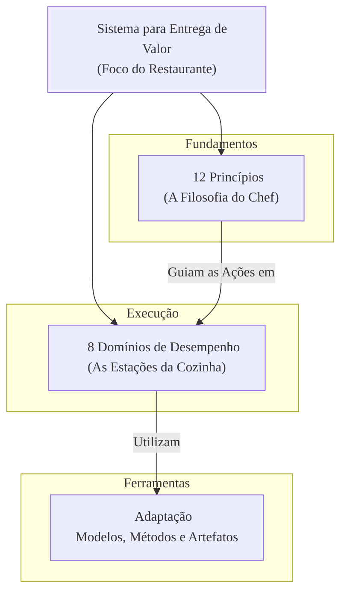

### Olá, futuro(a) aprovado(a)! Vamos desmistificar o novo Guia PMBOK® 7ª Edição para você gerenciar sua aprovação no Cebraspe.

Pense no Gerenciamento de Projetos de duas formas. O jeito antigo (**PMBOK 6ª Edição**) era como seguir a **receita de bolo da vovó, escrita na pedra** 📜. Você tinha que seguir 49 passos exatos, na ordem exata, para o bolo sair certo. Já o novo jeito (**PMBOK 7ª Edição**) é como participar de um **reality show de culinária com um chef mestre** 🧑‍🍳. Ele não te dá uma receita fixa, mas te ensina os **princípios da boa culinária** para que você possa criar qualquer prato, adaptando-se aos ingredientes que tem na bancada.

---

### ### A Mudança de Paradigma: Da Receita de Bolo aos Princípios do Chef

Essa é a mudança mais radical e o ponto que o Cebraspe mais vai explorar.

| Característica | PMBOK® 6ª Edição (A Receita da Vovó) | PMBOK® 7ª Edição (Os Princípios do Chef) |
| :--- | :--- | :--- |
| **Foco** | **Processos Prescritivos** | **Princípios e Entrega de Valor** |
| **Abordagem** | "COMO fazer" (49 processos, 10 áreas) | "O QUÊ e POR QUE fazer" (12 princípios, 8 domínios) |
| **Flexibilidade** | Baixa (Receita rígida) | Alta (Adapte a técnica ao prato) |
| **Sucesso do Projeto** | Entregar no escopo, prazo e custo | **Entregar VALOR** para o negócio |

> #### Foco Cebraspe (Pontos de Atenção e "Pegadinhas")
> > * **Prescritivo vs. Baseado em Princípios:** A banca vai afirmar que "o PMBOK 7 detalha 49 processos". **ERRADO!** Isso é a 6ª edição. A 7ª edição é **não prescritiva** e se baseia em **princípios** que guiam o comportamento.
> > * **Foco em Valor:** O sucesso não é mais só cumprir a "tripla restrição" (escopo, tempo, custo). Um projeto pode estourar o orçamento e ainda ser um sucesso se o **valor** que ele entregou para a organização foi imenso.

---

### ### O Sistema de Entrega de Valor e os 12 Princípios: A Filosofia do Chef

A 7ª edição coloca o projeto dentro de um **Sistema para Entrega de Valor**. Pense nisso como a "filosofia do restaurante": tudo o que a cozinha (projetos, programas) faz deve contribuir para a reputação e o sucesso do restaurante (a estratégia da organização).

Para cozinhar bem dentro dessa filosofia, o chef mestre ensina **12 Princípios** que devem guiar a mentalidade da sua equipe.

1.  **Administração (*Stewardship*):** Seja um chef responsável e cuidadoso com os ingredientes e com a cozinha.
2.  **Equipe:** Crie uma cozinha colaborativa, onde todos se ajudam.
3.  **Partes Interessadas:** Converse sempre com os clientes e o dono do restaurante.
4.  **Valor:** Foque em fazer um prato delicioso que o cliente vai amar.
5.  **Pensamento Sistêmico:** Entenda que mexer na receita da sobremesa pode impactar o prato principal.
6.  **Liderança:** Inspire e motive sua equipe, não apenas dê ordens.
7.  **Adaptação:** Se faltou um ingrediente, adapte a receita com o que você tem.
8.  **Qualidade:** Use ingredientes de qualidade e siga as boas práticas de higiene em todo o processo.
9.  **Complexidade:** Saiba como lidar com pratos complexos e com clientes indecisos.
10. **Risco:** Tenha um plano B caso o forno quebre no meio do preparo.
11. **Adaptabilidade e Resiliência:** Seja rápido para se adaptar a um pedido de última hora e resiliente para se recuperar se um prato queimar.
12. **Mudança:** Aceite que o cliente pode mudar de ideia e esteja pronto para adaptar o prato.

> #### Foco Cebraspe (Pontos de Atenção e "Pegadinhas")
> > * A banca vai dar um cenário e perguntar qual princípio se aplica. Ex: "Customizar a abordagem do projeto para a cultura da empresa" se refere ao princípio da **Adaptação**.
> > * Os princípios são **diretrizes**, não uma lista de tarefas. Eles guiam a mentalidade, não são um passo a passo.

---

### ### Domínios de Desempenho e a Caixa de Ferramentas: As Estações da Cozinha

O PMBOK 7 troca as antigas "Áreas de Conhecimento" por 8 **Domínios de Desempenho**. Pense neles como as **estações de trabalho da sua cozinha**, áreas de foco que precisam estar funcionando bem o tempo todo, de forma integrada.

* **Os 8 Domínios (As Estações da Cozinha):**
    1.  **Partes Interessadas:** A estação de atendimento ao cliente.
    2.  **Equipe:** A área de gestão de pessoal e motivação da cozinha.
    3.  **Abordagem de Desenvolvimento:** Decidir se o prato será *à la carte* (preditivo) ou um *menu degustação* (adaptativo).
    4.  **Planejamento:** A estação de *mise en place*, onde você organiza todos os ingredientes e passos.
    5.  **Trabalho do Projeto:** O fogão, a chapa, onde o trabalho é efetivamente feito.
    6.  **Entrega:** A estação de montagem e finalização do prato.
    7.  **Medição:** O painel que mostra o tempo de preparo e a temperatura dos pratos.
    8.  **Incerteza:** A estação de gerenciamento de crises e riscos (o extintor de incêndio).

* **Adaptação, Modelos, Métodos e Artefatos (A Caixa de Ferramentas do Chef 🧰):**
    * Esta seção do guia é a **caixa de ferramentas e a despensa do chef**. Ela não diz "você *deve* usar uma faca de cerâmica". Em vez disso, ela diz "aqui estão vários tipos de facas, panelas e temperos que você *pode* usar".
    * Cabe à equipe, pelo princípio da **Adaptação**, escolher as melhores ferramentas (métodos e artefatos) para o prato (projeto) que estão preparando.

> #### Foco Cebraspe (Pontos de Atenção e "Pegadinhas")
> > * **Domínios vs. Áreas de Conhecimento:** A banca vai misturar os nomes. "Gerenciamento de Custos" era uma **Área de Conhecimento** da 6ª Ed. Na 7ª Ed., as atividades de custo estão dentro dos domínios **Planejamento** e **Medição**.
> > * **Domínios não são Fases:** As estações da cozinha trabalham **ao mesmo tempo e de forma integrada**, não uma depois da outra.
> > * **Uso de Artefatos:** A banca vai dizer que "o PMBOK 7 obriga o uso do Termo de Abertura do Projeto". **ERRADO!** O PMBOK 7 diz que a necessidade de qualquer artefato deve ser decidida pela equipe através da **adaptação**.

### ### Mapa Mental: A Nova Estrutura do PMBOK® 7

### **Classe:** B
### **Conteúdo:** Gerenciamento de Projetos: Fundamentos e o Guia PMBOK® 7ª Edição

---

### **1. Gerenciamento de Projetos e a Mudança de Paradigma do PMBOK® 7**

> #### **TEORIA-ALVO**
> O **Gerenciamento de Projetos** é a aplicação de conhecimento, habilidades, ferramentas e técnicas às atividades do projeto a fim de atender aos seus requisitos. Um **projeto** é um esforço temporário empreendido para criar um produto, serviço ou resultado único. O Guia PMBOK® é a publicação padrão do Project Management Institute (PMI) para a profissão.
>
> * **Mudança de Paradigma (6ª para 7ª Edição):** A 7ª Edição do Guia PMBOK® representa uma mudança fundamental na abordagem de gerenciamento de projetos.
>     * **Abordagem da 6ª Edição (e anteriores):** Foco **prescritivo** e baseado em **processos**. Descrevia o "como fazer" através de 49 processos de gerenciamento, agrupados em 5 grupos de processos (Iniciação, Planejamento, Execução, Monitoramento e Controle, Encerramento) e 10 áreas de conhecimento (Escopo, Tempo, Custo, etc.).
>     * **Abordagem da 7ª Edição:** Foco **baseado em princípios** e orientado à **entrega de valor**. Reconhece que não há uma única abordagem que sirva para todos os projetos e, portanto, foca em "o quê" e "por que" para guiar o comportamento e a mentalidade da equipe do projeto, independentemente da abordagem de desenvolvimento utilizada (preditiva, adaptativa ou híbrida).
> * **Estrutura da 7ª Edição:** A nova estrutura abandona os grupos de processos e as áreas de conhecimento como elementos centrais e se organiza em torno de:
>     1.  Um Sistema para Entrega de Valor.
>     2.  Doze (12) Princípios de Gerenciamento de Projetos.
>     3.  Oito (8) Domínios de Desempenho do Projeto.
>     4.  Adaptação, Modelos, Métodos e Artefatos.

> #### **FOCO CEBRASPE (Pontos de Atenção e "Pegadinhas")**
> > * **Prescritivo vs. Baseado em Princípios:** Este é o ponto mais crítico e a principal mudança. A banca frequentemente afirmará que "o Guia PMBOK® 7ª Edição detalha os 49 processos que compõem o gerenciamento de projetos". **ERRADO**. Esta é a descrição da 6ª edição. A 7ª edição é **não prescritiva** e se fundamenta em **princípios**.
> > * **Foco em Entrega de Valor:** O sucesso de um projeto na 7ª edição não é medido apenas pela conformidade com a "tripla restrição" (escopo, tempo e custo), mas sim pela capacidade do projeto de **entregar o valor de negócio pretendido** para as partes interessadas.
> > * **"O Padrão" vs. "O Guia":** O PMBOK® 7 é composto por duas partes principais: "O Padrão para Gerenciamento de Projetos", que contém os princípios, e "Um Guia para o Conjunto de Conhecimentos em Gerenciamento de Projetos", que detalha os domínios de desempenho. A banca pode testar essa estrutura.

---

### **Classe:** B
### **Conteúdo:** Sistema de Entrega de Valor e Princípios de Gerenciamento de Projetos

---

### **2. Sistema de Entrega de Valor e Princípios de Gerenciamento de Projetos**

> #### **TEORIA-ALVO**
> A 7ª edição do PMBOK® contextualiza os projetos dentro de um **Sistema para Entrega de Valor**, que explica como os projetos, programas e portfólios contribuem para a estratégia organizacional e a criação de valor. O comportamento da equipe dentro deste sistema é guiado por 12 princípios.
>
> * **Sistema para Entrega de Valor:** Um conjunto de atividades estratégicas de negócio direcionadas à construção, sustentação e/ou avanço de uma organização. Portfólios, programas e projetos operam dentro deste sistema para entregar valor.
> * **Os 12 Princípios de Gerenciamento de Projetos:** São diretrizes que servem como base para a estratégia, a tomada de decisão e a resolução de problemas em projetos.
>     1.  **Administração (*Stewardship*):** Ser um administrador diligente, respeitoso e atencioso.
>     2.  **Equipe:** Criar um ambiente colaborativo para a equipe.
>     3.  **Partes Interessadas:** Envolver-se eficazmente com as partes interessadas.
>     4.  **Valor:** Concentrar-se no valor.
>     5.  **Pensamento Sistêmico:** Reconhecer, avaliar e reagir às interações do sistema.
>     6.  **Liderança:** Demonstrar comportamentos de liderança.
>     7.  **Adaptação:** Fazer a adaptação com base no contexto.
>     8.  **Qualidade:** Incorporar a qualidade nos processos e nas entregas.
>     9.  **Complexidade:** Navegar na complexidade (incerteza, ambiguidade).
>     10. **Risco:** Otimizar as respostas aos riscos.
>     11. **Adaptabilidade e Resiliência:** Adotar a capacidade de adaptação e a resiliência.
>     12. **Mudança:** Promover a mudança para alcançar o estado futuro desejado.

> #### **FOCO CEBRASPE (Pontos de Atenção e "Pegadinhas")**
> > * **Conhecimento dos Princípios:** A banca pode apresentar um cenário prático e solicitar a identificação do princípio de gerenciamento de projetos correspondente. Exemplo: "A necessidade de customizar a metodologia de um projeto para se adequar à cultura da organização e à criticidade das entregas está alinhada ao princípio da **Adaptação**".
> > * **Princípios como Diretrizes, não Regras:** É incorreto interpretar os 12 princípios como uma lista de verificação ou uma sequência de etapas a serem seguidas. **ERRADO**. Eles são preceitos fundamentais que devem guiar a mentalidade e as ações da equipe ao longo de todo o projeto.
> > * **"Administração" (*Stewardship*):** Este primeiro princípio é amplo e abrange a responsabilidade de cuidar do projeto com integridade, zelo e confiança, considerando os aspectos financeiros, materiais e sociais.

---

### **Classe:** B
### **Conteúdo:** Domínios de Desempenho do Projeto, Adaptação e Ferramentas

---

### **3. Domínios de Desempenho, Adaptação, Modelos, Métodos e Artefatos**

> #### **TEORIA-ALVO**
> O PMBOK® 7 substitui as 10 áreas de conhecimento por 8 **Domínios de Desempenho**, que são grupos de atividades relacionadas e interdependentes, essenciais para a entrega de resultados. A seção "Modelos, Métodos e Artefatos" funciona como uma caixa de ferramentas para apoiar a execução desses domínios.
>
> * **Os 8 Domínios de Desempenho do Projeto:**
>     1.  **Partes Interessadas:** Atividades focadas no engajamento eficaz das partes interessadas.
>     2.  **Equipe:** Atividades focadas na cultura e no desenvolvimento da equipe do projeto.
>     3.  **Abordagem de Desenvolvimento e Ciclo de Vida:** Atividades focadas na definição da cadência de entrega e da abordagem de desenvolvimento (e.g., preditiva, adaptativa, híbrida).
>     4.  **Planejamento:** Atividades focadas na organização e coordenação do trabalho.
>     5.  **Trabalho do Projeto:** Atividades focadas no gerenciamento de recursos físicos e na execução do trabalho.
>     6.  **Entrega:** Atividades focadas no gerenciamento do escopo e da qualidade para entregar o valor planejado.
>     7.  **Medição:** Atividades focadas na avaliação do desempenho do projeto.
>     8.  **Incerteza:** Atividades focadas na gestão de riscos e incertezas.
> * **Adaptação (*Tailoring*):**
>     * **Definição:** O processo deliberado de selecionar e ajustar a abordagem de desenvolvimento, a governança e os processos para se adequarem ao ambiente e ao trabalho do projeto. O PMBOK® 7 enfatiza que a adaptação é uma responsabilidade fundamental da equipe.
> * **Modelos, Métodos e Artefatos:**
>     * **Definição:** Esta seção do guia não é prescritiva, mas funciona como uma "caixa de ferramentas", listando modelos, métodos e artefatos comuns que **podem** ser utilizados pela equipe do projeto.
>     * **Exemplos:**
>         * **Modelos:** Modelo de Tuckman (desenvolvimento de equipes), Modelo de Comunicação.
>         * **Métodos:** Coleta e Análise de Dados, Estimativas, Reuniões.
>         * **Artefatos:** Termo de Abertura do Projeto, Registro de Riscos, Cronograma, Orçamento.

> #### **FOCO CEBRASPE (Pontos de Atenção e "Pegadinhas")**
> > * **Domínios vs. Áreas de Conhecimento:** A banca vai confundir a estrutura da 7ª edição com a da 6ª. Uma questão pode afirmar que "Gerenciamento das Aquisições" é um domínio de desempenho do PMBOK® 7. **ERRADO**. Este era uma área de conhecimento da 6ª edição. Na 7ª edição, as atividades de aquisição estão contidas nos domínios "Planejamento" e "Trabalho do Projeto".
> > * **Domínios como Fases:** É incorreto tratar os domínios de desempenho como fases sequenciais de um projeto. **ERRADO**. Eles são áreas de foco interativas e sobrepostas que operam ao longo de todo o ciclo de vida do projeto.
> > * **Uso dos Artefatos:** A banca pode afirmar que "segundo o PMBOK® 7, todo projeto deve, obrigatoriamente, possuir um Plano de Gerenciamento do Projeto detalhado". **INCORRETO**. Embora seja um artefato comum e importante, o PMBOK® 7 preconiza que a necessidade, o formalismo e o conteúdo de qualquer artefato devem ser definidos pelo processo de **adaptação**, com base nas características do projeto.
