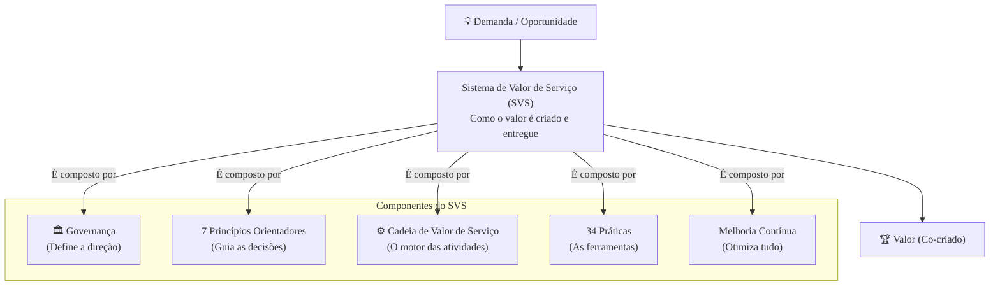

### Olá, futuro(a) aprovado(a)! Vamos maratonar os conceitos da ITIL V4 para você dar um show na prova do Cebraspe.

Pense na ITIL V4 como o **manual de operações de um serviço de streaming de sucesso, como a Netflix** 🎬. O objetivo não é apenas ter um catálogo de filmes, mas garantir que o cliente tenha uma experiência incrível e perceba o valor do serviço.

---

### ### Conceitos Fundamentais: O Universo do Streaming

A ITIL V4 mudou o foco: o valor não é mais algo que a TI cria e entrega, mas algo que é **co-criado** com o cliente.

* **Valor:** Não é o filme em si. É o **entretenimento, a conveniência e a alegria** que você sente ao assistir. Esse valor só existe porque a Netflix oferece o serviço e **você** assiste e se engaja. É uma parceria.

* **Serviço:** É o próprio serviço da Netflix. Ele te permite alcançar um **resultado** (relaxar assistindo a uma série) sem que você precise gerenciar os **custos e riscos** (comprar servidores, licenciar conteúdo, etc.).

* **Produto:** São as peças que compõem o serviço. O aplicativo na sua TV, o algoritmo de recomendação, o player de vídeo.

* **As Quatro Dimensões (Os Pilares da Netflix):** Para o serviço funcionar, tudo precisa estar em harmonia.
    1.  **Organizações e Pessoas:** Os engenheiros, o pessoal do marketing, a cultura da empresa.
    2.  **Informação e Tecnologia:** Os data centers, os servidores, o código do aplicativo, o catálogo de filmes.
    3.  **Parceiros e Fornecedores:** Os estúdios de cinema que fornecem os filmes, os provedores de nuvem (AWS).
    4.  **Fluxos de Valor e Processos:** O passo a passo de como um novo filme é licenciado, colocado no catálogo e recomendado para você.

> #### Foco Cebraspe (Pontos de Atenção e "Pegadinhas")
> > * **Co-criação de Valor:** A banca vai usar a visão antiga: "a TI cria e entrega valor". **ERRADO!** Na ITIL V4, o valor é **co-criado** em uma relação de parceria com o cliente.
> > * **Definição de Serviço:** A banca pode omitir uma das partes da definição. Lembre-se do tripé: facilita **resultados** para o cliente, que não precisa gerenciar **custos** e **riscos**.
> > * **Abordagem Holística:** A banca vai dizer que a ITIL foca só em processos. **ERRADO!** A V4 tem uma visão **holística**, considerando as 4 dimensões (Pessoas, Tecnologia, Parceiros, Processos) como igualmente importantes.

---

### ### O Sistema de Valor de Serviço (SVS): A "Sala de Máquinas" da Netflix

O SVS é o modelo que mostra como a Netflix inteira funciona como um sistema para transformar uma **demanda** (clientes querendo uma nova série) em **valor** (clientes felizes maratonando a série). Ele tem 5 componentes:

1.  **Cadeia de Valor de Serviço (SVC):** A **linha de montagem** principal dentro da sala de máquinas.
2.  **Práticas:** As **caixas de ferramentas** (são 34!) que os funcionários usam na linha de montagem. Ex: uma caixa para "Consertar Falhas", outra para "Gerenciar Mudanças".
3.  **Princípios Orientadores:** Os **7 pôsteres motivacionais** na parede da sala de máquinas, que guiam todas as decisões. Ex: "Focar no Valor", "Manter a Simplicidade".
4.  **Governança:** A **diretoria** da Netflix, que define a direção estratégica e as regras gerais.
5.  **Melhoria Contínua:** O **engenheiro-chefe** que está sempre ajustando e otimizando a sala de máquinas para que ela funcione cada vez melhor.

> #### Foco Cebraspe (Pontos de Atenção e "Pegadinhas")
> > * **Práticas vs. Processos:** A ITIL V4 trocou "processos" por "práticas". Uma **prática** é mais completa: ela inclui o processo, as pessoas, as ferramentas, tudo. A banca pode usar o termo antigo "processo" no contexto da V4 para te confundir.
> > * **Princípios Orientadores:** A banca vai dar um cenário e perguntar qual dos 7 princípios se aplica. Ex: "Evitar criar uma solução complexa quando uma simples resolve" se refere a **"Manter a simplicidade e a praticidade"**.

---

### ### A Cadeia de Valor de Serviço e as Práticas Chave: A Linha de Montagem

A **Cadeia de Valor de Serviço (SVC)** é o coração operacional. Ela tem 6 atividades que se combinam para entregar o serviço. Pense nelas como as estações da linha de montagem.

* **Atividades da SVC:** Planejar, Melhorar, Engajar, Desenhar e Transicionar, Obter/Construir, Entregar e Suportar.

Para executar essas atividades, usamos as **Práticas** (as caixas de ferramenta). As mais famosas e cobradas são:

| Prática | Analogia na Netflix | Foco Principal |
| :--- | :--- | :--- |
| **Central de Serviço** | O "Fale Conosco" / Suporte por chat. | Ser o ponto único de contato com o usuário. |
| **Gerenciamento de Incidentes** | Sua série está travando agora! (É um **incidente**). | **Restaurar** o serviço o mais rápido possível para você voltar a assistir. |
| **Gerenciamento de Problemas** | A mesma série trava toda terça às 21h. (É um **problema**). | **Investigar a causa-raiz** do travamento para que ele nunca mais aconteça. |
| **Gerenciamento de Requisição de Serviço** | "Quero trocar a senha da minha conta". | Atender a uma solicitação padrão e pré-aprovada do usuário. |
| **Habilitação de Mudanças** | A Netflix vai lançar uma interface totalmente nova no aplicativo. | Garantir que essa **mudança** seja feita de forma controlada, sem quebrar o serviço para todo mundo. |

> #### Foco Cebraspe (Pontos de Atenção e "Pegadinhas")
> > * **Incidente vs. Problema:** A pegadinha mais clássica da ITIL! **Incidente** é o sintoma ("a série travou"). Foco em apagar o incêndio. **Problema** é a causa-raiz ("um servidor está superaquecendo"). Foco em descobrir por que o incêndio começou.
> > * **Incidente vs. Requisição de Serviço:** **Incidente** = algo quebrou. **Requisição** = pedir algo novo ou uma ajuda padrão. A banca vai dar um cenário e pedir para você classificar.
> > * **A SVC não é uma cachoeira:** As 6 atividades não acontecem em uma ordem fixa. Elas se combinam de várias formas para criar **fluxos de valor** diferentes.

### ### Mapa Mental: Estrutura Objetiva do SVS da ITIL V4

### **Classe:** A
### **Conteúdo:** Gerenciamento de Serviços: Conceitos Fundamentais da ITIL V4

---

### **1. Conceitos Fundamentais da ITIL V4**

> #### **TEORIA-ALVO**
> O **Gerenciamento de Serviços de TI (GSTI)** é definido como um conjunto de capacidades organizacionais especializadas para entregar valor aos clientes na forma de serviços. A **ITIL (Information Technology Infrastructure Library) V4** é o framework de boas práticas mais adotado globalmente para o GSTI, focando na co-criação de valor.
>
> * **Conceitos-Chave:**
>     * **Valor:** A percepção de benefício, utilidade e importância de algo. Na ITIL V4, o valor não é criado isoladamente pelo provedor de serviço, mas é **co-criado** através da colaboração ativa com o consumidor e outras partes interessadas.
>     * **Serviço:** Um meio de habilitar a co-criação de valor ao facilitar os **resultados** que os clientes desejam alcançar, sem que o cliente tenha que gerenciar **custos e riscos** específicos.
>     * **Produto:** Uma configuração de recursos de uma organização, projetada para oferecer valor a um consumidor. Um serviço é baseado em um ou mais produtos.
>     * **Relacionamento de Serviço:** A cooperação entre um provedor de serviço e um consumidor de serviço. Inclui o provisionamento de serviços, o consumo de serviços e o gerenciamento do relacionamento de serviço.
> * **As Quatro Dimensões do Gerenciamento de Serviços:** Para garantir uma abordagem holística, a ITIL V4 preconiza que todo serviço e todo o Sistema de Valor de Serviço (SVS) sejam analisados sob quatro dimensões:
>     1.  **Organizações e Pessoas:** A estrutura formal, a cultura, os papéis e as responsabilidades.
>     2.  **Informação e Tecnologia:** As informações, o conhecimento, as tecnologias e as aplicações necessárias para o gerenciamento de serviços.
>     3.  **Parceiros e Fornecedores:** As relações da organização com outras empresas que participam do desenho, desenvolvimento, entrega e suporte de serviços.
>     4.  **Fluxos de Valor e Processos:** Como as várias partes da organização trabalham de forma integrada e coordenada para permitir a criação de valor por meio de produtos e serviços.

> #### **FOCO CEBRASPE (Pontos de Atenção e "Pegadinhas")**
> > * **Co-criação de Valor:** Este é um conceito central e uma mudança filosófica em relação às versões anteriores da ITIL. A banca pode apresentar a visão legada de que "o provedor de TI cria valor e o entrega ao cliente". **ERRADO**. Na ITIL V4, o valor é **co-criado** em uma relação de colaboração.
> > * **Definição de Serviço:** A definição de serviço na ITIL V4 enfatiza a facilitação de **resultados** para o cliente, abstraindo dele a gestão de custos e riscos específicos. A banca pode omitir ou alterar um desses componentes (resultados, custos, riscos).
> > * **As Quatro Dimensões:** A banca pode afirmar que o foco da ITIL V4 é exclusivamente em processos e tecnologia. **ERRADO**. A abordagem é **holística**, considerando que as quatro dimensões (Pessoas, Informação/Tecnologia, Parceiros, Processos) são interdependentes e igualmente importantes para a entrega de valor.

---

### **Classe:** A
### **Conteúdo:** O Sistema de Valor de Serviço (SVS) e seus Componentes

---

### **2. O Sistema de Valor de Serviço (SVS)**

> #### **TEORIA-ALVO**
> O **Sistema de Valor de Serviço (SVS)** é o modelo central da ITIL V4. Ele descreve como todos os componentes e atividades de uma organização trabalham juntos, como um sistema, para transformar oportunidade e demanda em valor para as partes interessadas.
>
> * **Estrutura do SVS:** O SVS é composto por cinco componentes principais que operam de forma integrada:
>     1.  **Cadeia de Valor de Serviço (*Service Value Chain - SVC*):** O coração operacional do SVS. É um modelo operacional que descreve as atividades-chave necessárias para responder à demanda e facilitar a co-criação de valor.
>     2.  **Práticas (*Practices*):** Conjuntos de recursos organizacionais projetados para realizar um trabalho ou atingir um objetivo. A ITIL V4 define 34 práticas (e.g., Gerenciamento de Incidentes, Habilitação de Mudanças), que substituem o conceito de "processos" da ITIL v3.
>     3.  **Princípios Orientadores (*Guiding Principles*):** Recomendações universais e duradouras que guiam a organização em todas as circunstâncias, independentemente de mudanças em seus objetivos, estratégias ou estrutura. São sete: Focar no valor; Começar onde você está; Progredir iterativamente com feedback; Colaborar e promover a visibilidade; Pensar e trabalhar holisticamente; Manter a simplicidade e a praticidade; Otimizar e automatizar.
>     4.  **Governança:** O meio pelo qual a organização é dirigida e controlada. No SVS, a governança define a direção, as políticas e os controles.
>     5.  **Melhoria Contínua:** Uma atividade recorrente, realizada em todos os níveis da organização, para garantir que o desempenho atenda continuamente às expectativas das partes interessadas. O modelo de melhoria contínua da ITIL V4 é uma peça central desta componente.

> #### **FOCO CEBRASPE (Pontos de Atenção e "Pegadinhas")**
> > * **SVS como um Sistema Integrado:** É incorreto tratar os componentes do SVS como elementos isolados. A força do modelo reside na sua **interação sistêmica**. As práticas suportam a cadeia de valor, que é guiada pelos princípios, supervisionada pela governança e aprimorada pela melhoria contínua.
> > * **Princípios Orientadores:** A banca pode apresentar uma situação e pedir para identificar o princípio orientador correspondente. Exemplo: "A recomendação de evitar criar uma solução complexa quando uma mais simples seria suficiente refere-se ao princípio 'Manter a simplicidade e a praticidade'". A troca entre as definições dos sete princípios é uma fonte provável de questões.
> > * **Práticas vs. Processos:** A ITIL V4 intencionalmente substituiu o termo "processo" por "prática". Uma **prática** é mais abrangente, incluindo não apenas os processos e fluxos de trabalho, mas também os recursos das quatro dimensões (pessoas, tecnologia, etc.) necessários para executá-la. A banca pode usar a terminologia antiga de forma incorreta no contexto da V4.

---

### **Classe:** A
### **Conteúdo:** A Cadeia de Valor de Serviço e as Práticas Chave

---

### **3. A Cadeia de Valor de Serviço e as Práticas Chave**

> #### **TEORIA-ALVO**
> A **Cadeia de Valor de Serviço (SVC - *Service Value Chain*)** é o núcleo do SVS, representando um modelo operacional com seis atividades que podem ser combinadas em diferentes sequências (fluxos de valor) para converter demanda em valor. As **práticas** são os recursos utilizados para realizar essas atividades.
>
> * **Atividades da Cadeia de Valor de Serviço:**
>     * **Planejar (*Plan*):** Criação de uma visão e direção compartilhadas para as quatro dimensões e para todos os produtos e serviços.
>     * **Melhorar (*Improve*):** Assegurar a melhoria contínua de serviços, produtos e práticas em todas as atividades da cadeia de valor.
>     * **Engajar (*Engage*):** Fornecer um bom entendimento das necessidades das partes interessadas, transparência e promover um bom relacionamento com todos.
>     * **Desenhar e Transicionar (*Design & Transition*):** Garantir que produtos e serviços atendam continuamente às expectativas das partes interessadas em relação a qualidade, custos e prazo.
>     * **Obter/Construir (*Obtain/Build*):** Garantir que os componentes de serviço estejam disponíveis quando e onde forem necessários e que atendam às especificações acordadas.
>     * **Entregar e Suportar (*Deliver & Support*):** Garantir que os serviços sejam entregues e suportados de acordo com as expectativas e os acordos de nível de serviço (SLAs).
> * **Práticas Chave de Gerenciamento de Serviço:**
>     * **Central de Serviço (*Service Desk*):** O ponto único de contato (SPOC) para os usuários. Captura a demanda por resolução de incidentes e requisições de serviço.
>     * **Gerenciamento de Incidentes:** Prática que visa minimizar o impacto negativo de incidentes, restaurando a operação normal do serviço o mais rápido possível.
>     * **Gerenciamento de Requisição de Serviço:** Prática responsável por gerenciar o ciclo de vida de todas as requisições de serviço iniciadas pelo usuário.
>     * **Gerenciamento de Problemas:** Prática responsável por reduzir a probabilidade e o impacto de incidentes, identificando as **causas-raiz** reais e potenciais e gerenciando soluções de contorno e erros conhecidos.
>     * **Habilitação de Mudanças (*Change Enablement*, anteriormente Gerenciamento de Mudanças):** Prática que visa maximizar o número de mudanças de TI bem-sucedidas, avaliando os riscos, autorizando as mudanças a prosseguir e gerenciando o cronograma de mudanças.

> #### **FOCO CEBRASPE (Pontos de Atenção e "Pegadinhas")**
> > * **Incidente vs. Problema:** Esta é a distinção mais clássica e frequentemente cobrada na ITIL. Um **incidente** é uma interrupção não planejada de um serviço (o sintoma). O foco é na **restauração rápida** do serviço. Um **problema** é a **causa-raiz** desconhecida de um ou mais incidentes. O foco é na **investigação** e eliminação da causa para prevenir futuros incidentes.
> > * **Incidente vs. Requisição de Serviço:** Um **incidente** é algo que está quebrado ou não funciona como deveria. Uma **requisição de serviço** é uma solicitação formal de um usuário para algo que ele precisa (e.g., instalação de um software, reset de senha, concessão de acesso). A banca fornecerá um cenário e pedirá a classificação correta.
> > * **A SVC não é Linear:** É fundamental entender que as atividades da cadeia de valor podem ser combinadas de diversas formas para criar **fluxos de valor**. Não é um processo em cascata. A atividade "Engajar", por exemplo, pode ocorrer no início (para entender a demanda) e no final (para verificar a satisfação) de um fluxo de valor.
