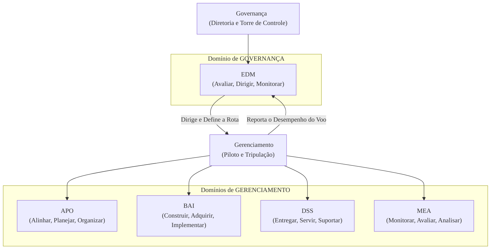

### Olá, futuro(a) aprovado(a)\! Vamos decolar no conhecimento sobre Governança de TI e COBIT 2019 para você voar alto na prova do Cebraspe.

Pense na Governança e no Gerenciamento de TI como a **operação de um avião comercial moderno** ✈️. A companhia aérea é a sua organização, a tecnologia e a informação (I\&T) são o avião e todos os seus sistemas complexos. O COBIT 2019 é o manual de voo e o framework operacional que garante uma viagem segura e eficiente.

-----

### \#\#\# Conceitos Fundamentais: A Torre de Controle e a Cabine de Comando

A distinção mais importante no COBIT, e a que o Cebraspe mais ama cobrar, é a diferença entre governança e gerenciamento.

  * **Governança (A Torre de Controle + Diretoria da Companhia Aérea) 🗼:**

      * A governança **define o destino e as regras do voo**. Eles olham de fora, de forma estratégica.
      * **A**valiam as necessidades dos passageiros e da empresa.
      * **D**irigem o voo, definindo o destino ("O voo de hoje vai para Paris").
      * **M**onitoram se o avião está na rota certa e cumprindo os objetivos.
      * O acrônimo é **ADM**. É responsabilidade do corpo diretivo.

  * **Gerenciamento (O Piloto e a Tripulação na Cabine de Comando) 👨‍✈️:**

      * O gerenciamento **executa o voo** conforme as ordens da torre.
      * **P**laneja os detalhes da viagem (rota, combustível, checklists).
      * **C**onstrói e implementa o plano de voo nos sistemas do avião.
      * **E**xecuta a pilotagem do avião.
      * **M**onitora os instrumentos internos para garantir que o plano está sendo seguido.
      * O acrônimo pode ser lembrado como **PCEM**. É responsabilidade da gestão executiva.

> #### Foco Cebraspe (Pontos de Atenção e "Pegadinhas")
>
> >   * **A Distinção ADM vs. PCEM:** A banca vai dizer que "compete à governança planejar as atividades de TI". **ERRADO\!** Planejar é uma atividade de **gerenciamento**. Governança **dirige**, gerenciamento **planeja**.
> >   * **I\&T (Informação e Tecnologia):** O COBIT 2019 usa essa sigla para deixar claro que ele governa não só a tecnologia (o avião), mas também a **informação** (os dados do radar, os mapas de voo), que é um ativo vital.
> >   * **Escopo:** O COBIT não é um manual só para o departamento de TI. Ele serve para a **companhia aérea inteira**, garantindo que a tecnologia e a informação sirvam ao negócio.

-----

### \#\#\# Princípios e Componentes: As Leis da Aviação e as Peças do Avião

O COBIT se baseia em princípios e é construído com componentes.

  * **Princípios do Sistema de Governança (As 6 Leis da Aviação da sua Companhia):**

    1.  **Fornecer Valor:** O objetivo final é levar os passageiros ao destino em segurança e satisfeitos.
    2.  **Abordagem Holística:** O motor, a asa, o sistema de navegação e o serviço de bordo devem funcionar juntos.
    3.  **Sistema Dinâmico:** O plano de voo pode mudar se houver uma tempestade no caminho.
    4.  **Distinção entre Governança e Gerenciamento:** A torre de controle é a torre, o piloto é o piloto. Funções separadas.
    5.  **Adequação às Necessidades:** O manual de voo de um jatinho particular é diferente do de um Airbus A380. O sistema é customizado usando **fatores de desenho**.
    6.  **Sistema de Ponta a Ponta:** Cobre desde a venda da passagem até o desembarque do passageiro.

  * **Componentes do Sistema de Governança (As 7 Peças Essenciais do Avião):**

    1.  **Processos:** A checklist de decolagem.
    2.  **Estruturas Organizacionais:** A hierarquia (Comandante, Copiloto).
    3.  **Princípios, Políticas e Procedimentos:** O manual de operações de voo.
    4.  **Informação:** Os dados do radar e do GPS.
    5.  **Cultura, Ética e Comportamento:** A cultura de segurança em primeiro lugar.
    6.  **Pessoas, Habilidades e Competências:** O treinamento e a experiência do piloto.
    7.  **Serviços, Infraestrutura e Aplicações:** O próprio avião, o software de navegação, o serviço de catering.

> #### Foco Cebraspe (Pontos de Atenção e "Pegadinhas")
>
> >   * A banca pode confundir os **6 princípios do sistema** com os 3 princípios do *framework*.
> >   * **Fatores de Desenho:** É um conceito novo do COBIT 2019. São os critérios que você usa para customizar o seu sistema de governança (o manual de voo).
> >   * A lista dos **7 componentes** é um alvo fácil. A banca pode colocar um item que não pertence, como "Fornecedores".

-----

### \#\#\# Objetivos e Desempenho: O Plano de Voo e a Avaliação do Piloto

O COBIT organiza o "manual" em 40 objetivos, dentro de 5 grandes capítulos (domínios).

  * **Cascata de Objetivos:** É como a estratégia da empresa vira uma ação no cockpit.

      * **Necessidade do Passageiro:** "Chegar rápido em Londres".
      * **Meta da Companhia:** "Ser a rota mais rápida para a Europa".
      * **Meta de I\&T:** "Otimizar a rota de voo usando dados de tempo real".
      * **Objetivo do COBIT:** Executar o processo "APO03 - Gerenciar a Arquitetura da Empresa".

  * **Domínios (Os Capítulos do Manual de Voo):**

      * **Domínio de GOVERNANÇA (Para a Torre de Controle):**
          * **EDM (Avaliar, Dirigir e Monitorar)**
      * **Domínios de GERENCIAMENTO (Para o Piloto e a Tripulação):**
          * **APO (Alinhar, Planejar e Organizar):** O planejamento do voo antes da decolagem.
          * **BAI (Construir, Adquirir e Implementar):** A instalação de um novo sistema de radar no avião.
          * **DSS (Entregar, Servir e Suportar):** A pilotagem do avião e o serviço de bordo.
          * **MEA (Monitorar, Avaliar e Analisar):** O copiloto checando os instrumentos de voo.

  * **Gerenciamento de Desempenho (Os Níveis de Habilidade do Piloto):**
    O COBIT usa um modelo baseado no **CMMI** para avaliar o quão "capaz" é um processo, em uma escala de 0 a 5 (Incompleto, Inicial, Gerenciado, Definido, Gerenciado Quantitativamente, Otimizado).

> #### Foco Cebraspe (Pontos de Atenção e "Pegadinhas")
>
> >   * **Domínios de Governança vs. Gerenciamento:** Decore\! **EDM é o ÚNICO domínio de governança**. Os outros quatro (APO, BAI, DSS, MEA) são de **gerenciamento**. A banca VAI afirmar que um domínio de gerenciamento é de governança.
> >   * **Cascata de Objetivos:** O propósito dela é garantir o **alinhamento estratégico** entre o negócio e a TI.
> >   * **Modelo de Desempenho:** Lembre-se que o modelo do COBIT 2019 é baseado no **CMMI**.

### \#\#\# Mapa Mental: A Estrutura de Comando do COBIT 2019

### **Classe:** A
### **Conteúdo:** Governança de TI: Conceitos Fundamentais e COBIT 2019

---

### **1. Conceitos Fundamentais e a Distinção entre Governança e Gerenciamento**

> #### **TEORIA-ALVO**
> A **Governança de TI** é parte integrante da governança corporativa e consiste na liderança, nas estruturas organizacionais e nos processos que garantem que a TI da organização sustente e estenda as estratégias e os objetivos do negócio. O **COBIT 2019** é o principal *framework* para a governança e o gerenciamento de informação e tecnologia (I&T) em uma organização.
>
> * **Objetivo do COBIT 2019:** Fornecer um *framework* abrangente que auxilie as organizações a atingir seus objetivos por meio do uso eficaz da I&T, criando um equilíbrio entre a realização de benefícios, a otimização de riscos e a utilização de recursos.
> * **Distinção Central: Governança vs. Gerenciamento:** O COBIT 2019 estabelece uma distinção clara entre essas duas disciplinas:
>     * **Governança:** Assegura que as necessidades, condições e opções das partes interessadas (*stakeholders*) sejam **avaliadas** para determinar objetivos corporativos equilibrados e acordados; a direção é **definida** por meio de priorização e tomada de decisão; e o desempenho e a conformidade são **monitorados** em relação à direção e aos objetivos acordados.
>         * **Corpo Responsável:** Corpo diretivo (e.g., Conselho de Administração, comitês estratégicos).
>         * **Atividades (acrônimo ADM):** **A**valiar, **D**irigir e **M**onitorar.
>     * **Gerenciamento:** **Planeja, constrói, executa e monitora** as atividades em alinhamento com a direção estabelecida pelo corpo de governança para atingir os objetivos corporativos.
>         * **Corpo Responsável:** Gestão executiva.
>         * **Atividades (acrônimo PCEM):** **P**lanejar, **C**onstruir, **E**xecutar e **M**onitorar.

> #### **FOCO CEBRASPE (Pontos de Atenção e "Pegadinhas")**
> > * **A Distinção Governança vs. Gerenciamento:** Este é o conceito mais explorado pela banca. Uma questão típica irá atribuir uma atividade de gerenciamento (e.g., "planejar as atividades de TI") ao corpo de governança, ou vice-versa. É mandatório associar **Governança a Avaliar, Dirigir e Monitorar (ADM)** e **Gerenciamento a Planejar, Construir, Executar e Monitorar (PCEM)**.
> > * **"Informação e Tecnologia" (I&T):** O COBIT 2019 utiliza a sigla I&T para enfatizar que governa não apenas a tecnologia (o departamento de TI), mas a informação como um ativo crucial para toda a organização.
> > * **Escopo:** É incorreto afirmar que o COBIT 2019 é um *framework* aplicável apenas ao departamento de TI. **ERRADO**. Ele foi projetado para a governança e o gerenciamento de I&T em **toda a organização**, de ponta a ponta.

---

### **Classe:** A
### **Conteúdo:** Princípios e Componentes do Sistema de Governança

---

### **2. Princípios e Componentes do Sistema de Governança**

> #### **TEORIA-ALVO**
> O COBIT 2019 é definido por dois conjuntos de princípios: um para o sistema de governança e outro para o *framework* de governança. O sistema de governança é construído a partir de sete componentes.
>
> * **Princípios do Sistema de Governança (6):** Descrevem as características essenciais de um sistema de governança eficaz.
>     1.  **Fornecer Valor às Partes Interessadas:** O propósito principal de qualquer sistema de governança.
>     2.  **Abordagem Holística:** O sistema funciona como um todo, com seus componentes interagindo entre si.
>     3.  **Sistema de Governança Dinâmico:** O sistema deve ser adaptável a mudanças no contexto da organização.
>     4.  **Distinção entre Governança e Gerenciamento:** Reitera a separação de responsabilidades e estruturas.
>     5.  **Adequação às Necessidades da Empresa:** O sistema é customizado usando os **fatores de desenho (*design factors*)**.
>     6.  **Sistema de Governança de Ponta a Ponta:** Cobre toda a organização, não apenas o departamento de TI.
> * **Princípios do *Framework* de Governança (3):** Descrevem as regras para o *framework* COBIT em si.
>     1.  **Baseado em um Modelo Conceitual:** O *framework* é consistente e permite a integração de novos conteúdos.
>     2.  **Aberto e Flexível:** Permite a adição de novos conteúdos e a customização.
>     3.  **Alinhado com os Principais Padrões:** O COBIT se alinha e integra com outras normas e *frameworks* relevantes (e.g., ITIL, ISO/IEC 27001, TOGAF).
> * **Componentes do Sistema de Governança (7):** São os fatores que, individual e coletivamente, contribuem para o bom funcionamento do sistema. Substituem os "habilitadores" do COBIT 5.
>     1.  Processos
>     2.  Estruturas Organizacionais
>     3.  Princípios, Políticas e Procedimentos
>     4.  Informação
>     5.  Cultura, Ética e Comportamento
>     6.  Pessoas, Habilidades e Competências
>     7.  Serviços, Infraestrutura e Aplicações

> #### **FOCO CEBRASPE (Pontos de Atenção e "Pegadinhas")**
> > * **Distinção entre os Conjuntos de Princípios:** A banca pode apresentar um princípio do *framework* (e.g., "Aberto e flexível") e afirmar que se trata de um princípio do **sistema** de governança. **ERRADO**. É fundamental distinguir os dois conjuntos.
> > * **Fatores de Desenho (*Design Factors*):** Este é um conceito novo no COBIT 2019. São fatores que influenciam o design do sistema de governança de uma organização (e.g., estratégia da empresa, cenário de ameaças, papel da TI). Eles são o mecanismo para aplicar o princípio "Adequação às necessidades da empresa".
> > * **Conhecimento dos Componentes:** A lista dos sete componentes é um alvo provável de questões de múltipla escolha ou do tipo "Certo/Errado", onde a banca pode incluir um item que não pertence à lista ou omitir um que pertence.

---

### **Classe:** A
### **Conteúdo:** Objetivos de Governança, Gerenciamento e Desempenho

---

### **3. Objetivos de Governança, Gerenciamento e Desempenho**

> #### **TEORIA-ALVO**
> O COBIT 2019 estrutura suas recomendações em 40 objetivos de governança e gerenciamento, organizados em domínios. A cascata de objetivos garante o alinhamento com as metas de negócio.
>
> * **Cascata de Objetivos (*Goals Cascade*):** É o mecanismo que traduz as necessidades das partes interessadas em metas corporativas, depois em metas de alinhamento (relacionadas a I&T) e, finalmente, em objetivos específicos de governança e gerenciamento. Assegura que as atividades de I&T contribuam diretamente para os objetivos da organização.
> * **Domínios e Objetivos:** Os 40 objetivos são agrupados em cinco domínios. É essencial conhecer os acrônimos e a qual disciplina (governança ou gerenciamento) pertencem.
>     * **Domínio de GOVERNANÇA:**
>         * **EDM (Evaluate, Direct and Monitor - Avaliar, Dirigir e Monitorar):** Contém os objetivos que são de responsabilidade do corpo diretivo.
>     * **Domínios de GERENCIAMENTO:**
>         * **APO (Align, Plan and Organise - Alinhar, Planejar e Organizar)**
>         * **BAI (Build, Acquire and Implement - Construir, Adquirir e Implementar)**
>         * **DSS (Deliver, Service and Support - Entregar, Servir e Suportar)**
>         * **MEA (Monitor, Evaluate and Assess - Monitorar, Avaliar e Analisar)**
> * **Gerenciamento de Desempenho do COBIT (GDC):**
>     * O COBIT 2019 utiliza um modelo de maturidade e capacidade baseado no **CMMI (Capability Maturity Model Integration)** para avaliar o desempenho dos processos e de outros componentes.
>     * **Níveis de Capacidade:** A avaliação é feita em uma escala de 0 a 5:
>         * **Nível 0:** Incompleto
>         * **Nível 1:** Inicial (processo é executado)
>         * **Nível 2:** Gerenciado
>         * **Nível 3:** Definido
>         * **Nível 4:** Gerenciado Quantitativamente
>         * **Nível 5:** Otimizado

> #### **FOCO CEBRASPE (Pontos de Atenção e "Pegadinhas")**
> > * **Domínios de Governança vs. Gerenciamento:** Este é um ponto crítico. **EDM** é o **único** domínio de **governança**. APO, BAI, DSS e MEA são todos domínios de **gerenciamento**. A banca afirmará que "o domínio APO faz parte dos processos de governança". **ERRADO**.
> > * **Significado dos Acrônimos:** O conhecimento do que cada acrônimo de domínio significa (e.g., APO = Alinhar, Planejar e Organizar) é fundamental para a resolução de questões.
> > * **Cascata de Objetivos:** O propósito da cascata de objetivos é garantir o **alinhamento estratégico** entre as necessidades de negócio e as atividades de I&T.
> > * **Níveis de Capacidade:** A banca pode questionar a nomenclatura dos níveis ou a base do modelo. É importante saber que o modelo de desempenho do COBIT 2019 é baseado no **CMMI** e foca na **capacidade** dos processos.
