### Olá, futuro(a) aprovado(a)\! Vamos abrir as portas da Lei de Acesso à Informação (LAI) para você dominar o assunto para o Cebraspe.

Pense na LAI como a lei que transformou o governo em uma **"casa de vidro"** 🏠. O princípio é simples: tudo o que acontece lá dentro é público e qualquer cidadão tem o direito de olhar. **A publicidade é a regra, o sigilo é a exceção**.

-----

### \#\#\# Disposições Gerais: A Regra da Casa de Vidro

  * **A Grande Regra:** A casa é de vidro. O governo tem o dever de ser transparente.

  * **Quem Mora na Casa de Vidro? (Abrangência):**

      * **Todos os órgãos públicos:** Prefeitura, Governo do Estado, Presidência da República, Congresso, Tribunais, Ministério Público.
      * **Toda a administração indireta:** Autarquias (INSS), fundações, empresas públicas (Correios), sociedades de economia mista (Petrobras, Banco do Brasil).
      * **Até quem não é do governo:** Uma ONG ou entidade privada que recebe recursos públicos para fazer algo de interesse público. A parte do dinheiro público que ela recebeu e como gastou também tem que ser transparente.

  * **As Formas de Transparência:**

      * **Transparência Ativa (Janelas Abertas Active):** O governo, por iniciativa própria, já deixa as janelas abertas, publicando proativamente as informações mais importantes (salários, despesas, contratos) nos **Portais da Transparência**. Você não precisa nem pedir para ver.
      * **Transparência Passiva (Bater na Porta - Passive):** Você, cidadão, bate na porta e faz um pedido específico: "Quero ver a nota fiscal da compra das novas cadeiras". O governo tem o dever de atender.

> #### Foco Cebraspe (Pontos de Atenção e "Pegadinhas")
>
> >   * **Precisa de Justificativa?** A banca vai dizer que você precisa explicar *por que* quer a informação. **ERRADO\!** A LAI proíbe expressamente que o órgão público exija qualquer motivo ou justificativa. Seu direito de saber é garantido.
> >   * **Abrangência:** A banca vai tentar dizer que uma empresa pública ou uma entidade privada que recebe dinheiro público não precisa seguir a LAI. **ERRADO\!** A lei abrange todas elas.
> >   * **Tudo é Público?** A banca vai dizer que a publicidade é absoluta. **ERRADO\!** A própria lei cria as exceções: as informações sigilosas (segurança do Estado) e as informações pessoais (privacidade do indivíduo).

-----

### \#\#\# Procedimentos e Restrições: Como Olhar e as Cortinas Fechadas

A lei define como você "bate na porta" e quais são os poucos cômodos que podem ter as cortinas fechadas.

  * **O Procedimento para Pedir (Transparência Passiva):**

      * **Prazo de Resposta:** O órgão tem que te responder **de imediato**. Se não for possível, o prazo é de **até 20 dias**.
      * **Prorrogação:** Esse prazo pode ser esticado por **mais 10 dias**, desde que eles te avisem e justifiquem.
      * **Recurso:** Se negarem seu pedido, você tem **10 dias** para recorrer à chefia do setor.

  * **As Restrições (As Cortinas do Sigilo 🤫):**
    O governo só pode fechar a cortina de um cômodo se a informação lá dentro for **imprescindível à segurança da sociedade ou do Estado**. Existem 3 níveis de "cortina", com prazos máximos:

    | Classificação | Prazo Máximo de Sigilo | Analogia da Cortina |
    | :--- | :--- | :--- |
    | **Reservada** | **Até 5 anos** | Cortina fininha |
    | **Secreta** | **Até 15 anos** | Cortina média |
    | **Ultrassecreta** | **Até 25 anos** | Cortina blackout |

  * **As Informações Pessoais (O Quarto Privado 🛌):**
    Informações sobre a intimidade e a vida privada de uma pessoa (ex: prontuário médico, informações bancárias de um servidor) têm uma proteção especial. A "cortina" desse cômodo fica fechada por **até 100 anos**.

> #### Foco Cebraspe (Pontos de Atenção e "Pegadinhas")
>
> >   * **Decore os Prazos:** A banca VAI cobrar\! **Resposta = 20 + 10 dias**. **Recurso = 10 dias**.
> >   * **Decore os Prazos do Sigilo:** Eles vão trocar os valores. Lembre-se da escadinha: **Reservada (5) → Secreta (15) → Ultrassecreta (25)**.
> >   * **Informação Pessoal vs. Sigilosa:** Não confunda\! O **sigilo** protege o Estado. A restrição à **informação pessoal** protege o indivíduo. O prazo de 100 anos é para a informação pessoal, não para as classificações de sigilo.

-----

### \#\#\# LAI vs. LGPD: A Casa de Vidro e o Direito à Privacidade

A LAI (Lei de Acesso à Informação) e a LGPD (Lei Geral de Proteção de Dados) não são inimigas. Elas são leis complementares que precisam ser harmonizadas.

  * **O Foco de Cada Lei:**

      * **LAI:** Garante o direito da **sociedade** de ver o que o governo faz (o direito de olhar para dentro da casa de vidro). O princípio é a **publicidade**.
      * **LGPD:** Garante o direito do **indivíduo** de ter seus dados pessoais protegidos (o direito à privacidade do morador da casa). O princípio é a **proteção**.

  * **A Harmonização na Prática:**
    Imagine que você pede, via LAI, a lista com os salários de todos os servidores de um órgão. O direito à informação e à transparência (LAI) diz que o órgão deve te fornecer a lista.
    Porém, a LGPD diz que os dados pessoais dos servidores devem ser protegidos.
    **Solução:** O órgão te entrega a lista com nome, cargo e salário (informação pública), mas **tarja** ou remove o CPF, o endereço residencial e outros dados sensíveis de cada servidor (proteção de dados pessoais). Uma lei não anula a outra; elas se equilibram.

> #### Foco Cebraspe (Pontos de Atenção e "Pegadinhas")
>
> >   * **Conflito ou Complementaridade?** A banca vai dizer que as leis são conflitantes. **ERRADO\!** Elas são **complementares**. A LGPD não revogou a LAI, ela apenas detalhou como os dados pessoais devem ser tratados no contexto da transparência.
> >   * **Acesso a Dados Pessoais de Terceiros:** A banca vai dizer que a LAI te dá o direito de pedir o prontuário médico de um vizinho que é servidor público. **ERRADO\!** O acesso a dados pessoais de terceiros é super restrito. A regra é a proteção à privacidade.

### \#\#\# Mapa Mental: O Fluxo de um Pedido de Informação (LAI)

```mermaid
%%{init: {"theme": "tokyo-midnight", "themeVariables": { "fontFamily": "lexend"}}}%%
graph TD
    A["👤 Cidadão faz um Pedido<br>(Sem necessidade de justificativa)"] --> B["🏢 Órgão Público Recebe"];
    B --> C{"É possível<br>atender de imediato?"};
    C -- Sim --> D["✅ Acesso Imediato"];
    
    subgraph "Prazo Principal"
        C -- Não --> E["⏳ Prazo de até 20 dias<br>para a resposta"];
    end

    E --> F{Negado ou não respondido?};
    F -- Não --> G["✔️ Acesso Concedido"];

    subgraph "Recurso"
        F -- Sim --> H["😠 Cidadão pode recorrer<br>(Prazo de 10 dias)"];
        H --> I["👨‍💼 Autoridade Superior<br>Analisa o Recurso"];
    end

    subgraph "Prorrogação (Opcional)"
        J["Pode ser prorrogado<br>por mais 10 dias<br>(com justificativa)"];
        E -- Link Opcional --- J;
    end

    style J fill:#313149,stroke:#e0af68,stroke-width:2px,stroke-dasharray: 5, 5
```

### **Classe:** B
### **Conteúdo:** Lei de Acesso à Informação: Disposições Gerais e Abrangência

---

### **1. Disposições Gerais, Abrangência e Transparência**

> #### **TEORIA-ALVO**
> A **Lei nº 12.527/2011**, conhecida como Lei de Acesso à Informação (LAI), regulamenta o direito constitucional de acesso às informações públicas. A norma estabelece como preceito geral que a **publicidade é a regra e o sigilo, a exceção**.
>
> * **Diretrizes Fundamentais (Art. 3º):**
>     * Observância da publicidade como preceito geral e do sigilo como exceção.
>     * Divulgação de informações de interesse público, independentemente de solicitações.
>     * Utilização de meios de comunicação viabilizados pela tecnologia da informação.
>     * Fomento ao desenvolvimento da cultura de transparência na administração pública.
>     * Desenvolvimento do controle social da administração pública.
> * **Abrangência (Art. 1º e 2º):** A lei se aplica a toda a administração pública, abrangendo:
>     * Os órgãos públicos integrantes da administração direta dos Poderes **Executivo, Legislativo** (incluindo as Cortes de Contas) e **Judiciário**, e do **Ministério Público**.
>     * As **autarquias, as fundações públicas, as empresas públicas, as sociedades de economia mista** e demais entidades controladas direta ou indiretamente pela União, Estados, Distrito Federal e Municípios.
>     * **Entidades privadas sem fins lucrativos** que recebam, para realização de ações de interesse público, recursos públicos diretamente do orçamento ou mediante subvenções, contratos de gestão, termos de parceria, convênios, acordos, ajustes ou outros instrumentos congêneres. A publicidade, nesse caso, refere-se à parcela dos recursos públicos recebidos e à sua destinação.
> * **Formas de Transparência:**
>     * **Transparência Ativa:** O dever dos órgãos e entidades de promover, independentemente de requerimentos, a divulgação em local de fácil acesso, no âmbito de suas competências, de informações de interesse coletivo ou geral por eles produzidas ou custodiadas (Art. 8º).
>     * **Transparência Passiva:** O dever dos órgãos e entidades de atender a um pedido de informação formulado por qualquer interessado (Art. 10).

> #### **FOCO CEBRASPE (Pontos de Atenção e "Pegadinhas")**
> > * **Necessidade de Justificativa para o Pedido:** A banca frequentemente afirmará que o solicitante precisa apresentar um motivo ou justificativa para seu pedido de informação. **ERRADO**. O Art. 10, § 3º, da LAI veda expressamente a exigência de quaisquer motivos determinantes da solicitação de informações de interesse público.
> > * **Abrangência da Lei:** Uma questão comum é tentar excluir uma entidade da aplicação da LAI. É fundamental saber que a lei abrange não apenas os órgãos da administração direta, mas também as entidades da administração indireta e, inclusive, entidades privadas que recebem recursos públicos, ainda que de forma parcial.
> > * **Publicidade como Regra Absoluta:** A banca pode sugerir que toda informação detida pelo poder público é, sem exceção, pública. **ERRADO**. O princípio da publicidade é a regra, mas a própria LAI estabelece as exceções, que são as informações classificadas como sigilosas e as informações pessoais.

---

### **Classe:** B
### **Conteúdo:** Procedimentos de Acesso e Restrições (Sigilo)

---

### **2. Procedimentos de Acesso e Restrições (Sigilo)**

> #### **TEORIA-ALVO**
> A LAI estabelece um rito processual para o pedido de acesso à informação, incluindo prazos para resposta e instâncias de recurso, bem como as regras para a classificação de informações sigilosas.
>
> * **Procedimento de Acesso (Transparência Passiva):**
>     * **Requerimento:** O pedido deve conter a identificação do requerente e a especificação da informação requerida. São vedados pedidos genéricos, desarrazoados ou que exijam trabalhos adicionais de análise ou consolidação de dados não disponíveis no órgão.
>     * **Prazo para Resposta:** O órgão ou entidade deve conceder o acesso **de imediato**. Caso não seja possível, o prazo para resposta é de **até 20 (vinte) dias**.
>     * **Prorrogação:** O prazo de 20 dias poderá ser prorrogado por **mais 10 (dez) dias**, mediante justificativa expressa, da qual será cientificado o requerente.
>     * **Recurso:** No caso de indeferimento do acesso, o interessado poderá interpor recurso contra a decisão no prazo de **10 (dez) dias** a contar da sua ciência. O recurso será dirigido à autoridade hierarquicamente superior à que exarou a decisão impugnada.
> * **Restrições de Acesso (Sigilo):**
>     * **Fundamento:** O sigilo só pode ser aplicado a informações consideradas **imprescindíveis à segurança da sociedade ou do Estado**.
>     * **Classificação e Prazos Máximos de Sigilo (Art. 24):**
>         * **Reservada:** Prazo de sigilo de **até 5 (cinco) anos**.
>         * **Secreta:** Prazo de sigilo de **até 15 (quinze) anos**.
>         * **Ultrassecreta:** Prazo de sigilo de **até 25 (vinte e cinco) anos**.
>     * **Informações Pessoais:** As informações pessoais, relativas à intimidade, vida privada, honra e imagem, terão seu acesso restrito, independentemente de classificação de sigilo, pelo prazo máximo de **100 (cem) anos** a contar da sua data de produção, a agentes públicos legalmente autorizados e à pessoa a que elas se referirem.

> #### **FOCO CEBRASPE (Pontos de Atenção e "Pegadinhas")**
> > * **Prazos:** A memorização dos prazos é fundamental para a resolução de questões. **20 + 10 dias** para a resposta e **10 dias** para o recurso. A banca vai inverter ou alterar esses valores.
> > * **Prazos de Sigilo:** A associação correta entre a classificação e o prazo máximo de sigilo (Reservada: 5 anos; Secreta: 15 anos; Ultrassecreta: 25 anos) é um alvo certo de questões. A banca afirmará, por exemplo, que o prazo para a classificação secreta é de 5 anos. **ERRADO**.
> > * **Prorrogação do Sigilo:** O prazo de sigilo da classificação como **secreta** e **ultrassecreta** poderá ser prorrogado **uma única vez**, por período determinado, desde que permaneçam as circunstâncias que a justificaram. A classificação como **reservada** não admite prorrogação.
> > * **Informação Pessoal vs. Informação Sigilosa:** É crucial não confundir. O sigilo (Reservado, Secreto, Ultrassecreto) protege interesses do Estado e da sociedade. A restrição de acesso a informações pessoais (prazo de 100 anos) protege os direitos à privacidade e à intimidade do indivíduo.

---

### **Classe:** B
### **Conteúdo:** Lei de Acesso à Informação e sua Relação com a LGPD

---

### **3. Relação entre a LAI e a LGPD**

> #### **TEORIA-ALVO**
> A Lei de Acesso à Informação (LAI) e a Lei Geral de Proteção de Dados Pessoais (LGPD - Lei nº 13.709/2018) são diplomas normativos que, embora distintos, são complementares e devem ser aplicados de forma harmonizada, especialmente no âmbito do setor público.
>
> * **Foco das Leis:**
>     * **LAI:** Tem como objeto a **informação pública** produzida ou custodiada pelo Estado. Seu princípio norteador é a **máxima publicidade** como regra, e o sigilo como exceção. O direito tutelado é o acesso à informação pela sociedade.
>     * **LGPD:** Tem como objeto o **dado pessoal**, seja ele tratado pelo setor público ou privado. Seu princípio norteador é a **proteção dos direitos fundamentais** de liberdade e de privacidade do **titular** dos dados. O acesso a dados pessoais por terceiros é a exceção.
> * **Harmonização e Ponderação:**
>     * Quando uma informação pública solicitada via LAI contém dados pessoais, o órgão público deve realizar uma ponderação entre os dois direitos: o direito de acesso à informação e o direito à proteção de dados pessoais.
>     * A própria LAI, em seu art. 31, já estabelece uma regra de ponderação ao determinar que as informações pessoais relativas à intimidade, vida privada, honra e imagem terão acesso restrito.
>     * O acesso a dados pessoais por terceiros no contexto da LAI deve ser justificado pelo interesse público e pela finalidade da transparência, mas deve-se, sempre que possível, proteger a identidade do titular por meio de técnicas como a anonimização ou pseudonimização.
> * **Exemplo de Interseção:** A divulgação da remuneração de servidores públicos. Prevalece o interesse público e o princípio da publicidade (LAI), mas dados pessoais não relacionados diretamente à função pública (e.g., endereço residencial, dados de saúde) devem ser protegidos (LGPD).

> #### **FOCO CEBRASPE (Pontos de Atenção e "Pegadinhas")**
> > * **LAI vs. LGPD: Conflito ou Complementaridade?:** A banca pode apresentar as leis como sendo conflitantes ou que uma revogou a outra em determinados aspectos. **ERRADO**. As leis são **complementares** e devem ser aplicadas de forma harmônica. A LGPD não alterou a essência da LAI, mas trouxe um regramento mais detalhado e robusto sobre como o tratamento de dados pessoais, inclusive no contexto da transparência, deve ocorrer.
> > * **Acesso a Dados Pessoais de Terceiros:** A banca pode afirmar que, com base na LAI, qualquer cidadão pode solicitar e obter acesso a dados pessoais de outro indivíduo que estejam em posse de um órgão público. **INCORRETO**. O acesso a dados pessoais de terceiros é restrito e só pode ser concedido em hipóteses excepcionais, prevalecendo, como regra, a proteção à privacidade garantida tanto pela LAI (art. 31) quanto pela LGPD.
> > * **Transparência Passiva e Dados Pessoais:** Em um pedido de acesso à informação que envolva dados pessoais, o órgão público deve analisar se o fornecimento da informação é compatível com os princípios da LGPD, como a finalidade e a necessidade, e se não expõe indevidamente a intimidade do titular.
