### Olá, futuro(a) aprovado(a)\! Vamos pilotar pelos conceitos da ISO/IEC 38500 para você cruzar a linha de chegada na prova do Cebraspe.

Pense na Governança de TI como o trabalho do **dono de uma equipe de Fórmula 1** 🏎️. A ISO/IEC 38500 é o **manual de alto nível para o dono da equipe**, não para os mecânicos ou para o piloto. Ela ensina *o que* o dono deve cobrar de sua equipe para que ela seja vitoriosa, não *como* trocar um pneu.

-----

### \#\#\# ISO/IEC 38500: Visão Geral e os 6 Princípios do Dono da Equipe

  * **O Propósito da Norma:** Esta norma é um guia para a **alta direção** (o dono da equipe, os diretores). Ela foca em **governança**, que é a arte de definir a direção e monitorar os resultados. Ela não entra em detalhes de gerenciamento (o trabalho do dia a dia da oficina).

  * **Os Seis Princípios (As Regras de Ouro do Dono da Equipe):**

    1.  **Responsabilidade:** Todos na equipe, do piloto ao mecânico, sabem exatamente qual é a sua função e são responsáveis por ela. Não há dúvidas sobre quem aperta qual parafuso.
    2.  **Estratégia:** A estratégia da equipe ("vamos focar em corridas de longa duração") deve guiar a escolha dos carros e motores (a estratégia de TI). E os carros disponíveis (as capacidades da TI) devem influenciar a estratégia da equipe. As duas andam juntas.
    3.  **Aquisição:** Comprar um novo motor de F1 custa milhões. O dono só aprova essa compra (**aquisição**) se houver uma análise clara de que esse investimento trará vitórias (benefícios) que justifiquem o custo e o risco.
    4.  **Desempenho:** O carro precisa ter um bom **desempenho** na pista. Ele deve ser rápido e confiável para atender às necessidades da equipe, que é vencer corridas.
    5.  **Conformidade:** O carro deve estar em **conformidade** com todas as regras da federação de automobilismo. Nenhuma peça pode ser ilegal.
    6.  **Comportamento Humano:** As decisões devem respeitar os pilotos e os mecânicos. Não adianta ter o carro mais rápido se o piloto está exausto e propenso a cometer erros fatais.

> #### Foco Cebraspe (Pontos de Atenção e "Pegadinhas")
>
> >   * **Governança vs. Gerenciamento:** A principal pegadinha. A banca vai dizer que a ISO 38500 detalha como configurar um servidor. **ERRADO\!** A norma é de **governança**, para a **alta direção**. Ela define o "o quê", não o "como". O "como" é papel de frameworks como ITIL e COBIT.
> >   * **Associação dos Princípios:** A banca vai dar um cenário e perguntar qual princípio se aplica. Ex: "A necessidade de justificar um investimento em um novo sistema com um caso de negócio" se refere ao princípio da **Aquisição**.
> >   * **Comportamento Humano:** Este princípio é muitas vezes esquecido. Ele mostra que a Governança de TI não é só sobre máquinas e processos, mas também sobre o impacto nas pessoas.

-----

### \#\#\# O Modelo de Governança: O Ciclo de Comando do Dono da Equipe

A ISO 38500 define um ciclo simples com 3 tarefas que o dono da equipe deve executar continuamente. Este modelo é a base do domínio de governança do COBIT (o famoso **EDM**).

1.  **Avaliar (*Evaluate*):**

      * **O que é?** O dono da equipe senta na sua sala e **avalia** o desempenho do carro nas últimas corridas, as novas tecnologias dos concorrentes e as condições da próxima pista.
      * **Foco:** Entender a situação atual e as opções para o futuro.

2.  **Dirigir (*Direct*):**

      * **O que é?** Com base na avaliação, o dono **dá a direção** e as ordens para a equipe. "Quero que vocês preparem o carro nº 5 com a configuração para chuva" ou "Autorizo a compra do novo motor da Mercedes para a próxima temporada".
      * **Foco:** Definir a estratégia e autorizar os planos.

3.  **Monitorar (*Monitor*):**

      * **O que é?** Durante a corrida, o dono fica no rádio **monitorando** o desempenho do carro, o consumo de combustível, a posição na pista e o tempo das voltas.
      * **Foco:** Garantir que o plano está sendo seguido e que os objetivos estão sendo alcançados.

> #### Foco Cebraspe (Pontos de Atenção e "Pegadinhas")
>
> >   * **Ciclo Contínuo:** A banca pode dizer que Avaliar, Dirigir e Monitorar são fases que acontecem uma única vez. **ERRADO\!** É um **ciclo contínuo e interativo**. O dono da equipe está fazendo as três coisas o tempo todo.
> >   * **Verbos de Ação:** Associe os verbos\! **Avaliar** = examinar, julgar. **Dirigir** = orientar, autorizar. **Monitorar** = acompanhar, supervisionar.
> >   * **ISO 38500 vs. COBIT:** Eles são parceiros, não rivais. A **ISO 38500** é o manual de alto nível com os princípios ("o quê"). O **COBIT** é o manual detalhado com os processos que ensinam *como* colocar os princípios em prática ("o como").

### \#\#\# Mapa Mental: O Ciclo de Governança da ISO/IEC 38500

```mermaid
%%{init: {"theme": "tokyo-midnight", "themeVariables": { "fontFamily": "lexend"}}}%%
graph TD
    subgraph "Ciclo de Governança (ADM)"
        direction LR
        A["🧐<br>Avaliar"] --> B["🧭<br>Dirigir"];
        B --> C["📈<br>Monitorar"];
        C --> A;
    end
    
    subgraph "Guiado pelos 6 Princípios"
        P1["Responsabilidade"]
        P2["Estratégia"]
        P3["Aquisição"]
        P4["Desempenho"]
        P5["Conformidade"]
        P6["Comportamento Humano"]
    end
    
    style A fill:#313149,stroke:#bb9af7
    style B fill:#313149,stroke:#bb9af7
    style C fill:#313149,stroke:#bb9af7

    P1 & P2 & P3 & P4 & P5 & P6 -.-> A;
    P1 & P2 & P3 & P4 & P5 & P6 -.-> B;
    P1 & P2 & P3 & P4 & P5 & P6 -.-> C;

```

### **Classe:** C
### **Conteúdo:** Norma ISO/IEC 38500

---

### **1. ISO/IEC 38500: Visão Geral e Princípios**

> #### **TEORIA-ALVO**
> A **ISO/IEC 38500** é a norma internacional para a **Governança Corporativa da Tecnologia da Informação**. Seu propósito é fornecer um *framework* de princípios para que a alta direção de uma organização (corpo diretivo, conselheiros, executivos) possa efetivamente **avaliar, dirigir e monitorar** o uso da Informação e Tecnologia (I&T).
>
> * **Propósito e Escopo:**
>     * A norma não prescreve mecanismos de gerenciamento detalhados, mas sim um modelo de governança de alto nível. Ela se concentra no **"o que"** deve ser feito pela governança, e não no **"como"** (o "como" é abordado por *frameworks* como o COBIT e a ITIL).
>     * Seu público-alvo é o **corpo diretivo** da organização, e não a gerência ou a equipe técnica de TI.
> * **Os Seis Princípios da Governança de TI segundo a ISO/IEC 38500:** A norma estabelece seis princípios que devem guiar a atuação do corpo diretivo em relação à I&T.
>     1.  **Responsabilidade:** Os papéis e as responsabilidades de todos os envolvidos no fornecimento e na demanda por I&T devem ser claramente definidos, compreendidos e aceitos.
>     2.  **Estratégia:** A estratégia de negócio da organização deve levar em conta as capacidades atuais e futuras da I&T, e, reciprocamente, a estratégia de I&T deve suportar a estratégia de negócio.
>     3.  **Aquisição:** Os investimentos em I&T devem ser feitos por razões válidas, com base em uma análise de custos, benefícios e riscos apropriada e contínua, e com um processo de decisão claro e transparente.
>     4.  **Desempenho:** A I&T deve ser adequada ao seu propósito de suportar a organização, fornecendo os serviços com a qualidade e o desempenho necessários para atender às necessidades de negócio.
>     5.  **Conformidade:** O uso da I&T deve estar em conformidade com todas as legislações, regulamentações e políticas internas aplicáveis.
>     6.  **Comportamento Humano:** As políticas e decisões de I&T devem demonstrar respeito ao comportamento humano, considerando as necessidades e o bem-estar de todas as pessoas envolvidas.

> #### **FOCO CEBRASPE (Pontos de Atenção e "Pegadinhas")**
> > * **Governança vs. Gerenciamento:** A principal pegadinha é confundir o escopo da norma. A ISO/IEC 38500 é uma norma de **governança**, direcionada à **alta direção**. A banca pode afirmar que a norma detalha processos operacionais de TI, o que está **ERRADO**. Essa função é de *frameworks* de gerenciamento, como a ITIL.
> > * **Memorização e Associação dos Princípios:** A banca pode apresentar um cenário e solicitar a identificação do princípio correspondente. Exemplo: "A necessidade de justificar um grande investimento em um novo sistema de ERP com base em um caso de negócio sólido está relacionada ao princípio da **Aquisição**." A troca de definições entre os princípios também é uma abordagem comum.
> > * **"Comportamento Humano":** Este princípio é, por vezes, negligenciado em estudos. Ele ressalta que a governança de TI não é apenas sobre tecnologia e processos, mas também sobre o impacto nas pessoas, na cultura e na ética organizacional.

---

### **Classe:** C
### **Conteúdo:** O Modelo de Governança da ISO/IEC 38500

---

### **2. O Modelo de Governança (Avaliar, Dirigir, Monitorar)**

> #### **TEORIA-ALVO**
> A ISO/IEC 38500 propõe um modelo simples e cíclico para que o corpo diretivo exerça suas responsabilidades de governança sobre a I&T. O modelo é composto por três tarefas principais que devem ser aplicadas continuamente ao uso atual e futuro da tecnologia na organização.
>
> * **As Três Tarefas Principais do Corpo Diretivo:**
>     1.  **Avaliar (*Evaluate*):**
>         * **Descrição:** Consiste em examinar e julgar de forma contínua o uso da I&T em relação às estratégias e aos objetivos de negócio. Envolve a análise de propostas de novos investimentos e a avaliação do desempenho e da conformidade da I&T existente.
>         * **Foco:** Entender o contexto atual e futuro, e as opções disponíveis.
>     2.  **Dirigir (*Direct*):**
>         * **Descrição:** Consiste em fornecer a direção e a orientação para a preparação e a implementação de planos e políticas. Envolve a atribuição de responsabilidades, a priorização de investimentos e a tomada de decisões estratégicas para garantir que o uso da I&T esteja alinhado com as metas de negócio.
>         * **Foco:** Preparar e orientar a implementação da estratégia.
>     3.  **Monitorar (*Monitor*):**
>         * **Descrição:** Consiste em acompanhar o desempenho da I&T em relação aos planos e às políticas estabelecidos, e verificar a conformidade com as obrigações externas e internas.
>         * **Foco:** Assegurar que o desempenho está de acordo com o esperado e que os objetivos estão sendo alcançados.
>
> * **Relação com o COBIT:** O modelo "Avaliar, Dirigir e Monitorar" da ISO/IEC 38500 serviu como base para a definição do domínio de governança do *framework* COBIT, o domínio **EDM (Evaluate, Direct and Monitor)**. O COBIT pode ser visto como uma forma de operacionalizar e detalhar os princípios e o modelo de alto nível da ISO/IEC 38500.

> #### **FOCO CEBRASPE (Pontos de Atenção e "Pegadinhas")**
> > * **Ciclo Contínuo:** As tarefas de Avaliar, Dirigir e Monitorar não são fases sequenciais que ocorrem uma única vez. A banca pode apresentá-las como um processo linear. **ERRADO**. Trata-se de um **ciclo contínuo e interativo** de governança.
> > * **Verbos de Ação:** É fundamental associar os verbos corretos a cada tarefa. **Avaliar** está relacionado a examinar e julgar. **Dirigir** está relacionado a orientar e autorizar. **Monitorar** está relacionado a acompanhar e supervisionar.
> > * **ISO 38500 vs. COBIT:** A banca pode questionar a relação entre as duas normas. A ISO 38500 fornece os **princípios** e o modelo de alto nível ("o quê"). O COBIT fornece um *framework* detalhado com processos e práticas para **implementar** a governança ("o como"). Eles são complementares, não concorrentes.
