### Olá, futuro(a) aprovado(a)\! Vamos graduar seu conhecimento em CMMI e MPS.BR para você conquistar a faixa preta na prova do Cebraspe.

Pense nos modelos de qualidade de processo como um **sistema de graduação (faixas) em uma academia de artes marciais (um dojo)** 🥋. O objetivo não é avaliar um único lutador (o software), mas sim a **qualidade do treinamento do dojo (o processo)**. Um bom dojo, com processos maduros, tende a formar ótimos lutadores de forma consistente.

-----

### \#\#\# Qualidade de Software e o Modelo CMMI: A "Federação Internacional"

O **CMMI** é como a "Federação Internacional de Karatê", o modelo mais famoso e reconhecido no mundo para avaliar a maturidade dos dojos de software.

  * **Representações (Dois Caminhos para a Graduação):**

    1.  **Por Estágios (*Staged*):** É o caminho tradicional das faixas. Para se tornar um "Dojo Faixa Azul", você precisa dominar TODAS as técnicas das faixas anteriores (branca, amarela, laranja...). A avaliação dá uma nota de maturidade **para o dojo como um todo**.
    2.  **Contínua (*Continuous*):** É um caminho flexível. Seu dojo pode escolher focar e se tornar excelente apenas em "técnicas de chute", enquanto ainda é iniciante em "defesa". A avaliação dá notas de capacidade **para cada habilidade separadamente**.

  * **Os 5 Níveis de Maturidade (A Trilha da Faixa Branca à Preta):**

| Nível | Nome | Analogia do Dojo 🥋 |
| :--- | :--- | :--- |
| **Nível 1** | **Inicial** | **Briga de Rua:** Cada um luta como sabe. Não há método, é puro caos. O sucesso depende do heroísmo de um lutador talentoso. |
| **Nível 2** | **Gerenciado** | **Faixa Amarela:** O básico da disciplina. Cada luta (projeto) é planejada. O técnico define uma estratégia para cada lutador. |
| **Nível 3** | **Definido** | **Faixa Azul:** O dojo agora tem um **estilo padrão**. Existe um "manual do dojo" com as técnicas oficiais que todos os lutadores aprendem. |
| **Nível 4** | **Gerenciado Quantitativamente** | **Faixa Marrom:** O dojo vira "científico". Usa **estatísticas** para tudo: mede o percentual de acerto dos golpes, o tempo de reação, etc. |
| **Nível 5** | **Em Otimização** | **Faixa Preta:** O dojo é uma máquina de inovação. Ele analisa as estatísticas para criar novos golpes e melhorar continuamente seu estilo de luta. |

> #### Foco Cebraspe (Pontos de Atenção e "Pegadinhas")
>
> >   * **CMMI avalia PROCESSO, não PRODUTO:** A banca vai dizer que o CMMI certifica um software. **ERRADO\!** O CMMI certifica o **dojo (a organização)**, não o lutador (o produto).
> >   * **Estágios vs. Contínua:** A banca vai confundir\! **Estágios** dá **Níveis de Maturidade** para a organização inteira. **Contínua** dá **Níveis de Capacidade** para processos específicos.
> >   * **A diferença entre os níveis:** **Nível 2** = gerenciamento por projeto. **Nível 3** = padronização para a organização inteira. **Nível 4** = introdução da estatística.

-----

### \#\#\# MPS.BR: A "Confederação Brasileira" de Qualidade

O **MPS.BR** é o nosso modelo nacional, a "Confederação Brasileira de Karatê". Ele foi criado para ser mais adaptado à realidade e ao bolso dos dojos brasileiros, especialmente os menores.

  * **Fundamentação:** O MPS.BR não foi inventado do nada. Ele é baseado nas regras internacionais (**normas ISO**) e é **totalmente compatível com o CMMI**. Pense nele como uma versão brasileira, com a mesma qualidade, mas com um caminho mais suave.

  * **Os 7 Níveis de Maturidade (Uma Escada com Mais Degraus):**
    Para facilitar a evolução dos dojos menores, o MPS.BR criou mais "faixas intermediárias". São 7 níveis, de G até A.

| Nível MPS.BR | Foco | Equivalência no CMMI |
| :--- | :--- | :--- |
| **G** e **F** | Gerência de Projeto | ≈ Nível 2 |
| **E**, **D** e **C** | Processos Padrão da Organização | ≈ Nível 3 |
| **B** | Gerência Quantitativa (Estatística) | ≈ Nível 4 |
| **A** | Melhoria Contínua e Inovação | ≈ Nível 5 |

> #### Foco Cebraspe (Pontos de Atenção e "Pegadinhas")
>
> >   * **MPS.BR vs. CMMI:** A banca vai dizer que eles são rivais. **ERRADO\!** Eles são **compatíveis e harmonizados**. A principal vantagem do MPS.BR é sua escada de maturidade mais gradual, o que o torna mais acessível.
> >   * **Mapeamento de Níveis:** A equivalência entre os níveis é um prato cheio para questões\! Grave as principais: **MPS-F ≈ CMMI-2**, **MPS-C ≈ CMMI-3**, **MPS-B ≈ CMMI-4** e **MPS-A ≈ CMMI-5**.
> >   * **Normas Base:** Lembre-se que o MPS.BR se baseia nas normas internacionais **ISO/IEC 12207** e **ISO/IEC 15504 (agora 33000)**.

### \#\#\# Mapa Mental: A Escada da Maturidade (CMMI vs. MPS.BR)

```mermaid
%%{init: {"theme": "tokyo-midnight", "themeVariables": { "fontFamily": "lexend"}}}%%
graph TD
    subgraph "🥋 CMMI (5 Níveis de Maturidade)"
        direction TB
        C5["Nível 5<br>Em Otimização"] --> C4["Nível 4<br>Gerenciado Quantitativamente"];
        C4 --> C3["Nível 3<br>Definido"];
        C3 --> C2["Nível 2<br>Gerenciado"];
        C2 --> C1["Nível 1<br>Inicial"];
    end

    subgraph "🇧🇷 MPS.BR (7 Níveis de Maturidade)"
        direction TB
        M_A["Nível A<br>Em Otimização"] --> M_B["Nível B<br>Gerenciado Quantitativamente"];
        M_B --> M_C["Nível C<br>Definido"];
        M_C --> M_D["Nível D<br>Largamente Definido"];
        M_D --> M_E["Nível E<br>Parcialmente Definido"];
        M_E --> M_F["Nível F<br>Gerenciado"];
        M_F --> M_G["Nível G<br>Parcialmente Gerenciado"];
    end
    
    C5 -.-> M_A;
    C4 -.-> M_B;
    C3 -.-> M_C;
    C2 -.-> M_F;

    style C5 fill:#313149,stroke:#bb9af7
    style C4 fill:#313149,stroke:#bb9af7
    style C3 fill:#313149,stroke:#bb9af7
    style C2 fill:#313149,stroke:#bb9af7
    style M_A fill:#313149,stroke:#7aa2f7
    style M_B fill:#313149,stroke:#7aa2f7
    style M_C fill:#313149,stroke:#7aa2f7
    style M_F fill:#313149,stroke:#7aa2f7
```

### **Classe:** C
### **Conteúdo:** Qualidade de Software: CMMI (Capability Maturity Model Integration)

---

### **1. Qualidade de Software e o Modelo CMMI**

> #### **TEORIA-ALVO**
> **Qualidade de Software** refere-se ao grau em que um sistema de software atende aos requisitos especificados e às necessidades do cliente. A qualidade pode ser avaliada sob duas óticas: a do produto e a do processo. Modelos de maturidade, como o CMMI, focam na qualidade do processo, partindo da premissa de que processos de alta qualidade tendem a gerar produtos de alta qualidade.
>
> * **CMMI (Capability Maturity Model Integration):** É um modelo de referência para a melhoria de processos, desenvolvido pelo CMMI Institute. Ele fornece um conjunto integrado de boas práticas que orienta as organizações a melhorar o desempenho, a qualidade e a previsibilidade de seus processos de desenvolvimento e de entrega de produtos e serviços.
> * **Representações do Modelo:** O CMMI oferece duas representações para a organização da melhoria de processos:
>     1.  **Por Estágios (Staged):** Prescreve um caminho de melhoria sequencial e predefinido através de **Níveis de Maturidade**. Para uma organização atingir um determinado nível, ela deve institucionalizar todos os processos daquele nível e dos níveis anteriores. É uma visão macro da maturidade organizacional.
>     2.  **Contínua (Continuous):** Oferece flexibilidade, permitindo que a organização escolha quais Áreas de Processo melhorar, com base em suas prioridades de negócio. A avaliação resulta em **Níveis de Capacidade** para cada Área de Processo individualmente.
> * **Níveis de Maturidade (Representação por Estágios):**
>     * **Nível 1 - Inicial:** Os processos são imprevisíveis, pouco controlados e reativos. O sucesso depende do esforço heroico individual.
>     * **Nível 2 - Gerenciado:** Os processos são planejados, executados, medidos e controlados em **nível de projeto**. Há disciplina para cumprir os requisitos.
>     * **Nível 3 - Definido:** Os processos são bem caracterizados e compreendidos, e são descritos em padrões, procedimentos e métodos em **nível organizacional**. Os projetos utilizam versões adaptadas dos processos padrão da organização.
>     * **Nível 4 - Gerenciado Quantitativamente:** A organização e os projetos estabelecem objetivos quantitativos para a qualidade e o desempenho dos processos, e utilizam técnicas estatísticas para gerenciá-los.
>     * **Nível 5 - Em Otimização:** A organização foca na melhoria contínua e proativa do desempenho dos processos, por meio de melhorias incrementais e inovadoras.

> #### **FOCO CEBRASPE (Pontos de Atenção e "Pegadinhas")**
> > * **CMMI Avalia Processos, não Produtos:** A banca frequentemente afirmará que o CMMI é um modelo para certificar a qualidade de um produto de software. **ERRADO**. O CMMI avalia a maturidade e a capacidade dos **processos** de uma organização.
> > * **Representação Contínua vs. por Estágios:** A banca vai confundir as duas representações. A representação **por Estágios** resulta em **Níveis de Maturidade** para a organização como um todo (1 a 5). A representação **Contínua** resulta em **Níveis de Capacidade** para cada área de processo específica (0 a 3, na versão 1.3).
> > * **Características dos Níveis de Maturidade:** A distinção entre os níveis é um alvo certo. A principal diferença entre o Nível 2 e o Nível 3 é a padronização: no **Nível 2**, o gerenciamento é por projeto; no **Nível 3**, os processos são padronizados para **toda a organização**. A principal diferença entre o Nível 3 e o Nível 4 é o uso de **estatística**: o **Nível 4** introduz o gerenciamento quantitativo.

---

### **Classe:** C
### **Conteúdo:** MPS.BR (Melhoria de Processo do Software Brasileiro)

---

### **2. MPS.BR (Melhoria de Processo do Software Brasileiro)**

> #### **TEORIA-ALVO**
> O **MPS.BR** ou **Modelo de Referência MPS** é um modelo de qualidade de processo, com foco em software e serviços, desenvolvido pela SOFTEX (Associação para Promoção da Excelência do Software Brasileiro). Seu objetivo é fornecer um modelo de melhoria de processo adequado à realidade do mercado brasileiro, especialmente para pequenas e médias empresas (PMEs).
>
> * **Fundamentação e Conformidade:** O modelo MPS.BR não foi criado isoladamente. Ele é amplamente baseado em normas internacionais e é compatível com outros modelos:
>     * É fundamentado nas normas **ISO/IEC 12207** (Processos de Ciclo de Vida de Software) e **ISO/IEC 15504** (Avaliação de Processos), que evoluiu para a série **ISO/IEC 33000**.
>     * É totalmente compatível com o **CMMI**, havendo um mapeamento direto entre os níveis de maturidade de ambos os modelos.
> * **Níveis de Maturidade:** O MPS.BR define um caminho de melhoria com sete níveis de maturidade, identificados por letras de G a A:
>     * **Nível G - Parcialmente Gerenciado:** Foco na gerência de tarefas do projeto.
>     * **Nível F - Gerenciado:** Foco na gerência do projeto como um todo.
>     * **Nível E - Parcialmente Definido:** Introduz a padronização de processos básicos em nível organizacional.
>     * **Nível D - Largamente Definido:** A maioria dos processos padrão da organização está definida.
>     * **Nível C - Definido:** Todos os processos padrão estão definidos e institucionalizados.
>     * **Nível B - Gerenciado Quantitativamente:** Introduz a análise estatística do desempenho dos processos.
>     * **Nível A - Em Otimização:** Foco na melhoria contínua e inovadora dos processos.
> * **Modelos de Referência:** O programa MPS possui dois modelos principais: **MPS-SW** (para Software) e **MPS-SV** (para Serviços).

> #### **FOCO CEBRASPE (Pontos de Atenção e "Pegadinhas")**
> > * **MPS.BR vs. CMMI:** A banca pode tratar os modelos como concorrentes ou incompatíveis. **INCORRETO**. O MPS.BR é compatível e harmonizado com o CMMI. A principal diferença é que o MPS.BR oferece uma escada de maturidade mais gradual (com 7 níveis), tornando a adoção mais acessível para empresas menores que os 5 níveis mais "espaçados" do CMMI.
> > * **Mapeamento de Níveis:** É importante conhecer o mapeamento entre os modelos.
> >     * MPS.BR Nível **F** ≈ CMMI Nível **2**
> >     * MPS.BR Nível **C** ≈ CMMI Nível **3**
> >     * MPS.BR Nível **B** ≈ CMMI Nível **4**
> >     * MPS.BR Nível **A** ≈ CMMI Nível **5**
> > * **Normas Base:** A banca pode questionar as bases normativas do MPS.BR. É fundamental saber que ele se baseia nas normas internacionais **ISO/IEC 12207** e **ISO/IEC 15504 (agora 33000)**.
> > * **Objetivo do Modelo:** O objetivo central do MPS.BR foi criar um modelo de qualidade de reconhecimento internacional, mas com um custo de avaliação e implementação mais baixo e mais adaptado à realidade das empresas brasileiras de TI.
