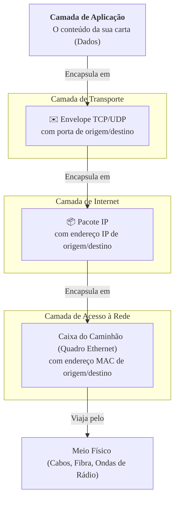

### Olá, futuro(a) aprovado(a)\! Vamos desvendar o emaranhado das Redes de Computadores para você navegar com tranquilidade na prova do Cebraspe.

Pense em redes e na internet como um gigantesco e complexo **serviço de entregas dos Correios** 🚚. Cada conceito que vamos ver é uma parte desse sistema, desde o endereço no envelope até o tipo de frete escolhido.

-----

### \#\#\# Arquitetura TCP/IP e Endereçamento: A Estrutura dos Correios

A arquitetura TCP/IP é o "organograma" dos Correios, dividido em 4 departamentos (camadas).

1.  **Aplicação:** É o **cliente**, a pessoa que escreve a carta (os dados) e a coloca no envelope (ex: usando o navegador, um cliente de e-mail). Protocolos: HTTP, SMTP, DNS.
2.  **Transporte:** É o **setor de triagem** da agência. Ele olha a sua carta e decide se ela vai por **SEDEX com rastreamento (TCP)** ou por **carta simples (UDP)**.
3.  **Internet (Rede):** São os **carteiros, os caminhões e os aviões**. Eles leem o **endereço IP** (o CEP e a cidade) e decidem a melhor rota para o pacote chegar à cidade de destino.
4.  **Acesso à Rede (Enlace):** É a **rua e o número da agência** dos Correios (o endereço físico, MAC) e o meio físico (o asfalto, os cabos) por onde o caminhão vai passar.

<!-- end list -->

  * **NAT (Network Address Translation):** É a **portaria de um condomínio**. O carteiro entrega todas as encomendas na portaria (que tem um único endereço público). O porteiro, então, olha o número do apartamento (endereço privado) e entrega a encomenda para o morador certo.

> #### Foco Cebraspe (Pontos de Atenção e "Pegadinhas")
>
> >   * **Cálculo de Sub-redes:** A banca vai te dar um endereço IP com uma máscara (ex: `192.168.10.100 /26`) e pedir o endereço da rede, de broadcast ou o número de hosts. É fundamental saber fazer esse cálculo.
> >   * **Endereços Privados:** Decore os "CEPs" internos que não podem ser usados na internet: **`10.x.x.x`**, **`172.16.x.x` a `172.31.x.x`**, e **`192.168.x.x`**.
> >   * **Propósito do NAT:** O objetivo principal do NAT é **economizar endereços IPv4**, não a segurança. A segurança de esconder sua rede interna é um efeito colateral positivo, não o objetivo primário.

-----

### \#\#\# TCP e UDP: SEDEX com Rastreamento vs. Carta Simples

Na camada de Transporte, você escolhe o tipo de "frete".

| Característica | TCP (SEDEX com AR) | UDP (Carta Simples) |
| :--- | :--- | :--- |
| **Conexão** | **Orientado à Conexão:** Você liga antes para avisar que a encomenda vai chegar (*three-way handshake*). | **Não Orientado à Conexão:** Você só joga a carta na caixa de correio. |
| **Confiabilidade** | **Confiável:** Tem código de rastreamento (números de sequência), aviso de recebimento (ACKs) e reenvio se a encomenda se perder. | **Não Confiável:** Sem garantias. A carta pode se perder, chegar fora de ordem ou duplicada. |
| **Velocidade** | Mais lento (devido a todos os controles). | Muito rápido e leve (pouca burocracia). |
| **Caso de Uso** | E-mail, download de arquivos, páginas web. (Onde cada pedacinho da informação é crucial). | Streaming de vídeo, VoIP, jogos online. (Onde a velocidade é mais importante que a perda de um ou outro pacote). |

> #### Foco Cebraspe (Pontos de Atenção e "Pegadinhas")
>
> >   * A principal diferença é a **confiabilidade**. A banca vai dar um exemplo de aplicação (ex: "transmissão de um jogo de futebol ao vivo") e perguntar o protocolo ideal (neste caso, **UDP**).

-----

### \#\#\# Equipamentos de Rede: A Infraestrutura dos Correios

  * **Hub (O Estagiário 🤪):** Um funcionário novato e "burro" (Camada 1). Quando recebe uma carta, ele não lê o destinatário. Ele tira cópia e grita para todo mundo na sala. Causa a maior confusão (domínio de colisão).
  * **Switch (O Funcionário Eficiente 🤓):** Um funcionário esperto (Camada 2). Ele tem uma lista com o nome de cada pessoa e sua respectiva mesa (tabela MAC). Ele entrega a carta **apenas** na mesa do destinatário correto.
  * **Roteador (O Gerente da Agência 👨‍💼):** O chefe da agência (Camada 3). Ele não se importa com o nome da pessoa (MAC), só com o **CEP e a cidade (IP)**. Sua função é conectar redes diferentes, ou seja, enviar o malote de cartas para a agência da cidade correta.
  * **VLAN:** É criar "departamentos virtuais" dentro de uma mesma agência. As cartas do "Financeiro" só circulam entre as mesas do "Financeiro". Para uma carta ir do "Financeiro" para o "RH", ela precisa passar pela mesa do gerente (roteador).

> #### Foco Cebraspe (Pontos de Atenção e "Pegadinhas")
>
> >   * **Hub vs. Switch:** **Hub** é burro (repete tudo), **Switch** é inteligente (usa endereço MAC).
> >   * **Switch vs. Roteador:** **Switch** trabalha dentro da mesma rede (com MAC). **Roteador** conecta redes diferentes (com IP).
> >   * **Domínio de Colisão vs. Broadcast:** **Switches** quebram domínios de colisão. **Roteadores** (e VLANs) quebram domínios de broadcast.

-----

### \#\#\# Protocolos da Camada de Aplicação: Os Tipos de Carta

  * **DNS:** A **lista telefônica** da internet. Traduz um nome (www.cebraspe.org.br) para um número de telefone (endereço IP).
  * **HTTP/HTTPS:** O protocolo para pedir e receber o conteúdo de uma revista (página web). **HTTPS** é o mesmo, mas o envelope vem lacrado e criptografado.
  * **SMTP:** O protocolo para **enviar** um e-mail. É o ato de colocar a carta na caixa de correio.
  * **FTP:** O protocolo para **transferir arquivos**, como enviar uma caixa grande.
  * **SSH:** Uma linha de telefone **segura e criptografada** para dar comandos a um computador remoto.

> #### Foco Cebraspe (Pontos de Atenção e "Pegadinhas")
>
> >   * A banca vai trocar as funções\! "SMTP é usado para ler e-mails". **ERRADO\!** SMTP é para **enviar**. Para ler/receber, usamos POP3 ou IMAP.
> >   * Decore as portas padrão: DNS(53), HTTP(80), HTTPS(443), SMTP(25), FTP(20, 21), SSH(22).

-----

### \#\#\# Outras Tecnologias: Serviços e Ferramentas Especiais

  * **VPN:** Um **túnel blindado e secreto** para o caminhão dos Correios passar por uma área perigosa (a internet pública) e chegar em segurança na outra agência.
  * **Wi-Fi:** O carteiro que entrega as cartas pelo ar, sem usar fios. **WEP** é um protocolo de segurança antigo e fraco. **WPA3** é o mais moderno e seguro.
  * **Utilitários de Diagnóstico:**
      * **`ping`:** Ligar para o destinatário e perguntar "Alô, está me ouvindo?". Testa a conectividade.
      * **`tracert`:** O serviço de rastreamento que mostra todas as cidades por onde sua encomenda passou.

> #### Foco Cebraspe (Pontos de Atenção e "Pegadinhas")
>
> >   * **Segurança Wi-Fi:** WEP é obsoleto e inseguro. WPA2 é o mínimo aceitável hoje, e WPA3 é o mais forte.
> >   * Para diagnosticar um problema de conectividade, a primeira ferramenta a usar é o **`ping`**. Para descobrir onde a conexão está parando no meio do caminho, usa-se o **`tracert`**.

### \#\#\# Mapa Mental: O Encapsulamento da Carta

### **Classe:** A
### **Conteúdo:** Redes: Arquitetura TCP/IP e Endereçamento

---

### **1. Arquitetura TCP/IP e Endereçamento**

> #### **TEORIA-ALVO**
> A arquitetura TCP/IP é o conjunto de protocolos que forma a base da Internet. É um modelo de referência dividido em camadas, cada uma com funções específicas. O endereçamento IP é o mecanismo que permite a identificação única de cada dispositivo na rede.
>
> * **Modelo TCP/IP (Modelo de 4 Camadas):**
>     1.  **Aplicação:** Onde as aplicações de rede operam. Fornece a interface para o usuário. Protocolos: HTTP, FTP, SMTP, DNS.
>     2.  **Transporte:** Responsável pela comunicação de ponta a ponta (processo a processo) entre hosts. Protocolos: TCP e UDP.
>     3.  **Internet (ou Rede):** Responsável pelo endereçamento lógico e roteamento de pacotes entre redes distintas. Protocolo: IP.
>     4.  **Acesso à Rede (ou Enlace):** Responsável pelo acesso ao meio físico e pelo endereçamento físico. Protocolos/Tecnologias: Ethernet, Wi-Fi.
> * **Endereçamento IPv4:**
>     * **Estrutura:** Um endereço IPv4 é um número de 32 bits, usualmente representado por quatro octetos em notação decimal (e.g., `192.168.0.1`).
>     * **Máscara de Sub-rede:** Um número de 32 bits que divide o endereço IP em duas partes: o **prefixo de rede** e o **identificador de host**.
>     * **Classes de Endereços (Legado):** Sistema original de divisão de endereços. Embora superado pelo CIDR (Classless Inter-Domain Routing), seus conceitos são cobrados.
>         * **Classe A:** Primeiro octeto 1-126. Máscara padrão: `255.0.0.0` (/8).
>         * **Classe B:** Primeiro octeto 128-191. Máscara padrão: `255.255.0.0` (/16).
>         * **Classe C:** Primeiro octeto 192-223. Máscara padrão: `255.255.255.0` (/24).
> * **NAT (Network Address Translation):**
>     * **Definição:** Técnica que permite que múltiplos dispositivos em uma rede privada compartilhem um ou mais endereços IP públicos para acessar a Internet. O roteador na borda da rede traduz os endereços privados em endereços públicos. A forma mais comum é o **PAT (Port Address Translation)**, que utiliza números de porta para diferenciar as conexões.

> #### **FOCO CEBRASPE (Pontos de Atenção e "Pegadinhas")**
> > * **Camadas TCP/IP vs. OSI:** A banca pode confundir os modelos. O modelo TCP/IP é um modelo prático, enquanto o OSI é um modelo de referência teórico com 7 camadas. A camada de Aplicação do TCP/IP corresponde, aproximadamente, às camadas de Aplicação, Apresentação e Sessão do OSI.
> > * **Cálculo de Sub-redes:** A banca pode fornecer um endereço IP e uma máscara (e.g., `192.168.10.100 /26`) e solicitar o endereço de rede, o endereço de broadcast ou o número de hosts válidos. É mandatório saber realizar esses cálculos.
> > * **Endereços Privados (RFC 1918):** É fundamental memorizar as faixas de endereços privados não roteáveis na Internet: `10.0.0.0/8`, `172.16.0.0/12`, `192.168.0.0/16`.
> > * **Propósito do NAT:** O principal propósito do NAT é **conservar o espaço de endereçamento IPv4**, e não a segurança. A segurança (ocultar a estrutura da rede interna) é um efeito colateral, não o objetivo primário.

---

### **Classe:** A
### **Conteúdo:** Camada de Transporte: TCP e UDP

---

### **2. Protocolos TCP e UDP**

> #### **TEORIA-ALVO**
> TCP e UDP são os dois principais protocolos da camada de Transporte, responsáveis por estabelecer a comunicação lógica entre processos em hosts diferentes. Eles oferecem serviços distintos para a camada de Aplicação.
>
> * **TCP (Transmission Control Protocol):**
>     * **Orientado à Conexão:** Antes de transmitir dados, o TCP estabelece uma conexão através de um processo de saudação de três vias (*three-way handshake*: SYN, SYN-ACK, ACK).
>     * **Confiável:** Garante a entrega ordenada e sem erros dos dados. Utiliza números de sequência para ordenar os segmentos, e confirmações (ACKs) para garantir a entrega. Segmentos perdidos são retransmitidos.
>     * **Controle de Fluxo:** Utiliza um mecanismo de janela deslizante para evitar que um remetente rápido sobrecarregue um receptor lento.
>     * **Controle de Congestionamento:** Possui algoritmos para reduzir a taxa de transmissão em caso de congestionamento na rede.
> * **UDP (User Datagram Protocol):**
>     * **Não Orientado à Conexão:** Não estabelece uma conexão prévia. Os pacotes (datagramas) são enviados sem qualquer saudação inicial.
>     * **Não Confiável (*Best-Effort*):** Não oferece garantias. Os datagramas podem ser perdidos, chegar fora de ordem ou duplicados. Não há confirmações ou retransmissões.
>     * **Simples e Rápido:** Possui um cabeçalho muito menor e menos processamento (*overhead*) que o TCP, resultando em menor latência.

> #### **FOCO CEBRASPE (Pontos de Atenção e "Pegadinhas")**
> > * **TCP vs. UDP:** A comparação é um tópico clássico. A principal diferença reside na **confiabilidade**. **TCP** é confiável e ordenado, ao custo de maior *overhead*. **UDP** é rápido e simples, ao custo de não ser confiável.
> > * **Casos de Uso:** A banca vai perguntar qual protocolo de transporte é adequado para uma determinada aplicação.
> >     * **TCP:** Aplicações que exigem alta confiabilidade e não toleram perda de dados (e.g., HTTP para páginas web, FTP para transferência de arquivos, SMTP para e-mail).
> >     * **UDP:** Aplicações sensíveis à latência e que podem tolerar alguma perda de pacotes (e.g., DNS, streaming de vídeo, VoIP, jogos online).
> > * **Three-Way Handshake:** É o processo de estabelecimento de conexão do TCP. A sequência de flags `SYN`, `SYN-ACK`, `ACK` é frequentemente questionada.

---

### **Classe:** A
### **Conteúdo:** Equipamentos de Interconexão e Tecnologias de Rede

---

### **3. Equipamentos de Interconexão e Tecnologias de Rede**

> #### **TEORIA-ALVO**
> Redes são construídas pela interconexão de dispositivos através de equipamentos especializados, cada um operando em uma camada específica do modelo de referência.
>
> * **Equipamentos de Camada 1 (Física):**
>     * **Hub (Concentrador):** Dispositivo que interconecta múltiplos hosts. Atua como um repetidor multiportas: qualquer sinal recebido em uma porta é retransmitido para todas as outras portas. Todos os dispositivos conectados a um hub compartilham o mesmo **domínio de colisão**.
> * **Equipamentos de Camada 2 (Enlace):**
>     * **Switch (Comutador):** Dispositivo "inteligente" que interconecta hosts. Aprende os endereços **MAC** dos dispositivos conectados a cada uma de suas portas e os armazena em uma tabela MAC. Encaminha os quadros (*frames*) apenas para a porta de destino, e não para todas. Cada porta de um switch é um **domínio de colisão** separado.
>     * **Tecnologia Ethernet (IEEE 802.3):** O padrão predominante para redes locais (LANs). Define o formato do quadro, o endereçamento MAC e o método de acesso ao meio CSMA/CD (em redes legadas baseadas em hubs).
> * **Equipamentos de Camada 3 (Rede):**
>     * **Roteador:** Dispositivo que conecta redes logicamente distintas (sub-redes). Toma decisões de encaminhamento com base nos **endereços IP** de destino dos pacotes. Cada porta de um roteador define um **domínio de broadcast** separado.
> * **VLAN (Virtual LAN - IEEE 802.1Q):**
>     * Tecnologia que permite criar múltiplas redes locais virtuais e logicamente separadas sobre a mesma infraestrutura de rede física. VLANs são configuradas em switches gerenciáveis e servem para segmentar domínios de broadcast, aumentando a segurança e a organização da rede. A comunicação entre VLANs diferentes requer um roteador (roteamento inter-VLAN).

> #### **FOCO CEBRASPE (Pontos de Atenção e "Pegadinhas")**
> > * **Hub vs. Switch:** É a distinção mais importante entre equipamentos. **Hub** (Camada 1) é burro, cria um único domínio de colisão. **Switch** (Camada 2) é inteligente, cria um domínio de colisão por porta e usa endereços MAC. A banca afirmará que hubs analisam endereços MAC. **ERRADO**.
> > * **Switch vs. Roteador:** Outra distinção crucial. **Switch** (Camada 2) opera dentro de uma mesma rede, usando endereços MAC. **Roteador** (Camada 3) conecta redes diferentes, usando endereços IP. Switches não bloqueiam broadcasts por padrão; roteadores sim.
> > * **Domínio de Colisão vs. Domínio de Broadcast:** A banca vai confundir os conceitos. **Domínios de colisão** são segmentados por switches e roteadores. **Domínios de broadcast** são segmentados apenas por roteadores (ou por VLANs).
> > * **Comunicação Inter-VLAN:** Dois hosts em VLANs diferentes não podem se comunicar diretamente através de um switch de camada 2. É necessário um dispositivo de camada 3, como um roteador ou um switch L3, para realizar o **roteamento inter-VLAN**.

---

### **Classe:** A
### **Conteúdo:** Protocolos da Camada de Aplicação

---

### **4. Protocolos da Camada de Aplicação**

> #### **TEORIA-ALVO**
> Estes protocolos definem as regras para a comunicação de aplicações específicas na rede, utilizando os serviços das camadas inferiores (tipicamente TCP ou UDP).
>
> * **DNS (Domain Name System) - Porta 53 (UDP/TCP):** Resolve (traduz) nomes de domínio legíveis por humanos (e.g., `www.google.com`) para seus respectivos endereços IP. Utiliza UDP para consultas rápidas e TCP para transferências de zona.
> * **HTTP (Hypertext Transfer Protocol) - Porta 80:** Protocolo sem estado (*stateless*) que fundamenta a comunicação na World Wide Web. Usado para transferir páginas HTML, imagens e outros recursos.
> * **HTTPS (HTTP Secure) - Porta 443:** É o protocolo HTTP operando sobre uma camada de segurança, o **TLS (Transport Layer Security)**, que fornece criptografia, integridade e autenticação.
> * **SMTP (Simple Mail Transfer Protocol) - Porta 25:** Protocolo padrão para o **envio** de correio eletrônico entre servidores de e-mail.
> * **FTP (File Transfer Protocol) - Portas 21 (Controle) e 20 (Dados):** Protocolo para a transferência de arquivos. Opera com duas conexões separadas.
> * **SSH (Secure Shell) - Porta 22:** Protocolo que permite o estabelecimento de um canal seguro para acesso a terminais remotos e outros serviços de rede de forma criptografada.

> #### **FOCO CEBRASPE (Pontos de Atenção e "Pegadinhas")**
> > * **Portas Padrão:** O conhecimento das portas padrão dos principais serviços é frequentemente exigido.
> > * **Função dos Protocolos:** A banca vai confundir as funções. "O protocolo HTTP é utilizado para o envio seguro de e-mails". **ERRADO**. Isso seria SMTP (para envio) e HTTPS (para segurança web). "DNS é responsável por rotear pacotes na Internet". **ERRADO**. Essa é a função do IP. DNS é para resolução de nomes.
> > * **SMTP vs. POP3/IMAP:** SMTP é um protocolo de **envio** (*push*). POP3 e IMAP são protocolos de **recebimento** (*pull*) de e-mails, utilizados por clientes de e-mail para baixar mensagens do servidor. A banca afirmará que SMTP é usado para ler e-mails. **ERRADO**.
> > * **HTTP é Stateless:** Cada requisição HTTP é independente das anteriores. O servidor não guarda o estado do cliente entre as requisições. Mecanismos como *cookies* são usados para criar uma noção de sessão sobre o protocolo HTTP, que é fundamentalmente sem estado.

---

### **Classe:** B/C
### **Conteúdo:** Outras Tecnologias, Protocolos e Utilitários

---

### **5. Outras Tecnologias, Protocolos e Utilitários**

> #### **TEORIA-ALVO**
> Além dos conceitos centrais, diversas outras tecnologias, protocolos e ferramentas complementam a infraestrutura e o gerenciamento de redes.
>
> * **VPN (Virtual Private Network):** Cria um "túnel" seguro e criptografado sobre uma rede pública (como a Internet). Permite que usuários remotos ou escritórios se conectem de forma segura à rede privada de uma organização. Protocolos comuns incluem IPsec e OpenVPN.
> * **Redes sem Fio (Wi-Fi - IEEE 802.11):** Padrão para redes locais sem fio. A segurança é um aspecto crucial, com a evolução dos protocolos: WEP (inseguro), WPA, WPA2 (padrão mínimo atual, usa criptografia AES), e WPA3 (mais recente).
> * **SNMP (Simple Network Management Protocol) - Portas 161/162:** Protocolo da camada de aplicação para gerenciamento e monitoramento de dispositivos de rede (roteadores, switches, servidores). Componentes: Gerente, Agente e MIB (Management Information Base).
> * **RADIUS (Remote Authentication Dial-In User Service):** Protocolo cliente-servidor que fornece gerenciamento centralizado de Autenticação, Autorização e Contabilização (AAA) para usuários que se conectam e utilizam um serviço de rede.
> * **Utilitários de Diagnóstico:**
>     * **`ping`:** Usa pacotes ICMP para testar a conectividade e latência com um host de destino.
>     * **`tracert` (ou `traceroute`):** Exibe a rota (sequência de roteadores) que um pacote percorre até o destino.
>     * **`netstat`:** Exibe as conexões de rede ativas, tabelas de roteamento e outras estatísticas de interface.
>     * **`ipconfig` (Windows) / `ifconfig` (Unix-like):** Exibe a configuração dos adaptadores de rede do host local.

> #### **FOCO CEBRASPE (Pontos de Atenção e "Pegadinhas")**
> > * **Propósito da VPN:** O conceito-chave é a criação de um canal de comunicação **seguro e criptografado** sobre uma rede **pública e insegura**.
> > * **Segurança Wi-Fi:** A hierarquia de segurança é WPA3 > WPA2 > WPA > WEP. A banca pode afirmar que WEP é um protocolo seguro. **ERRADO**. É obsoleto e comprovadamente vulnerável.
> > * **Função das Ferramentas:** A banca descreverá um problema de rede e perguntará qual utilitário é o mais apropriado para o diagnóstico. Para verificar a conectividade básica, usa-se `ping`. Para identificar um gargalo ou falha em um ponto intermediário da rota, usa-se `tracert`.
> > * **SNMP:** SNMP é o protocolo padrão para **gerenciamento de rede**. A MIB é a base de dados que descreve as variáveis do dispositivo gerenciado que podem ser consultadas ou alteradas.
