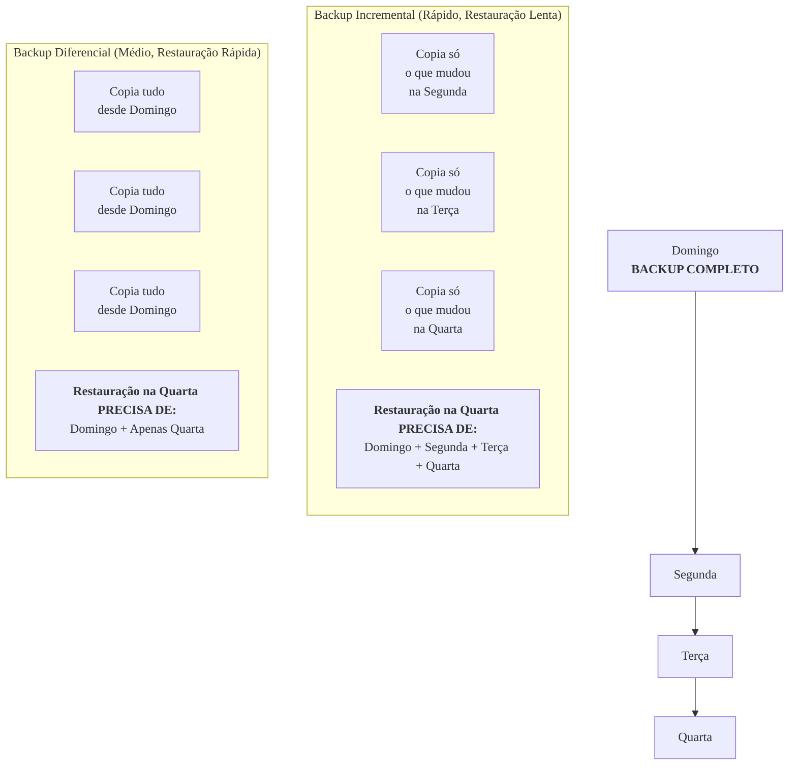

### Olá, futuro(a) aprovado(a)\! Vamos construir seu conhecimento em Virtualização e Armazenamento para você garantir uma base sólida na prova do Cebraspe.

Pense no gerenciamento de servidores e dados como a **administração de um grande prédio comercial** 🏢. A virtualização permite dividir o prédio em escritórios, e o armazenamento cuida do arquivo central de documentos.

-----

### \#\#\# Virtualização de Servidores: Dividindo o Prédio em Escritórios

Em vez de construir um prédio para cada empresa (um servidor físico para cada aplicação), a virtualização permite construir um único prédio gigante e dividi-lo em vários **escritórios independentes e isolados (as Máquinas Virtuais - VMs)**.

  * **Os Componentes da Obra:**

      * **Host:** O prédio físico.
      * **Hypervisor:** A **administradora do condomínio**. É o software que gerencia o prédio, cria os escritórios e distribui os recursos (luz, água, espaço) para cada um.
      * **Máquina Virtual (VM):** O **escritório alugado**. Para a empresa que está lá dentro, parece que ela tem um prédio inteiro só para ela, com suas próprias paredes, portas e segurança (seu próprio sistema operacional).

  * **Tipos de Administradora (Hypervisor):**

      * **Tipo 1 (Bare-metal):** A administradora **É** o próprio sistema do prédio, instalada diretamente na fundação (hardware). É a mais eficiente e segura, usada em grandes datacenters. Ex: **VMware ESXi, Microsoft Hyper-V**.
      * **Tipo 2 (Hosted):** A administradora é um **aplicativo** que você instala em um sistema operacional que já existe no prédio (ex: instala o VirtualBox dentro do seu Windows). É mais fácil, ideal para testes no seu computador pessoal. Ex: **Oracle VirtualBox, VMware Workstation**.

> #### Foco Cebraspe (Pontos de Atenção e "Pegadinhas")
>
> >   * **Virtualização vs. Contêineres:** A pegadinha mais quente do momento\!
> >       * **VM (Escritório Completo):** Virtualiza o **hardware**. Cada escritório tem suas próprias paredes, teto e banheiro. É mais pesado e isolado.
> >       * **Contêiner (Coworking):** Virtualiza o **sistema operacional**. Várias empresas trabalham em um grande salão aberto, compartilhando o mesmo banheiro e copa (o kernel do SO do host). É muito mais leve e rápido.
> >   * A banca vai dizer que uma VM compartilha o kernel do host. **ERRADO\!** Quem faz isso é o contêiner.
> >   * **Tipo 1 vs. Tipo 2:** A banca vai dizer que o ESXi (Tipo 1) roda em cima do Windows. **ERRADO\!** O Tipo 1 roda direto no hardware.

-----

### \#\#\# Backup e Restauração: As Cópias de Segurança do Arquivo

O arquivo central do prédio precisa de cópias de segurança.

  * **Backup Completo (Full):** Tirar uma fotocópia de **TODOS** os documentos do arquivo.

      * **Restauração:** Fácil\! É só pegar a última pilha de cópias.
      * **Problema:** Demora muito e gasta muito papel (espaço).

  * **Backup Incremental:** Na segunda, você faz o completo. Na terça, copia **só o que mudou na terça**. Na quarta, copia **só o que mudou na quarta**.

      * **Vantagem:** Super rápido de fazer.
      * **Restauração:** Um pesadelo\! Para restaurar na quarta, você precisa da cópia da **segunda + a de terça + a de quarta**, em ordem.

  * **Backup Diferencial:** Na segunda, você faz o completo. Na terça, copia **tudo o que mudou desde segunda**. Na quarta, copia **tudo o que mudou desde segunda**.

      * **Vantagem:** Mais rápido que o completo, mais fácil de restaurar que o incremental.
      * **Restauração:** Fácil\! Para restaurar na quarta, você só precisa da cópia da **segunda + a última, de quarta**.

> #### Foco Cebraspe (Pontos de Atenção e "Pegadinhas")
>
> >   * A questão clássica: "Ocorreu um desastre na quinta-feira. Para restaurar um backup **incremental**, você precisa do completo de domingo + incremental de segunda + de terça + de quarta. Para um **diferencial**, você precisa do completo de domingo + **apenas** o diferencial de quarta." A banca VAI testar isso.
> >   * **Backup vs. Arquivamento:** **Backup** é para recuperação de desastres (curto prazo). **Arquivamento** é para guardar documentos antigos por muito tempo (longo prazo), geralmente por força de lei.

-----

### \#\#\# Arquiteturas de Armazenamento: O Arquivo Central

  * **NAS (Network Attached Storage):** É um **servidor de arquivos** na rede do prédio. Para os funcionários, ele aparece como uma "pasta na rede" (`\\arquivos\documentos`). Você acessa os dados pelo **nome do arquivo**. Protocolos: **SMB/CIFS** (linguagem do Windows) e **NFS** (linguagem do Linux).

  * **SAN (Storage Area Network):** É uma **rede privada de altíssima velocidade**, só para o armazenamento. Para o seu computador, o armazenamento da SAN aparece como se fosse um **HD novo que você espetou no seu PC (D:, E:)**. Você acessa os dados em **blocos**, não em arquivos. Protocolos: **Fibre Channel, iSCSI**.

  * **RAID:** Juntar vários HDs para formar um "super HD".

      * **RAID 0 (Foco em Desempenho):** Divide os dados entre os HDs. Super rápido, mas se um HD quebrar, você perde tudo.
      * **RAID 1 (Foco em Redundância):** Espelha os dados. Tudo que é escrito em um HD é copiado no outro. Se um quebrar, o outro assume.
      * **RAID 5 (Equilíbrio):** Usa um sistema inteligente de paridade. Tolera a falha de um disco.

> #### Foco Cebraspe (Pontos de Atenção e "Pegadinhas")
>
> >   * A diferença fundamental: **NAS = Arquivos** (ex: NFS, SMB). **SAN = Blocos** (ex: iSCSI, FC). A banca vai dizer que uma SAN usa NFS. **ERRADO\!**
> >   * **RAID 0 não tem redundância\!** A banca vai dizer que ele aumenta a segurança. **ERRADO\!** Ele aumenta o risco de perda de dados.

-----

### \#\#\# Sistemas de Arquivos: A Organização das Gavetas

  * **HDD vs. SSD:**

      * **HDD (Disco Rígido):** Um arquivo antigo, com um braço mecânico que precisa se mover para achar a pasta. É mais lento.
      * **SSD (Unidade de Estado Sólido):** Um arquivo digital, sem partes móveis. Acha qualquer pasta instantaneamente. É muito mais rápido.

  * **NTFS e EXT4:** A "linguagem" que cada sistema operacional usa para organizar as gavetas do arquivo. **NTFS** é a linguagem do Windows. **EXT4** é a do Linux.

  * **Journaling (O "Rascunho" do Arquivista):**
    Antes de guardar uma pasta em seu lugar definitivo, o sistema de arquivos anota em um "diário" (*journal*): "Vou mover a pasta X para a gaveta Y". Se a luz acabar no meio do caminho, ao reiniciar, ele lê o diário e conserta a bagunça rapidamente, sem precisar checar o arquivo inteiro.

> #### Foco Cebraspe (Pontos de Atenção e "Pegadinhas")
>
> >   * A banca vai pedir a mídia de armazenamento ideal para um banco de dados com alta demanda de performance. A resposta é **SSD**.
> >   * A função do **Journaling** é garantir a **consistência** e acelerar a **recuperação** do sistema de arquivos após uma falha.

### \#\#\# Mapa Mental: Comparativo dos Tipos de Backup

### **Classe:** B
### **Conteúdo:** Virtualização: Conceitos Básicos

---

### **1. Virtualização de Servidores**

> #### **TEORIA-ALVO**
> A virtualização é a tecnologia que permite a criação de uma representação virtual de um recurso computacional, como um servidor, um dispositivo de armazenamento ou uma rede. No contexto de servidores, ela possibilita a execução de múltiplos sistemas operacionais e suas aplicações de forma isolada em um único servidor físico.
>
> * **Componentes:**
>     * **Host:** A máquina física que hospeda os recursos.
>     * **Hypervisor (ou VMM - *Virtual Machine Monitor*):** A camada de software ou firmware que cria, executa e gerencia as máquinas virtuais. Ele é responsável por abstrair o hardware do host e alocar os recursos para as VMs.
>     * **Máquina Virtual (VM):** Um ambiente computacional completo e isolado, que inclui seu próprio sistema operacional (SO Convidado) e aplicações. Do ponto de vista do SO Convidado, a VM se comporta como um computador físico independente.
> * **Tipos de Hypervisor:**
>     * **Tipo 1 (Bare-metal):** É instalado e executado diretamente sobre o hardware do host, funcionando como um sistema operacional especializado em virtualização. Oferece alto desempenho e segurança, sendo o padrão para ambientes de datacenter. Exemplos: VMware ESXi, Microsoft Hyper-V, KVM (Kernel-based Virtual Machine).
>     * **Tipo 2 (Hosted):** É executado como uma aplicação sobre um sistema operacional convencional (SO Hospedeiro), que por sua vez roda no hardware. É mais simples de instalar e gerenciar, sendo comum em desktops para fins de desenvolvimento e teste. Exemplos: VMware Workstation, Oracle VirtualBox.

> #### **FOCO CEBRASPE (Pontos de Atenção e "Pegadinhas")**
> > * **Virtualização vs. Containerização:** Esta é a distinção técnica mais relevante. A **Virtualização** cria uma VM completa, que virtualiza o **hardware** e possui seu próprio kernel de sistema operacional. A **Containerização** (e.g., Docker) virtualiza o **sistema operacional**, com os contêineres compartilhando o kernel do SO hospedeiro. Consequentemente, contêineres são mais leves, mais rápidos para iniciar e consomem menos recursos que VMs. A banca afirmará que uma VM compartilha o kernel do sistema operacional do host. **ERRADO**.
> > * **Hypervisor Tipo 1 vs. Tipo 2:** A banca vai confundir as características. O **Tipo 1** (bare-metal) é executado diretamente no hardware, sem a necessidade de um SO hospedeiro subjacente. O **Tipo 2** (hosted) é uma aplicação que roda sobre um SO hospedeiro. Afirmar que o VMware ESXi é um hypervisor do tipo 2 está **ERRADO**.
> > * **Benefícios da Virtualização:** Os principais benefícios são a **consolidação de servidores** (redução de custos com hardware e energia), a **otimização do uso de recursos**, a **agilidade** no provisionamento de novos ambientes e a facilidade na criação de ambientes de recuperação de desastres.

---

### **Classe:** B
### **Conteúdo:** Armazenamento: Backup e Restauração

---

### **2. Backup e Restauração**

> #### **TEORIA-ALVO**
> O processo de **backup** consiste na criação de cópias de segurança de dados, visando protegê-los contra perda, corrupção ou desastres. A **restauração** é o processo de recuperar os dados a partir de uma cópia de backup. Existem três estratégias principais de backup.
>
> * **Tipos de Backup:**
>     * **Backup Completo (Full):** Copia todos os dados e arquivos selecionados para a mídia de backup. O atributo de arquivo "archive" é marcado como processado (desativado).
>         * **Vantagens:** Restauração simples e rápida, pois requer apenas o último backup completo.
>         * **Desvantagens:** Mais demorado e consome mais espaço de armazenamento.
>     * **Backup Incremental:** Copia apenas os arquivos que foram criados ou alterados desde o **último backup de qualquer tipo** (seja ele completo ou incremental). Também marca o atributo "archive" como processado.
>         * **Vantagens:** Rápido e consome o mínimo de espaço.
>         * **Desvantagens:** Restauração mais lenta e complexa, pois exige o último backup completo e **todos** os backups incrementais subsequentes em ordem.
>     * **Backup Diferencial:** Copia todos os arquivos que foram criados ou alterados desde o **último backup completo**. Não altera o atributo "archive".
>         * **Vantagens:** Mais rápido que o completo; restauração mais simples que a do incremental.
>         * **Desvantagens:** Consome mais espaço que o incremental ao longo do tempo, pois cada backup diferencial cresce até o próximo backup completo.
> * **Processo de Restauração:**
>     * **Para restaurar a partir de backups incrementais:** É necessário o último backup completo **MAIS** todos os backups incrementais feitos desde então.
>     * **Para restaurar a partir de backups diferenciais:** É necessário o último backup completo **MAIS** apenas o último backup diferencial.

> #### **FOCO CEBRASPE (Pontos de Atenção e "Pegadinhas")**
> > * **Restauração Incremental vs. Diferencial:** Este é o ponto mais crítico e frequentemente cobrado. A banca fornecerá um cronograma de backups (e.g., completo no domingo, e o restante da semana com backups incrementais ou diferenciais) e perguntará quais mídias são necessárias para uma restauração em um dia específico. É mandatório saber a diferença no processo de restauração de cada tipo.
> > * **Atributo de Arquivo (*Archive Bit*):** O funcionamento do backup incremental e completo depende da manipulação do atributo de arquivo. Ambos **limpam** o atributo após copiarem o arquivo. O backup diferencial **não** limpa o atributo.
> > * **Backup vs. Arquivamento:** A banca pode confundir os conceitos. **Backup** é para fins de **recuperação de desastres**. **Arquivamento** é para a retenção de dados a longo prazo, geralmente por razões legais ou de conformidade, movendo dados inativos para um armazenamento mais barato.

---

### **Classe:** C
### **Conteúdo:** Arquiteturas de Armazenamento e Protocolos

---

### **3. Arquiteturas e Protocolos de Armazenamento**

> #### **TEORIA-ALVO**
> Para atender às demandas de grande volume e alta disponibilidade, as organizações utilizam arquiteturas de armazenamento centralizadas e em rede, como NAS e SAN.
>
> * **NAS (Network Attached Storage):**
>     * **Definição:** Um dispositivo de armazenamento dedicado conectado a uma rede local (LAN) que fornece acesso a dados no nível de **arquivo**.
>     * **Funcionamento:** Para os clientes na rede, o NAS se comporta como um servidor de arquivos. A comunicação ocorre via rede Ethernet padrão.
>     * **Protocolos:** Utiliza protocolos de compartilhamento de arquivos, como **SMB/CIFS** (para ambientes Windows) e **NFS** (para ambientes Unix/Linux).
> * **SAN (Storage Area Network):**
>     * **Definição:** Uma rede de alta velocidade, separada da LAN, dedicada a conectar servidores a dispositivos de armazenamento, fornecendo acesso no nível de **bloco**.
>     * **Funcionamento:** Para o sistema operacional do servidor conectado à SAN, o armazenamento aparece como se fosse um disco local diretamente conectado.
>     * **Protocolos:** Utiliza protocolos de bloco, como **Fibre Channel (FC)**, que requer hardware dedicado (HBAs, switches FC), ou **iSCSI**, que encapsula comandos SCSI em pacotes IP para rodar sobre redes Ethernet padrão.
> * **RAID (Redundant Array of Independent Disks):**
>     * **Definição:** Tecnologia que combina múltiplos discos rígidos em uma única unidade lógica para melhorar o **desempenho**, a **tolerância a falhas (redundância)**, ou ambos.
>     * **Níveis Comuns:**
>         * **RAID 0 (Stripping):** Foco em desempenho; sem redundância.
>         * **RAID 1 (Mirroring):** Foco em redundância; espelhamento de dados.
>         * **RAID 5 (Paridade Distribuída):** Equilíbrio entre desempenho, capacidade e redundância; tolera a falha de **um** disco.
>         * **RAID 10 (ou 1+0):** Combinação de espelhamento e divisão; oferece alto desempenho e alta redundância.

> #### **FOCO CEBRASPE (Pontos de Atenção e "Pegadinhas")**
> > * **NAS vs. SAN: Nível de Acesso:** Esta é a distinção fundamental. **NAS** fornece acesso a **arquivos**. **SAN** fornece acesso a **blocos**. A banca afirmará que "uma SAN utiliza o protocolo NFS para acesso aos dados". **ERRADO**. NFS é um protocolo de acesso a arquivos, utilizado por NAS. SAN utiliza protocolos de bloco como Fibre Channel ou iSCSI.
> > * **Protocolos de Compartilhamento (SMB vs. NFS):** É crucial associar o protocolo ao seu ecossistema nativo. **SMB/CIFS** é o padrão do mundo **Windows**. **NFS** é o padrão do mundo **Linux/Unix**.
> > * **RAID: Desempenho vs. Redundância:** A banca vai confundir os objetivos dos níveis de RAID. **RAID 0** oferece o melhor desempenho de escrita, mas **nenhuma redundância**. A falha de qualquer disco em um RAID 0 resulta na perda de todos os dados do arranjo. **RAID 1** oferece a melhor redundância, mas "perde-se" metade da capacidade total dos discos para o espelhamento.

---

### **Classe:** C
### **Conteúdo:** Sistemas de Arquivos e Mídias

---

### **4. Sistemas de Arquivos e Mídias de Armazenamento**

> #### **TEORIA-ALVO**
> Um sistema de arquivos é a estrutura lógica que o sistema operacional utiliza para organizar, gerenciar e acessar os arquivos em um dispositivo de armazenamento (mídia).
>
> * **Mídias de Armazenamento:**
>     * **HDD (Hard Disk Drive):** Dispositivo de armazenamento magnético e mecânico. Composto por pratos giratórios e uma cabeça de leitura/gravação. Caracteriza-se por maior capacidade a um custo menor, mas com desempenho inferior devido à latência mecânica.
>     * **SSD (Solid-State Drive):** Dispositivo de armazenamento que utiliza memória flash (não volátil), sem partes móveis. Caracteriza-se por desempenho drasticamente superior (baixa latência e alto IOPS - operações de I/O por segundo), maior resistência a choques físicos e menor consumo de energia, a um custo por gigabyte mais elevado.
> * **Sistemas de Arquivos Comuns:**
>     * **NTFS (New Technology File System):** O sistema de arquivos padrão para as versões modernas do Microsoft Windows. Suporta funcionalidades avançadas como permissões de segurança em nível de arquivo e pasta, journaling (para recuperação rápida de consistência), compressão de arquivos e criptografia (EFS - Encrypting File System).
>     * **EXT4 (Fourth Extended Filesystem):** O sistema de arquivos padrão para a maioria das distribuições GNU/Linux. Suporta journaling, grandes volumes de armazenamento e arquivos, e possui alta performance e robustez.
> * **Journaling:**
>     * **Definição:** Característica fundamental de sistemas de arquivos modernos. Um *journal* (diário) é uma área especial do disco onde as alterações a serem feitas nos metadados do sistema de arquivos são registradas antes de serem efetivamente escritas. Em caso de falha (e.g., queda de energia), o sistema pode usar o *journal* para recuperar rapidamente a consistência, sem a necessidade de uma verificação completa do disco.

> #### **FOCO CEBRASPE (Pontos de Atenção e "Pegadinhas")**
> > * **HDD vs. SSD:** A principal diferença a ser testada é o **desempenho**. A banca pode apresentar um cenário que exige alta performance de I/O (e.g., um banco de dados transacional muito acessado) e perguntar qual mídia seria mais adequada. A resposta é **SSD**.
> > * **Propósito do Journaling:** A banca questionará a finalidade do *journaling*. Sua função primordial é garantir a **consistência** do sistema de arquivos e acelerar a **recuperação** após uma falha, reduzindo drasticamente o tempo de inatividade.
> > * **Compatibilidade:** É importante notar que sistemas operacionais possuem suporte nativo a seus próprios sistemas de arquivos (Windows para NTFS, Linux para EXT4). Embora existam drivers de terceiros para permitir a interoperabilidade, a banca geralmente considerará os cenários nativos.
