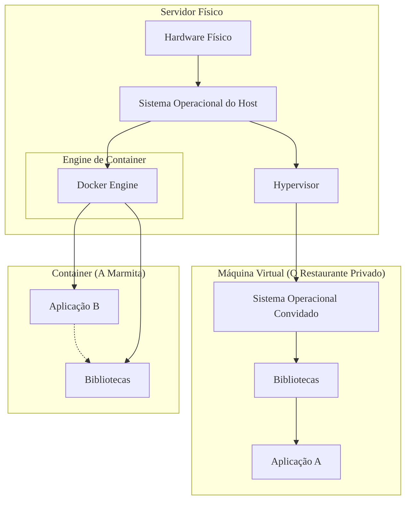

### Olá, futuro(a) aprovado(a)\! Vamos desempacotar o universo dos Containers e Kubernetes para você brilhar na prova do Cebraspe.

Pense em containers como a revolução da **entrega de comida por marmitas** 🍱. O jeito antigo, das **Máquinas Virtuais (VMs)**, era como alugar um restaurante inteiro, com cozinha e funcionários, só para preparar um prato. Com containers, a comida já vem pronta, em uma marmita padronizada, leve e que funciona em qualquer lugar.

-----

### \#\#\# Containers, Docker e OCI: A Revolução da Marmita

  * **O que é um Container?**
    É uma **marmita de software**: um pacote que contém uma aplicação e TODAS as suas dependências (ingredientes, temperos, etc.). Várias marmitas diferentes podem ser transportadas no mesmo caminhão-baú refrigerado (o servidor hospedeiro), **compartilhando o motor e as rodas do caminhão (o kernel do sistema operacional)**. Isso torna os containers muito mais leves e rápidos que as VMs.

  * **Docker (A Empresa que Inventou a Marmita Padrão):**
    É a plataforma que popularizou os containers.

      * **`Dockerfile`:** A **receita** para montar a marmita. Ex: "1. Pegue arroz. 2. Adicione feijão...".
      * **Imagem Docker:** O **modelo mestre congelado** da marmita, feito a partir da receita. É um template imutável.
      * **Container Docker:** A **marmita que foi aquecida** e está pronta para ser consumida. É a instância "viva" da imagem.

  * **Open Container Initiative (OCI):**
    É a "ANVISA" das marmitas. Um consórcio que criou um **padrão universal** para o formato das marmitas e para o "motor" que as executa. Isso garante que uma marmita feita pelo Docker funcione em um ambiente de um concorrente, como o Podman.

> #### Foco Cebraspe (Pontos de Atenção e "Pegadinhas")
>
> >   * **Containers vs. Máquinas Virtuais:** A pegadinha nº 1\!
> >       * **VM:** Virtualiza o **HARDWARE**. É o restaurante completo, com sua própria cozinha (seu próprio kernel de SO).
> >       * **Container:** Virtualiza o **SISTEMA OPERACIONAL**. É a marmita, que compartilha a cozinha (o kernel do SO do host).
> >   * A banca vai dizer que um container Docker tem seu próprio kernel. **ERRADO\!**
> >   * **Imagem vs. Container:** Lembre-se: **Imagem** é o molde congelado (a "classe"). **Container** é a marmita quente, em execução (o "objeto").

-----

### \#\#\# Orquestração com Kubernetes: Gerenciando a Praça de Alimentação

Gerenciar uma marmita é fácil. Mas e se você for o gerente de uma **praça de alimentação de um shopping gigante**, com milhares de marmitas sendo servidas? Você precisa de um orquestrador.

  * **Kubernetes (K8s):**
    É o **gerente geral super inteligente da praça de alimentação**. Ele automatiza a implantação, o escalonamento e o gerenciamento de todas as "lojas" (aplicações em container).

  * **Objetos Fundamentais do Kubernetes:**

      * **Pod (A Bandeja):** É a **menor unidade de serviço** do Kubernetes. Pense em uma bandeja. Ela pode ter só a marmita principal (1 container) ou a marmita + um potinho de molho (múltiplos containers). O Kubernetes gerencia **bandejas**, não marmitas individuais.
      * **Service (O Endereço da Loja):** É o endereço fixo do balcão de uma loja, por exemplo, "Lanchonete do Zé". Mesmo que as bandejas (Pods) com os sanduíches mudem de lugar lá dentro, o cliente sempre pede no mesmo balcão. O Service garante que seu pedido chegue a uma bandeja disponível.
      * **Deployment (A Ordem do Gerente):** É a ordem do gerente: "Quero que sempre existam **3 bandejas de sanduíche** prontas para servir\!". O Deployment garante que, se uma bandeja cair, uma nova é criada automaticamente para manter o estado desejado.

> #### Foco Cebraspe (Pontos de Atenção e "Pegadinhas")
>
> >   * **Kubernetes vs. Docker:** Não são concorrentes diretos. **Docker** cria a marmita. **Kubernetes** gerencia a praça de alimentação cheia de marmitas.
> >   * A unidade fundamental gerenciada pelo Kubernetes é o **Pod**, não o container diretamente.
> >   * A interação com o Kubernetes é **declarativa**. Você não diz "faça isso, depois aquilo". Você **declara o estado final desejado** ("quero 3 réplicas") e o Kubernetes se vira para fazer acontecer.

-----

### \#\#\# Arquitetura Distribuída e Boas Práticas: O Cardápio e a Cozinha

  * **Microserviços:** É o modelo da praça de alimentação. Em vez de um restaurante gigante que faz de tudo (monólito), você tem várias lojinhas pequenas e especializadas (pizzaria, temakeria, sorveteria). Cada uma é um microserviço, e os containers são perfeitos para empacotar cada uma dessas lojinhas de forma independente.

  * **Boas Práticas (Como Montar uma Boa Marmita):**

      * **Um Processo por Container:** A marmita de lasanha não deve vir com o sorvete de sobremesa dentro. Cada container tem uma única responsabilidade.
      * **Imagens Mínimas:** Use a menor embalagem possível (imagens base como `alpine`) para a marmita ficar mais leve e segura.
      * **Multi-stage Builds:** É como ter duas cozinhas. Uma **cozinha de preparo (build stage)**, cheia de tralha, onde você faz a lasanha. Depois, você pega **apenas a lasanha pronta** e a coloca em uma **marmita de entrega limpa e minimalista (final stage)**. O resultado final é muito mais enxuto.

> #### Foco Cebraspe (Pontos de Atenção e "Pegadinhas")
>
> >   * A banca vai perguntar o objetivo do **multi-stage build**. A resposta é: criar uma imagem final de produção **pequena e segura**, sem as ferramentas e dependências desnecessárias do processo de compilação.
> >   * **Imutabilidade:** Para atualizar a receita da lasanha, você não abre a marmita que está com o cliente e joga mais queijo. Você **cria uma nova versão da imagem (do modelo congelado)** e substitui as marmitas antigas pelas novas.

-----

### \#\#\# CDNs: A Rede de Franquias do Restaurante

  * **CDN (Content Delivery Network):**
    Uma grande rede de restaurantes, como o McDonald's, não tem uma única cozinha central no mundo. Ela tem **franquias (servidores de borda da CDN)** espalhadas por todas as cidades.
  * **Funcionamento:** Quando você, em Brasília, pede um Big Mac (acessa um site), o seu pedido não vai para a matriz nos EUA (o servidor de origem). Ele vai para a **franquia do McDonald's do seu bairro**, que já tem os ingredientes (o conteúdo em cache) prontos para montar seu sanduíche na hora. A entrega é muito mais rápida (baixa latência).

> #### Foco Cebraspe (Pontos de Atenção e "Pegadinhas")
>
> >   * A CDN **não substitui** o servidor de origem. A matriz (origem) ainda precisa existir para definir as receitas e mandar os ingredientes para as franquias (CDN).
> >   * A CDN é ideal para **conteúdo estático** (os ingredientes que não mudam, como pão, carne, picles).

### \#\#\# Mapa Mental: Máquina Virtual vs. Container

### **Classe:** B
### **Conteúdo:** Containers, Docker e OCI

---

### **1. Containers, Docker e Open Container Initiative (OCI)**

> #### **TEORIA-ALVO**
> Um **container** é um formato de virtualização no nível do sistema operacional que empacota uma aplicação e todas as suas dependências (bibliotecas, binários, arquivos de configuração) em uma unidade isolada e executável. Diferentemente de Máquinas Virtuais (VMs), containers compartilham o mesmo kernel do sistema operacional hospedeiro, tornando-os significativamente mais leves, rápidos e portáveis.
>
> * **Tecnologia Subjacente (Linux):**
>     * **Namespaces:** Isola os recursos do processo, como PID (processos), net (rede), mnt (pontos de montagem), etc., fazendo com que o container "enxergue" apenas seus próprios recursos.
>     * **cgroups (Control Groups):** Limita e gerencia o uso de recursos de hardware, como CPU, memória e I/O, por um processo ou grupo de processos.
> * **Docker:** É a plataforma de containerização predominante, que simplificou a criação e o gerenciamento de containers. Seus componentes principais são:
>     * **Dockerfile:** Um arquivo de texto que contém um conjunto de instruções para a construção de uma imagem Docker. É a "receita" da imagem.
>     * **Imagem Docker:** Um template estático e imutável, *read-only*, que contém as instruções para criar um container. Imagens são construídas em camadas.
>     * **Container Docker:** Uma instância executável e "viva" de uma imagem. É o ambiente isolado onde a aplicação roda.
> * **Open Container Initiative (OCI):** Um projeto da Linux Foundation que estabelece especificações abertas e padronizadas para formatos de imagem de container e *runtimes* (ambientes de execução). O objetivo é garantir a interoperabilidade entre diferentes ferramentas de containerização (como Docker, Podman, containerd).

> #### **FOCO CEBRASPE (Pontos de Atenção e "Pegadinhas")**
> > * **Containers vs. Máquinas Virtuais (VMs):** Esta é a distinção mais importante e frequentemente cobrada. Uma VM virtualiza o **hardware** e inclui um sistema operacional convidado completo, resultando em maior tamanho e lentidão. Um container virtualiza o **sistema operacional**, compartilhando o kernel do hospedeiro. A banca afirmará que "um container Docker inclui seu próprio kernel de sistema operacional". **ERRADO**.
> > * **Imagem vs. Container:** A banca pode inverter os conceitos. Uma **Imagem** é o template estático e imutável (a "classe"). Um **Container** é a instância em execução da imagem (o "objeto").
> > * **Propósito da OCI:** A banca pode questionar a finalidade da OCI. Sua função é criar **padrões** para o ecossistema de containers, evitando o aprisionamento tecnológico (*vendor lock-in*) e garantindo que imagens construídas com uma ferramenta possam ser executadas em outra compatível.
> > * **Dockerfile:** É um artefato de **build** (construção da imagem), não de *runtime* (execução do container).

---

### **Classe:** B
### **Conteúdo:** Orquestração de Containers com Kubernetes

---

### **2. Orquestração de Containers com Kubernetes**

> #### **TEORIA-ALVO**
> A **orquestração de containers** é o processo de automatizar a implantação, o gerenciamento, o escalonamento, a rede e a disponibilidade de aplicações baseadas em containers. É essencial para gerenciar a complexidade de sistemas distribuídos em larga escala.
>
> * **Kubernetes (K8s):** É a plataforma de orquestração de containers de código aberto padrão de mercado, originalmente desenvolvida pelo Google. Ele abstrai a infraestrutura subjacente (seja on-premise ou em nuvem) e fornece uma API declarativa para gerenciar o ciclo de vida dos containers.
> * **Arquitetura Kubernetes:**
>     * **Control Plane (Plano de Controle):** O "cérebro" do cluster. Componentes: `API Server` (porta de entrada para todas as comunicações), `etcd` (banco de dados que armazena o estado do cluster), `Scheduler` (decide em qual nó um Pod deve ser executado), `Controller Manager` (mantém o estado desejado).
>     * **Worker Nodes (Nós de Trabalho):** Máquinas (físicas ou virtuais) onde as aplicações são executadas. Componentes: `Kubelet` (agente que se comunica com o API Server e garante que os containers em um Pod estejam rodando), `Kube-proxy` (gerencia a rede do nó), `Container Runtime` (software que executa os containers, e.g., containerd).
> * **Objetos Fundamentais do Kubernetes:**
>     * **Pod:** A menor e mais simples unidade de implantação no Kubernetes. É um invólucro para um ou mais containers, que compartilham recursos de armazenamento e rede.
>     * **Service:** Define uma forma estável de expor uma aplicação que roda em um conjunto de Pods. Fornece um ponto de acesso de rede único e um balanceamento de carga simples.
>     * **Deployment:** Objeto que gerencia um conjunto de Pods replicados, garantindo que um número específico de réplicas esteja sempre em execução e orquestrando atualizações (rolling updates).

> #### **FOCO CEBRASPE (Pontos de Atenção e "Pegadinhas")**
> > * **Kubernetes vs. Docker:** Não são concorrentes diretos no mesmo nível. **Docker** é uma ferramenta para criar e executar containers. **Kubernetes** é uma plataforma para **orquestrar** containers (que podem ser Docker ou de outros *runtimes*). O Docker possui sua própria ferramenta de orquestração (Docker Swarm), mas o Kubernetes é o padrão da indústria.
> > * **Pod como Unidade Atômica:** A banca pode afirmar que o Kubernetes implanta e gerencia containers individualmente. **ERRADO**. A unidade fundamental de agendamento e gerenciamento no Kubernetes é o **Pod**. Um Pod encapsula um ou mais containers.
> > * **Natureza Declarativa:** A interação com o Kubernetes é primariamente **declarativa**. O usuário define o **estado desejado** (e.g., "eu quero 3 réplicas da minha aplicação rodando") em arquivos YAML, e o Kubernetes trabalha para alcançar e manter esse estado. A banca pode descrever a interação como imperativa (dando ordens passo a passo).

---

### **Classe:** C
### **Conteúdo:** Arquitetura Distribuída e Boas Práticas

---

### **3. Arquitetura Distribuída e Boas Práticas para Containers**

> #### **TEORIA-ALVO**
> Containers são um habilitador tecnológico fundamental para **arquiteturas de microserviços**, um estilo de arquitetura distribuída no qual uma aplicação complexa é composta por um conjunto de serviços pequenos, independentes e fracamente acoplados. Cada microserviço é autocontido, focado em uma única capacidade de negócio, e pode ser implantado e escalonado de forma independente.
>
> * **Boas Práticas para a Construção de Imagens Docker:** A criação de imagens otimizadas é crucial para a segurança, desempenho e eficiência de sistemas em containers.
>     * **Um Processo por Container:** Cada container deve ter uma única responsabilidade. Evitar rodar múltiplos serviços (e.g., um servidor web e um banco de dados) no mesmo container.
>     * **Imagens Mínimas:** Utilizar imagens base leves (e.g., `alpine`, `distroless`) para reduzir o tamanho da imagem final e a superfície de ataque a vulnerabilidades.
>     * **Otimização do Cache de Camadas:** Estruturar o `Dockerfile` ordenando as instruções da menos volátil (e.g., instalação de pacotes) para a mais volátil (e.g., cópia do código-fonte da aplicação) para aproveitar o cache de build do Docker.
>     * **Multi-stage Builds (Builds de Múltiplos Estágios):** Usar um `Dockerfile` com múltiplos estágios (`FROM ... AS build`) para compilar o código em um estágio com todas as ferramentas de build e, em seguida, copiar apenas o artefato final (e.g., o binário compilado) para um estágio final com uma imagem base limpa e mínima. Isso resulta em imagens de produção drasticamente menores.
>     * **Não executar como `root`:** Configurar o container para rodar com um usuário não privilegiado por padrão, como medida de segurança.

> #### **FOCO CEBRASPE (Pontos de Atenção e "Pegadinhas")**
> > * **Containers e Microserviços:** É incorreto afirmar que microserviços só podem ser implementados com containers. **INCORRETO**. Contudo, os containers simplificam enormemente o empacotamento, a implantação e o isolamento de dependências de cada microserviço.
> > * **Propósito do Multi-stage Build:** A banca pode testar o entendimento sobre esta técnica. Seu objetivo principal é criar uma imagem final de produção que seja **enxuta e segura**, contendo apenas o necessário para executar a aplicação, sem incluir as dependências e ferramentas usadas durante o processo de compilação.
> > * **Imutabilidade:** Um princípio fundamental de infraestruturas baseadas em containers é a imutabilidade. Em vez de alterar um container em execução para aplicar uma atualização, a prática correta é construir uma **nova versão da imagem** e substituir os containers antigos pelos novos.

---

### **Classe:** C
### **Conteúdo:** CDNs (Content Delivery Networks)

---

### **4. Redes de Distribuição de Conteúdo (CDNs)**

> #### **TEORIA-ALVO**
> Uma **Rede de Distribuição de Conteúdo (CDN - *Content Delivery Network*)** é um sistema de servidores distribuídos geograficamente que armazena cópias em cache do conteúdo de um site (como imagens, vídeos, CSS, JavaScript) em locais mais próximos dos usuários finais. O objetivo principal é reduzir a latência e acelerar a entrega do conteúdo.
>
> * **Funcionamento:**
>     1.  Um usuário tenta acessar um site.
>     2.  A requisição para os ativos do site é direcionada pelo DNS para o servidor da CDN geograficamente mais próximo do usuário, conhecido como **ponto de presença (PoP)** ou **servidor de borda (*edge server*)**.
>     3.  Se o conteúdo estiver em cache no servidor de borda, ele é entregue diretamente ao usuário, com baixa latência.
>     4.  Se o conteúdo não estiver em cache (*cache miss*), o servidor de borda busca o conteúdo no **servidor de origem**, entrega ao usuário e o armazena em seu cache para futuras requisições naquela região.
> * **Benefícios:**
>     * **Redução da Latência:** A principal vantagem. A proximidade geográfica diminui o tempo de ida e volta (*round-trip time*).
>     * **Redução da Carga na Origem:** Como a maioria das requisições é atendida pela CDN, a carga no servidor de origem diminui drasticamente.
>     * **Alta Disponibilidade e Escalabilidade:** A natureza distribuída da CDN aumenta a resiliência a falhas e picos de tráfego.
>     * **Segurança:** Muitas CDNs oferecem serviços de mitigação de ataques de negação de serviço (DDoS) e Web Application Firewall (WAF).

> #### **FOCO CEBRASPE (Pontos de Atenção e "Pegadinhas")**
> > * **CDN como Substituta da Hospedagem:** A banca pode afirmar que uma CDN elimina a necessidade de um servidor de origem. **ERRADO**. A CDN é uma camada de **cache e distribuição** que opera na frente do servidor de origem. O conteúdo original ainda precisa estar hospedado em algum lugar.
> > * **Conteúdo Estático vs. Dinâmico:** O principal caso de uso de uma CDN é para **conteúdo estático** (arquivos que raramente mudam). Embora existam técnicas para acelerar conteúdo dinâmico (como terminação SSL na borda ou roteamento otimizado), a eficácia é maior para ativos estáticos.
> > * **Cache:** O conceito de *caching* é central. O `Time-To-Live` (TTL) é uma configuração crucial que define por quanto tempo o conteúdo deve permanecer no cache da CDN antes de ser considerado obsoleto e precisar de uma nova busca na origem.
