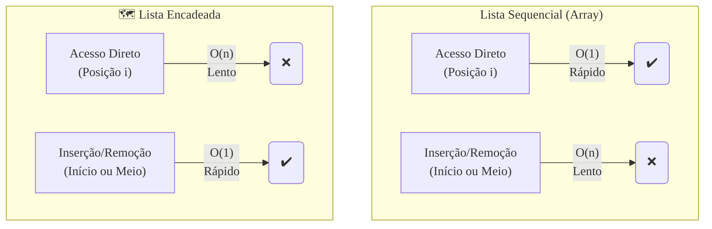

### Olá, futuro(a) aprovado(a)\! Vamos organizar as Estruturas de Dados para você encontrar a aprovação na prova do Cebraspe.

Pense nas estruturas de dados como **diferentes formas de organizar os livros em uma biblioteca** 📚. Cada método tem suas vantagens e desvantagens para encontrar, adicionar ou remover um livro.

-----

### \#\#\# Listas: As Estantes da Biblioteca

As listas são a forma mais básica de organizar os livros em sequência.

  * **Lista Sequencial (Uma Estante com Espaços Fixos 📏):**

      * **Como funciona:** Os livros são colocados em uma estante com prateleiras numeradas, um ao lado do outro, em um bloco contínuo.
      * **Acesso a um livro:** **Super rápido ($O(1)$)**. Se você quer o 5º livro, você vai direto à 5ª posição.
      * **Adicionar/Remover um livro no meio:** **Um pesadelo ($O(n)$)**. Para colocar um novo livro na 2ª posição, você precisa empurrar todos os outros livros para o lado, um por um.

  * **Lista Encadeada (Uma Caça ao Tesouro 🗺️):**

      * **Como funciona:** Os livros estão espalhados pela biblioteca. Cada livro tem um bilhetinho que diz onde encontrar o próximo livro da série.
      * **Acesso a um livro:** **Super lento ($O(n)$)**. Para encontrar o 5º livro, você precisa pegar o 1º, ler o bilhete, ir até o 2º, ler o bilhete, e assim por diante.
      * **Adicionar/Remover um livro no meio:** **Super rápido ($O(1)$)**. Para inserir um novo livro, você só precisa ir até a posição e reescrever dois bilhetinhos para que a corrente aponte para o novo livro.

> #### Foco Cebraspe (Pontos de Atenção e "Pegadinhas")
>
> >   * A banca vai trocar as complexidades\! Ela vai afirmar que "o acesso em uma lista encadeada é $O(1)$". **ERRADO\!** É $O(n)$. E que "a inserção em uma lista sequencial é $O(1)$". **ERRADO\!** No meio ou início, é $O(n)$.
> >   * **Quando usar cada uma?** Se você precisa de **acesso rápido** a qualquer elemento, use **Lista Sequencial**. Se você precisa **inserir e remover** elementos no meio da lista o tempo todo, use **Lista Encadeada**.

-----

### \#\#\# Pilhas (Stacks): A Pilha de Pratos

  * **A Analogia:** Uma **pilha de pratos** sujos ao lado da pia.
  * **O Princípio:** **LIFO (Last-In, First-Out)**. O **último** prato que você coloca no topo da pilha é o **primeiro** que você pega para lavar.
  * **As Operações:**
      * **`push`:** Colocar um prato no topo (**empilhar**).
      * **`pop`:** Tirar o prato do topo (**desempilhar**).

> #### Foco Cebraspe (Pontos de Atenção e "Pegadinhas")
>
> >   * A banca vai dizer que a operação `pop` remove da base da pilha. **ERRADO\!** Na pilha, tudo acontece no **topo**.
> >   * Se a questão descrever um problema que precisa processar itens na ordem inversa à que chegaram (ex: o botão "desfazer"), a resposta é **Pilha**.

-----

### \#\#\# Filas (Queues): A Fila do Caixa

  * **A Analogia:** Uma **fila de pessoas no caixa** do supermercado.
  * **O Princípio:** **FIFO (First-In, First-Out)**. A **primeira** pessoa que chega na fila é a **primeira** a ser atendida.
  * **As Operações:**
      * **`enqueue`:** Uma nova pessoa entra no **final** da fila.
      * **`dequeue`:** A pessoa do **início** da fila é atendida e sai.

> #### Foco Cebraspe (Pontos de Atenção e "Pegadinhas")
>
> >   * A banca vai dizer que `enqueue` insere no início. **ERRADO\!** Inserção é no **final**, remoção é no **início**.
> >   * Se a questão descrever um cenário que precisa processar itens na exata ordem em que chegaram (ex: fila de impressão), a resposta é **Fila**.

-----

### \#\#\# Árvores: A Árvore Genealógica

  * **A Analogia:** Uma **árvore genealógica**, com pais, filhos e irmãos.
  * **Árvore Binária de Busca (ABB):** É uma árvore genealógica organizada por idade. Para qualquer pessoa (nó), todos na sua **subárvore esquerda são mais novos**, e todos na sua **subárvore direita são mais velhos**.
  * **Percursos:** Formas de ler a árvore.
      * **Em-Ordem (Esquerda -\> Raiz -\> Direita):** Se você ler uma ABB em-ordem, você visita todos os membros em **ordem crescente de idade**.

> #### Foco Cebraspe (Pontos de Atenção e "Pegadinhas")
>
> >   * A complexidade de busca em uma ABB é **$O(\\log n)$ SE, e somente se, ela estiver balanceada**. Se ela estiver desbalanceada (parecendo uma "tripa"), o pior caso é $O(n)$, igual a uma lista.
> >   * A banca vai te dar uma árvore e perguntar se é uma ABB. Verifique a regra **esquerda \< raiz \< direita** para TODOS os nós.

-----

### \#\#\# Ordenação, Pesquisa e Hashing: Encontrando Livros Rapidamente

  * **Pesquisa Binária:** O jeito mais rápido de achar um livro em uma estante **ORDENADA**. Você abre no meio, vê se o livro está antes ou depois, e joga metade da estante fora. Repete até achar. Complexidade: $O(\\log n)$.
  * **Algoritmos de Ordenação:**
      * **$O(n^2)$ (Lentos):** `Bubble Sort`, `Selection Sort`. São como um bibliotecário novato e desorganizado.
      * **$O(n \\log n)$ (Rápidos):** `Merge Sort`, `Quick Sort`. São os bibliotecários experientes e eficientes.
  * **Tabela Hash:** Um **sistema de fichas mágico**. Você aplica uma "fórmula mágica" (**função hash**) no título do livro e ela te diz a prateleira e a posição exata dele. A busca é praticamente instantânea: **$O(1)$ em média**.

> #### Foco Cebraspe (Pontos de Atenção e "Pegadinhas")
>
> >   * A banca vai dizer que você pode usar **pesquisa binária** em uma lista desordenada. **ERRADO\!** O pré-requisito é que a coleção esteja **ordenada**.
> >   * A complexidade da **Tabela Hash** é $O(1)$ no **caso médio**. No pior caso (muitas colisões), ela pode ser $O(n)$.
> >   * O pior caso do **Quick Sort** é $O(n^2)$ (acontece se o vetor já estiver ordenado), enquanto o **Merge Sort** garante $O(n \\log n)$ em todos os casos.

-----

### \#\#\# Estrutura de Arquivos: Organizando o Grande Acervo

Como organizar os livros em um depósito gigantesco.

  * **Sequencial:** Os livros são guardados um após o outro, em ordem. Para pegar o 500º livro, você tem que passar pelos 499 anteriores.
  * **Indexada:** Você tem o depósito com os livros e um **catálogo de fichas (índice)** separado, que te diz o corredor e a prateleira exata de cada livro.
  * **Direta (Hashing):** Usa uma função hash para calcular o endereço físico do livro a partir do seu título. É o acesso mais rápido possível.

> #### Foco Cebraspe (Pontos de Atenção e "Pegadinhas")
>
> >   * A organização **indexada** é a que oferece o melhor dos dois mundos: permite tanto a leitura sequencial (ler todos os livros de um corredor) quanto o acesso rápido a um livro específico (usando o índice).

### \#\#\# Mapa Mental: Comparativo de Desempenho (Listas)

### **Classe:** B
### **Conteúdo:** Estruturas de Dados: Listas

---

### **1. Listas**

> #### **TEORIA-ALVO**
> Listas são estruturas de dados lineares que armazenam uma coleção de elementos em uma determinada ordem. Existem duas implementações fundamentais, com características de desempenho distintas.
>
> * **Lista Sequencial (ou Contígua):**
>     * **Implementação:** Utiliza um vetor (*array*), que é um bloco contíguo de memória.
>     * **Características:**
>         * **Acesso a Elementos:** Extremamente rápido. O acesso a um elemento em qualquer posição *i* é uma operação de tempo constante, $O(1)$, pois sua localização pode ser calculada diretamente a partir do endereço base do vetor.
>         * **Inserção e Remoção:** Operações lentas. A inserção ou remoção de um elemento no meio da lista exige o deslocamento de todos os elementos subsequentes, resultando em uma complexidade de tempo linear, $O(n)$, no pior caso.
> * **Lista Encadeada (ou Ligada):**
>     * **Implementação:** Utiliza um conjunto de nós alocados dinamicamente na memória. Cada nó contém o dado e um ponteiro (referência) para o próximo nó da sequência.
>     * **Características:**
>         * **Acesso a Elementos:** Lento. Para acessar um elemento na posição *i*, é necessário percorrer a lista desde o início, nó por nó, resultando em uma complexidade de tempo linear, $O(n)$.
>         * **Inserção e Remoção:** Extremamente rápidas. Uma vez localizada a posição, a inserção ou remoção envolve apenas a manipulação de ponteiros, sendo uma operação de tempo constante, $O(1)$.
>     * **Variações:** Lista Duplamente Encadeada (possui ponteiro para o próximo e para o anterior) e Lista Circular (o último nó aponta para o primeiro).

> #### **FOCO CEBRASPE (Pontos de Atenção e "Pegadinhas")**
> > * **Complexidade das Operações:** Este é o ponto central. A banca frequentemente afirmará que "a inserção de um elemento no início de uma lista sequencial é uma operação de tempo constante ($O(1)$)". **ERRADO**. Requer o deslocamento de todos os outros elementos ($O(n)$). Ou que "o acesso a um elemento em uma lista encadeada é uma operação de tempo constante ($O(1)$)". **ERRADO**. Requer percorrer a lista a partir do início ($O(n)$).
> > * **Uso de Memória:** Uma lista sequencial requer um bloco de memória contíguo e pode levar a desperdício se o espaço alocado não for totalmente utilizado. Uma lista encadeada utiliza memória de forma fragmentada e possui um custo adicional (*overhead*) de memória para armazenar os ponteiros em cada nó.
> > * **Vantagens e Desvantagens:** A escolha entre as implementações depende do padrão de uso. Se as operações de acesso aleatório a elementos forem frequentes, a lista sequencial é superior. Se as operações de inserção e remoção no meio da estrutura forem predominantes, a lista encadeada é mais adequada.

---

### **Classe:** B
### **Conteúdo:** Pilhas (Stacks)

---

### **2. Pilhas**

> #### **TEORIA-ALVO**
> A Pilha é uma estrutura de dados linear que obedece ao princípio **LIFO (Last-In, First-Out)**, ou seja, o último elemento a ser inserido é o primeiro a ser removido. A estrutura funciona de forma análoga a uma pilha de pratos.
>
> * **Operações Fundamentais:**
>     * **`push(elemento)`:** Adiciona um novo elemento no topo da pilha. Também conhecida como "empilhar".
>     * **`pop()`:** Remove e retorna o elemento que está no topo da pilha. Também conhecida como "desempilhar".
>     * **`top()` ou `peek()`:** Retorna o elemento do topo da pilha sem removê-lo.
> * **Implementação:** Pode ser implementada de forma eficiente tanto com listas sequenciais (vetores) quanto com listas encadeadas.
> * **Estados de Erro:**
>     * **Overflow (Estouro):** Ocorre ao se tentar executar a operação `push` em uma pilha que já está cheia (relevante para implementações com vetor de tamanho fixo).
>     * **Underflow (Esvaziamento):** Ocorre ao se tentar executar as operações `pop` ou `top` em uma pilha vazia.
> * **Aplicações Clássicas:** Avaliação de expressões aritméticas (notação polonesa), verificação de parênteses balanceados, gerenciamento de chamadas de função (pilha de execução) e o mecanismo de "desfazer" (undo) em editores.

> #### **FOCO CEBRASPE (Pontos de Atenção e "Pegadinhas")**
> > * **Princípio LIFO:** A característica fundamental. A banca apresentará um cenário de problema e questionará se a pilha é a estrutura de dados apropriada. Se o problema envolver processar elementos na ordem inversa de sua chegada, a pilha é a candidata correta.
> > * **Operações e Nomenclatura:** É crucial conhecer a nomenclatura padrão (`push`, `pop`, `top`). A banca pode descrever a operação `pop` como "remover um elemento da base da pilha". **ERRADO**. Todas as operações de inserção e remoção em uma pilha ocorrem em uma única extremidade, o **topo**.
> > * **Underflow e Overflow:** A banca pode apresentar um trecho de código e perguntar sobre o resultado. Se o código tentar remover um item de uma pilha vazia, o candidato deve identificar a ocorrência de um *underflow*.

---

### **Classe:** B
### **Conteúdo:** Filas (Queues)

---

### **3. Filas**

> #### **TEORIA-ALVO**
> A Fila é uma estrutura de dados linear que obedece ao princípio **FIFO (First-In, First-Out)**, ou seja, o primeiro elemento a ser inserido é o primeiro a ser removido. A estrutura funciona de forma análoga a uma fila de atendimento em um guichê.
>
> * **Operações Fundamentais:**
>     * **`enqueue(elemento)`:** Adiciona um novo elemento no **final** da fila. Também conhecida como "enfileirar".
>     * **`dequeue()`:** Remove e retorna o elemento do **início** da fila. Também conhecida como "desenfileirar".
>     * **`front()` ou `peek()`:** Retorna o elemento do início da fila sem removê-lo.
> * **Implementação:**
>     * **Com Vetor (Fila Circular):** Para evitar o deslocamento de todos os elementos a cada `dequeue` (operação $O(n)$), utiliza-se a abordagem de **fila circular**, onde os ponteiros de início e fim "dão a volta" no vetor, reutilizando o espaço. Com essa otimização, `enqueue` e `dequeue` tornam-se operações $O(1)$.
>     * **Com Lista Encadeada:** Uma implementação natural, onde `enqueue` e `dequeue` são operações de tempo constante, $O(1)$.
> * **Aplicações Clássicas:** Gerenciamento de processos em sistemas operacionais (*scheduler*), buffers de dados (em I/O), filas de impressão e processamento de requisições em servidores web.

> #### **FOCO CEBRASPE (Pontos de Atenção e "Pegadinhas")**
> > * **Princípio FIFO:** O conceito central. A banca descreverá um cenário que requer processamento na ordem de chegada e o candidato deve identificar a fila como a estrutura correta.
> > * **Extremidades da Fila:** Diferente da pilha, a fila manipula duas extremidades: a inserção ocorre no **final** (*rear*) e a remoção ocorre no **início** (*front*). A banca pode afirmar que "a operação `enqueue` insere um elemento no início da fila". **ERRADO**.
> > * **Fila Circular:** A banca pode questionar o problema que a fila circular resolve na implementação com vetores. A resposta correta é que ela **evita a necessidade de deslocar os elementos da fila após cada remoção**, tornando a operação `dequeue` uma operação de tempo constante ($O(1)$) em vez de linear ($O(n)$).

---

### **Classe:** B
### **Conteúdo:** Árvores

---

### **4. Árvores**

> #### **TEORIA-ALVO**
> Uma Árvore é uma estrutura de dados não linear e hierárquica, composta por um conjunto de nós conectados por arestas. É utilizada para representar dados com relação de parentesco.
>
> * **Terminologia:** Nó Raiz, Nó Pai, Nó Filho, Nós Irmãos, Nós Folha (terminais), Grau de um nó, Altura da árvore.
> * **Árvore Binária:** Uma árvore em que cada nó possui, no máximo, dois filhos (subárvore esquerda e subárvore direita).
> * **Árvore Binária de Busca (ABB ou BST - *Binary Search Tree*):** É uma árvore binária ordenada que satisfaz a seguinte propriedade: para qualquer nó `N`, todos os valores na sua subárvore esquerda são **menores** que o valor de `N`, e todos os valores na sua subárvore direita são **maiores** que o valor de `N`.
> * **Percursos em Árvore Binária:**
>     * **Pré-Ordem:** Raiz -> Esquerda -> Direita
>     * **Em-Ordem:** Esquerda -> Raiz -> Direita (em uma ABB, este percurso visita os nós em ordem crescente)
>     * **Pós-Ordem:** Esquerda -> Direita -> Raiz
> * **Balanceamento:** Em uma ABB balanceada (e.g., AVL, Rubro-Negra), a altura da árvore é mantida em $O(\log n)$, o que garante que as operações de busca, inserção e remoção tenham complexidade de tempo logarítmica.

> #### **FOCO CEBRASPE (Pontos de Atenção e "Pegadinhas")**
> > * **Propriedade da Árvore Binária de Busca:** Este é o ponto mais testado. A banca fornecerá uma árvore desenhada e perguntará se ela constitui uma ABB. É necessário verificar a propriedade (esquerda < raiz < direita) para cada nó.
> > * **Complexidade das Operações na ABB:** A banca pode afirmar que a complexidade da busca em uma ABB é *sempre* $O(\log n)$. **ERRADO**. Esta complexidade só é garantida se a árvore estiver **balanceada**. No pior caso (uma árvore degenerada, que se assemelha a uma lista encadeada), a complexidade é $O(n)$.
> > * **Ordem dos Percursos:** A banca fornecerá uma árvore e pedirá a sequência de nós visitados em um determinado percurso (pré-ordem, em-ordem ou pós-ordem), ou fornecerá a sequência e perguntará qual percurso foi utilizado. O percurso **em-ordem** em uma ABB sempre resulta nos elementos listados em ordem crescente.

---

### **Classe:** C
### **Conteúdo:** Ordenação, Pesquisa e Hashing

---

### **5. Algoritmos de Ordenação, Pesquisa e Hashing**

> #### **TEORIA-ALVO**
> Conjunto de algoritmos fundamentais para organizar e recuperar dados de forma eficiente.
>
> * **Algoritmos de Ordenação:**
>     * **Quadráticos ($O(n^2)$):** Simples, mas ineficientes para grandes volumes de dados. Incluem `Bubble Sort`, `Selection Sort` e `Insertion Sort`.
>     * **Log-Lineares ($O(n \log n)$):** Eficientes, baseados na estratégia de "dividir para conquistar". Incluem `Merge Sort` (estável, mas requer memória auxiliar) e `Quick Sort` (geralmente mais rápido na prática, mas instável e com pior caso $O(n^2)$).
> * **Algoritmos de Pesquisa:**
>     * **Pesquisa Sequencial (ou Linear):** Percorre a coleção elemento por elemento. Funciona em dados não ordenados. Complexidade $O(n)$.
>     * **Pesquisa Binária:** Requer que a coleção esteja **previamente ordenada**. A cada passo, compara o elemento alvo com o do meio e descarta metade do espaço de busca. Complexidade $O(\log n)$.
> * **Hashing e Tabela Hash:**
>     * **Hashing:** É o processo de mapear uma chave de um universo grande para um índice em um vetor (a tabela hash) por meio de uma **função hash**.
>     * **Tabela Hash:** Estrutura que permite operações de inserção, remoção e busca com complexidade de tempo **média de $O(1)$**.
>     * **Colisão:** Ocorre quando duas chaves distintas são mapeadas pela função hash para o mesmo índice. Estratégias de tratamento incluem **encadeamento** (cada posição da tabela é uma lista encadeada) e **endereçamento aberto**.

> #### **FOCO CEBRASPE (Pontos de Atenção e "Pegadinhas")**
> > * **Complexidade (Big O Notation):** A cobrança sobre a complexidade de tempo dos algoritmos é a mais comum. É fundamental saber a diferença entre algoritmos quadráticos e log-lineares.
> > * **Pré-requisito da Pesquisa Binária:** A banca afirmará que a pesquisa binária pode ser aplicada a qualquer vetor. **ERRADO**. Sua condição de funcionamento é que os dados estejam **ordenados**.
> > * **Tabela Hash: Pior Caso vs. Caso Médio:** A complexidade $O(1)$ da tabela hash é no **caso médio**. No pior caso (e.g., todas as chaves geram colisão e são inseridas no mesmo *bucket*), a complexidade pode degenerar para $O(n)$.
> > * **Pior Caso do Quick Sort:** O pior caso do Quick Sort ($O(n^2)$) ocorre quando a escolha do pivô é ruim (e.g., sempre o menor ou o maior elemento), o que pode acontecer se o vetor já estiver ordenado. O Merge Sort, em contraste, tem complexidade $O(n \log n)$ garantida em todos os casos.

---

### **Classe:** C
### **Conteúdo:** Estrutura de Arquivos

---

### **6. Estrutura de Arquivos**

> #### **TEORIA-ALVO**
> Refere-se à organização dos registros em um arquivo armazenado em memória secundária (disco), visando otimizar o armazenamento e a recuperação de dados.
>
> * **Organização Sequencial:**
>     * **Descrição:** Os registros são armazenados um após o outro, na ordem em que foram inseridos ou ordenados por uma chave primária.
>     * **Acesso:** O acesso a um registro específico exige a leitura sequencial a partir do início do arquivo. A busca é lenta ($O(n)$).
> * **Organização Indexada (ou Sequencial Indexada):**
>     * **Descrição:** Além do arquivo de dados principal, um ou mais arquivos de **índice** são mantidos. O índice é uma estrutura menor (e.g., uma árvore B+) que mapeia um valor de chave para a localização do registro no arquivo de dados.
>     * **Acesso:** Permite acesso rápido a registros específicos com base na chave do índice, sem a necessidade de varrer todo o arquivo de dados.
> * **Organização Direta (ou por Hashing):**
>     * **Descrição:** A localização física (endereço) de um registro no disco é calculada diretamente a partir de sua chave, por meio da aplicação de uma função hash.
>     * **Acesso:** Permite o acesso mais rápido possível a um registro, teoricamente em uma única operação de I/O. Lida com problemas de colisões e pode resultar em espaço em disco não utilizado.

> #### **FOCO CEBRASPE (Pontos de Atenção e "Pegadinhas")**
> > * **Trade-offs:** A principal questão envolve os prós e contras de cada organização. A **sequencial** é simples, mas lenta para busca. A **direta** é a mais rápida para busca por chave, mas é mais complexa e sensível a colisões. A **indexada** oferece um bom equilíbrio, permitindo tanto o acesso sequencial quanto o acesso rápido por chave, ao custo de manter o(s) índice(s).
> > * **Acesso Sequencial vs. Aleatório:** A organização sequencial é otimizada para o processamento de todos os registros em ordem (acesso sequencial). Organizações indexada e direta são otimizadas para a recuperação de registros específicos e fora de ordem (acesso aleatório ou direto).
> > * **Índice como Estrutura de Dados:** Um arquivo de índice é, em si, uma estrutura de dados (como uma árvore B ou uma tabela hash) projetada para ser eficiente em disco.
