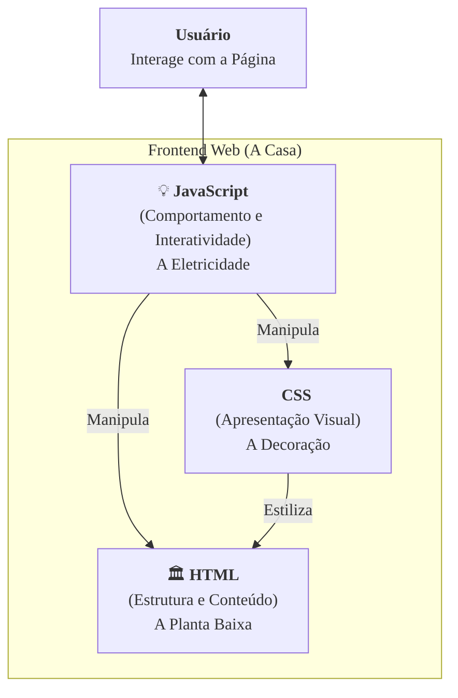

### Olá, futuro(a) aprovado(a)\! Vamos construir seu conhecimento em Frontend Web, tijolo por tijolo, para você garantir uma base sólida na prova do Cebraspe.

Pense na construção de um site como a **construção de uma casa moderna e interativa** 🏠. Cada tecnologia tem um papel fundamental: uma faz a estrutura, outra a decoração e a terceira cuida da eletricidade e da automação.

-----

### \#\#\# HTML5: A Estrutura e a Planta Baixa da Casa

O HTML é o **esqueleto da sua casa**. Ele define os cômodos e a função de cada um.

  * **O Propósito:** HTML define a **estrutura** ("aqui é a parede, aqui é a porta") e a **semântica** ("este cômodo é uma `cozinha`, este é um `quarto`"). Ele não se preocupa com a cor da parede.
  * **As Novidades do HTML5:**
      * **Tags Semânticas (`<header>`, `<footer>`, `<nav>`...):** É como ter placas na planta baixa dizendo "Hall de Entrada", "Garagem", "Corredor Principal". Isso é muito mais inteligente e organizado do que chamar tudo de "Cômodo A", "Cômodo B" (como se fazia com as `
`).
      * **Multimídia Nativa (`<audio>`, `<video>`):** Permite construir uma "sala de cinema" na sua casa sem precisar comprar um projetor de uma marca específica (sem plugins como o Flash).
      * **Web Storage (`localStorage`, `sessionStorage`):** É como ter um **cofre seguro** dentro da casa para guardar as coisas do morador. É mais espaçoso e eficiente que os antigos "bolsos" (*cookies*), pois o conteúdo do cofre não precisa ser mostrado para o mundo exterior (o servidor) toda hora.
      * **Novos Controles de Formulário:** "Tomadas" especiais para `data`, `email`, `número`, que já vêm com um sistema de verificação embutido.

> #### Foco Cebraspe (Pontos de Atenção e "Pegadinhas")
>
> >   * A banca vai dizer que HTML é uma linguagem de programação. **ERRADO\!** É uma linguagem de **marcação**. A planta da casa não decide acender as luzes sozinha.
> >   * A banca vai dizer que `
` é a mesma coisa que `<footer>`. **ERRADO\!** Semanticamente, `<footer>` é muito mais expressivo e correto para robôs de busca e leitores de tela.
> >   * **Web Storage vs. Cookies:** Lembre-se, os dados do **Web Storage** ficam só no cliente, enquanto os **cookies** são enviados ao servidor a cada requisição. `localStorage` é um cofre permanente; `sessionStorage` é um cofre que se esvazia quando você sai de casa.

-----

### \#\#\# CSS3: A Decoração, a Pintura e o Acabamento

O CSS é o **decorador** da sua casa. Ele cuida de toda a aparência.

  * **O Propósito:** Separar a **apresentação visual** da estrutura. Define as cores das paredes, o tipo do piso, o estilo dos móveis.
  * **As Novidades do CSS3:**
      * **Media Queries (O Design Responsivo):** É a "decoração adaptativa". A casa se arruma de um jeito quando vista em uma tela de celular (pequena) e de outro jeito em um monitor gigante (grande). Os móveis se rearranjam para o melhor aproveitamento do espaço.
      * **Flexbox e Grid (Os Organizadores de Móveis):**
          * **Flexbox:** Perfeito para organizar os itens em **uma dimensão**, como alinhar os quadros em uma única parede (uma linha) ou os livros em uma prateleira (uma coluna).
          * **Grid:** Perfeito para organizar o **layout de um cômodo inteiro**, em **duas dimensões**, com linhas e colunas.

> #### Foco Cebraspe (Pontos de Atenção e "Pegadinhas")
>
> >   * **Flexbox vs. Grid:** A banca vai confundir os dois. Lembre-se: **Flexbox = 1D** (uma fila ou uma coluna). **Grid = 2D** (uma tabela, com linhas e colunas).
> >   * **Especificidade e Cascata:** Questões clássicas de CSS envolvem duas "regras de pintura" conflitantes. Você precisa saber qual delas é a mais específica (a mais "forte") para decidir qual cor a parede terá no final.

-----

### \#\#\# JavaScript: A Eletricidade e a Automação da Casa

O JavaScript (JS) é o que dá **vida e interatividade** à casa.

  * **O Propósito:** É a **rede elétrica e o sistema de automação**. Ele faz a luz acender quando você aperta o interruptor ou abre a cortina automaticamente quando o sol nasce.
  * **ES6+ (A Modernização da Rede Elétrica):**
      * **`var` vs. `let` vs. `const`:** `var` é a fiação antiga, com escopo em toda a casa. `let` e `const` são a fiação moderna, com escopo apenas dentro do cômodo onde foram instalados, o que é muito mais seguro.
      * **Promises (O Agendamento de Tarefas):** É como programar a máquina de lavar. Você liga, ela te dá um "recibo" (*Promise*) e você pode ir fazer outra coisa. Quando ela terminar, ela te avisa se deu tudo certo ou se deu algum erro.
  * **Modelo de Execução (O Eletricista Eficiente):**
    O JS tem apenas **um eletricista (*single-threaded*)**, mas ele é muito esperto. Quando precisa fazer uma tarefa demorada (como esquentar a água do chuveiro), ele liga o aquecedor e, enquanto a água esquenta, ele vai trocar uma lâmpada em outro lugar. Ele não fica parado esperando (**assincronicidade com Event Loop**).

> #### Foco Cebraspe (Pontos de Atenção e "Pegadinhas")
>
> >   * **JavaScript não trava:** A banca vai dizer que, por ter um só "eletricista", o JS trava a casa inteira enquanto espera uma tarefa demorada. **ERRADO\!** Graças ao **Event Loop**, ele delega tarefas demoradas e continua trabalhando em outras coisas.
> >   * **Escopo de Variáveis:** A diferença entre o escopo de função (`var`) e o escopo de bloco (`let`, `const`) é um prato cheio para questões.

-----

### \#\#\# Ajax e WebSocket: O Interfone e o Walkie-Talkie

São as tecnologias de comunicação da casa com o mundo exterior.

  * **Ajax (O Interfone 📞):** A comunicação é sempre iniciada por você, de dentro de casa. Você aperta o botão para falar com a portaria (servidor), o porteiro responde e a chamada termina. Para falar de novo, tem que apertar o botão de novo.
  * **WebSocket (O Walkie-Talkie 📻):** Após um "câmbio" inicial, o canal de comunicação fica aberto. Tanto você quanto o porteiro podem falar a qualquer momento, em tempo real.

> #### Foco Cebraspe (Pontos de Atenção e "Pegadinhas")
>
> >   * A banca vai dizer que Ajax permite que o servidor envie dados a qualquer momento. **ERRADO\!** Isso é uma característica do **WebSocket** (*server-push*). No Ajax, a comunicação é sempre iniciada pelo cliente.
> >   * **Caso de Uso:** Para um chat em tempo real, use **WebSocket**. Para enviar um formulário e atualizar um pedacinho da página, use **Ajax**.

-----

### \#\#\# SPA e Angular: A Casa de Conceito Aberto

  * **SPA (Single Page Application):** É uma **casa de conceito aberto**. Você entra por uma única porta e está em um salão gigante (uma única página HTML). Conforme você anda, paredes e painéis inteligentes se movem para criar a "ilusão" de que você está em cômodos diferentes, mas você nunca realmente saiu e entrou de novo na casa. A experiência é muito mais fluida.
  * **Angular:** É um **kit de construção pré-fabricado da "Google Homes"** para construir esse tipo de casa. É um **framework** completo, que já vem com a planta, o sistema elétrico e as regras de montagem. Ele usa **TypeScript**, que é como uma planta com anotações e especificações de materiais, tornando a construção mais segura que o JavaScript puro.

> #### Foco Cebraspe (Pontos de Atenção e "Pegadinhas")
>
> >   * **SPA vs. MPA (Multi-Page Application):** Na **MPA** (a casa tradicional), para ir da sala para a cozinha, você tem que sair da casa e entrar por outra porta (recarregar a página inteira).
> >   * **Framework vs. Biblioteca:** **Angular** é um **framework** (ele te dá a planta e dita como construir). **React**, por exemplo, é uma **biblioteca** (ele te dá os tijolos e te deixa mais livre para construir como quiser).

### \#\#\# Mapa Mental: As Três Camadas do Frontend

### **Classe:** B
### **Conteúdo:** Frontend Web: HTML5

---

### **1. HTML5**

> #### **TEORIA-ALVO**
> HTML5 é a quinta e mais recente versão da linguagem de marcação padrão para a criação e estruturação de conteúdo na World Wide Web. Mantém a retrocompatibilidade com versões anteriores enquanto introduz novas funcionalidades para suportar aplicações web modernas.
>
> * **Propósito:** Definir a **estrutura e a semântica** do conteúdo de uma página web, e não sua apresentação visual, que é delegada ao CSS.
> * **Novidades Principais:**
>     * **Elementos Semânticos:** Tags que descrevem o significado de seu conteúdo, como `<article>`, `<section>`, `<nav>`, `<header>`, `<footer>` e `<aside>`. Elas melhoram a acessibilidade e a otimização para motores de busca (SEO).
>     * **Suporte Multimídia Nativo:** As tags `<audio>` e `<video>` permitem a incorporação de conteúdo de áudio e vídeo sem a necessidade de plugins externos como o Flash.
>     * **APIs de JavaScript:** Expõe um conjunto de novas APIs para interatividade avançada, incluindo:
>         * **Web Storage:** Mecanismo de armazenamento no lado do cliente (`localStorage` e `sessionStorage`), mais robusto e com maior capacidade que os cookies.
>         * **Geolocation:** Permite que o navegador obtenha a localização geográfica do usuário (com sua permissão).
>         * **Canvas:** Fornece uma área de desenho na página, manipulável via JavaScript, para renderização de gráficos, animações e jogos.
>     * **Controles de Formulário Avançados:** Novos tipos de `input`, como `date`, `email`, `number` e `url`, que habilitam validações nativas no navegador.

> #### **FOCO CEBRASPE (Pontos de Atenção e "Pegadinhas")**
> > * **HTML como Linguagem de Programação:** A banca pode afirmar que HTML5 é uma linguagem de programação. **ERRADO**. HTML é uma linguagem de **marcação**. Ela estrutura o conteúdo, mas não possui lógica, laços ou condicionais.
> > * **Uso de Tags Semânticas:** Uma questão pode sugerir que o uso de `
` é semanticamente equivalente ao uso da tag `<footer>`. **ERRADO**. Embora possam ser estilizados de forma idêntica, a tag `<footer>` carrega um valor semântico que `
` não possui.
> > * **Web Storage vs. Cookies:** A banca pode confundir os mecanismos de armazenamento. A principal diferença é que os dados do **Web Storage** não são enviados ao servidor a cada requisição HTTP, ao contrário dos **cookies**, o que torna o Web Storage mais eficiente para armazenar dados maiores no cliente. `localStorage` persiste os dados indefinidamente, enquanto `sessionStorage` os apaga quando a sessão do navegador é encerrada.
> > * **Tags Obsoletas:** É incorreto afirmar que tags de formatação como `` e `
` fazem parte do padrão HTML5. **ERRADO**. Essas tags foram preteridas em favor da estilização exclusiva via CSS.

---

### **Classe:** B
### **Conteúdo:** CSS3

---

### **2. CSS3**

> #### **TEORIA-ALVO**
> CSS3 é a versão mais recente da especificação Cascading Style Sheets, dividida em módulos independentes. Ele introduziu um vasto conjunto de funcionalidades para estilização e layout, permitindo a criação de interfaces ricas e responsivas.
>
> * **Propósito:** Separar a **apresentação visual** da estrutura do documento (HTML), permitindo a formatação de layout, cores, fontes e animações.
> * **Novidades Principais:**
>     * **Seletores Avançados:** Permitem selecionar elementos de forma mais precisa (e.g., `nth-child()`, `::before`, `::after`).
>     * **Layout Responsivo com Media Queries:** Permitem aplicar diferentes regras de estilo com base nas características do dispositivo, como a largura da tela (`@media (max-width: 768px) { ... }`), possibilitando o design responsivo.
>     * **Módulos de Layout Avançado:**
>         * **Flexbox (Flexible Box Layout):** Modelo de layout unidimensional, ideal para alinhar e distribuir espaço entre itens em um contêiner (em uma linha ou coluna).
>         * **Grid Layout:** Modelo de layout bidimensional, projetado para dividir a página em regiões principais, definindo a relação em termos de linhas e colunas.
>     * **Efeitos Visuais e Animações:** Propriedades como `border-radius`, `box-shadow`, `transform` (para rotação, escala), `transition` (para transições suaves de estado) e `@keyframes` (para animações complexas).

> #### **FOCO CEBRASPE (Pontos de Atenção e "Pegadinhas")**
> > * **Flexbox vs. Grid:** A banca pode confundir o propósito dos dois modelos. **Flexbox** é para layouts em **uma dimensão**. **Grid** é para layouts em **duas dimensões** (linhas e colunas). Para o layout geral de uma página, Grid é geralmente mais adequado. Para alinhar itens dentro de um componente, Flexbox é a escolha comum.
> > * **Media Queries:** O conceito de design responsivo é fortemente atrelado às Media Queries. A banca pode apresentar um trecho de código e perguntar para qual tamanho de tela ele se aplica, testando o entendimento de `min-width` e `max-width`.
> > * **Especificidade e Cascata:** Mesmo com as novidades do CSS3, os conceitos fundamentais de cascata e especificidade (a "força" de um seletor) continuam sendo o principal alvo de questões, que apresentarão regras conflitantes para que o candidato determine o estilo final aplicado.

---

### **Classe:** B
### **Conteúdo:** JavaScript

---

### **3. JavaScript**

> #### **TEORIA-ALVO**
> JavaScript é uma linguagem de programação de alto nível, dinâmica e multiparadigma, sendo a principal linguagem executada no lado do cliente (navegador) para adicionar **comportamento e interatividade** às páginas web.
>
> * **Padrão ECMAScript (ES):** JavaScript é a implementação mais popular do padrão ECMAScript. Versões modernas, como ES6 (ECMAScript 2015) e posteriores, introduziram funcionalidades cruciais que modernizaram a linguagem.
> * **Principais Funcionalidades Modernas (ES6+):**
>     * **Declaração de Variáveis:** `let` e `const` foram introduzidas, oferecendo escopo de bloco, em contraste com `var`, que tem escopo de função. `const` define uma constante que não pode ser reatribuída.
>     * **Arrow Functions:** Uma sintaxe mais concisa para escrever funções (`(a, b) => a + b`).
>     * **Promises:** Um objeto que representa o resultado (sucesso ou falha) de uma operação assíncrona, sendo a base para lidar com código assíncrono de forma mais limpa e evitando o "Callback Hell".
> * **Manipulação do DOM:** A principal função do JavaScript no navegador é interagir com o **DOM (Document Object Model)**, a representação em árvore do documento HTML, permitindo alterar seu conteúdo e estrutura dinamicamente.
> * **Modelo de Execução:** JavaScript é **single-threaded** (possui uma única thread de execução), mas lida com operações de I/O de forma assíncrona através de um mecanismo chamado **Event Loop**.

> #### **FOCO CEBRASPE (Pontos de Atenção e "Pegadinhas")**
> > * **`var` vs. `let` vs. `const`:** A banca vai explorar as diferenças de escopo e mutabilidade. Um item pode afirmar que `let` e `var` têm o mesmo escopo. **ERRADO**. `var` tem escopo de função, enquanto `let` tem escopo de bloco (`{...}`).
> > * **Sincronicidade:** A banca pode afirmar que, por ser *single-threaded*, o JavaScript trava a interface do usuário ao fazer uma requisição de rede. **ERRADO**. Graças ao **Event Loop** e às APIs assíncronas (como Ajax), as operações demoradas são delegadas e não bloqueiam a thread principal.
> > * **Promises:** É crucial entender que uma *Promise* é um objeto que encapsula uma operação futura. Ela pode estar em um de três estados: pendente (*pending*), resolvida (*fulfilled*) ou rejeitada (*rejected*). A banca pode questionar como se trata o resultado de uma *Promise* (usando os métodos `.then()` para sucesso e `.catch()` para erro).

---

### **Classe:** B/C
### **Conteúdo:** Ajax e WebSocket

---

### **4. Ajax e WebSocket**

> #### **TEORIA-ALVO**
> Ajax e WebSocket são duas tecnologias que permitem a comunicação entre o cliente (navegador) e o servidor após o carregamento inicial da página, mas operam de maneiras fundamentalmente diferentes.
>
> * **Ajax (Asynchronous JavaScript and XML):**
>     * **Definição:** Uma **técnica** que utiliza o objeto `XMLHttpRequest` (ou a `Fetch API`) para enviar e receber dados de um servidor de forma **assíncrona**, sem recarregar a página.
>     * **Modelo de Comunicação:** Estritamente cliente-servidor, baseado no modelo **requisição-resposta** do HTTP. A comunicação é sempre iniciada pelo cliente. É um modelo de comunicação **half-duplex**.
> * **WebSocket:**
>     * **Definição:** Um **protocolo** de comunicação (padronizado pela IETF), distinto do HTTP, que fornece um canal de comunicação **full-duplex** (bidirecional) sobre uma única conexão TCP de longa duração.
>     * **Modelo de Comunicação:** Após um *handshake* inicial sobre HTTP, a conexão é "atualizada" para o protocolo WebSocket. A partir daí, tanto o cliente quanto o servidor podem enviar dados um ao outro a qualquer momento, de forma independente. Isso permite a comunicação em tempo real e o envio de dados do servidor para o cliente (*server-push*).

> #### **FOCO CEBRASPE (Pontos de Atenção e "Pegadinhas")**
> > * **Ajax vs. WebSocket:** A principal distinção reside no modelo de comunicação. **Ajax** é unidirecional (iniciado pelo cliente) e baseado em requisição-resposta. **WebSocket** é bidirecional e baseado em uma conexão persistente. A banca afirmará que "Ajax permite que o servidor envie dados ao cliente a qualquer momento". **ERRADO**. Isso é uma característica do WebSocket.
> > * **Casos de Uso:** A banca apresentará um cenário e pedirá a tecnologia mais adequada. Para submeter um formulário ou buscar dados sob demanda do usuário, **Ajax** é a escolha. Para aplicações que requerem atualizações em tempo real, como chats, jogos online ou painéis financeiros, **WebSocket** é a tecnologia superior.
> > * **Protocolo vs. Técnica:** WebSocket é um **protocolo** (`ws://` ou `wss://`). Ajax é uma **técnica** que opera sobre o protocolo HTTP/HTTPS.

---

### **Classe:** C
### **Conteúdo:** SPA (Single Page Application) e Angular

---

### **5. SPA (Single Page Application) e Angular**

> #### **TEORIA-ALVO**
> **SPA (Single Page Application):**
> * **Definição:** É um padrão de arquitetura para aplicações web no qual toda a aplicação é carregada em uma única página HTML. A navegação entre diferentes "telas" ou "páginas" é simulada dinamicamente no lado do cliente, manipulando o DOM em vez de fazer requisições de página inteira ao servidor.
> * **Funcionamento:** Após o carregamento inicial, a SPA utiliza Ajax ou WebSocket para se comunicar com o servidor e buscar apenas os dados necessários (geralmente em formato JSON), atualizando a *view* de forma parcial.
>
> **Angular:**
> * **Definição:** Um **framework** de desenvolvimento front-end, mantido pelo Google, projetado especificamente para a construção de SPAs complexas e escaláveis.
> * **Características Principais:**
>     * **Baseado em Componentes:** A interface é construída como uma árvore de componentes reutilizáveis.
>     * **TypeScript:** Utiliza TypeScript, um superconjunto tipado do JavaScript, que adiciona tipagem estática e outras funcionalidades, sendo transpilado para JavaScript para execução no navegador.
>     * **Opinativo:** Fornece uma estrutura robusta e completa, ditando como a aplicação deve ser organizada e incluindo soluções para roteamento, gerenciamento de estado e comunicação HTTP.
>     * **Two-Way Data Binding:** Mecanismo que sincroniza automaticamente os dados entre o modelo (*model*) e a visão (*view*).

> #### **FOCO CEBRASPE (Pontos de Atenção e "Pegadinhas")**
> > * **SPA vs. MPA (Multi-Page Application):** A banca vai comparar os dois modelos. A principal diferença é que em uma **MPA**, a navegação entre páginas resulta em um recarregamento completo da página a partir do servidor. Em uma **SPA**, a navegação é gerenciada no cliente, proporcionando uma experiência de usuário mais fluida, similar a uma aplicação desktop.
> > * **Angular como Biblioteca vs. Framework:** É crucial classificar Angular como um **framework**. Um framework impõe uma estrutura à aplicação (inversão de controle), enquanto uma **biblioteca** (como o React) oferece ferramentas que o desenvolvedor pode usar com mais liberdade. A banca pode confundir os termos.
> > * **TypeScript:** É incorreto afirmar que o Angular é escrito diretamente em JavaScript. **ERRADO**. O Angular é um framework baseado em **TypeScript**, e o uso desta linguagem é a prática padrão e recomendada.
> > * **Vantagens e Desvantagens da SPA:** Uma vantagem é a experiência de usuário rica e rápida após o carregamento inicial. Uma desvantagem histórica (embora hoje mitigada com técnicas como Server-Side Rendering - SSR) é a complexidade inicial e a otimização para motores de busca (SEO).
