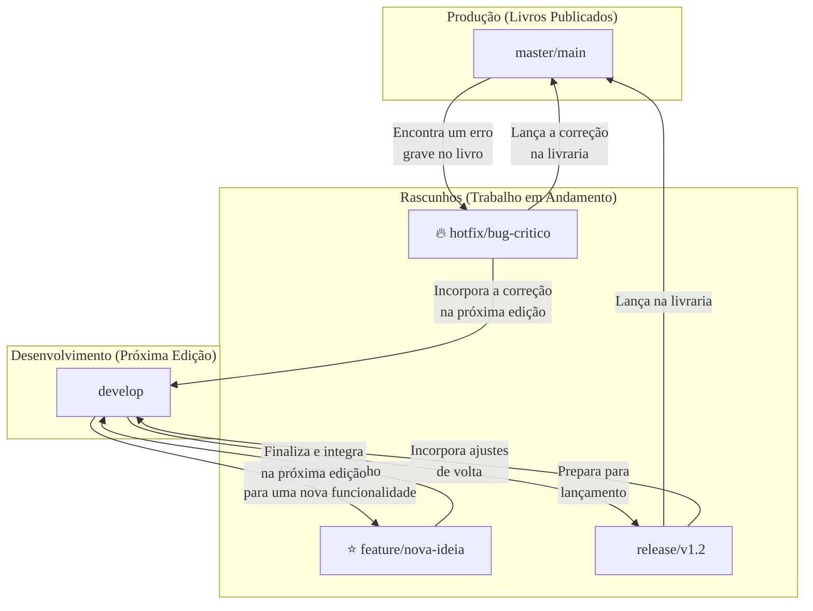

### Olá, futuro(a) aprovado(a)\! Vamos controlar as versões do seu estudo e configurar sua mente para gabaritar o Cebraspe.

Pense em Gerência de Configuração e Git como o processo de **escrever um livro em equipe** ✍️. Você precisa de um sistema para que vários autores possam trabalhar juntos sem que um apague o trabalho do outro e para manter um histórico de todas as versões do manuscrito.

-----

### \#\#\# Gerência de Configuração e Git: A Mágica de Escrever em Equipe

  * **O que é um VCS (Sistema de Controle de Versão)?** É o sistema que a equipe de autores usa.

      * **Centralizado (O Jeito Antigo):** Há apenas **um manuscrito mestre** guardado na editora. Para escrever, o autor precisa pegar o manuscrito, levar para casa, e depois devolver. Se a editora pegar fogo, todo o trabalho é perdido.
      * **Distribuído (O Jeito Git):** Cada autor tem uma **cópia completa e mágica do livro inteiro**, com todo o seu histórico, em seu próprio notebook. Ele pode escrever capítulos inteiros (`commit`) offline no avião. A editora é apenas um lugar para sincronizar as cópias.

  * **As 3 Áreas de Trabalho do Git:** É o fluxo de trabalho de um autor.

    1.  **Diretório de Trabalho (A Sua Mesa):** Onde você está escrevendo e rabiscando o capítulo. O texto está **Modificado**.
    2.  **Área de Preparação (*Staging Area*):** A sua **"pasta de revisão"**. Você gostou de um parágrafo. Você o move para essa pasta para incluí-lo na próxima versão oficial. O texto está **Preparado (*Staged*)**. O comando para isso é `git add`.
    3.  **Repositório (Seu Histórico Local):** No final do dia, você pega tudo o que está na "pasta de revisão" e salva permanentemente como uma nova versão no seu caderno de histórico. O texto está **Consolidado (*Committed*)**. O comando para isso é `git commit`.

> #### Foco Cebraspe (Pontos de Atenção e "Pegadinhas")
>
> >   * **Distribuído vs. Centralizado:** A banca vai dizer que o Git precisa de conexão com o servidor para fazer `commit`. **ERRADO\!** O `commit` é uma operação **local**. Você só precisa de conexão para sincronizar (`push`/`pull`).
> >   * **A *Staging Area* é a Chave:** A banca vai dizer que `git add` salva a mudança no repositório. **ERRADO\!** `git add` move da sua mesa para a **pasta de revisão (*Staging Area*)**. É o `git commit` que salva o que está na pasta de revisão para o seu histórico.

-----

### \#\#\# Branches e Gitflow: Escrevendo Universos Paralelos

  * **Branch (Ramificação):** É como criar um **universo paralelo** para o livro. Enquanto um autor escreve a história principal, outro pode criar um `branch` para escrever um capítulo experimental com um novo personagem, sem bagunçar a trama principal.

  * **Gitflow (O Método de Escrita da Editora):** É uma estratégia famosa para organizar os `branches`.

      * **`master` (ou `main`):** A prateleira da livraria com os **livros já publicados**. É o código em produção.
      * **`develop`:** A **mesa de edição principal**, onde os capítulos finalizados são juntados para a próxima edição do livro.
      * **`feature/*` (Capítulo Novo):** Rascunho para uma nova funcionalidade. **Sai de `develop` e volta para `develop`**.
      * **`release/*` (Revisão Final):** O livro indo para a gráfica. **Sai de `develop` e volta para `master` E `develop`**.
      * **`hotfix/*` (Correção Urgente):** Corrigir um erro grave no livro já publicado. **Sai de `master` e volta para `master` E `develop`**.

> #### Foco Cebraspe (Pontos de Atenção e "Pegadinhas")
>
> >   * O fluxo dos branches no Gitflow é o alvo principal. A banca vai dizer que uma `feature` sai da `master`. **ERRADO\!** Sai da `develop`.
> >   * Vão dizer que um `hotfix` volta só para a `master`. **ERRADO\!** Ele precisa voltar para a `develop` também, para que a correção não se perca na próxima edição.

-----

### \#\#\# Merge e Colaboração: Juntando as Histórias

  * **`git merge`:** É o ato do editor-chefe de **juntar** o capítulo experimental de um autor (`branch`) com o manuscrito principal.
  * **Conflito de Merge:** Acontece quando dois autores, em seus universos paralelos, reescreveram o **mesmo parágrafo** de formas diferentes. O sistema não consegue decidir qual é o certo e pede uma intervenção manual do editor.
  * **`git rebase`:** Uma alternativa ao `merge` que **reescreve a história**, criando uma linha do tempo mais limpa, como se um autor tivesse escrito seu capítulo depois do outro, sequencialmente. É uma ferramenta poderosa, mas perigosa se usada em capítulos que já foram compartilhados.

> #### Foco Cebraspe (Pontos de Atenção e "Pegadinhas")
>
> >   * **`merge` vs. `rebase`:** **`merge`** preserva o histórico real (com "nós" e ramificações) e é seguro. **`rebase`** cria um histórico linear e bonito, mas **altera o passado**, o que pode ser problemático em ramos públicos.
> >   * **`git pull`** é um atalho para `git fetch` (baixar as novidades) + `git merge` (juntar com o seu trabalho).

-----

### \#\#\# CI/CD e GitLab: A Gráfica Automatizada

  * **Integração Contínua (CI):** Toda vez que um autor envia um novo parágrafo, um **robô revisor** automaticamente verifica a gramática e se o texto se encaixa com o resto do livro.

  * **Entrega Contínua (*Continuous Delivery*):** Se o robô revisor aprova o texto, ele automaticamente gera um **e-book** e o deixa pronto, apenas esperando o "OK" do editor-chefe para publicar.

  * **Implantação Contínua (*Continuous Deployment*):** O mesmo que o anterior, mas o "OK" é automático. O e-book é publicado na Amazon no mesmo instante em que o robô o aprova.

  * **GitLab:** É a **editora moderna e completa**. Ela oferece o depósito de manuscritos (Git), o controle de tarefas e a gráfica automatizada (**GitLab CI/CD**) em um só lugar. A "receita" da automação da gráfica é escrita em um arquivo chamado **`.gitlab-ci.yml`**.

> #### Foco Cebraspe (Pontos de Atenção e "Pegadinhas")
>
> >   * A diferença entre os dois "CDs": Na **Entrega** (*Delivery*), a publicação final é **manual**. Na **Implantação** (*Deployment*), a publicação final é **automática**.
> >   * O coração da automação no GitLab é o arquivo **`.gitlab-ci.yml`**, que define a *pipeline* como código.

### \#\#\# Mapa Mental: O Fluxo de Trabalho do Gitflow

### **Classe:** B
### **Conteúdo:** Gerência de Configuração e Versionamento com Git

---

### **1. Gerência de Configuração e Versionamento com Git**

> #### **TEORIA-ALVO**
> A Gerência de Configuração de Software (GCS) é a disciplina de engenharia de software que visa controlar a evolução de um sistema de software, gerenciando seus artefatos, as versões e as mudanças realizadas sobre eles. A ferramenta central da GCS moderna é o Sistema de Controle de Versão (VCS).
>
> * **Tipos de VCS:**
>     * **Centralizado (CVCS):** Existe um único servidor central que contém todo o código versionado. Clientes fazem *checkout* de uma cópia de trabalho. Ex: Subversion (SVN), CVS.
>     * **Distribuído (DVCS):** Cada cliente possui um clone completo do repositório, incluindo todo o seu histórico. Permite operações offline, como *commits* e visualização de histórico. Ex: **Git**, Mercurial.
> * **Git - Conceitos Fundamentais:**
>     * **Natureza Distribuída:** A principal característica. Cada desenvolvedor tem uma cópia local e completa do repositório.
>     * **Repositório (`.git`):** O diretório onde o Git armazena os metadados e o banco de dados de objetos do projeto.
>     * **Três Estados/Áreas:** Um arquivo no Git pode estar em três estados principais, correspondentes a três áreas:
>         1.  **Modified (Modificado):** O arquivo foi alterado no **Diretório de Trabalho (*Working Directory*)**, mas ainda não foi preparado para o *commit*.
>         2.  **Staged (Preparado/Em Espera):** O arquivo modificado foi marcado para ser incluído no próximo *commit*. Esta área é conhecida como **Área de Preparação (*Staging Area*)** ou **Index**. O comando `git add` move as mudanças para esta área.
>         3.  **Committed (Consolidado):** Os dados estão armazenados de forma segura no repositório local. O comando `git commit` move as mudanças da *Staging Area* para o repositório.

> #### **FOCO CEBRASPE (Pontos de Atenção e "Pegadinhas")**
> > * **Distribuído vs. Centralizado:** A banca frequentemente explora esta diferença. Uma afirmação de que "o Git requer conexão constante com um servidor central para que um desenvolvedor possa realizar *commits*" está **ERRADA**. *Commits* são operações locais em um DVCS. A conexão é necessária apenas para sincronizar com repositórios remotos (`git push`, `git pull`).
> > * **A Função da Staging Area (Index):** Este é um diferencial do Git e um ponto crítico em provas. A banca pode afirmar que o comando `git add` envia as modificações diretamente para o repositório. **ERRADO**. O comando `git add` move as alterações do Diretório de Trabalho para a **Staging Area**. É o comando `git commit` que efetivamente grava as mudanças preparadas na *Staging Area* para o repositório local.
> > * **Snapshot, não Diferenças:** O Git armazena seu histórico como uma série de *snapshots* (instantâneos) do estado do projeto, e não como uma lista de diferenças entre arquivos (deltas), como em alguns outros sistemas.

---

### **Classe:** B
### **Conteúdo:** Branch e Estratégias de Ramificação (Gitflow)

---

### **2. Branches e Estratégias de Ramificação (Gitflow)**

> #### **TEORIA-ALVO**
> Um *branch* (ramificação) no Git é um ponteiro leve e móvel para um *commit*. É um mecanismo que permite o desenvolvimento de funcionalidades, correções ou experimentos de forma isolada, sem afetar a linha principal de desenvolvimento. O Git incentiva o uso extensivo de *branches*.
>
> * **HEAD:** É um ponteiro especial que indica em qual *branch* o desenvolvedor está trabalhando no momento.
> * **Gitflow:** É um modelo de fluxo de trabalho (workflow) e uma estratégia de ramificação prescritiva para o Git. Ele define nomes e papéis específicos para diferentes tipos de *branches* para organizar o desenvolvimento.
>     * **Branches Principais (Longa Duração):**
>         * **`master` (ou `main`):** Reflete o código em produção. Todo *commit* na `master` é uma nova versão de produção e deve receber uma *tag*.
>         * **`develop`:** É a linha de desenvolvimento principal, onde as funcionalidades são integradas para a próxima *release*. Representa o estado mais recente do desenvolvimento.
>     * **Branches de Suporte (Curta Duração):**
>         * **`feature/*`:** Usadas para desenvolver novas funcionalidades. **Partem de `develop` e são mescladas de volta em `develop`**.
>         * **`release/*`:** Usadas para preparar uma nova versão de produção (realizar testes finais, corrigir pequenos bugs). **Partem de `develop` e são mescladas de volta em `develop` E `master`**.
>         * **`hotfix/*`:** Usadas para corrigir bugs críticos em produção de forma rápida. **Partem de `master` e são mescladas de volta em `develop` E `master`**.

> #### **FOCO CEBRASPE (Pontos de Atenção e "Pegadinhas")**
> > * **Fluxo dos Branches no Gitflow:** A origem e o destino dos *branches* de suporte são o ponto mais cobrado. A banca vai afirmar que "uma *feature branch* no Gitflow parte da `master`". **ERRADO**. Parte de `develop`. A banca afirmará que "uma *hotfix branch* é mesclada apenas na `master`". **ERRADO**. Deve ser mesclada também na `develop` para que a correção seja incorporada na próxima *release* e não seja perdida.
> > * **Propósito da `master` e `develop`:** A banca pode confundir os papéis. O desenvolvimento cotidiano e a integração de novas funcionalidades ocorrem na `develop`. A `master` deve permanecer estável, refletindo apenas as versões lançadas em produção.
> > * **Gitflow como Única Estratégia:** Gitflow é um workflow, mas não o único (existem outros, como GitHub Flow ou GitLab Flow). A banca pode tratá-lo como uma regra inerente ao Git. **INCORRETO**. É um modelo de trabalho, não um comando ou funcionalidade do Git.

---

### **Classe:** B
### **Conteúdo:** Merge e Colaboração

---

### **3. Merge e Colaboração**

> #### **TEORIA-ALVO**
> A colaboração em Git é fundamentada na capacidade de integrar o trabalho realizado em diferentes *branches*. O principal comando para essa integração é o `git merge`.
>
> * **`git merge`:** Comando utilizado para unificar o histórico de dois ou mais *branches*.
>     * **Merge *fast-forward*:** Ocorre quando o *branch* de destino está em um ancestral direto do *branch* que está sendo mesclado. O Git simplesmente move o ponteiro do *branch* de destino para frente, sem criar um novo *commit*.
>     * **Merge de 3-vias (*three-way merge*):** Ocorre quando os históricos dos *branches* divergem. O Git localiza um ancestral comum e cria um novo *commit* de *merge*, que possui dois *commits* pais.
> * **Conflito de Merge:** Situação que ocorre quando o Git não consegue unificar as mudanças automaticamente, pois a mesma porção de um arquivo foi alterada em ambos os históricos que estão sendo mesclados. O Git pausa o processo e exige que o desenvolvedor resolva o conflito manualmente.
> * **`git rebase`:** É uma alternativa ao `merge` para integrar mudanças. Em vez de criar um *commit* de *merge*, o `rebase` reescreve o histórico do *branch* atual, aplicando seus *commits* sobre o topo do *branch* de destino, resultando em um histórico linear.
> * **Comandos Colaborativos:** `git clone` (cria uma cópia local de um repositório remoto), `git pull` (busca e mescla mudanças de um repositório remoto), `git push` (envia *commits* locais para um repositório remoto).

> #### **FOCO CEBRASPE (Pontos de Atenção e "Pegadinhas")**
> > * **`merge` vs. `rebase`:** A distinção é um ponto técnico avançado e testável. **`merge`** preserva o histórico como ele ocorreu, criando um grafo não linear, e é seguro para *branches* públicos. **`rebase`** cria um histórico limpo e linear, mas **reescreve o histórico de *commits***, sendo perigoso para *branches* que já foram compartilhados com outros desenvolvedores. Afirmar que `rebase` deve ser usado para atualizar um *branch* público como a `master` é **ERRADO** e uma má prática.
> > * **Conflito de Merge não é um Erro:** Um conflito não é um erro do Git, mas uma consequência natural do trabalho paralelo. É uma pausa no processo que exige intervenção humana para tomar a decisão correta.
> > * **`git pull`:** Este comando é, na verdade, um atalho para dois outros comandos: `git fetch` (que baixa os dados do repositório remoto) seguido de `git merge` (que mescla o *branch* remoto correspondente no *branch* local atual).

---

### **Classe:** C
### **Conteúdo:** CI/CD, Pipelines e GitLab

---

### **4. CI/CD, Pipelines e GitLab**

> #### **TEORIA-ALVO**
> CI/CD é um conjunto de práticas que visa automatizar as etapas do ciclo de vida de desenvolvimento de software, permitindo entregas mais rápidas e confiáveis.
>
> * **Integração Contínua (CI - *Continuous Integration*):** É a prática de automatizar a integração de mudanças de código de múltiplos desenvolvedores em um único repositório de software. Cada integração é verificada por um *build* automatizado e pela execução de testes automatizados.
> * **Entrega Contínua (CD - *Continuous Delivery*):** É a extensão da CI, onde as mudanças que passam por todas as etapas de teste são automaticamente empacotadas e preparadas para o lançamento. A implantação no ambiente de produção final ainda é um passo manual e deliberado.
> * **Implantação Contínua (CD - *Continuous Deployment*):** É a etapa seguinte à Entrega Contínua. Cada mudança que passa com sucesso por todo o *pipeline* é automaticamente implantada em produção.
> * **Pipeline:** Representa o fluxo de automação do processo de CI/CD. É composto por uma sequência de estágios (*stages*) e trabalhos (*jobs*), como `build` (compilação), `test` (teste), e `deploy` (implantação).
> * **GitLab e GitLab CI/CD:**
>     * **GitLab:** Uma plataforma DevOps completa que fornece, em uma única aplicação, gerenciamento de repositórios Git, rastreamento de issues, e um sistema de CI/CD integrado.
>     * **GitLab CI/CD:** A funcionalidade de CI/CD do GitLab. As *pipelines* são definidas em um arquivo de texto formatado em YAML, chamado **`.gitlab-ci.yml`**, localizado na raiz do repositório. Este arquivo descreve os estágios e os *jobs* a serem executados por agentes chamados **GitLab Runners**.

> #### **FOCO CEBRASPE (Pontos de Atenção e "Pegadinhas")**
> > * **Diferença entre os CDs (*Delivery* vs. *Deployment*):** Esta é a principal fonte de confusão. A **Entrega Contínua** (*Delivery*) termina com o artefato pronto para ser implantado, mas o *deploy* em produção é **manual**. A **Implantação Contínua** (*Deployment*) automatiza também o *deploy* em produção.
> > * **`.gitlab-ci.yml`:** Este arquivo é o coração da automação no GitLab. A banca pode afirmar que as *pipelines* são configuradas exclusivamente através da interface gráfica. **ERRADO**. A definição da *pipeline* como código no arquivo `.gitlab-ci.yml` é a prática padrão e permite o versionamento da própria *pipeline* junto com o código da aplicação (*Pipeline as Code*).
> > * **Pipeline como Processo Manual:** A essência de uma *pipeline* de CI/CD é a **automação**. Descrever a *pipeline* como uma sequência de tarefas manuais é conceitualmente **ERRADO**.
> > * **GitLab Runner:** É o agente que executa os *jobs* definidos no `.gitlab-ci.yml`. Sem *runners* configurados e disponíveis, a *pipeline* não pode ser executada.
