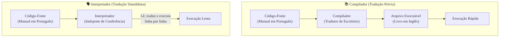

### Olá, futuro(a) aprovado(a)\! Vamos desvendar os Paradigmas de Programação para você construir uma base sólida para a prova do Cebraspe.

Pense em um **Paradigma de Programação** como um **estilo de dar instruções para alguém montar um móvel** 🛋️. Existem jeitos diferentes de escrever o manual, e cada um tem suas vantagens.

-----

### \#\#\# Paradigmas de Programação e os 4 Pilares da POO

  * **Os Estilos de Manual:**

      * **Imperativo (Foco no "COMO"):** É um manual super detalhado, passo a passo. "1. Pegue o parafuso A. 2. Coloque no buraco B. 3. Gire a chave 3 vezes...". A **Programação Orientada a Objetos (POO)** é um subtipo famoso deste estilo.
      * **Declarativo (Foco no "O QUÊ"):** É um manual que só tem a foto do móvel pronto. Ele diz "eu quero *isto*", e o montador (o computador) que se vire para descobrir o "como".

  * **Programação Orientada a Objetos (POO): O Manual Organizado por Peças**
    A POO é um jeito imperativo de organizar o manual não em uma lista gigante de passos, mas em **capítulos, um para cada peça do móvel**. Existe o capítulo da "Gaveta", da "Porta", etc. Cada peça (um **objeto**) tem suas características (cor, tamanho - os **atributos**) e suas próprias instruções de montagem e uso (abrir, fechar - os **métodos**).

  * **Os 4 Pilares da POO (As 4 Regras de Ouro para Projetar as Peças):**

    1.  **Abstração:** Ao projetar a "Gaveta", você foca no essencial: ela precisa de um fundo, lados e um puxador. Você ignora detalhes irrelevantes, como a marca do parafuso.
    2.  **Encapsulamento:** A "Gaveta" vem pré-montada de fábrica dentro de uma "cápsula". Você não pode mexer nos seus parafusos internos (`private`). Você só pode interagir com ela através do "puxador" (`public`), que é a interface segura. Isso protege a gaveta de ser quebrada.
    3.  **Herança:** Você já tem o manual para uma "Gaveta Padrão". Para criar uma "Gaveta com Divisórias", você aproveita o manual da padrão e só adiciona as instruções das divisórias. Uma `GavetaComDivisorias` **é uma** `GavetaPadrao`.
    4.  **Polimorfismo ("Muitas Formas"):** A instrução "Abra()" se comporta de forma diferente dependendo da peça. Se você mandar "Abra()" para o objeto `Gaveta`, ela desliza. Se mandar o mesmo comando "Abra()" para o objeto `Porta`, ela gira. É a mesma mensagem, com comportamentos diferentes.

> #### Foco Cebraspe (Pontos de Atenção e "Pegadinhas")
>
> >   * A banca vai trocar as definições dos pilares\! "Agrupar dados e métodos ocultando o interior é abstração". **ERRADO\!** É **encapsulamento**.
> >   * **Herança ("é um") vs. Composição ("tem um"):** A `GavetaComDivisorias` *é uma* `Gaveta`. Mas o `GuardaRoupa` *tem uma* `Gaveta`. A banca vai sugerir herança quando o correto seria composição.
> >   * **Sobrescrita vs. Sobrecarga:** A `Gaveta` e a `Porta` implementando o método `Abra()` de formas diferentes é **sobrescrita** (*overriding*). Ter na mesma classe vários métodos `parafusar(prego)` e `parafusar(parafuso)` é **sobrecarga** (*overloading*).

-----

### \#\#\# Compiladores e Interpretadores: Traduzindo o Manual

Depois que o manual (código-fonte) está escrito em português (linguagem de alto nível), ele precisa ser "traduzido" para a "linguagem do robô montador" (código de máquina). Existem duas formas de fazer isso.

  * **Compilador (O Tradutor de Escritório 📚):**

      * **Processo:** Você entrega o manual inteiro em português. O tradutor o converte **de uma vez só** para a língua do robô e te entrega um novo manual completo, traduzido (o arquivo executável). A tradução acontece **antes** da montagem.
      * **Resultado:** O robô lê o manual traduzido muito mais **rápido**. O tradutor já pega todos os erros de gramática do manual original durante a tradução.
      * **Exemplos:** C, C++.

  * **Interpretador (O Intérprete de Conferência 🗣️):**

      * **Processo:** Você lê uma frase do manual em português. O intérprete a traduz e a fala para o robô, que a executa imediatamente. A tradução e a montagem acontecem **ao mesmo tempo**, passo a passo.
      * **Resultado:** A montagem é mais **lenta**, pois há uma tradução a cada passo. Erros só são descobertos quando você lê a frase com erro. Por outro lado, é mais **portátil**: você pode levar seu manual em português para qualquer país, desde que tenha um intérprete local.
      * **Exemplos:** Python, Ruby.

  * **Modelo Híbrido (Java, C\# - O Melhor dos Dois Mundos):**

      * Um tradutor primeiro converte o manual em português para o **Esperanto** (*bytecode*), uma língua universal intermediária.
      * Depois, um intérprete super inteligente (a Máquina Virtual, como a JVM) lê o Esperanto e, para as partes mais repetitivas da montagem, ele faz uma tradução "relâmpago" para a língua nativa do robô (compilação JIT), deixando o processo quase tão rápido quanto o compilado.

> #### Foco Cebraspe (Pontos de Atenção e "Pegadinhas")
>
> >   * **Momento da Tradução:** Essa é a chave\! **Compilador = Traduz tudo ANTES**. **Interpretador = Traduz passo a passo DURANTE**.
> >   * **Desempenho:** A banca vai dizer que linguagens interpretadas são mais rápidas. **ERRADO\!** Em geral, código compilado para nativo tem melhor desempenho.
> >   * **Modelo Híbrido do Java:** É incorreto dizer que Java é puramente interpretado ou compilado. É **híbrido**. O compilador `javac` gera **bytecode**, não código de máquina executável.

### \#\#\# Mapa Mental: Comparativo (Compilador vs. Interpretador)

### **Classe:** B
### **Conteúdo:** Paradigmas: Programação Orientada a Objetos

---

### **1. Paradigmas de Programação e Programação Orientada a Objetos (POO)**

> #### **TEORIA-ALVO**
> Um **Paradigma de Programação** é um modelo ou estilo fundamental de programação que define a forma como os programas são estruturados e como os problemas computacionais são resolvidos. As linguagens podem ser classificadas em dois grandes grupos, sendo que muitas são multiparadigma.
>
> * **Paradigmas Principais:**
>     * **Imperativo:** Descreve a computação em termos de uma sequência de comandos que alteram o estado do programa. O foco é em "como" a tarefa é executada. Subparadigmas incluem a Programação Procedural e a **Programação Orientada a Objetos**.
>     * **Declarativo:** Descreve a lógica de uma computação sem detalhar seu fluxo de controle. O foco é em "o que" deve ser computado. Subparadigmas incluem a Programação Funcional e a Programação Lógica.
>
> * **Programação Orientada a Objetos (POO):**
>     * **Definição:** Um paradigma de programação imperativo que organiza o software em torno de "objetos". Um objeto é uma entidade que encapsula **dados (atributos)** e **comportamento (métodos)**. Objetos são instâncias de **classes**, que funcionam como moldes.
> * **Pilares da POO:**
>     1.  **Abstração:** Consiste em focar nos aspectos essenciais de um objeto, ignorando detalhes irrelevantes para o contexto. Define a interface do objeto, separando o "o que" ele faz do "como" ele faz.
>     2.  **Encapsulamento:** Consiste em agrupar os dados (atributos) e os métodos que os manipulam dentro de uma única unidade (a classe). Geralmente associado à **ocultação de informação (*information hiding*)**, que restringe o acesso direto ao estado interno do objeto, expondo-o apenas através de métodos públicos.
>     3.  **Herança:** Mecanismo que permite a uma classe (subclasse) herdar atributos e métodos de outra classe (superclasse). Representa o relacionamento **"é um"** e promove o reuso de código.
>     4.  **Polimorfismo:** (Do grego, "muitas formas"). É a capacidade de objetos de diferentes classes responderem à mesma mensagem (chamada de método) de maneiras específicas. Manifesta-se principalmente através da **sobrescrita de método (*overriding*)**, em que uma subclasse reimplementa um método da sua superclasse.

> #### **FOCO CEBRASPE (Pontos de Atenção e "Pegadinhas")**
> > * **Confusão entre os Pilares:** A banca frequentemente troca as definições dos quatro pilares. Exemplo: "O processo de agrupar dados e métodos em uma classe, ocultando sua complexidade interna, é conhecido como abstração." **ERRADO**. Essa é a definição de **encapsulamento**.
> > * **Herança ("é um") vs. Composição ("tem um"):** Esta é a distinção de design mais crítica. A **herança** representa uma relação de tipo (um `Cachorro` *é um* `Animal`). A **composição** representa uma relação de posse (um `Carro` *tem um* `Motor`). A banca pode apresentar um cenário de composição e sugerir a herança como a modelagem correta. Em design de software moderno, a composição é frequentemente preferível à herança por promover menor acoplamento.
> > * **Polimorfismo: Sobrescrita vs. Sobrecarga:** É crucial diferenciar os dois conceitos.
> >     * **Sobrescrita (*Overriding*):** Mesma assinatura de método, em classes diferentes (relação de herança). É o polimorfismo em tempo de execução.
> >     * **Sobrecarga (*Overloading*):** Mesmo nome de método, mas assinaturas diferentes (número ou tipo de parâmetros), na mesma classe. É polimorfismo em tempo de compilação.
> > * **Multiparadigma:** É incorreto afirmar que uma linguagem como Python ou Java é puramente orientada a objetos. **INCORRETO**. Elas são linguagens **multiparadigma**, suportando também os estilos procedural e funcional.

---

### **Classe:** C
### **Conteúdo:** Compiladores e Interpretadores

---

### **2. Compiladores e Interpretadores**

> #### **TEORIA-ALVO**
> Compiladores e interpretadores são programas tradutores que convertem o código-fonte escrito em uma linguagem de programação de alto nível para um formato que o computador possa executar.
>
> * **Compilador:**
>     * **Processo:** Traduz o código-fonte **integralmente**, de uma só vez, para uma linguagem de baixo nível (geralmente código de máquina ou um código intermediário como o *bytecode*), gerando um arquivo executável separado. O processo de compilação ocorre **antes** da execução.
>     * **Etapas Clássicas:** Análise Léxica (transforma texto em *tokens*), Análise Sintática (verifica a estrutura gramatical e cria uma árvore sintática), Análise Semântica (verifica o significado e a consistência dos tipos), Geração de Código Intermediário, Otimização e Geração de Código Final.
>     * **Características:** O programa resultante da compilação tende a ter **execução mais rápida**. A detecção de erros de sintaxe e tipo ocorre em tempo de compilação.
>     * **Exemplos de Linguagens:** C, C++, Go, Fortran.
> * **Interpretador:**
>     * **Processo:** Lê o código-fonte **linha por linha** (ou instrução por instrução), traduzindo e executando-a imediatamente. Não há uma etapa de tradução separada nem a criação de um arquivo executável. A tradução e a execução são intercaladas.
>     * **Características:** A execução tende a ser **mais lenta** que a de código compilado. Erros podem ser descobertos apenas em tempo de execução. Facilita a portabilidade, pois o mesmo código-fonte pode ser executado em qualquer plataforma que possua o interpretador.
>     * **Exemplos de Linguagens:** Python, Ruby, PHP (tradicionalmente).
> * **Modelo Híbrido (Compilação JIT - *Just-In-Time*):**
>     * **Descrição:** Abordagem que combina características de ambos. O código-fonte é inicialmente compilado para um código intermediário independente de plataforma (*bytecode*). Durante a execução, uma Máquina Virtual (e.g., JVM para Java, CLR para .NET) interpreta o *bytecode* e, para trechos de código executados com frequência (*hotspots*), compila-os para código de máquina nativo em tempo de execução (JIT).
>     * **Benefícios:** Combina a **portabilidade** do modelo interpretado com o **desempenho** do modelo compilado.
>     * **Exemplos de Linguagens:** Java, C#, Python (em implementações como PyPy).

> #### **FOCO CEBRASPE (Pontos de Atenção e "Pegadinhas")**
> > * **Momento da Tradução:** A principal diferença a ser testada. **Compilador** traduz o programa inteiro **antes** da execução. **Interpretador** traduz instrução por instrução **durante** a execução.
> > * **Desempenho vs. Portabilidade:** A banca pode afirmar que linguagens interpretadas são geralmente mais rápidas que as compiladas. **ERRADO**. A regra geral é que código compilado para código de máquina nativo tem melhor desempenho. Código interpretado, por sua vez, tende a ser mais portável.
> > * **Modelo Híbrido de Java e .NET:** É incorreto classificar Java ou C# como linguagens puramente compiladas ou puramente interpretadas. **INCORRETO**. Elas utilizam um modelo **híbrido**, com uma compilação inicial para *bytecode* e uma execução gerenciada por uma máquina virtual que pode incluir compilação JIT. A banca pode afirmar que o `javac` (compilador Java) gera código de máquina executável. **ERRADO**. Ele gera *bytecode* para a JVM.
