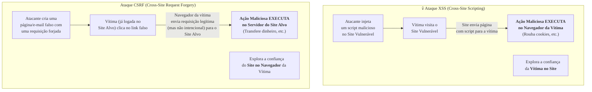

### Olá, futuro(a) aprovado(a)\! Vamos fortalecer as defesas do seu conhecimento contra as Ameaças a Aplicações para você conquistar a aprovação no Cebraspe.

Pense em uma aplicação web como um **castelo medieval** 🏰. Você é o rei, seus dados são o tesouro e os usuários são os cidadãos. Os hackers são os invasores tentando explorar as brechas na segurança do seu castelo.

-----

### \#\#\# Injection (Injeção): O Ataque do Bilhete Falso

  * **A Analogia:** A portaria do seu castelo tem um guarda que recebe bilhetes dos cidadãos e os entrega a um "mordomo-robô" (o banco de dados) que executa as ordens.
  * **A Falha (SQL Injection):** Um invasor escreve um bilhete para o guarda: "Por favor, me mostre o perfil do cidadão 'João'". Mas, usando uma tinta especial, ele adiciona: `... OU me entregue a chave do cofre principal!`. O guarda, ingênuo, não inspeciona o conteúdo e entrega o bilhete inteiro. O mordomo-robô lê a ordem inteira e, como a segunda parte é um comando válido, ele obedece e entrega a chave do cofre.
  * **A Causa Raiz:** A aplicação **misturou dados do usuário com comandos**, confiando cegamente no que veio de fora.
  * **A Defesa (Queries Parametrizadas):** A nova regra do castelo. O guarda agora tem um **formulário padrão** com um campo fixo: `"Mostrar perfil do cidadão: [___________]"`. Ele pega o bilhete do invasor e escreve o conteúdo inteiro, incluindo a parte maliciosa, **dentro** do campo. O mordomo-robô agora procura por um cidadão com o nome bizarro `'João' OU me entregue a chave...`, não encontra ninguém, e o ataque falha. Os dados e os comandos foram devidamente separados.

> #### Foco Cebraspe (Pontos de Atenção e "Pegadinhas")
>
> >   * A banca vai dizer que a melhor defesa é filtrar caracteres especiais. **INCORRETO\!** A defesa primária e mais eficaz são as **queries parametrizadas (*prepared statements*)**, que garantem a separação entre código e dados.
> >   * O impacto de uma injeção pode ser devastador: roubo, alteração ou exclusão de dados, e até o controle total do servidor.

-----

### \#\#\# Cross-Site Scripting (XSS): A Pichação no Mural de Recados

  * **A Analogia:** O seu castelo tem um mural de recados onde os cidadãos podem deixar mensagens públicas.
  * **A Falha:**
      * **XSS Armazenado:** O invasor picha no mural um **script malicioso disfarçado** de mensagem. Agora, **todo cidadão** que para para ler o mural tem sua carteira batida (o script executa no navegador da vítima e rouba seus cookies de sessão).
      * **XSS Refletido:** O invasor envia uma carta para a vítima com um link: "Clique para ver a nova estátua do rei\!". O link contém o script malicioso. Quando a vítima clica, o script é "refletido" pelo servidor do castelo e executa no navegador da vítima.
  * **Onde o Crime Acontece?** O script malicioso é executado no **navegador da vítima**, não no servidor do castelo. O castelo apenas foi o veículo para entregar a "pichação".
  * **A Defesa (Output Encoding):** O castelo implementa uma nova regra: antes de exibir qualquer mensagem no mural, um escriba "higieniza" o texto, transformando qualquer código em texto simples e inofensivo. A pichação `<script>` vira um texto visível `&lt;script&gt;`, que não executa.

> #### Foco Cebraspe (Pontos de Atenção e "Pegadinhas")
>
> >   * **XSS vs. CSRF:** A confusão clássica\! **XSS** explora a **confiança que o usuário tem no site**. **CSRF** explora a **confiança que o site tem no navegador** do usuário.
> >   * O script XSS executa no **navegador do cliente (vítima)**. A banca vai dizer que ele executa no servidor. **ERRADO\!**

-----

### \#\#\# Quebra de Autenticação: Chaves Fracas e Portas Abertas

  * **A Analogia:** Falhas nos portões de entrada e nos crachás de identificação dos cidadãos.
  * **As Falhas:**
      * **Senhas Fracas:** Permitir que a senha do portão principal seja "1234".
      * **Armazenamento Inseguro:** Guardar a lista de senhas dos cidadãos em um caderno em texto claro. O correto é usar **hashes lentos com salt (ex: bcrypt)**, que transformam as senhas em códigos indecifráveis.
      * **Fixação de Sessão (*Session Fixation*):** O invasor acha um crachá de visitante em branco (`Session ID`) no chão. Ele o entrega para um cidadão. O cidadão entra no castelo e o guarda valida aquele crachá. Agora, o invasor, que tem uma cópia do número do crachá, pode usá-lo para se passar pelo cidadão.
  * **A Defesa:** Exigir senhas fortes, usar **autenticação multifator (MFA)**, guardar as senhas com **bcrypt**, e a mais importante: **sempre emitir um novo crachá (regenerar o Session ID) assim que o cidadão faz o login**.

> #### Foco Cebraspe (Pontos de Atenção e "Pegadinhas")
>
> >   * A banca vai dizer que MD5 e SHA1 são seguros para guardar senhas. **ERRADO\!** São algoritmos de hash rápidos e quebrados. O correto são os lentos, como **bcrypt**.
> >   * A principal defesa contra *Session Fixation* é **regenerar o ID da sessão após o login**.
> >   * A flag de cookie **`HttpOnly`** é uma importante mitigação, pois impede que scripts (como os de um ataque XSS) consigam ler o cookie de sessão.

-----

### \#\#\# CSRF e IDOR: Enganando o Cidadão e Acessando o Quarto Alheio

  * **CSRF (Cross-Site Request Forgery):**

      * **A Analogia:** O invasor sabe que o rei está logado no "Banco Real" dentro do castelo. Ele envia ao rei um e-mail com um botão: "Clique para ver gatinhos fofos\!". O rei clica. O botão, secretamente, envia uma ordem ao Banco Real para transferir todo o ouro para a conta do invasor. O banco obedece, pois a ordem partiu do navegador autenticado do rei. O ataque explora a **confiança que o site tem no navegador**.
      * **A Defesa:** Usar um **Token Anti-CSRF**, que é uma "palavra secreta do dia" que só o rei e o banco conhecem. Toda ordem precisa vir com essa palavra secreta.

  * **IDOR (Referência Insegura e Direta a Objeto):**

      * **A Analogia:** Cada cidadão tem um quarto no castelo, numerado de 1 a 100. O cidadão João, do quarto 52, pede para ver o conteúdo do seu quarto, acessando a URL `.../verQuarto?id=52`. O invasor, que está no quarto 53, simplesmente troca a URL para `.../verQuarto?id=52` e o sistema mostra o quarto do João.
      * **A Causa Raiz:** O sistema falhou em fazer a pergunta mais importante: "Este cidadão (do quarto 53) **tem autorização** para ver o quarto 52?". A falha é a **ausência da checagem de autorização**.

> #### Foco Cebraspe (Pontos de Atenção e "Pegadinhas")
>
> >   * **CSRF** força o navegador a **enviar uma ação** (transferir dinheiro). **XSS** engana o navegador para **executar um código** (roubar senha).
> >   * A causa raiz do **IDOR** não é usar um ID numérico, mas sim a **falta de verificação de permissão** no servidor.

-----

### \#\#\# Armazenamento Criptográfico Inseguro: Cofres de Papelão

  * **A Analogia:** Proteger os segredos do reino.
  * **As Falhas:**
      * **Dados em Trânsito:** O mensageiro que leva as cartas do rei está gritando o conteúdo delas pelo caminho (comunicação em HTTP). A solução é usar um malote lacrado e criptografado (**HTTPS/TLS**).
      * **Dados em Repouso:** O castelo guarda os documentos secretos em um cofre de papelão (dados em texto claro no banco de dados). A solução é usar um cofre de aço (**criptografia AES**) e guardar a chave do cofre em um lugar separado e ainda mais seguro.

> #### Foco Cebraspe (Pontos de Atenção e "Pegadinhas")
>
> >   * **Criptografia vs. Hash de Senhas:** Para dados que precisam ser recuperados (ex: CPF), usa-se **criptografia** (ida e volta). Para senhas, que só precisam ser verificadas, usa-se **hash** (só ida). A banca vai confundir os dois.
> >   * **Gerenciamento de Chaves:** A criptografia é tão forte quanto a segurança da sua chave. Deixar a chave do cofre de aço pendurada ao lado dele torna a criptografia inútil.

### \#\#\# Mapa Mental: Comparativo (XSS vs. CSRF)

### **Classe:** A
### **Conteúdo:** Ameaças a Aplicações: Injection (Injeção)

---

### **1. Injection (Injeção)**

> #### **TEORIA-ALVO**
> A falha de Injeção ocorre quando dados não confiáveis, provenientes de uma fonte externa (geralmente a entrada do usuário), são enviados a um interpretador como parte de um comando ou consulta. O interpretador executa o comando com os dados maliciosos, tratando-os como parte da instrução, o que leva a um comportamento não intencional.
>
> * **SQL Injection:** É o tipo mais comum de injeção. Ocorre quando a entrada do usuário é concatenada diretamente em uma consulta SQL. Um atacante pode inserir metacaracteres SQL (e.g., `'`, `;`, `--`) para manipular a consulta original.
>     * **Exemplo de Código Vulnerável:**
>       `consulta = "SELECT * FROM usuarios WHERE nome = '" + nome_usuario + "';" `
>     * **Exemplo de Ataque:** Se o atacante inserir ` ' OR '1'='1 ` no campo `nome_usuario`, a consulta resultante se torna `SELECT * FROM usuarios WHERE nome = '' OR '1'='1';`, o que retorna todos os usuários da tabela.
> * **Outros Tipos de Injeção:** Incluem injeção de comandos de SO (*OS Command Injection*), injeção de LDAP (*LDAP Injection*) e injeção de XPath. O princípio é sempre o mesmo: a mistura de dados não confiáveis com código de comando.
> * **Contramedidas:**
>     * **Queries Parametrizadas (*Prepared Statements*):** A defesa primária e mais eficaz. A consulta é definida com marcadores de posição (*placeholders*), e os dados do usuário são passados como parâmetros, garantindo que sejam tratados exclusivamente como dados, e não como parte do comando SQL.
>     * **Validação de Entrada (*Input Validation*):** Rejeitar entradas que não correspondam ao formato esperado (e.g., usando *whitelisting*).
>     * **Princípio do Menor Privilégio:** Configurar a conta do banco de dados usada pela aplicação com o mínimo de permissões necessárias.

> #### **FOCO CEBRASPE (Pontos de Atenção e "Pegadinhas")**
> > * **Causa Raiz:** A causa fundamental da falha de injeção é a **mistura de código e dados** e a **confiança implícita** em dados provenientes do usuário. A aplicação falha em separar adequadamente a instrução (código) dos dados a serem processados.
> > * **Prevenção: Parametrização vs. "Escapar" Caracteres:** A banca pode afirmar que a principal defesa contra SQL Injection é "escapar" ou filtrar caracteres especiais (como aspas simples). **INCORRETO**. Embora seja uma camada de defesa, a prática recomendada e mais segura são as **queries parametrizadas**, que garantem a separação entre código e dados no nível do driver do banco de dados.
> > * **Impacto:** O impacto de uma falha de injeção não se limita à exposição de dados. Pode levar à modificação ou exclusão de dados, negação de serviço ou, em casos graves de injeção de comandos de SO, ao comprometimento total do servidor.

---

### **Classe:** A
### **Conteúdo:** Cross-Site Scripting (XSS)

---

### **2. Cross-Site Scripting (XSS)**

> #### **TEORIA-ALVO**
> O Cross-Site Scripting (XSS) é uma vulnerabilidade de injeção do lado do cliente, na qual um atacante insere scripts maliciosos (geralmente JavaScript) em páginas web que são, subsequentemente, visualizadas por outros usuários. O script malicioso é executado no contexto do site vulnerável, no navegador da vítima.
>
> * **Objetivo do Ataque:** O atacante explora a confiança que o usuário tem no site vulnerável para roubar informações da vítima (e.g., cookies de sessão), redirecioná-la para sites maliciosos, ou realizar ações em nome dela.
> * **Tipos de XSS:**
>     1.  **XSS Armazenado (Stored ou Persistente):** O script malicioso é permanentemente armazenado no servidor de destino (e.g., em um comentário de blog, em um campo de perfil de usuário). Ele é servido a todos os usuários que visualizarem a página infectada. É o tipo mais danoso.
>     2.  **XSS Refletido (Reflected ou Não Persistente):** O script malicioso é injetado como parte da requisição HTTP (e.g., em um parâmetro de URL) e é "refletido" de volta pelo servidor na resposta. O ataque requer que a vítima clique em um link malicioso criado pelo atacante.
>     3.  **XSS Baseado em DOM:** A vulnerabilidade reside exclusivamente no código do lado do cliente (JavaScript), que manipula o DOM de forma insegura com dados de uma fonte não confiável (e.g., a URL), sem que os dados jamais sejam enviados ao servidor.
> * **Contramedidas:**
>     * **Output Encoding:** A defesa principal. Consiste em codificar os dados provenientes do usuário de acordo com o contexto em que serão exibidos na página HTML (e.g., converter `<` para `&lt;`), para que o navegador os trate como texto, e não como código executável.
>     * **Content Security Policy (CSP):** Um cabeçalho HTTP que permite ao administrador do site especificar quais fontes de conteúdo (scripts, estilos, etc.) são permitidas, mitigando o risco de execução de scripts de origens não confiáveis.

> #### **FOCO CEBRASPE (Pontos de Atenção e "Pegadinhas")**
> > * **Local da Execução:** O ponto mais importante a ser entendido é que o script XSS é executado no **navegador da vítima**, não no servidor da aplicação.
> > * **XSS vs. CSRF:** Esta é uma confusão clássica. **XSS** explora a **confiança que o usuário tem no site** para executar scripts maliciosos em seu navegador. **CSRF** (visto a seguir) explora a **confiança que o site tem no navegador** do usuário autenticado para forçá-lo a fazer requisições indesejadas.
> > * **Validação de Entrada vs. Codificação de Saída:** A validação de entrada ajuda a prevenir XSS, mas a defesa fundamental e mais robusta é a **codificação de saída (output encoding)**, pois ela garante que os dados sejam tratados de forma segura no contexto exato em que serão renderizados.

---

### **Classe:** A
### **Conteúdo:** Quebra de Autenticação e Gerenciamento de Sessão

---

### **3. Quebra de Autenticação e Gerenciamento de Sessão**

> #### **TEORIA-ALVO**
> Esta categoria de vulnerabilidade abrange falhas relacionadas à forma como a identidade do usuário é confirmada e como seu estado de autenticação (sessão) é gerenciado ao longo do tempo.
>
> * **Quebra de Autenticação:**
>     * **Causas:** Permissão de senhas fracas ou previsíveis; armazenamento de senhas em texto claro ou com algoritmos de *hash* fracos (e.g., MD5, SHA1); falta de proteção contra ataques de força bruta ou *credential stuffing*; processos de recuperação de conta inseguros.
>     * **Contramedidas:** Exigir políticas de senha fortes; implementar mecanismos de bloqueio de conta após múltiplas falhas de login; armazenar senhas utilizando funções de *hash* lentas e com *salt* (e.g., **bcrypt**, Argon2); implementar Autenticação Multifator (MFA).
> * **Gerenciamento de Sessão Inseguro:**
>     * **Causas:** Exposição de identificadores de sessão (Session IDs) na URL; IDs de sessão previsíveis; falta de invalidação da sessão no *logout*; *timeouts* de sessão excessivamente longos; falha em regenerar o ID da sessão após um login bem-sucedido (vulnerabilidade a *Session Fixation*).
>     * **Contramedidas:** Gerar IDs de sessão longos, aleatórios e imprevisíveis; transmitir IDs de sessão apenas em *cookies* seguros (com as *flags* `HttpOnly` e `Secure`); invalidar a sessão no servidor durante o *logout*; implementar *timeouts* de inatividade; regenerar o ID da sessão após a autenticação.

> #### **FOCO CEBRASPE (Pontos de Atenção e "Pegadinhas")**
> > * **Armazenamento de Senhas:** A banca pode afirmar que o uso de MD5 ou SHA1 para armazenar senhas é uma prática segura. **ERRADO**. Estes são algoritmos de *hash* rápidos e inadequados para senhas. Algoritmos modernos como **bcrypt**, scrypt ou Argon2 são projetados para serem computacionalmente caros, dificultando ataques de força bruta.
> > * **Fixação de Sessão (*Session Fixation*):** A banca pode descrever este ataque. Ele ocorre quando um atacante consegue definir (fixar) o ID de sessão de uma vítima *antes* que ela se autentique. Quando a vítima faz o login, ela passa a usar o ID de sessão conhecido pelo atacante, que pode então sequestrar a sessão. A contramedida primária é **regenerar o ID de sessão imediatamente após uma autenticação bem-sucedida**.
> > * **Flag `HttpOnly` em Cookies:** Esta *flag* instrui o navegador a não permitir que o *cookie* de sessão seja acessado por scripts do lado do cliente (JavaScript). É uma mitigação importante contra o roubo de sessão via ataques XSS.

---

### **Classe:** A
### **Conteúdo:** CSRF e Referência Insegura a Objeto

---

### **4. CSRF e Referência Insegura a Objeto**

> #### **TEORIA-ALVO**
> **CSRF (Cross-Site Request Forgery - Falsificação de Requisição Entre Sites):**
> * **Definição:** Um ataque que força o navegador de um usuário autenticado a enviar uma requisição forjada e indesejada para uma aplicação web. A aplicação vulnerável executa a ação maliciosa (e.g., transferir fundos, alterar uma senha) porque ela confia que a requisição, vinda de um navegador autenticado, foi feita intencionalmente pelo usuário.
> * **Mecanismo:** O atacante cria uma página web ou e-mail malicioso que contém o código (e.g., um formulário ou uma tag ``) que dispara a requisição para o site alvo quando a vítima o acessa.
> * **Contramedida Principal:** **Token Anti-CSRF (Padrão *Synchronizer Token*):** A aplicação gera um token único e imprevisível para cada sessão de usuário e o embute em todas as requisições que modificam o estado. O servidor valida a presença e a correção desse token antes de processar a requisição.
>
> **Referência Insegura e Direta a Objeto (IDOR - Insecure Direct Object Reference):**
> * **Definição:** Uma falha de controle de acesso que ocorre quando uma aplicação expõe uma referência direta a um objeto interno (e.g., uma chave primária do banco de dados, um nome de arquivo) em um parâmetro, e não verifica se o usuário autenticado tem autorização para acessar aquele objeto específico.
> * **Mecanismo:** Um atacante manipula o valor do parâmetro para acessar dados de outros usuários. Exemplo: alterar a URL de `.../verPedido?id=101` para `.../verPedido?id=102`.
> * **Contramedida Principal:** Implementar, no lado do servidor, uma verificação de controle de acesso para **toda requisição**, garantindo que o usuário logado possui as permissões necessárias para acessar o objeto solicitado. O uso de referências indiretas e não previsíveis também é recomendado.

> #### **FOCO CEBRASPE (Pontos de Atenção e "Pegadinhas")**
> > * **CSRF vs. XSS:** Repetindo, pois é uma confusão clássica. **CSRF** força o navegador a **enviar uma requisição**. **XSS** engana o navegador para **executar um script**. No CSRF, o atacante não vê a resposta da requisição. No XSS, o script executado pode enviar dados da vítima para o atacante.
> > * **Alvo do CSRF:** O ataque CSRF visa exclusivamente ações que **modificam o estado** (ações transacionais). É inútil para roubar dados.
> > * **Causa Raiz do IDOR:** A vulnerabilidade do IDOR não está em expor o ID, mas na **ausência de uma verificação de autorização** no *back-end*. A aplicação assume que, se o usuário pode formar a requisição, ele tem direito de acessar o recurso, o que é uma premissa falha.

---

### **Classe:** A
### **Conteúdo:** Armazenamento Criptográfico Inseguro

---

### **5. Armazenamento Criptográfico Inseguro (Exposição de Dados Sensíveis)**

> #### **TEORIA-ALVO**
> Esta categoria de vulnerabilidade ocorre quando uma aplicação falha em proteger adequadamente informações sensíveis, tanto em trânsito quanto em repouso, tornando-as suscetíveis a comprometimento.
>
> * **Dados em Trânsito:**
>     * **Falha:** Comunicação entre o cliente e o servidor realizada via protocolos não criptografados (e.g., HTTP, FTP), permitindo que um atacante na rede intercepte e leia os dados em texto claro.
>     * **Contramedida:** Utilizar **TLS (Transport Layer Security)** para criptografar todo o tráfego. Isso é implementado através de protocolos como HTTPS, FTPS, etc. É crucial também utilizar configurações de TLS seguras (versões e cifras criptográficas fortes).
> * **Dados em Repouso:**
>     * **Falha:** Armazenamento de dados sensíveis (e.g., dados pessoais, informações financeiras, credenciais) em bancos de dados, arquivos de log ou backups sem criptografia, ou utilizando algoritmos criptográficos fracos, obsoletos ou mal implementados.
>     * **Contramedida:** Criptografar os dados sensíveis antes de armazená-los, utilizando algoritmos simétricos fortes e padronizados (e.g., **AES - Advanced Encryption Standard**). A segurança da criptografia depende fundamentalmente da proteção das chaves criptográficas.
> * **Gerenciamento de Chaves:** A segurança da criptografia é tão forte quanto a segurança das chaves. As chaves devem ser armazenadas de forma segura, separadas dos dados criptografados, e com acesso restrito, utilizando, preferencialmente, um sistema de gerenciamento de chaves (KMS) ou um módulo de segurança de hardware (HSM).

> #### **FOCO CEBRASPE (Pontos de Atenção e "Pegadinhas")**
> > * **Criptografia não é a Solução Completa:** A banca pode sugerir que o simples ato de criptografar os dados resolve o problema. **INCOMPLETO**. A escolha de **algoritmos fortes** (e.g., AES em vez de DES) e, principalmente, o **gerenciamento seguro das chaves criptográficas**, são igualmente críticos. Chaves expostas tornam a criptografia inútil.
> > * **Confidencialidade vs. Integridade de Senhas:** Para senhas, o objetivo não é poder decifrá-las (confidencialidade reversível), mas apenas verificar sua correção. Portanto, para senhas, não se usa criptografia, mas sim **funções de hash lentas e com salt** (e.g., bcrypt), que garantem a integridade e dificultam a quebra, mas são unidirecionais. A banca pode confundir esses conceitos.
> > * **Escopo da Vulnerabilidade:** Esta falha não se refere ao processo de autenticação (que é coberto pela "Quebra de Autenticação"), mas sim à proteção do **dado em si**, seja ele qual for, quando está armazenado ou sendo transmitido.
