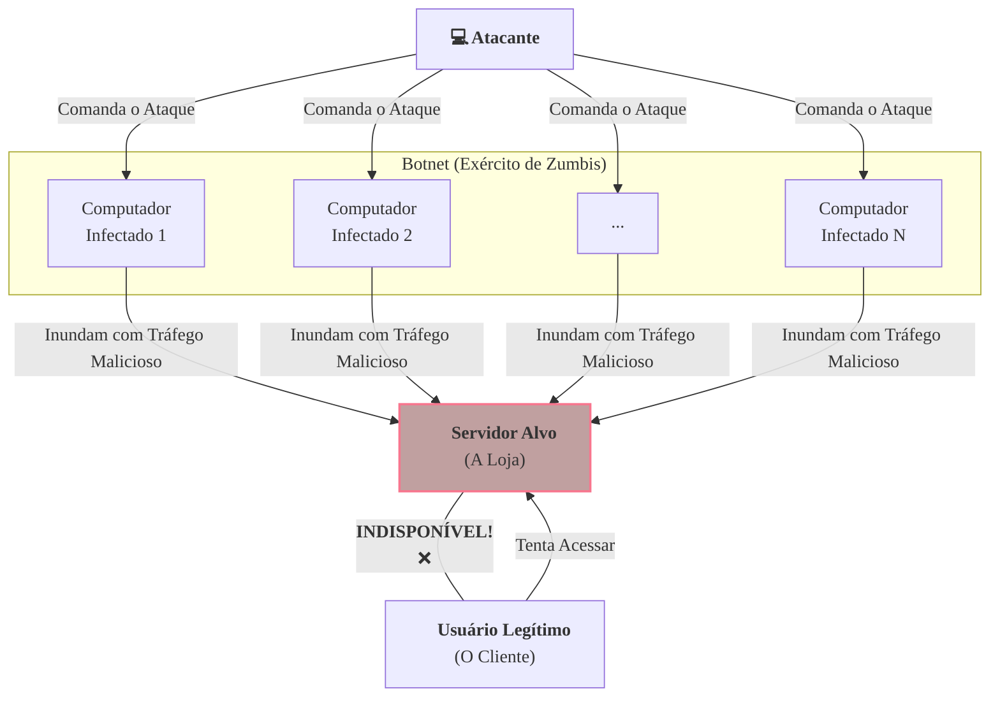

### Olá, futuro(a) aprovado(a)\! Vamos montar uma defesa robusta contra as questões de Ataques a Redes para você garantir a segurança da sua aprovação no Cebraspe.

Pense em um servidor ou rede como uma **grande loja de departamentos** 🏬. Os usuários legítimos são os clientes, e os hackers são os criminosos tentando causar problemas na sua loja.

-----

### \#\#\# Negação de Serviço (DoS/DDoS): O Tumulto na Porta da Loja

O objetivo deste ataque não é roubar nada, mas sim **impedir que os clientes de verdade consigam entrar e usar a loja**. O princípio da **Disponibilidade** é violado.

  * **DoS (Ataque de um Vândalo Só):** Um único vândalo fica na porta da loja, bloqueando a passagem de todo mundo.

  * **DDoS (Ataque de uma Multidão Contratada):** O vândalo é mais esperto. Ele infecta milhares de computadores na internet, transformando-os em "zumbis" 🧟. Todos esses zumbis, formando uma **botnet**, tentam entrar na loja ao mesmo tempo, causando um congestionamento gigantesco. É muito mais difícil de parar.

  * **Categorias do Tumulto:**

    1.  **Ataques de Volume:** A multidão tenta entupir a avenida de acesso à loja com milhares de carros (tráfego UDP/ICMP), consumindo toda a largura de banda.
    2.  **Ataques de Protocolo:** A multidão trava a porta giratória. Cada zumbi empurra a porta até a metade e a abandona, deixando várias portas semiabertas e travando o mecanismo. O ataque **SYN Flood** faz exatamente isso com o protocolo TCP.
    3.  **Ataques à Camada de Aplicação:** A multidão entra na loja, e cada zumbi vai até um vendedor e faz uma pergunta super complicada que exige uma longa pesquisa, esgotando o tempo e a energia de todos os vendedores (consumindo a CPU e a memória do servidor).

> #### Foco Cebraspe (Pontos de Atenção e "Pegadinhas")
>
> >   * **DoS vs. DDoS:** A diferença é a **origem**. **DoS = uma fonte**. **DDoS = múltiplas fontes**. A banca vai dizer que a única diferença é o volume. **INCORRETO**. A natureza distribuída é o que torna o DDoS tão perigoso.
> >   * **Objetivo do Ataque:** A banca vai dizer que DDoS visa roubar dados. **ERRADO\!** O objetivo é **tornar o serviço indisponível**.
> >   * **SYN Flood:** Lembre-se que ele explora o *three-way handshake* do TCP, deixando conexões semiabertas para esgotar os recursos do servidor.

-----

### \#\#\# Força Bruta e Varredura de Portas: Arrombando o Cofre e Espiando as Janelas

  * **Ataque de Força Bruta (Tentando Todas as Chaves):**

      * **O que é?** O ladrão está na frente do cofre da loja e tenta, sistematicamente, **todas as combinações possíveis** do segredo.
      * **Ataque de Dicionário:** Uma versão mais esperta, onde o ladrão tenta apenas as senhas mais óbvias e comuns que ele tem em sua "lista negra".
      * **Defesa Principal:** **Autenticação Multifator (MFA)**. Mesmo que o ladrão descubra a senha do cofre, ele ainda precisará da impressão digital do gerente para abri-lo.

  * **Varredura de Portas (*Port Scanning*):**

      * **O que é?** Antes de invadir, o ladrão dá uma volta no quarteirão e **espia por todas as janelas e portas (as portas de rede)** da loja para ver quais estão abertas e o que tem em cada sala (quais serviços estão rodando). É uma fase de **reconhecimento**.
      * **SYN Scan (Batida Discreta):** O ladrão bate de leve na janela (`SYN`). Se alguém de dentro responde "oi?" (`SYN-ACK`), ele sabe que a sala está ocupada (porta aberta) e sai correndo antes de completar a conversa. É mais furtivo.

> #### Foco Cebraspe (Pontos de Atenção e "Pegadinhas")
>
> >   * **Varredura de Portas é Reconhecimento:** A varredura não é o ataque final. É a **fase preparatória** para descobrir as fraquezas da loja.
> >   * O **SYN Scan** é mais furtivo (*stealth*) que o Connect Scan porque não completa a conexão TCP, dificultando o registro do evento nos logs da aplicação.

-----

### \#\#\# Decepção, Falsificação e Interceptação: Enganação e Espionagem

  * **Phishing (O E-mail do Gerente Falso):**

      * É um ataque de **engenharia social**. O ladrão envia um e-mail para você, **se passando pela sua loja favorita**, dizendo: "Você ganhou um cupom\! Clique aqui e faça o login para resgatar". O link te leva para uma **fachada de loja falsa**, idêntica à original. Quando você digita seu login e senha, o ladrão os rouba.

  * **Eavesdropping (A Escuta na Praça de Alimentação):**

      * O ladrão senta na mesa ao lado da sua na praça de alimentação (uma rede Wi-Fi pública e insegura) e usa um aparelho para **"ouvir" toda a sua conversa** na internet.
      * **Defesa Principal:** **Criptografia**. Usar HTTPS ou uma VPN é como colocar sua conversa em um envelope lacrado e codificado. O ladrão pode pegar o envelope, mas não consegue ler o que está dentro.

  * **DNS Spoofing (A Troca das Placas de Endereço):**

      * O ataque mais traiçoeiro. Você digita no GPS o endereço correto da sua loja favorita. No meio do caminho, o ladrão **troca as placas de rua (envenena o cache DNS)**. O GPS, enganado, te leva para o endereço de uma loja falsa controlada pelo ladrão, mesmo você tendo digitado o endereço certo.

> #### Foco Cebraspe (Pontos de Atenção e "Pegadinhas")
>
> >   * **Phishing é Engenharia Social:** O vetor de ataque é a **manipulação psicológica do usuário**, não uma falha técnica no sistema da loja.
> >   * **Defesa contra Eavesdropping:** A criptografia (HTTPS, VPN) é a principal defesa. Um firewall controla o acesso, mas não criptografa o conteúdo do tráfego.
> >   * **DNS Spoofing vs. Phishing:** No **Phishing**, a vítima clica em um link falso. No **DNS Spoofing**, a vítima digita o endereço correto, mas a infraestrutura de rede a redireciona para o lugar errado.

### \#\#\# Mapa Mental: O Ataque DDoS

### **Classe:** A
### **Conteúdo:** Ataques a Redes: Negação de Serviço (DoS/DDoS)

---

### **1. Negação de Serviço (DoS/DDoS)**

> #### **TEORIA-ALVO**
> Um ataque de **Negação de Serviço (DoS - *Denial of Service*)** tem como objetivo tornar um recurso de computação, como um servidor web ou uma rede, indisponível para seus usuários legítimos, sem, contudo, invadir ou roubar informações do sistema.
>
> * **DoS (Denial of Service):** O ataque é originado a partir de uma **única fonte**.
> * **DDoS (Distributed Denial of Service):** É uma variante mais poderosa e complexa, na qual o ataque é lançado simultaneamente a partir de **múltiplas fontes distribuídas geograficamente**. Essas fontes são, tipicamente, computadores comprometidos (chamados de "zumbis" ou "bots") que formam uma rede controlada pelo atacante, conhecida como **botnet**.
> * **Categorias de Ataques:**
>     1.  **Ataques de Volume:** Visam consumir toda a largura de banda da rede do alvo, inundando-o com um volume massivo de tráfego. Exemplo: UDP Flood, ICMP Flood.
>     2.  **Ataques de Protocolo:** Consomem os recursos dos servidores ou de equipamentos de rede intermediários, explorando vulnerabilidades nos protocolos de comunicação. Exemplo: **SYN Flood**, que explora o processo de *three-way handshake* do TCP, deixando conexões semiabertas.
>     3.  **Ataques à Camada de Aplicação:** Direcionados a uma aplicação específica, enviando requisições que parecem legítimas, mas que são projetadas para consumir recursos do servidor (CPU, memória) de forma intensiva. Exemplo: HTTP Flood.
> * **Impacto Principal:** Violação do princípio da **Disponibilidade**.
> * **Contramedidas:** Implementação de *firewalls* e Sistemas de Prevenção de Intrusão (IPS), limitação de taxa (*rate limiting*), e contratação de serviços especializados de mitigação anti-DDoS, que utilizam *scrubbing centers* para filtrar o tráfego malicioso.

> #### **FOCO CEBRASPE (Pontos de Atenção e "Pegadinhas")**
> > * **DoS vs. DDoS:** A principal diferença a ser testada é a **origem** do ataque. **DoS** = uma fonte. **DDoS** = múltiplas fontes. Essa característica torna os ataques DDoS significativamente mais difíceis de mitigar, pois é complexo diferenciar o tráfego de ataque distribuído do tráfego legítimo.
> > * **Objetivo do Ataque:** A banca pode afirmar que um ataque DDoS visa roubar dados. **ERRADO**. O objetivo primordial é **esgotar os recursos** do alvo (seja largura de banda, capacidade de processamento do firewall, conexões do servidor) para torná-lo inacessível.
> > * **SYN Flood:** Este é um exemplo clássico de ataque de protocolo. O atacante envia um grande número de pacotes TCP `SYN` (primeira etapa do *handshake*), mas nunca responde aos pacotes `SYN-ACK` do servidor, deixando um grande número de conexões em estado semiaberto e consumindo os recursos da tabela de conexões do servidor.

---

### **Classe:** A
### **Conteúdo:** Ataques de Força Bruta e Varredura de Portas

---

### **2. Força Bruta e Varredura de Portas**

> #### **TEORIA-ALVO**
> **Ataque de Força Bruta (*Brute Force*):**
> * **Definição:** Um método de ataque criptoanalítico que consiste em tentar sistematicamente todas as combinações possíveis de senhas ou chaves até que a correta seja encontrada.
> * **Variações:** Um **Ataque de Dicionário** é uma forma otimizada que tenta apenas senhas de uma lista predefinida de palavras comuns, frases e senhas vazadas.
> * **Impacto Principal:** Violação da **Confidencialidade** e da **Autenticidade**, ao permitir o acesso não autorizado a contas e sistemas.
> * **Contramedidas:**
>     * Implementação de políticas de senha forte (exigindo comprimento, complexidade e rotação).
>     * Mecanismos de bloqueio de conta após um número limitado de tentativas de login malsucedidas.
>     * Uso de CAPTCHA para diferenciar humanos de bots.
>     * A contramedida mais eficaz é a **Autenticação Multifator (MFA)**.
>
> **Varredura de Portas (*Port Scanning*):**
> * **Definição:** Uma técnica de **reconhecimento** utilizada para sondar um servidor ou host em busca de portas abertas. O objetivo é identificar quais serviços e aplicações estão em execução no alvo, a fim de encontrar potenciais vetores de ataque.
> * **Técnicas Comuns:**
>     * **TCP Connect Scan:** Tenta estabelecer uma conexão TCP completa. É confiável, mas facilmente detectável nos logs do alvo.
>     * **TCP SYN Scan (ou *Half-open Scan*):** Envia um pacote `SYN`. Se um `SYN-ACK` for recebido, a porta está aberta. O atacante não completa o *handshake*, tornando a varredura mais furtiva (*stealth*).
> * **Ferramenta Padrão:** Nmap é a ferramenta mais conhecida e utilizada para realizar varreduras de portas.
> * **Contramedidas:** Configuração de *firewalls* para descartar pacotes destinados a portas fechadas, e uso de Sistemas de Detecção de Intrusão (IDS) para identificar padrões de varredura.

> #### **FOCO CEBRASPE (Pontos de Atenção e "Pegadinhas")**
> > * **MFA como Defesa contra Força Bruta:** A MFA é a mitigação mais robusta, pois mesmo que o atacante consiga adivinhar a senha (o primeiro fator), ele ainda será barrado pela exigência do segundo fator (e.g., um token).
> > * **Varredura de Portas como Fase de Reconhecimento:** A varredura de portas não é um ataque que explora uma vulnerabilidade em si. É uma etapa **preparatória** de um ataque, pertencente à fase de **reconhecimento**, onde o atacante coleta informações sobre a superfície de ataque do alvo.
> > * **Furtividade do SYN Scan:** A banca pode questionar por que o SYN Scan é considerado mais furtivo que o Connect Scan. A razão é que, ao não completar o *three-way handshake* do TCP, a tentativa de conexão muitas vezes não é registrada pelos logs das aplicações que estão escutando na porta, apenas por firewalls ou IDS mais avançados.

---

### **Classe:** A
### **Conteúdo:** Ataques de Decepção, Falsificação e Interceptação

---

### **3. Decepção, Falsificação e Interceptação**

> #### **TEORIA-ALVO**
> Esta categoria de ataques explora a confiança e utiliza técnicas de engano, falsificação de identidade ou interceptação de comunicação para comprometer a segurança.
>
> * **Phishing:**
>     * **Definição:** Um ataque de **engenharia social**, geralmente distribuído por e-mail, que visa enganar a vítima para que ela revele informações sensíveis (como credenciais de acesso, dados de cartão de crédito) ou para que execute um código malicioso. O ataque se baseia na criação de mensagens e páginas web falsas que se passam por entidades legítimas e confiáveis (e.g., um banco, uma rede social).
>     * **Spear Phishing:** Uma variante direcionada, na qual o ataque é personalizado para um indivíduo ou organização específica, aumentando sua credibilidade e chance de sucesso.
> * **Eavesdropping (Interceptação Passiva):**
>     * **Definição:** O ato de "escutar" ou monitorar secretamente a comunicação entre duas partes em uma rede para obter informações. É um ataque passivo que viola a **confidencialidade**.
>     * **Cenário Comum:** Ocorre em redes inseguras, como redes Wi-Fi públicas e abertas.
>     * **Contramedida Principal:** **Criptografia**. O uso de protocolos como TLS (resultando em HTTPS) e VPNs torna os dados interceptados ilegíveis para o atacante.
> * **DNS Spoofing (Envenenamento de Cache DNS):**
>     * **Definição:** Um ataque no qual dados falsos são introduzidos no cache de um servidor DNS, fazendo com que o servidor retorne um endereço IP incorreto (malicioso) para um nome de domínio legítimo.
>     * **Objetivo:** Redirecionar usuários para sites falsos (e.g., sites de *phishing*) sem seu conhecimento, mesmo que eles tenham digitado a URL correta no navegador.
>     * **Contramedida Principal:** **DNSSEC (Domain Name System Security Extensions)**, que utiliza assinaturas digitais para garantir a autenticidade e a integridade das respostas DNS.

> #### **FOCO CEBRASPE (Pontos de Atenção e "Pegadinhas")**
> > * **Phishing como Engenharia Social:** É fundamental entender que o vetor de ataque do *phishing* é a **manipulação psicológica do usuário**, e não necessariamente uma falha técnica no sistema.
> > * **Eavesdropping e Criptografia:** A defesa mais eficaz contra a interceptação passiva é a criptografia em trânsito. A banca pode afirmar que um *firewall* impede o *eavesdropping*. **INCORRETO**. Um *firewall* controla o acesso, mas não protege o conteúdo do tráfego permitido.
> > * **DNS Spoofing vs. Phishing:** Ambos os ataques podem levar a vítima a um site falso, mas os mecanismos são diferentes. No **Phishing**, a vítima é tipicamente enganada para clicar em um link malicioso. No **DNS Spoofing**, a vítima digita a URL correta, mas a infraestrutura de rede (o servidor DNS comprometido) a redireciona para o endereço IP errado.
