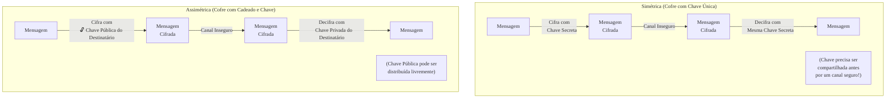

### Olá, futuro(a) aprovado(a)\! Vamos decifrar os segredos da Criptografia para você garantir a confidencialidade da sua vaga no Cebraspe.

Pense em criptografia como a arte de **enviar mensagens secretas durante uma guerra** 🕵️‍♂️. Você precisa garantir que, mesmo que o inimigo intercepte seu mensageiro, ele não consiga ler a sua mensagem.

-----

### \#\#\# Fundamentos: A Arte dos Códigos Secretos

  * **Os Elementos da Mensagem:**
      * **Texto Claro:** A mensagem original, legível. "Atacar ao amanhecer".
      * **Texto Cifrado:** A mensagem codificada, ilegível. "XyZ7@\#$&\*".
      * **Cifragem:** O ato de transformar o texto claro em cifrado.
      * **Chave Criptográfica 🔑:** O **segredo** que você usa para cifrar e decifrar a mensagem. Pode ser uma "palavra-chave" ou um "livro de códigos".
  * **Princípio de Kerckhoffs:** A segurança do seu sistema de mensagens não deve depender do segredo da "máquina de codificar" (o algoritmo), pois o inimigo pode capturá-la. A segurança deve residir **apenas na chave**, que é pequena e fácil de proteger ou trocar.

> #### Foco Cebraspe (Pontos de Atenção e "Pegadinhas")
>
> >   * A criptografia, por si só, garante principalmente a **confidencialidade**. Ela é uma ferramenta essencial para os outros pilares (como integridade e autenticidade), mas não os garante sozinha. E ela não tem a ver com **disponibilidade**.
> >   * A banca vai dizer que a segurança está no algoritmo secreto. **ERRADO\!** Pelo Princípio de Kerckhoffs, a segurança está na **chave secreta**.

-----

### \#\#\# Criptografia Simétrica: O Cofre com Chave Única

  * **A Analogia:** Você e seu general usam um **cofre idêntico com uma chave secreta única**. Você escreve a mensagem, tranca no cofre e envia. O general, que tem uma cópia exata da mesma chave, usa-a para abrir o cofre e ler a mensagem.
  * **Características:**
      * **Velocidade:** É um método **extremamente rápido**. Ótimo para trancar grandes volumes de documentos (dados).
      * **O Grande Problema:** **Como você fez para entregar a cópia da chave para o general em segurança?** Se o inimigo interceptar a chave, todas as suas mensagens futuras estarão comprometidas. É o **problema da distribuição de chaves**.
  * **Padrão Atual:** O cofre mais moderno e seguro hoje é o **AES**. O antigo, **DES**, é como um cofre de madeira, facilmente arrombável.

> #### Foco Cebraspe (Pontos de Atenção e "Pegadinhas")
>
> >   * A principal **vantagem** da criptografia simétrica é a **velocidade**.
> >   * A principal **desvantagem** é o **gerenciamento e a distribuição segura das chaves**.

-----

### \#\#\# Criptografia Assimétrica: O Cofre com Cadeado e Chave

Este método é mais engenhoso e resolve o problema da distribuição de chaves.

  * **A Analogia:** Agora, cada pessoa tem um par mágico:

      * Uma **Chave Pública (um cadeado aberto 🔓):** Você distribui cópias do seu cadeado aberto para todo mundo que quiser.
      * Uma **Chave Privada (a única chave que abre o seu cadeado 🔑):** Você a guarda em segredo absoluto.

  * **As Duas Grandes Utilidades:**

    1.  **Para Garantir CONFIDENCIALIDADE (Enviar uma mensagem secreta PARA o general):**
        Você pega um dos **cadeados abertos do general (a chave pública dele)**. Você coloca sua mensagem em uma caixa e a tranca com o cadeado dele. Agora, a caixa está segura. **Apenas o general, com sua chave privada única**, pode abrir o cadeado e ler a mensagem.

    2.  **Para Garantir AUTENTICIDADE (PROVAR que uma mensagem veio DE você - Assinatura Digital):**
        Você escreve uma mensagem. Para provar que foi você, você usa sua **chave privada secreta** para "carimbar" a mensagem com um selo mágico. Qualquer pessoa no mundo pode pegar um dos seus **cadeados abertos (sua chave pública)** e testá-lo no selo. Se o cadeado "reconhecer" o selo, é a prova matemática de que só poderia ter sido você que o criou.

  * **Característica:** É um processo **muito mais lento** que o da chave simétrica.

> #### Foco Cebraspe (Pontos de Atenção e "Pegadinhas")
>
> >   * A banca vai inverter tudo\! Decore esta regra:
> >       * Para **CONFIDENCIALIDADE**, você cifra com a **PÚBLICA** de quem vai receber.
> >       * Para **ASSINATURA DIGITAL**, você assina com a sua **PRIVADA**.
> >   * A criptografia assimétrica é **lenta**. A banca vai dizer que é mais rápida. **ERRADO\!**
> >   * Uma assinatura digital, por si só, **não deixa a mensagem secreta**. Ela só prova a autoria e a integridade.

-----

### \#\#\# Aplicações Práticas: O Melhor dos Dois Mundos

No mundo real, como na comunicação segura pela internet (HTTPS), usamos uma **abordagem híbrida**.

  * **Protegendo Dados em Trânsito (A Conversa Segura):**
    Seria muito lento usar o método do cadeado (assimétrica) para cada frase da conversa. Então, fazemos o seguinte:

    1.  No início da conversa, usamos o método lento do **cadeado (assimétrica)** para um único propósito: trocar em segurança a **chave secreta do cofre (simétrica)** que usaremos hoje.
    2.  Uma vez que ambos têm a chave do cofre, toda a conversa restante é feita usando o método rápido do **cofre (simétrica)**.

  * **Protegendo Dados em Repouso (O Arquivo Secreto):**
    Para proteger os documentos guardados no seu computador, usamos o método rápido do **cofre (simétrica, com o algoritmo AES)**, pois ele é ideal para grandes volumes de dados. O grande desafio aqui é: onde guardar a chave do cofre em segurança?

> #### Foco Cebraspe (Pontos de Atenção e "Pegadinhas")
>
> >   * A comunicação segura na web (TLS/HTTPS) usa uma **abordagem híbrida**. Criptografia assimétrica para trocar a chave, e simétrica para trocar os dados.
> >   * Lembre-se da regra de ouro: **Simétrica para DADOS, Assimétrica para CHAVES e ASSINATURAS.**

### \#\#\# Mapa Mental: Criptografia Simétrica vs. Assimétrica (para Confidencialidade)

### **Classe:** A
### **Conteúdo:** Criptografia: Fundamentos

---

### **1. Criptografia: Fundamentos**

> #### **TEORIA-ALVO**
> **Criptografia** é a ciência e a arte de escrever mensagens em código secreto, com o objetivo de proteger a informação contra acesso não autorizado. É um pilar fundamental da segurança da informação, sendo o principal mecanismo para garantir a **confidencialidade**.
>
> * **Conceitos Básicos:**
>     * **Texto Claro (*Plaintext*):** A mensagem original, legível.
>     * **Texto Cifrado (*Ciphertext*):** A mensagem codificada, ilegível.
>     * **Cifragem (ou Encriptação):** O processo de converter texto claro em texto cifrado.
>     * **Decifragem (ou Decriptação):** O processo de reverter o texto cifrado para o texto claro original.
>     * **Algoritmo Criptográfico (Cifra):** O conjunto de regras matemáticas utilizado para a cifragem e decifragem.
>     * **Chave Criptográfica:** Um parâmetro secreto que controla a operação do algoritmo. A segurança dos sistemas criptográficos modernos reside na confidencialidade da chave, não do algoritmo (Princípio de Kerckhoffs).
> * **Tipos de Criptografia:** A criptografia moderna se divide em duas categorias principais, com base no gerenciamento das chaves:
>     1.  **Criptografia Simétrica (ou de Chave Secreta):** Utiliza uma única chave secreta, compartilhada entre as partes, tanto para cifrar quanto para decifrar a informação.
>     2.  **Criptografia Assimétrica (ou de Chave Pública):** Utiliza um par de chaves matematicamente relacionadas: uma chave pública (que pode ser distribuída livremente) e uma chave privada (que deve ser mantida em segredo por seu dono).

> #### **FOCO CEBRASPE (Pontos de Atenção e "Pegadinhas")**
> > * **Objetivos da Criptografia:** A banca pode afirmar que a criptografia, por si só, garante todos os pilares da segurança da informação. **ERRADO**. O objetivo primário da criptografia é prover **confidencialidade**. Embora seja um bloco de construção essencial para garantir **integridade**, **autenticidade** e **não repúdio** (quando combinada com outras técnicas como funções de hash e assinaturas digitais), ela não garante esses princípios isoladamente e não tem relação direta com a **disponibilidade**.
> > * **Princípio de Kerckhoffs:** A segurança de um sistema criptográfico não deve depender do sigilo do algoritmo, mas sim do sigilo da **chave**. A banca pode sugerir que a segurança de um sistema reside em manter o algoritmo em segredo. **ERRADO**. Algoritmos seguros são públicos e extensivamente analisados pela comunidade acadêmica.
> > * **Criptografia vs. Esteganografia:** **Criptografia** oculta o **conteúdo** da mensagem. **Esteganografia** oculta a **existência** da mensagem (e.g., escondendo uma mensagem de texto dentro de um arquivo de imagem).

---

### **Classe:** A
### **Conteúdo:** Sistemas Criptográficos Simétricos

---

### **2. Criptografia Simétrica**

> #### **TEORIA-ALVO**
> A criptografia simétrica, também conhecida como criptografia de chave secreta ou de chave única, é um sistema no qual a mesma chave é utilizada tanto para o processo de cifragem quanto para o de decifragem da informação.
>
> * **Funcionamento:** O remetente utiliza a chave secreta para cifrar o texto claro. O destinatário, que deve possuir a mesma chave secreta, a utiliza para decifrar o texto cifrado e obter a mensagem original.
> * **Características:**
>     * **Velocidade:** É extremamente rápida e computacionalmente eficiente, sendo ideal para a cifragem de grandes volumes de dados (bulk data encryption).
>     * **Problema Principal:** A **distribuição segura da chave**. As partes envolvidas na comunicação precisam compartilhar a chave secreta previamente por meio de um canal seguro, o que representa um grande desafio logístico e de segurança.
> * **Tipos de Cifras Simétricas:**
>     * **Cifras de Bloco:** Operam em blocos de dados de tamanho fixo (e.g., 128 bits). Exemplos de algoritmos: **AES (Advanced Encryption Standard)**, DES (Data Encryption Standard), 3DES.
>     * **Cifras de Fluxo:** Operam em um fluxo contínuo de dados, geralmente cifrando um bit ou um byte de cada vez. Exemplo de algoritmo: RC4.
> * **Padrão Atual:** O **AES** é o padrão globalmente aceito e recomendado para criptografia simétrica, tendo substituído o antigo DES, que é considerado inseguro.

> #### **FOCO CEBRASPE (Pontos de Atenção e "Pegadinhas")**
> > * **Vantagem Principal (Velocidade):** A principal vantagem da criptografia simétrica, e ponto de comparação com a assimétrica, é seu **alto desempenho**. A banca frequentemente testará essa característica.
> > * **Desvantagem Principal (Distribuição de Chaves):** O principal desafio da criptografia simétrica é o **gerenciamento e a distribuição segura das chaves**. Em uma rede com N usuários, para que todos possam se comunicar secretamente dois a dois, seriam necessárias $N \times (N-1)/2$ chaves, um problema de escalabilidade conhecido.
> > * **Algoritmos (AES vs. DES):** Qualquer afirmação de que o DES é um algoritmo seguro para uso em sistemas modernos está **ERRADA**. O AES é o padrão atual, oferecendo tamanhos de chave de 128, 192 e 256 bits.

---

### **Classe:** A
### **Conteúdo:** Sistemas Criptográficos Assimétricos

---

### **3. Criptografia Assimétrica**

> #### **TEORIA-ALVO**
> A criptografia assimétrica, também conhecida como criptografia de chave pública, utiliza um par de chaves matematicamente relacionadas para cada entidade: uma **chave pública** e uma **chave privada**.
>
> * **Funcionamento e Propriedades:**
>     * A chave pública pode ser livremente distribuída, enquanto a chave privada deve ser mantida em absoluto sigilo por seu proprietário.
>     * O que é cifrado com uma chave só pode ser decifrado com sua chave par correspondente.
>     * **Solução para o Problema da Distribuição de Chaves:** A criptografia assimétrica resolve o problema da distribuição de chaves da criptografia simétrica, pois não há necessidade de compartilhar um segredo previamente.
> * **Aplicações Principais:**
>     1.  **Confidencialidade:** Para enviar uma mensagem confidencial a uma entidade, o remetente cifra a mensagem com a **chave PÚBLICA** da entidade destinatária. Somente a entidade destinatária, com sua **chave PRIVADA** correspondente, poderá decifrar a mensagem.
>     2.  **Assinatura Digital (para Autenticidade, Integridade e Não Repúdio):** Para assinar um documento, o remetente calcula um *hash* do documento e cifra esse *hash* com sua própria **chave PRIVADA**. O resultado é a assinatura digital. Qualquer pessoa pode verificar a assinatura usando a **chave PÚBLICA** do remetente.
> * **Características:** É computacionalmente intensiva e, portanto, significativamente mais **lenta** que a criptografia simétrica.
> * **Algoritmos Comuns:** RSA, ElGamal, ECC (Elliptic Curve Cryptography).

> #### **FOCO CEBRASPE (Pontos de Atenção e "Pegadinhas")**
> > * **Uso das Chaves:** Este é o ponto mais crítico e explorado em provas. A banca vai inverter o uso das chaves. É mandatório memorizar:
> >     * Para **CONFIDENCIALIDADE**: Cifra-se com a **PÚBLICA** do destinatário.
> >     * Para **ASSINATURA DIGITAL**: Assina-se (cifra-se o hash) com a **PRIVADA** do remetente.
> > * **Velocidade:** É incorreto afirmar que a criptografia assimétrica é mais rápida que a simétrica. **ERRADO**. A criptografia assimétrica é ordens de magnitude mais **lenta**, sendo inadequada para cifrar grandes volumes de dados.
> > * **Assinatura Digital vs. Criptografia para Confidencialidade:** A assinatura digital, por si só, **não torna a mensagem confidencial**. Ela apenas garante autenticidade, integridade e não repúdio. O conteúdo da mensagem permanece em texto claro.

---

### **Classe:** A
### **Conteúdo:** Criptografia de Dados em Trânsito e em Repouso

---

### **4. Proteção de Dados em Trânsito e em Repouso**

> #### **TEORIA-ALVO**
> A aplicação prática da criptografia envolve a proteção de dados em seus dois principais estados: quando estão sendo transmitidos por uma rede (em trânsito) e quando estão armazenados em um dispositivo (em repouso).
>
> * **Proteção de Dados em Trânsito:**
>     * **Desafio:** Proteger a comunicação em redes inseguras como a Internet.
>     * **Solução (Abordagem Híbrida):** Utiliza-se uma combinação de criptografia simétrica e assimétrica para obter o melhor de ambos os mundos.
>         1.  A **criptografia assimétrica** é usada no início da comunicação para estabelecer um canal seguro e para trocar ou negociar uma **chave de sessão simétrica** única para aquela comunicação.
>         2.  Após a troca segura da chave, toda a comunicação subsequente é cifrada utilizando a **criptografia simétrica** (com a chave de sessão), que é muito mais rápida e eficiente.
>     * **Exemplo Prático:** O protocolo **TLS (Transport Layer Security)**, que protege o protocolo HTTP (resultando no HTTPS).
> * **Proteção de Dados em Repouso:**
>     * **Desafio:** Proteger dados armazenados em discos rígidos, SSDs, bancos de dados ou backups contra acesso não autorizado em caso de roubo físico ou acesso indevido ao sistema.
>     * **Solução:** Geralmente, utiliza-se a **criptografia simétrica** (e.g., AES) para cifrar os dados, devido ao seu alto desempenho para lidar com grandes volumes. A técnica pode ser aplicada em diferentes níveis:
>         * **Criptografia de Disco Completo (FDE - *Full Disk Encryption*):** Cifra todo o dispositivo de armazenamento.
>         * **Criptografia de Arquivos/Pastas.**
>         * **Criptografia em Nível de Banco de Dados.**
>     * **Desafio Principal:** O **gerenciamento seguro das chaves criptográficas** (*key management*). A segurança dos dados cifrados depende inteiramente da proteção das chaves usadas para cifrá-los.

> #### **FOCO CEBRASPE (Pontos de Atenção e "Pegadinhas")**
> > * **A Abordagem Híbrida:** A banca frequentemente questionará como a segurança é provida em protocolos como o TLS/HTTPS. É fundamental entender que não se usa a criptografia assimétrica para cifrar todos os dados da comunicação (devido à sua lentidão), mas sim para o estabelecimento seguro da chave de sessão simétrica.
> > * **Aplicação de Simétrica vs. Assimétrica:** A regra geral a ser lembrada é: **Criptografia simétrica para cifrar DADOS**. **Criptografia assimétrica para gerenciar CHAVES e ASSINATURAS**.
> > * **Gerenciamento de Chaves:** Em um cenário de proteção de dados em repouso, a banca pode focar no desafio do gerenciamento das chaves. Afirmar que "basta criptografar os dados com AES para garantir a segurança" está **INCOMPLETO**. A forma como a chave AES é armazenada, protegida e rotacionada é igualmente crítica para a segurança geral do sistema.
