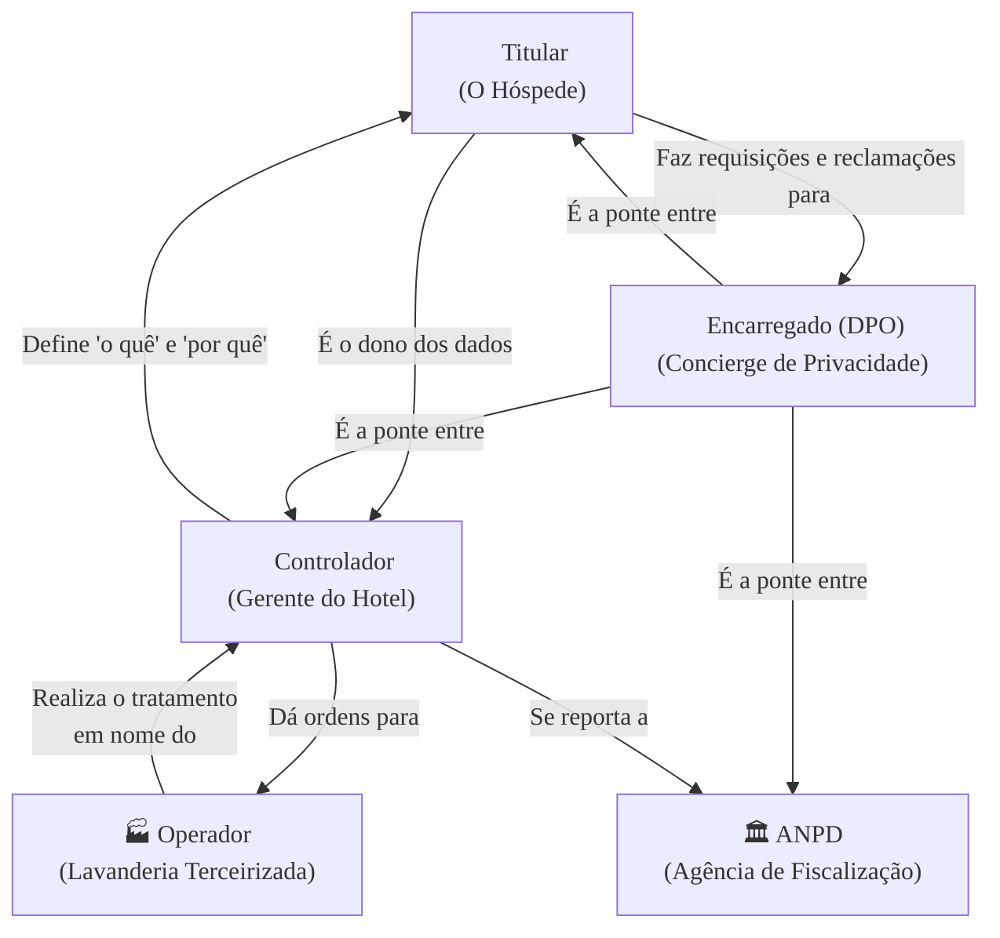

### Olá, futuro(a) aprovado(a)\! Vamos fazer o check-in no conhecimento sobre a LGPD para você garantir uma estadia tranquila na prova do Cebraspe.

Pense na Lei Geral de Proteção de Dados (LGPD) como o **"Código de Defesa do Hóspede" de um hotel de luxo** 🏨. A lei define as regras de como o hotel (as empresas e o governo) pode tratar as informações pessoais dos seus hóspedes (os cidadãos).

-----

### \#\#\# Fundamentos e Definições: O Básico do "Código do Hóspede"

  * **O Objetivo da Lei:** Proteger os seus direitos de liberdade e privacidade. Você é o dono dos seus dados.

  * **Definições Chave:**

      * **Dado Pessoal:** Qualquer informação que possa te identificar. Não é só o seu nome e CPF. O número do seu quarto de hotel, a placa do seu carro ou até mesmo o seu pedido de "café da manhã sem glúten" podem ser dados pessoais se, em conjunto, puderem te identificar.
      * **Dado Pessoal Sensível:** É a "gaveta de segredos" do hóspede. Informações que podem gerar discriminação, como sua religião, opinião política, orientação sexual ou dados de saúde. Essa gaveta exige uma chave de segurança extra.
      * **Tratamento:** É **TUDO** o que o hotel faz com seus dados, desde a `coleta` no check-in, passando pelo `uso` para te mandar uma oferta, até a `eliminação` do seu registro.
      * **Dado Anonimizado:** É quando o hotel pega sua ficha de hóspede e apaga seu nome e CPF com uma "tinta mágica" que torna **impossível** descobrir que aquela ficha era sua. Um dado verdadeiramente anonimizado não é mais protegido pela LGPD.

  * **Onde a Lei se Aplica? (Âmbito de Aplicação)**
    A lei tem poder **extraterritorial**. Se um hotel na Argentina vende pacotes para brasileiros e coleta dados de pessoas que estão no Brasil, esse hotel precisa seguir as regras da LGPD, mesmo que seus computadores estejam na Argentina.

> #### Foco Cebraspe (Pontos de Atenção e "Pegadinhas")
>
> >   * **Pessoa Natural vs. Jurídica:** A LGPD protege dados de **pessoas físicas**. O CNPJ e o e-mail `financeiro@empresa.com.br` de uma empresa não são protegidos pela LGPD.
> >   * **Dado Identificável:** A banca vai focar nisso. Lembre-se, não é só o que te identifica diretamente. Um dado é pessoal se ele te torna **identificável**.
> >   * **Dado Anonimizado:** Se o processo de anonimização for reversível, o dado continua sendo considerado pessoal e protegido pela lei.

-----

### \#\#\# Atores e Princípios: A Equipe do Hotel e Suas Regras

A LGPD define quem é quem e as regras que todos devem seguir.

  * **Os Atores (A Equipe do Hotel):**

      * **Titular:** O **hóspede**. Você. O dono dos dados.
      * **Controlador:** O **gerente geral do hotel**. É ele quem **decide** *por que* e *quais* dados serão coletados ("Preciso do seu CPF para a nota fiscal").
      * **Operador:** A **empresa de lavanderia terceirizada**. Ela **executa uma ordem** do hotel (lava as roupas dos hóspedes), tratando os dados (as roupas) em nome e sob as instruções do controlador.
      * **Encarregado (DPO):** O **concierge de privacidade**. É a pessoa para quem você liga se tiver alguma dúvida ou reclamação sobre como seus dados estão sendo usados. Ele é a ponte entre os hóspedes, o hotel e a "fiscalização".

  * **Os 10 Princípios (Os Mandamentos na Parede da Recepção):**
    São as regras de ouro que o hotel deve seguir. As mais importantes para a prova são:

    1.  **Finalidade:** O hotel tem que te dizer exatamente **para que** ele quer seus dados.
    2.  **Adequação:** O uso dos dados tem que ser compatível com a finalidade informada.
    3.  **Necessidade (Minimização):** O hotel só pode coletar o **mínimo** de dados necessário para atingir aquela finalidade. Pedir seu tipo sanguíneo para fazer uma reserva de quarto é um exagero e fere este princípio.
    4.  **Transparência:** O hotel tem que ser claro e transparente sobre tudo o que faz com seus dados.
    5.  **Segurança:** O hotel deve usar medidas para proteger suas fichas de hóspedes contra ladrões.
    6.  **Responsabilização e Prestação de Contas:** Não basta ser bom, tem que **provar** que é bom. O hotel tem que ser capaz de demonstrar que cumpre todas as regras.

> #### Foco Cebraspe (Pontos de Atenção e "Pegadinhas")
>
> >   * **Controlador vs. Operador:** A distinção mais cobrada\! **Controlador = MANDA (decide)**. **Operador = OBEDECE (executa)**. A banca vai dar um exemplo (uma loja que usa um serviço de nuvem) e perguntar quem é quem (a loja é a controladora, o provedor de nuvem é o operador).
> >   * Se a lavanderia (operador) perder suas roupas, a responsabilidade pode ser **solidária** com o hotel (controlador).

-----

### \#\#\# Bases Legais e Direitos: Quando Podem Usar Seus Dados e o Que Você Pode Exigir

  * **Bases Legais (As Justificativas para o Tratamento):**
    O hotel não pode simplesmente usar seus dados porque quer. Ele precisa de uma "justificativa legal" (uma base legal). O consentimento é só uma delas\!

      * **Consentimento:** Você autoriza o hotel a te mandar e-mails de marketing.
      * **Cumprimento de Obrigação Legal:** O hotel é obrigado por lei a guardar sua ficha por um tempo.
      * **Execução de Contrato:** O hotel precisa dos seus dados para cumprir o contrato de hospedagem que você fez.
      * **Legítimo Interesse:** O hotel usa seu histórico de hospedagem para te oferecer um desconto na próxima visita, sem pedir um novo consentimento.

  * **Seus Direitos como Hóspede (Titular):**
    Você tem superpoderes sobre seus dados\! A qualquer momento, você pode exigir do hotel:

      * **Acesso:** "Quero ver tudo o que vocês sabem sobre mim".
      * **Correção:** "Meu telefone está errado, corrijam agora".
      * **Eliminação:** "Já fui embora, por favor, apaguem meus dados que vocês coletaram com meu consentimento".
      * **Portabilidade:** "Estou me mudando para o hotel concorrente. Enviem meu histórico de preferências para eles".
      * **Revogação do consentimento:** "Não quero mais receber seus e-mails de marketing. Parem agora".

> #### Foco Cebraspe (Pontos de Atenção e "Pegadinhas")
>
> >   * **Consentimento não é a única base legal\!** A banca vai dizer que tudo precisa de consentimento. **ERRADO\!** Execução de contrato e obrigação legal são bases legais muito comuns que não exigem consentimento.
> >   * **Direito à Eliminação não é absoluto:** Você pode pedir para apagar seus dados, mas se o hotel for obrigado por outra lei a guardá-los por 5 anos (por questões fiscais, por exemplo), essa outra lei prevalece.
> >   * **ANPD:** A "agência de fiscalização de hotéis" é a **Autoridade Nacional de Proteção de Dados**, o órgão que fiscaliza e aplica as multas da LGPD.

### \#\#\# Mapa Mental: Os Atores da LGPD e Suas Relações

### **Classe:** A
### **Conteúdo:** LGPD: Fundamentos, Definições e Âmbito de Aplicação

---

### **1. Fundamentos, Definições e Âmbito de Aplicação da LGPD**

> #### **TEORIA-ALVO**
> A Lei Geral de Proteção de Dados Pessoais, Lei nº 13.709/2018, é o marco legal brasileiro que dispõe sobre o tratamento de dados pessoais, em meios físicos e digitais, por pessoa natural ou por pessoa jurídica de direito público ou privado.
>
> * **Objetivos (Art. 1º):** A lei tem por objetivo proteger os direitos fundamentais de liberdade e de privacidade e o livre desenvolvimento da personalidade da pessoa natural.
> * **Definições Chave (Art. 5º):**
>     * **Dado Pessoal:** Informação relacionada a pessoa natural identificada ou **identificável**.
>     * **Dado Pessoal Sensível:** Categoria especial de dados que, por sua natureza, exige maior proteção. Refere-se a dados sobre origem racial ou étnica, convicção religiosa, opinião política, filiação a sindicato ou a organização de caráter religioso, filosófico ou político, dado referente à saúde ou à vida sexual, dado genético ou biométrico, quando vinculado a uma pessoa natural.
>     * **Tratamento:** Toda e qualquer operação realizada com dados pessoais, como as que se referem a coleta, produção, recepção, classificação, utilização, acesso, reprodução, transmissão, distribuição, processamento, arquivamento, armazenamento, eliminação, avaliação ou controle da informação, modificação, comunicação, transferência, difusão ou extração.
>     * **Anonimização:** Utilização de meios técnicos razoáveis e disponíveis no momento do tratamento, por meio dos quais um dado perde a possibilidade de associação, direta ou indireta, a um indivíduo. O dado anonimizado não é considerado dado pessoal para os fins da lei.
> * **Âmbito de Aplicação Territorial (Art. 3º):** A LGPD se aplica a qualquer operação de tratamento, independentemente do meio, do país de sede do agente de tratamento ou do país onde os dados estejam localizados, desde que:
>     1.  A operação de tratamento seja realizada no território nacional;
>     2.  A atividade de tratamento tenha por objetivo a oferta ou o fornecimento de bens ou serviços ou o tratamento de dados de indivíduos localizados no território nacional; ou
>     3.  Os dados pessoais objeto do tratamento tenham sido coletados no território nacional.

> #### **FOCO CEBRASPE (Pontos de Atenção e "Pegadinhas")**
> > * **Dado Pessoal Identificável:** A banca explorará a amplitude do conceito. Um dado é considerado pessoal não apenas quando identifica diretamente (e.g., nome, CPF), mas também quando, em conjunto com outros, torna uma pessoa **identificável** (e.g., endereço IP, dados de geolocalização, um ID de cookie).
> > * **Pessoa Natural vs. Pessoa Jurídica:** A proteção da LGPD é restrita a dados de **pessoa natural**. A banca pode afirmar que dados de uma pessoa jurídica (e.g., CNPJ, razão social, e-mail genérico como `financeiro@empresa.com.br`) são protegidos pela LGPD. **ERRADO**.
> > * **Extraterritorialidade:** O âmbito de aplicação da lei é um ponto crítico. Uma empresa sediada na Europa que vende produtos para o mercado brasileiro e, para tanto, coleta dados de indivíduos no Brasil, está **sujeita** às regras da LGPD, mesmo que seus servidores estejam localizados no exterior.
> > * **Dado Anonimizado:** Uma vez que o dado é efetivamente anonimizado, ele sai do escopo de aplicação da LGPD. Contudo, se o processo de anonimização for reversível, o dado continua sendo considerado pessoal.

---

### **Classe:** A
### **Conteúdo:** Atores e Princípios do Tratamento de Dados

---

### **2. Atores do Tratamento de Dados e Princípios**

> #### **TEORIA-ALVO**
> A LGPD estabelece papéis e responsabilidades claras para os agentes envolvidos no tratamento de dados e um conjunto de princípios que devem nortear todas as operações.
>
> * **Atores do Tratamento (Art. 5º):**
>     * **Titular:** A pessoa natural a quem se referem os dados pessoais.
>     * **Controlador:** Pessoa (natural ou jurídica) a quem competem as **decisões** referentes ao tratamento de dados pessoais. Define a finalidade e os meios essenciais do tratamento.
>     * **Operador:** Pessoa (natural ou jurídica) que realiza o tratamento de dados pessoais **em nome e sob as instruções do controlador**.
>     * **Encarregado (DPO - *Data Protection Officer*):** Pessoa indicada pelo controlador para atuar como canal de comunicação entre o controlador, os titulares dos dados e a Autoridade Nacional de Proteção de Dados (ANPD).
> * **Princípios do Tratamento de Dados (Art. 6º):** Todas as atividades de tratamento de dados pessoais deverão observar a boa-fé e os seguintes princípios:
>     1.  **Finalidade:** Realização do tratamento para propósitos legítimos, específicos, explícitos e informados ao titular.
>     2.  **Adequação:** Compatibilidade do tratamento com as finalidades informadas.
>     3.  **Necessidade:** Limitação do tratamento ao mínimo necessário para a realização de suas finalidades (princípio da minimização).
>     4.  **Livre Acesso:** Garantia aos titulares de consulta facilitada e gratuita.
>     5.  **Qualidade dos Dados:** Garantia de exatidão, clareza, relevância e atualização dos dados.
>     6.  **Transparência:** Garantia de informações claras, precisas e facilmente acessíveis sobre o tratamento.
>     7.  **Segurança:** Utilização de medidas técnicas e administrativas para proteger os dados.
>     8.  **Prevenção:** Adoção de medidas para prevenir a ocorrência de danos.
>     9.  **Não Discriminação:** Impossibilidade de realização do tratamento para fins discriminatórios ilícitos ou abusivos.
>     10. **Responsabilização e Prestação de Contas (*Accountability*):** Demonstração, pelo agente, da adoção de medidas eficazes e capazes de comprovar o cumprimento das normas.

> #### **FOCO CEBRASPE (Pontos de Atenção e "Pegadinhas")**
> > * **Controlador vs. Operador:** Esta é a distinção mais importante e frequentemente cobrada. O **Controlador decide "o quê" e "por quê"** o tratamento é feito. O **Operador executa "como"** o controlador instruiu. A banca apresentará um cenário (e.g., uma empresa contrata um serviço de computação em nuvem para armazenar seus dados) e solicitará a identificação dos papéis (a empresa é a controladora; o provedor de nuvem é o operador).
> > * **Princípio da Necessidade:** A banca pode apresentar um cenário em que uma empresa, para um simples cadastro, solicita dados excessivos e não essenciais para a finalidade informada (e.g., pedir tipo sanguíneo para um cadastro de e-commerce). Tal prática viola o princípio da **necessidade**.
> > * **Responsabilidade Solidária:** Em caso de dano patrimonial, moral, individual ou coletivo, o operador responde solidariamente com o controlador quando descumprir as obrigações da lei ou quando não tiver seguido as instruções lícitas do controlador.

---

### **Classe:** A
### **Conteúdo:** Bases Legais e Direitos do Titular

---

### **3. Bases Legais para o Tratamento e Direitos do Titular**

> #### **TEORIA-ALVO**
> O tratamento de dados pessoais somente poderá ser realizado se enquadrado em uma das hipóteses legais (bases legais) previstas na LGPD, que também garante um rol de direitos aos titulares.
>
> * **Bases Legais para Tratamento de Dados Pessoais (Art. 7º):** A lei prevê dez hipóteses, incluindo, entre as mais comuns:
>     * Mediante o fornecimento de **consentimento** pelo titular.
>     * Para o **cumprimento de obrigação legal ou regulatória** pelo controlador.
>     * Quando necessário para a **execução de contrato** ou de procedimentos preliminares relacionados a contrato do qual seja parte o titular.
>     * Para a proteção da vida ou da incolumidade física do titular ou de terceiro.
>     * Quando necessário para atender aos **interesses legítimos** do controlador ou de terceiro, exceto no caso de prevalecerem direitos e liberdades fundamentais do titular.
> * **Bases Legais para Dados Sensíveis (Art. 11):** O rol é mais restrito. A base do "legítimo interesse" **não** se aplica a dados sensíveis.
> * **Direitos do Titular (Art. 18):** O titular dos dados tem o direito de obter do controlador, a qualquer momento e mediante requisição:
>     * **Confirmação** da existência do tratamento e **acesso** aos dados.
>     * **Correção** de dados incompletos, inexatos ou desatualizados.
>     * **Anonimização, bloqueio ou eliminação** de dados desnecessários, excessivos ou tratados em desconformidade com a lei.
>     * **Portabilidade** dos dados a outro fornecedor de serviço ou produto.
>     * **Eliminação** dos dados pessoais tratados com o consentimento do titular.
>     * Informação das entidades públicas e privadas com as quais o controlador realizou uso compartilhado de dados.
>     * Informação sobre a possibilidade de não fornecer consentimento e sobre as consequências da negativa.
>     * **Revogação do consentimento**.

> #### **FOCO CEBRASPE (Pontos de Atenção e "Pegadinhas")**
> > * **Consentimento não é a Única Base Legal:** Este é um erro comum. A banca pode sugerir que toda e qualquer operação de tratamento de dados exige o consentimento do titular. **ERRADO**. O consentimento é apenas **uma** das dez bases legais. Uma empresa pode, por exemplo, tratar os dados de um funcionário para cumprir obrigações do contrato de trabalho, sem a necessidade de um consentimento específico para cada operação.
> > * **Direito à Eliminação não é Absoluto:** A banca pode afirmar que o titular tem o direito de apagar todos os seus dados de uma empresa a qualquer momento. **INCORRETO**. O direito à eliminação é mitigado. O controlador pode ser obrigado a manter os dados por outras razões legais, como o cumprimento de uma obrigação legal (e.g., guarda de registros fiscais) ou para o exercício regular de direitos em processo judicial.
> > * **Revogação do Consentimento:** O titular pode revogar seu consentimento a qualquer tempo. Contudo, a revogação não invalida os tratamentos realizados anteriormente, sob a égide do consentimento válido. A revogação tem efeitos para o futuro (*ex nunc*).
> > * **Autoridade Nacional de Proteção de Dados (ANPD):** É o órgão federal responsável por zelar, implementar e fiscalizar o cumprimento da LGPD. Possui competência para aplicar sanções administrativas, que vão desde advertências até multas de até 2% do faturamento da empresa, limitadas a R$ 50.000.000,00 por infração.
