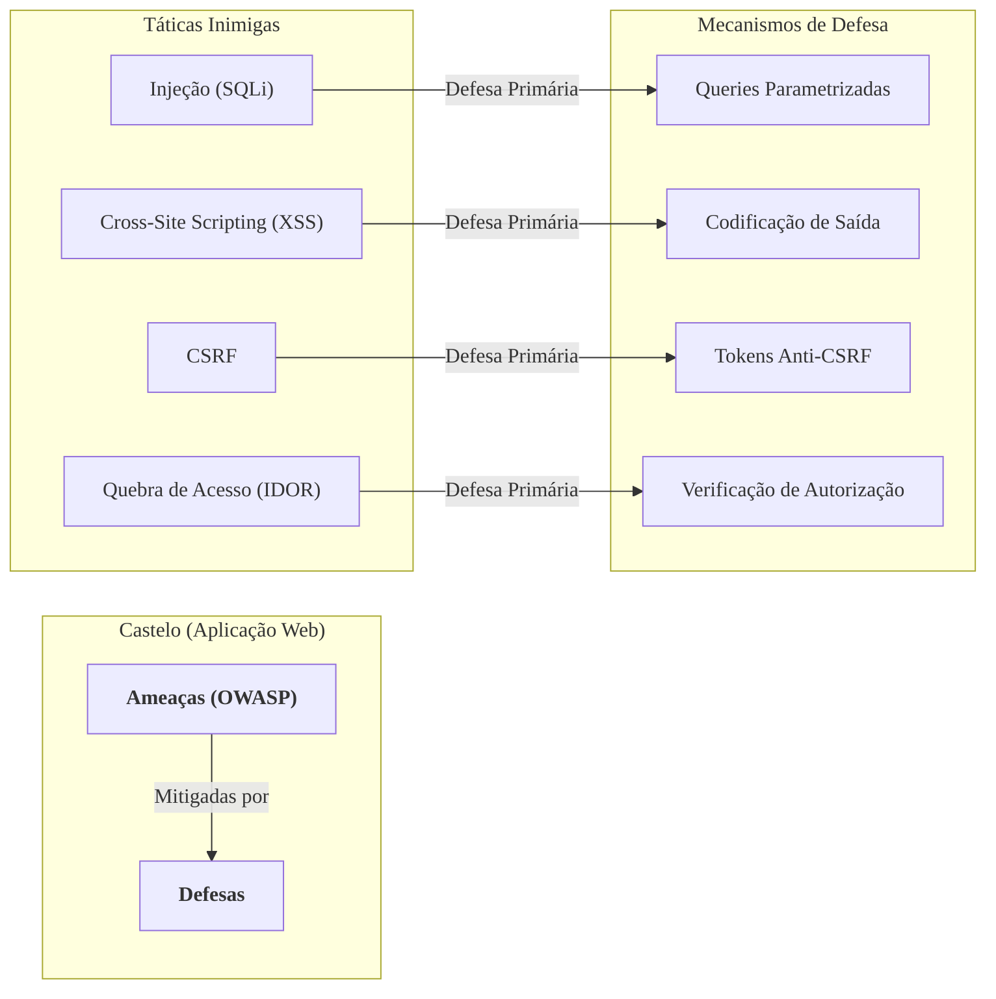

### Olá, futuro(a) aprovado(a)\! Vamos erguer as muralhas do seu conhecimento sobre Segurança Web para você defender sua vaga no concurso do Cebraspe.

Pense em segurança de aplicações web como a **defesa de um castelo medieval** 🏰. Sua aplicação é o castelo, seus dados são o tesouro, os usuários são os cidadãos, e os hackers são os inimigos tentando invadir.

-----

### \#\#\# Fundamentos de Segurança Web e OWASP: O Guia de Defesa do Reino

  * **Os Objetivos da Defesa:**

      * **Confidencialidade:** Garantir que só o rei leia os pergaminhos secretos.
      * **Integridade:** Garantir que ninguém adultere os mapas do reino.
      * **Disponibilidade:** Garantir que a ponte levadiça esteja sempre funcionando para os cidadãos.

  * **OWASP (A Ordem dos Sábios Conselheiros de Guerra):**
    É uma comunidade global de especialistas em segurança que estuda as táticas dos inimigos e cria, de graça, os melhores guias de defesa para todos os reinos.

  * **OWASP Top 10 (O Pergaminho dos 10 Maiores Perigos):**
    É o guia mais famoso da OWASP. Ele lista as **10 táticas de ataque mais críticas e comuns** que os inimigos usam. Não é uma lei, mas um **documento de conscientização** que todo bom rei (desenvolvedor/gestor) deve ler para saber como proteger seu castelo.

> #### Foco Cebraspe (Pontos de Atenção e "Pegadinhas")
>
> >   * A banca vai dizer que o OWASP Top 10 é uma norma obrigatória ou uma certificação. **ERRADO\!** É um **guia de conscientização**, uma lista de riscos.
> >   * A banca vai descrever um ataque e perguntar qual pilar da segurança foi violado. Ex: Um ataque que vaza dados de clientes fere a **confidencialidade**. Um que derruba o site fere a **disponibilidade**.

-----

### \#\#\# Análise de Vulnerabilidades: As Táticas Inimigas Mais Comuns

Vamos ver as táticas do pergaminho da OWASP que o Cebraspe mais gosta.

| Tática Inimiga | Analogia no Castelo | O que é? |
| :--- | :--- | :--- |
| **Injeção (SQL Injection)** | O Bilhete Falso | O inimigo envia um bilhete ao mordomo com a ordem: "Traga a lista de compras do 'João' `OU A CHAVE DO TESOURO`". O mordomo, um robô ingênuo, obedece à ordem inteira. |
| **Quebra de Autenticação** | Senha Fraca no Portão | O inimigo descobre que a senha do portão principal é "1234" ou rouba o crachá de acesso de um guarda. |
| **Cross-Site Scripting (XSS)** | A Pichação no Mural de Avisos | O inimigo picha um "feitiço" malicioso no mural. Todo cidadão que lê o mural tem seus bolsos magicamente esvaziados (o script executa no navegador da vítima). |
| **Quebra de Controle de Acesso (IDOR)** | O Guarda Distraído | O cidadão João, do quarto 101, pede para o guarda abrir seu quarto. O inimigo, do quarto 102, vê e pede para o guarda abrir o quarto 101. O guarda abre **sem verificar se ele tem a chave daquele quarto**. |
| **CSRF** | A Carta Falsa para o Rei | O inimigo sabe que o Rei está logado no "Banco Real". Ele envia uma carta ao Rei: "Clique para ver este mapa\!". Ao clicar, o Rei, sem saber, envia uma ordem forjada para o banco transferir o ouro para o inimigo. |

> #### Foco Cebraspe (Pontos de Atenção e "Pegadinhas")
>
> >   * **XSS vs. CSRF:** A confusão clássica\!
> >       * **XSS** explora a confiança do **usuário no site** (o cidadão confia no mural do castelo).
> >       * **CSRF** explora a confiança do **site no usuário** (o banco confia que a ordem veio do navegador do rei).
> >   * A causa raiz do **IDOR** é a **falta de checagem de autorização** no servidor. "Esse usuário pode mesmo acessar este recurso?".

-----

### \#\#\# Técnicas de Proteção: As Defesas do Castelo

Para cada tática inimiga, existe uma defesa inteligente.

  * **Validação de Entrada (Revistar todos na entrada):**
    É a prática de inspecionar tudo o que vem de fora. A melhor abordagem é a **Lista Branca (*Whitelisting*)**:

      * **Lista Negra (Ruim):** "Proibido entrar com espadas e veneno". O inimigo entra com uma bomba, que não estava na lista.
      * **Lista Branca (Bom):** "Permitido entrar apenas com pão e água". Tudo o mais é barrado. É muito mais seguro.

  * **Codificação de Saída (*Output Encoding*):**

      * **Defesa Principal contra XSS.** Antes de exibir qualquer mensagem no mural de avisos, o escriba do castelo a traduz para um "código seguro" que neutraliza qualquer feitiço pichado, transformando-o em texto inofensivo.

  * **Queries Parametrizadas (*Prepared Statements*):**

      * **Defesa Principal contra SQL Injection.** O mordomo não aceita mais bilhetes abertos. Ele só aceita formulários pré-impressos: `Ação: [________] | Para o Cidadão: [________]`. A tentativa do inimigo de injetar um comando vira apenas um nome de cidadão muito bizarro. O código e os dados são separados.

  * **Tokens Anti-CSRF:**

      * **Defesa Principal contra CSRF.** Para cada ordem importante, o Rei precisa incluir uma "palavra secreta do dia" que só ele e o banco conhecem. Como o inimigo não sabe a palavra secreta, a ordem forjada na carta falsa é inválida.

> #### Foco Cebraspe (Pontos de Atenção e "Pegadinhas")
>
> >   * A banca vai testar o mapeamento Defesa vs. Ataque. Decore:
> >       * **SQL Injection → Queries Parametrizadas**
> >       * **XSS → Codificação de Saída**
> >       * **CSRF → Tokens Anti-CSRF**
> >   * A validação de segurança feita só no navegador do cliente (com JavaScript) é **inútil**, pois o inimigo pode facilmente burlá-la. A validação **deve sempre ser feita no servidor**.

### \#\#\# Mapa Mental: Mapeamento de Ameaças e Defesas

### **Classe:** A
### **Conteúdo:** Segurança Web: Fundamentos e OWASP

---

### **1. Fundamentos de Segurança Web e OWASP**

> #### **TEORIA-ALVO**
> **Segurança de Aplicações Web** é a disciplina da segurança da informação focada em proteger websites, aplicações web e APIs contra ataques cibernéticos. O objetivo é garantir os princípios fundamentais da segurança da informação no contexto das aplicações.
>
> * **Princípios Fundamentais Aplicados à Web:**
>     * **Confidencialidade:** Proteção de dados sensíveis (e.g., dados de usuários, informações de cartão de crédito) contra acesso não autorizado.
>     * **Integridade:** Garantia de que os dados e a lógica da aplicação não sejam modificados de forma indevida por atacantes.
>     * **Disponibilidade:** Assegurar que a aplicação e seus serviços estejam operacionais e acessíveis para usuários legítimos.
>     * **Autenticidade:** Provar a identidade de usuários e do próprio servidor.
> * **OWASP (Open Web Application Security Project):**
>     * **Definição:** Uma fundação sem fins lucrativos e uma comunidade global que trabalha para melhorar a segurança de software. A OWASP produz documentação, ferramentas, vídeos e fóruns de forma gratuita e aberta.
>     * **OWASP Top 10:** O projeto mais conhecido da OWASP. Trata-se de um documento de conscientização, atualizado periodicamente, que elenca os 10 riscos de segurança mais críticos para aplicações web. Seu propósito é educar desenvolvedores, arquitetos, gestores e profissionais de segurança sobre as ameaças mais prevalentes e fornecer orientações para mitigá-las. A lista é compilada a partir de dados de diversas organizações e especialistas em segurança.

> #### **FOCO CEBRASPE (Pontos de Atenção e "Pegadinhas")**
> > * **OWASP Top 10 como Norma:** A banca pode afirmar que o OWASP Top 10 é um padrão de conformidade obrigatório ou uma certificação. **ERRADO**. O OWASP Top 10 é um **documento de conscientização** e uma lista de riscos, servindo como um guia de boas práticas, mas não é uma norma mandatória como a ISO/IEC 27001 ou o PCI DSS.
> > * **Natureza da Lista:** É incorreto tratar a lista como exaustiva ou estática. Ela representa os riscos mais **críticos e comuns** em um determinado período e é atualizada para refletir a evolução das ameaças e tecnologias.
> > * **Princípios em Ação:** A banca frequentemente descreve um ataque e pergunta qual princípio da segurança da informação foi violado. Exemplo: um ataque de SQL Injection que expõe dados de clientes viola a **confidencialidade**. Se o mesmo ataque altera dados, viola a **integridade**. Um ataque de negação de serviço viola a **disponibilidade**.

---

### **Classe:** A
### **Conteúdo:** Análise de Vulnerabilidades (Riscos Críticos OWASP)

---

### **2. Análise de Vulnerabilidades (Riscos Críticos OWASP)**

> #### **TEORIA-ALVO**
> A análise de vulnerabilidades em aplicações web frequentemente se baseia nos riscos identificados pelo OWASP Top 10. Os conceitos a seguir são perenes, ainda que a numeração e o agrupamento se alterem entre as edições da lista.
>
> * **Injeção (Injection):**
>     * **Descrição:** Ocorre quando dados não confiáveis são enviados a um interpretador como parte de um comando. O tipo mais prevalente é a **Injeção de SQL (SQLi)**, onde a entrada do usuário manipula consultas a um banco de dados.
>     * **Impacto:** Exposição, alteração ou exclusão de dados; negação de serviço; execução remota de comandos.
> * **Quebra de Autenticação (*Broken Authentication*):**
>     * **Descrição:** Falhas na implementação das funções de login e gerenciamento de sessão, como permitir senhas fracas, não proteger contra ataques de força bruta, ou gerenciamento inseguro de tokens de sessão.
>     * **Impacto:** Roubo de contas, sequestro de sessão, escalada de privilégios.
> * **Cross-Site Scripting (XSS):**
>     * **Descrição:** Uma falha de injeção no lado do cliente, na qual um atacante injeta scripts maliciosos (geralmente JavaScript) em uma página, que são então executados no navegador de uma vítima.
>     * **Impacto:** Roubo de cookies de sessão, redirecionamento para sites maliciosos, modificação do conteúdo da página.
> * **Quebra de Controle de Acesso (*Broken Access Control*):**
>     * **Descrição:** Falha em garantir que usuários autenticados possam acessar apenas os dados e funcionalidades para os quais estão explicitamente autorizados. Um exemplo clássico é a **Referência Insegura e Direta a Objeto (IDOR)**, onde um atacante manipula um parâmetro (e.g., um ID na URL) para acessar dados de outro usuário.
>     * **Impacto:** Visualização ou modificação não autorizada de dados, acesso a funcionalidades restritas.
> * **Falsificação de Requisição Entre Sites (CSRF - *Cross-Site Request Forgery*):**
>     * **Descrição:** Um ataque que força o navegador de um usuário autenticado a enviar uma requisição HTTP forjada e indesejada para uma aplicação na qual o usuário está logado. A aplicação executa a ação por confiar na requisição vinda do navegador da vítima.
>     * **Impacto:** Realização de ações não autorizadas em nome da vítima, como alterar sua senha ou e-mail, realizar compras ou transferir fundos.

> #### **FOCO CEBRASPE (Pontos de Atenção e "Pegadinhas")**
> > * **Identificação da Vulnerabilidade:** O formato mais comum de questão é a descrição de um cenário de ataque, solicitando que o candidato identifique a vulnerabilidade correspondente (e.g., SQL Injection, XSS, CSRF).
> > * **XSS vs. CSRF:** A confusão entre estes dois é um clássico. **XSS** explora a confiança do usuário no site para **executar um script** em seu navegador. **CSRF** explora a confiança do site no navegador do usuário para **forçar o envio de uma requisição**.
> > * **IDOR (Referência Insegura a Objeto):** A causa raiz do IDOR não é a exposição de um ID, mas a **ausência de uma verificação de autorização** no servidor. A aplicação falha em verificar se o usuário logado tem permissão para acessar o objeto correspondente àquele ID.

---

### **Classe:** A
### **Conteúdo:** Técnicas de Proteção

---

### **3. Técnicas de Proteção e Mitigação**

> #### **TEORIA-ALVO**
> A proteção de aplicações web requer uma abordagem de defesa em profundidade (*defense-in-depth*), combinando múltiplas camadas de controles de segurança ao longo do ciclo de vida de desenvolvimento de software (SDLC).
>
> * **Validação de Entrada (*Input Validation*):**
>     * **Descrição:** Processo de verificar e filtrar todos os dados provenientes de fontes não confiáveis antes de serem processados pela aplicação.
>     * **Abordagem Recomendada:** **Lista Branca (*Whitelisting*)**, que consiste em permitir apenas um conjunto de caracteres, formatos ou valores conhecidos e seguros, rejeitando todo o resto. É superior à **Lista Negra (*Blacklisting*)**, que tenta proibir entradas maliciosas conhecidas e é facilmente contornável.
> * **Codificação de Saída (*Output Encoding*):**
>     * **Descrição:** Técnica de codificar dados antes de serem inseridos dinamicamente em uma página de saída, para garantir que sejam tratados como texto pelo navegador, e não como código executável.
>     * **Aplicação:** É a principal defesa contra **Cross-Site Scripting (XSS)**. A codificação deve ser sensível ao contexto (e.g., codificação para HTML, para atributos HTML, para JavaScript).
> * **Queries Parametrizadas (*Parameterized Queries*):**
>     * **Descrição:** Também conhecidas como *Prepared Statements*, são uma forma de construir consultas a banco de dados onde a instrução SQL é enviada separadamente dos parâmetros (dados).
>     * **Aplicação:** É a principal e mais eficaz defesa contra **SQL Injection**, pois garante a separação entre código e dados.
> * **Controles Adicionais:**
>     * **Tokens Anti-CSRF:** Mecanismo para mitigar ataques de CSRF, onde um token único e imprevisível é embutido em formulários e validado pelo servidor a cada requisição que modifica o estado.
>     * **Cabeçalhos de Segurança HTTP:** Diretivas enviadas pelo servidor que instruem o navegador a adotar comportamentos mais seguros. Exemplos:
>         * **`Content-Security-Policy` (CSP):** Controla as fontes de onde os recursos (scripts, imagens) podem ser carregados, mitigando XSS.
>         * **`HTTP Strict-Transport-Security` (HSTS):** Força o navegador a se comunicar com o servidor exclusivamente via HTTPS.

> #### **FOCO CEBRASPE (Pontos de Atenção e "Pegadinhas")**
> > * **Mapeamento Defesa-Ataque:** A banca vai testar o conhecimento sobre qual técnica de proteção é a principal mitigação para uma determinada vulnerabilidade. É mandatório associar:
> >     * **Queries Parametrizadas -> SQL Injection**
> >     * **Codificação de Saída -> XSS**
> >     * **Tokens Anti-CSRF -> CSRF**
> > * **Whitelisting vs. Blacklisting:** A banca pode apresentar o *blacklisting* como uma técnica robusta. **ERRADO**. A abordagem de *whitelisting* (permitir apenas o que é conhecido como bom) é inerentemente mais segura e a prática recomendada.
> > * **Defesa no Cliente vs. no Servidor:** Controles de segurança implementados apenas no lado do cliente (e.g., validação de formulário via JavaScript) são facilmente contornáveis por um atacante e não são suficientes. A validação e os controles de segurança **devem sempre ser reimplementados e garantidos no lado do servidor**.
