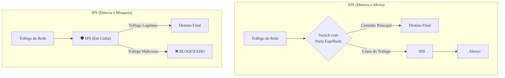

### Olá, futuro(a) aprovado(a)\! Vamos montar as defesas do seu conhecimento sobre Tecnologias de Segurança para você construir uma muralha contra as questões do Cebraspe.

Pense na segurança de uma rede como o **sistema de defesa de um castelo medieval modernizado** 🏰. Cada tecnologia é uma parte desse sistema, desde os guardas na muralha até as armadilhas no portão.

-----

### \#\#\# Firewalls: O Guarda no Portão Principal

O **Firewall** é o **guarda principal** que fica na ponte levadiça, a única entrada do castelo. Ele tem uma lista de regras e controla todo o tráfego que entra e sai.

  * **As Gerações de Guardas:**
    1.  **Filtragem de Pacotes (Guarda Novato - *Stateless*):** Ele tem uma lista simples: "Ninguém do Reino do Norte (IP de origem) pode entrar". Ele olha o "crachá" de cada pessoa isoladamente, sem memória ou contexto.
    2.  **Inspeção de Estado (Guarda Experiente - *Stateful*):** Ele é mais esperto. Ele mantém um "livro de visitas". Se ele vê que um cidadão saiu do castelo para ir à vila, ele já sabe que pode deixá-lo entrar na volta, sem precisar checar a lista de regras de novo.
    3.  **Proxy de Aplicação (O Intérprete Especialista):** É como ter um especialista para cada tipo de visitante. O "embaixador do correio" (Proxy SMTP) abre e inspeciona cada carta. O "embaixador de mercadorias" (Proxy HTTP) inspeciona cada carroça. Ele entende a "língua" de cada aplicação.
    4.  **NGFW (O Guarda Robocop):** O guarda do futuro. Ele tem tudo: a lista de regras, o livro de visitas, a capacidade de inspecionar o conteúdo das mochilas (DPI) e ainda vem com um sistema de alarme e armadilhas (IPS) embutido.

> #### Foco Cebraspe (Pontos de Atenção e "Pegadinhas")
>
> >   * **Stateless vs. Stateful:** A diferença crucial\! **Stateless** (Filtro de Pacotes) não tem memória. **Stateful** (Inspeção de Estado) acompanha as conversas (conexões) e é muito mais seguro e inteligente.
> >   * **Camada de Operação:** A banca vai te testar nisso\! **Filtro de Pacotes/Stateful** operam nas camadas de Rede/Transporte (3 e 4). **Proxy/NGFW** operam na camada de Aplicação (7), pois entendem o conteúdo.
> >   * **Firewall não é uma bala de prata.** Ele não protege contra um inimigo que entra escondido em uma carroça de feno permitida (um ataque dentro de tráfego HTTPS criptografado) nem contra um traidor interno.

-----

### \#\#\# IDS e IPS: As Câmeras de Segurança e as Armadilhas

  * **IDS (Sistema de Detecção de Intrusão - A Câmera de Segurança 🎥):**

      * **Função:** É um sistema de câmeras que monitora tudo o que acontece nos arredores do castelo. Se ele vê alguém suspeito tentando escalar a muralha, ele **detecta** e **dispara um alarme** para o capitão da guarda. Sua função é **passiva**: ele só avisa.
      * **Posicionamento:** A câmera fica em um poste ao lado da estrada (*out-of-band*), observando uma cópia do tráfego.

  * **IPS (Sistema de Prevenção de Intrusão - O Alçapão Automático ☠️):**

      * **Função:** É uma versão avançada da câmera, conectada a uma armadilha. Além de detectar o invasor, ele pode tomar uma **ação para impedi-lo**. Se ele vê o inimigo, ele **abre um alçapão** na ponte e o derruba no fosso. Sua função é **ativa**: ele detecta e bloqueia.
      * **Posicionamento:** O alçapão está no meio do caminho (*in-line*). Todo mundo tem que passar por cima dele.

  * **Métodos de Detecção:**

      * **Baseado em Assinaturas:** O sistema tem um "álbum de criminosos procurados". Se alguém idêntico a uma foto passa, o alarme dispara. Não funciona com disfarces ou criminosos novos.
      * **Baseado em Anomalias:** O sistema "aprende" o comportamento normal dos cidadãos. Se alguém começa a correr e gritar no meio da noite, ele dispara o alarme. Pode pegar criminosos novos, mas às vezes dispara para um cidadão com pressa (falso positivo).

> #### Foco Cebraspe (Pontos de Atenção e "Pegadinhas")
>
> >   * **Ação é a Chave:** A banca vai dizer que um IDS bloqueia tráfego. **ERRADO\!** **IDS = Detecta e Alerta (Passivo)**. **IPS = Detecta e Bloqueia (Ativo)**.
> >   * **Posicionamento:** A capacidade de bloquear do IPS depende de ele estar **em linha** (*in-line*). O IDS, por estar fora do caminho, não pode bloquear nada.
> >   * **Falso Positivo:** É quando o alarme dispara para um cidadão inocente. Em um IPS, isso é perigoso, pois pode bloquear o acesso de clientes legítimos.

-----

### \#\#\# Assinatura Digital: O Selo Real Inquebrável

É o mecanismo criptográfico para provar a autoria de um decreto real.

  * **O que ela garante?**

    1.  **Autenticidade:** Prova que foi o Rei quem assinou.
    2.  **Integridade:** Prova que o decreto não foi alterado no caminho.
    3.  **Não Repúdio:** O Rei não pode negar que assinou o decreto.

  * **Como funciona?**

    1.  O Rei pega o decreto e o passa em uma "máquina de resumo" que gera um código único (o **hash**).
    2.  Ele usa seu **anel secreto (chave PRIVADA)** para carimbar o hash com cera quente. Esse selo carimbado é a assinatura.
    3.  Qualquer cidadão pode pegar o **brasão oficial do reino (a chave PÚBLICA** do Rei) e verificar se o selo é autêntico.

> #### Foco Cebraspe (Pontos de Atenção e "Pegadinhas")
>
> >   * A pegadinha mais batida do universo\! A assinatura digital é **CRIADA** com a **chave PRIVADA** e **VERIFICADA** com a **chave PÚBLICA**. A banca vai inverter isso.
> >   * Assinatura digital **NÃO GERA CONFIDENCIALIDADE**. O decreto viaja em texto claro. Para ser secreto, ele precisaria ser adicionalmente criptografado.

-----

### \#\#\# Antivírus e Antispam: Os Guardas Sanitários e os Filtros de Cartas

  * **Antivírus (O Guarda Sanitário 👨‍⚕️):**
    É o guarda que inspeciona cada pessoa e mercadoria que entra no castelo em busca de "doenças" (*malware*).

      * **Detecção por Assinaturas:** Ele tem uma lista de "sintomas" de doenças conhecidas.
      * **Detecção por Heurística:** Ele desconfia de qualquer pessoa com um comportamento estranho, mesmo que a doença seja nova.

  * **Antispam (O Escriba Filtro de Cartas 📜):**
    É o funcionário que fica na sala de correspondências do rei, jogando fora todos os panfletos de propaganda inúteis (*spam*) para que o rei possa ler apenas as cartas importantes.

> #### Foco Cebraspe (Pontos de Atenção e "Pegadinhas")
>
> >   * A detecção por **assinaturas** é precisa para malwares **conhecidos**, mas cega para os novos. A **heurística** pode pegar malwares **novos**, mas corre o risco de gerar **falsos positivos**.
> >   * Ter um antivírus atualizado **não é garantia de 100% de proteção**, especialmente contra ameaças de dia-zero.

### \#\#\# Mapa Mental: IDS (Passivo) vs. IPS (Ativo)

### **Classe:** A
### **Conteúdo:** Tecnologias de Segurança: Firewalls

---

### **1. Firewalls**

> #### **TEORIA-ALVO**
> Um **Firewall** é um dispositivo de segurança de rede, implementado em hardware ou software, que monitora e controla o tráfego de rede de entrada e saída com base em um conjunto predefinido de regras de segurança. Atua como uma barreira entre uma rede interna confiável e uma rede externa não confiável, como a Internet.
>
> * **Gerações e Tipos de Firewalls:**
>     1.  **Filtragem de Pacotes (*Packet Filtering*):** Primeira geração, opera nas camadas 3 (Rede) e 4 (Transporte) do modelo OSI. As decisões de bloqueio ou permissão são baseadas em informações do cabeçalho dos pacotes, como endereços IP de origem e destino, e portas de origem e destino. É um firewall *stateless* (sem estado).
>     2.  **Firewall de Inspeção de Estado (*Stateful Inspection*):** Evolução da filtragem de pacotes. Mantém uma tabela de estado para rastrear o estado das conexões ativas (e.g., o *three-way handshake* do TCP). Permite o tráfego de retorno de uma conexão iniciada internamente sem a necessidade de uma regra explícita, tornando-o mais seguro e eficiente.
>     3.  **Proxy de Aplicação (ou *Application Gateway*):** Opera na Camada 7 (Aplicação). Atua como um intermediário para fluxos de dados de aplicações específicas (e.g., HTTP, FTP, SMTP). Ele entende o protocolo da aplicação e pode inspecionar o conteúdo do tráfego para tomar decisões mais granulares.
>     4.  **Firewall de Próxima Geração (NGFW - *Next-Generation Firewall*):** Um firewall moderno que integra as funcionalidades de um firewall *stateful* com outras capacidades de segurança, como:
>         * **Prevenção de Intrusão (IPS):** Capacidade de detectar e bloquear ataques.
>         * **Controle de Aplicação:** Identificar e controlar o uso de aplicações específicas (e.g., redes sociais, streaming), independentemente da porta utilizada.
>         * **Inspeção Profunda de Pacotes (DPI - *Deep Packet Inspection*):** Análise do conteúdo dos pacotes, não apenas dos cabeçalhos.

> #### **FOCO CEBRASPE (Pontos de Atenção e "Pegadinhas")**
> > * **Stateless vs. Stateful:** Esta é a distinção mais importante. Um firewall de **filtragem de pacotes (stateless)** analisa cada pacote de forma isolada e não tem memória de conexões anteriores. Um firewall **stateful** monitora o estado das conexões, o que lhe permite tomar decisões mais inteligentes e seguras (e.g., permitir automaticamente um pacote de resposta que faz parte de uma conexão já estabelecida).
> > * **Camada de Operação:** A banca frequentemente testa o conhecimento sobre a camada do modelo OSI em que cada tipo de firewall opera. **Filtragem de Pacotes/Stateful -> Camadas 3 e 4**. **Proxy de Aplicação/NGFW -> Camada 7**.
> > * **Limitações do Firewall:** É incorreto afirmar que um firewall protege contra todos os tipos de ameaças. Um firewall tradicional não inspeciona, por padrão, o conteúdo de tráfego **criptografado** (como HTTPS) e não protege contra ataques que exploram vulnerabilidades em uma aplicação web permitida, nem contra ameaças internas ou malware introduzido por mídias removíveis.

---

### **Classe:** A
### **Conteúdo:** IDS (Intrusion Detection System) e IPS (Intrusion Prevention System)

---

### **2. IDS e IPS**

> #### **TEORIA-ALVO**
> IDS e IPS são sistemas projetados para detectar e, no caso do IPS, responder a atividades maliciosas ou violações de políticas de segurança na rede ou em um host.
>
> * **IDS (Intrusion Detection System - Sistema de Detecção de Intrusão):**
>     * **Função:** Monitora o tráfego de rede (NIDS) ou a atividade de um host (HIDS) em busca de assinaturas de ataques conhecidos ou desvios de comportamento. Sua função é **passiva**: ele **detecta** a atividade suspeita e gera um **alerta** (log) para um administrador.
>     * **Posicionamento:** Opera de forma "fora da banda" (*out-of-band*). Ele recebe uma cópia do tráfego de rede (e.g., de uma porta espelhada de um switch) e o analisa sem estar no caminho direto da comunicação.
> * **IPS (Intrusion Prevention System - Sistema de Prevenção de Intrusão):**
>     * **Função:** É uma evolução do IDS. Além de detectar a atividade maliciosa, ele possui a capacidade de tomar uma **ação ativa** para **prevenir** o ataque.
>     * **Ações:** Pode descartar pacotes maliciosos, bloquear o tráfego do endereço IP de origem, ou resetar a conexão.
>     * **Posicionamento:** Opera de forma "em linha" (*in-line*), ou seja, todo o tráfego de rede passa diretamente através do dispositivo IPS, permitindo que ele bloqueie o tráfego em tempo real.
> * **Métodos de Detecção (comuns a ambos):**
>     * **Baseado em Assinaturas:** Compara o tráfego com um banco de dados de padrões (assinaturas) de ataques conhecidos. É eficaz contra ameaças conhecidas, mas ineficaz contra ataques de dia-zero.
>     * **Baseado em Anomalias:** Cria uma linha de base (*baseline*) do comportamento normal da rede e alerta sobre qualquer desvio significativo desse padrão. Pode detectar ataques novos, mas é mais suscetível a gerar falsos positivos.

> #### **FOCO CEBRASPE (Pontos de Atenção e "Pegadinhas")**
> > * **IDS vs. IPS: Ação é a Chave:** A principal diferença a ser testada é a capacidade de resposta. **IDS = Detecta e Alerta (Passivo)**. **IPS = Detecta e Bloqueia (Ativo)**. A banca afirmará que um IDS pode bloquear tráfego de rede. **ERRADO**.
> > * **Posicionamento na Rede (*In-line* vs. *Out-of-band*):** A capacidade de um IPS de bloquear ataques depende de seu posicionamento **em linha**, no caminho do tráfego. Um IDS, por operar de forma passiva sobre uma cópia do tráfego, não pode bloquear nada.
> > * **Falsos Positivos e Falsos Negativos:** Um **falso positivo** ocorre quando o sistema alerta sobre uma ameaça que não existe, o que, em um IPS, pode levar ao bloqueio de tráfego legítimo e causar uma negação de serviço. Um **falso negativo** ocorre quando o sistema falha em detectar um ataque real.
> > * **Firewall vs. IPS:** Um firewall tradicional toma decisões com base em portas e endereços. Um IPS analisa o **conteúdo** e o **comportamento** do tráfego para detectar atividades maliciosas, mesmo que em portas permitidas pelo firewall. Um NGFW geralmente integra as funcionalidades de ambos.

---

### **Classe:** A
### **Conteúdo:** Assinatura Digital

---

### **3. Assinatura Digital**

> #### **TEORIA-ALVO**
> A **Assinatura Digital** é um mecanismo criptográfico que utiliza criptografia de chave assimétrica para prover garantias de segurança sobre uma mensagem ou documento digital. Ela não visa a confidencialidade do documento, mas sim a verificação de sua origem e de sua integridade.
>
> * **Princípios de Segurança Atendidos:**
>     1.  **Autenticidade:** Garante a identidade do remetente, provando que o documento foi assinado por quem se alega ser o autor.
>     2.  **Integridade:** Garante que o documento não foi alterado desde que foi assinado. Qualquer modificação no documento invalidaria a assinatura.
>     3.  **Não Repúdio (ou Irretratabilidade):** Impede que o autor da assinatura negue sua autoria, pois somente ele possui a chave privada necessária para gerá-la.
> * **Processo de Criação (Realizado pelo Remetente):**
>     1.  Aplica-se uma **função de hash** sobre o documento original, gerando um resumo (*digest*) de tamanho fixo.
>     2.  O remetente **cifra o hash** resultante utilizando sua **chave privada**. O resultado deste processo é a assinatura digital.
>     3.  A assinatura digital é enviada juntamente com o documento original (em texto claro).
> * **Processo de Verificação (Realizado pelo Destinatário):**
>     1.  O destinatário recebe o documento e a assinatura.
>     2.  Ele **decifra a assinatura** utilizando a **chave pública** do remetente, obtendo o hash original (hash A).
>     3.  Ele calcula um novo hash a partir do documento recebido (hash B).
>     4.  Ele compara o hash A com o hash B. Se forem idênticos, a assinatura é válida, provando a autenticidade e a integridade.

> #### **FOCO CEBRASPE (Pontos de Atenção e "Pegadinhas")**
> > * **Uso das Chaves Criptográficas:** Este é o ponto mais explorado em questões. A banca vai inverter a lógica. É mandatório saber que a assinatura digital é **CRIADA com a chave PRIVADA** do signatário e **VERIFICADA com a chave PÚBLICA** do signatário.
> > * **Assinatura Digital vs. Criptografia para Confidencialidade:** É um erro comum afirmar que a assinatura digital torna a mensagem secreta. **ERRADO**. A assinatura digital **não garante confidencialidade**, pois a mensagem original não é cifrada. Para obter confidencialidade, a mensagem teria que ser adicionalmente cifrada com a chave pública do destinatário.
> > * **Papel da Função de Hash:** O processo de assinatura não é aplicado sobre o documento inteiro (o que seria computacionalmente inviável para documentos grandes), mas sim sobre o seu **hash**. A função de hash garante que qualquer alteração no documento original gere um hash diferente, o que é essencial para a verificação da integridade.

---

### **Classe:** B
### **Conteúdo:** Antivírus e Antispam

---

### **4. Antivírus e Antispam**

> #### **TEORIA-ALVO**
> Antivírus e Antispam são tecnologias de segurança focadas na proteção contra ameaças específicas, como software malicioso e e-mails indesejados.
>
> * **Antivírus:**
>     * **Definição:** Um software projetado para detectar, prevenir e remover software malicioso (*malware*), categoria que inclui vírus, *worms*, *trojans*, *spyware*, *adware* e *ransomware*.
>     * **Métodos de Detecção:**
>         * **Baseado em Assinaturas:** O método tradicional. O antivírus mantém um banco de dados de assinaturas (padrões de código) de malwares conhecidos. É eficaz contra ameaças já catalogadas, mas inútil contra malwares novos (ataques de dia-zero).
>         * **Baseado em Heurística/Comportamento:** Analisa o comportamento de um programa em execução para identificar ações suspeitas ou maliciosas (e.g., modificar arquivos de sistema, tentar se replicar). Pode detectar ameaças novas, mas é mais propenso a gerar **falsos positivos**.
>     * **Soluções Modernas (NGAV/EDR):** Antivírus de Próxima Geração (NGAV) e Detecção e Resposta de Endpoint (EDR) combinam múltiplas técnicas, incluindo inteligência artificial e análise comportamental, para uma proteção mais robusta.
> * **Antispam:**
>     * **Definição:** Uma solução de software ou serviço que filtra mensagens de e-mail para identificar e bloquear e-mails não solicitados e em massa (*spam*).
>     * **Técnicas de Filtragem:**
>         * **Análise de Reputação:** Verifica o endereço IP do servidor de e-mail remetente contra listas de reputação (RBLs - *Real-time Blackhole Lists*).
>         * **Listas Brancas e Negras:** Permite ou bloqueia e-mails de remetentes específicos.
>         * **Análise de Conteúdo:** Busca por palavras-chave e características comuns em e-mails de spam.
>         * **Filtros Bayesianos:** Um filtro estatístico que "aprende" a distinguir spam de e-mails legítimos com base em e-mails previamente classificados pelo usuário.

> #### **FOCO CEBRASPE (Pontos de Atenção e "Pegadinhas")**
> > * **Detecção por Assinaturas vs. Heurística:** A banca vai testar a compreensão dos trade-offs. A detecção por **assinaturas** é precisa para malwares **conhecidos**, mas cega para os **novos**. A detecção por **heurística** pode identificar malwares **novos**, mas com maior risco de **falsos positivos** (bloquear um programa legítimo por engano).
> > * **Antivírus não é Infalível:** É incorreto afirmar que ter um antivírus atualizado garante 100% de proteção contra malware. **ERRADO**. Ameaças de dia-zero e técnicas avançadas de evasão podem contornar as defesas do antivírus. Ele é uma camada de defesa necessária, mas não suficiente.
> > * **Local de Atuação:** As soluções de antivírus operam no **endpoint** (o computador do usuário ou servidor). As soluções de antispam podem operar tanto no **gateway de e-mail** (servidor, protegendo toda a organização) quanto no **cliente de e-mail** do usuário.
