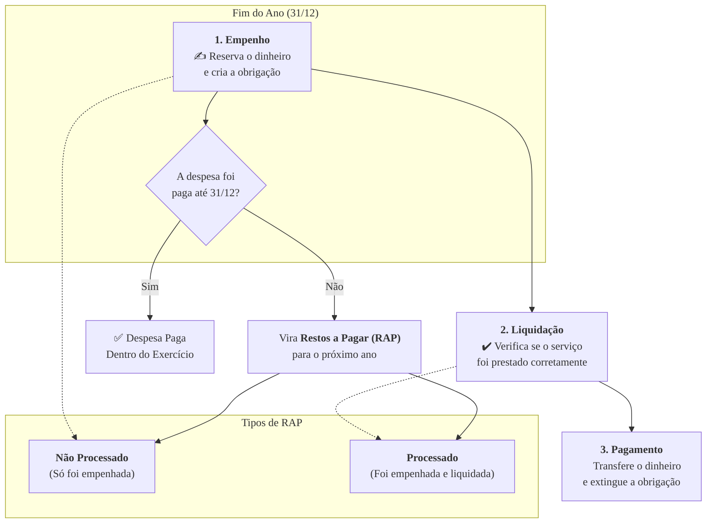

### Olá, futuro(a) aprovado(a)\! Vamos organizar as contas da Despesa Pública para você fechar o balanço com a sua aprovação no Cebraspe.

Pense na despesa pública como a **gestão do orçamento de uma grande família** 👨‍👩‍👧‍👦. O governo é a família, o dinheiro arrecadado é o salário, e as despesas são as contas e os investimentos que a família precisa fazer.

-----

### \#\#\# Conceito e Classificações: Os Tipos de Contas da Família

Nem todo gasto é igual. A família precisa classificar suas contas.

  * **Despesas Orçamentárias vs. Extraorçamentárias:**

      * **Orçamentárias (As Contas do Mês):** São os gastos previstos no orçamento, pagos com o salário da família. Ex: aluguel, supermercado, escola das crianças.
      * **Extraorçamentárias (Dinheiro de Terceiros):** É quando a família devolve um dinheiro que não era dela. Ex: Seu vizinho te deu R$ 100 para guardar. Quando você devolve, não é um gasto do seu orçamento, é uma despesa extraorçamentária.

  * **Despesas Correntes vs. Despesas de Capital (Gastar vs. Investir):**
    Esta é a classificação que o Cebraspe mais ama cobrar\!

      * **Despesas Correntes (Os Gastos do Dia a Dia 🛒):** São as despesas para "manter a casa funcionando". Elas não aumentam o patrimônio da família.
          * **Custeio:** Conta de luz, supermercado, salário da diarista, material de limpeza.
          * **Transferências:** A mesada do filho.
      * **Despesas de Capital (Os Investimentos 🏠):** São os gastos que aumentam o patrimônio da família ou pagam uma dívida grande.
          * **Investimentos:** Comprar um carro novo, fazer a reforma da cozinha, comprar um computador novo.
          * **Amortização da Dívida:** Pagar a **parcela PRINCIPAL** do financiamento do apartamento.

> #### Foco Cebraspe (Pontos de Atenção e "Pegadinhas")
>
> >   * A pegadinha clássica: O pagamento dos **JUROS** do financiamento do apartamento é uma despesa **CORRENTE**. O pagamento do **PRINCIPAL** é uma despesa **DE CAPITAL**.
> >   * "A compra de um novo computador para a repartição" é um investimento, logo, despesa **DE CAPITAL**. "A compra de cartuchos de tinta para a impressora" é material de consumo, logo, despesa **CORRENTE**.

-----

### \#\#\# Estágios da Despesa e Restos a Pagar: O Passo a Passo para Pagar uma Conta

Para pagar uma conta, a família segue 3 passos obrigatórios.

1.  **Empenho (A Promessa de Pagar ✍️):**
    Chegou a conta de luz. Você olha o valor e **"reserva" o dinheiro** na sua planilha de orçamento. O dinheiro ainda está na sua conta, mas ele já está comprometido. Você criou a obrigação de pagar. É proibido gastar sem antes reservar o dinheiro\!

2.  **Liquidação (A Verificação do Serviço ✔️):**
    Você verifica se a luz realmente funcionou o mês inteiro sem problemas. Ao confirmar que o serviço foi prestado corretamente, você "liquida" a despesa, ou seja, **reconhece que a dívida é legítima**.

3.  **Pagamento (A Transferência do Dinheiro 💸):**
    Você entra no aplicativo do banco e efetivamente **paga o boleto**. O dinheiro sai da sua conta.

<!-- end list -->

  * **Restos a Pagar (RAP - A "Conta Virada"):**
    É a conta que foi **prometida (empenhada)** em um ano, mas que só será paga no ano seguinte.
      * **Processados:** Você prometeu e **verificou o serviço** (empenhou e liquidou) no ano passado, só faltou pagar. A dívida é certa.
      * **Não Processados:** Você prometeu pagar (empenhou) no ano passado, mas o serviço só foi entregue este ano, então a verificação (liquidação) ainda não aconteceu.

> #### Foco Cebraspe (Pontos de Atenção e "Pegadinhas")
>
> >   * A ordem é sagrada: **1º Empenho → 2º Liquidação → 3º Pagamento**. A banca VAI inverter isso.
> >   * **RAP vs. DEA (Despesas de Exercícios Anteriores):** **RAP** é uma conta que foi **empenhada** no ano certo. **DEA** é uma conta do passado que você **esqueceu de empenhar** (a famosa "gaveta").

-----

### \#\#\# Dívida Pública e Suprimento de Fundos: As Dívidas e o "Dinheirinho" para o Café

  * **Dívida Pública:**

      * **Dívida Flutuante (A Fatura do Cartão de Crédito):** Dívidas de curto prazo (vencem em menos de 12 meses). As "contas viradas" (**Restos a Pagar**) entram aqui.
      * **Dívida Fundada (O Financiamento da Casa):** Dívidas de longo prazo (vencem em mais de 12 meses).

  * **Suprimento de Fundos (O "Dinheiro para o Pãozinho"):**
    É um regime **excepcional**. Em vez de seguir o passo a passo (empenho-liquidação-pagamento) para comprar um café, o chefe dá um **adiantamento em dinheiro** para um servidor e diz: "vá e compre o que for preciso para a reunião".

      * **Processo Invertido:** O **pagamento** (o adiantamento) vem **antes** da comprovação do gasto.
      * **Dever de Prestar Contas:** Depois de comprar o café, o servidor é **obrigado** a apresentar as notas fiscais para comprovar como gastou o dinheiro.

> #### Foco Cebraspe (Pontos de Atenção e "Pegadinhas")
>
> >   * **Restos a Pagar** fazem parte da **Dívida Flutuante**.
> >   * O **Suprimento de Fundos** é uma **EXCEÇÃO** ao rito normal da despesa, pois o pagamento antecede a liquidação. A banca vai dizer que ele segue o rito normal. **ERRADO\!**

### \#\#\# Mapa Mental: O Fluxo da Despesa Pública

### **Classe:** A
### **Conteúdo:** Despesa Pública: Conceito e Classificações

---

### **1. Conceito e Classificações da Despesa Pública**

> #### **TEORIA-ALVO**
> **Despesa Pública** é o conjunto de dispêndios realizados pelos entes públicos para o custeio dos serviços públicos postos à disposição da sociedade e para a realização de investimentos. A execução da despesa pública é estritamente vinculada à autorização contida na Lei Orçamentária Anual (LOA).
>
> * **Despesas Orçamentárias vs. Extraorçamentárias:**
>     * **Despesas Orçamentárias:** Realizam-se com as dotações autorizadas na LOA para a manutenção e expansão dos serviços públicos. Dependem de autorização legislativa.
>     * **Despesas Extraorçamentárias:** Correspondem à devolução de recursos que foram arrecadados de forma temporária e não pertencem ao Estado (receitas extraorçamentárias). Não dependem de autorização legislativa. Exemplo: devolução de uma caução em garantia contratual.
> * **Classificação da Despesa Orçamentária por Categoria Econômica (Lei nº 4.320/64):**
>     * **Despesas Correntes:** Realizações que não contribuem, diretamente, para a formação ou aquisição de um bem de capital. Destinam-se à manutenção dos serviços. Incluem:
>         * **Despesas de Custeio:** Pessoal, material de consumo, serviços de terceiros.
>         * **Transferências Correntes:** Subvenções sociais e econômicas, transferências a outros entes.
>     * **Despesas de Capital:** Realizações que contribuem, diretamente, para a formação ou aquisição de um bem de capital, ou que resultam na amortização de uma dívida. Incluem:
>         * **Investimentos:** Planejamento e execução de obras, aquisição de imóveis, instalações, equipamentos e material permanente.
>         * **Inversões Financeiras:** Aquisição de imóveis ou de bens de capital já em utilização, aquisição de títulos representativos do capital de empresas.
>         * **Amortização da Dívida:** Pagamento do principal da dívida pública.
> * **Classificação da Despesa por Natureza:** A classificação mais detalhada, utilizada para identificar o objeto do gasto. Estrutura: Categoria Econômica (C ou K), Grupo de Natureza da Despesa (GND), Modalidade de Aplicação (MA) e Elemento de Despesa (ED).

> #### **FOCO CEBRASPE (Pontos de Atenção e "Pegadinhas")**
> > * **Distinção entre Despesa Corrente e de Capital:** Este é o ponto mais cobrado. A banca fornecerá exemplos e solicitará a classificação. "O pagamento de salários dos servidores" é despesa **corrente**. "A construção de uma nova escola" é despesa **de capital (investimento)**. "O pagamento do principal de uma dívida" é despesa **de capital (amortização da dívida)**, enquanto o pagamento dos **juros** da mesma dívida é despesa **corrente**.
> > * **Despesa Orçamentária vs. Extraorçamentária:** É incorreto afirmar que a devolução de um depósito judicial é uma despesa orçamentária. **ERRADO**. Por ser a restituição de uma receita extraorçamentária, a despesa correspondente também é extraorçamentária.
> > * **Apropriação Indébita de Classificação:** Um erro comum na gestão pública, e alvo de fiscalização, é a classificação de uma despesa de capital como se fosse corrente, para contornar restrições fiscais ou orçamentárias.

---

### **Classe:** A
### **Conteúdo:** Estágios da Despesa e Restos a Pagar

---

### **2. Estágios da Despesa e Restos a Pagar**

> #### **TEORIA-ALVO**
> A execução da despesa orçamentária, conforme a Lei nº 4.320/64, deve obrigatoriamente seguir três estágios ou etapas. O descumprimento dessa sequência ou o não pagamento dentro do exercício gera consequências específicas.
>
> * **Estágios da Despesa:**
>     1.  **Empenho (Art. 58):** É o ato emanado de autoridade competente que cria para o Estado a obrigação de pagamento, pendente ou não de implemento de condição. O empenho "reserva" a dotação orçamentária. É vedada a realização de despesa sem prévio empenho.
>     2.  **Liquidação (Art. 63):** É a verificação do direito adquirido pelo credor, com base nos títulos e documentos comprobatórios do respectivo crédito. Consiste em verificar se o bem foi entregue ou o serviço foi prestado conforme o contratado.
>     3.  **Pagamento (Art. 64):** É o despacho exarado por autoridade competente, determinando que a despesa seja paga. Extingue a obrigação.
> * **Restos a Pagar (RAP):**
>     * **Definição:** Compreendem as despesas **empenhadas mas não pagas** até o dia 31 de dezembro, distinguindo-se as processadas das não processadas.
>     * **Restos a Pagar Processados:** São as despesas que já passaram pelo estágio de **liquidação**. O direito do credor já foi verificado, faltando apenas o pagamento.
>     * **Restos a Pagar Não Processados:** São as despesas que foram apenas **empenhadas**. A liquidação (verificação do cumprimento da obrigação pelo credor) ainda não ocorreu.
> * **Despesas de Exercícios Anteriores (DEA):**
>     * **Definição:** São dívidas reconhecidas, resultantes de compromissos gerados em exercícios financeiros anteriores, para as quais a dotação orçamentária consignada foi insuficiente ou inexistente, e que não foram empenhadas na época própria. Incluem também os Restos a Pagar com prescrição interrompida e compromissos reconhecidos após o encerramento do exercício. Devem ser pagas à conta de dotação específica no orçamento vigente.

> #### **FOCO CEBRASPE (Pontos de Atenção e "Pegadinhas")**
> > * **A Sequência dos Estágios:** A ordem **Empenho → Liquidação → Pagamento** é imutável e de conhecimento obrigatório. A banca vai inverter a ordem ou confundir as definições. "A verificação do direito do credor ocorre na fase de empenho". **ERRADO**. Ocorre na **liquidação**.
> > * **Restos a Pagar (RAP) vs. Despesas de Exercícios Anteriores (DEA):** Esta é uma distinção crítica. **RAP** se origina de uma despesa que foi **devidamente empenhada** no seu exercício de competência. **DEA** se origina de uma despesa que **não foi empenhada** no exercício de competência, ou cujo empenho foi anulado. A banca apresentará um cenário e pedirá a classificação correta.
> > * **RAP Processado vs. Não Processado:** O direito do credor é considerado líquido e certo no caso dos Restos a Pagar **Processados**, pois a fase de liquidação já foi cumprida. Nos Não Processados, o direito do credor ainda é uma expectativa, dependente da futura liquidação.

---

### **Classe:** A
### **Conteúdo:** Dívida Pública e Suprimento de Fundos

---

### **3. Dívida Pública e Suprimento de Fundos**

> #### **TEORIA-ALVO**
> A Dívida Pública representa as obrigações financeiras do Estado. O Suprimento de Fundos é um regime excepcional para a realização de despesas.
>
> * **Dívida Pública:**
>     * **Definição:** Conjunto das obrigações financeiras assumidas pelo ente público. Conforme a Lei nº 4.320/64, classifica-se em:
>         * **Dívida Flutuante:** Compreende as obrigações cuja exigibilidade tem prazo de vencimento **inferior a 12 meses**. Inclui os **Restos a Pagar** (exceto os serviços da dívida), os serviços da dívida a pagar, os depósitos (receitas extraorçamentárias) e as operações de crédito por antecipação de receita orçamentária (ARO).
>         * **Dívida Fundada (ou Consolidada):** Compreende as obrigações com prazo de exigibilidade **superior a 12 meses**, contraídas para financiar desequilíbrios orçamentários ou para a realização de investimentos.
> * **Suprimento de Fundos (Regime de Adiantamento):**
>     * **Definição:** É um instrumento de execução de despesa, utilizado em **caráter excepcional**, que consiste na entrega de numerário a um servidor (suprido), para que este realize despesas que, por sua natureza ou urgência, não possam aguardar o processo normal de aplicação (Empenho-Liquidação-Pagamento).
>     * **Casos de Uso:** Despesas de pequeno vulto, despesas eventuais (e.g., com viagens), ou despesas de caráter sigiloso.
>     * **Processo:** O pagamento (adiantamento) ocorre **antes** da comprovação da despesa. O servidor suprido tem o dever de, posteriormente, **prestar contas** dos valores recebidos, comprovando a correta aplicação dos recursos.
>     * **Vedações:** É vedada a concessão de suprimento de fundos a servidor que esteja em alcance (em atraso na prestação de contas de outro adiantamento) ou que seja responsável por almoxarifado.

> #### **FOCO CEBRASPE (Pontos de Atenção e "Pegadinhas")**
> > * **Classificação da Dívida:** A principal distinção é o **prazo de vencimento** (inferior ou superior a 12 meses). É fundamental saber que os **Restos a Pagar** são classificados como **Dívida Flutuante**.
> > * **Suprimento de Fundos como Exceção:** Este é o ponto central. O suprimento de fundos é uma **exceção** ao princípio do prévio empenho e à sequência regular dos estágios da despesa. A banca afirmará que o suprimento de fundos segue o rito normal de execução da despesa. **ERRADO**. Nele, o pagamento antecede a comprovação do gasto.
> > * **Dever de Prestar Contas:** A concessão do adiantamento ao servidor não encerra o processo. A etapa de **prestação de contas** é obrigatória e essencial para a regularidade do gasto. A não prestação de contas ou sua rejeição implica na obrigação do servidor de restituir os valores ao erário.
