### Olá, futuro(a) aprovado(a)\! Vamos construir seu conhecimento sobre Execução Orçamentária e Financeira para você não deixar sua aprovação para os restos a pagar.

Pense na execução orçamentária como a **gestão de uma grande construtora nacional** 🏗️. O Orçamento (LOA) é o "Plano Anual de Obras". O "crédito orçamentário" é a autorização para gastar em uma obra, e o "recurso financeiro" é o dinheiro no caixa.

-----

### \#\#\# Programação e Descentralização: Planejando e Delegando as Obras

Antes de começar a construir, a diretoria da construtora precisa planejar e delegar.

  * **Programação Orçamentária vs. Financeira:**

      * **Orçamentária (O Planejamento da Engenharia):** É a alocação da **autorização para gastar**. A diretoria define: "A obra da ponte no Rio de Janeiro tem um crédito de R$ 100 milhões este ano".
      * **Financeira (O Planejamento do Caixa):** É a gestão do **dinheiro**. O diretor financeiro olha o caixa e diz: "Apesar da autorização de R$ 100 milhões, este mês só temos R$ 5 milhões disponíveis. Portanto, o limite de pagamento para a obra do Rio este mês é de R$ 5 milhões".

  * **Descentralização (Delegando o Trabalho):**
    A diretoria não executa tudo. Ela delega a autorização e o dinheiro. A banca AMA essa terminologia\!

      * **Descentralizando o CRÉDITO (a autorização para gastar):**
          * **Destaque:** A Construtora Sede (um Ministério) delega a autorização para uma **empresa parceira** (outro Ministério ou Poder). Delegação **externa**.
          * **Provisão:** A Construtora Sede delega a autorização para uma **filial regional** da própria empresa (dentro do mesmo Ministério). Delegação **interna**.
      * **Descentralizando o RECURSO (o dinheiro):**
          * **Repasse:** A diretoria envia o dinheiro para uma **empresa do grupo**, mas com CNPJ diferente (administração indireta).
          * **Sub-repasse:** A **empresa do grupo** envia o dinheiro para uma de suas unidades de obra.

> #### Foco Cebraspe (Pontos de Atenção e "Pegadinhas")
>
> >   * **Orçamentário vs. Financeiro:** É a base de tudo\! **Crédito Orçamentário = Autorização para Gastar**. **Recurso Financeiro = Dinheiro no Caixa**. A banca vai dizer que ter crédito garante o dinheiro. **ERRADO\!**
> >   * **Decore a Terminologia:** A banca vai dizer que "a transferência de recursos financeiros dentro do mesmo órgão é uma Provisão". **ERRADO\!** **Provisão é de CRÉDITO**. Transferência de RECURSO financeiro é **Repasse** ou **Sub-repasse**.

-----

### \#\#\# Estágios da Despesa: O Passo a Passo de um Gasto na Obra

Toda despesa na construtora segue 3 etapas sagradas e imutáveis.

1.  **Empenho (A Ordem de Compra ✍️):**
    O engenheiro da obra precisa de cimento. Ele emite uma ordem de compra para o fornecedor. Nesse momento, ele **"reserva" o valor** correspondente no orçamento da obra. O dinheiro ainda não saiu, mas já está comprometido.

2.  **Liquidação (A Conferência da Entrega ✔️):**
    O caminhão de cimento chega à obra. O mestre de obras **confere** se a quantidade e a qualidade do cimento estão de acordo com a nota fiscal. Ele "liquida" a despesa ao atestar que a construtora recebeu o que comprou e, portanto, a dívida é legítima.

3.  **Pagamento (A Transferência do Dinheiro 💸):**
    Com o atestado do mestre de obras em mãos, o financeiro **paga o boleto** do fornecedor. A obrigação está extinta.

<!-- end list -->

  * **Restos a Pagar (RAP):** É a despesa que foi **empenhada** (prometida) em um ano, mas só foi paga no ano seguinte.
      * **Processados:** O cimento foi entregue e conferido (liquidado) em dezembro, mas o boleto só foi pago em janeiro.
      * **Não Processados:** A ordem de compra foi emitida (empenhada) em dezembro, mas o cimento só foi entregue em janeiro.

> #### Foco Cebraspe (Pontos de Atenção e "Pegadinhas")
>
> >   * A ordem **Empenho → Liquidação → Pagamento** é imutável. A banca vai dizer que a liquidação vem antes do empenho. **ERRADO\!**
> >   * **O que acontece em cada fase?** O **Empenho** cria a obrigação para o Estado. A **Liquidação** verifica o direito do credor. O **Pagamento** quita a dívida.
> >   * A inscrição em **Restos a Pagar** só pode ocorrer para despesas que foram, no mínimo, **empenhadas** dentro do ano.

-----

### \#\#\# Alterações Orçamentárias: Mudanças no Plano de Obras

O Plano Anual de Obras (o orçamento) não é de pedra. Às vezes, são necessárias verbas extras.

  * **Créditos Adicionais (As "Verbas Extras"):**
    São autorizações para gastos que não estavam (ou estavam insuficientes) no plano original.

| Tipo de Crédito | Situação na Obra | Como é Aberto (na União) |
| :--- | :--- | :--- |
| **Suplementar** | A verba para "aço" já existia no plano, mas foi pouca. Precisa de um **reforço**. | Lei (pode ser autorizado na própria LOA) |
| **Especial** | A diretoria decidiu construir um **viaduto novo**, que não estava no plano original. É uma despesa **nova**. | Lei Específica |
| **Extraordinário** | Um **terremoto** destruiu uma ponte. É preciso de verba **urgente e imprevisível** para a reconstrução. | Medida Provisória |

> #### Foco Cebraspe (Pontos de Atenção e "Pegadinhas")
>
> >   * A banca vai dar o cenário e pedir o tipo de crédito. Decore:
> >       * **Reforçar algo que já existe = Suplementar.**
> >       * **Criar algo novo = Especial.**
> >       * **Guerra, calamidade, urgência = Extraordinário.**
> >   * Os créditos **extraordinários** são a grande exceção: por serem emergenciais, não precisam de autorização prévia do Legislativo nem de indicação da fonte de recursos.
> >   * **"Regra dos 4 meses":** Créditos especiais e extraordinários abertos nos últimos 4 meses do ano podem ser "reabertos" no ano seguinte.

### \#\#\# Mapa Mental: A Descentralização do Orçamento e do Financeiro

```mermaid
%%{init: {"theme": "tokyo-midnight", "themeVariables": { "fontFamily": "lexend"}}}%%
graph TD
    subgraph "Planejamento Orçamentário (A Autorização 📜)"
        A["<b>Crédito Orçamentário</b><br>(Permissão para gastar)"]
        
        subgraph "Descentralização Externa"
            B["Destaque<br>(Entre Ministérios/Poderes diferentes)"]
        end
        
        subgraph "Descentralização Interna"
            C["Provisão<br>(Dentro do mesmo Ministério)"]
        end
        A --> B & C
    end

    subgraph "Planejamento Financeiro (O Dinheiro 💰)"
        D["<b>Recurso Financeiro</b><br>(Dinheiro no caixa)"]
        
        subgraph "Descentralização para Adm. Indireta"
           E["Repasse<br>(Do Ministério para uma Autarquia)"]
        end

        subgraph "Descentralização Interna na Adm. Indireta"
            F["Sub-repasse<br>(Da Autarquia para uma unidade sua)"]
        end
        D --> E & F
    end

    style A fill:#313149,stroke:#bb9af7
    style D fill:#313149,stroke:#7aa2f7

```

### **Classe:** A
### **Conteúdo:** Programação e Execução Orçamentária e Financeira

---

### **1. Programação Orçamentária e Financeira e a Descentralização de Créditos e Recursos**

> #### **TEORIA-ALVO**
> A execução orçamentária e financeira na Administração Pública é precedida por uma fase de programação, que visa compatibilizar o ritmo dos gastos autorizados com o fluxo de entrada de recursos. A descentralização é o mecanismo pelo qual as unidades centrais distribuem créditos e recursos para as unidades executoras.
>
> * **Distinção: Programação Orçamentária vs. Financeira:**
>     * **Programação Orçamentária:** Refere-se à alocação e distribuição dos **créditos orçamentários** (dotações autorizadas na LOA) às unidades responsáveis pela execução das despesas.
>     * **Programação Financeira:** Refere-se ao planejamento do **fluxo de caixa** do Tesouro. Seu objetivo é ajustar o ritmo da execução da despesa ao fluxo de arrecadação da receita, garantindo a liquidez para o cumprimento das obrigações. O principal instrumento é o **Decreto de Programação Orçamentária e Financeira**, que estabelece limites de empenho e de pagamento.
> * **Descentralização de Créditos (Orçamentária):** É a transferência da autorização para gastar.
>     * **Destaque:** Movimentação de créditos orçamentários entre órgãos ou entidades de **Ministérios, Poderes ou órgãos diferentes**. É uma descentralização externa.
>     * **Provisão:** Movimentação de créditos orçamentários **dentro do mesmo Ministério ou órgão**. É uma descentralização interna.
> * **Descentralização de Recursos (Financeira):** É a transferência do dinheiro (recursos financeiros) para pagamento.
>     * **Repasse:** Liberação de recursos financeiros de um órgão setorial de programação financeira para uma entidade da administração indireta a ele vinculada.
>     * **Sub-repasse:** Liberação de recursos financeiros de uma entidade da administração indireta para uma unidade sua ou para outra entidade vinculada.

> #### **FOCO CEBRASPE (Pontos de Atenção e "Pegadinhas")**
> > * **Orçamentário vs. Financeiro:** Esta é a distinção mais fundamental da matéria. **Crédito Orçamentário** é a autorização legal para gastar. **Recurso Financeiro** é o dinheiro em caixa. A existência de crédito não garante a existência de recurso financeiro correspondente no mesmo momento. A programação financeira visa harmonizar esses dois fluxos.
> > * **Terminologia da Descentralização:** A banca frequentemente troca os termos. É mandatório memorizar a vinculação:
> >     * **Créditos (Orçamento):** Destaque (externo) e Provisão (interno).
> >     * **Recursos (Financeiro):** Repasse e Sub-repasse.
> >     * A banca afirmará que "a transferência de recursos financeiros dentro do mesmo Ministério é chamada de Provisão". **ERRADO**. Provisão é de créditos; a transferência de recursos financeiros seria um Sub-repasse.

---

### **Classe:** A
### **Conteúdo:** Estágios da Execução da Despesa e Acompanhamento

---

### **2. Estágios da Execução Orçamentária da Despesa e seu Acompanhamento**

> #### **TEORIA-ALVO**
> A execução da despesa orçamentária, conforme a Lei nº 4.320/1964, segue três estágios sequenciais e obrigatórios. O acompanhamento dessa execução é realizado por meio de sistemas de informação integrados.
>
> * **Estágios da Despesa:**
>     1.  **Empenho (Art. 58):** É o ato emanado de autoridade competente que **cria para o Estado a obrigação de pagamento**, pendente ou não de implemento de condição. Consiste na reserva de parte da dotação orçamentária autorizada para um fim específico. A despesa não pode ser realizada sem prévio empenho.
>     2.  **Liquidação (Art. 63):** Consiste na **verificação do direito adquirido pelo credor**, tendo por base os títulos e documentos comprobatórios do respectivo crédito. A liquidação verifica se o credor cumpriu sua parte na obrigação (e.g., se o bem foi entregue ou o serviço foi prestado em conformidade com o contrato).
>     3.  **Pagamento (Art. 64):** Consiste na entrega do numerário ao credor, por meio de ordem bancária. É o ato final que extingue a obrigação. O pagamento só pode ser efetuado após a regular liquidação da despesa.
> * **Acompanhamento da Execução e Sistemas de Informação:**
>     * O acompanhamento da execução orçamentária e financeira é realizado pelos órgãos de controle interno e externo.
>     * **SIAFI (Sistema Integrado de Administração Financeira do Governo Federal):** É o principal sistema de informação utilizado para o registro, o acompanhamento e o controle da execução orçamentária, financeira e patrimonial da União. Funciona como uma ferramenta de execução e de controle em tempo real.
> * **Restos a Pagar:**
>     * Constituem as despesas **empenhadas mas não pagas** até o final do exercício financeiro (31 de dezembro). Podem ser:
>         * **Processados:** Despesas que já passaram pelos estágios de empenho e liquidação.
>         * **Não Processados:** Despesas que foram apenas empenhadas, mas cuja liquidação ainda não ocorreu.

> #### **FOCO CEBRASPE (Pontos de Atenção e "Pegadinhas")**
> > * **Sequência dos Estágios:** A ordem **Empenho → Liquidação → Pagamento** é imutável. A banca vai inverter a sequência ou afirmar que um estágio pode ser omitido. **ERRADO**.
> > * **Distinção entre os Estágios:** É crucial diferenciar o que ocorre em cada fase. O **Empenho** reserva o crédito e cria a obrigação para o Estado. A **Liquidação** verifica o cumprimento da obrigação pelo credor. O **Pagamento** extingue a obrigação do Estado. A banca afirmará, por exemplo, que "a verificação da entrega de um material ocorre na fase do empenho". **ERRADO**. Ocorre na liquidação.
> > * **Restos a Pagar:** A inscrição em Restos a Pagar depende exclusivamente do **empenho** da despesa dentro do exercício. A distinção entre processados e não processados é um ponto de atenção, pois os Restos a Pagar não processados podem ser cancelados com maior facilidade.

---

### **Classe:** B
### **Conteúdo:** Alterações Orçamentárias

---

### **3. Alterações Orçamentárias (Créditos Adicionais)**

> #### **TEORIA-ALVO**
> A Lei Orçamentária Anual (LOA) é uma lei autorizativa, mas não imutável. Durante o exercício financeiro, pode ser necessário realizar alterações na programação da despesa. O principal instrumento para tal são os **Créditos Adicionais**.
>
> * **Definição:** Créditos Adicionais são autorizações de despesa não computadas ou insuficientemente dotadas na LOA. Conforme a Lei nº 4.320/1964, classificam-se em três tipos:
>     1.  **Créditos Suplementares:** Destinados a **reforço** de dotação orçamentária já existente na LOA que se demonstrou insuficiente. A autorização para sua abertura pode constar na própria LOA.
>     2.  **Créditos Especiais:** Destinados a despesas para as quais **não haja dotação orçamentária específica** na LOA. Exigem autorização por meio de lei específica.
>     3.  **Créditos Extraordinários:** Destinados a despesas **urgentes e imprevisíveis**, como as decorrentes de guerra, comoção interna ou calamidade pública. São abertos por Medida Provisória (na esfera federal) ou por decreto do Poder Executivo, e deles se dará imediato conhecimento ao Poder Legislativo.
> * **Fontes de Recursos:** A abertura de créditos suplementares e especiais depende da existência de recursos disponíveis, provenientes de anulação de dotações, superávit financeiro, excesso de arrecadação ou operações de crédito. Os créditos extraordinários, por sua natureza, dispensam a indicação prévia da fonte de recursos.
> * **Vigência:** A regra geral é que os créditos adicionais têm vigência adstrita ao exercício financeiro em que forem abertos. Contudo, os créditos especiais e extraordinários, se autorizados nos **últimos quatro meses** do exercício, poderão ser reabertos no exercício seguinte, nos limites de seus saldos.

> #### **FOCO CEBRASPE (Pontos de Atenção e "Pegadinhas")**
> > * **Distinção entre os Tipos de Créditos Adicionais:** Este é o ponto mais cobrado sobre o tema. A banca descreverá um cenário e solicitará a identificação do crédito adicional cabível.
> >     * Para **reforçar** uma dotação que já existe: **Suplementar**.
> >     * Para uma despesa **nova**, não prevista no orçamento: **Especial**.
> >     * Para uma despesa **urgente e imprevisível** (calamidade): **Extraordinário**.
> > * **Forma de Abertura:** A banca testará o conhecimento sobre o instrumento legal para a abertura. Os créditos **extraordinários** são a principal exceção à necessidade de autorização legislativa prévia, devido à sua natureza emergencial.
> > * **Regra de Reabertura no Exercício Seguinte:** A exceção ao princípio da anualidade para os créditos especiais e extraordinários abertos nos últimos quatro meses do exercício é um detalhe técnico frequentemente explorado em questões de alto nível.
