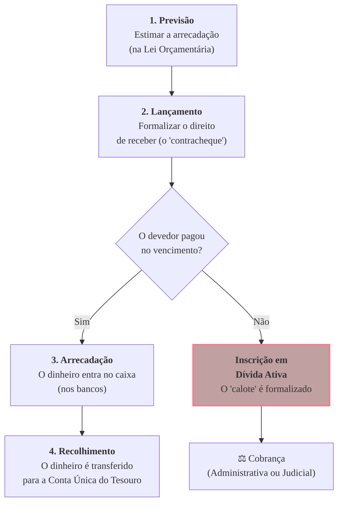

### Olá, futuro(a) aprovado(a)\! Vamos organizar as finanças da Receita Pública para que sua aprovação entre no caixa.

Pense na receita pública como todo o **dinheiro que entra na casa de uma grande família** 👨‍👩‍👧‍👦 para pagar as contas do mês. O governo é a família, e a receita é a fonte de renda.

-----

### \#\#\# Conceito e Classificações: De Onde Vem o Dinheiro da Família?

A família precisa saber diferenciar os tipos de dinheiro que entram em casa.

  * **Receitas Orçamentárias vs. Extraorçamentárias:**

      * **Orçamentárias (O Salário da Família 💵):** É o dinheiro que **pertence de fato** à família e que será usado para pagar as contas (aluguel, supermercado, etc.). Ele entra no orçamento mensal.
      * **Extraorçamentárias (O Dinheiro do Vizinho 🤝):** É um dinheiro que entra no cofre da família, mas **não pertence a ela**. É uma entrada temporária que terá que ser devolvida. Ex: Seu vizinho te dá R$ 100 para você guardar para ele. Esse dinheiro entrou no seu caixa, mas você terá que devolvê-lo.

  * **Receitas Correntes vs. Receitas de Capital (Dinheiro do Trabalho vs. Venda de Bens):**
    Esta é a classificação que o Cebraspe mais adora\!

      * **Receitas Correntes (O Dinheiro do Dia a Dia 🥖):** São as entradas de dinheiro que mantêm a casa funcionando. Não vêm da venda de um bem durável.
          * **Tributária:** O salário que o pai e a mãe recebem dos seus empregos (impostos).
          * **Patrimonial:** O aluguel do quartinho dos fundos que a família aluga para um estudante.
      * **Receitas de Capital (O Dinheiro Extraordinário 🚗):** São entradas que alteram o patrimônio da família ou vêm de dívidas.
          * **Alienação de Bens:** A família vende o carro antigo.
          * **Operações de Crédito:** A família pega um empréstimo no banco.

> #### Foco Cebraspe (Pontos de Atenção e "Pegadinhas")
>
> >   * **Receita Extraorçamentária:** A banca vai dizer que uma caução recebida é receita orçamentária. **ERRADO\!** Como a caução terá que ser devolvida, ela é um ingresso **extraorçamentário**.
> >   * **Corrente vs. Capital:** A banca vai dar exemplos. Lembre-se: **Arrecadação de impostos** (IPVA, IPTU) = **Corrente**. **Venda de um imóvel** do governo ou um **empréstimo** contraído = **Capital**.
> >   * **Receitas Efetivas vs. Não Efetivas:** Uma receita é **efetiva** quando aumenta a riqueza da família (o salário). É **não efetiva** quando não aumenta a riqueza (um empréstimo, que gera dinheiro no caixa mas também uma dívida no mesmo valor).

-----

### \#\#\# Estágios da Receita: O Caminho do Dinheiro até o Cofre

O "salário" da família passa por 4 estágios até poder ser usado.

1.  **Previsão (A Estimativa do Salário 🔮):**
    No início do ano, a família faz seu orçamento e **estima** quanto espera ganhar por mês. É a etapa de planejamento.

2.  **Lançamento (O Contracheque 🧾):**
    A empresa do pai emite o contracheque. É o ato que **formaliza e oficializa** que a empresa deve aquele valor para a família. O direito de receber foi criado.

3.  **Arrecadação (O Dinheiro na Conta\! 🤑):**
    É o dia do pagamento\! O dinheiro efetivamente **cai na conta corrente** da família. É neste momento que a receita é considerada realizada para o orçamento.

4.  **Recolhimento (Juntando o Dinheiro no Cofre Central 🏦):**
    A família transfere o dinheiro do salário que caiu na conta corrente para a "Conta Única do Tesouro da Família", de onde saem todos os pagamentos.

> #### Foco Cebraspe (Pontos de Atenção e "Pegadinhas")
>
> >   * A ordem é sagrada: **1º Previsão → 2º Lançamento → 3º Arrecadação → 4º Recolhimento**. A banca vai embaralhar tudo.
> >   * **Lançamento vs. Arrecadação:** A banca vai dizer que o lançamento é o pagamento. **ERRADO\!** **Lançamento** é o ato de formalizar a dívida (o contracheque). **Arrecadação** é o ato de efetivamente receber o dinheiro.
> >   * **Regime da Receita:** A receita orçamentária é contabilizada pelo **regime de caixa**, ou seja, quando o dinheiro entra de fato na conta (**arrecadação**).

-----

### \#\#\# Dívida Ativa: A Lista de Caloteiros da Família

  * **A Analogia:** O estudante que aluga o quartinho não pagou o aluguel do mês passado. Ele agora está na **lista de devedores** da família.

  * **O Conceito:** Dívida Ativa é o conjunto de todos os **créditos (direitos de receber) que a família tem contra terceiros, que já venceram e não foram pagos**.

  * **Tipos de Dívida Ativa:**

      * **Tributária:** Impostos não pagos.
      * **Não Tributária:** O aluguel do quartinho, uma multa de trânsito não paga, etc.

  * **Inscrição em Dívida Ativa:**
    É o ato de pegar o contrato de aluguel não pago e fazer um **registro formal na "lista de caloteiros"**. A partir da inscrição, a dívida ganha presunção de "certeza e liquidez" e pode ser cobrada judicialmente. A **Certidão de Dívida Ativa (CDA)** é o documento que prova a inscrição e serve de base para a cobrança.

> #### Foco Cebraspe (Pontos de Atenção e "Pegadinhas")
>
> >   * **Quando nasce a Dívida Ativa?** Apenas para créditos **vencidos e não pagos**. Um imposto que ainda vai vencer não faz parte da Dívida Ativa.
> >   * **Dívida Tributária vs. Não Tributária:** A banca vai dizer que uma multa de trânsito é dívida ativa tributária. **ERRADO\!** É **não tributária**. Dívida tributária vem de tributos (impostos, taxas e contribuições de melhoria).

### \#\#\# Mapa Mental: O Ciclo de Vida da Receita Pública

### **Classe:** A
### **Conteúdo:** Receita Pública: Conceito e Classificações

---

### **1. Conceito e Classificações da Receita Pública**

> #### **TEORIA-ALVO**
> **Receita Pública** compreende todos os ingressos de recursos financeiros nos cofres do Estado, que se destinam a custear as despesas públicas e os programas governamentais. A Lei nº 4.320/1964 e a doutrina classificam as receitas sob diversas óticas para fins de planejamento, controle e análise.
>
> * **Receitas Orçamentárias vs. Extraorçamentárias:**
>     * **Receitas Orçamentárias:** Ingressos que pertencem ao Estado e que são utilizados para financiar as despesas previstas na Lei Orçamentária Anual (LOA). Aumentam o saldo financeiro do ente de forma efetiva ou por mutação patrimonial.
>     * **Receitas Extraorçamentárias:** Ingressos de caráter temporário, que não integram o orçamento e representam meras entradas de caixa. O Estado atua como um depositário desses recursos, que deverão ser devolvidos. Exemplos: depósitos em caução, fianças, operações de crédito por antecipação de receita orçamentária (ARO).
> * **Classificação da Receita Orçamentária por Categoria Econômica:**
>     * **Receitas Correntes:** Arrecadadas dentro do exercício, aumentam a disponibilidade financeira do Estado, geralmente para financiar despesas correntes. Subdividem-se quanto à origem em: Tributária, de Contribuições, Patrimonial, Agropecuária, Industrial, de Serviços e Transferências Correntes.
>     * **Receitas de Capital:** Provenientes da constituição de dívidas, da conversão em espécie de bens e direitos, ou de transferências de capital. Alteram o patrimônio duradouro do Estado. Subdividem-se quanto à origem em: Operações de Crédito, Alienação de Bens, Amortização de Empréstimos e Transferências de Capital.
> * **Classificação por Fontes/Destinação de Recursos:**
>     * Agrupa as receitas segundo a destinação legal dos recursos.
>     * **Recursos Ordinários (Fonte 00):** Recursos não vinculados, de livre aplicação pelo Tesouro.
>     * **Recursos Vinculados:** Recursos cuja aplicação é legalmente vinculada a determinados órgãos, fundos ou despesas.

> #### **FOCO CEBRASPE (Pontos de Atenção e "Pegadinhas")**
> > * **Receita Orçamentária vs. Extraorçamentária:** A banca vai explorar a diferença fundamental. Uma **receita extraorçamentária** (e.g., uma caução) representa um passivo exigível para o Estado e, por isso, não transita pelo orçamento. A banca afirmará que "os valores recebidos a título de caução em garantia de um contrato constituem receita orçamentária". **ERRADO**.
> > * **Classificação por Categoria Econômica:** A distinção entre receitas **correntes** e **de capital** é o ponto mais cobrado. A banca fornecerá exemplos e solicitará a classificação. É mandatório saber que a arrecadação de **impostos (IPVA, ICMS)** é receita **corrente**, enquanto a contratação de um **empréstimo** ou a **venda de um imóvel público** constitui receita **de capital**.
> > * **Receitas Efetivas vs. Não Efetivas:** Uma receita é **efetiva** quando aumenta o patrimônio líquido do Estado (e.g., arrecadação de tributos). É **não efetiva** quando constitui uma mera mutação patrimonial, sem alterar o patrimônio líquido (e.g., contratação de uma operação de crédito, que gera um ativo financeiro e um passivo financeiro de igual valor).

---

### **Classe:** A
### **Conteúdo:** Estágios da Receita Orçamentária

---

### **2. Estágios da Receita Orçamentária**

> #### **TEORIA-ALVO**
> O ciclo da receita orçamentária, desde seu planejamento até sua incorporação definitiva ao Tesouro, compreende quatro estágios ou etapas sequenciais, conforme a doutrina e a Lei nº 4.320/1964.
>
> * **1. Previsão (ou Estimativa):**
>     * **Descrição:** É a etapa de planejamento, que consiste na estimativa da arrecadação da receita que constará na Lei Orçamentária Anual (LOA). A previsão deve ser realizada com base em metodologias e premissas prudentes.
> * **2. Lançamento:**
>     * **Descrição (Art. 53, Lei nº 4.320/64):** É o ato da repartição competente que verifica a procedência do crédito fiscal, a pessoa que lhe é devedora e inscreve o débito desta. No direito tributário, é o procedimento administrativo que constitui o crédito tributário.
> * **3. Arrecadação:**
>     * **Descrição:** É a etapa em que os contribuintes ou devedores comparecem perante os agentes arrecadadores (rede bancária) e entregam os recursos devidos ao Poder Público. É o momento em que a receita é efetivamente realizada sob o enfoque orçamentário (regime de caixa).
> * **4. Recolhimento:**
>     * **Descrição:** É a transferência dos valores arrecadados pelos agentes bancários para a Conta Única do Tesouro, centralizando os recursos à disposição do ente público para o financiamento de suas despesas.

> #### **FOCO CEBRASPE (Pontos de Atenção e "Pegadinhas")**
> > * **Sequência dos Estágios:** A ordem **Previsão → Lançamento → Arrecadação → Recolhimento** é fixa e frequentemente testada. A banca pode inverter a ordem ou omitir uma das etapas.
> > * **Distinção entre os Estágios:** É crucial diferenciar a natureza de cada etapa. O **Lançamento** é um ato administrativo que formaliza o direito de crédito do Estado. A **Arrecadação** é o ato de pagamento pelo devedor. O **Recolhimento** é a transferência do dinheiro para o Tesouro. A banca afirmará que "o lançamento é o momento em que o contribuinte paga o tributo". **ERRADO**. Este é o conceito de arrecadação.
> > * **Regime Orçamentário da Receita:** Conforme a Lei nº 4.320/64, as receitas orçamentárias são reconhecidas segundo o **regime de caixa**, ou seja, no momento da **arrecadação**.

---

### **Classe:** A
### **Conteúdo:** Dívida Ativa

---

### **3. Dívida Ativa**

> #### **TEORIA-ALVO**
> A Dívida Ativa é um conceito jurídico-contábil que representa o conjunto de créditos em favor da Fazenda Pública, de natureza tributária ou não tributária, que foram regularmente constituídos (lançados) mas não foram recebidos (arrecadados) no vencimento.
>
> * **Conceito (Art. 39, Lei nº 4.320/1964):** São créditos da Fazenda Pública, tributários ou não tributários, exigíveis pelo transcurso do prazo para pagamento, que serão apurados para fins de inscrição e cobrança.
> * **Natureza dos Créditos:**
>     * **Dívida Ativa Tributária:** Proveniente de obrigação legal relativa a tributos (impostos, taxas, contribuições de melhoria) e respectivos adicionais e multas.
>     * **Dívida Ativa Não Tributária:** Demais créditos da Fazenda Pública, tais como os provenientes de aluguéis, foros, laudêmios, taxas de ocupação, multas de qualquer origem ou natureza (exceto as tributárias), etc. As multas e débitos impostos pelos Tribunais de Contas constituem dívida ativa não tributária.
> * **Inscrição em Dívida Ativa:**
>     * É o ato de controle administrativo da legalidade, que apura a liquidez e a certeza do crédito. A inscrição confere ao crédito a presunção de certeza e liquidez.
>     * A apuração e a inscrição da dívida ativa competem aos órgãos próprios da Fazenda Pública.
> * **Cobrança:** A cobrança da Dívida Ativa pode ser feita de forma amigável (administrativa) ou judicial, por meio de um processo de **execução fiscal**. O instrumento que formaliza a inscrição e serve de base para a execução é a **Certidão de Dívida Ativa (CDA)**, que goza de presunção de certeza e liquidez.

> #### **FOCO CEBRASPE (Pontos de Atenção e "Pegadinhas")**
> > * **Momento da Constituição da Dívida Ativa:** A banca vai testar o momento em que um crédito se torna Dívida Ativa. Ele é composto por créditos **vencidos e não pagos**. Um imposto a vencer, por exemplo, ainda não compõe a Dívida Ativa.
> > * **Dívida Ativa Tributária vs. Não Tributária:** A distinção é relevante. A banca pode apresentar um exemplo de crédito, como uma multa aplicada pelo Tribunal de Contas, e afirmar que se trata de Dívida Ativa Tributária. **ERRADO**. Multas administrativas, mesmo que impostas por órgãos de controle, constituem Dívida Ativa **Não Tributária**.
> > * **Efeitos da Inscrição:** A inscrição em Dívida Ativa é um ato administrativo fundamental, pois é a partir dela que o crédito passa a gozar da presunção de certeza e liquidez e pode ser objeto de execução fiscal.
