### Olá, futuro(a) aprovado(a)\! Vamos decifrar a Lei nº 4.320/64, a "Bíblia" do Orçamento Público, para você construir sua aprovação.

Pense na Lei nº 4.320/64 como o **livro de regras financeiras de uma grande família** 👨‍👩‍👧‍👦. É ele que dita, há décadas, como a família (o governo) deve planejar seu orçamento, fazer gastos extras e pagar suas contas.

-----

### \#\#\# Orçamento e Créditos Adicionais: O Orçamento da Família e os Gastos Extras

O orçamento anual da família (a LOA) é o plano, mas imprevistos acontecem. Para isso, existem as "verbas extras", chamadas de **Créditos Adicionais**.

  * **Os 3 Tipos de "Verba Extra":**
    Esta é a parte que o Cebraspe mais ama cobrar. A diferença está na finalidade.

| Tipo de Crédito | Situação na Família | Precisa de Lei Nova? |
| :--- | :--- | :--- |
| **Suplementar** | A conta de luz veio mais cara que o previsto. Você precisa de um **REFORÇO** em uma verba que já existia no orçamento. | Não necessariamente (pode ser autorizado na própria LOA). |
| **Especial** | O filho decidiu fazer um curso de inglês no meio do ano. É um gasto **NOVO**, que não estava no plano original. | Sim, exige autorização por lei específica. |
| **Extraordinário** | Uma enchente destrói o telhado da casa. É um gasto **URGENTE e IMPREVISÍVEL**. | Não (aberto por decreto ou MP, devido à emergência). |

> #### Foco Cebraspe (Pontos de Atenção e "Pegadinhas")
>
> >   * A banca vai te dar um cenário e perguntar o tipo de crédito. Decore a finalidade: **Reforçar = Suplementar**. **Despesa Nova = Especial**. **Urgência/Calamidade = Extraordinário**.
> >   * Os créditos **extraordinários** são a grande exceção: por serem emergenciais, **dispensam autorização legislativa prévia** e não precisam indicar de onde virá o dinheiro no momento da abertura.

-----

### \#\#\# Execução Orçamentária: Recebendo e Pagando as Contas

A Lei 4.320/64 define o passo a passo de como o dinheiro entra e sai do caixa da família.

  * **Estágios da Receita (O Caminho do Salário):**

    1.  **Previsão:** Estimar quanto a família vai ganhar no ano.
    2.  **Lançamento:** A empresa emite o contracheque, formalizando o direito da família de receber.
    3.  **Arrecadação:** O dinheiro **cai na conta** do banco.
    4.  **Recolhimento:** O dinheiro é transferido para a conta central da família.

  * **Estágios da Despesa (O Caminho para Pagar uma Conta):**

    1.  **Empenho:** Você **reserva o dinheiro** do orçamento para pagar a conta de luz.
    2.  **Liquidação:** Você **verifica** se a luz foi fornecida corretamente durante todo o mês.
    3.  **Pagamento:** Você efetivamente **paga o boleto**.

  * **O Regime Contábil Misto (A "Pegadinha" Clássica):**
    Para o orçamento, a família anota o dinheiro de formas diferentes:

      * **Receita (Dinheiro Entrando):** Só conta quando o dinheiro **cai na conta (Regime de CAIXA)**.
      * **Despesa (Dinheiro Saindo):** Já conta como despesa no momento em que você **promete pagar (Regime de COMPETÊNCIA, no Empenho)**.

> #### Foco Cebraspe (Pontos de Atenção e "Pegadinhas")
>
> >   * A sequência **Empenho → Liquidação → Pagamento** é sagrada e imutável. A banca vai inverter tudo.
> >   * A banca vai dizer que a verificação do serviço (entrega do material) ocorre no empenho. **ERRADO\!** Ocorre na **liquidação**.
> >   * O regime orçamentário brasileiro é **MISTO**: **CAIXA para a receita** e **COMPETÊNCIA para a despesa**.

-----

### \#\#\# RAP, DEA e Dívida: Contas Viradas e Dívidas da Família

  * **Restos a Pagar (RAP - A "Conta Virada"):**
    É a conta que foi **prometida (empenhada)** em um ano, mas só será paga no ano seguinte.

      * **Processados:** A conta foi conferida (liquidada) no ano passado, só faltou pagar.
      * **Não Processados:** A promessa de pagar foi feita no ano passado, mas o serviço só foi conferido este ano.

  * **Despesas de Exercícios Anteriores (DEA - A Conta da Gaveta):**
    É aquela conta do ano passado que você achou na gaveta e que **nunca nem foi prometida (não foi empenhada)**.

  * **Dívida Pública:**

      * **Dívida Flutuante:** Dívidas de curto prazo (a fatura do cartão, os **Restos a Pagar**).
      * **Dívida Fundada:** Dívidas de longo prazo (o financiamento da casa).

> #### Foco Cebraspe (Pontos de Atenção e "Pegadinhas")
>
> >   * **RAP vs. DEA:** A diferença crucial\! **RAP** vem de uma despesa que foi **empenhada** no ano certo. **DEA** vem de uma despesa que **não foi empenhada** na época correta.
> >   * **Restos a Pagar** fazem parte da **Dívida Flutuante**.
> >   * **Suprimento de Fundos:** É o "dinheiro do pãozinho". Um adiantamento a um servidor para gastos pequenos e urgentes. É uma **exceção** ao rito normal, pois o **pagamento vem antes** da comprovação do gasto.

### \#\#\# Mapa Mental: Os Tipos de Créditos Adicionais

```mermaid
%%{init: {"theme": "tokyo-midnight", "themeVariables": { "fontFamily": "lexend"}}}%%
graph TD
    A["Orçamento Anual (LOA)<br>Insuficiente ou Inexistente"] --> B{"Qual a necessidade?"};
    
    B -- "Reforçar uma<br>verba que já existe" --> C["Crédito<br><b>SUPLEMENTAR</b><br>💵➡️💵➕"];
    B -- "Criar uma verba<br>para uma despesa NOVA" --> D["Crédito<br><b>ESPECIAL</b><br>💵➡️🆕"];
    B -- "Gasto URGENTE e<br>IMPREVISÍVEL (calamidade)" --> E["Crédito<br><b>EXTRAORDINÁRIO</b><br>🚨⚡️"];

    subgraph "Características"
        C1["Autorização pode estar<br>na própria LOA"]
        D1["Exige Lei Específica"]
        E1["Aberto por MP ou Decreto<br>Dispensa autorização prévia"]
    end

    C --- C1;
    D --- D1;
    E --- E1;

    style C fill:#313149,stroke:#bb9af7
    style D fill:#313149,stroke:#7aa2f7
    style E fill:#c0a0a0,stroke:#f7768e,stroke-width:2px
```

### **Classe:** A
### **Conteúdo:** Lei nº 4.320/1964: Orçamento e Créditos Adicionais

---

### **1. Orçamento Público e Créditos Adicionais**

> #### **TEORIA-ALVO**
> A **Lei nº 4.320, de 17 de março de 1964**, estatui Normas Gerais de Direito Financeiro para elaboração e controle dos orçamentos e balanços da União, dos Estados, dos Municípios e do Distrito Federal. É a norma basilar da Administração Orçamentária e Financeira (AFO) no Brasil.
>
> * **Princípios Orçamentários na Lei nº 4.320/64:** A lei codificou e reforçou princípios orçamentários fundamentais, como os da **Unidade, Universalidade e Anualidade**.
> * **Créditos Orçamentários:** A Lei Orçamentária Anual (LOA) contém as autorizações de despesa, denominadas créditos orçamentários iniciais. Contudo, durante o exercício, podem ser necessárias alterações orçamentárias, realizadas por meio de **Créditos Adicionais**.
> * **Classificação dos Créditos Adicionais (Art. 41):**
>     1.  **Créditos Suplementares:** Destinados a **reforço** de dotação orçamentária que se mostrou insuficiente durante a execução. A autorização para sua abertura pode constar na própria LOA.
>     2.  **Créditos Especiais:** Destinados a despesas para as quais **não haja dotação orçamentária específica** na LOA. Dependem de autorização legislativa específica e são abertos por decreto do Executivo.
>     3.  **Créditos Extraordinários:** Destinados a despesas **urgentes e imprevisíveis**, como as decorrentes de guerra, comoção interna ou calamidade pública. São abertos por decreto do Poder Executivo (ou Medida Provisória, na União), e deles se dará imediato conhecimento ao Poder Legislativo.
> * **Vigência dos Créditos Adicionais (Art. 45):** A regra geral é que a vigência dos créditos adicionais se restringe ao exercício financeiro em que forem abertos, respeitado o princípio da anualidade.

> #### **FOCO CEBRASPE (Pontos de Atenção e "Pegadinhas")**
> > * **Distinção entre os Tipos de Créditos Adicionais:** Este é o ponto mais cobrado da Lei nº 4.320/64. A banca descreverá um cenário e solicitará a identificação do crédito adicional cabível. A chave para a resposta está na finalidade:
> >     * **Reforçar dotação existente? → Suplementar.**
> >     * **Criar dotação para despesa nova? → Especial.**
> >     * **Atender a despesa urgente e imprevisível? → Extraordinário.**
> > * **Forma de Abertura:** A banca testará o conhecimento sobre o instrumento legal para a abertura. Os créditos **extraordinários** são a principal exceção, pois, devido à urgência e imprevisibilidade, **dispensam a autorização legislativa prévia**, embora o Legislativo deva ser comunicado imediatamente.
> > * **Fonte de Recursos:** A abertura de créditos suplementares e especiais depende da indicação da fonte dos recursos (e.g., anulação de dotações, superávit financeiro, excesso de arrecadação). Apenas os créditos extraordinários, pela sua natureza emergencial, podem ser abertos sem a prévia indicação da fonte.

---

### **Classe:** A
### **Conteúdo:** Execução Orçamentária da Receita e da Despesa

---

### **2. Execução Orçamentária: Estágios da Receita e da Despesa**

> #### **TEORIA-ALVO**
> A Lei nº 4.320/64 estabelece os estágios (ou etapas) que devem ser observados na execução orçamentária, tanto para a receita quanto para a despesa.
>
> * **Estágios da Receita Orçamentária:**
>     1.  **Previsão:** A estimativa da arrecadação que consta na LOA.
>     2.  **Lançamento (Art. 53):** Ato da repartição competente que verifica a ocorrência do fato gerador da obrigação, determina a matéria tributável, calcula o montante do tributo devido, e identifica o sujeito passivo.
>     3.  **Arrecadação:** Entrega dos recursos devidos pelo contribuinte ou devedor aos agentes arrecadadores (bancos).
>     4.  **Recolhimento:** Transferência dos valores arrecadados pelos bancos para a Conta Única do Tesouro.
> * **Estágios da Despesa Orçamentária:**
>     1.  **Empenho (Art. 58):** Ato emanado de autoridade competente que cria para o Estado a obrigação de pagamento. É a reserva da dotação orçamentária. **É vedada a realização de despesa sem prévio empenho.**
>     2.  **Liquidação (Art. 63):** Verificação do direito adquirido pelo credor, com base nos títulos e documentos comprobatórios do crédito. Consiste em apurar se o credor cumpriu sua parte da obrigação.
>     3.  **Pagamento (Art. 64):** Extinção da obrigação, mediante despacho da autoridade competente determinando o pagamento.
> * **Regimes Contábeis (Art. 35):** Para fins orçamentários, a Lei nº 4.320/64 estabelece um regime misto:
>     * **Receita:** Adota-se o **Regime de Caixa**. A receita é reconhecida no momento de sua **arrecadação**.
>     * **Despesa:** Adota-se o **Regime de Competência**. A despesa é reconhecida no momento de seu **empenho** (fato gerador da obrigação para o Estado).

> #### **FOCO CEBRASPE (Pontos de Atenção e "Pegadinhas")**
> > * **Sequência e Definição dos Estágios:** A banca vai inverter a ordem ou confundir as definições dos estágios, tanto da receita quanto da despesa. É fundamental saber a sequência **Empenho → Liquidação → Pagamento** e o que ocorre em cada etapa.
> > * **O Regime Contábil Misto:** Esta é uma característica peculiar do sistema brasileiro e uma pegadinha clássica. A banca afirmará que a contabilidade pública adota um regime de caixa puro ou de competência puro. **ERRADO**. Para fins orçamentários, o regime é misto: **caixa para a receita** e **competência para a despesa**.
> > * **Vedação de Despesa sem Prévio Empenho:** A realização de despesa sem o prévio empenho é uma das irregularidades mais graves na execução orçamentária e é expressamente vedada pelo art. 60 da Lei nº 4.320/64.

---

### **Classe:** A
### **Conteúdo:** Restos a Pagar, DEA e Dívida Pública

---

### **3. Restos a Pagar, Despesas de Exercícios Anteriores e Dívida Pública**

> #### **TEORIA-ALVO**
> A Lei nº 4.320/64 define conceitos cruciais para o tratamento de obrigações que transitam entre exercícios financeiros e para a classificação da dívida do setor público.
>
> * **Restos a Pagar (RAP) (Art. 36):**
>     * **Definição:** São as despesas **empenhadas** mas não pagas até o encerramento do exercício financeiro (31 de dezembro).
>     * **Classificação:**
>         * **Restos a Pagar Processados:** Despesas que foram empenhadas e **liquidadas**, restando apenas o pagamento.
>         * **Restos a Pagar Não Processados:** Despesas que foram apenas **empenhadas**, e cuja liquidação ocorrerá no exercício seguinte.
> * **Despesas de Exercícios Anteriores (DEA) (Art. 37):**
>     * **Definição:** Dívidas resultantes de compromissos gerados em exercícios já encerrados, para as quais o orçamento respectivo consignava crédito próprio, com saldo suficiente, mas que **não se processaram na época própria**. Incluem também os RAP com prescrição interrompida e compromissos reconhecidos após o fim do exercício.
> * **Dívida Pública (Art. 98):**
>     * **Dívida Flutuante:** Compreende os **Restos a Pagar** (excluídos os serviços da dívida), os serviços da dívida a pagar, os depósitos e as operações de crédito por antecipação de receita (ARO). São obrigações com exigibilidade **inferior a 12 meses**.
>     * **Dívida Fundada (ou Consolidada):** Compreende os compromissos de exigibilidade **superior a 12 meses**, contraídos para atender a desequilíbrio orçamentário ou a financiamento de obras e serviços públicos.

> #### **FOCO CEBRASPE (Pontos de Atenção e "Pegadinhas")**
> > * **RAP vs. DEA:** A distinção é fundamental. **RAP** decorre de uma despesa que foi **regularmente empenhada** no exercício. **DEA** decorre de uma despesa que, por algum motivo, **não foi empenhada ou liquidada na época própria**, exigindo o reconhecimento e a dotação no orçamento atual.
> > * **Restos a Pagar como Dívida Flutuante:** É mandatório saber que os Restos a Pagar são um componente da **Dívida Flutuante**.
> > * **Suprimento de Fundos (Regime de Adiantamento):** Embora não seja uma categoria de despesa, é um regime de execução excepcional previsto na Lei nº 4.320/64 (Art. 68 e 69). Consiste no adiantamento de numerário a servidor para a realização de despesas que não possam se submeter ao processo normal de aplicação (e.g., despesas de pequeno vulto ou sigilosas). O pagamento ocorre **antes** da comprovação do gasto, que é feita posteriormente via prestação de contas. A banca pode afirmar que o suprimento de fundos segue o rito normal de empenho-liquidação-pagamento. **ERRADO**.
