### Olá, futuro(a) aprovado(a)\! Vamos planejar sua aprovação desvendando o Sistema Orçamentário Federal para o Cebraspe.

Pense no planejamento do orçamento do governo como o **planejamento de uma grande viagem de férias em família** ✈️. Para a viagem dar certo, a família não decide tudo de última hora. Ela usa três documentos principais, em uma hierarquia clara.

-----

### \#\#\# O Sistema de Planejamento e Orçamento: O Sonho, o Plano e o Dinheiro

O art. 165 da Constituição estabelece o trio de ouro do planejamento brasileiro.

  * **PPA (Plano Plurianual - O Sonho de Viagem de 4 Anos 🗺️):**

      * **O que é?** É o plano **estratégico** de médio prazo. É a família sonhando alto: "Nos próximos 4 anos, nosso grande objetivo é conhecer a Europa".
      * **Conteúdo:** Estabelece as **Diretrizes, Objetivos e Metas (DOM)** gerais. Não entra em detalhes de qual hotel ficar.
      * **Vigência:** Dura **4 anos**, mas com um detalhe especial: começa no 2º ano de um governo e termina no 1º ano do governo seguinte, para garantir a continuidade dos planos.

  * **LDO (Lei de Diretrizes Orçamentárias - O Plano da Viagem do Ano 📝):**

      * **O que é?** É o instrumento **tático** que faz a **ponte** entre o sonho e a realidade do ano.
      * **Conteúdo:** "Ok, do nosso sonho de conhecer a Europa (PPA), a **meta e prioridade** para **este ano** será conhecer a Itália". A LDO orienta como o orçamento do ano (LOA) deve ser montado e define as regras do jogo fiscal para aquele ano.
      * **Anexos da LRF:** A LDO traz dois anexos super importantes: o de **Metas Fiscais** (quanto a família pode se endividar) e o de **Riscos Fiscais** (o que pode dar errado e estragar as contas).

  * **LOA (Lei Orçamentária Anual - O Orçamento da Viagem 💵):**

      * **O que é?** É o instrumento **operacional**, o orçamento do dia a dia.
      * **Conteúdo:** "Para a viagem à Itália este ano, vamos receber R$ X (previsão da **receita**) e podemos gastar R$ Y com hotéis e R$ Z com passagens (fixação da **despesa**)". É o orçamento propriamente dito.

> #### Foco Cebraspe (Pontos de Atenção e "Pegadinhas")
>
> >   * **A Hierarquia:** A LOA obedece à LDO, que obedece ao PPA. A banca vai dizer que são independentes. **ERRADO\!** A LDO é a cola que une o planejamento de médio prazo (PPA) com o de curto prazo (LOA).
> >   * **Vigência do PPA:** A banca ama cobrar a vigência "quebrada" do PPA, que atravessa mandatos para garantir a continuidade.
> >   * **Anexos da LRF:** Decore\! Os anexos de **Metas Fiscais** e **Riscos Fiscais** são parte da **LDO**, não da LOA nem do PPA.

-----

### \#\#\# Estrutura do Orçamento: Detalhando os Gastos da Viagem

A LOA organiza os gastos da viagem em várias "etiquetas" para saber exatamente para onde o dinheiro está indo.

  * **Classificações da Despesa:**
      * **Institucional ("Quem gasta?"):** "Orçamento do Pai", "Orçamento da Mãe".
      * **Funcional ("Em que área?"):** "Gastos com Transporte", "Gastos com Hospedagem", "Gastos com Cultura".
      * **Programática ("Para quê?"):** O programa é "Viagem para a Itália". As ações dentro do programa são:
          * **Projeto:** "Comprar a casa de férias na Toscana". Tem começo, meio e fim, e cria/expande um bem.
          * **Atividade:** "Pagar a manutenção do carro da família usado na viagem". É um gasto contínuo para manter as coisas funcionando.
      * **Por Natureza ("Com o que, exatamente?"):**
          * **Despesa Corrente:** Gastos do dia a dia (passagens, hotel, comida).
          * **Despesa de Capital:** Comprar a casa de férias (investimento).

> #### Foco Cebraspe (Pontos de Atenção e "Pegadinhas")
>
> >   * **Projeto vs. Atividade:** A distinção clássica\! **Projeto = cria/expande algo, tem fim**. **Atividade = mantém algo, é contínuo**. "Construção de uma ponte" é projeto. "Manutenção da ponte" é atividade.
> >   * **Corrente vs. Capital:** A banca vai dar exemplos. "Pagamento de salários" = **Corrente**. "Compra de um novo computador" = **Capital**.

-----

### \#\#\# Créditos Orçamentários: A Verba da Viagem e os Gastos Extras

  * **Créditos Ordinários:** É a verba que já estava no orçamento inicial da viagem (na LOA).
  * **Créditos Adicionais (A "Verba Extra"):**
    Às vezes, o dinheiro planejado não é suficiente. Para isso, existem 3 tipos de créditos adicionais.

| Tipo de Crédito | Situação na Viagem | Precisa de Lei Nova? |
| :--- | :--- | :--- |
| **Suplementar** | A verba para "restaurantes" acabou. Precisa de um **REFORÇO** em uma categoria que já existia. | Não necessariamente (pode ser autorizado na própria LOA). |
| **Especial** | No meio da viagem, a família decide fazer um passeio de balão, um gasto **NOVO** que não estava no plano. | Sim, exige autorização por lei específica. |
| **Extraordinário** | O voo de volta é cancelado por uma nevasca. A família precisa de dinheiro **URGENTE e IMPREVISÍVEL** para um novo hotel e passagens. | Não (aberto por MP ou decreto, devido à emergência). |

> #### Foco Cebraspe (Pontos de Atenção e "Pegadinhas")
>
> >   * A banca vai dar o cenário e pedir o tipo de crédito. Decore a finalidade:
> >       * **Reforçar = Suplementar.**
> >       * **Gasto Novo = Especial.**
> >       * **Urgência/Calamidade = Extraordinário.**
> >   * Os créditos **extraordinários** são a grande exceção: por serem emergenciais, **dispensam autorização legislativa prévia**.
> >   * **"Regra dos 4 meses":** Créditos especiais e extraordinários abertos nos últimos 4 meses do ano podem ser "reabertos" no ano seguinte, uma exceção ao princípio da anualidade.

### \#\#\# Mapa Mental: A Hierarquia do Planejamento e Orçamento

```mermaid
%%{init: {"theme": "tokyo-midnight", "themeVariables": { "fontFamily": "lexend"}}}%%
graph TD
    A["<b>Plano Plurianual (PPA)</b><br>🗺️ Estratéggico (4 anos)<br>O Sonho da Viagem"]
    
    B["<b>Lei de Diretrizes Orçamentárias (LDO)</b><br>📝 Tático (Anual)<br>O Plano da Viagem do Ano"]
    
    C["<b>Lei Orçamentária Anual (LOA)</b><br>💵 Operacional (Anual)<br>O Orçamento Detalhado da Viagem"]

    subgraph " "
        direction LR
        D["Anexo de<br>Metas Fiscais"]
        E["Anexo de<br>Riscos Fiscais"]
    end

    A -- "Orienta" --> B
    B -- "Estabelece as Regras para" --> C
    B -- "Contém" --> D & E

    style A fill:#313149,stroke:#bb9af7
    style B fill:#313149,stroke:#7aa2f7
    style C fill:#313149,stroke:#7dcfff
```

### **Classe:** A
### **Conteúdo:** Orçamento Público: Sistema de Planejamento e Orçamento Federal

---

### **1. O Sistema de Planejamento e Orçamento Federal (PPA, LDO, LOA)**

> #### **TEORIA-ALVO**
> O sistema de planejamento e orçamento no Brasil é regido pelo art. 165 da Constituição Federal, que estabelece três instrumentos hierarquicamente integrados: o Plano Plurianual (PPA), a Lei de Diretrizes Orçamentárias (LDO) e a Lei Orçamentária Anual (LOA). Esses instrumentos, de iniciativa privativa do Poder Executivo, materializam o processo orçamentário.
>
> * **Plano Plurianual (PPA):**
>     * **Natureza:** Instrumento de planejamento estratégico de **médio prazo**.
>     * **Vigência:** **Quatro anos**, iniciando-se no segundo ano do mandato do Chefe do Executivo e terminando no primeiro ano do mandato subsequente, visando à continuidade do planejamento.
>     * **Conteúdo:** Estabelece, de forma regionalizada, as **diretrizes, objetivos e metas (DOM)** da Administração Pública para as despesas de capital e outras delas decorrentes, e para as relativas aos programas de duração continuada.
> * **Lei de Diretrizes Orçamentárias (LDO):**
>     * **Natureza:** Instrumento tático de **curto prazo**, que serve como elo entre o PPA e a LOA.
>     * **Vigência:** Anual.
>     * **Conteúdo:** Compreende as **metas e prioridades** da Administração para o exercício financeiro seguinte, orienta a elaboração da LOA, dispõe sobre as alterações na legislação tributária e estabelece a política de aplicação das agências financeiras oficiais de fomento. Conforme a Lei de Responsabilidade Fiscal (LRF), a LDO deve conter o **Anexo de Metas Fiscais** e o **Anexo de Riscos Fiscais**.
> * **Lei Orçamentária Anual (LOA):**
>     * **Natureza:** Instrumento operacional de **curto prazo**. É o orçamento propriamente dito.
>     * **Vigência:** Anual, coincidindo com o exercício financeiro (1º de janeiro a 31 de dezembro).
>     * **Conteúdo:** **Estima a receita e fixa a despesa** para o exercício. É composta por três peças: o Orçamento Fiscal, o Orçamento da Seguridade Social e o Orçamento de Investimento das Empresas Estatais não dependentes.

> #### **FOCO CEBRASPE (Pontos de Atenção e "Pegadinhas")**
> > * **Hierarquia e Integração:** A LOA deve ser compatível com a LDO, que por sua vez deve ser compatível com o PPA. A banca pode afirmar que são instrumentos independentes ou que a LOA se vincula diretamente ao PPA. **ERRADO**. A LDO é o instrumento tático que conecta o planejamento de médio prazo (PPA) ao orçamento de curto prazo (LOA).
> > * **Vigência do PPA:** A vigência do PPA, que atravessa mandatos presidenciais, é uma característica peculiar e frequentemente cobrada. Um PPA é elaborado no primeiro ano de um mandato, mas só começa a viger no segundo.
> > * **Papel da LDO e os Anexos da LRF:** A LDO é o principal instrumento de política fiscal de curto prazo. A banca frequentemente testa o conhecimento de que o **Anexo de Metas Fiscais** e o **Anexo de Riscos Fiscais**, exigidos pela LRF, são partes integrantes da **LDO**, e não da LOA ou do PPA.
> > * **Iniciativa Privativa do Executivo:** A iniciativa para propor as leis orçamentárias (PPA, LDO, LOA) é **privativa do Chefe do Poder Executivo**. O Poder Legislativo pode apresentar emendas, mas não pode dar início ao projeto de lei.

---

### **Classe:** A
### **Conteúdo:** Estrutura do Orçamento: Classificações e Estrutura Programática

---

### **2. Estrutura do Orçamento: Classificações e Estrutura Programática**

> #### **TEORIA-ALVO**
> A Lei Orçamentária Anual (LOA) é organizada segundo classificações que permitem identificar quem gasta, em que área, para qual finalidade e com qual tipo de despesa. A estrutura programática é o que vincula o gasto ao planejamento.
>
> * **Classificações da Despesa Orçamentária:**
>     * **Institucional:** Indica a unidade orçamentária responsável pela despesa. Responde à pergunta "quem gasta?".
>     * **Funcional:** Indica a área de atuação governamental na qual a despesa será realizada, independentemente do órgão responsável. É composta por **Função** e **Subfunção** (e.g., Função "Educação", Subfunção "Ensino Superior").
>     * **Programática:** Organiza a despesa em **programas**, que articulam um conjunto de ações para alcançar objetivos. A ação orçamentária pode ser do tipo:
>         * **Projeto:** Instrumento de programação para alcançar o objetivo de um programa, envolvendo um conjunto de operações limitadas no tempo, das quais resulta um produto que concorre para a expansão ou o aperfeiçoamento da ação de governo.
>         * **Atividade:** Instrumento de programação para alcançar o objetivo de um programa, envolvendo um conjunto de operações que se realizam de modo contínuo e permanente, necessárias à manutenção da ação de governo.
>         * **Operação Especial:** Despesas que não contribuem para a manutenção, expansão ou aperfeiçoamento das ações de governo (e.g., pagamento de dívidas, transferências).
>     * **Por Natureza da Despesa:** A classificação mais detalhada. Informa "o que" se compra. Estrutura: Categoria Econômica, Grupo de Natureza da Despesa (GND), Modalidade de Aplicação e Elemento de Despesa.
>         * **Categorias Econômicas:** **Despesas Correntes** (manutenção dos serviços) e **Despesas de Capital** (geram um bem de capital).
> * **Estrutura Programática:** É a estrutura que concretiza o orçamento-programa, vinculando as dotações orçamentárias aos objetivos e metas do planejamento.

> #### **FOCO CEBRASPE (Pontos de Atenção e "Pegadinhas")**
> > * **Classificação por Natureza da Despesa:** A distinção entre **Despesa Corrente** e **Despesa de Capital** é fundamental. A banca apresentará uma despesa e solicitará sua classificação. "Pagamento de salários de servidores" é despesa **corrente**. "Construção de um hospital" é despesa **de capital (investimento)**. "Aquisição de um software para uso por mais de um exercício" é despesa **de capital (investimento)**.
> > * **Projeto vs. Atividade:** Outra distinção clássica. **Projeto** cria algo novo ou expande algo existente e tem um fim definido. **Atividade** é contínua e mantém o serviço funcionando. A banca dará um exemplo e pedirá a classificação. "Manutenção de rodovias" é uma atividade. "Duplicação de uma rodovia" é um projeto.
> > * **Classificação Funcional:** É uma classificação padronizada nacionalmente, permitindo a consolidação das contas públicas.

---

### **Classe:** A
### **Conteúdo:** Créditos Orçamentários Ordinários e Adicionais

---

### **3. Créditos Orçamentários Ordinários e Adicionais**

> #### **TEORIA-ALVO**
> Os **Créditos Orçamentários** são as autorizações de despesa consignadas na Lei Orçamentária Anual. Aqueles que constam originalmente na LOA são chamados de **créditos iniciais ou ordinários**. Contudo, durante o exercício financeiro, pode ser necessário alterá-los.
>
> * **Créditos Adicionais:** São as autorizações de despesa não computadas ou insuficientemente dotadas na LOA. Conforme a Lei nº 4.320/64, classificam-se em:
>     1.  **Créditos Suplementares:** Destinados a **reforço** de dotação orçamentária já existente. Podem ser autorizados pela própria LOA, até determinado limite, e são abertos por decreto do Executivo.
>     2.  **Créditos Especiais:** Destinados a despesas para as quais **não haja dotação orçamentária específica** na LOA. Devem ser autorizados por lei específica do Poder Legislativo e abertos por decreto do Executivo.
>     3.  **Créditos Extraordinários:** Destinados a despesas **urgentes e imprevisíveis**, como as decorrentes de guerra, comoção interna ou calamidade pública. São abertos por medida provisória (na esfera federal) ou decreto do Executivo, com imediata comunicação ao Poder Legislativo.
> * **Fontes de Recursos para Créditos Adicionais:** Os créditos adicionais só podem ser abertos se houver indicação da fonte dos recursos, que podem ser, entre outras, o superávit financeiro apurado no balanço do exercício anterior, o excesso de arrecadação, a anulação parcial ou total de dotações orçamentárias, ou operações de crédito.
> * **Vigência:** A regra geral é que os créditos adicionais têm vigência adstrita ao exercício financeiro em que forem abertos. A Constituição (Art. 167, § 2º) permite que os créditos especiais e extraordinários, se abertos nos **últimos quatro meses** do exercício, sejam reabertos no exercício seguinte nos limites de seus saldos.

> #### **FOCO CEBRASPE (Pontos de Atenção e "Pegadinhas")**
> > * **Distinção entre os Tipos de Créditos Adicionais:** Este é o ponto mais cobrado. A banca descreverá um cenário e solicitará a identificação do crédito adicional cabível.
> >     * **Reforçar dotação existente? → Suplementar.**
> >     * **Criar dotação para despesa nova? → Especial.**
> >     * **Atender a despesa urgente e imprevisível? → Extraordinário.**
> > * **Forma de Abertura:** A banca testará o conhecimento sobre o instrumento legal para a abertura de cada crédito. Os créditos **extraordinários** são a principal exceção, pois dispensam a autorização prévia do Legislativo devido à urgência, sendo abertos por medida provisória ou decreto do Executivo.
> > * **Vigência e Reabertura:** A regra da possibilidade de reabertura dos créditos especiais e extraordinários abertos nos últimos quatro meses do exercício é uma exceção ao princípio da anualidade e um detalhe frequentemente explorado em questões de alto nível.
