### Olá, futuro(a) aprovado(a)\! Vamos organizar o Orçamento Público para que seu nome apareça na lista de despesas com pessoal do Diário Oficial.

Pense no Orçamento Público como o **plano financeiro anual de uma grande família** 👨‍👩‍👧‍👦. Ele define quanto a família (o governo) espera ganhar e como ela pode gastar seu dinheiro para atingir seus objetivos.

-----

### \#\#\# Conceito, Funções e Princípios: A "Constituição Financeira" da Família

  * **O que é o Orçamento?** É o **plano financeiro** da família, aprovado em uma reunião, que se transforma na "lei" da casa para aquele ano.

  * **As 3 Funções do Orçamento (Os Papéis da Família na Sociedade):**

    1.  **Alocativa:** A família paga pela segurança da rua e pela manutenção da praça do bairro (provê bens e serviços públicos).
    2.  **Distributiva:** A família paga mais impostos porque tem uma renda maior, e parte desse dinheiro financia a escola pública do bairro (ajusta a distribuição de renda).
    3.  **Estabilizadora:** Em uma crise econômica, a família decide fazer uma reforma em casa para gerar emprego para o pedreiro e o pintor, ajudando a estabilizar a economia local.

  * **Princípios Orçamentários (As Regras de Ouro do Plano):**

      * **Unidade:** A família tem **um único** orçamento, não um para cada membro.
      * **Universalidade:** **TUDO** o que a família ganha e **TUDO** o que ela gasta tem que estar detalhado no plano.
      * **Anualidade:** O plano vale por um ano.
      * **Exclusividade:** O livro do orçamento só pode conter a previsão de ganhos e a autorização de gastos. Não pode ter uma regra no meio dizendo "o filho tem que lavar a louça". As únicas exceções são a autorização para "usar o cheque especial" (operações de crédito) e para "reforçar uma verba" (créditos suplementares).
      * **Não Afetação:** O salário do pai (impostos) não pode ser "carimbado" para pagar só a conta de luz. Ele vai para um caixa geral para pagar todas as contas da casa. Existem exceções importantes (saúde, educação).

> #### Foco Cebraspe (Pontos de Atenção e "Pegadinhas")
>
> >   * A banca vai dar um exemplo e pedir a **função do orçamento**. Construir uma estrada = **Alocativa**. Programa de transferência de renda = **Distributiva**.
> >   * O **Princípio da Exclusividade** e suas exceções são um prato cheio. A LOA não pode criar cargos, por exemplo. Só pode autorizar créditos suplementares e operações de crédito.
> >   * O **Princípio da Não Afetação** se aplica à receita de **impostos**. As contribuições (como a para a Previdência) já são, por natureza, "carimbadas" (vinculadas).

-----

### \#\#\# Técnicas Orçamentárias e o Ciclo Orçamentário

  * **As Técnicas (A Evolução do Planejamento Familiar):**

      * **Orçamento Tradicional:** O jeito antigo. A família só listava onde gastar: "R$ 1000 para comida, R$ 2000 para aluguel". Não havia foco em objetivos.
      * **Orçamento-Programa (O Modelo do Brasil 🇧🇷):** O jeito moderno. O plano é organizado por **objetivos**. "Programa: Férias em Família". Ações: "Comprar passagens", "Reservar hotel". O gasto está ligado a um resultado esperado.

  * **O Ciclo Orçamentário (As 4 Estações do Orçamento):**

    1.  **Elaboração:** O **Poder Executivo** (o "chefe da família") prepara a proposta do plano financeiro do próximo ano.
    2.  **Discussão e Aprovação:** O **Poder Legislativo** (a "reunião de família") discute, faz alterações (emendas) e vota para aprovar o plano, transformando-o em lei.
    3.  **Execução:** Durante o ano, o **Poder Executivo** arrecada o "salário" e paga as contas, seguindo o plano aprovado.
    4.  **Controle e Avaliação:** O **Poder Legislativo, com o auxílio do Tribunal de Contas**, (o "vizinho fiscalizador") fica de olho para ver se o Executivo está gastando o dinheiro direitinho.

> #### Foco Cebraspe (Pontos de Atenção e "Pegadinhas")
>
> >   * O **Orçamento-Programa** é a técnica vigente no Brasil, e sua principal característica é a **integração entre planejamento e orçamento**.
> >   * Decore os responsáveis por cada fase do ciclo\! **Executivo elabora e executa**. **Legislativo aprova e controla**. A banca vai dizer que o Legislativo executa o orçamento. **ERRADO\!**

-----

### \#\#\# O Processo Orçamentário no Brasil: PPA, LDO e LOA

O planejamento da família é feito com 3 documentos hierárquicos.

  * **PPA (Plano Plurianual - O Sonho de Viagem de 4 Anos 🗺️):**
    É o plano **estratégico** de médio prazo. "Nos próximos 4 anos, nosso objetivo é conhecer a Europa". Define as grandes **diretrizes, objetivos e metas**.

  * **LDO (Lei de Diretrizes Orçamentárias - O Plano da Viagem do Ano 📝):**
    É o plano **tático** que faz a **ponte** entre o sonho e a realidade. "Do nosso sonho europeu, a **prioridade para este ano** será a Itália". Ela orienta a elaboração do orçamento do ano.

  * **LOA (Lei Orçamentária Anual - O Orçamento da Viagem 💵):**
    É o plano **operacional**. "Para a viagem à Itália, vamos gastar R$ X em passagens e R$ Y em hotéis". É o orçamento detalhado.

> #### Foco Cebraspe (Pontos de Atenção e "Pegadinhas")
>
> >   * **A Hierarquia:** A LOA obedece à LDO, que obedece ao PPA. A **LDO é o elo** entre o PPA e a LOA.
> >   * **Vigência do PPA:** Ele dura 4 anos, mas começa no 2º ano de um governo e termina no 1º do governo seguinte, para garantir a continuidade.
> >   * **Créditos Adicionais:** São as "verbas extras" para o orçamento. **Suplementar** (reforçar), **Especial** (gasto novo) e **Extraordinário** (urgência).

### \#\#\# Mapa Mental: O Ciclo Orçamentário e Seus Responsáveis

```mermaid
%%{init: {"theme": "tokyo-midnight", "themeVariables": { "fontFamily": "lexend"}}}%%
graph TD
    subgraph "Fase 1: Elaboração"
        A["<b>Poder Executivo</b><br>Prepara o Projeto de Lei<br>Orçamentária (PLOA)"]
    end

    subgraph "Fase 2: Aprovação"
        B["<b>Poder Legislativo</b><br>Discute, emenda e vota,<br>transformando em LOA"]
    end

    subgraph "Fase 3: Execução"
        C["<b>Poder Executivo</b><br>Arrecada as receitas e<br>realiza as despesas"]
    end

    subgraph "Fase 4: Controle"
        D["<b>Poder Legislativo</b><br>com auxílio do<br><b>Tribunal de Contas</b><br>Fiscaliza a execução"]
    end

    A --> B --> C --> D --> A

    style A fill:#313149,stroke:#bb9af7
    style B fill:#313149,stroke:#7aa2f7
    style C fill:#313149,stroke:#7dcfff
    style D fill:#313149,stroke:#e0af68

```

### **Classe:** A
### **Conteúdo:** Orçamento Público: Conceito, Princípios e Técnicas

---

### **1. Conceito, Funções e Princípios Orçamentários**

> #### **TEORIA-ALVO**
> O **Orçamento Público** é o instrumento de planejamento e execução das finanças públicas, que, na forma de lei, estima as receitas e autoriza as despesas do Estado para um período determinado, geralmente um ano (exercício financeiro). É a principal ferramenta de materialização das políticas públicas.
>
> * **Funções do Orçamento (segundo Musgrave):**
>     1.  **Função Alocativa:** Provisão de bens e serviços públicos que o mercado não oferece de forma eficiente (e.g., segurança, justiça, infraestrutura).
>     2.  **Função Distributiva:** Ajuste da distribuição de renda e riqueza na sociedade, por meio de tributos progressivos e transferências sociais (e.g., programas de assistência social).
>     3.  **Função Estabilizadora:** Utilização da política fiscal (arrecadação e gastos) para promover a estabilidade macroeconômica, como o controle da inflação e o estímulo ao emprego.
> * **Princípios Orçamentários:** São premissas e regras norteadoras que disciplinam o processo orçamentário, estabelecidas pela Constituição Federal, pela Lei nº 4.320/64 e pela Lei de Responsabilidade Fiscal.
>     * **Unidade (ou Totalidade):** O orçamento deve ser uno, ou seja, deve haver um único orçamento para cada ente da Federação (União, Estado, Município) para um exercício financeiro.
>     * **Universalidade:** O orçamento deve conter **todas** as receitas e **todas** as despesas de todos os Poderes, órgãos, fundos e entidades da administração direta e indireta.
>     * **Anualidade (ou Periodicidade):** A lei orçamentária tem vigência limitada a um exercício financeiro.
>     * **Exclusividade:** A Lei Orçamentária Anual (LOA) não conterá dispositivo estranho à previsão da receita e à fixação da despesa. A principal exceção é a autorização para a abertura de créditos suplementares e a contratação de operações de crédito, ainda que por antecipação de receita (ARO).
>     * **Orçamento Bruto:** Todas as receitas e despesas devem constar na lei orçamentária por seus totais brutos, vedadas quaisquer deduções.
>     * **Não Afetação da Receita de Impostos:** É vedada a vinculação da receita de impostos a órgão, fundo ou despesa. Existem exceções constitucionais, como as repartições de receitas tributárias, a destinação de recursos para a saúde, para a educação e para a administração tributária.

> #### **FOCO CEBRASPE (Pontos de Atenção e "Pegadinhas")**
> > * **Funções do Orçamento:** A banca frequentemente apresenta um cenário de política pública e questiona qual função do orçamento está sendo exercida. A construção de uma rodovia é função **alocativa**; a isenção de imposto de renda para faixas salariais mais baixas é função **distributiva**; a elevação de gastos públicos para combater uma recessão é função **estabilizadora**.
> > * **Princípio da Exclusividade e suas Exceções:** Este é um dos princípios mais cobrados. A banca afirmará que a LOA pode conter autorização para a criação de um novo cargo público. **ERRADO**. As únicas exceções admitidas ao princípio da exclusividade são a autorização para créditos suplementares e para operações de crédito.
> > * **Princípio da Não Afetação e suas Exceções:** Outro ponto de alta incidência. É incorreto afirmar que "toda receita pública é não vinculada". **ERRADO**. O princípio se refere especificamente à receita de **impostos**, e mesmo esta possui importantes exceções constitucionais. As receitas de contribuições (e.g., contribuições sociais) são, por natureza, vinculadas.

---

### **Classe:** A
### **Conteúdo:** Técnicas Orçamentárias e Ciclo Orçamentário

---

### **2. Técnicas Orçamentárias e o Ciclo Orçamentário**

> #### **TEORIA-ALVO**
> As **Técnicas Orçamentárias** refletem a evolução do pensamento sobre a finalidade e a estrutura do orçamento público. O **Ciclo Orçamentário** descreve as fases sequenciais da vida do orçamento.
>
> * **Técnicas Orçamentárias (Tipos de Orçamento):**
>     * **Orçamento Tradicional (ou Clássico):** Peça meramente contábil, focada no controle dos meios e dos objetos de gasto (e.g., "despesas com pessoal", "material de consumo"), sem vinculação com o planejamento ou com os resultados da ação governamental.
>     * **Orçamento de Desempenho (ou por Realizações):** Evolução que busca apresentar o que o governo realiza com os recursos, focando nos programas de trabalho e nas atividades. O foco é no "fazer", mas ainda não necessariamente no resultado ou impacto.
>     * **Orçamento-Programa:** É a técnica adotada no Brasil. Caracteriza-se pela **integração entre o planejamento e o orçamento**. As dotações orçamentárias são alocadas em **programas**, que articulam um conjunto de ações para alcançar **objetivos e metas** predefinidos, com indicadores de desempenho. É um instrumento de gestão focado em resultados.
>     * **Orçamento de Base Zero (OBZ):** Técnica que exige que todas as despesas sejam justificadas a cada novo ciclo orçamentário, partindo de uma "base zero", em vez de simplesmente ajustar os valores do ano anterior.
> * **O Ciclo Orçamentário:** Compreende o conjunto de fases pelas quais o orçamento passa.
>     1.  **Elaboração da Proposta:** Fase de responsabilidade do **Poder Executivo**, que consolida as propostas dos demais Poderes e elabora o Projeto de Lei Orçamentária Anual (PLOA).
>     2.  **Discussão e Aprovação:** Fase de competência do **Poder Legislativo**, que discute, emenda e vota o PLOA, transformando-o em Lei Orçamentária Anual (LOA).
>     3.  **Execução Orçamentária e Financeira:** Fase de responsabilidade do **Poder Executivo**, que arrecada as receitas e realiza as despesas autorizadas na LOA.
>     4.  **Controle e Avaliação:** Fase realizada de forma concomitante e subsequente pelo **Controle Interno** de cada Poder e pelo **Controle Externo**, a cargo do **Poder Legislativo com o auxílio do Tribunal de Contas**.

> #### **FOCO CEBRASPE (Pontos de Atenção e "Pegadinhas")**
> > * **Orçamento-Programa como Modelo Vigente:** É fundamental saber que o Orçamento-Programa é o modelo adotado no ordenamento jurídico brasileiro (Lei nº 4.320/64 e CF/88). Sua principal característica é o **elo planejamento-orçamento** e o foco em **objetivos e metas**.
> > * **Iniciativa da Lei Orçamentária:** A iniciativa das leis de natureza orçamentária (PPA, LDO e LOA) é de competência **privativa do Chefe do Poder Executivo**. O Poder Legislativo pode apresentar emendas ao projeto, mas não pode iniciar o processo legislativo.
> > * **As Quatro Fases do Ciclo:** A banca frequentemente testa o conhecimento sobre qual Poder é responsável por cada fase do ciclo. **Executivo → Elabora e Executa**. **Legislativo → Aprova e Controla (com auxílio do TC)**. É incorreto afirmar que a execução orçamentária é de responsabilidade do Poder Legislativo.

---

### **Classe:** A
### **Conteúdo:** O Processo Orçamentário no Brasil (PPA, LDO, LOA)

---

### **3. O Processo Orçamentário e seus Instrumentos**

> #### **TEORIA-ALVO**
> O processo orçamentário brasileiro é estruturado em três instrumentos de planejamento e orçamento, hierarquicamente interligados, conforme previsto na Constituição Federal.
>
> * **Plano Plurianual (PPA):**
>     * **Natureza:** Instrumento de planejamento estratégico de **médio prazo**.
>     * **Vigência:** **Quatro anos**, iniciando-se no segundo ano do mandato do Chefe do Executivo e terminando no primeiro ano do mandato subsequente.
>     * **Conteúdo:** Estabelece, de forma regionalizada, as **diretrizes, objetivos e metas** da administração pública para as despesas de capital e outras delas decorrentes e para as relativas aos programas de duração continuada.
> * **Lei de Diretrizes Orçamentárias (LDO):**
>     * **Natureza:** Instrumento tático que faz a **conexão entre o PPA e a LOA**.
>     * **Vigência:** Anual.
>     * **Conteúdo:** Compreende as **metas e prioridades** para o exercício financeiro seguinte, orienta a elaboração da LOA, dispõe sobre as alterações na legislação tributária e estabelece a política de aplicação das agências financeiras oficiais de fomento. Conforme a LRF, deve conter o **Anexo de Metas Fiscais** e o **Anexo de Riscos Fiscais**.
> * **Lei Orçamentária Anual (LOA):**
>     * **Natureza:** Instrumento operacional de **curto prazo**.
>     * **Vigência:** Anual (coincide com o exercício financeiro).
>     * **Conteúdo:** **Estima as receitas e fixa as despesas** para o exercício. É composta pelo Orçamento Fiscal, o Orçamento da Seguridade Social e o Orçamento de Investimento das Empresas Estatais.

> #### **FOCO CEBRASPE (Pontos de Atenção e "Pegadinhas")**
> > * **Hierarquia e Vinculação:** A LOA deve ser compatível com a LDO, que por sua vez deve ser compatível com o PPA. Existe uma clara hierarquia e um elo entre os três instrumentos. A banca pode afirmar que são instrumentos independentes. **ERRADO**.
> > * **Vigência do PPA:** A vigência do PPA (do segundo ano de um mandato ao primeiro do mandato seguinte) é uma característica peculiar e frequentemente cobrada. Ela visa garantir a continuidade do planejamento para além de uma única gestão.
> > * **Papel da LDO:** A LDO é a "ponte" entre o planejamento estratégico (PPA) e o orçamento anual (LOA). A exigência de que contenha o Anexo de Metas Fiscais e o Anexo de Riscos Fiscais (imposta pela LRF) reforça seu papel de principal instrumento de gestão fiscal de curto prazo.
> > * **Créditos Adicionais:** A LOA autoriza as despesas. Contudo, para despesas não previstas ou insuficientemente dotadas, são necessários **créditos adicionais**, que devem ser autorizados pelo Poder Legislativo. São eles: **suplementares, especiais e extraordinários**.
